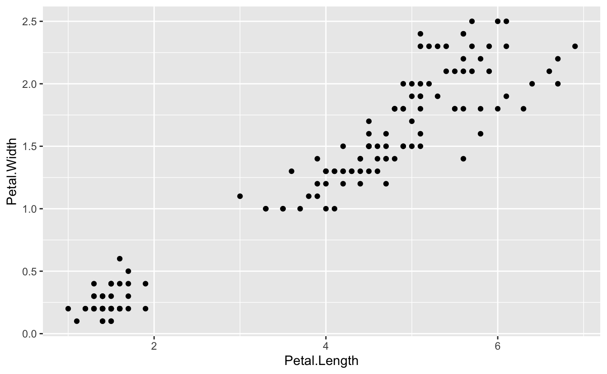

     

------------------------------------------------------------------------

## New To Code Club?

-   First, check out the [Code Club Computer Setup](/codeclub-setup/) instructions, which also has some pointers that might be helpful if you're new to R or RStudio.

-   Please open RStudio before Code Club to test things out -- if you run into issues, join the Zoom call early and we'll troubleshoot.

------------------------------------------------------------------------

## Session Goals

-   Learn the philosophy of **coding** a graphic.
-   Learn the basic **template** of a **ggplot2** graphic, so you can reuse it for multiple chart types.
-   Learn how you can quickly add visual information to a graphic using **aesthetics** and **layers**.

------------------------------------------------------------------------

## Intro: The ggplot2 philosophy

We have already seen that in R, instead of manually manipulating data frames as you might do when editing Excel sheets, we **code** the operations we want to perform using **dplyr** verbs like `select()`, `mutate()`, `inner_join()`, and so on.

In a similar way when performing visualization, instead of clicking on a chart type in Excel, we **code the chart** in R.

And just as **dplyr** gives us efficient ways to manipulate data frames, **ggplot2** (which is also part of the **tidyverse**) gives us efficient ways to manipulate charts/plots/graphics (we use these terms interchangeably).

The **gg** in **ggplot2** stands for *grammar of graphics*, an systematic approach for designing statistical plots developed by Leland Wilkinson. The idea behind this was to think about 'pulling apart' various plots into their shared component pieces, then provide code that could put them together again. We can then create new plots like we create new sentences (once we understand this grammar).

There are two parts to this. First, the 'nouns and verbs' we need to work with plots are very different than those we need to work with data frames. **ggplot2** is like a mini-language of its own, with its own verbs and syntax.

Second, this notion of pulling apart a graphic leads to the idea of *layers*. You can build up a plot of any complexity by *overlaying* different views of the same data.

There's a learning curve here for sure, but there are a couple of things that help us.

First, every graphic shares a *common template*. This is like thinking about the sentence "The cat sat on the mat" grammatically as the template `NP V PP` (`N`oun `P`hrase "The cat", `V`erb "sat", `P`repositional `P`hrase "on the mat"). Once you understand this structure you can "say" a *lot* of different things.

(And I mean a *lot*. The [ggplot cheat sheet](https://github.com/rstudio/cheatsheets/blob/master/data-visualization-2.1.pdf) gives an overview of the things you can do, but because this is a language, users can create their own [extensions](https://exts.ggplot2.tidyverse.org/gallery/) that you can also utilize.)

Second, they way we put layers together is identical to the way we use pipes. You can read `%>%` as "and then": `select()` and then `mutate()` and then `summarize()`. In graphics, we can say "show this layer, and then *overlay* this layer, and then *overlay* this layer", etc., using a very similar syntax.

 

------------------------------------------------------------------------

## Examples

So how does this work in practice? We'll work through visualizing the **iris** dataset that you've seen before. This is an extremely famous [dataset](https://en.m.wikipedia.org/wiki/Iris_flower_data_set) that was first analyzed by R. A. Fisher in 1936 *The use of multiple measurements in taxonomic problems*.

\*ggplot2\*\* is part of the tidyverse package so we need to load that first:

<pre class='chroma'><code class='language-r' data-lang='r'># this assumes you've already installed tidyverse
<a href='https://rdrr.io/r/base/library.html'>library</a>(<a href='http://tidyverse.tidyverse.org'>tidyverse</a>)

#&gt; ── Attaching packages ─────────────────────────────────────── tidyverse 1.3.0 ──

#&gt; ✔ ggplot2 3.3.2     ✔ purrr   0.3.4
#&gt; ✔ tibble  3.0.4     ✔ dplyr   0.8.5
#&gt; ✔ tidyr   1.0.3     ✔ stringr 1.4.0
#&gt; ✔ readr   1.3.1     ✔ forcats 0.5.0

#&gt; ── Conflicts ────────────────────────────────────────── tidyverse_conflicts() ──
#&gt; ✖ dplyr::filter() masks stats::filter()
#&gt; ✖ dplyr::lag()    masks stats::lag()
</code></pre>

And recall that the **iris** dataset (3 species, 50 observations per species) is automatically available to us:

<pre class='chroma'><code class='language-r' data-lang='r'><a href='https://rdrr.io/r/utils/head.html'>head</a>(iris)

#&gt;   Sepal.Length Sepal.Width Petal.Length Petal.Width Species
#&gt; 1          5.1         3.5          1.4         0.2  setosa
#&gt; 2          4.9         3.0          1.4         0.2  setosa
#&gt; 3          4.7         3.2          1.3         0.2  setosa
#&gt; 4          4.6         3.1          1.5         0.2  setosa
#&gt; 5          5.0         3.6          1.4         0.2  setosa
#&gt; 6          5.4         3.9          1.7         0.4  setosa
</code></pre>

What is the correlation between petal length and width in these species? Are longer petals also wider? We can visualize this with a scatterplot. But first let's look a the ggplot template:

    ggplot(data = <DATA>) + 
      <GEOM_FUNCTION>(mapping = aes(<MAPPINGS>))

These are the obligatory parts of any plot. The first argument to ggplot is the data frame:

<pre class='chroma'><code class='language-r' data-lang='r'>ggplot(data = iris)

</code></pre>

This is not very interesting! but it's notable that it is *something*. `ggplot()` has created a base coordinate system that we can add visual layers to. The *add a layer* operator is "**+**", which is the ggplot equivalent of the pipe symbol, and **it must occur at the end of the line**.

The next argument specifies the **kind** plot we want: scatterplot, bar chart, fitted line, boxplot, etc. ggplot refers to these as **geoms**: the geometrical object that a plot uses to represent data. You can see an overview of all these in the [cheat sheet](https://github.com/rstudio/cheatsheets/blob/master/data-visualization-2.1.pdf). The geom for a scatterplot is the point geom `geom_point()`.

But we also require a `mapping` argument, which relates the *variables* in the dataset we want to focus on to their *visual representation* in the plot. Finally we need to specify an "aesthetic" for the geometric objects in the plot, which will control things like shape, color, transparency, etc. Perhaps surprisingly, for a ggplot scatterplot, the x and y coordinates are aesthetics, since this controls not the shape or color, but the position of the points in the grid. Here is our complete plot:

<pre class='chroma'><code class='language-r' data-lang='r'>ggplot(data = iris) +
  geom_point(mapping = aes(x = Petal.Length, y = Petal.Width))

</code></pre>

The National Health and Nutrition Examination Survey [(NHANES) dataset](https://www.rdocumentation.org/packages/NHANES/versions/2.1.0/topics/NHANES) contains survey data obtained annually from \~5,000 individuals on a variety of health and lifestyle-related metrics. A subset of the data are available as an R package - install and load it...

<pre class='chroma'><code class='language-r' data-lang='r'><a href='https://rdrr.io/r/utils/install.packages.html'>install.packages</a>("NHANES", repos = "http://cran.us.r-project.org")

#&gt; 
#&gt; The downloaded binary packages are in
#&gt;   /var/folders/d4/h4yjqs1560zbsgvrrwbmbp5r0000gn/T//RtmpnW4Ybx/downloaded_packages

<a href='https://rdrr.io/r/base/library.html'>library</a>(NHANES)
</code></pre>

Now preview the dataset...

<pre class='chroma'><code class='language-r' data-lang='r'>glimpse(NHANES)

#&gt; Rows: 10,000
#&gt; Columns: 76
#&gt; $ ID               &lt;int&gt; 51624, 51624, 51624, 51625, 51630, 51638, 51646, 516…
#&gt; $ SurveyYr         &lt;fct&gt; 2009_10, 2009_10, 2009_10, 2009_10, 2009_10, 2009_10…
#&gt; $ Gender           &lt;fct&gt; male, male, male, male, female, male, male, female, …
#&gt; $ Age              &lt;int&gt; 34, 34, 34, 4, 49, 9, 8, 45, 45, 45, 66, 58, 54, 10,…
#&gt; $ AgeDecade        &lt;fct&gt;  30-39,  30-39,  30-39,  0-9,  40-49,  0-9,  0-9,  4…
#&gt; $ AgeMonths        &lt;int&gt; 409, 409, 409, 49, 596, 115, 101, 541, 541, 541, 795…
#&gt; $ Race1            &lt;fct&gt; White, White, White, Other, White, White, White, Whi…
#&gt; $ Race3            &lt;fct&gt; NA, NA, NA, NA, NA, NA, NA, NA, NA, NA, NA, NA, NA, …
#&gt; $ Education        &lt;fct&gt; High School, High School, High School, NA, Some Coll…
#&gt; $ MaritalStatus    &lt;fct&gt; Married, Married, Married, NA, LivePartner, NA, NA, …
#&gt; $ HHIncome         &lt;fct&gt; 25000-34999, 25000-34999, 25000-34999, 20000-24999, …
#&gt; $ HHIncomeMid      &lt;int&gt; 30000, 30000, 30000, 22500, 40000, 87500, 60000, 875…
#&gt; $ Poverty          &lt;dbl&gt; 1.36, 1.36, 1.36, 1.07, 1.91, 1.84, 2.33, 5.00, 5.00…
#&gt; $ HomeRooms        &lt;int&gt; 6, 6, 6, 9, 5, 6, 7, 6, 6, 6, 5, 10, 6, 10, 10, 4, 3…
#&gt; $ HomeOwn          &lt;fct&gt; Own, Own, Own, Own, Rent, Rent, Own, Own, Own, Own, …
#&gt; $ Work             &lt;fct&gt; NotWorking, NotWorking, NotWorking, NA, NotWorking, …
#&gt; $ Weight           &lt;dbl&gt; 87.4, 87.4, 87.4, 17.0, 86.7, 29.8, 35.2, 75.7, 75.7…
#&gt; $ Length           &lt;dbl&gt; NA, NA, NA, NA, NA, NA, NA, NA, NA, NA, NA, NA, NA, …
#&gt; $ HeadCirc         &lt;dbl&gt; NA, NA, NA, NA, NA, NA, NA, NA, NA, NA, NA, NA, NA, …
#&gt; $ Height           &lt;dbl&gt; 164.7, 164.7, 164.7, 105.4, 168.4, 133.1, 130.6, 166…
#&gt; $ BMI              &lt;dbl&gt; 32.22, 32.22, 32.22, 15.30, 30.57, 16.82, 20.64, 27.…
#&gt; $ BMICatUnder20yrs &lt;fct&gt; NA, NA, NA, NA, NA, NA, NA, NA, NA, NA, NA, NA, NA, …
#&gt; $ BMI_WHO          &lt;fct&gt; 30.0_plus, 30.0_plus, 30.0_plus, 12.0_18.5, 30.0_plu…
#&gt; $ Pulse            &lt;int&gt; 70, 70, 70, NA, 86, 82, 72, 62, 62, 62, 60, 62, 76, …
#&gt; $ BPSysAve         &lt;int&gt; 113, 113, 113, NA, 112, 86, 107, 118, 118, 118, 111,…
#&gt; $ BPDiaAve         &lt;int&gt; 85, 85, 85, NA, 75, 47, 37, 64, 64, 64, 63, 74, 85, …
#&gt; $ BPSys1           &lt;int&gt; 114, 114, 114, NA, 118, 84, 114, 106, 106, 106, 124,…
#&gt; $ BPDia1           &lt;int&gt; 88, 88, 88, NA, 82, 50, 46, 62, 62, 62, 64, 76, 86, …
#&gt; $ BPSys2           &lt;int&gt; 114, 114, 114, NA, 108, 84, 108, 118, 118, 118, 108,…
#&gt; $ BPDia2           &lt;int&gt; 88, 88, 88, NA, 74, 50, 36, 68, 68, 68, 62, 72, 88, …
#&gt; $ BPSys3           &lt;int&gt; 112, 112, 112, NA, 116, 88, 106, 118, 118, 118, 114,…
#&gt; $ BPDia3           &lt;int&gt; 82, 82, 82, NA, 76, 44, 38, 60, 60, 60, 64, 76, 82, …
#&gt; $ Testosterone     &lt;dbl&gt; NA, NA, NA, NA, NA, NA, NA, NA, NA, NA, NA, NA, NA, …
#&gt; $ DirectChol       &lt;dbl&gt; 1.29, 1.29, 1.29, NA, 1.16, 1.34, 1.55, 2.12, 2.12, …
#&gt; $ TotChol          &lt;dbl&gt; 3.49, 3.49, 3.49, NA, 6.70, 4.86, 4.09, 5.82, 5.82, …
#&gt; $ UrineVol1        &lt;int&gt; 352, 352, 352, NA, 77, 123, 238, 106, 106, 106, 113,…
#&gt; $ UrineFlow1       &lt;dbl&gt; NA, NA, NA, NA, 0.094, 1.538, 1.322, 1.116, 1.116, 1…
#&gt; $ UrineVol2        &lt;int&gt; NA, NA, NA, NA, NA, NA, NA, NA, NA, NA, NA, NA, NA, …
#&gt; $ UrineFlow2       &lt;dbl&gt; NA, NA, NA, NA, NA, NA, NA, NA, NA, NA, NA, NA, NA, …
#&gt; $ Diabetes         &lt;fct&gt; No, No, No, No, No, No, No, No, No, No, No, No, No, …
#&gt; $ DiabetesAge      &lt;int&gt; NA, NA, NA, NA, NA, NA, NA, NA, NA, NA, NA, NA, NA, …
#&gt; $ HealthGen        &lt;fct&gt; Good, Good, Good, NA, Good, NA, NA, Vgood, Vgood, Vg…
#&gt; $ DaysPhysHlthBad  &lt;int&gt; 0, 0, 0, NA, 0, NA, NA, 0, 0, 0, 10, 0, 4, NA, NA, 0…
#&gt; $ DaysMentHlthBad  &lt;int&gt; 15, 15, 15, NA, 10, NA, NA, 3, 3, 3, 0, 0, 0, NA, NA…
#&gt; $ LittleInterest   &lt;fct&gt; Most, Most, Most, NA, Several, NA, NA, None, None, N…
#&gt; $ Depressed        &lt;fct&gt; Several, Several, Several, NA, Several, NA, NA, None…
#&gt; $ nPregnancies     &lt;int&gt; NA, NA, NA, NA, 2, NA, NA, 1, 1, 1, NA, NA, NA, NA, …
#&gt; $ nBabies          &lt;int&gt; NA, NA, NA, NA, 2, NA, NA, NA, NA, NA, NA, NA, NA, N…
#&gt; $ Age1stBaby       &lt;int&gt; NA, NA, NA, NA, 27, NA, NA, NA, NA, NA, NA, NA, NA, …
#&gt; $ SleepHrsNight    &lt;int&gt; 4, 4, 4, NA, 8, NA, NA, 8, 8, 8, 7, 5, 4, NA, 5, 7, …
#&gt; $ SleepTrouble     &lt;fct&gt; Yes, Yes, Yes, NA, Yes, NA, NA, No, No, No, No, No, …
#&gt; $ PhysActive       &lt;fct&gt; No, No, No, NA, No, NA, NA, Yes, Yes, Yes, Yes, Yes,…
#&gt; $ PhysActiveDays   &lt;int&gt; NA, NA, NA, NA, NA, NA, NA, 5, 5, 5, 7, 5, 1, NA, 2,…
#&gt; $ TVHrsDay         &lt;fct&gt; NA, NA, NA, NA, NA, NA, NA, NA, NA, NA, NA, NA, NA, …
#&gt; $ CompHrsDay       &lt;fct&gt; NA, NA, NA, NA, NA, NA, NA, NA, NA, NA, NA, NA, NA, …
#&gt; $ TVHrsDayChild    &lt;int&gt; NA, NA, NA, 4, NA, 5, 1, NA, NA, NA, NA, NA, NA, 4, …
#&gt; $ CompHrsDayChild  &lt;int&gt; NA, NA, NA, 1, NA, 0, 6, NA, NA, NA, NA, NA, NA, 3, …
#&gt; $ Alcohol12PlusYr  &lt;fct&gt; Yes, Yes, Yes, NA, Yes, NA, NA, Yes, Yes, Yes, Yes, …
#&gt; $ AlcoholDay       &lt;int&gt; NA, NA, NA, NA, 2, NA, NA, 3, 3, 3, 1, 2, 6, NA, NA,…
#&gt; $ AlcoholYear      &lt;int&gt; 0, 0, 0, NA, 20, NA, NA, 52, 52, 52, 100, 104, 364, …
#&gt; $ SmokeNow         &lt;fct&gt; No, No, No, NA, Yes, NA, NA, NA, NA, NA, No, NA, NA,…
#&gt; $ Smoke100         &lt;fct&gt; Yes, Yes, Yes, NA, Yes, NA, NA, No, No, No, Yes, No,…
#&gt; $ Smoke100n        &lt;fct&gt; Smoker, Smoker, Smoker, NA, Smoker, NA, NA, Non-Smok…
#&gt; $ SmokeAge         &lt;int&gt; 18, 18, 18, NA, 38, NA, NA, NA, NA, NA, 13, NA, NA, …
#&gt; $ Marijuana        &lt;fct&gt; Yes, Yes, Yes, NA, Yes, NA, NA, Yes, Yes, Yes, NA, Y…
#&gt; $ AgeFirstMarij    &lt;int&gt; 17, 17, 17, NA, 18, NA, NA, 13, 13, 13, NA, 19, 15, …
#&gt; $ RegularMarij     &lt;fct&gt; No, No, No, NA, No, NA, NA, No, No, No, NA, Yes, Yes…
#&gt; $ AgeRegMarij      &lt;int&gt; NA, NA, NA, NA, NA, NA, NA, NA, NA, NA, NA, 20, 15, …
#&gt; $ HardDrugs        &lt;fct&gt; Yes, Yes, Yes, NA, Yes, NA, NA, No, No, No, No, Yes,…
#&gt; $ SexEver          &lt;fct&gt; Yes, Yes, Yes, NA, Yes, NA, NA, Yes, Yes, Yes, Yes, …
#&gt; $ SexAge           &lt;int&gt; 16, 16, 16, NA, 12, NA, NA, 13, 13, 13, 17, 22, 12, …
#&gt; $ SexNumPartnLife  &lt;int&gt; 8, 8, 8, NA, 10, NA, NA, 20, 20, 20, 15, 7, 100, NA,…
#&gt; $ SexNumPartYear   &lt;int&gt; 1, 1, 1, NA, 1, NA, NA, 0, 0, 0, NA, 1, 1, NA, NA, 1…
#&gt; $ SameSex          &lt;fct&gt; No, No, No, NA, Yes, NA, NA, Yes, Yes, Yes, No, No, …
#&gt; $ SexOrientation   &lt;fct&gt; Heterosexual, Heterosexual, Heterosexual, NA, Hetero…
#&gt; $ PregnantNow      &lt;fct&gt; NA, NA, NA, NA, NA, NA, NA, NA, NA, NA, NA, NA, NA, …
</code></pre>

To try out merging/joining, we'll create two separate data frames by pulling out some variables from this NHANES dataset. One will contain demographic variables, and the other with have some physical measurements. Then we'll join them back together. Let's create the two sub-datasets first...

<pre class='chroma'><code class='language-r' data-lang='r'>#Filter out rows with data from 2009-2010 and Age &gt; 5, 
#select a subset (4) of the variables, then get rid of 
#all duplicate rows. Assign the output to object 'dem_data'.
dem_data &lt;- NHANES %&gt;% 
            <a href='https://rdrr.io/r/stats/filter.html'>filter</a>(SurveyYr == "2009_10") %&gt;% 
            <a href='https://rdrr.io/r/stats/filter.html'>filter</a>(Age &gt; 5) %&gt;% 
            select(ID, Gender, Age, Education) %&gt;% 
            distinct()

#similar as above, but with a different filter and 
#selecting different variables. Save as 'phys_data'
phys_data &lt;- NHANES %&gt;% 
             <a href='https://rdrr.io/r/stats/filter.html'>filter</a>(SurveyYr == "2009_10") %&gt;% 
             <a href='https://rdrr.io/r/stats/filter.html'>filter</a>(Height &lt; 180)  %&gt;%
             select(ID, Height, BMI, Pulse) %&gt;% 
             distinct()
</code></pre>

Now explore them a bit...

<pre class='chroma'><code class='language-r' data-lang='r'>#view the first 6 rows of each - note the shared ID column
<a href='https://rdrr.io/r/utils/head.html'>head</a>(dem_data)

#&gt; # A tibble: 6 x 4
#&gt;      ID Gender   Age Education   
#&gt;   &lt;int&gt; &lt;fct&gt;  &lt;int&gt; &lt;fct&gt;       
#&gt; 1 51624 male      34 High School 
#&gt; 2 51630 female    49 Some College
#&gt; 3 51638 male       9 NA          
#&gt; 4 51646 male       8 NA          
#&gt; 5 51647 female    45 College Grad
#&gt; 6 51654 male      66 Some College

<a href='https://rdrr.io/r/utils/head.html'>head</a>(phys_data)

#&gt; # A tibble: 6 x 4
#&gt;      ID Height   BMI Pulse
#&gt;   &lt;int&gt;  &lt;dbl&gt; &lt;dbl&gt; &lt;int&gt;
#&gt; 1 51624   165.  32.2    70
#&gt; 2 51625   105.  15.3    NA
#&gt; 3 51630   168.  30.6    86
#&gt; 4 51638   133.  16.8    82
#&gt; 5 51646   131.  20.6    72
#&gt; 6 51647   167.  27.2    62

#preview in another way - note the different numbers of observations (rows)
glimpse(dem_data)

#&gt; Rows: 3,217
#&gt; Columns: 4
#&gt; $ ID        &lt;int&gt; 51624, 51630, 51638, 51646, 51647, 51654, 51656, 51657, 516…
#&gt; $ Gender    &lt;fct&gt; male, female, male, male, female, male, male, male, female,…
#&gt; $ Age       &lt;int&gt; 34, 49, 9, 8, 45, 66, 58, 54, 10, 58, 50, 9, 33, 60, 16, 56…
#&gt; $ Education &lt;fct&gt; High School, Some College, NA, NA, College Grad, Some Colle…

glimpse(phys_data)

#&gt; Rows: 3,021
#&gt; Columns: 4
#&gt; $ ID     &lt;int&gt; 51624, 51625, 51630, 51638, 51646, 51647, 51654, 51657, 51659,…
#&gt; $ Height &lt;dbl&gt; 164.7, 105.4, 168.4, 133.1, 130.6, 166.7, 169.5, 169.4, 141.8,…
#&gt; $ BMI    &lt;dbl&gt; 32.22, 15.30, 30.57, 16.82, 20.64, 27.24, 23.67, 26.03, 19.20,…
#&gt; $ Pulse  &lt;int&gt; 70, NA, 86, 82, 72, 62, 60, 76, 80, 94, 74, 92, 84, 76, 64, 70…
</code></pre>

Let's use the shared ID column to join the two datasets together. We'll do this in 4 different ways to compare different types of joins: `inner_join()`, `left_join()`, `right_join()`, and `full_join()`. Pay attention to the number of rows in the joined dataset each time and how it relates to the number of rows in each of the two individual datasets.

The basic structure of the dplyr `*_join()` functions is...

`*_join(dataframe 'x', dataframe 'y', by = shared column name)`

 

------------------------------------------------------------------------

## 1 - `inner_join()`

<pre class='chroma'><code class='language-r' data-lang='r'>#perform an inner join
join_inner &lt;- inner_join(dem_data, phys_data, by = "ID")

#preview the new object
<a href='https://rdrr.io/r/utils/head.html'>head</a>(join_inner)

#&gt; # A tibble: 6 x 7
#&gt;      ID Gender   Age Education    Height   BMI Pulse
#&gt;   &lt;int&gt; &lt;fct&gt;  &lt;int&gt; &lt;fct&gt;         &lt;dbl&gt; &lt;dbl&gt; &lt;int&gt;
#&gt; 1 51624 male      34 High School    165.  32.2    70
#&gt; 2 51630 female    49 Some College   168.  30.6    86
#&gt; 3 51638 male       9 NA             133.  16.8    82
#&gt; 4 51646 male       8 NA             131.  20.6    72
#&gt; 5 51647 female    45 College Grad   167.  27.2    62
#&gt; 6 51654 male      66 Some College   170.  23.7    60

#get dimensions
<a href='https://rdrr.io/r/base/dim.html'>dim</a>(join_inner)

#&gt; [1] 2806    7
</code></pre>

## 2 - `left_join()`

<pre class='chroma'><code class='language-r' data-lang='r'>#perform an left join
join_left &lt;- left_join(dem_data, phys_data, by = "ID")

#preview the new object
<a href='https://rdrr.io/r/utils/head.html'>head</a>(join_left)

#&gt; # A tibble: 6 x 7
#&gt;      ID Gender   Age Education    Height   BMI Pulse
#&gt;   &lt;int&gt; &lt;fct&gt;  &lt;int&gt; &lt;fct&gt;         &lt;dbl&gt; &lt;dbl&gt; &lt;int&gt;
#&gt; 1 51624 male      34 High School    165.  32.2    70
#&gt; 2 51630 female    49 Some College   168.  30.6    86
#&gt; 3 51638 male       9 NA             133.  16.8    82
#&gt; 4 51646 male       8 NA             131.  20.6    72
#&gt; 5 51647 female    45 College Grad   167.  27.2    62
#&gt; 6 51654 male      66 Some College   170.  23.7    60

#get dimensions
<a href='https://rdrr.io/r/base/dim.html'>dim</a>(join_left)

#&gt; [1] 3217    7
</code></pre>

## 3 - `right_join()`

<pre class='chroma'><code class='language-r' data-lang='r'>#perform an right join
join_right &lt;- right_join(dem_data, phys_data, by = "ID")

#preview the new object
<a href='https://rdrr.io/r/utils/head.html'>head</a>(join_right)

#&gt; # A tibble: 6 x 7
#&gt;      ID Gender   Age Education    Height   BMI Pulse
#&gt;   &lt;int&gt; &lt;fct&gt;  &lt;int&gt; &lt;fct&gt;         &lt;dbl&gt; &lt;dbl&gt; &lt;int&gt;
#&gt; 1 51624 male      34 High School    165.  32.2    70
#&gt; 2 51625 NA        NA NA             105.  15.3    NA
#&gt; 3 51630 female    49 Some College   168.  30.6    86
#&gt; 4 51638 male       9 NA             133.  16.8    82
#&gt; 5 51646 male       8 NA             131.  20.6    72
#&gt; 6 51647 female    45 College Grad   167.  27.2    62

#get dimensions
<a href='https://rdrr.io/r/base/dim.html'>dim</a>(join_right)

#&gt; [1] 3021    7
</code></pre>

## 4 - `full_join()`

<pre class='chroma'><code class='language-r' data-lang='r'>#perform an full join
join_full &lt;- full_join(dem_data, phys_data, by = "ID")

#preview the new object
<a href='https://rdrr.io/r/utils/head.html'>head</a>(join_full)

#&gt; # A tibble: 6 x 7
#&gt;      ID Gender   Age Education    Height   BMI Pulse
#&gt;   &lt;int&gt; &lt;fct&gt;  &lt;int&gt; &lt;fct&gt;         &lt;dbl&gt; &lt;dbl&gt; &lt;int&gt;
#&gt; 1 51624 male      34 High School    165.  32.2    70
#&gt; 2 51630 female    49 Some College   168.  30.6    86
#&gt; 3 51638 male       9 NA             133.  16.8    82
#&gt; 4 51646 male       8 NA             131.  20.6    72
#&gt; 5 51647 female    45 College Grad   167.  27.2    62
#&gt; 6 51654 male      66 Some College   170.  23.7    60

#get dimensions
<a href='https://rdrr.io/r/base/dim.html'>dim</a>(join_full)

#&gt; [1] 3432    7
</code></pre>

 

------------------------------------------------------------------------

# Breakout rooms

We're going to add to our backyard birds dataset. I found a dataset that has life history data for a large number of species (birds and others). We'll use species names to merge some of these life history variables in to the occurrence data we already have.

If you're new and haven't yet gotten the backyard bird dataset, get it first by running the code below. Otherwise, you can skip this step...

<pre class='chroma'><code class='language-r' data-lang='r'># create a directory called data that contains a subdirectory called birds
<a href='https://rdrr.io/r/base/files2.html'>dir.create</a>('data/birds/', recursive = TRUE)

#&gt; Warning in dir.create("data/birds/", recursive = TRUE): 'data/birds' already exists

# set the location of the file
birds_file_url &lt;-
'https://raw.githubusercontent.com/biodash/biodash.github.io/master/assets/data/birds/backyard-birds_Ohio.tsv'

# set the path for the downloaded file
birds_file &lt;- 'data/birds/backyard-birds_Ohio.tsv'
#download
<a href='https://rdrr.io/r/utils/download.file.html'>download.file</a>(url = birds_file_url, destfile = birds_file)
</code></pre>

Now **(everybody)**, read in the bird data for this session...

<pre class='chroma'><code class='language-r' data-lang='r'>birds_file &lt;- 'data/birds/backyard-birds_Ohio.tsv'
birds &lt;- read_tsv(birds_file)

#&gt; Parsed with column specification:
#&gt; cols(
#&gt;   class = col_character(),
#&gt;   order = col_character(),
#&gt;   family = col_character(),
#&gt;   genus = col_character(),
#&gt;   species = col_character(),
#&gt;   locality = col_character(),
#&gt;   stateProvince = col_character(),
#&gt;   decimalLatitude = col_double(),
#&gt;   decimalLongitude = col_double(),
#&gt;   eventDate = col_datetime(format = ""),
#&gt;   species_en = col_character(),
#&gt;   range = col_character()
#&gt; )
</code></pre>

## Exercise 1

Reduce the backyard bird dataset and keep just the following columns: **species, locality, stateProvince, eventDate, species_en**

Hints (click here)

  Use `select()` to pull out the columns you want.  

Solution (click here)

 

    birds <- birds %>% select(species, locality, stateProvince, eventDate, species_en)

------------------------------------------------------------------------

## Exercise 2

Check to make sure things look right - how many columns does the birds dataset now have?

Hints (click here)

  Use the [`dim()`](https://rdrr.io/r/base/dim.html) function. Or the [`ncol()`](https://rdrr.io/r/base/nrow.html) function. Or `glimpse()`. Or [`head()`](https://rdrr.io/r/utils/head.html). Or [`str()`](https://rdrr.io/r/utils/str.html). Or even [`summary()`](https://rdrr.io/r/base/summary.html). There's lots of ways to do this.  

Solution (click here)

 

<pre class='chroma'><code class='language-r' data-lang='r'><a href='https://rdrr.io/r/base/dim.html'>dim</a>(birds)

#&gt; [1] 311441     12
</code></pre>

------------------------------------------------------------------------

## Exercise 3

Now download and read in the new life history dataset (tab separated) available at <https://github.com/biodash/biodash.github.io/raw/master/assets/data/birds/esa_life_history_data_cc.tsv>. Then explore it a bit - how many rows and columns are there?

Hints (click here)

  Use the [`download.file()`](https://rdrr.io/r/utils/download.file.html) function like we did previously for the bird dataset. You'll need to define the arguments 'url' and 'destfile' inside the parentheses. You can put the file anywhere you want, but I'd suggest in the same directory as the bird file we got, so, for example, the destination file could be "data/birds/life_history_data.tsv".  

Solution (click here)

 

<pre class='chroma'><code class='language-r' data-lang='r'>#download the file from online and save it as a '.tsv' file (since it's tab delimited)
<a href='https://rdrr.io/r/utils/download.file.html'>download.file</a>(url = "https://github.com/biodash/biodash.github.io/raw/master/assets/data/birds/esa_life_history_data_cc.tsv",
destfile = "data/birds/life_history_data.tsv")

#read the data in to R as an object named 'life_hist'
life_hist &lt;- read_tsv(file = "data/birds/life_history_data.tsv")

#&gt; Parsed with column specification:
#&gt; cols(
#&gt;   class = col_character(),
#&gt;   order = col_character(),
#&gt;   family = col_character(),
#&gt;   genus = col_character(),
#&gt;   species = col_character(),
#&gt;   common_name = col_character(),
#&gt;   female_maturity_d = col_double(),
#&gt;   litter_or_clutch_size_n = col_double(),
#&gt;   litters_or_clutches_per_y = col_double(),
#&gt;   adult_body_mass_g = col_double(),
#&gt;   maximum_longevity_y = col_double(),
#&gt;   egg_mass_g = col_double(),
#&gt;   incubation_d = col_double(),
#&gt;   fledging_age_d = col_double(),
#&gt;   longevity_y = col_double(),
#&gt;   adult_svl_cm = col_double()
#&gt; )

#preview the data
glimpse(life_hist)

#&gt; Rows: 21,322
#&gt; Columns: 16
#&gt; $ class                     &lt;chr&gt; "Aves", "Aves", "Aves", "Aves", "Aves", "Av…
#&gt; $ order                     &lt;chr&gt; "Accipitriformes", "Accipitriformes", "Acci…
#&gt; $ family                    &lt;chr&gt; "Accipitridae", "Accipitridae", "Accipitrid…
#&gt; $ genus                     &lt;chr&gt; "Accipiter", "Accipiter", "Accipiter", "Acc…
#&gt; $ species                   &lt;chr&gt; "Accipiter albogularis", "Accipiter badius"…
#&gt; $ common_name               &lt;chr&gt; "Pied Goshawk", "Shikra", "Bicolored Hawk",…
#&gt; $ female_maturity_d         &lt;dbl&gt; NA, 363.468, NA, NA, 363.468, NA, NA, 547.8…
#&gt; $ litter_or_clutch_size_n   &lt;dbl&gt; NA, 3.250, 2.700, NA, 4.000, NA, 2.700, 4.2…
#&gt; $ litters_or_clutches_per_y &lt;dbl&gt; NA, 1, NA, NA, 1, NA, NA, 1, NA, 1, NA, 1, …
#&gt; $ adult_body_mass_g         &lt;dbl&gt; 251.500, 140.000, 345.000, 142.000, 203.500…
#&gt; $ maximum_longevity_y       &lt;dbl&gt; NA, NA, NA, NA, NA, NA, NA, 19.90000, NA, 2…
#&gt; $ egg_mass_g                &lt;dbl&gt; NA, 21.00, 32.00, NA, 21.85, NA, 32.00, 19.…
#&gt; $ incubation_d              &lt;dbl&gt; NA, 30.00, NA, NA, 32.50, NA, NA, 33.00, NA…
#&gt; $ fledging_age_d            &lt;dbl&gt; NA, 32.00, NA, NA, 42.50, NA, NA, 24.25, NA…
#&gt; $ longevity_y               &lt;dbl&gt; NA, NA, NA, NA, NA, NA, NA, 12.58333, NA, 1…
#&gt; $ adult_svl_cm              &lt;dbl&gt; NA, 30.00, 39.50, NA, 33.50, NA, 39.50, 29.…
</code></pre>

------------------------------------------------------------------------

## Exercise 4

This new dataset contains life history data for more than just birds. What Classes of organisms are represented in the 'Class' variable?

Hints (click here)

  Try using a combination of the `select()` and `distinct()` functions to pull out the column you're interested in, and then to get the distinct values, respectively.  

Solutions (click here)

<pre class='chroma'><code class='language-r' data-lang='r'>life_hist %&gt;% select(class) %&gt;% distinct()

#&gt; # A tibble: 3 x 1
#&gt;   class   
#&gt;   &lt;chr&gt;   
#&gt; 1 Aves    
#&gt; 2 Mammalia
#&gt; 3 Reptilia
</code></pre>

 

------------------------------------------------------------------------

## Exercise 5

Reduce the life history dataset down to keep just the rows for Class **Aves** and the columns **species, adult_body_mass_g, adult_svl_cm, longevity_y, litter_or_clutch_size_n**. What are the dimensions now?

Hints (click here)

Use [`filter()`](https://rdrr.io/r/stats/filter.html) along with an appropriate logical expression to keep the rows we want. Use `select()` to get the desired columns.  

Solutions (click here)

<pre class='chroma'><code class='language-r' data-lang='r'># pull out target rows and columns
life_hist_aves &lt;- life_hist %&gt;% 
                  <a href='https://rdrr.io/r/stats/filter.html'>filter</a>(class == "Aves") %&gt;% 
                  select(species, adult_body_mass_g, adult_svl_cm, longevity_y, litter_or_clutch_size_n)

<a href='https://rdrr.io/r/base/dim.html'>dim</a>(life_hist_aves)

#&gt; [1] 9802    5
</code></pre>

 

------------------------------------------------------------------------

## Exercise 6

Preview each dataset again, just to make sure you're clear about what's in each one. Are there any columns that are shared between the two?

Hints (click here)

Consider `glimpse()` or [`head()`](https://rdrr.io/r/utils/head.html) to preview the datasets (tibbles/data frames). If you want to use a function to find shared columns, try a combination of [`intersect()`](https://rdrr.io/r/base/sets.html) and [`names()`](https://rdrr.io/r/base/names.html)

Solutions (click here)

<pre class='chroma'><code class='language-r' data-lang='r'>glimpse(birds)

#&gt; Rows: 311,441
#&gt; Columns: 12
#&gt; $ class            &lt;chr&gt; "Aves", "Aves", "Aves", "Aves", "Aves", "Aves", "Ave…
#&gt; $ order            &lt;chr&gt; "Passeriformes", "Passeriformes", "Passeriformes", "…
#&gt; $ family           &lt;chr&gt; "Corvidae", "Corvidae", "Corvidae", "Corvidae", "Cor…
#&gt; $ genus            &lt;chr&gt; "Cyanocitta", "Cyanocitta", "Cyanocitta", "Cyanocitt…
#&gt; $ species          &lt;chr&gt; "Cyanocitta cristata", "Cyanocitta cristata", "Cyano…
#&gt; $ locality         &lt;chr&gt; "44805 Ashland", "45244 Cincinnati", "44132 Euclid",…
#&gt; $ stateProvince    &lt;chr&gt; "Ohio", "Ohio", "Ohio", "Ohio", "Ohio", "Ohio", "Ohi…
#&gt; $ decimalLatitude  &lt;dbl&gt; 40.86166, 39.10666, 41.60768, 39.24236, 39.28207, 41…
#&gt; $ decimalLongitude &lt;dbl&gt; -82.31558, -84.32972, -81.50085, -84.35545, -84.4688…
#&gt; $ eventDate        &lt;dttm&gt; 2007-02-16, 2007-02-17, 2007-02-17, 2007-02-19, 200…
#&gt; $ species_en       &lt;chr&gt; "Blue Jay", "Blue Jay", "Blue Jay", "Blue Jay", "Blu…
#&gt; $ range            &lt;chr&gt; NA, NA, NA, NA, NA, NA, NA, NA, NA, NA, NA, NA, NA, …

glimpse(life_hist_aves)

#&gt; Rows: 9,802
#&gt; Columns: 5
#&gt; $ species                 &lt;chr&gt; "Accipiter albogularis", "Accipiter badius", …
#&gt; $ adult_body_mass_g       &lt;dbl&gt; 251.500, 140.000, 345.000, 142.000, 203.500, …
#&gt; $ adult_svl_cm            &lt;dbl&gt; NA, 30.00, 39.50, NA, 33.50, NA, 39.50, 29.00…
#&gt; $ longevity_y             &lt;dbl&gt; NA, NA, NA, NA, NA, NA, NA, 12.58333, NA, 12.…
#&gt; $ litter_or_clutch_size_n &lt;dbl&gt; NA, 3.250, 2.700, NA, 4.000, NA, 2.700, 4.250…

<a href='https://rdrr.io/r/base/sets.html'>intersect</a>(<a href='https://rdrr.io/r/base/names.html'>names</a>(birds), <a href='https://rdrr.io/r/base/names.html'>names</a>(life_hist_aves))

#&gt; [1] "species"
</code></pre>

 

------------------------------------------------------------------------

## Exercise 7

Now lets join them together based on their shared variable. Not all species in the backyard bird (Ohio) dataset are included in the life history dataset. Likewise, there are life history data for many species that aren't in the Ohio dataset. We want to keep all the Ohio observations, and merge in life history data for species where it's availble, but we also don't want to add in life history data for species that aren't in the Ohio dataset. Choose an appropriate join function with those things in mind.

Hints (click here)

Try a `left_join()`, defining the Ohio backyard bird dataset as the 'x' dataset in the join and the life history data as the 'y' dataset. Get details on that function with `?left_join`.  

Solutions (click here)

<pre class='chroma'><code class='language-r' data-lang='r'>joined_data &lt;- left_join(x = birds, y = life_hist_aves, by = "species")
</code></pre>

 

------------------------------------------------------------------------

## Exercise 8

What are the longest- and shortest-living bird species in Ohio based on the data in the longevity_y column?

Hints (click here)

Try using `select()` to pull out just the columns species and longevity_y, then use `distinct()` to get the unique rows, then `arrange()` based on the longevity_y column. You might also find the dplyr function `desc()` helpful.

Alternatively, you could try grouping by species, then use summarise() to get either the max, min, or mean value for longevity_y for each species (there's just one value for each species, so all of those statistics give the same value in this case). Then sort (arrange) the resulting summarized data frame on the longevity value.

 

Solutions (click here)

<pre class='chroma'><code class='language-r' data-lang='r'>#option 1 - shortest-lived birds
joined_data %&gt;% select(species, longevity_y) %&gt;% 
                distinct() %&gt;% 
                arrange(longevity_y)

#&gt; # A tibble: 171 x 2
#&gt;    species              longevity_y
#&gt;    &lt;chr&gt;                      &lt;dbl&gt;
#&gt;  1 Loxia leucoptera            4   
#&gt;  2 Spiza americana             4   
#&gt;  3 Certhia americana           4.6 
#&gt;  4 Acanthis hornemanni         4.6 
#&gt;  5 Tringa flavipes             4.75
#&gt;  6 Podiceps grisegena          4.8 
#&gt;  7 Calcarius lapponicus        5   
#&gt;  8 Anthus rubescens            5.1 
#&gt;  9 Perdix perdix               5.17
#&gt; 10 Regulus satrapa             5.32
#&gt; # … with 161 more rows

#option 1 - longest-lived birds
joined_data %&gt;% select(species, longevity_y) %&gt;% 
                distinct() %&gt;% 
                arrange(desc(longevity_y))

#&gt; # A tibble: 171 x 2
#&gt;    species                  longevity_y
#&gt;    &lt;chr&gt;                          &lt;dbl&gt;
#&gt;  1 Larus argentatus                33.4
#&gt;  2 Larus glaucoides                33  
#&gt;  3 Larus thayeri                   33  
#&gt;  4 Haliaeetus leucocephalus        33.0
#&gt;  5 Larus fuscus                    32.8
#&gt;  6 Aquila chrysaetos               32  
#&gt;  7 Anas platyrhynchos              29  
#&gt;  8 Larus delawarensis              28.6
#&gt;  9 Asio otus                       27.8
#&gt; 10 Cygnus olor                     27.7
#&gt; # … with 161 more rows

#option 2 - shortest-lived birds
joined_data %&gt;% group_by(species) %&gt;% 
                summarise(longevity = <a href='https://rdrr.io/r/base/Extremes.html'>max</a>(longevity_y)) %&gt;% 
                arrange(longevity)

#&gt; # A tibble: 171 x 2
#&gt;    species              longevity
#&gt;    &lt;chr&gt;                    &lt;dbl&gt;
#&gt;  1 Loxia leucoptera          4   
#&gt;  2 Spiza americana           4   
#&gt;  3 Acanthis hornemanni       4.6 
#&gt;  4 Certhia americana         4.6 
#&gt;  5 Tringa flavipes           4.75
#&gt;  6 Podiceps grisegena        4.8 
#&gt;  7 Calcarius lapponicus      5   
#&gt;  8 Anthus rubescens          5.1 
#&gt;  9 Perdix perdix             5.17
#&gt; 10 Regulus satrapa           5.32
#&gt; # … with 161 more rows

    
#option 2 - longest-lived birds
joined_data %&gt;% group_by(species) %&gt;% 
                summarise(longevity = <a href='https://rdrr.io/r/base/Extremes.html'>max</a>(longevity_y)) %&gt;% 
                arrange(desc(longevity))

#&gt; # A tibble: 171 x 2
#&gt;    species                  longevity
#&gt;    &lt;chr&gt;                        &lt;dbl&gt;
#&gt;  1 Larus argentatus              33.4
#&gt;  2 Larus glaucoides              33  
#&gt;  3 Larus thayeri                 33  
#&gt;  4 Haliaeetus leucocephalus      33.0
#&gt;  5 Larus fuscus                  32.8
#&gt;  6 Aquila chrysaetos             32  
#&gt;  7 Anas platyrhynchos            29  
#&gt;  8 Larus delawarensis            28.6
#&gt;  9 Asio otus                     27.8
#&gt; 10 Cygnus olor                   27.7
#&gt; # … with 161 more rows
</code></pre>

 

------------------------------------------------------------------------

## Bonus time!

## Bonus 1

What species in Ohio has the largest ratio of adult body mass to length (measured as snout vent length, or 'adult_svl_cm')?

Hints (click here)

Use mutate() to create a new variable containing the body mass divided by svl, then arrange the dataset using that new variable to get the species with the highest value.

Solutions (click here)

<pre class='chroma'><code class='language-r' data-lang='r'>joined_data %&gt;% mutate(ratio = adult_body_mass_g/adult_svl_cm) %&gt;% 
                select(species_en, ratio) %&gt;% distinct() %&gt;% 
                arrange(desc(ratio))

#&gt; # A tibble: 170 x 2
#&gt;    species_en     ratio
#&gt;    &lt;chr&gt;          &lt;dbl&gt;
#&gt;  1 Mute Swan       71.8
#&gt;  2 Wild Turkey     68.0
#&gt;  3 Trumpeter Swan  64.9
#&gt;  4 Bald Eagle      59.2
#&gt;  5 Golden Eagle    56.2
#&gt;  6 Canada Goose    48.3
#&gt;  7 Tundra Swan     47.0
#&gt;  8 Cackling Goose  44.4
#&gt;  9 Snow Goose      35.1
#&gt; 10 Snowy Owl       32.8
#&gt; # … with 160 more rows
</code></pre>

 

------------------------------------------------------------------------

### Bonus 2

There are 2 additional joins we haven't talked about - semi_join() and anti_join(). Take a look at the documentation to see what these do. Use one of them to find what species in the backyard birds dataset are not in the life history dataset.

Hints (click here)

Use anti_join() and distinct().

Solutions (click here)

<pre class='chroma'><code class='language-r' data-lang='r'>anti_join(birds, life_hist_aves, by = "species") %&gt;% select(species, species_en) %&gt;%
                                                     distinct()

#&gt; # A tibble: 6 x 2
#&gt;   species                       species_en           
#&gt;   &lt;chr&gt;                         &lt;chr&gt;                
#&gt; 1 Dendrocopos pubescens         Downy Woodpecker     
#&gt; 2 Spizelloides arborea          American Tree Sparrow
#&gt; 3 Otus asio                     Eastern Screech Owl  
#&gt; 4 Larus minutus                 Little Gull          
#&gt; 5 Anas rubripes x platyrhynchos NA                   
#&gt; 6 NA                            NA
</code></pre>

------------------------------------------------------------------------

## Bonus 3

The life history dataset we downloaded above is actually a modified version of the original file, which is located at '<http://www.esapubs.org/archive/ecol/E096/269/Data_Files/Amniote_Database_Aug_2015.csv>'

Try starting with the original file and repeating what we did above - merging the variables **species, adult_body_mass_g, adult_svl_cm, longevity_y, litter_or_clutch_size_n** in to the original birds dataset. First, make sure to get it read in correctly. Then pay attention to the species column in the life history dataset - what needs to be done before a join/merge can be performed?

Hints (click here)

Pay attention to how missing data are coded in this dataset (it's -999). Also, data are very sparse for some of the variables - in other words, they have lots of missing data. This seems to cause a problem with the read_csv function, as it only considers the first 1000 rows for the purpose of defining the class of each column. This can be a problem if all of the first 1000 rows are missing. Finally, it appears that even though this is a comma separated file (commas define the column breaks), there are a few instances where commas are used within a field. This happens in the 'common name' column in a few cases where multiple common names are listed for a specific observation. This is one example of something that can become quite frustrating when trying to get data loaded in, and is worth keeping an eye out for. Fortunately, in our case, it only seems to happen for non-bird species in this dataset, which we filter out anyway, so it can be dealt with. However, if it had impacted any of the bird observations, I think fixing this might require a solution outside of R - possibly a command line approach.

 

Solutions (click here)

<pre class='chroma'><code class='language-r' data-lang='r'>#download
<a href='https://rdrr.io/r/utils/download.file.html'>download.file</a>(url = "http://www.esapubs.org/archive/ecol/E096/269/Data_Files/Amniote_Database_Aug_2015.csv", 
destfile = "data/birds/orig_life_history.csv")

#read the data in to R as an object named 'full_life_hist'

full_life_hist &lt;- read_csv("data/birds/orig_life_history.csv", 
                  na = "-999", 
                  col_types = cols(birth_or_hatching_svl_cm = col_double(),
                  weaning_d = col_double(),gestation_d = col_double(), 
                  weaning_weight_g = col_double(), 
                  male_svl_cm = col_double(), 
                  female_svl_cm = col_double(),
                  no_sex_svl_cm = col_double(), 
                  female_body_mass_at_maturity_g = col_double(),
                  female_svl_at_maturity_cm = col_double()))

#get the original version of the birds dataset
birds &lt;- read_tsv('data/birds/backyard-birds_Ohio.tsv')

#&gt; Parsed with column specification:
#&gt; cols(
#&gt;   class = col_character(),
#&gt;   order = col_character(),
#&gt;   family = col_character(),
#&gt;   genus = col_character(),
#&gt;   species = col_character(),
#&gt;   locality = col_character(),
#&gt;   stateProvince = col_character(),
#&gt;   decimalLatitude = col_double(),
#&gt;   decimalLongitude = col_double(),
#&gt;   eventDate = col_datetime(format = ""),
#&gt;   species_en = col_character(),
#&gt;   range = col_character()
#&gt; )

#subset each for the columns and rows we want
life_hist_aves &lt;- full_life_hist %&gt;% <a href='https://rdrr.io/r/stats/filter.html'>filter</a>(class == "Aves") %&gt;% 
                  select(species, adult_body_mass_g, adult_svl_cm, longevity_y, litter_or_clutch_size_n)

birds &lt;- birds %&gt;% select(species, locality, stateProvince, eventDate, species_en)

glimpse(birds)

#&gt; Rows: 311,441
#&gt; Columns: 5
#&gt; $ species       &lt;chr&gt; "Cyanocitta cristata", "Cyanocitta cristata", "Cyanocit…
#&gt; $ locality      &lt;chr&gt; "44805 Ashland", "45244 Cincinnati", "44132 Euclid", "4…
#&gt; $ stateProvince &lt;chr&gt; "Ohio", "Ohio", "Ohio", "Ohio", "Ohio", "Ohio", "Ohio",…
#&gt; $ eventDate     &lt;dttm&gt; 2007-02-16, 2007-02-17, 2007-02-17, 2007-02-19, 2007-0…
#&gt; $ species_en    &lt;chr&gt; "Blue Jay", "Blue Jay", "Blue Jay", "Blue Jay", "Blue J…

glimpse(life_hist_aves)

#&gt; Rows: 9,802
#&gt; Columns: 5
#&gt; $ species                 &lt;chr&gt; "albogularis", "badius", "bicolor", "brachyur…
#&gt; $ adult_body_mass_g       &lt;dbl&gt; 251.500, 140.000, 345.000, 142.000, 203.500, …
#&gt; $ adult_svl_cm            &lt;dbl&gt; NA, 30.00, 39.50, NA, 33.50, NA, 39.50, 29.00…
#&gt; $ longevity_y             &lt;dbl&gt; NA, NA, NA, NA, NA, NA, NA, 12.58333, NA, 12.…
#&gt; $ litter_or_clutch_size_n &lt;dbl&gt; NA, 3.250, 2.700, NA, 4.000, NA, 2.700, 4.250…

#notice the species column in the life history data doesn't include the genus name. Since the names don't match in the species column from each dataset, a join won't work. Add the genus variable in from the original life history data...

life_hist_aves &lt;- full_life_hist %&gt;% <a href='https://rdrr.io/r/stats/filter.html'>filter</a>(class == "Aves") %&gt;% 
                  select(genus, species, adult_body_mass_g, adult_svl_cm, longevity_y, litter_or_clutch_size_n)

#now use mutate to replace the species column so it includes both the genus and species...

life_hist_aves &lt;- life_hist_aves %&gt;% mutate(species = <a href='https://rdrr.io/r/base/paste.html'>paste0</a>(genus, " ", species)) %&gt;% select(-genus)

#preview again
glimpse(birds)

#&gt; Rows: 311,441
#&gt; Columns: 5
#&gt; $ species       &lt;chr&gt; "Cyanocitta cristata", "Cyanocitta cristata", "Cyanocit…
#&gt; $ locality      &lt;chr&gt; "44805 Ashland", "45244 Cincinnati", "44132 Euclid", "4…
#&gt; $ stateProvince &lt;chr&gt; "Ohio", "Ohio", "Ohio", "Ohio", "Ohio", "Ohio", "Ohio",…
#&gt; $ eventDate     &lt;dttm&gt; 2007-02-16, 2007-02-17, 2007-02-17, 2007-02-19, 2007-0…
#&gt; $ species_en    &lt;chr&gt; "Blue Jay", "Blue Jay", "Blue Jay", "Blue Jay", "Blue J…

glimpse(life_hist_aves)

#&gt; Rows: 9,802
#&gt; Columns: 5
#&gt; $ species                 &lt;chr&gt; "Accipiter albogularis", "Accipiter badius", …
#&gt; $ adult_body_mass_g       &lt;dbl&gt; 251.500, 140.000, 345.000, 142.000, 203.500, …
#&gt; $ adult_svl_cm            &lt;dbl&gt; NA, 30.00, 39.50, NA, 33.50, NA, 39.50, 29.00…
#&gt; $ longevity_y             &lt;dbl&gt; NA, NA, NA, NA, NA, NA, NA, 12.58333, NA, 12.…
#&gt; $ litter_or_clutch_size_n &lt;dbl&gt; NA, 3.250, 2.700, NA, 4.000, NA, 2.700, 4.250…

#now we can join
joined_data &lt;- left_join(birds, life_hist_aves, by = "species")
</code></pre>

 

------------------------------------------------------------------------

       

