     

------------------------------------------------------------------------

Prep homework
-------------

### Basic computer setup

-   If you didn't already do this, please follow the [Code Club Computer Setup](/codeclub-setup/04_ggplot2/) instructions, which also has pointers for if you're new to R or RStudio.

-   If you're able to do so, please open RStudio a bit before Code Club starts -- and in case you run into issues, please join the Zoom call early and we'll troubleshoot.

### New to ggplot?

Check out the last Code Club [Session 4](/codeclub/) on Visualizing Data.

If you've never used `ggplot2` before (or even if you have), you may find [this cheat sheet](https://github.com/rstudio/cheatsheets/blob/master/data-visualization-2.1.pdf) useful.

 

------------------------------------------------------------------------

Getting Started
---------------

### Script for today's session

<pre class='chroma'><code class='language-r' data-lang='r'># directory for Code Club Session 2:
<a href='https://rdrr.io/r/base/files2.html'>dir.create</a>("S05")

# directory for our script
# ("recursive" to create two levels at once.)
<a href='https://rdrr.io/r/base/files2.html'>dir.create</a>("S05/scripts/")

# save the url location for today's script
todays_R_script &lt;- 'https://raw.githubusercontent.com/biodash/biodash.github.io/master/content/codeclub/05_ggplot-round-2/Session5_ggplot2.R'

# indicate the name of the new script file
Session5_script &lt;- "S05/scripts/Session5_script.R"

# go get that file! 
<a href='https://rdrr.io/r/utils/download.file.html'>download.file</a>(url = todays_R_script,
              destfile = Session5_script)
</code></pre>

 

------------------------------------------------------------------------

1 - Why visualize our data?
---------------------------

Artwork by [Allison Horst](https://github.com/allisonhorst/stats-illustrations)

We make data visualizations for two main reasons:

1.  To explore our data
2.  To share our data with others

Often, we think about figure generation as the last part of the scientic process, something you do as you prepare a manuscript for publication. I hope to convince you that exploring your data, and making exploratory plots is a critical part of the data analysis and interpretation process.

Today we will be using [`ggplot2`](https://ggplot2.tidyverse.org/) to make a series of plots that help us better understand the underlying structure in our dataset.

**When summary statistics don't cut it**

This ["Datasaurus Dozen"](https://www.autodesk.com/research/publications/same-stats-different-graphs) shows the value of looking at your data beyond means and standard deviations. In the gif above, created by [Alberto Cairo](http://albertocairo.com/), each of these 13 datasets have identical means, standard eviations, and correlations to two decimal places. And one of the datasets is a dinosaur!

 

**What will we go over today**

These geoms will help you to get better acquainted with your data.

-   [`geom_col()`](https://ggplot2.tidyverse.org/reference/geom_bar.html) - makes bar plots. I will show you how to do this and then recommend that you don't.
-   [`geom_boxplot()`](https://ggplot2.tidyverse.org/reference/geom_boxplot.html) - makes infinitely useful boxplots.
-   [`geom_violin()`](https://ggplot2.tidyverse.org/reference/geom_violin.html) - makes violin plots, a hybrid between a boxplot and a density plot. Very musical.
-   [`geom_density_ridges()`](https://mran.microsoft.com/snapshot/2017-12-11/web/packages/ggridges/vignettes/introduction.html) - a density plot giving you the impression of a side view of a mountain range. Requires the package [`ggridges`](https://cran.r-project.org/web/packages/ggridges/index.html)
-   [`geom_jitter()`](https://ggplot2.tidyverse.org/reference/geom_jitter.html) - adds all datapoints to your plot, and jitters them to handle overplotting.

I will also go over a few tricks along the way, including [`coord_flip()`](https://ggplot2.tidyverse.org/reference/coord_flip.html), adding labels using [`labs()`](https://ggplot2.tidyverse.org/reference/labs.html), and changing the overall look of the plot with [`theme()`](https://ggplot2.tidyverse.org/reference/theme.html), or pre-set themes like [`theme_classic()`](https://ggplot2.tidyverse.org/reference/ggtheme.html) which is my go-to.

 

------------------------------------------------------------------------

2 - Accessing our data
----------------------

**Let's get set up and grab some data so that we can learn more about penguins (and ggplot2)**

-   You can do this locally, or at OSC. You can find instructions if you are having trouble [here](/codeclub-setup/).

First load your libraries.

<pre class='chroma'><code class='language-r' data-lang='r'><a href='https://rdrr.io/r/base/library.html'>library</a>(<a href='http://tidyverse.tidyverse.org'>tidyverse</a>)
</code></pre>

Then let's access the wintry [palmerpenguins](https://allisonhorst.github.io/palmerpenguins/) dataset. We will then look at `penguins`, the dataset we will be using for the first part of today's Code Club. This data is collected on penguins from the [Palmer Station Antarctica Long-Term Ecological Research](https://pal.lternet.edu/) study area.

Artwork by [Allison Horst](https://github.com/allisonhorst/palmerpenguins)

<pre class='chroma'><code class='language-r' data-lang='r'><a href='https://rdrr.io/r/utils/install.packages.html'>install.packages</a>("palmerpenguins")
</code></pre>

<pre class='chroma'><code class='language-r' data-lang='r'><a href='https://rdrr.io/r/base/library.html'>library</a>(<a href='https://allisonhorst.github.io/palmerpenguins/'>palmerpenguins</a>)
</code></pre>

Let's look at the data in `penguins`.

<pre class='chroma'><code class='language-r' data-lang='r'># look at the first 6 rows, all columns
<a href='https://rdrr.io/r/utils/head.html'>head</a>(penguins)

#&gt; # A tibble: 6 x 8
#&gt;   species island bill_length_mm bill_depth_mm flipper_length_… body_mass_g sex  
#&gt;   &lt;fct&gt;   &lt;fct&gt;           &lt;dbl&gt;         &lt;dbl&gt;            &lt;int&gt;       &lt;int&gt; &lt;fct&gt;
#&gt; 1 Adelie  Torge…           39.1          18.7              181        3750 male 
#&gt; 2 Adelie  Torge…           39.5          17.4              186        3800 fema…
#&gt; 3 Adelie  Torge…           40.3          18                195        3250 fema…
#&gt; 4 Adelie  Torge…           NA            NA                 NA          NA NA   
#&gt; 5 Adelie  Torge…           36.7          19.3              193        3450 fema…
#&gt; 6 Adelie  Torge…           39.3          20.6              190        3650 male 
#&gt; # … with 1 more variable: year &lt;int&gt;

# check the structure
# this tell us what is contained within our df
glimpse(penguins)

#&gt; Rows: 344
#&gt; Columns: 8
#&gt; $ species           &lt;fct&gt; Adelie, Adelie, Adelie, Adelie, Adelie, Adelie, Ade…
#&gt; $ island            &lt;fct&gt; Torgersen, Torgersen, Torgersen, Torgersen, Torgers…
#&gt; $ bill_length_mm    &lt;dbl&gt; 39.1, 39.5, 40.3, NA, 36.7, 39.3, 38.9, 39.2, 34.1,…
#&gt; $ bill_depth_mm     &lt;dbl&gt; 18.7, 17.4, 18.0, NA, 19.3, 20.6, 17.8, 19.6, 18.1,…
#&gt; $ flipper_length_mm &lt;int&gt; 181, 186, 195, NA, 193, 190, 181, 195, 193, 190, 18…
#&gt; $ body_mass_g       &lt;int&gt; 3750, 3800, 3250, NA, 3450, 3650, 3625, 4675, 3475,…
#&gt; $ sex               &lt;fct&gt; male, female, female, NA, female, male, female, mal…
#&gt; $ year              &lt;int&gt; 2007, 2007, 2007, 2007, 2007, 2007, 2007, 2007, 200…
</code></pre>

This dataset contains the following measurements about penguins at Palmer Station in Antarctica:

-   `species`
-   `island`
-   `bill_length_mm`
-   `bill_depth_mm`
-   `flipper_length_mm`
-   `body_mass_g`
-   `sex`
-   `year`

We are going to be plotting to get an understanding of `bill_length_mm` which is the length of the bill from the penguins face, protruding outwards (and more easily understood in the image below).

Artwork by [Allison Horst](https://github.com/allisonhorst/palmerpenguins)

 

------------------------------------------------------------------------

3 - Removing NAs
----------------

Sometimes you will have NAs (or missing data). That might be informative to you, but here we are going to remove missing data using [`drop_na()`](https://tidyr.tidyverse.org/reference/drop_na.html), and assign it to a new dataframe called `penguins_noNA`.

<pre class='chroma'><code class='language-r' data-lang='r'># check dimensions of penguins
<a href='https://rdrr.io/r/base/dim.html'>dim</a>(penguins)

#&gt; [1] 344   8

# remove NAs
penguins_noNA &lt;- penguins %&gt;%
  drop_na()

<a href='https://rdrr.io/r/base/dim.html'>dim</a>(penguins_noNA) # we have removed 11 observations

#&gt; [1] 333   8
</code></pre>

**Note - by removing NAs, we have gotten rid of 11 observations**

 

------------------------------------------------------------------------

4 - Bar charts with `geom_col()` and `stat_summary()`
-----------------------------------------------------

Often, people use bar charts, representing the height or the length of the bar as proportional to the average value that it represents. These charts are sometimes called dynamite plots because they resemble (when they have an error bar with whisker) those cartoon style dynamite sticks. Pow!

However, these bar charts, even if you add a standard deviation/error, really can hide the true distribution of your data, and for this reason, I and [others](https://simplystatistics.org/2019/02/21/dynamite-plots-must-die/) hope you don't select to make them.

I hope after today, you see that there is always a better chart type to make than a bar chart. But I will show you how to make them anyway.

Before we plot, let's calculate some summary statistics so we know what we should expect.

<pre class='chroma'><code class='language-r' data-lang='r'># calculating mean bill_length_mm by species
penguins_noNA %&gt;%
  group_by(species) %&gt;%
  summarize(mean_bill_length = <a href='https://rdrr.io/r/base/mean.html'>mean</a>(bill_length_mm))

#&gt; `summarise()` ungrouping output (override with `.groups` argument)

#&gt; # A tibble: 3 x 2
#&gt;   species   mean_bill_length
#&gt;   &lt;fct&gt;                &lt;dbl&gt;
#&gt; 1 Adelie                38.8
#&gt; 2 Chinstrap             48.8
#&gt; 3 Gentoo                47.6
</code></pre>

Just calling `geom_col()` does not give us what we want. Look at the y-axis scale and how out of line this is with our summary statistics.

<pre class='chroma'><code class='language-r' data-lang='r'># bar plot with geom_col()
# this is wrong!
penguins_noNA %&gt;%
  ggplot(aes(x = species, y = bill_length_mm)) +
  geom_col()

</code></pre>

Using `geom_col()` the right way.

<pre class='chroma'><code class='language-r' data-lang='r'># bar plot, the right way with geom_col()
penguins_noNA %&gt;%
  group_by(species) %&gt;%
  summarize(mean_bill_length = <a href='https://rdrr.io/r/base/mean.html'>mean</a>(bill_length_mm)) %&gt;%
  ggplot(aes(x = species, y = mean_bill_length)) +
  geom_col()

#&gt; `summarise()` ungrouping output (override with `.groups` argument)

</code></pre>

<pre class='chroma'><code class='language-r' data-lang='r'># or you could do this in a less bulky way with stat_summary()
penguins_noNA %&gt;%
  ggplot(aes(x = species, y = bill_length_mm)) +
  stat_summary(fun = "mean", geom = "bar")

</code></pre>

 

------------------------------------------------------------------------

5 - Boxplots with `geom_boxplot()`
----------------------------------

A boxplot has the benefit of showing you more than the median and the standard deviation, so you can better see the true distribution of your data. In `geom_boxplot()`:

-   lower whisker = smallest observation greater than or equal to lower hinge - 1.5 \* IQR
-   lower hinge/bottom line of box part of boxplot = 25% quantile
-   middle = median, 50% quantile
-   upper hinge/top line of box part of boxplot = 75% quantile
-   upper whisker = largest observation less than or equal to upper hinge + 1.5 \* IQR

<pre class='chroma'><code class='language-r' data-lang='r'># vertical boxplot
penguins_noNA %&gt;%
  ggplot(aes(x = species, y = bill_length_mm)) +
  geom_boxplot()

</code></pre>
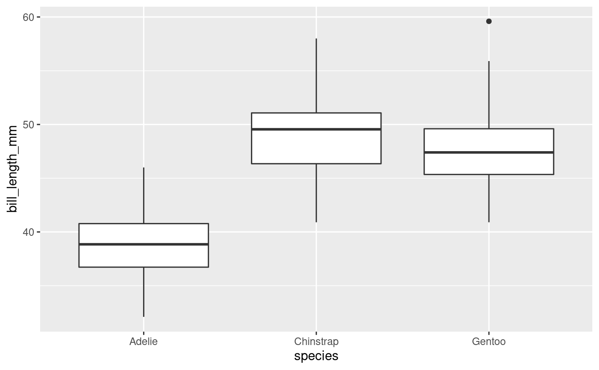

Adding `coord_flip()` makes your vertical boxplot horizontal. You could do the same thing by flipping the variables on the `x` and `y` mappings.

<pre class='chroma'><code class='language-r' data-lang='r'># horizontal boxplot
penguins_noNA %&gt;%
  ggplot(aes(x = species, y = bill_length_mm)) +
  geom_boxplot() +
  coord_flip()

</code></pre>
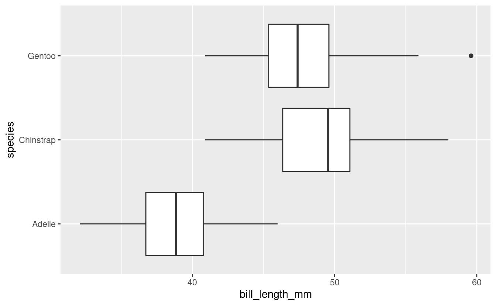

Look at how much more information we have here than in our bar plots!

 

------------------------------------------------------------------------

5 - Violin plots with `geom_violin()`
-------------------------------------

A violin plot is boxplot-esque, but shows a mirrored density distribution. This type of plot is useful when you are trying to particularly show data distribution.

Note here I have also mapped `species` to `color`, within the `aes` statement so it will apply globally to this plot.

<pre class='chroma'><code class='language-r' data-lang='r'># violin plot
penguins_noNA %&gt;%
  ggplot(aes(x = species, y = bill_length_mm, color = species)) +
  geom_violin()

</code></pre>
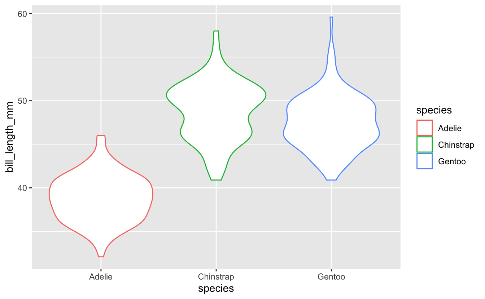

Adding `geom_point()` lets you add another layer of all the actual data points, on top of your violin plot. Remember that this is inherent in the design of ggplot2, that you can layer your plots, of different types, on top of each other.

<pre class='chroma'><code class='language-r' data-lang='r'># violin plot with data points overlaid
penguins_noNA %&gt;%
  ggplot(aes(x = species, y = bill_length_mm, fill = species)) +
  geom_violin() +
  geom_point()

</code></pre>
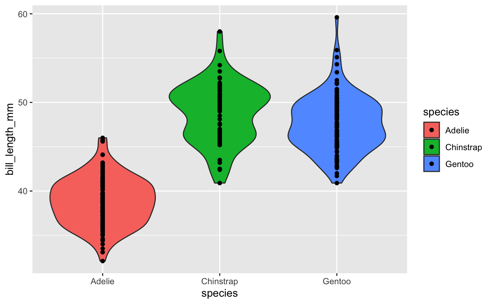

Note, I am now mapping `species` to `fill` instead of `color`. See the difference?

This doesn't look too good because of overplotting, i.e., the smear of datapoints that doesn't give you much information about distribution.

We can add `geom_jitter()` to introduce some small amount of randomness to our points to make us able to see them better. Seeing all your data points also lets the reader easily get a sense of your sample size.

<pre class='chroma'><code class='language-r' data-lang='r'># violin plot with data points jittered
penguins_noNA %&gt;%
  ggplot(aes(x = species, y = bill_length_mm, fill = species)) +
  geom_violin() +
  geom_jitter()

</code></pre>
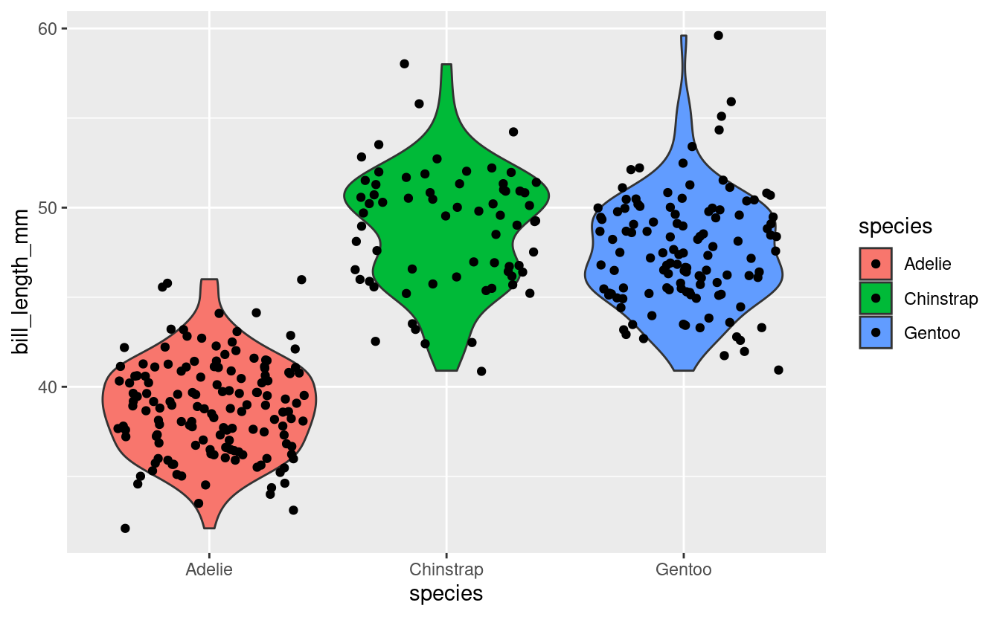

`geom_jitter()` is a specialized version of `geom_point()`, but you could replace the `geom_jitter()` call with `geom_point(position = "jitter)` and get the same result. You can also use `geom_point(position = position_jitterdodge())` if you only want jitter in the x, and don't want any jitter in the y.

Wow, we now have so much more information about our data!

 

------------------------------------------------------------------------

6 - Dot plots with `geom_dotplot()`
-----------------------------------

A dot plot plots each individual datapoint, and can stack how you like. These look a lot like the SigmaPlot plots to me.

-   `binaxis` can be set to "x" or "y"
-   `stackdir` indicates how to stack the dots: "up" (default), "down", "center", "centerwhole" (centered, but with dots aligned)
-   `dotsize` indicates the size of the dots, with 1 as default

<pre class='chroma'><code class='language-r' data-lang='r'># dotplot
penguins_noNA %&gt;%
  ggplot(aes(x = species, y = bill_length_mm, fill = species)) +
  geom_dotplot(binaxis = "y", stackdir = "center", dotsize = 0.5)

#&gt; `stat_bindot()` using `bins = 30`. Pick better value with `binwidth`.

</code></pre>
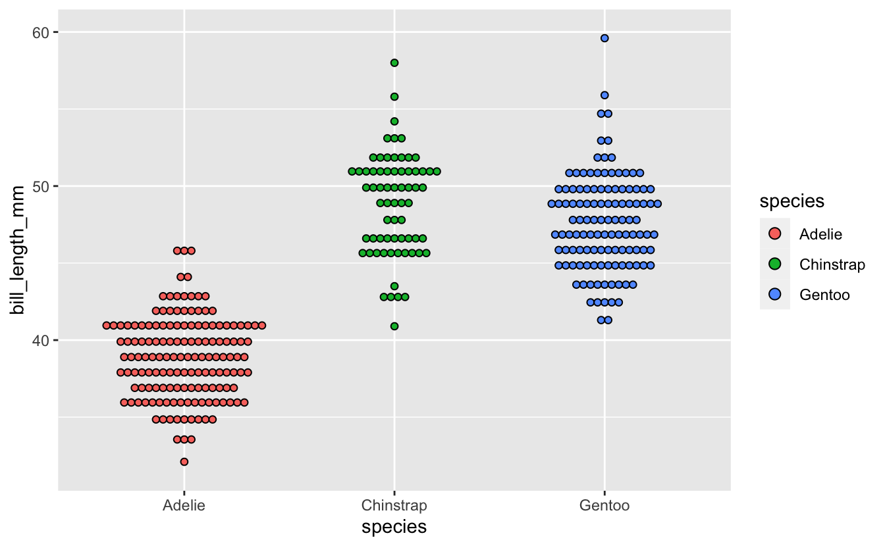

 

------------------------------------------------------------------------

7 - Density ridge plots with [`geom_density_ridges()`](https://wilkelab.org/ggridges/reference/geom_density_ridges.html)
----------------------------------------------------

A density ridge plots with [`geom_density_ridges()`](https://www.rdocumentation.org/packages/ggridges/versions/0.5.2/topics/geom_density_ridges) requires the packages `ggridges`, and make multiple density plots in a staggered orientation.

You can adjust `scale` within [`geom_density_ridges()`](https://wilkelab.org/ggridges/reference/geom_density_ridges.html) to adjust the size of each density plot, though I have left it on the default. Adding `alpha` sets transparency.

<pre class='chroma'><code class='language-r' data-lang='r'># install.packages("ggridges")
<a href='https://rdrr.io/r/base/library.html'>library</a>(<a href='https://wilkelab.org/ggridges/'>ggridges</a>)
penguins_noNA %&gt;%
  ggplot(aes(x = bill_length_mm, y = species, fill = species)) +
  <a href='https://wilkelab.org/ggridges/reference/geom_density_ridges.html'>geom_density_ridges</a>(alpha = 0.8)

#&gt; Picking joint bandwidth of 1.08

</code></pre>
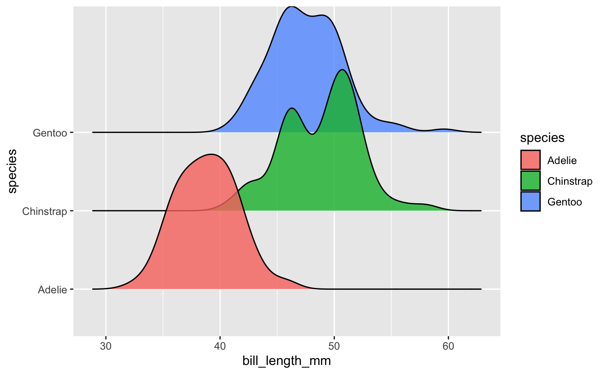

 

------------------------------------------------------------------------

8 - ggplot is made for layering!
--------------------------------

I have shown you a bunch of different plot types, and you can combine many of them together. Here is an example of combining `geom_violin()` and `geom_jitter()`, while mapping new variables to aesthetics.

<pre class='chroma'><code class='language-r' data-lang='r'>penguins_noNA %&gt;%
  ggplot(aes(x = species, y = bill_length_mm, 
             color = sex, 
             shape = island, 
             group = species)) +
  geom_violin() +
  geom_jitter(position = position_jitterdodge(jitter.width = 2))

</code></pre>
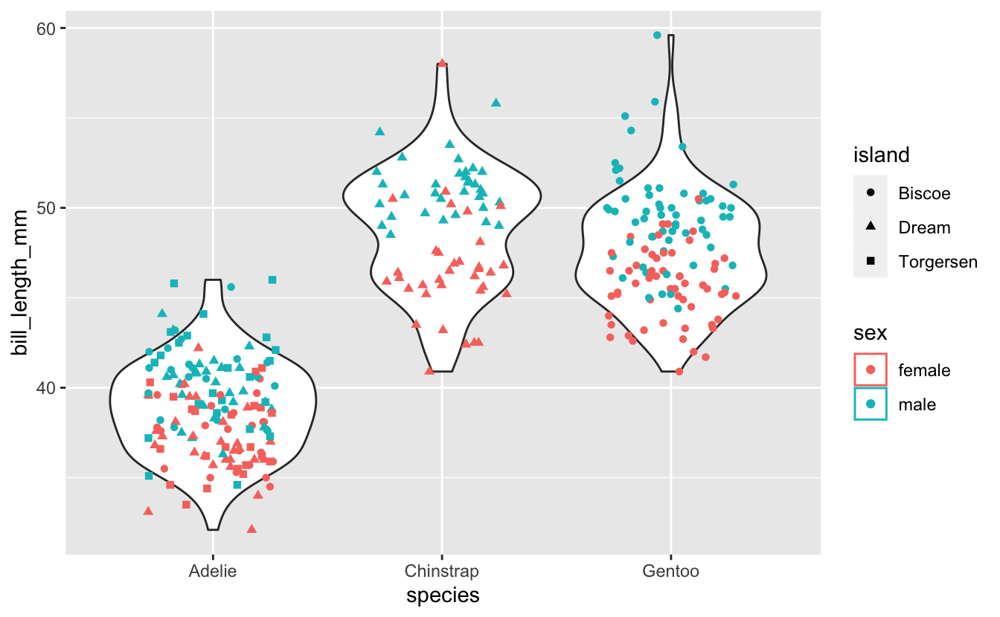

 

------------------------------------------------------------------------

9 - Increase clarity and visual appeal
--------------------------------------

We can quickly make our plot:

-   prettier by setting a `theme`
-   more clear by setting plot labels (eg., axes, titles, legend) with `labs`

<pre class='chroma'><code class='language-r' data-lang='r'>penguins_noNA %&gt;%
  ggplot(aes(x = species, y = bill_length_mm, 
             color = sex, 
             shape = island, 
             group = species)) +
  geom_violin() +
  geom_jitter(position = position_jitterdodge(jitter.width = 2),
              alpha = 0.7) +
  theme_classic() +
  labs(title = "Penguin Bill Length by Species, Sex and Location",
       subtitle = "Collected at Palmer Station, Antarctica",
       x = "Penguin Species", # x axis label
       y = "Bill length (mm)", #  y axis label
       color = "Sex", # legend title
       shape = "Island") # legend title

</code></pre>
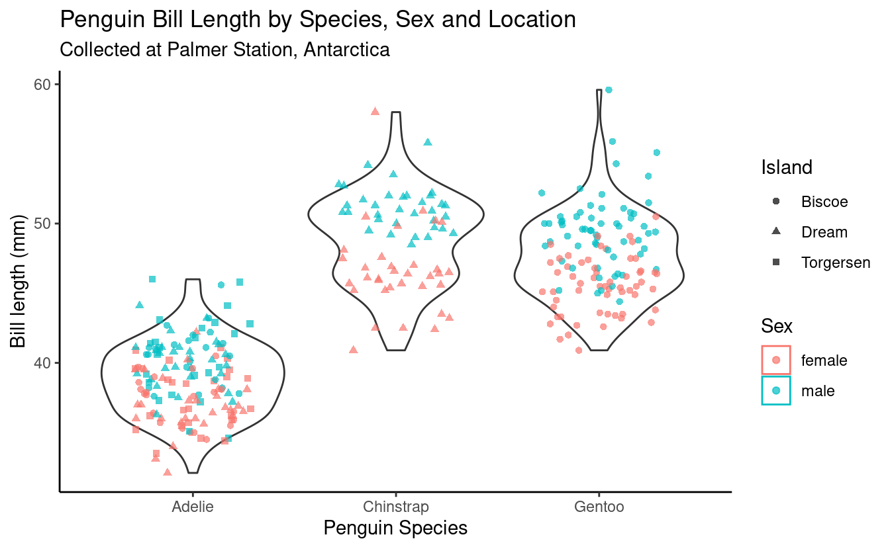

 

------------------------------------------------------------------------

10 - Breakout rooms!
--------------------

### Main exercises

#### Get data

We are going to use the NHANES dataset we used in [Session 3](/codeclub/s03_joining-datasets/) on joining. What was that data about again? Let's refresh our memory.

<pre class='chroma'><code class='language-r' data-lang='r'><a href='https://rdrr.io/r/base/library.html'>library</a>(NHANES)
knitr::<a href='https://rdrr.io/pkg/knitr/man/kable.html'>kable</a>(<a href='https://rdrr.io/r/utils/head.html'>head</a>(NHANES)) 

</code></pre>

|     ID| SurveyYr | Gender |  Age| AgeDecade |  AgeMonths| Race1 | Race3 | Education    | MaritalStatus | HHIncome    |  HHIncomeMid|  Poverty|  HomeRooms| HomeOwn | Work       |  Weight|  Length|  HeadCirc|  Height|    BMI| BMICatUnder20yrs | BMI\_WHO   |  Pulse|  BPSysAve|  BPDiaAve|  BPSys1|  BPDia1|  BPSys2|  BPDia2|  BPSys3|  BPDia3|  Testosterone|  DirectChol|  TotChol|  UrineVol1|  UrineFlow1|  UrineVol2|  UrineFlow2| Diabetes |  DiabetesAge| HealthGen |  DaysPhysHlthBad|  DaysMentHlthBad| LittleInterest | Depressed |  nPregnancies|  nBabies|  Age1stBaby|  SleepHrsNight| SleepTrouble | PhysActive |  PhysActiveDays| TVHrsDay | CompHrsDay |  TVHrsDayChild|  CompHrsDayChild| Alcohol12PlusYr |  AlcoholDay|  AlcoholYear| SmokeNow | Smoke100 | Smoke100n |  SmokeAge| Marijuana |  AgeFirstMarij| RegularMarij |  AgeRegMarij| HardDrugs | SexEver |  SexAge|  SexNumPartnLife|  SexNumPartYear| SameSex | SexOrientation | PregnantNow |
|------:|:---------|:-------|----:|:----------|----------:|:------|:------|:-------------|:--------------|:------------|------------:|--------:|----------:|:--------|:-----------|-------:|-------:|---------:|-------:|------:|:-----------------|:-----------|------:|---------:|---------:|-------:|-------:|-------:|-------:|-------:|-------:|-------------:|-----------:|--------:|----------:|-----------:|----------:|-----------:|:---------|------------:|:----------|----------------:|----------------:|:---------------|:----------|-------------:|--------:|-----------:|--------------:|:-------------|:-----------|---------------:|:---------|:-----------|--------------:|----------------:|:----------------|-----------:|------------:|:---------|:---------|:----------|---------:|:----------|--------------:|:-------------|------------:|:----------|:--------|-------:|----------------:|---------------:|:--------|:---------------|:------------|
|  51624| 2009\_10 | male   |   34| 30-39     |        409| White | NA    | High School  | Married       | 25000-34999 |        30000|     1.36|          6| Own     | NotWorking |    87.4|      NA|        NA|   164.7|  32.22| NA               | 30.0\_plus |     70|       113|        85|     114|      88|     114|      88|     112|      82|            NA|        1.29|     3.49|        352|          NA|         NA|          NA| No       |           NA| Good      |                0|               15| Most           | Several   |            NA|       NA|          NA|              4| Yes          | No         |              NA| NA       | NA         |             NA|               NA| Yes             |          NA|            0| No       | Yes      | Smoker    |        18| Yes       |             17| No           |           NA| Yes       | Yes     |      16|                8|               1| No      | Heterosexual   | NA          |
|  51624| 2009\_10 | male   |   34| 30-39     |        409| White | NA    | High School  | Married       | 25000-34999 |        30000|     1.36|          6| Own     | NotWorking |    87.4|      NA|        NA|   164.7|  32.22| NA               | 30.0\_plus |     70|       113|        85|     114|      88|     114|      88|     112|      82|            NA|        1.29|     3.49|        352|          NA|         NA|          NA| No       |           NA| Good      |                0|               15| Most           | Several   |            NA|       NA|          NA|              4| Yes          | No         |              NA| NA       | NA         |             NA|               NA| Yes             |          NA|            0| No       | Yes      | Smoker    |        18| Yes       |             17| No           |           NA| Yes       | Yes     |      16|                8|               1| No      | Heterosexual   | NA          |
|  51624| 2009\_10 | male   |   34| 30-39     |        409| White | NA    | High School  | Married       | 25000-34999 |        30000|     1.36|          6| Own     | NotWorking |    87.4|      NA|        NA|   164.7|  32.22| NA               | 30.0\_plus |     70|       113|        85|     114|      88|     114|      88|     112|      82|            NA|        1.29|     3.49|        352|          NA|         NA|          NA| No       |           NA| Good      |                0|               15| Most           | Several   |            NA|       NA|          NA|              4| Yes          | No         |              NA| NA       | NA         |             NA|               NA| Yes             |          NA|            0| No       | Yes      | Smoker    |        18| Yes       |             17| No           |           NA| Yes       | Yes     |      16|                8|               1| No      | Heterosexual   | NA          |
|  51625| 2009\_10 | male   |    4| 0-9       |         49| Other | NA    | NA           | NA            | 20000-24999 |        22500|     1.07|          9| Own     | NA         |    17.0|      NA|        NA|   105.4|  15.30| NA               | 12.0\_18.5 |     NA|        NA|        NA|      NA|      NA|      NA|      NA|      NA|      NA|            NA|          NA|       NA|         NA|          NA|         NA|          NA| No       |           NA| NA        |               NA|               NA| NA             | NA        |            NA|       NA|          NA|             NA| NA           | NA         |              NA| NA       | NA         |              4|                1| NA              |          NA|           NA| NA       | NA       | NA        |        NA| NA        |             NA| NA           |           NA| NA        | NA      |      NA|               NA|              NA| NA      | NA             | NA          |
|  51630| 2009\_10 | female |   49| 40-49     |        596| White | NA    | Some College | LivePartner   | 35000-44999 |        40000|     1.91|          5| Rent    | NotWorking |    86.7|      NA|        NA|   168.4|  30.57| NA               | 30.0\_plus |     86|       112|        75|     118|      82|     108|      74|     116|      76|            NA|        1.16|     6.70|         77|       0.094|         NA|          NA| No       |           NA| Good      |                0|               10| Several        | Several   |             2|        2|          27|              8| Yes          | No         |              NA| NA       | NA         |             NA|               NA| Yes             |           2|           20| Yes      | Yes      | Smoker    |        38| Yes       |             18| No           |           NA| Yes       | Yes     |      12|               10|               1| Yes     | Heterosexual   | NA          |
|  51638| 2009\_10 | male   |    9| 0-9       |        115| White | NA    | NA           | NA            | 75000-99999 |        87500|     1.84|          6| Rent    | NA         |    29.8|      NA|        NA|   133.1|  16.82| NA               | 12.0\_18.5 |     82|        86|        47|      84|      50|      84|      50|      88|      44|            NA|        1.34|     4.86|        123|       1.538|         NA|          NA| No       |           NA| NA        |               NA|               NA| NA             | NA        |            NA|       NA|          NA|             NA| NA           | NA         |              NA| NA       | NA         |              5|                0| NA              |          NA|           NA| NA       | NA       | NA        |        NA| NA        |             NA| NA           |           NA| NA        | NA      |      NA|               NA|              NA| NA      | NA             | NA          |

<pre class='chroma'><code class='language-r' data-lang='r'># kable just formats as a scrollable table for this website
# you can just use head(NHANES) or glimpse(NHANES)
</code></pre>

------------------------------------------------------------------------

#### Exercise 1

Create a new data frame includes the NHANES data only from individuals that are 20 years of age or older, and removes observations where there are NAs for either age subdivided by decade (`AgeDecade`) or total cholesterol (`TotChol`).

 Hints (click here) 

Try using a series of [`filter()`](https://rdrr.io/r/stats/filter.html) statements. Remember, you can tell filter what you want, or what you don't want. You can filter for if specific variables have NAs by using [`is.na()`](https://rdrr.io/r/base/NA.html) on your variable of interest. Also remember that [`!`](https://rdrr.io/r/base/Logic.html) means "not." You will notice that if you want to use `drop_NA()` you need to specific which specific variables you want to use, or you will inadvertably drop a lot of observations which have missing data for variables other than those we are plotting..  

 

 Solutions (click here) 

<pre class='chroma'><code class='language-r' data-lang='r'># here are a few ways to do this
NHANES_over20_noNA &lt;- NHANES %&gt;%
  <a href='https://rdrr.io/r/stats/filter.html'>filter</a>(Age &gt;20) %&gt;%
  drop_na(AgeDecade, TotChol)

<a href='https://rdrr.io/r/base/dim.html'>dim</a>(NHANES_over20_noNA)

#&gt; [1] 6408   76

NHANES_over20_noNA &lt;- NHANES %&gt;%
  <a href='https://rdrr.io/r/stats/filter.html'>filter</a>(Age &gt;20,
         !<a href='https://rdrr.io/r/base/NA.html'>is.na</a>(AgeDecade),
         !<a href='https://rdrr.io/r/base/NA.html'>is.na</a>(TotChol))

<a href='https://rdrr.io/r/base/dim.html'>dim</a>(NHANES_over20_noNA)

#&gt; [1] 6408   76
</code></pre>

 

------------------------------------------------------------------------

#### Exercise 2

Create a boxplot to show the relationship between total cholesterol (`TotChol`) and age (`AgeDecade`).

 Hints (click here) 

Try `geom_boxplot()`. Map your variables of interest to the `x` and `y` aesthetics. Which you variable you put on `x` and `y` will determine if your boxplot is vertical or horizontal.  

 

 Solutions (click here) 

<pre class='chroma'><code class='language-r' data-lang='r'>NHANES_over20_noNA %&gt;%
  ggplot(aes(x = AgeDecade, y = TotChol)) +
  geom_boxplot()

</code></pre>
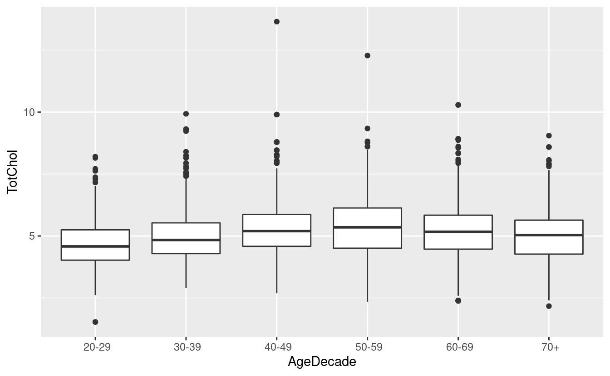

 

------------------------------------------------------------------------

#### Exercise 3

Take your plot from Exercise 2 and make it a violin plot instead of a boxplot. Then color by age.

 Hints (click here) 

The geom for a violin plot is `geom_violin()`. You can change color by mapping to `color` or to `fill`.  

 

 Solutions (click here) 

Note the difference between mapping to `color` vs. `fill`.  

<pre class='chroma'><code class='language-r' data-lang='r'>NHANES_over20_noNA %&gt;%
  ggplot(aes(x = AgeDecade, y = TotChol, color = AgeDecade)) +
  geom_violin()

</code></pre>
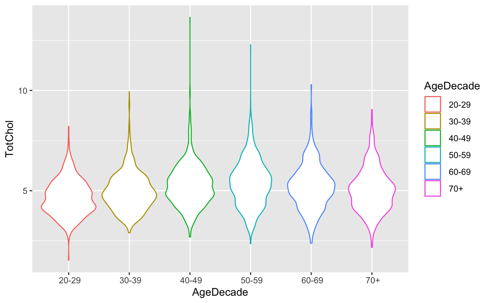

<pre class='chroma'><code class='language-r' data-lang='r'>NHANES_over20_noNA %&gt;%
  ggplot(aes(x = AgeDecade, y = TotChol, fill = AgeDecade)) +
  geom_violin()

</code></pre>
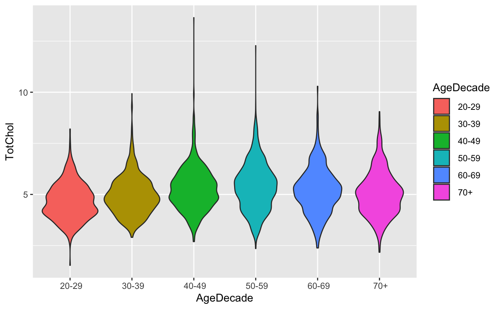

 

------------------------------------------------------------------------

#### Exercise 4

Make add a boxplot to your violin plot from Exercise 3. Adjust the parameters so you the plot looks good to you.

 Hints (click here) 

In `geom_boxplot()`, you can adjust the width of the boxplot by setting `width = X`. A width of 1 is the default.  

 

 Solutions (click here) 

<pre class='chroma'><code class='language-r' data-lang='r'>NHANES_over20_noNA %&gt;%
  ggplot(aes(x = AgeDecade, y = TotChol, color = AgeDecade)) +
  geom_violin() +
  geom_boxplot(width = 0.2)

</code></pre>
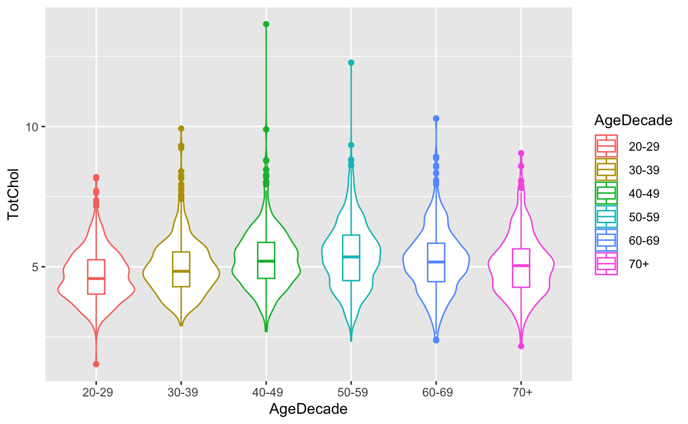

 

------------------------------------------------------------------------

#### Exercise 5

Add all of the data points on top of your boxplot from Exercise 2 of total cholesterol by age. Adjust the parameters so you the plot looks good to you. While you are at it, clean up your plot labels and give your plot a title.

 Hints (click here) 

Remember that ggplot layers your plots, so layers that are further down in your code, will be applied on top of those that come earlier.  

 

 Solutions (click here) 

`geom_boxplot(outlier.shape = NA)` removes the outliers from `geom_boxplot()`, since we are plotting all of the points, we do not want the outliers appearing twice.  

<pre class='chroma'><code class='language-r' data-lang='r'>NHANES_over20_noNA %&gt;%
  ggplot(aes(x = AgeDecade, y = TotChol, color = AgeDecade)) +
  geom_boxplot(outlier.shape = NA) + 
  geom_jitter(width = 0.3, alpha = 0.1) +
  labs(title = "Total Cholesterol by Age",
       subtitle = "Data from the National Health and Nutrition Examination Survey (NHANES)",
       x = "Age, by Decade",
       y = "Total Cholesterol, mmol/L",
       color = "Age (years)")

</code></pre>
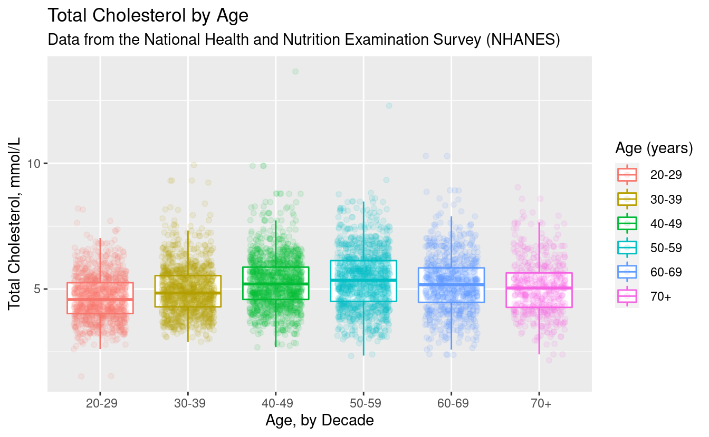

 

------------------------------------------------------------------------

### Bonus exercises

#### Bonus 1

Make a density ridge plot for age by total cholesterol.

 Hints (click here) 

Try [`geom_density_ridges()`](https://wilkelab.org/ggridges/reference/geom_density_ridges.html), and remember, this is not a part of `ggplot2`, so be sure to call [`library(ggridges)`](https://wilkelab.org/ggridges/).  

 

 Solutions (click here) 

<pre class='chroma'><code class='language-r' data-lang='r'># install.packages("ggridges")
<a href='https://rdrr.io/r/base/library.html'>library</a>(<a href='https://wilkelab.org/ggridges/'>ggridges</a>)
NHANES_over20_noNA %&gt;%
  ggplot(aes(x = TotChol, y = AgeDecade, fill = AgeDecade)) +
  <a href='https://wilkelab.org/ggridges/reference/geom_density_ridges.html'>geom_density_ridges</a>(alpha = 0.7) 

#&gt; Picking joint bandwidth of 0.224

</code></pre>
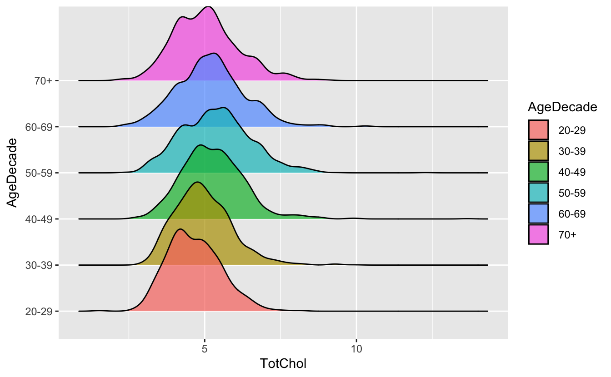

 

------------------------------------------------------------------------

#### Bonus 2

Take your density ridge plot from Bonus 1, and try applying a theme from `hrbrthemes` to it.

 Hints (click here) 

`hrbrthemes` is not part of `ggplot2` so remember to install the package, and then call [`library(hrbrthemes)`](http://github.com/hrbrmstr/hrbrthemes). You can google the package to see what all your theme options are. I like [`theme_ipsum_rc()`](https://rdrr.io/pkg/hrbrthemes/man/theme_ipsum_rc.html), try that one if you like!  

 

 Solutions (click here) 

<pre class='chroma'><code class='language-r' data-lang='r'># install.packages("hrbrthemes")
<a href='https://rdrr.io/r/base/library.html'>library</a>(<a href='http://github.com/hrbrmstr/hrbrthemes'>hrbrthemes</a>)

#&gt; NOTE: Either Arial Narrow or Roboto Condensed fonts are required to use these themes.

#&gt;       Please use hrbrthemes::import_roboto_condensed() to install Roboto Condensed and

#&gt;       if Arial Narrow is not on your system, please see https://bit.ly/arialnarrow

NHANES_over20_noNA %&gt;%
  ggplot(aes(x = TotChol, y = AgeDecade, fill = AgeDecade)) +
  <a href='https://wilkelab.org/ggridges/reference/geom_density_ridges.html'>geom_density_ridges</a>(alpha = 0.7, scale = 0.9) +
  <a href='https://rdrr.io/pkg/hrbrthemes/man/theme_ipsum_rc.html'>theme_ipsum_rc</a>() 

#&gt; Picking joint bandwidth of 0.224

</code></pre>
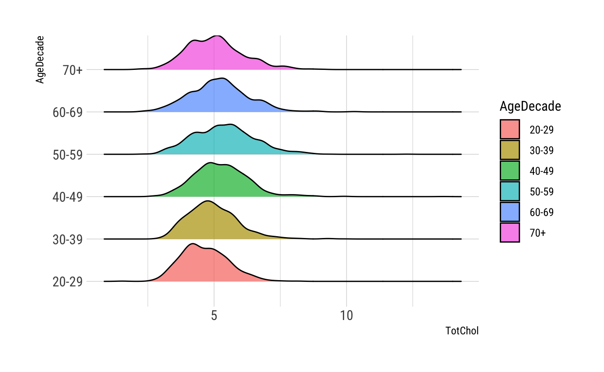

 

------------------------------------------------------------------------

#### Bonus 3

Tidy up your plot from Bonus 2 by giving it a title, axis labels, and try adding the median total cholesterol to each density ridge plot.

 Hints (click here) 

Using [`stat_summary()`](https://ggplot2.tidyverse.org/reference/stat_summary.html) will help you add the median.  
 

 

 Solutions (click here) 

-   `theme(axis.title.x = element_text(hjust = 0.5))` makes the x-axis title center justified.
-   you can change `shape` within `stat_summary()` to be anything you like, either an R shape, a specific keyboard key, or even a pasted emoji. The default is a point.
-   when you set a `theme()`, anything that comes below will override what code comes previous, so for this reason, if you are going to amend a pre-made theme, first call the pre-made theme, and then make any changes you like below.

<pre class='chroma'><code class='language-r' data-lang='r'>NHANES_over20_noNA %&gt;%
  ggplot(aes(x = TotChol, y = AgeDecade, fill = AgeDecade)) +
  <a href='https://wilkelab.org/ggridges/reference/geom_density_ridges.html'>geom_density_ridges</a>(alpha = 0.7, scale = 0.9) +
  stat_summary(fun = median) +
  <a href='https://rdrr.io/pkg/hrbrthemes/man/theme_ipsum_rc.html'>theme_ipsum_rc</a>() +
  theme(axis.title.x = element_text(hjust = 0.5),
        axis.title.y = element_text(hjust = 0.5)) +
  labs(title = "Total Cholesterol by Age",
       subtitle = "Data from the National Health and Nutrition Examination Survey (NHANES)",
       x = "Total Cholesterol, mmol/L",
       y = "Age, by Decade",
       fill = "Age (years)")

#&gt; Picking joint bandwidth of 0.224

#&gt; Warning: Removed 6 rows containing missing values (geom_segment).

</code></pre>
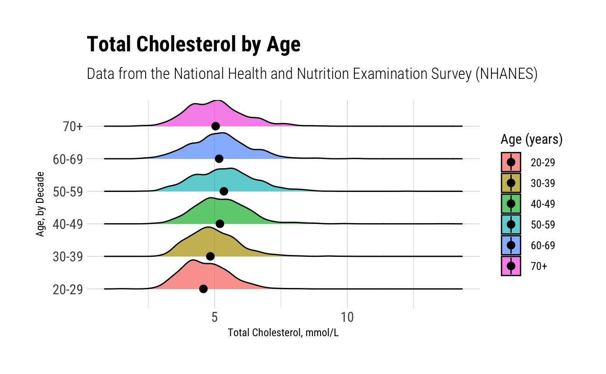

 

------------------------------------------------------------------------

#### Bonus 4

Commonly used cutoffs for cholesterol are: \< 5.2 mmol/L is normal, 5.2-6.2 mmol/L is borderline high and \> 6.2 mmol is high. Add a vertical cutoff line showing the level below which cholesterol would be considered normal.

 Hints (click here) 

Using [`geom_vline()`](https://ggplot2.tidyverse.org/reference/geom_abline.html) will let you add a vertical line with an `xintercept` that is appropriate.  

 

 Solutions (click here) 

<pre class='chroma'><code class='language-r' data-lang='r'>NHANES_over20_noNA %&gt;%
  ggplot(aes(x = TotChol, y = AgeDecade, fill = AgeDecade)) +
  <a href='https://wilkelab.org/ggridges/reference/geom_density_ridges.html'>geom_density_ridges</a>(alpha = 0.7, scale = 0.9) +
  stat_summary(fun = median) +
  geom_vline(aes(xintercept = 5.2)) +
  <a href='https://rdrr.io/pkg/hrbrthemes/man/theme_ipsum_rc.html'>theme_ipsum_rc</a>() +
  theme(axis.title.x = element_text(hjust = 0.5),
        axis.title.y = element_text(hjust = 0.5)) +
  labs(title = "Total Cholesterol by Age",
       subtitle = "Data from the National Health and Nutrition Examination Survey (NHANES)",
       caption = "Vertical line indicates upper limit of normal cholesterol",
       x = "Total Cholesterol, mmol/L",
       y = "Age, by Decade",
       fill = "Age (years)")

#&gt; Picking joint bandwidth of 0.224

#&gt; Warning: Removed 6 rows containing missing values (geom_segment).

</code></pre>
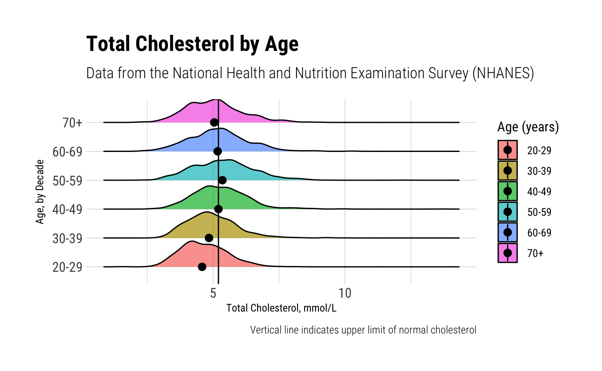

 

------------------------------------------------------------------------

