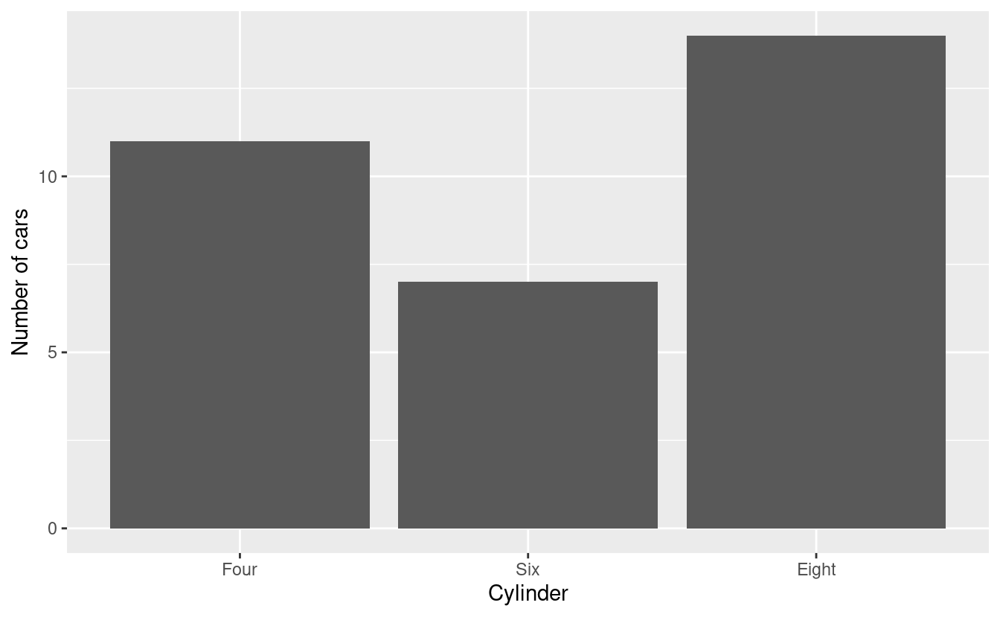
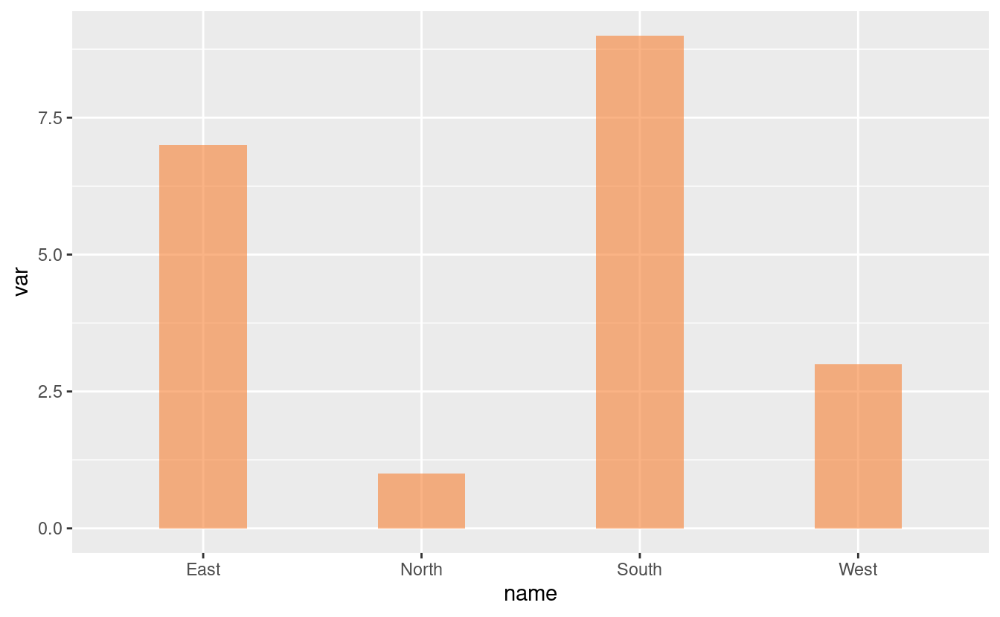
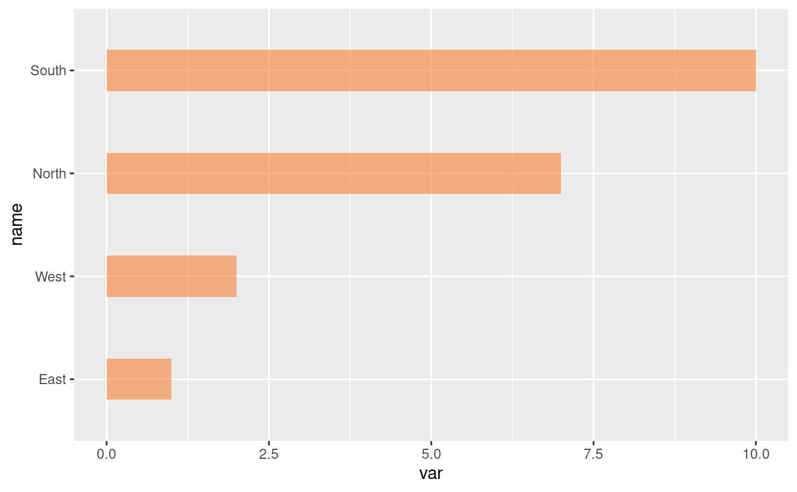
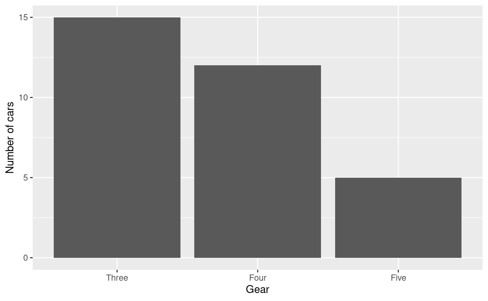
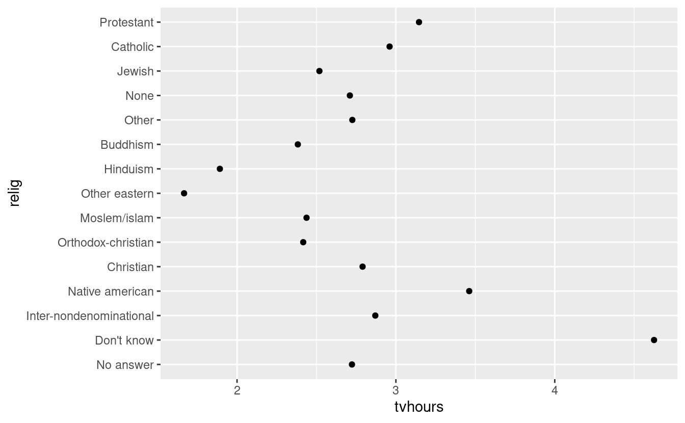

   

------------------------------------------------------------------------

Factors form the basis for many powerful operations in R, including many performed on tabular data. The motivation for factors comes from the notion of categorical variables. These variables are non-numeric in nature corresponding to categories such as male and female, or Democrat, Republican and Independent.

**A factor might be viewed simply as a vector with a bit of more information added.** The extra information consists of a record of distinct values in that vector, which are called: ***levels***.

Let us look at some examples of factors. We will make use of the package *forcats*, which is one of the 8 core *tidyverse* packages. Therefore, we start by loading the *tidyverse*:

<pre class='chroma'><code class='language-r' data-lang='r'><a href='https://rdrr.io/r/base/library.html'>library</a>(<a href='http://tidyverse.tidyverse.org'>tidyverse</a>)

#&gt; ── Attaching packages ─────────────────────────────────────── tidyverse 1.3.0 ──

#&gt; ✔ ggplot2 3.3.3     ✔ purrr   0.3.4
#&gt; ✔ tibble  3.0.4     ✔ dplyr   1.0.2
#&gt; ✔ tidyr   1.1.2     ✔ stringr 1.4.0
#&gt; ✔ readr   1.4.0     ✔ forcats 0.5.0

#&gt; ── Conflicts ────────────────────────────────────────── tidyverse_conflicts() ──
#&gt; ✖ dplyr::filter() masks stats::filter()
#&gt; ✖ dplyr::lag()    masks stats::lag()

## Check whether "forcats" is listed among the loaded packages.
## Alternatively, you could load "forcats" (and "ggplot2") separately:
# install.packages("forcats")
# library(forcats)
# library(ggplot2)
</code></pre>

 

------------------------------------------------------------------------

Example 1: From a numeric vector to a factor
--------------------------------------------

Let us create a factor `xf` from a vector `x` with the numbers `5`, `12`, `13`, and `12`:

<pre class='chroma'><code class='language-r' data-lang='r'>x &lt;- <a href='https://rdrr.io/r/base/c.html'>c</a>(5,12, 13,12)
x

#&gt; [1]  5 12 13 12

# Convert the vector to a factor:
xf &lt;- <a href='https://rdrr.io/r/base/factor.html'>factor</a>(x)
xf

#&gt; [1] 5  12 13 12
#&gt; Levels: 5 12 13
</code></pre>

The *distinct values* in `xf` are `5`, `12` and `13`, and are listed as *levels*.

Let us look in a bit more details at our factor using the R functions `str` and `unclass`:

<pre class='chroma'><code class='language-r' data-lang='r'><a href='https://rdrr.io/r/utils/str.html'>str</a>(xf)

#&gt;  Factor w/ 3 levels "5","12","13": 1 2 3 2

<a href='https://rdrr.io/r/base/class.html'>unclass</a>(xf)

#&gt; [1] 1 2 3 2
#&gt; attr(,"levels")
#&gt; [1] "5"  "12" "13"
</code></pre>

Notice that the values in the factor are not stored as `(5, 12, 13, 12)`, but rather as `(1, 2, 3, 2)`!

This means that our data consists first of a level-1 value, then level-2 and level 3 values, and finally another level-2 value. So, the data has been recorded by level.

The values attached to each level are recorded too, but as *characters* such as `"5"` rather than as numbers such as `5`.

 

------------------------------------------------------------------------

Example 2: From a character vector to a factor
----------------------------------------------

We will use the levels Democrat (`D`), Republican (`R`), and Independent (`I`). First, we save a *vector*:

<pre class='chroma'><code class='language-r' data-lang='r'>y &lt;- <a href='https://rdrr.io/r/base/c.html'>c</a>("D", "R", "R", "I", "R", "I", "D", "I")
y

#&gt; [1] "D" "R" "R" "I" "R" "I" "D" "I"

<a href='https://rdrr.io/r/utils/str.html'>str</a>(y)

#&gt;  chr [1:8] "D" "R" "R" "I" "R" "I" "D" "I"
</code></pre>

Then, we again convert the *vector* to a *factor*, and look at the levels:

<pre class='chroma'><code class='language-r' data-lang='r'>fy &lt;- <a href='https://rdrr.io/r/base/factor.html'>factor</a>(y)
fy

#&gt; [1] D R R I R I D I
#&gt; Levels: D I R

<a href='https://rdrr.io/r/base/class.html'>unclass</a>(fy)

#&gt; [1] 1 3 3 2 3 2 1 2
#&gt; attr(,"levels")
#&gt; [1] "D" "I" "R"
</code></pre>

 

------------------------------------------------------------------------

Example 3: Ordering factor levels
---------------------------------

Some variables can be challenging to sort automatically, because the desired sorting order is not alphabetical or numeric.

For instance, months that are listed using characters:

<pre class='chroma'><code class='language-r' data-lang='r'>months_vector &lt;- <a href='https://rdrr.io/r/base/c.html'>c</a>("Dec", "Apr", "Jan", "Mar")

# Try to sort using the `sort` function
<a href='https://rdrr.io/r/base/sort.html'>sort</a>(months_vector)

#&gt; [1] "Apr" "Dec" "Jan" "Mar"
</code></pre>

That didn't sort in a useful way. **But, the problem can be fixed by using a factor.**

First, we create a list of the valid levels, which are all 12 months in a year:

<pre class='chroma'><code class='language-r' data-lang='r'>month_levels &lt;- <a href='https://rdrr.io/r/base/c.html'>c</a>("Jan", "Feb", "Mar", "Apr", "May", "Jun",
                  "Jul", "Aug", "Sep", "Oct", "Nov", "Dec")
</code></pre>

Then we convert the vector into a factor, like before, but now we additionally specify the desired levels of the factor, **in order**, using the `levels` argument:

<pre class='chroma'><code class='language-r' data-lang='r'>months_factor &lt;- <a href='https://rdrr.io/r/base/factor.html'>factor</a>(months_vector, levels = month_levels)
</code></pre>

Now it sorts the way we want to!

<pre class='chroma'><code class='language-r' data-lang='r'><a href='https://rdrr.io/r/base/sort.html'>sort</a>(months_factor)

#&gt; [1] Jan Mar Apr Dec
#&gt; Levels: Jan Feb Mar Apr May Jun Jul Aug Sep Oct Nov Dec
</code></pre>

 

------------------------------------------------------------------------

Example 4: Use of factors in plots with *forcats*
-------------------------------------------------

### 4A: Plot after reordering manually with `fct_relevel()`

We will use the *mtcars* data, which was extracted from the 1974 Motor Trend US magazine, and comprises fuel consumption and 10 aspects of automobile design and performance for 32 automobiles (1973--74 models) -- a data frame with 32 observations for 11 (numeric) variables,

<pre class='chroma'><code class='language-r' data-lang='r'><a href='https://rdrr.io/r/utils/data.html'>data</a>(mtcars)

<a href='https://rdrr.io/r/base/names.html'>names</a>(mtcars)

#&gt;  [1] "mpg"  "cyl"  "disp" "hp"   "drat" "wt"   "qsec" "vs"   "am"   "gear"
#&gt; [11] "carb"

<a href='https://rdrr.io/r/base/dim.html'>dim</a>(mtcars)

#&gt; [1] 32 11

<a href='https://rdrr.io/r/utils/str.html'>str</a>(mtcars)

#&gt; 'data.frame':  32 obs. of  11 variables:
#&gt;  $ mpg : num  21 21 22.8 21.4 18.7 18.1 14.3 24.4 22.8 19.2 ...
#&gt;  $ cyl : num  6 6 4 6 8 6 8 4 4 6 ...
#&gt;  $ disp: num  160 160 108 258 360 ...
#&gt;  $ hp  : num  110 110 93 110 175 105 245 62 95 123 ...
#&gt;  $ drat: num  3.9 3.9 3.85 3.08 3.15 2.76 3.21 3.69 3.92 3.92 ...
#&gt;  $ wt  : num  2.62 2.88 2.32 3.21 3.44 ...
#&gt;  $ qsec: num  16.5 17 18.6 19.4 17 ...
#&gt;  $ vs  : num  0 0 1 1 0 1 0 1 1 1 ...
#&gt;  $ am  : num  1 1 1 0 0 0 0 0 0 0 ...
#&gt;  $ gear: num  4 4 4 3 3 3 3 4 4 4 ...
#&gt;  $ carb: num  4 4 1 1 2 1 4 2 2 4 ...
</code></pre>

we will select six variables (`mpg`, `cyl`, `disp`, `hp`, and `wt`) to create a dataset `Data`.

-   `mpg`: Miles per (US) gallon,
-   `cyl`: Number of cylinders
-   `disp`: Displacement (cu.in.)
-   `hp`: Horse power
-   `wt`: Weight (in 1000 lbs)

<pre class='chroma'><code class='language-r' data-lang='r'>Data &lt;- mtcars %&gt;%
  select("mpg", "cyl", "disp", "hp", "wt")
</code></pre>

Now, we'll add a new column `cyl_chr` by converting `cyl` from *numeric* to *character*:

<pre class='chroma'><code class='language-r' data-lang='r'>Data &lt;- Data %&gt;%
  mutate(cyl_chr = recode(cyl,`4` = "Four", `6` = "Six", `8` = "Eight"))

<a href='https://rdrr.io/r/utils/head.html'>head</a>(Data)

#&gt;    mpg cyl disp  hp    wt cyl_chr
#&gt; 1 21.0   6  160 110 2.620     Six
#&gt; 2 21.0   6  160 110 2.875     Six
#&gt; 3 22.8   4  108  93 2.320    Four
#&gt; 4 21.4   6  258 110 3.215     Six
#&gt; 5 18.7   8  360 175 3.440   Eight
#&gt; 6 18.1   6  225 105 3.460     Six
</code></pre>

We plot a bar chart for `cyl_chr`:

<pre class='chroma'><code class='language-r' data-lang='r'>Data %&gt;%
  ggplot(aes(x = cyl_chr)) +
  geom_bar() 

</code></pre>

In the plot, the levels of the factor were arranged in alphabetical order (`Eight`, `Four`, and `Six`).

Instead, we want the bar graph arranged in the order `Four`, `Six`, and `Eight`.

An alternative to using [`factor(levels = ...)`](https://rdrr.io/r/base/factor.html) like we did above, is to use the `fct_relevel()` function from the *forcats* package:

<pre class='chroma'><code class='language-r' data-lang='r'>Data %&gt;%
  mutate(cyl_chr = fct_relevel(cyl_chr, "Four", "Six", "Eight")) %&gt;%
  ggplot(aes(x = cyl_chr)) +
  geom_bar() +
  labs(x = "Cylinder", y = "Miles/per gallon")

</code></pre>

 

### 4B: Plot after reordering by the value of another column (`fct_reorder`)

Create a dataset called `Data_a`:

<pre class='chroma'><code class='language-r' data-lang='r'>Data_a &lt;- <a href='https://rdrr.io/r/base/data.frame.html'>data.frame</a>(name = <a href='https://rdrr.io/r/base/c.html'>c</a>("North", "South", "East", "West"),
                     var = <a href='https://rdrr.io/r/base/sample.html'>sample</a>(<a href='https://rdrr.io/r/base/seq.html'>seq</a>(1, 10), 4))
</code></pre>

Plot a bar chart of `Data_a`:

<pre class='chroma'><code class='language-r' data-lang='r'>Data_a %&gt;%
  ggplot(aes(x = name, y = var)) +
  geom_bar(stat = "identity", fill = "#f68034", alpha = 0.6, width = 0.4) 

</code></pre>

Reorder following the value of another column using the `fct_reorder()` function, and flip the plot:

<pre class='chroma'><code class='language-r' data-lang='r'>Data_a %&gt;%
  mutate(name = fct_reorder(name, var)) %&gt;%
  ggplot(aes(x = name, y = var)) +
  geom_bar(stat = "identity", fill = "#f68034", alpha = 0.6, width = 0.4) +
  coord_flip() 

</code></pre>

 

There are several more convenient reordering functions in the *forcats* package, including:

-   `fact_infreq()` to reorder by occurrence frequencies of each level (see the picture at the top of the post).

-   `fct_inorder()` to reorder by order of appearance in the dataframe. This can be useful, for example, if your dataframe has already been sorted properly, and you just need to prevent automatic alphabetic reordering when plotting.

 

------------------------------------------------------------------------

Breakout rooms!
---------------

For the Breakout room exercises, we will use datasets from *mtcars* and the `gss_cat` dataset from the *forcats* package.

### Exercise 1

Convert the variable `gear` from *mtcars* to a character vector with words for each number (link in example 4A), and plot a bar chart.

Then, use a factor to reorder the bars to appear in the regular "numeric" order: "Three" then "Four" then "Five".

 Hints (click here) 

-   First, create a dataframe with a column that codes the gears as words, using the `mutate()` and `recode()` functions.

-   Then, create a factor from this modified gear column, and order it manually using the `fct_relevel()` function.

 

 Solutions (click here) 
  

-   Start by loading the dataset:

<pre class='chroma'><code class='language-r' data-lang='r'><a href='https://rdrr.io/r/utils/data.html'>data</a>("mtcars")
</code></pre>

 

-   Now, create a new dataset `Gear` from *mtcars*, adding a column `gear_chr`:

<pre class='chroma'><code class='language-r' data-lang='r'>gear_df &lt;- mtcars %&gt;%
  mutate(gear_chr = recode(gear,
                         `3`= "Three",
                         `4` ="Four",
                         `5`= "Five"))

<a href='https://rdrr.io/r/utils/head.html'>head</a>(gear_df)

#&gt;    mpg cyl disp  hp drat    wt  qsec vs am gear carb gear_chr
#&gt; 1 21.0   6  160 110 3.90 2.620 16.46  0  1    4    4     Four
#&gt; 2 21.0   6  160 110 3.90 2.875 17.02  0  1    4    4     Four
#&gt; 3 22.8   4  108  93 3.85 2.320 18.61  1  1    4    1     Four
#&gt; 4 21.4   6  258 110 3.08 3.215 19.44  1  0    3    1    Three
#&gt; 5 18.7   8  360 175 3.15 3.440 17.02  0  0    3    2    Three
#&gt; 6 18.1   6  225 105 2.76 3.460 20.22  1  0    3    1    Three
</code></pre>

 

-   Finally, use the *forcats* function `fct_relevel()` to rearrange `gear_chr` in nonalphabetical order, and plot the barchart using `geom_bar()`:

<pre class='chroma'><code class='language-r' data-lang='r'>gear_df %&gt;%
  mutate(gear_fct = fct_relevel(gear_chr, "Three", "Four", "Five")) %&gt;%
  ggplot(aes(x = gear_fct)) +
  geom_bar() +
  labs(x = "Gear", y = "Miles/per gallon")

</code></pre>

 

 

------------------------------------------------------------------------

### Exercise 2

Using the `gss_cat` dataset from the *forcats* package (available as `gsscat` in your environment), create a plot that compares the average number of hours spent watching TV per day across religions, and where *religions are ordered by the average number of hours*.

(Despite what we've learned last week, start by merely plotting the mean, and no distributions, using a barplot or with `geom_point()`.)

*Source: (R for Data Science)*

 Hints (click here) 
   In order to be able to order the factor by the average number of hours spent watching TV, first compute this average per religion, and save the results in a dataframe (use `mutate()` and `summarize()`).

Then, use `fct_recorder()` to reorder the factor.

 

 Solutions (click here) 
  

First, have a look at the dataset:

<pre class='chroma'><code class='language-r' data-lang='r'>forcats::<a href='https://forcats.tidyverse.org/reference/gss_cat.html'>gss_cat</a>

#&gt; # A tibble: 21,483 x 9
#&gt;     year marital     age race  rincome    partyid     relig     denom    tvhours
#&gt;    &lt;int&gt; &lt;fct&gt;     &lt;int&gt; &lt;fct&gt; &lt;fct&gt;      &lt;fct&gt;       &lt;fct&gt;     &lt;fct&gt;      &lt;int&gt;
#&gt;  1  2000 Never ma…    26 White $8000 to … Ind,near r… Protesta… Souther…      12
#&gt;  2  2000 Divorced     48 White $8000 to … Not str re… Protesta… Baptist…      NA
#&gt;  3  2000 Widowed      67 White Not appli… Independent Protesta… No deno…       2
#&gt;  4  2000 Never ma…    39 White Not appli… Ind,near r… Orthodox… Not app…       4
#&gt;  5  2000 Divorced     25 White Not appli… Not str de… None      Not app…       1
#&gt;  6  2000 Married      25 White $20000 - … Strong dem… Protesta… Souther…      NA
#&gt;  7  2000 Never ma…    36 White $25000 or… Not str re… Christian Not app…       3
#&gt;  8  2000 Divorced     44 White $7000 to … Ind,near d… Protesta… Luthera…      NA
#&gt;  9  2000 Married      44 White $25000 or… Not str de… Protesta… Other          0
#&gt; 10  2000 Married      47 White $25000 or… Strong rep… Protesta… Souther…       3
#&gt; # … with 21,473 more rows
</code></pre>

Then, calculate the mean number of tv-hours and create a plot:

<pre class='chroma'><code class='language-r' data-lang='r'>relig &lt;- gss_cat %&gt;%
  group_by(relig) %&gt;%
  summarize(tvhours = <a href='https://rdrr.io/r/base/mean.html'>mean</a>(tvhours, na.rm = TRUE))

#&gt; `summarise()` ungrouping output (override with `.groups` argument)

ggplot(relig, aes(tvhours, relig)) +
  geom_point()

</code></pre>

It is difficult to interpret this plot because there is no overall pattern.

We can improve the plot by reordering the level of religion using `fct_reorder()`:

<pre class='chroma'><code class='language-r' data-lang='r'>relig &lt;- gss_cat %&gt;%
  group_by(relig) %&gt;%
  summarize(tvhours = <a href='https://rdrr.io/r/base/mean.html'>mean</a>(tvhours, na.rm = TRUE))

#&gt; `summarise()` ungrouping output (override with `.groups` argument)

relig %&gt;%
  mutate(relig = fct_reorder(relig, tvhours)) %&gt;%
  ggplot(aes(tvhours, relig)) +
  geom_point()

</code></pre>

Reordering religion makes it much easier to see that people in the "Don't know" category watch much more TV.

 

 

------------------------------------------------------------------------

### Bonus: Exercise 3

In exercise 2, we saw large differences in the *average* time spent watching TV across religions, but we should perhaps have a closer look at the data by plotting distributions.

Go back to the [previous Code Club session](https://biodash.github.io/codeclub/05_ggplot-round-2/) and decide which type of plot could be ideal with so many categories.

 Hints (click here) 
   [`geom_density_ridges()`](https://wilkelab.org/ggridges/reference/geom_density_ridges.html) from the *ggridges* package is very well suited for a plot with so many categories.

 

 Solutions (click here) 
  

<pre class='chroma'><code class='language-r' data-lang='r'><a href='https://rdrr.io/r/base/library.html'>library</a>(<a href='https://wilkelab.org/ggridges/'>ggridges</a>)

ggplot(gss_cat, aes(x = tvhours, y = relig, fill = relig)) +
  <a href='https://wilkelab.org/ggridges/reference/geom_density_ridges.html'>geom_density_ridges</a>(alpha = 0.8) +
  labs(x = 'Number of hours spent watching TV', y = 'Religion') +
  guides(fill = FALSE) +
  theme_minimal()

#&gt; Picking joint bandwidth of 0.586

#&gt; Warning: Removed 10146 rows containing non-finite values (stat_density_ridges).

</code></pre>

 

