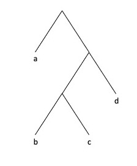

<br> <br> <br>

------------------------------------------------------------------------

## New To Code Club?

-   First, check out the [Code Club Computer Setup](/codeclub-setup/) instructions, which also has some pointers that might be helpful if you're new to R or RStudio.

-   Please open RStudio before Code Club to test things out -- if you run into issues, join the Zoom call early and we'll troubleshoot.

------------------------------------------------------------------------

## Session Goals

-   Learn the uses of R's three basic subsetting operators: `[ ]`, `[[ ]]`, and [`$`](https://rdrr.io/r/base/Extract.html).
-   Learn how the behavior of these operators varies depending on the **data structure** you are subsetting (vector, matrix, list, or data frame).
-   Prepare to learn how these resemble, and differ from, subsetting operators in Python.

------------------------------------------------------------------------

## Intro: What is 'subsetting' anyway?

Subsetting (also known as indexing) is simply a formal way of pulling out specific pieces of a data structure. We've already seen two **dplyr** verbs that perform this kind of operation for tibbles: `filter` (to pull out specific rows) and `select` (to pull out specific columns).

But these are tidyverse commands, and only work with tibbles. R has two more-basic data structures, vectors and lists, and for these we need different subsetting operators. We'll also see that matrices are simply a special kind of vector, that data frames are a special kind of list, and basic subsetting operators also work for these.

Since the behavior of these operators depends on the actual data structure you are working with, it's useful when experimenting to use them in conjunction with the [`str()`](https://rdrr.io/r/utils/str.html) function, which compactly displays the internal structure of an arbitrary R object. A knowledge of the make-up of these data structures is also important when you come to write your own loops, iterations, and functions.

The most important distinction between vectors and lists is that vectors are **homogeneous**, while lists can be **heterogeneous**.

<div class="alert alert-note">

<div>

*Terminological note*: 'under-the-hood' both of these are vectors in the technical sense, and sometimes the distinction is referred to as **atomic vectors** versus **recursive vectors**. I'll continue to use just 'vector' and 'list' here. This usage also lines-up with Python.

</div>

</div>

<br>

------------------------------------------------------------------------

## Vectors

A vector is absolutely the most basic data structure in R. Every value in a vector must be of the **same type**. Strikingly, this sets R apart from Python. Using this kind of vector in Python requires loading a whole separate package: `numpy`. The most basic data structure in Python is the list.

There are four basic types of vector: integer, double, character, and logical. Vectors are created by hand with the [`c()`](https://rdrr.io/r/base/c.html) (combine, concatenate) function. We can check the type with the [`typeof()`](https://rdrr.io/r/base/typeof.html) operator. This is totally redundant if you just created the vector yourself, but when you are debugging code or creating a vector using an expression you might want to check exactly what type of vector is being used:

<div class="highlight">

<pre class='chroma'><code class='language-r' data-lang='r'><span class='nv'>vec_dbl</span> <span class='o'>&lt;-</span> <span class='nf'><a href='https://rdrr.io/r/base/c.html'>c</a></span><span class='o'>(</span><span class='m'>1</span>, <span class='m'>2</span>, <span class='m'>3</span>, <span class='m'>4</span>, <span class='m'>5</span><span class='o'>)</span>
<span class='nf'><a href='https://rdrr.io/r/base/typeof.html'>typeof</a></span><span class='o'>(</span><span class='nv'>vec_dbl</span><span class='o'>)</span>

<span class='c'>#&gt; [1] "double"</span>
</code></pre>

</div>

<div class="highlight">

<pre class='chroma'><code class='language-r' data-lang='r'><span class='nv'>vec_int</span> <span class='o'>&lt;-</span> <span class='nf'><a href='https://rdrr.io/r/base/c.html'>c</a></span><span class='o'>(</span><span class='m'>1L</span>, <span class='m'>2L</span>, <span class='m'>3L</span>, <span class='m'>4L</span>, <span class='m'>5L</span><span class='o'>)</span>
<span class='nf'><a href='https://rdrr.io/r/base/typeof.html'>typeof</a></span><span class='o'>(</span><span class='nv'>vec_int</span><span class='o'>)</span>

<span class='c'>#&gt; [1] "integer"</span>
</code></pre>

</div>

<div class="highlight">

<pre class='chroma'><code class='language-r' data-lang='r'><span class='nv'>vec_which</span> <span class='o'>&lt;-</span> <span class='nf'><a href='https://rdrr.io/r/base/seq.html'>seq</a></span><span class='o'>(</span><span class='m'>1</span>, <span class='m'>10</span><span class='o'>)</span>
<span class='nf'><a href='https://rdrr.io/r/base/typeof.html'>typeof</a></span><span class='o'>(</span><span class='nv'>vec_which</span><span class='o'>)</span>

<span class='c'>#&gt; [1] "integer"</span>
</code></pre>

</div>

<div class="highlight">

<pre class='chroma'><code class='language-r' data-lang='r'><span class='nv'>vec_which2</span> <span class='o'>&lt;-</span> <span class='m'>1</span><span class='o'>:</span><span class='m'>10</span>
<span class='nf'><a href='https://rdrr.io/r/base/typeof.html'>typeof</a></span><span class='o'>(</span><span class='nv'>vec_which2</span><span class='o'>)</span>

<span class='c'>#&gt; [1] "integer"</span>
</code></pre>

</div>

<div class="highlight">

<pre class='chroma'><code class='language-r' data-lang='r'><span class='nv'>vec_log</span> <span class='o'>&lt;-</span> <span class='nf'><a href='https://rdrr.io/r/base/c.html'>c</a></span><span class='o'>(</span><span class='kc'>TRUE</span>, <span class='kc'>TRUE</span>, <span class='kc'>FALSE</span>, <span class='kc'>TRUE</span>, <span class='kc'>FALSE</span><span class='o'>)</span>
<span class='nf'><a href='https://rdrr.io/r/base/typeof.html'>typeof</a></span><span class='o'>(</span><span class='nv'>vec_log</span><span class='o'>)</span>

<span class='c'>#&gt; [1] "logical"</span>
</code></pre>

</div>

<div class="highlight">

<pre class='chroma'><code class='language-r' data-lang='r'><span class='nv'>vec_chr</span> <span class='o'>&lt;-</span> <span class='nf'><a href='https://rdrr.io/r/base/c.html'>c</a></span><span class='o'>(</span><span class='s'>"a"</span>, <span class='s'>"b"</span>, <span class='s'>"c"</span>, <span class='s'>"d"</span>, <span class='s'>"e"</span><span class='o'>)</span>
<span class='nf'><a href='https://rdrr.io/r/base/typeof.html'>typeof</a></span><span class='o'>(</span><span class='nv'>vec_chr</span><span class='o'>)</span>

<span class='c'>#&gt; [1] "character"</span>
</code></pre>

</div>

What happens when we perform a basic mathematical operation on a vector?

<div class="highlight">

<pre class='chroma'><code class='language-r' data-lang='r'><span class='m'>2</span> <span class='o'>*</span> <span class='nv'>vec_int</span>

<span class='c'>#&gt; [1]  2  4  6  8 10</span>
</code></pre>

</div>

(This is *completely different* than what you obtain when multiplying a Python list).

``` python
L = [1, 2, 3, 4, 5]
2 * L
# [1, 2, 3, 4, 5, 1, 2, 3, 4, 5]
```

So it's not just that vectors are a basic R data structure, but R is a **vectorised language**. In many cases applying an operation to a vector automagically applies the operation to every element in the vector. This means that for many basic operations `for` loops and mapping functions, necessary in Python, are not needed in R (although if you write your own functions you will need these iteration tools). In Python we could use a 'list comprehension' (a compact and fast version of a `for` loop):

``` python
[2 * i for i in L]
# [2, 4, 6, 8, 10]
```

Or install the `numpy` package that makes vectors and vectorized functions available.

Vectors have an insanely simple structure:

<div class="highlight">

<pre class='chroma'><code class='language-r' data-lang='r'><span class='nf'><a href='https://rdrr.io/r/utils/str.html'>str</a></span><span class='o'>(</span><span class='nv'>vec_dbl</span><span class='o'>)</span>

<span class='c'>#&gt;  num [1:5] 1 2 3 4 5</span>
</code></pre>

</div>

[`str()`](https://rdrr.io/r/utils/str.html) also displays the type, and RStudio displays the result of [`str()`](https://rdrr.io/r/utils/str.html) in the Values pane.

For such a simple structure, there are a surprisingly large number of ways to subset a vector. We'll use the following example:

<div class="highlight">

<pre class='chroma'><code class='language-r' data-lang='r'><span class='nv'>x</span> <span class='o'>&lt;-</span> <span class='nf'><a href='https://rdrr.io/r/base/c.html'>c</a></span><span class='o'>(</span><span class='m'>2.1</span>, <span class='m'>4.2</span>, <span class='m'>3.3</span>, <span class='m'>5.4</span><span class='o'>)</span>
</code></pre>

</div>

(Notice that the number after the decimal point indicates the position (index) of the element of the vector.)

**Positive integers** return elements at the specified positions. Any expression that evaluates to a list of positive integers can be used as the index. The index operator is `[]`:

<div class="highlight">

<pre class='chroma'><code class='language-r' data-lang='r'><span class='nv'>x</span><span class='o'>[</span><span class='m'>3</span><span class='o'>]</span>

<span class='c'>#&gt; [1] 3.3</span>

<span class='nv'>x</span><span class='o'>[</span><span class='nf'><a href='https://rdrr.io/r/base/c.html'>c</a></span><span class='o'>(</span><span class='m'>3</span>, <span class='m'>1</span><span class='o'>)</span><span class='o'>]</span>

<span class='c'>#&gt; [1] 3.3 2.1</span>

<span class='nv'>x</span><span class='o'>[</span><span class='m'>2</span><span class='o'>:</span><span class='m'>4</span><span class='o'>]</span>

<span class='c'>#&gt; [1] 4.2 3.3 5.4</span>

<span class='nv'>x</span><span class='o'>[</span><span class='nf'><a href='https://rdrr.io/r/base/seq.html'>seq</a></span><span class='o'>(</span><span class='m'>1</span>, <span class='m'>4</span>, <span class='m'>2</span><span class='o'>)</span><span class='o'>]</span>

<span class='c'>#&gt; [1] 2.1 3.3</span>
</code></pre>

</div>

(In R the indices run from 1 to the length of the object: in Python indices run from 0 to length-1).

**Negative integers** exclude elements at the specified positions:

<div class="highlight">

<pre class='chroma'><code class='language-r' data-lang='r'><span class='nv'>x</span><span class='o'>[</span><span class='o'>-</span><span class='m'>3</span><span class='o'>]</span>

<span class='c'>#&gt; [1] 2.1 4.2 5.4</span>

<span class='nv'>x</span><span class='o'>[</span><span class='o'>-</span><span class='nf'><a href='https://rdrr.io/r/base/c.html'>c</a></span><span class='o'>(</span><span class='m'>3</span>, <span class='m'>1</span><span class='o'>)</span><span class='o'>]</span>

<span class='c'>#&gt; [1] 4.2 5.4</span>

<span class='c'>#&gt; [1] 4.2 5.4</span>
</code></pre>

</div>

**Logical vectors** select elements where the corresponding logical value is TRUE. This is most useful if you can write a **comparison expression** `2 > 3`, `4 == 4`, that returns TRUE (or FALSE) for each element of the vector:

<div class="highlight">

<pre class='chroma'><code class='language-r' data-lang='r'><span class='nv'>x</span><span class='o'>[</span><span class='nf'><a href='https://rdrr.io/r/base/c.html'>c</a></span><span class='o'>(</span><span class='kc'>TRUE</span>, <span class='kc'>TRUE</span>, <span class='kc'>FALSE</span>, <span class='kc'>FALSE</span><span class='o'>)</span><span class='o'>]</span>

<span class='c'>#&gt; [1] 2.1 4.2</span>

<span class='nv'>x</span><span class='o'>[</span><span class='nv'>x</span> <span class='o'>&gt;</span> <span class='m'>3</span><span class='o'>]</span>

<span class='c'>#&gt; [1] 4.2 3.3 5.4</span>
</code></pre>

</div>

**Attributes**. One of the unusual features of R as opposed to Python is that you can assign metadata of various kinds to the elements of vectors (and lists). For example, we can assign a **name** to each element, and then use a character vector as the index expression:

<div class="highlight">

<pre class='chroma'><code class='language-r' data-lang='r'><span class='nv'>y</span> <span class='o'>&lt;-</span> <span class='nf'><a href='https://rdrr.io/r/base/c.html'>c</a></span><span class='o'>(</span>a <span class='o'>=</span> <span class='m'>2.1</span>, b <span class='o'>=</span> <span class='m'>4.2</span>, c <span class='o'>=</span> <span class='m'>3.3</span>, d <span class='o'>=</span> <span class='m'>5.4</span><span class='o'>)</span>
<span class='nf'><a href='https://rdrr.io/r/utils/str.html'>str</a></span><span class='o'>(</span><span class='nv'>y</span><span class='o'>)</span>

<span class='c'>#&gt;  Named num [1:4] 2.1 4.2 3.3 5.4</span>
<span class='c'>#&gt;  - attr(*, "names")= chr [1:4] "a" "b" "c" "d"</span>

<span class='nv'>y</span><span class='o'>[</span><span class='nf'><a href='https://rdrr.io/r/base/c.html'>c</a></span><span class='o'>(</span><span class='s'>"d"</span>, <span class='s'>"c"</span>, <span class='s'>"a"</span><span class='o'>)</span><span class='o'>]</span>

<span class='c'>#&gt;   d   c   a </span>
<span class='c'>#&gt; 5.4 3.3 2.1</span>
</code></pre>

</div>

(Again, Python has no direct equivalent of this, but we can get a similar effect using a *dictionary* data structure, which explicilty assigns a name to each value).

**Nothing** returns the entire vector

<div class="highlight">

<pre class='chroma'><code class='language-r' data-lang='r'><span class='nv'>x</span><span class='o'>[</span><span class='o'>]</span>

<span class='c'>#&gt; [1] 2.1 4.2 3.3 5.4</span>
</code></pre>

</div>

This is not useful for (one dimensional) vectors, but is behind the notation for extracting rows and columns from matrices. Keep in mind a "nothing" index returns "everything".

## Matrices

A matrix is simply a vector with a **dimensions** attribute. Here we convert a vector to a two-dimensional matrix, with two rows and three columns, with [`dim(rows, cols)`](https://rdrr.io/r/base/dim.html).

<div class="highlight">

<pre class='chroma'><code class='language-r' data-lang='r'><span class='nv'>z</span> <span class='o'>&lt;-</span> <span class='nf'><a href='https://rdrr.io/r/base/c.html'>c</a></span><span class='o'>(</span><span class='m'>2.1</span>, <span class='m'>4.2</span>, <span class='m'>3.3</span>, <span class='m'>5.4</span>, <span class='m'>8.5</span>, <span class='m'>1.6</span><span class='o'>)</span>
<span class='nf'><a href='https://rdrr.io/r/base/dim.html'>dim</a></span><span class='o'>(</span><span class='nv'>z</span><span class='o'>)</span> <span class='o'>&lt;-</span> <span class='nf'><a href='https://rdrr.io/r/base/c.html'>c</a></span><span class='o'>(</span><span class='m'>2</span>, <span class='m'>3</span><span class='o'>)</span>
<span class='nv'>z</span>

<span class='c'>#&gt;      [,1] [,2] [,3]</span>
<span class='c'>#&gt; [1,]  2.1  3.3  8.5</span>
<span class='c'>#&gt; [2,]  4.2  5.4  1.6</span>
</code></pre>

</div>

Now we can index a specific value using comma notation, where the *first* index specifies the row, and the *second* index the *column* (in Python this is reversed):

<div class="highlight">

<pre class='chroma'><code class='language-r' data-lang='r'><span class='nv'>z</span><span class='o'>[</span><span class='m'>2</span>,<span class='m'>3</span><span class='o'>]</span>

<span class='c'>#&gt; [1] 1.6</span>
</code></pre>

</div>

And in two dimensions the **nothing** after the `,` returns **every** column for that row:

<div class="highlight">

<pre class='chroma'><code class='language-r' data-lang='r'><span class='nv'>z</span><span class='o'>[</span><span class='m'>2</span>,<span class='o'>]</span>

<span class='c'>#&gt; [1] 4.2 5.4 1.6</span>
</code></pre>

</div>

And here is a way of selecting a submatrix (every row for all columns except the first):

<div class="highlight">

<pre class='chroma'><code class='language-r' data-lang='r'><span class='nv'>z</span><span class='o'>[</span>,<span class='o'>-</span><span class='m'>1</span><span class='o'>]</span>

<span class='c'>#&gt;      [,1] [,2]</span>
<span class='c'>#&gt; [1,]  3.3  8.5</span>
<span class='c'>#&gt; [2,]  5.4  1.6</span>
</code></pre>

</div>

## Lists

There are two main differences between vectors and lists: (i) lists can contain elements of **different types**; and (ii) lists can contain **other lists**. This is why lists are sometimes referred to as **recursive vectors**. We will see examples of these below, but first let's directly compare a *list* of numbers to a *vector* of numbers, and examine the structure. Lists are constructed with the [`list()`](https://rdrr.io/r/base/list.html) function.

<div class="highlight">

<pre class='chroma'><code class='language-r' data-lang='r'><span class='nv'>l</span> <span class='o'>&lt;-</span> <span class='nf'><a href='https://rdrr.io/r/base/list.html'>list</a></span><span class='o'>(</span><span class='m'>2.1</span>, <span class='m'>4.2</span>, <span class='m'>3.3</span>, <span class='m'>5.4</span><span class='o'>)</span>
<span class='nv'>l</span>

<span class='c'>#&gt; [[1]]</span>
<span class='c'>#&gt; [1] 2.1</span>
<span class='c'>#&gt; </span>
<span class='c'>#&gt; [[2]]</span>
<span class='c'>#&gt; [1] 4.2</span>
<span class='c'>#&gt; </span>
<span class='c'>#&gt; [[3]]</span>
<span class='c'>#&gt; [1] 3.3</span>
<span class='c'>#&gt; </span>
<span class='c'>#&gt; [[4]]</span>
<span class='c'>#&gt; [1] 5.4</span>

<span class='nf'><a href='https://rdrr.io/r/utils/str.html'>str</a></span><span class='o'>(</span><span class='nv'>l</span><span class='o'>)</span>

<span class='c'>#&gt; List of 4</span>
<span class='c'>#&gt;  $ : num 2.1</span>
<span class='c'>#&gt;  $ : num 4.2</span>
<span class='c'>#&gt;  $ : num 3.3</span>
<span class='c'>#&gt;  $ : num 5.4</span>
</code></pre>

</div>

Here we see the appearance of a new subsetting operator `[[ ]]`. What does it yield?

<div class="highlight">

<pre class='chroma'><code class='language-r' data-lang='r'><span class='nv'>ll_2</span> <span class='o'>&lt;-</span> <span class='nv'>l</span><span class='o'>[[</span><span class='m'>2</span><span class='o'>]</span><span class='o'>]</span>
<span class='nv'>ll_2</span>

<span class='c'>#&gt; [1] 4.2</span>

<span class='nf'><a href='https://rdrr.io/r/base/typeof.html'>typeof</a></span><span class='o'>(</span><span class='nv'>ll_2</span><span class='o'>)</span>

<span class='c'>#&gt; [1] "double"</span>
</code></pre>

</div>

Now compare this to the result of using the `[ ]` operator:

<div class="highlight">

<pre class='chroma'><code class='language-r' data-lang='r'><span class='nv'>l_2</span> <span class='o'>&lt;-</span> <span class='nv'>l</span><span class='o'>[</span><span class='m'>2</span><span class='o'>]</span>
<span class='nv'>l_2</span>

<span class='c'>#&gt; [[1]]</span>
<span class='c'>#&gt; [1] 4.2</span>

<span class='nf'><a href='https://rdrr.io/r/base/typeof.html'>typeof</a></span><span class='o'>(</span><span class='nv'>l_2</span><span class='o'>)</span>

<span class='c'>#&gt; [1] "list"</span>

<span class='nf'><a href='https://rdrr.io/r/utils/str.html'>str</a></span><span class='o'>(</span><span class='nv'>l_2</span><span class='o'>)</span>

<span class='c'>#&gt; List of 1</span>
<span class='c'>#&gt;  $ : num 4.2</span>
</code></pre>

</div>

The behavior of the `[ ]` operator is very different for lists: it selects the element(s) you request, but *it always returns a subsetted version of the original list*. It 'shrinks' the original list. There is nothing like this in Python; it's quite unique to R. (The reason this is the case will become clear when we examine data frames.) The `[[ ]]` operator on the other hand just returns the object you select.

As mentioned above, it's quite possible that and element of a list might itself be a list:

<div class="highlight">

<pre class='chroma'><code class='language-r' data-lang='r'><span class='nv'>m</span> <span class='o'>&lt;-</span> <span class='nf'><a href='https://rdrr.io/r/base/list.html'>list</a></span><span class='o'>(</span><span class='m'>2.1</span>, <span class='nf'><a href='https://rdrr.io/r/base/list.html'>list</a></span><span class='o'>(</span><span class='m'>4.21</span>, <span class='m'>4.22</span><span class='o'>)</span>, <span class='m'>3.3</span>, <span class='m'>5.4</span><span class='o'>)</span>
<span class='nv'>m</span>

<span class='c'>#&gt; [[1]]</span>
<span class='c'>#&gt; [1] 2.1</span>
<span class='c'>#&gt; </span>
<span class='c'>#&gt; [[2]]</span>
<span class='c'>#&gt; [[2]][[1]]</span>
<span class='c'>#&gt; [1] 4.21</span>
<span class='c'>#&gt; </span>
<span class='c'>#&gt; [[2]][[2]]</span>
<span class='c'>#&gt; [1] 4.22</span>
<span class='c'>#&gt; </span>
<span class='c'>#&gt; </span>
<span class='c'>#&gt; [[3]]</span>
<span class='c'>#&gt; [1] 3.3</span>
<span class='c'>#&gt; </span>
<span class='c'>#&gt; [[4]]</span>
<span class='c'>#&gt; [1] 5.4</span>
</code></pre>

</div>

This (print) output focuses on content, whereas the [`str()`](https://rdrr.io/r/utils/str.html) function focuses on structure, and is very useful for nested lists:

<div class="highlight">

<pre class='chroma'><code class='language-r' data-lang='r'><span class='nf'><a href='https://rdrr.io/r/utils/str.html'>str</a></span><span class='o'>(</span><span class='nv'>m</span><span class='o'>)</span>

<span class='c'>#&gt; List of 4</span>
<span class='c'>#&gt;  $ : num 2.1</span>
<span class='c'>#&gt;  $ :List of 2</span>
<span class='c'>#&gt;   ..$ : num 4.21</span>
<span class='c'>#&gt;   ..$ : num 4.22</span>
<span class='c'>#&gt;  $ : num 3.3</span>
<span class='c'>#&gt;  $ : num 5.4</span>
</code></pre>

</div>

Once we combine nested lists and multiple types, things can get pretty hairy. There are various ways to visualize what's going on. Here is one example:

<div class="highlight">

<pre class='chroma'><code class='language-r' data-lang='r'><span class='nv'>x1</span> <span class='o'>&lt;-</span> <span class='nf'><a href='https://rdrr.io/r/base/list.html'>list</a></span><span class='o'>(</span><span class='nf'><a href='https://rdrr.io/r/base/c.html'>c</a></span><span class='o'>(</span><span class='m'>1</span>, <span class='m'>2</span><span class='o'>)</span>, <span class='nf'><a href='https://rdrr.io/r/base/c.html'>c</a></span><span class='o'>(</span><span class='m'>3</span>, <span class='m'>4</span><span class='o'>)</span><span class='o'>)</span>
<span class='nv'>x2</span> <span class='o'>&lt;-</span> <span class='nf'><a href='https://rdrr.io/r/base/list.html'>list</a></span><span class='o'>(</span><span class='nf'><a href='https://rdrr.io/r/base/list.html'>list</a></span><span class='o'>(</span><span class='m'>1</span>, <span class='m'>2</span><span class='o'>)</span>, <span class='nf'><a href='https://rdrr.io/r/base/list.html'>list</a></span><span class='o'>(</span><span class='m'>3</span>, <span class='m'>4</span><span class='o'>)</span><span class='o'>)</span>
<span class='nv'>x3</span> <span class='o'>&lt;-</span> <span class='nf'><a href='https://rdrr.io/r/base/list.html'>list</a></span><span class='o'>(</span><span class='m'>1</span>, <span class='nf'><a href='https://rdrr.io/r/base/list.html'>list</a></span><span class='o'>(</span><span class='m'>2</span>, <span class='nf'><a href='https://rdrr.io/r/base/list.html'>list</a></span><span class='o'>(</span><span class='m'>3</span><span class='o'>)</span><span class='o'>)</span><span class='o'>)</span>
</code></pre>

</div>


However the printed form provides us a clue on how to extract an individual element from inside a nested list:

<div class="highlight">

<pre class='chroma'><code class='language-r' data-lang='r'><span class='nv'>m</span><span class='o'>[[</span><span class='m'>2</span><span class='o'>]</span><span class='o'>]</span>

<span class='c'>#&gt; [[1]]</span>
<span class='c'>#&gt; [1] 4.21</span>
<span class='c'>#&gt; </span>
<span class='c'>#&gt; [[2]]</span>
<span class='c'>#&gt; [1] 4.22</span>
</code></pre>

</div>

<div class="highlight">

<pre class='chroma'><code class='language-r' data-lang='r'><span class='nv'>m</span><span class='o'>[[</span><span class='m'>2</span><span class='o'>]</span><span class='o'>]</span><span class='o'>[[</span><span class='m'>1</span><span class='o'>]</span><span class='o'>]</span>

<span class='c'>#&gt; [1] 4.21</span>
</code></pre>

</div>

In short, `[[ ]]` drills down into a list, while `[ ]` returns a diminished version of the original list.

Here's a visualization of various list subsetting operations:

<div class="highlight">

<pre class='chroma'><code class='language-r' data-lang='r'><span class='nv'>a</span> <span class='o'>&lt;-</span> <span class='nf'><a href='https://rdrr.io/r/base/list.html'>list</a></span><span class='o'>(</span><span class='m'>1</span><span class='o'>:</span><span class='m'>3</span>, <span class='s'>"a string"</span>, <span class='nv'>pi</span>, <span class='nf'><a href='https://rdrr.io/r/base/list.html'>list</a></span><span class='o'>(</span><span class='o'>-</span><span class='m'>1</span>, <span class='o'>-</span><span class='m'>5</span><span class='o'>)</span><span class='o'>)</span>
<span class='nv'>a</span>

<span class='c'>#&gt; [[1]]</span>
<span class='c'>#&gt; [1] 1 2 3</span>
<span class='c'>#&gt; </span>
<span class='c'>#&gt; [[2]]</span>
<span class='c'>#&gt; [1] "a string"</span>
<span class='c'>#&gt; </span>
<span class='c'>#&gt; [[3]]</span>
<span class='c'>#&gt; [1] 3.141593</span>
<span class='c'>#&gt; </span>
<span class='c'>#&gt; [[4]]</span>
<span class='c'>#&gt; [[4]][[1]]</span>
<span class='c'>#&gt; [1] -1</span>
<span class='c'>#&gt; </span>
<span class='c'>#&gt; [[4]][[2]]</span>
<span class='c'>#&gt; [1] -5</span>

<span class='nf'><a href='https://rdrr.io/r/utils/str.html'>str</a></span><span class='o'>(</span><span class='nv'>a</span><span class='o'>)</span>

<span class='c'>#&gt; List of 4</span>
<span class='c'>#&gt;  $ : int [1:3] 1 2 3</span>
<span class='c'>#&gt;  $ : chr "a string"</span>
<span class='c'>#&gt;  $ : num 3.14</span>
<span class='c'>#&gt;  $ :List of 2</span>
<span class='c'>#&gt;   ..$ : num -1</span>
<span class='c'>#&gt;   ..$ : num -5</span>
</code></pre>

</div>

<figure><figcaption aria-hidden="true">Subsetting a list, visually.</figcaption></figure>

Here is a recursive pepper shaker, `p`


Here is the first packet, but still inside the shaker, `p[1]`


Here is the first packet by itself, `p[[1]]`


And here is the contents of that packet, `p[[1]][[1]]`


We'll play with yet another type of visualization in the exercises.

## Data frames

Let's look at a simple data frame:

<div class="highlight">

<pre class='chroma'><code class='language-r' data-lang='r'><span class='nv'>df</span> <span class='o'>&lt;-</span> <span class='nf'><a href='https://rdrr.io/r/base/data.frame.html'>data.frame</a></span><span class='o'>(</span>x <span class='o'>=</span> <span class='m'>1</span><span class='o'>:</span><span class='m'>3</span>, y <span class='o'>=</span> <span class='nf'><a href='https://rdrr.io/r/base/c.html'>c</a></span><span class='o'>(</span><span class='s'>"a"</span>, <span class='s'>"b"</span>, <span class='s'>"c"</span><span class='o'>)</span><span class='o'>)</span>
<span class='nf'><a href='https://rdrr.io/r/base/typeof.html'>typeof</a></span><span class='o'>(</span><span class='nv'>df</span><span class='o'>)</span>

<span class='c'>#&gt; [1] "list"</span>

<span class='nf'><a href='https://rdrr.io/r/utils/str.html'>str</a></span><span class='o'>(</span><span class='nv'>df</span><span class='o'>)</span>

<span class='c'>#&gt; 'data.frame':  3 obs. of  2 variables:</span>
<span class='c'>#&gt;  $ x: int  1 2 3</span>
<span class='c'>#&gt;  $ y: chr  "a" "b" "c"</span>
</code></pre>

</div>

So a data frame is basically a list (of columns), with a names attribute for the column names; and with the extra condition that all the columns are of the same length. So we should be able to use our standard list subsetting operators on it:

<div class="highlight">

<pre class='chroma'><code class='language-r' data-lang='r'><span class='nv'>df_col_1</span> <span class='o'>&lt;-</span> <span class='nv'>df</span><span class='o'>[</span><span class='m'>1</span><span class='o'>]</span>
<span class='nf'><a href='https://rdrr.io/r/utils/str.html'>str</a></span><span class='o'>(</span><span class='nv'>df_col_1</span><span class='o'>)</span>

<span class='c'>#&gt; 'data.frame':  3 obs. of  1 variable:</span>
<span class='c'>#&gt;  $ x: int  1 2 3</span>
</code></pre>

</div>

Since a data frame is a list, subsetting using `[ ]` returns the specified column still inside a data frame. What about `[[ ]]`?

<div class="highlight">

<pre class='chroma'><code class='language-r' data-lang='r'><span class='nv'>col_1</span> <span class='o'>&lt;-</span> <span class='nv'>df</span><span class='o'>[[</span><span class='m'>1</span><span class='o'>]</span><span class='o'>]</span>
<span class='nf'><a href='https://rdrr.io/r/utils/str.html'>str</a></span><span class='o'>(</span><span class='nv'>col_1</span><span class='o'>)</span>

<span class='c'>#&gt;  int [1:3] 1 2 3</span>
</code></pre>

</div>

Using `[[ ]]` returns the individual column.

We can also subset a data frame by name:

<div class="highlight">

<pre class='chroma'><code class='language-r' data-lang='r'><span class='nv'>df_name</span> <span class='o'>&lt;-</span> <span class='nv'>df</span><span class='o'>[</span><span class='s'>"x"</span><span class='o'>]</span>
<span class='nf'><a href='https://rdrr.io/r/utils/str.html'>str</a></span><span class='o'>(</span><span class='nv'>df_name</span><span class='o'>)</span>

<span class='c'>#&gt; 'data.frame':  3 obs. of  1 variable:</span>
<span class='c'>#&gt;  $ x: int  1 2 3</span>
</code></pre>

</div>

<div class="highlight">

<pre class='chroma'><code class='language-r' data-lang='r'><span class='nv'>df_nname</span> <span class='o'>&lt;-</span> <span class='nv'>df</span><span class='o'>[[</span><span class='s'>"x"</span><span class='o'>]</span><span class='o'>]</span>
<span class='nf'><a href='https://rdrr.io/r/utils/str.html'>str</a></span><span class='o'>(</span><span class='nv'>df_nname</span><span class='o'>)</span>

<span class='c'>#&gt;  int [1:3] 1 2 3</span>
</code></pre>

</div>

Finally `df$x` is simply a shorthand for `df[["x"]]` without the `[[ ]]` and the `"`:

<div class="highlight">

<pre class='chroma'><code class='language-r' data-lang='r'><span class='nv'>df_dollar_name</span> <span class='o'>&lt;-</span> <span class='nv'>df</span><span class='o'>$</span><span class='nv'>x</span>
<span class='nf'><a href='https://rdrr.io/r/utils/str.html'>str</a></span><span class='o'>(</span><span class='nv'>df_dollar_name</span><span class='o'>)</span>

<span class='c'>#&gt;  int [1:3] 1 2 3</span>
</code></pre>

</div>

Just as a matter of interest, in the grand scheme of things lists are just a special kind of vector (a 'heterogeneous recursive vector'), so it should be possible to stick a list column into a data frame. We can, but we have to use the `I` 'identity' operator around the list:

<div class="highlight">

<pre class='chroma'><code class='language-r' data-lang='r'><span class='nv'>df_mixed</span> <span class='o'>&lt;-</span> <span class='nf'><a href='https://rdrr.io/r/base/data.frame.html'>data.frame</a></span><span class='o'>(</span>
  x <span class='o'>=</span> <span class='m'>1</span><span class='o'>:</span><span class='m'>3</span>, 
  y <span class='o'>=</span> <span class='nf'><a href='https://rdrr.io/r/base/AsIs.html'>I</a></span><span class='o'>(</span><span class='nf'><a href='https://rdrr.io/r/base/list.html'>list</a></span><span class='o'>(</span><span class='m'>4L</span>, <span class='m'>7.2</span>, <span class='s'>"string"</span><span class='o'>)</span><span class='o'>)</span><span class='o'>)</span>
<span class='nf'><a href='https://rdrr.io/r/utils/str.html'>str</a></span><span class='o'>(</span><span class='nv'>df_mixed</span><span class='o'>)</span>

<span class='c'>#&gt; 'data.frame':  3 obs. of  2 variables:</span>
<span class='c'>#&gt;  $ x: int  1 2 3</span>
<span class='c'>#&gt;  $ y:List of 3</span>
<span class='c'>#&gt;   ..$ : int 4</span>
<span class='c'>#&gt;   ..$ : num 7.2</span>
<span class='c'>#&gt;   ..$ : chr "string"</span>
<span class='c'>#&gt;   ..- attr(*, "class")= chr "AsIs"</span>
</code></pre>

</div>

#### Further reading and acknowledgement

For more details on subsetting see [R for Data Science](https://r4ds.had.co.nz/) and [Advanced R](https://adv-r.hadley.nz) both by Hadley Wickham, from which much of the material in this module was borrowed.

------------------------------------------------------------------------

## Exercise 1

<div class="puzzle">

A surprisingly useful operator for extracting elements of a numerical vector is the modulo operator `x %% y`. This returns the remainder when `x` is divided by `y`. It is a vectorized operation, so we can apply it to a list.

<div class="highlight">

<pre class='chroma'><code class='language-r' data-lang='r'><span class='nv'>x</span> <span class='o'>&lt;-</span> <span class='nf'><a href='https://rdrr.io/r/base/c.html'>c</a></span><span class='o'>(</span><span class='m'>1</span>, <span class='m'>2</span>, <span class='m'>3</span>, <span class='m'>4</span>, <span class='m'>5</span>, <span class='m'>6</span>, <span class='m'>7</span>, <span class='m'>8</span>, <span class='m'>9</span>, <span class='m'>10</span><span class='o'>)</span>
<span class='nv'>x</span> <span class='o'>%%</span> <span class='m'>3</span>

<span class='c'>#&gt;  [1] 1 2 0 1 2 0 1 2 0 1</span>
</code></pre>

</div>

Use this operator to extract every third element of the above vector `x`.

<details>
<summary>
Hints (click here)
</summary>
<br>Check the example in the presentation about selecting elements when the logical comparison is TRUE. What is the logical test we need to identify every third element? <br>
</details>
<details>
<summary>
Solution (click here)
</summary>

<div class="highlight">

<pre class='chroma'><code class='language-r' data-lang='r'><span class='nv'>x</span> <span class='o'>&lt;-</span> <span class='nf'><a href='https://rdrr.io/r/base/c.html'>c</a></span><span class='o'>(</span><span class='m'>1</span>, <span class='m'>2</span>, <span class='m'>3</span>, <span class='m'>4</span>, <span class='m'>5</span>, <span class='m'>6</span>, <span class='m'>7</span>, <span class='m'>8</span>, <span class='m'>9</span>, <span class='m'>10</span><span class='o'>)</span>
<span class='nv'>x</span><span class='o'>[</span><span class='nv'>x</span> <span class='o'>%%</span> <span class='m'>3</span> <span class='o'>==</span> <span class='m'>0</span><span class='o'>]</span>

<span class='c'>#&gt; [1] 3 6 9</span>
</code></pre>

</div>

<br>

</details>

</div>

------------------------------------------------------------------------

## Exercise 2

<div class="puzzle">

Here is a visualization of a list:


Create a list in R called `train` that captures this structure. Print the list, and also display its structure.

<details>
<summary>
Hints (click here)
</summary>
<br>This list has no nested lists, it's just a list of vectors and individual values. <br>
</details>
<details>
<summary>
Solution (click here)
</summary>

<div class="highlight">

<pre class='chroma'><code class='language-r' data-lang='r'><span class='nv'>train</span> <span class='o'>&lt;-</span> <span class='nf'><a href='https://rdrr.io/r/base/list.html'>list</a></span><span class='o'>(</span><span class='m'>1</span><span class='o'>:</span><span class='m'>3</span>, <span class='s'>"a"</span>, <span class='m'>4</span><span class='o'>:</span><span class='m'>6</span><span class='o'>)</span>
<span class='nv'>train</span>

<span class='c'>#&gt; [[1]]</span>
<span class='c'>#&gt; [1] 1 2 3</span>
<span class='c'>#&gt; </span>
<span class='c'>#&gt; [[2]]</span>
<span class='c'>#&gt; [1] "a"</span>
<span class='c'>#&gt; </span>
<span class='c'>#&gt; [[3]]</span>
<span class='c'>#&gt; [1] 4 5 6</span>

<span class='nf'><a href='https://rdrr.io/r/utils/str.html'>str</a></span><span class='o'>(</span><span class='nv'>train</span><span class='o'>)</span>

<span class='c'>#&gt; List of 3</span>
<span class='c'>#&gt;  $ : int [1:3] 1 2 3</span>
<span class='c'>#&gt;  $ : chr "a"</span>
<span class='c'>#&gt;  $ : int [1:3] 4 5 6</span>
</code></pre>

</div>

<br>

</details>

</div>

------------------------------------------------------------------------

## Exercise 3

<div class="puzzle">

For each of the following sub-trains/carriages, determine the subsetting expression by eye, and then check that it works by subsetting your `train` list from exercise 1.


<details>
<summary>
Hints (click here)
</summary>
<br> There's more than one way to do these; you will have to use both `[ ]` and `[[ ]]` operators. The last two are tricky, experiment with them... <br>
</details>
<details>
<summary>
Solution (click here)
</summary>
<br>

<div class="highlight">

<pre class='chroma'><code class='language-r' data-lang='r'><span class='nv'>train</span><span class='o'>[</span><span class='m'>1</span><span class='o'>]</span>

<span class='c'>#&gt; [[1]]</span>
<span class='c'>#&gt; [1] 1 2 3</span>
</code></pre>

</div>

<div class="highlight">

<pre class='chroma'><code class='language-r' data-lang='r'><span class='nv'>train</span><span class='o'>[[</span><span class='m'>1</span><span class='o'>]</span><span class='o'>]</span>

<span class='c'>#&gt; [1] 1 2 3</span>
</code></pre>

</div>

<div class="highlight">

<pre class='chroma'><code class='language-r' data-lang='r'><span class='nv'>train</span><span class='o'>[</span><span class='m'>1</span><span class='o'>:</span><span class='m'>2</span><span class='o'>]</span>

<span class='c'>#&gt; [[1]]</span>
<span class='c'>#&gt; [1] 1 2 3</span>
<span class='c'>#&gt; </span>
<span class='c'>#&gt; [[2]]</span>
<span class='c'>#&gt; [1] "a"</span>
</code></pre>

</div>

<div class="highlight">

<pre class='chroma'><code class='language-r' data-lang='r'><span class='nv'>train</span><span class='o'>[</span><span class='o'>-</span><span class='m'>2</span><span class='o'>]</span>

<span class='c'>#&gt; [[1]]</span>
<span class='c'>#&gt; [1] 1 2 3</span>
<span class='c'>#&gt; </span>
<span class='c'>#&gt; [[2]]</span>
<span class='c'>#&gt; [1] 4 5 6</span>
</code></pre>

</div>

<div class="highlight">

<pre class='chroma'><code class='language-r' data-lang='r'><span class='nv'>train</span><span class='o'>[</span><span class='nf'><a href='https://rdrr.io/r/base/c.html'>c</a></span><span class='o'>(</span><span class='m'>1</span>, <span class='m'>1</span><span class='o'>)</span><span class='o'>]</span>

<span class='c'>#&gt; [[1]]</span>
<span class='c'>#&gt; [1] 1 2 3</span>
<span class='c'>#&gt; </span>
<span class='c'>#&gt; [[2]]</span>
<span class='c'>#&gt; [1] 1 2 3</span>
</code></pre>

</div>

<div class="highlight">

<pre class='chroma'><code class='language-r' data-lang='r'><span class='nv'>train</span><span class='o'>[</span><span class='m'>0</span><span class='o'>]</span>

<span class='c'>#&gt; list()</span>
</code></pre>

</div>

</details>

</div>

------------------------------------------------------------------------

## Exercise 4

<div class="puzzle">

A common use of recursive structures in biology is to represent phylogenetic trees. Create a recursive list in R called `tree` which captures the following visual representation



<details>
<summary>
Hints (click here)
</summary>

<br>Start at the top and work down. Start with a simpler subtree, then expand terminals.

Alternatively, start at the bottom with the smallest subtree, then work up, adding sisters into parent nodes.

In either case, check your working with [`str()`](https://rdrr.io/r/utils/str.html) as you incrementally add structure.

Notice this is a binary branching tree, so the root node of every subtree should contain two elements.

One of the tricks with these nested lists is to keep track of paired parentheses...

**Stay calm and recurse.** <br>
</details>
<details>
<summary>
Solution (click here)
</summary>

<br>

<div class="highlight">

<pre class='chroma'><code class='language-r' data-lang='r'><span class='nv'>tree</span> <span class='o'>&lt;-</span> <span class='nf'><a href='https://rdrr.io/r/base/list.html'>list</a></span><span class='o'>(</span><span class='s'>"a"</span>, <span class='nf'><a href='https://rdrr.io/r/base/list.html'>list</a></span><span class='o'>(</span><span class='nf'><a href='https://rdrr.io/r/base/list.html'>list</a></span><span class='o'>(</span><span class='s'>"b"</span>, <span class='s'>"c"</span><span class='o'>)</span>, <span class='s'>"d"</span><span class='o'>)</span><span class='o'>)</span>
<span class='nf'><a href='https://rdrr.io/r/utils/str.html'>str</a></span><span class='o'>(</span><span class='nv'>tree</span><span class='o'>)</span>

<span class='c'>#&gt; List of 2</span>
<span class='c'>#&gt;  $ : chr "a"</span>
<span class='c'>#&gt;  $ :List of 2</span>
<span class='c'>#&gt;   ..$ :List of 2</span>
<span class='c'>#&gt;   .. ..$ : chr "b"</span>
<span class='c'>#&gt;   .. ..$ : chr "c"</span>
<span class='c'>#&gt;   ..$ : chr "d"</span>
</code></pre>

</div>

</details>

</div>

------------------------------------------------------------------------

<br> <br> <br> <br>

