     

------------------------------------------------------------------------

Prep homework
-------------

### Basic computer setup

-   If you didn't already do this, please follow the [Code Club Computer Setup](/codeclub-setup/04_ggplot2/) instructions, which also has pointers for if you're new to R or RStudio.

-   If you're able to do so, please open RStudio a bit before Code Club starts -- and in case you run into issues, please join the Zoom call early and we'll help you troubleshoot.

### New to ggplot?

Check out the two Code Club pages for [Session 4](/codeclub/04_ggplot2/) and [Session 5](/codeclub/05_ggplot-round-2/).

If you've never used `ggplot2` before (or even if you have), you may find [this cheat sheet](https://github.com/rstudio/cheatsheets/blob/master/data-visualization-2.1.pdf) useful.

 

------------------------------------------------------------------------

Getting Started
---------------

### RMarkdown for today's session

<pre class='chroma'><code class='language-r' data-lang='r'># directory for Code Club Session 2:
<a href='https://rdrr.io/r/base/files2.html'>dir.create</a>("S10")

# directory for our RMarkdown
# ("recursive" to create two levels at once.)
<a href='https://rdrr.io/r/base/files2.html'>dir.create</a>("S10/Rmd/")

# save the url location for today's script
todays_R_script &lt;- 
  'https://raw.githubusercontent.com/biodash/biodash.github.io/master/content/codeclub/10_faceting-animating/Session10_faceting_animating_multifigs.Rmd'

# indicate the name of the new script file
Session10_Rmd &lt;- "S10/Rmd/Session10_faceting_animating_multifigs.Rmd"

# go get that file! 
<a href='https://rdrr.io/r/utils/download.file.html'>download.file</a>(url = todays_R_script,
              destfile = Session10_Rmd)</code></pre>

 

------------------------------------------------------------------------

1 - How can I do more with my figures?
--------------------------------------

Artwork by [Allison Horst](https://github.com/allisonhorst/stats-illustrations)

Sometimes we have so much data that it is difficult to make sense of it if we look at it all at once. One way to get around this is to create [facets](https://r4ds.had.co.nz/data-visualisation.html?q=facet#facets) in your data -- small subplots that help you to see different relationships among different variables in your dataset.

Today we will be using [`ggplot2`](https://ggplot2.tidyverse.org/) to make a series of plots that help us better understand the underlying structure in our dataset.

 

**What will we go over today**

These functions or packages will help you to get better visualize with your data.

-   [`facet_wrap()`](https://ggplot2.tidyverse.org/reference/facet_wrap.html) and [`facet_grid()`](https://ggplot2.tidyverse.org/reference/facet_grid.html)- makes small multiple plots based on some variable.
-   set `scales` to indicate the linked or not-linked nature of your axes in a faceted plot
-   [`gghighlight()`](https://www.rdocumentation.org/packages/gghighlight/versions/0.1.0) - allows you to direct focus on a particular portion of your data.
-   [`patchwork`](https://patchwork.data-imaginist.com/) - to compose super easy multi-plot figures
-   [`gganimate`](https://gganimate.com/articles/gganimate.html) - to make your plots gif!

I will also go over a few tricks along the way.

 

------------------------------------------------------------------------

2 - Accessing our data
----------------------

**Let's get set up and grab some data so that we can learn more about this world (and ggplot2)**

-   You can do this locally, or at OSC. You can find instructions if you are having trouble [here](/codeclub-setup/).

First load your libraries. We are using a lot of new packages today.

If you've never downloaded these packages before, use the chunk below.

<pre class='chroma'><code class='language-r' data-lang='r'><a href='https://rdrr.io/r/utils/install.packages.html'>install.packages</a>(<a href='https://rdrr.io/r/base/c.html'>c</a>("gghighlight",
                   "gganimate",
                   "magick",
                   "patchwork",
                   "ggrepel",
                   "gapminder"))</code></pre>

Once you have the packages above downloaded, load your libraries.

<pre class='chroma'><code class='language-r' data-lang='r'><a href='https://rdrr.io/r/base/library.html'>library</a>(<a href='http://tidyverse.tidyverse.org'>tidyverse</a>)
<a href='https://rdrr.io/r/base/library.html'>library</a>(<a href='https://github.com/yutannihilation/gghighlight/'>gghighlight</a>) # for bringing attention to certain parts of your plot
<a href='https://rdrr.io/r/base/library.html'>library</a>(<a href='https://gganimate.com'>gganimate</a>) # for animating
<a href='https://rdrr.io/r/base/library.html'>library</a>(<a href='https://docs.ropensci.org/magick/'>magick</a>) # for rendering gifs and saving them
<a href='https://rdrr.io/r/base/library.html'>library</a>(<a href='https://patchwork.data-imaginist.com'>patchwork</a>) # for making multi-panel plots
<a href='https://rdrr.io/r/base/library.html'>library</a>(<a href='https://github.com/slowkow/ggrepel'>ggrepel</a>) # for getting labels to not be on top of your points

# data for today
<a href='https://rdrr.io/r/base/library.html'>library</a>(<a href='https://github.com/jennybc/gapminder'>gapminder</a>)</code></pre>

Then let's access the dataset `gapminder`, which is both the name of the package, and the name of the dataset. It contains a subset of data from [Gapminder.org](https://www.gapminder.org/), an educational non-profit aimed to fight global misconceptions about statistics of our world.

From [Gapminder.org](www.gapminder.org)

Let's look at the data in `gapminder`.

<pre class='chroma'><code class='language-r' data-lang='r'># look at the first 6 rows, all columns
<a href='https://rdrr.io/r/utils/head.html'>head</a>(gapminder)
#&gt; # A tibble: 6 x 6
#&gt;   country     continent  year lifeExp      pop gdpPercap
#&gt;   &lt;fct&gt;       &lt;fct&gt;     &lt;int&gt;   &lt;dbl&gt;    &lt;int&gt;     &lt;dbl&gt;
#&gt; 1 Afghanistan Asia       1952    28.8  8425333      779.
#&gt; 2 Afghanistan Asia       1957    30.3  9240934      821.
#&gt; 3 Afghanistan Asia       1962    32.0 10267083      853.
#&gt; 4 Afghanistan Asia       1967    34.0 11537966      836.
#&gt; 5 Afghanistan Asia       1972    36.1 13079460      740.
#&gt; 6 Afghanistan Asia       1977    38.4 14880372      786.

# check the structure
# this tell us what is contained within our df
glimpse(gapminder)
#&gt; Rows: 1,704
#&gt; Columns: 6
#&gt; $ country   &lt;fct&gt; Afghanistan, Afghanistan, Afghanistan, Afghanistan, Afghani…
#&gt; $ continent &lt;fct&gt; Asia, Asia, Asia, Asia, Asia, Asia, Asia, Asia, Asia, Asia,…
#&gt; $ year      &lt;int&gt; 1952, 1957, 1962, 1967, 1972, 1977, 1982, 1987, 1992, 1997,…
#&gt; $ lifeExp   &lt;dbl&gt; 28.801, 30.332, 31.997, 34.020, 36.088, 38.438, 39.854, 40.…
#&gt; $ pop       &lt;int&gt; 8425333, 9240934, 10267083, 11537966, 13079460, 14880372, 1…
#&gt; $ gdpPercap &lt;dbl&gt; 779.4453, 820.8530, 853.1007, 836.1971, 739.9811, 786.1134,…</code></pre>

This dataset contains the following measurements about the life expectancy, population, and GDP per capita for 142 countries from 1952 to 2007. It includes the following variables:

-   `country`
-   `continent`
-   `year`
-   `lifeExp`
-   `pop`
-   `gdpPercap`

*Note, this data is already in tidy-style format* meaning:

-   Each variable must have its own column.
-   Each observation must have its own row.
-   Each value must have its own cell.

Learn more about tidy data [here](https://r4ds.had.co.nz/tidy-data.html).

To make things a bit less complex, let's look at data just from the Americas (i.e., North and South America). To do that, we can use [`filter()`](https://rdrr.io/r/stats/filter.html) like we learned using `dplyr` back in [Code Club Session 2](/codeclub/02_dplyr-core-verbs/)

<pre class='chroma'><code class='language-r' data-lang='r'># make a df with data only from the Americas
gapminder_americas &lt;- gapminder %&gt;%
  <a href='https://rdrr.io/r/stats/filter.html'>filter</a>(continent == "Americas")

# what countries do we have?
<a href='https://rdrr.io/r/base/unique.html'>unique</a>(gapminder_americas$country)
#&gt;  [1] Argentina           Bolivia             Brazil             
#&gt;  [4] Canada              Chile               Colombia           
#&gt;  [7] Costa Rica          Cuba                Dominican Republic 
#&gt; [10] Ecuador             El Salvador         Guatemala          
#&gt; [13] Haiti               Honduras            Jamaica            
#&gt; [16] Mexico              Nicaragua           Panama             
#&gt; [19] Paraguay            Peru                Puerto Rico        
#&gt; [22] Trinidad and Tobago United States       Uruguay            
#&gt; [25] Venezuela          
#&gt; 142 Levels: Afghanistan Albania Algeria Angola Argentina Australia ... Zimbabwe</code></pre>

 

------------------------------------------------------------------------

3 - Life expectancy vs. time
----------------------------

We will plot the relationship between `lifeExp` and `year` with the goal of understanding how life expectancy has changed in the second half of the 20th century. We will use [`geom_line()`](https://ggplot2.tidyverse.org/reference/geom_path.html#:~:text=geom_line()%20connects%20them%20in,which%20cases%20are%20connected%20together.) to make a line plot.

<pre class='chroma'><code class='language-r' data-lang='r'>gapminder_americas %&gt;%
  ggplot(<a href='https://ggplot2.tidyverse.org/reference/aes.html'>aes</a>(x = year, y = lifeExp, group = country, color = country)) +
  geom_line() 
</code></pre>
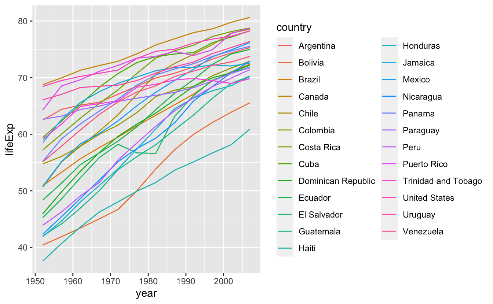

This plot has so many countries, and we can only visually distinguish colors so well, that it makes this a bit of a mess. We can do better!

 

------------------------------------------------------------------------

4 - Highlighting
----------------

What if we want to highlight one country of interest, with the backdrop of all the data in the Americas? We can do this using [`gghighlight()`](https://www.rdocumentation.org/packages/gghighlight/versions/0.1.0), which will distinguish our country of interest, from the rest of the countries which will be indicated in gray.

Let's highlight the United States, and since we are at it, let's also add x and y axis labels, a title, subtitle, and caption with `labs()`.

<pre class='chroma'><code class='language-r' data-lang='r'>gapminder_americas %&gt;%
  ggplot(<a href='https://ggplot2.tidyverse.org/reference/aes.html'>aes</a>(x = year, y = lifeExp, group = country, color = country)) +
  geom_line() +
  <a href='https://rdrr.io/pkg/gghighlight/man/gghighlight.html'>gghighlight</a>(country == "United States") +
  labs(x = "Year",
       y = "Life Expectancy (years)",
       title = "Life Expectancy in Countries in the Americas",
       subtitle = "From 1952 to 2007",
       caption = "Data from gapminder.org")
#&gt; Warning: Tried to calculate with group_by(), but the calculation failed.
#&gt; Falling back to ungrouped filter operation...
#&gt; label_key: country
</code></pre>
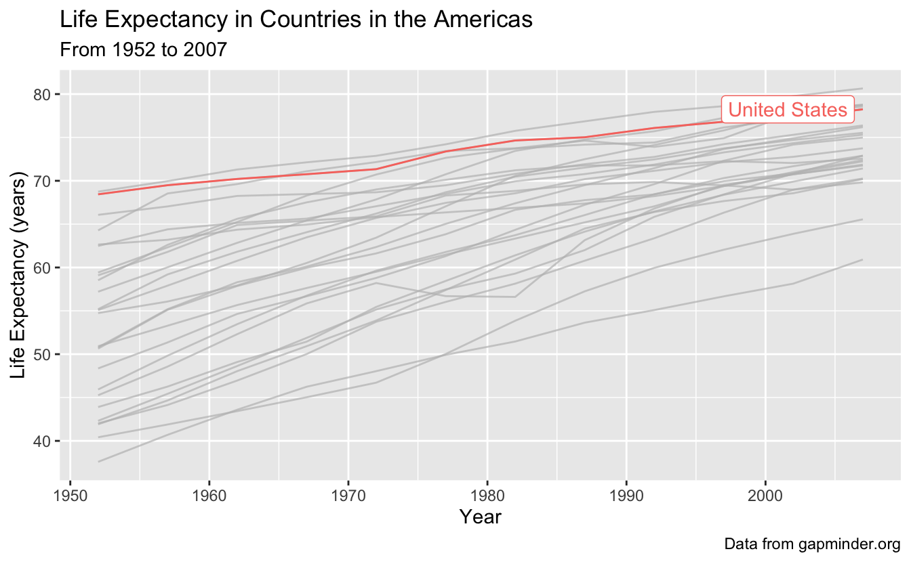

 

------------------------------------------------------------------------

5 - Faceting
------------

What if we want to see all the data at once, but just be able to better attribute each line to the correct country? We can use the [principle of small multiples](https://en.wikipedia.org/wiki/Small_multiple#), popularized by Edward Tufte, to make a series of charts all on the same scale to allow comparison between them easily.

We can facet using [`facet_wrap`](https://ggplot2.tidyverse.org/reference/facet_wrap.html) to create small plots for each country. If you want a certain number of rows or columns you can indicate them by including `ncol` and `nrow` in the `facet_wrap()` statement.

I have also made the strip text, or the label on top of each of the facets bigger using `theme`.

<pre class='chroma'><code class='language-r' data-lang='r'>gapminder_americas %&gt;%
  ggplot(<a href='https://ggplot2.tidyverse.org/reference/aes.html'>aes</a>(x = year, y = lifeExp, color = country)) +
  geom_line() +
  theme(strip.text.x = element_text(size = 14)) +
  facet_wrap(vars(country)) + # facet_wrap(~country) also works
  labs(x = "Year",
       y = "Life Expectancy (years)",
       title = "Life Expectancy in Countries in the Americas",
       subtitle = "From 1952 to 2007",
       caption = "Data from gapminder.org")
</code></pre>
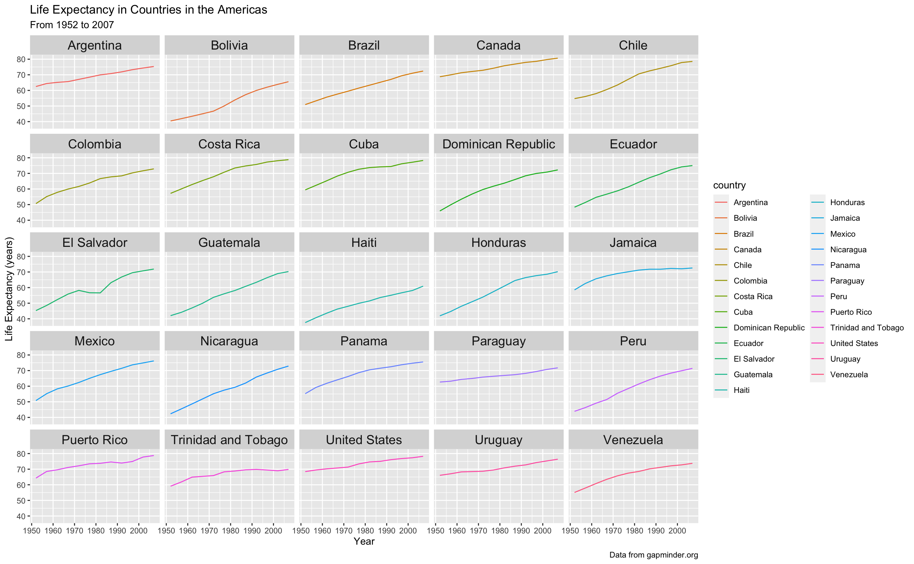

Now our legend is not necessary, so let's remove it. Let's also remove the gray background since its not really doing much for us. We will also change to `theme_minimal()` to get rid of the grey background which I don't think we need.

<pre class='chroma'><code class='language-r' data-lang='r'>gapminder_americas %&gt;%
  ggplot(<a href='https://ggplot2.tidyverse.org/reference/aes.html'>aes</a>(x = year, y = lifeExp)) +
  geom_line(<a href='https://ggplot2.tidyverse.org/reference/aes.html'>aes</a>(color = country)) +
  theme_minimal() +
  theme(legend.position = "none",
        strip.text.x = element_text(size = 14)) +
  facet_wrap(~country) +
  labs(x = "Year",
       y = "Life Expectancy (years)",
       title = "Life Expectancy in Countries in the Americas",
       subtitle = "From 1952 to 2007",
       caption = "Data from gapminder.org")
</code></pre>
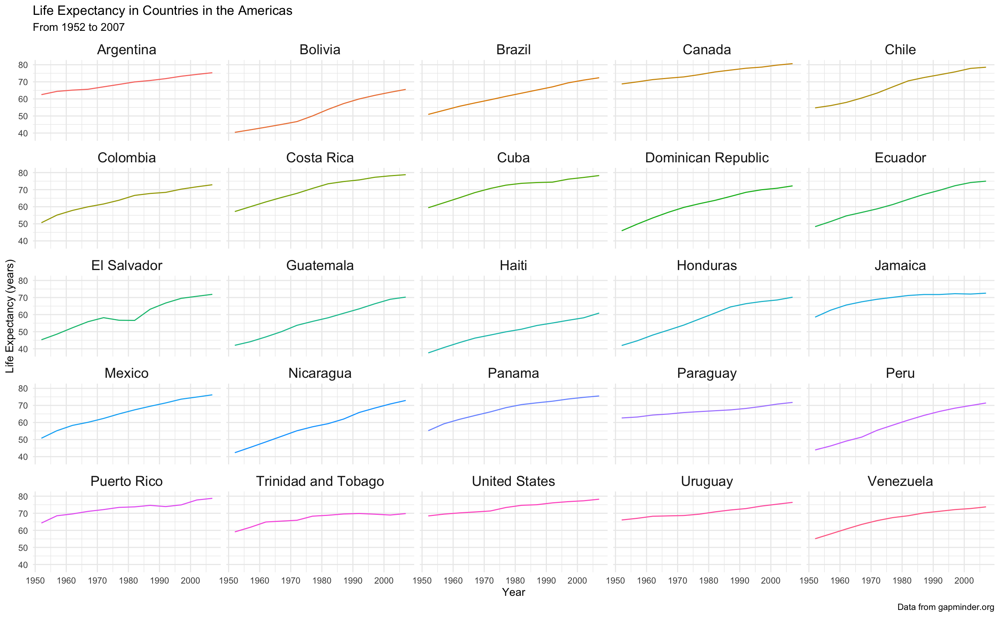

Wow better! But now its a bit hard to contextualize the line for each country to the whole dataset. We can fix this too.

 

------------------------------------------------------------------------

6 - Highlighting plus faceting
------------------------------

Let's bring the rest of data back in, and highlight in each facet the country of interest. We can do this by just adding [`gghighlight()`](https://rdrr.io/pkg/gghighlight/man/gghighlight.html) to our `ggplot` call.

Note: if you want to assign something in R to an object, and then view it, you can put the whole thing in parentheses, without having to call that object back at the end.

<pre class='chroma'><code class='language-r' data-lang='r'>(americas_lifeexp &lt;- gapminder_americas %&gt;%
  ggplot(<a href='https://ggplot2.tidyverse.org/reference/aes.html'>aes</a>(x = year, y = lifeExp)) +
  geom_line(<a href='https://ggplot2.tidyverse.org/reference/aes.html'>aes</a>(color = country)) +
  <a href='https://rdrr.io/pkg/gghighlight/man/gghighlight.html'>gghighlight</a>() +
  theme_minimal() +
  theme(legend.position = "none",
        strip.text.x = element_text(size = 14)) +
  facet_wrap(~country) +
  labs(x = "Year",
       y = "Life Expectancy (years)",
       title = "Life Expectancy in Countries in the Americas",
       subtitle = "From 1952 to 2007",
       caption = "Data from gapminder.org"))
#&gt; label_key: country
#&gt; Too many data series, skip labeling
</code></pre>
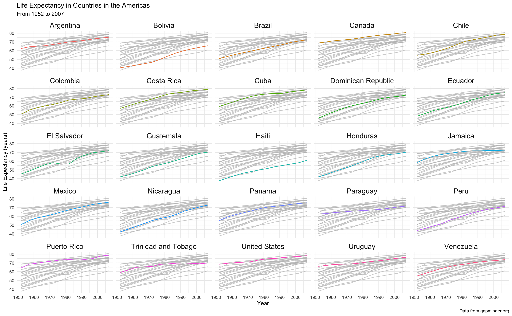

Wow, we now have so much more information about our data!

 

------------------------------------------------------------------------

7 - Adjusting scales while faceting
-----------------------------------

The default in faceting is that the x and y-axes for each plot are all the same. This aids in the interpretation of each small plot in relation to the others, but sometimes you may want freedom to adjust your axes.

For example, if we wanted to plot population over time, if we used the same scale, it would be really hard to see trends within a country.

<pre class='chroma'><code class='language-r' data-lang='r'>(americas_pop &lt;- gapminder_americas %&gt;%
  ggplot(<a href='https://ggplot2.tidyverse.org/reference/aes.html'>aes</a>(x = year, y = pop)) +
  geom_line(<a href='https://ggplot2.tidyverse.org/reference/aes.html'>aes</a>(color = country)) +
  theme_minimal() +
  theme(legend.position = "none",
        strip.text.x = element_text(size = 14)) +
  facet_wrap(~country) +
  labs(x = "Year",
       y = "Population",
       title = "Population in Countries in the Americas",
       subtitle = "From 1952 to 2007",
       caption = "Data from gapminder.org"))
</code></pre>
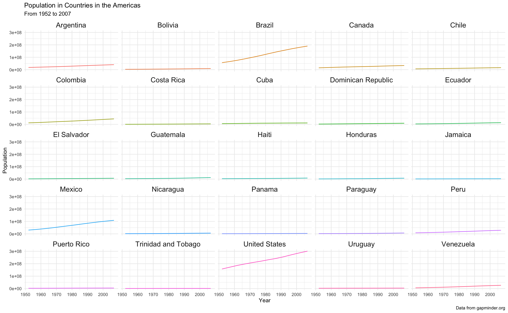

Let's change the scales so that the y-axis is "free" - i.e., each plot will have an independent y-axis. Note, when you do this, you aren't really using the principle of small multiples anymore, since the data isn't all on comparable scales.

<pre class='chroma'><code class='language-r' data-lang='r'>gapminder_americas %&gt;%
  ggplot(<a href='https://ggplot2.tidyverse.org/reference/aes.html'>aes</a>(x = year, y = pop)) +
  geom_line(<a href='https://ggplot2.tidyverse.org/reference/aes.html'>aes</a>(color = country)) +
  theme_minimal() +
  theme(legend.position = "none",
        strip.text.x = element_text(size = 14)) +
  facet_wrap(~country,
             scales = "free_y") +
  labs(x = "Year",
       y = "Population",
       title = "Population of Countries in the Americas",
       subtitle = "From 1952 to 2007",
       caption = "Data from gapminder.org")
</code></pre>
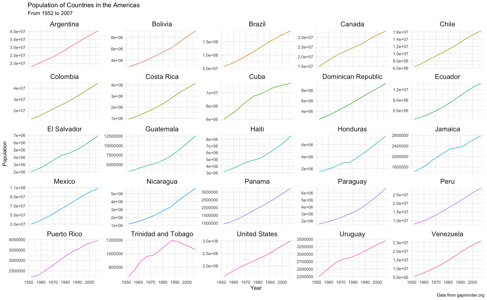

The default for `scales` is `"fixed"`, but you can also set to be `"free_x"`, `"free_y"`, or `"free"`, which means both x and y are free.

 

------------------------------------------------------------------------

8 - Multi-panel plots
---------------------

What if I take plots I've already made and assemble them together? You can do that simply with the package [`patchwork()`](https://patchwork.data-imaginist.com/).

Artwork by [Allison Horst](https://github.com/allisonhorst/stats-illustrations)

You can use the syntax:

-   `plot1 + plot2` to get two plots next to each other
-   `plot1 / plot2` to get two plots stacked vertically
-   `plot1 | (plot2 + plot3)` to get plot1 in the first row, and plots 2 and 3 in a second row

You can use [`plot_annotation()`](https://patchwork.data-imaginist.com/reference/plot_annotation.html) to indicate your plots with letters or numbers.

I am going to make some quick plots so we can see how it works. Let's look at some plots of the United States.

<pre class='chroma'><code class='language-r' data-lang='r'># make df with just United States data
gapminder_usa &lt;- gapminder %&gt;%
  <a href='https://rdrr.io/r/stats/filter.html'>filter</a>(country == "United States")

# make some plots
(usa_lifeexp &lt;- gapminder_usa %&gt;%
  ggplot(<a href='https://ggplot2.tidyverse.org/reference/aes.html'>aes</a>(x = year, y = lifeExp)) +
  geom_point())
</code></pre>
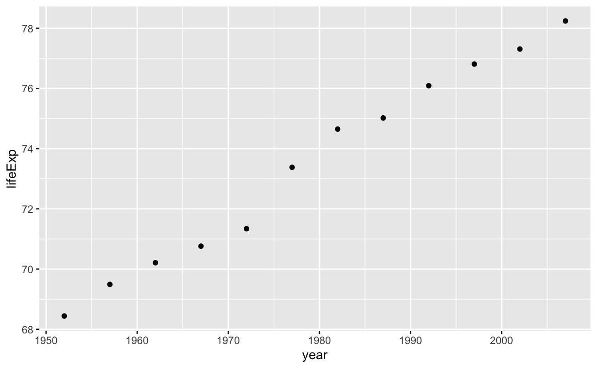

<pre class='chroma'><code class='language-r' data-lang='r'>(usa_gdppercap &lt;- gapminder_usa %&gt;%
  ggplot(<a href='https://ggplot2.tidyverse.org/reference/aes.html'>aes</a>(x = year, y = gdpPercap)) +
  geom_line())
</code></pre>

<pre class='chroma'><code class='language-r' data-lang='r'>(usa_pop &lt;- gapminder_usa %&gt;%
  ggplot(<a href='https://ggplot2.tidyverse.org/reference/aes.html'>aes</a>(x = year, y = pop)) +
  geom_col())
</code></pre>

Let's make multi-panel plots. If you need to wrap around a line, make sure you don't start your line with the +, it won't work (this is true for all `ggplot2` syntax).

<pre class='chroma'><code class='language-r' data-lang='r'>(usa_lifeexp + usa_gdppercap) / usa_pop +
<a href='https://patchwork.data-imaginist.com/reference/plot_annotation.html'>plot_annotation</a>(title = "Some plots about the United States",
                  tag_levels = "A")
</code></pre>
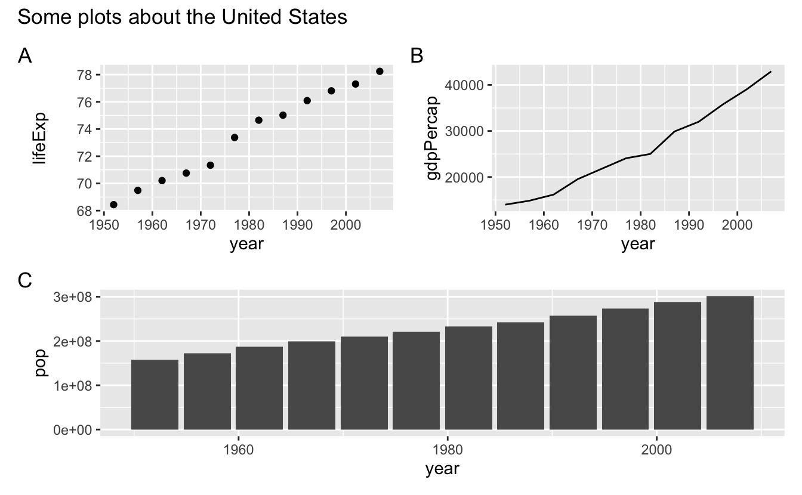

You can see how this would be really useful for publications!

 

------------------------------------------------------------------------

9 - Animating
-------------

Artwork by [Allison Horst](https://github.com/allisonhorst/stats-illustrations)

Since we have time-scale data here, we could also build an animation that would help us look at our data. What if we wanted to look at how life expectancy (`lifeExp`) and population (`pop`) change over time? We could animate over the variable `year`, and do this by using the function [`animate()`](https://gganimate.com/reference/animate.html), and set [`transition_states()`](https://gganimate.com/reference/transition_states.html) to the variable we are giffing over.

Note, I have included `closest_state` in the subtitle so the viewer can see what is the year at any stage of the animation.

To be able to tell which dot belongs to which country, I added a [`geom_text_repel()`](https://www.rdocumentation.org/packages/ggrepel/versions/0.9.1/topics/geom_label_repel) statement, which labels each point but is smart enough to not let the labels overlap.

I have also set `pop` to be on a log10 scale.

If you want to increase the resolution of your gif, and set the code chunk to `cache = TRUE` if the chunk runs slowly, so that it doesn't re-run when knitting if nothing has been edited, you can do this in the curly brackets at the top of your chunk, like this:

`{r, cache = TRUE, dpi = 600}`

<pre class='chroma'><code class='language-r' data-lang='r'># install.packages("transformr") 
# if you are having problems with gganimate you may need to install transformr

(p &lt;- ggplot(gapminder_americas, <a href='https://ggplot2.tidyverse.org/reference/aes.html'>aes</a>(x = lifeExp, y = pop, fill = country, label = country)) +
  geom_point(shape = 21, color = "black") +
  <a href='https://rdrr.io/pkg/ggrepel/man/geom_text_repel.html'>geom_text_repel</a>() +
  scale_y_log10() +
  theme_classic() +
  theme(legend.position = 'none') +
  labs(title = "Population and Life Expectancy in the Americas",
       subtitle = 'Year: &#123;closest_state&#125;', 
       x = "Life Expectancy", 
       y = "Log10 Population") +
  <a href='https://gganimate.com/reference/transition_states.html'>transition_states</a>(year))</code></pre>

There are many different ways to transition your data in `gganimate` - and you can learn more about them [here](https://gganimate.com/reference/index.html).

Saving my gif

Now I want to save my gif. We can do that simply with the function [`anim_save()`](https://gganimate.com/reference/anim_save.html) which works a lot like `ggsave()`.

<pre class='chroma'><code class='language-r' data-lang='r'># set parameters for your animation
<a href='https://gganimate.com/reference/animate.html'>animate</a>(p, 
        duration = 10, 
        fps = 10, 
        width = 700, 
        height = 700,
        renderer = <a href='https://gganimate.com/reference/renderers.html'>magick_renderer</a>())

# save it
<a href='https://gganimate.com/reference/anim_save.html'>anim_save</a>(filename = "gapminder_gif.gif",
          animation = <a href='https://gganimate.com/reference/last_animation.html'>last_animation</a>(),
          path = "/Users/jessicacooperstoneimac")</code></pre>

------------------------------------------------------------------------

10 - Breakout rooms
-------------------

Loading data and get set up
---------------------------

Load the `palmerpenguins` dataset, look at its structure, and view the beginning of the df.

<pre class='chroma'><code class='language-r' data-lang='r'><a href='https://rdrr.io/r/base/library.html'>library</a>(<a href='https://allisonhorst.github.io/palmerpenguins/'>palmerpenguins</a>)
<a href='https://rdrr.io/r/utils/str.html'>str</a>(penguins)
#&gt; tibble [344 × 8] (S3: tbl_df/tbl/data.frame)
#&gt;  $ species          : Factor w/ 3 levels "Adelie","Chinstrap",..: 1 1 1 1 1 1 1 1 1 1 ...
#&gt;  $ island           : Factor w/ 3 levels "Biscoe","Dream",..: 3 3 3 3 3 3 3 3 3 3 ...
#&gt;  $ bill_length_mm   : num [1:344] 39.1 39.5 40.3 NA 36.7 39.3 38.9 39.2 34.1 42 ...
#&gt;  $ bill_depth_mm    : num [1:344] 18.7 17.4 18 NA 19.3 20.6 17.8 19.6 18.1 20.2 ...
#&gt;  $ flipper_length_mm: int [1:344] 181 186 195 NA 193 190 181 195 193 190 ...
#&gt;  $ body_mass_g      : int [1:344] 3750 3800 3250 NA 3450 3650 3625 4675 3475 4250 ...
#&gt;  $ sex              : Factor w/ 2 levels "female","male": 2 1 1 NA 1 2 1 2 NA NA ...
#&gt;  $ year             : int [1:344] 2007 2007 2007 2007 2007 2007 2007 2007 2007 2007 ...
<a href='https://rdrr.io/r/utils/head.html'>head</a>(penguins)
#&gt; # A tibble: 6 x 8
#&gt;   species island bill_length_mm bill_depth_mm flipper_length_… body_mass_g sex  
#&gt;   &lt;fct&gt;   &lt;fct&gt;           &lt;dbl&gt;         &lt;dbl&gt;            &lt;int&gt;       &lt;int&gt; &lt;fct&gt;
#&gt; 1 Adelie  Torge…           39.1          18.7              181        3750 male 
#&gt; 2 Adelie  Torge…           39.5          17.4              186        3800 fema…
#&gt; 3 Adelie  Torge…           40.3          18                195        3250 fema…
#&gt; 4 Adelie  Torge…           NA            NA                 NA          NA NA   
#&gt; 5 Adelie  Torge…           36.7          19.3              193        3450 fema…
#&gt; 6 Adelie  Torge…           39.3          20.6              190        3650 male 
#&gt; # … with 1 more variable: year &lt;int&gt;</code></pre>

 

------------------------------------------------------------------------

### Main exercises

#### Exercise 1

Like we did in [Code Club 7](https://biodash.github.io/codeclub/08_pivoting/), convert the two columns about penguin bill dimensions `bill_length_mm` and `bill_depth_mm` to two columns called `bill_dimension` and `value`. Drop your NAs also. Save this as a new df called `penguins_long`.

 Hints (click here) 

Use a combination of `drop_na()` and `pivot_longer()`, and it's helpful if you also set `names_prefix` in your `pivot_longer()` statement but not totally necessary.  

 

 Solutions (click here) 

<pre class='chroma'><code class='language-r' data-lang='r'>penguins_long &lt;- penguins %&gt;%
  drop_na() %&gt;%
  pivot_longer(cols = bill_length_mm:bill_depth_mm,
               names_to = "bill_dimension",
               values_to = "value_mm",
               names_prefix = "bill_")

<a href='https://rdrr.io/r/utils/head.html'>head</a>(penguins_long)
#&gt; # A tibble: 6 x 8
#&gt;   species island flipper_length_… body_mass_g sex    year bill_dimension
#&gt;   &lt;fct&gt;   &lt;fct&gt;             &lt;int&gt;       &lt;int&gt; &lt;fct&gt; &lt;int&gt; &lt;chr&gt;         
#&gt; 1 Adelie  Torge…              181        3750 male   2007 length_mm     
#&gt; 2 Adelie  Torge…              181        3750 male   2007 depth_mm      
#&gt; 3 Adelie  Torge…              186        3800 fema…  2007 length_mm     
#&gt; 4 Adelie  Torge…              186        3800 fema…  2007 depth_mm      
#&gt; 5 Adelie  Torge…              195        3250 fema…  2007 length_mm     
#&gt; 6 Adelie  Torge…              195        3250 fema…  2007 depth_mm      
#&gt; # … with 1 more variable: value_mm &lt;dbl&gt;</code></pre>

 

------------------------------------------------------------------------

#### Exercise 2

Plot body mass (`body_mass_g`) as related to bill length and depth.

 Hints (click here) 

Faceting will be useful here.  

 

 Solutions (click here) 

<pre class='chroma'><code class='language-r' data-lang='r'>penguins_long %&gt;%
  ggplot(<a href='https://ggplot2.tidyverse.org/reference/aes.html'>aes</a>(x = body_mass_g, y = value_mm)) +
  geom_point() +
  facet_wrap(vars(bill_dimension))
</code></pre>
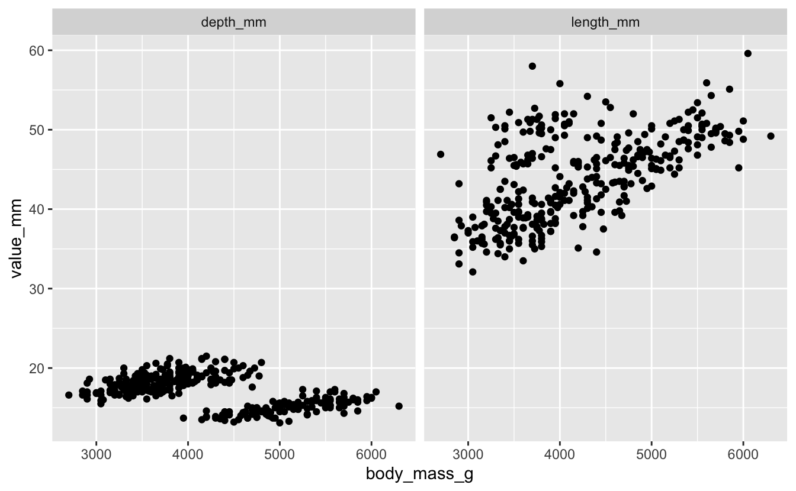

 

------------------------------------------------------------------------

#### Exercise 3

Take your plot from Exercise 2 and make it prettier. You can do things like change your axis labels, add title, change themes as you see fit. Color your points by `sex`.

 Hints (click here) 

Pick a theme you like. `theme_classic()` is a good place to start, and if you want to download the package `hrbrthemes`, I really like the [`theme_ipsum_rc()`](https://rdrr.io/pkg/hrbrthemes/man/theme_ipsum_rc.html).  
 

 

 Solutions (click here) 

I've included some code that let's you re-name the strip text, or the text that is above each of your facets. You do this with the [`labeller()`](https://ggplot2.tidyverse.org/reference/labeller.html) function.

<pre class='chroma'><code class='language-r' data-lang='r'><a href='https://rdrr.io/r/base/library.html'>library</a>(<a href='http://github.com/hrbrmstr/hrbrthemes'>hrbrthemes</a>) # for pretty &amp; easy themes

# formatting facet strip text labels
dim_mm &lt;- <a href='https://rdrr.io/r/base/c.html'>c</a>("Culman Bill Depth", "Culman Bill Length")
<a href='https://rdrr.io/r/base/names.html'>names</a>(dim_mm) &lt;- <a href='https://rdrr.io/r/base/c.html'>c</a>("depth_mm", "length_mm")

# this is just one example
penguins_long %&gt;%
  ggplot(<a href='https://ggplot2.tidyverse.org/reference/aes.html'>aes</a>(x = body_mass_g, y = value_mm, color = sex)) +
  geom_point() +
  <a href='https://rdrr.io/pkg/hrbrthemes/man/theme_ipsum_rc.html'>theme_ipsum_rc</a>() +
  theme(axis.title.x = element_text(hjust = 0.5),
        axis.title.y = element_text(hjust = 0.5),
        strip.text = element_text(hjust = 0.5)) +
  labs(x = "Body Mass (g)",
       y = "mm",
       title = "Bill length and depth vs. body mass in penguins",
       color = "Sex",
       caption = "Data from https://allisonhorst.github.io/palmerpenguins/") +
  facet_wrap(vars(bill_dimension),
             labeller = labeller(bill_dimension = dim_mm))
</code></pre>
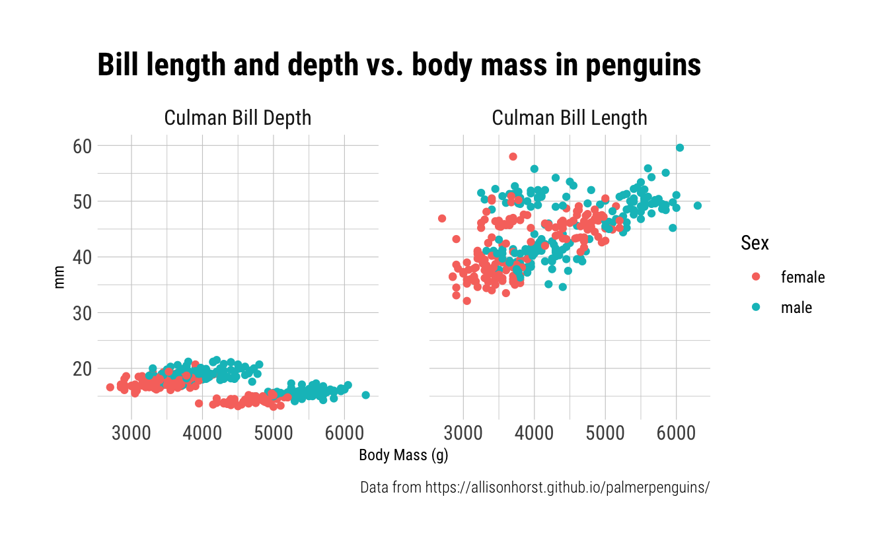

 

------------------------------------------------------------------------

#### Exercise 4

Add a second dimension of faceting by `species`.

 Hints (click here) 

You do this within your `facet_wrap()` call. You might want to try the formula syntax, which works like this: `var1~var2`.  

 

 Solutions (click here) 

<pre class='chroma'><code class='language-r' data-lang='r'>penguins_long %&gt;%
  ggplot(<a href='https://ggplot2.tidyverse.org/reference/aes.html'>aes</a>(x = body_mass_g, y = value_mm, color = sex)) +
  geom_point() +
  <a href='https://rdrr.io/pkg/hrbrthemes/man/theme_ipsum_rc.html'>theme_ipsum_rc</a>() +
  theme(axis.title.x = element_text(hjust = 0.5),
        axis.title.y = element_text(hjust = 0.5),
        strip.text = element_text(hjust = 0.5)) +
  labs(x = "Body Mass (g)",
       y = "mm",
       title = "Bill length and depth vs. body mass in penguins",
       color = "Sex",
       caption = "Data from https://allisonhorst.github.io/palmerpenguins/") +
  facet_wrap(bill_dimension~species,
             labeller = labeller(bill_dimension = dim_mm))
</code></pre>
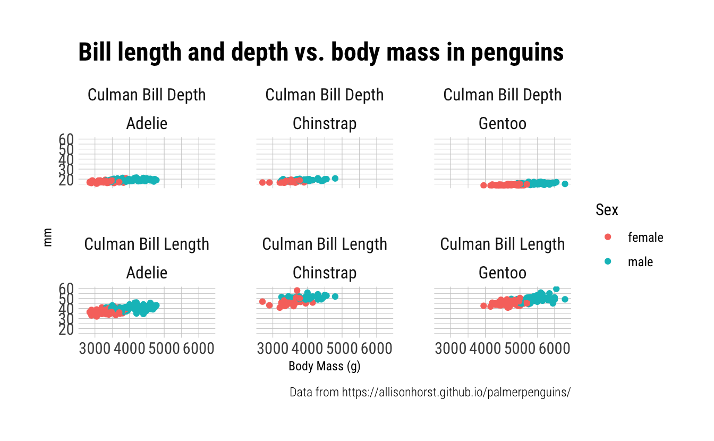

 

------------------------------------------------------------------------

#### Exercise 5

Using your plot from Exercise 3, highlight the datapoints coming from Dream Island in purple.

 Hints (click here) 

You can use syntax inside [`gghighlight()`](https://rdrr.io/pkg/gghighlight/man/gghighlight.html) just like you do in [`filter()`](https://rdrr.io/r/stats/filter.html).  

 

 Solutions (click here) 

<pre class='chroma'><code class='language-r' data-lang='r'># what are our islands?
<a href='https://rdrr.io/r/base/unique.html'>unique</a>(penguins_long$island)
#&gt; [1] Torgersen Biscoe    Dream    
#&gt; Levels: Biscoe Dream Torgersen

penguins_long %&gt;%
  ggplot(<a href='https://ggplot2.tidyverse.org/reference/aes.html'>aes</a>(x = body_mass_g, y = value_mm)) +
  geom_point(color = "purple") +
  <a href='https://rdrr.io/pkg/gghighlight/man/gghighlight.html'>gghighlight</a>(island == "Dream") +
  facet_wrap(vars(bill_dimension))
</code></pre>
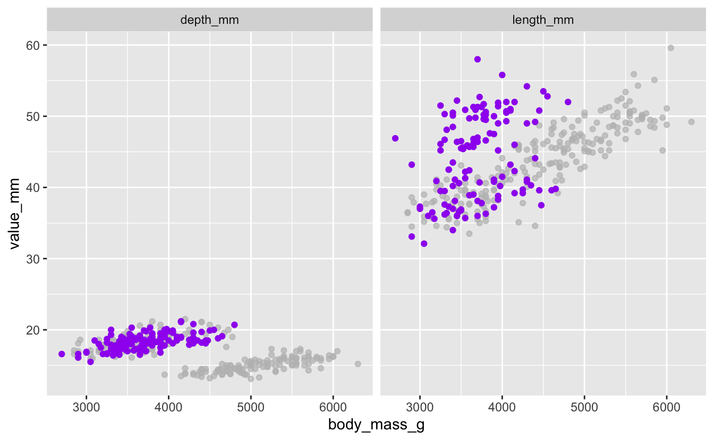

 

------------------------------------------------------------------------

#### Exercise 6

Using your sample plot for Exercise 3, highlight penguins that have a `body_mass_g` less than 3500 g, in blue.

 Hints (click here) 

You can use syntax inside [`gghighlight()`](https://rdrr.io/pkg/gghighlight/man/gghighlight.html) just like you do in [`filter()`](https://rdrr.io/r/stats/filter.html), and you can also use these filter functions like [`<`](https://rdrr.io/r/base/Comparison.html), [`>`](https://rdrr.io/r/base/Comparison.html), [`<=`](https://rdrr.io/r/base/Comparison.html), [`!`](https://rdrr.io/r/base/Logic.html) and `AND` inside your call.  

 

 Solutions (click here) 

<pre class='chroma'><code class='language-r' data-lang='r'># what are our islands?
<a href='https://rdrr.io/r/base/unique.html'>unique</a>(penguins_long$island)
#&gt; [1] Torgersen Biscoe    Dream    
#&gt; Levels: Biscoe Dream Torgersen

penguins_long %&gt;%
  ggplot(<a href='https://ggplot2.tidyverse.org/reference/aes.html'>aes</a>(x = body_mass_g, y = value_mm)) +
  geom_point(color = "blue") +
  <a href='https://rdrr.io/pkg/gghighlight/man/gghighlight.html'>gghighlight</a>(island == "Dream") +
  facet_wrap(vars(bill_dimension))
</code></pre>
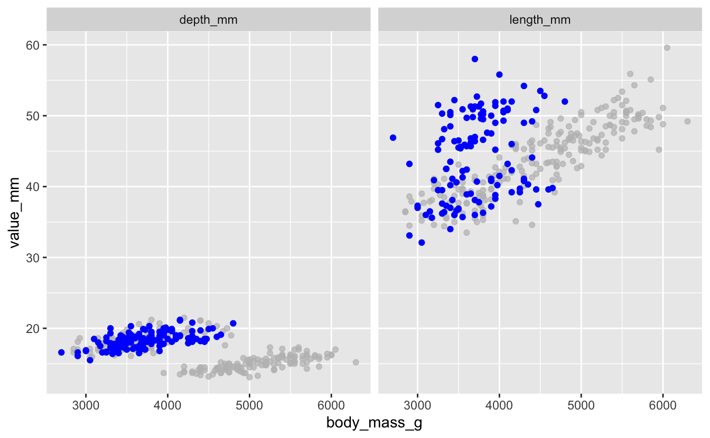

 

------------------------------------------------------------------------

### Bonus exercises

#### Bonus 1

Plot `flipper_length_mm` vs. `body_mass_g` and animate the plot to show only one `species` at a time.

 Hints (click here) 

Try animating over `species`, using [`transition_states()`](https://gganimate.com/reference/transition_states.html) and set `{closest_state}` in your title or subtitle so you can tell what you're looking at.  

 

 Solutions (click here) 

<pre class='chroma'><code class='language-r' data-lang='r'>flipper_by_BW &lt;- penguins %&gt;%
  ggplot(<a href='https://ggplot2.tidyverse.org/reference/aes.html'>aes</a>(x = body_mass_g, y = flipper_length_mm, fill = species)) +
  geom_point(shape = 21, color = "black") +
  theme_classic() +
  theme(legend.position = 'none') +
  labs(title = "Population and Life Expectancy in the Americas",
       subtitle = 'Penguin Species: &#123;closest_state&#125;', 
       x = "Body Mass (g)", 
       y = "Flipper Length (mm)") +
  <a href='https://gganimate.com/reference/transition_states.html'>transition_states</a>(species) 

<a href='https://gganimate.com/reference/animate.html'>animate</a>(flipper_by_BW)</code></pre>

 

------------------------------------------------------------------------

#### Bonus 2

You have now made an excellent gif, so save it!

 Hints (click here) 

Use [`anim_save()`](https://gganimate.com/reference/anim_save.html) to save your animation, which works in a similar way to [`ggsave()`](https://ggplot2.tidyverse.org/reference/ggsave.html), which is another very useful function.  

 

 Solutions (click here) 

<pre class='chroma'><code class='language-r' data-lang='r'># set parameters for your animation
<a href='https://gganimate.com/reference/animate.html'>animate</a>(flipper_by_BW, 
        duration = 10, 
        fps = 10, 
        width = 700, 
        height = 700,
        renderer = <a href='https://gganimate.com/reference/renderers.html'>magick_renderer</a>())

# save it
<a href='https://gganimate.com/reference/anim_save.html'>anim_save</a>(filename = "flippers_by_mass.gif",
          animation = <a href='https://gganimate.com/reference/last_animation.html'>last_animation</a>(),
          path = "YOUR_PATH_HERE")</code></pre>

 

------------------------------------------------------------------------

#### Bonus 3

Let's practice making multi-panel plots. Plot:

Boxplot of `body_mass_g` by `sex`

Histogram of number of observations per `island`

Distribution of `flipper_length_mm` by `species`.

Tag your plots so each has a lowercase letter associated with it.

 Hints (click here) 

Use the syntax from the package `patchwork`. You can learn more [here](https://patchwork.data-imaginist.com/). Also use [`plot_annotation()`](https://patchwork.data-imaginist.com/reference/plot_annotation.html).  

 

 Solutions (click here) 

-   `title` allows you to set a title
-   `tag_levels` allows you to determine how you want your panels to be tagged.

Boxplot of `body_mass_g` by `sex`.

<pre class='chroma'><code class='language-r' data-lang='r'>penguins_mass_by_sex &lt;- penguins_long %&gt;%
  ggplot(<a href='https://ggplot2.tidyverse.org/reference/aes.html'>aes</a>(x = sex, y = body_mass_g)) +
  geom_boxplot()

penguins_mass_by_sex
</code></pre>

Histogram of number of observations per `island`.

<pre class='chroma'><code class='language-r' data-lang='r'>penguins_by_island &lt;- penguins_long %&gt;%
  ggplot(<a href='https://ggplot2.tidyverse.org/reference/aes.html'>aes</a>(y = island, fill = island)) +
  geom_histogram(stat = "count")
#&gt; Warning: Ignoring unknown parameters: binwidth, bins, pad

penguins_by_island
</code></pre>

Distribution of `flipper_length_mm` by `species`.

<pre class='chroma'><code class='language-r' data-lang='r'>penguins_flipper_species &lt;- penguins_long %&gt;%
  ggplot(<a href='https://ggplot2.tidyverse.org/reference/aes.html'>aes</a>(x = flipper_length_mm, group = species, fill = species)) +
  geom_density(alpha = 0.5) +
  scale_fill_viridis_d()

penguins_flipper_species
</code></pre>
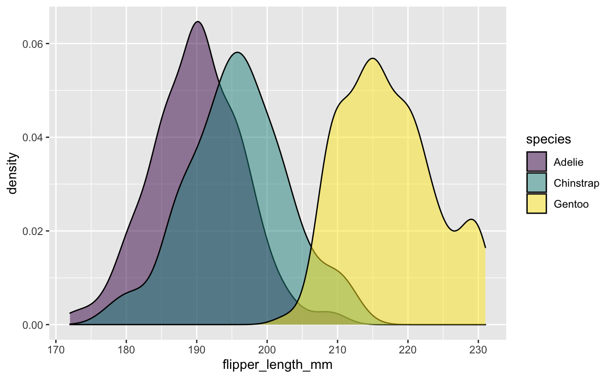

<pre class='chroma'><code class='language-r' data-lang='r'>penguins_flipper_species / (penguins_mass_by_sex + penguins_by_island) +
  <a href='https://patchwork.data-imaginist.com/reference/plot_annotation.html'>plot_annotation</a>(title = "Looking at penguins...",
                  tag_levels = "a")
</code></pre>
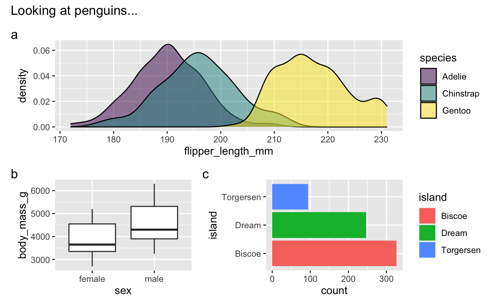

 

------------------------------------------------------------------------

