   

Today, we will cover the visualization of spatial data in R using the layered grammar of graphics implementation of ggplot2 in conjunction with the contextual information of static maps from world maps in the *maps* package.

**Before we look at mapping using ggplot2, let us define some terms.**

*Areal data*   Areal data is data which corresponds to geographical extents with polygonal boundaries.

*The layered grammar of graphics*   By definition, the layered grammar demands that every plot consist of five components:  

-   a default dataset with aesthetic mappings, 

-   one or more layers, each with either a geometric object ("geom"), a statistical transformation ("stat"), etc. 

-   a scale for each aesthetic mapping (which can be automatically generated), 

-   a coordinate system, and  

-   a facet specification.  

Since *ggplot2* is an implementation of the layered grammar of graphics, every plot made with ggplot2 has each of the above elements. Consequently, map plots also have these elements, but certain elements are fixed to map components: the `x` aesthetic is fixed to longitude, the `y` aesthetic is fixed to latitude.

**Drawing a map**   Drawing a map in R requires two things. **First**, we have to draw the map using data that directs R to draw the polygon shapes that constitute the map. Then we **add** information to our map to plot color and marks. It's the same basic logic that we have used in ggplot figures. The key thing is to have datasets that link that geographic data with the information that we want to put on the plot.

*The maps package in R*   The "maps" package in R contains a set of maps of the United States and the world drawn using longitude and latitude data. With world map, the USA map with the individual states you can accomplish a lot of the mapping tasks using the maps package. The maps package contains a lot of outlines of continents, countries, states, and counties

**Making data frames from map outlines by ggplot2**   Recall that ggplot2 operates on data frames. Therefore, we need some way to translate the maps data into a data frame format the ggplot can use. The package *ggplot2* provides the `map_data()` function. The function turns a series of points along an outline into a data frame of those points. The package ggplot2 uses the following syntax: `map_data("name")` where "name" is a quoted string of the name of a map in the *maps* package. 

Let us start by drawing maps of the World, USA, states, Ohio, Ohio and Indiana, and part of Europe using the *maps* package.

<pre class='chroma'><code class='language-r' data-lang='r'><a href='https://rdrr.io/r/base/library.html'>library</a>(<a href='http://tidyverse.tidyverse.org'>tidyverse</a>)
<a href='https://rdrr.io/r/base/library.html'>library</a>(maps)
<a href='https://rdrr.io/r/base/library.html'>library</a>(<a href='https://scales.r-lib.org'>scales</a>)
<a href='https://rdrr.io/r/base/library.html'>library</a>(<a href='http://stringr.tidyverse.org'>stringr</a>)

# Let us get a world map using the "map_data" function 
world &lt;- map_data("world")

## Let us get a US map including Hawaii, Alaska, and Puerto Rico:
usa &lt;- map_data("usa")

# Let us get the states:
states &lt;- map_data("state")

# Select Ohio using the filter function:
ohio &lt;- states %&gt;%
  <a href='https://rdrr.io/r/stats/filter.html'>filter</a>(region == "ohio")
</code></pre>

-   Let us plot a world map:

<pre class='chroma'><code class='language-r' data-lang='r'>ggplot(data = world,
       mapping = aes(x = long, y = lat, group = group)) +
 geom_polygon(fill = "white", color = "black")

</code></pre>
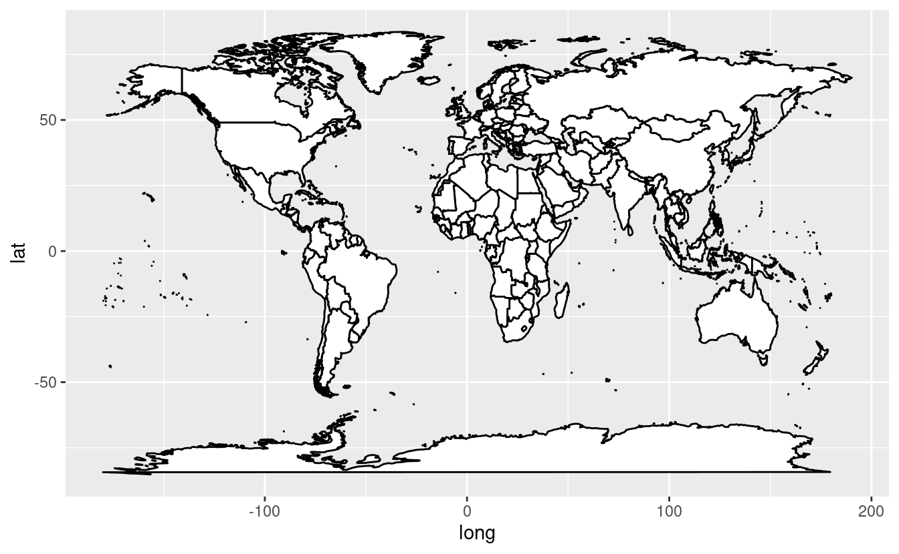

-   Let us plot a map of the US:

<pre class='chroma'><code class='language-r' data-lang='r'>ggplot(data = usa,
       mapping = aes(x = long, y= lat, group = group)) +
 geom_polygon(fill = "white", color = "black")

</code></pre>

-   Let us plot a map of the US with states:

<pre class='chroma'><code class='language-r' data-lang='r'>ggplot(data = states,
       mapping = aes(x = long, y = lat, group = group)) +
 geom_polygon(fill = "blue", color = "black")

</code></pre>

-   Let us plot a map of Ohio:

<pre class='chroma'><code class='language-r' data-lang='r'>ggplot(data = ohio,
       mapping=aes(x = long, y = lat, group = group)) + 
  geom_polygon(fill = "white", color = "green")

</code></pre>
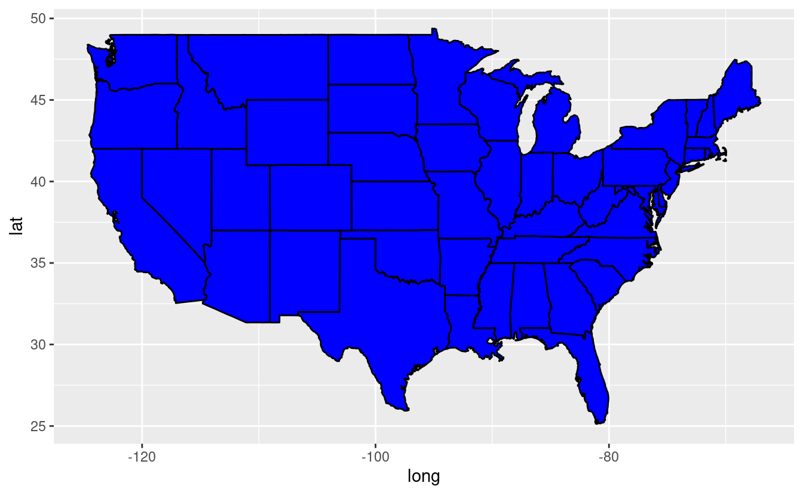

-   We can also plot a map for an arbitrary selection of states:

<pre class='chroma'><code class='language-r' data-lang='r'># We can select data for two states, for example Ohio and Indiana:
ohio_indiana &lt;- states %&gt;% 
  <a href='https://rdrr.io/r/stats/filter.html'>filter</a>(region == "ohio" | region == "indiana")

# Plot the map of Ohio and Indiana:
ggplot(data = ohio_indiana,
       mapping = aes(x = long, y = lat, group = group)) + 
  geom_polygon(fill = "green" , color = "red")

</code></pre>
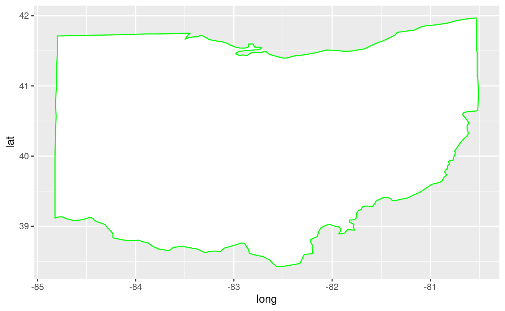

-   We can also plot only a specific region by filtering by latitude and longitude:

<pre class='chroma'><code class='language-r' data-lang='r'>world &lt;- map_data("world")
a_region &lt;- <a href='https://rdrr.io/r/stats/filter.html'>filter</a>(world, long &gt;- 10 &amp; long &lt; 15.1 &amp; lat &gt; 32 &amp; lat &lt; 55)

ggplot(data = a_region,
       mapping = aes(x = long, y = lat, group = group)) +
  geom_polygon(fill = "white", color = "black") +
  coord_fixed(1.3)

</code></pre>
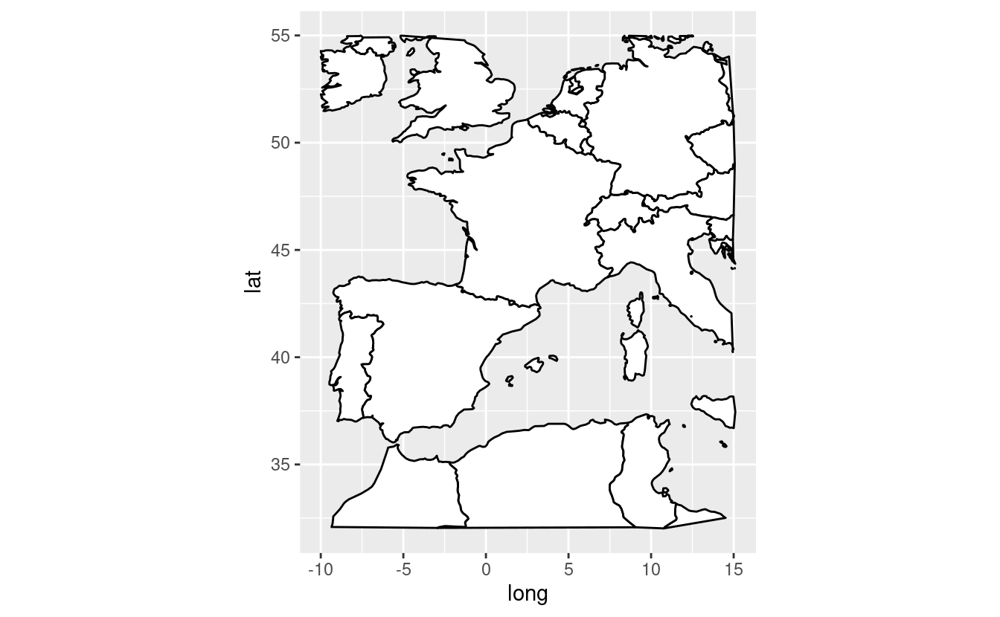

### The structure of the data frame `ohio`.

<pre class='chroma'><code class='language-r' data-lang='r'><a href='https://rdrr.io/r/utils/head.html'>head</a>(ohio)

#&gt;        long      lat group order region subregion
#&gt; 1 -80.51776 40.64563    42 10440   ohio      &lt;NA&gt;
#&gt; 2 -80.55787 40.63990    42 10441   ohio      &lt;NA&gt;
#&gt; 3 -80.62089 40.63417    42 10442   ohio      &lt;NA&gt;
#&gt; 4 -80.66100 40.61698    42 10443   ohio      &lt;NA&gt;
#&gt; 5 -80.66673 40.60552    42 10444   ohio      &lt;NA&gt;
#&gt; 6 -80.67245 40.58833    42 10445   ohio      &lt;NA&gt;
</code></pre>

Look at the variables in *ohio*, note what they refer to:  

-   `long` = longitude. Lines of longitude, or meridians, run between the North and South Poles and measure east-west positions. While prime meridian is assigned the value of 0 degrees, and runs through Greenwich (England), meridians to the west of the prime meridian are measured in degrees west (up to 180 degrees) and those to the east of the prime meridian are measured to in degrees east (up to 180 degrees). 

-   `lat` = latitude. Lines of latitude measure north-south position between the poles with the equator defined as 0 degrees, the North Pole defined as 90 degrees north, and the South Pole defined as 90 degrees south.  

-   `group` = an identifier that is unique for each subregion (here the counties). Group is very important! ggplot2's functions can take a group argument which controls (amongst other things) whether adjacent points should be connected by lines. If they are in the same group, then they get connected, but if they are in different groups then they don't.  

-   `order` = an identifier that indicates the order in which the boundary lines should be drawn  

-   `region` = string indicator for regions (here the states)  

-   `subregion` = string indicator for sub-regions (here the county names)  

Part II: Add information to the maps
------------------------------------

**The second part of mapping in R, is to add information on the map created in the first part.**   In drawing the map, the "*maps*" package creates the backbone for visualizations. Then we add additional information to show colors and shapes.  

*We will:*   - fill a map by region,   - draw a Bubble map using city population,   - make a point for every city,   - vary size of point by city size and vary the color of the dots, and   - add external data to the map.  

-   Let us fill by region and make sure the the lines of state borders are white:

<pre class='chroma'><code class='language-r' data-lang='r'>ggplot(data = states) + 
 geom_polygon(aes(x = long, y = lat, fill = region, group = group),
              color = "white") + 
 coord_fixed(1.3) +
 guides(fill = FALSE) # Do this to omit the legend

</code></pre>
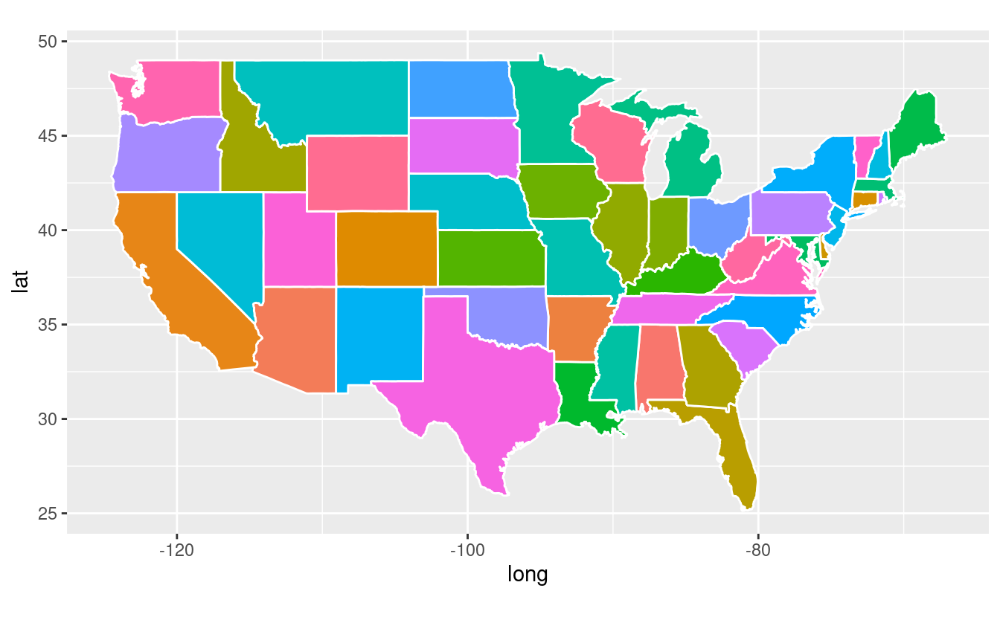

-   Let us draw a "Bubble map":

<pre class='chroma'><code class='language-r' data-lang='r'># The maps package has city data
<a href='https://rdrr.io/r/utils/head.html'>head</a>(maps::<a href='https://rdrr.io/pkg/maps/man/world.cities.html'>world.cities</a>)

#&gt;                 name country.etc   pop   lat  long capital
#&gt; 1 'Abasan al-Jadidah   Palestine  5629 31.31 34.34       0
#&gt; 2 'Abasan al-Kabirah   Palestine 18999 31.32 34.35       0
#&gt; 3       'Abdul Hakim    Pakistan 47788 30.55 72.11       0
#&gt; 4 'Abdullah-as-Salam      Kuwait 21817 29.36 47.98       0
#&gt; 5              'Abud   Palestine  2456 32.03 35.07       0
#&gt; 6            'Abwein   Palestine  3434 32.03 35.20       0

my_cities &lt;- maps::<a href='https://rdrr.io/pkg/maps/man/world.cities.html'>world.cities</a>

usa_cities &lt;- <a href='https://rdrr.io/r/stats/filter.html'>filter</a>(my_cities,country.etc == "USA")

<a href='https://rdrr.io/r/utils/head.html'>head</a>(usa_cities)

#&gt;      name country.etc    pop   lat    long capital
#&gt; 1 Abilene         USA 113888 32.45  -99.74       0
#&gt; 2   Akron         USA 206634 41.08  -81.52       0
#&gt; 3 Alameda         USA  70069 37.77 -122.26       0
#&gt; 4  Albany         USA  45535 44.62 -123.09       0
#&gt; 5  Albany         USA  75510 31.58  -84.18       0
#&gt; 6  Albany         USA  93576 42.67  -73.80       0
</code></pre>

-   Make a point for every city:

<pre class='chroma'><code class='language-r' data-lang='r'>ggplot(data = usa,
       mapping = aes(x = long, y = lat, group = group)) +
 geom_polygon(color = "black", fill = "white") +
 geom_point(data = usa_cities, color = "red",
            aes(x = long, y = lat, group = NULL))

</code></pre>

-   Let's pick just the big cities:

<pre class='chroma'><code class='language-r' data-lang='r'>usa_big_cities &lt;- <a href='https://rdrr.io/r/stats/filter.html'>filter</a>(my_cities, country.etc == "USA" &amp; pop &gt; 500000)

ggplot(data = usa, mapping = aes(x = long, y = lat, group = group)) +
  geom_polygon(color = "black", fill = "white") +
  geom_point(data = usa_big_cities, color = "red",
             aes(x = long, y = lat, group = NULL))

</code></pre>

-   Vary size of point by city size:

<pre class='chroma'><code class='language-r' data-lang='r'>ggplot(data = usa, mapping = aes(x = long, y = lat, group = group)) +
  geom_polygon(color = "black", fill = "white") +
  geom_point(data = usa_big_cities, color = "red",
             aes(x = long, y = lat, group = NULL, size = pop))

</code></pre>
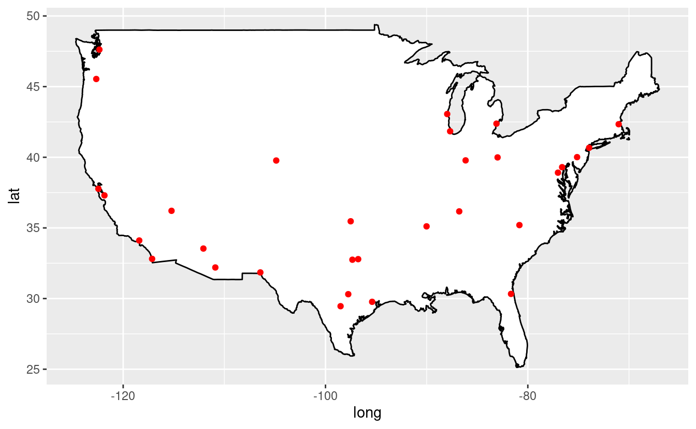

-   Now vary the color of the dots:

<pre class='chroma'><code class='language-r' data-lang='r'>usa_big_cities$qual &lt;- <a href='https://rdrr.io/r/base/sample.html'>sample</a>(LETTERS[1:5], <a href='https://rdrr.io/r/base/nrow.html'>nrow</a>(usa_big_cities),
                              replace = TRUE)

ggplot(data = usa, mapping = aes(x = long, y = lat, group = group)) +
  geom_polygon(color = "black", fill = "white") +
  geom_point(data = usa_big_cities,
             aes(x = long, y = lat, group = NULL, color = qual, size = pop))

</code></pre>
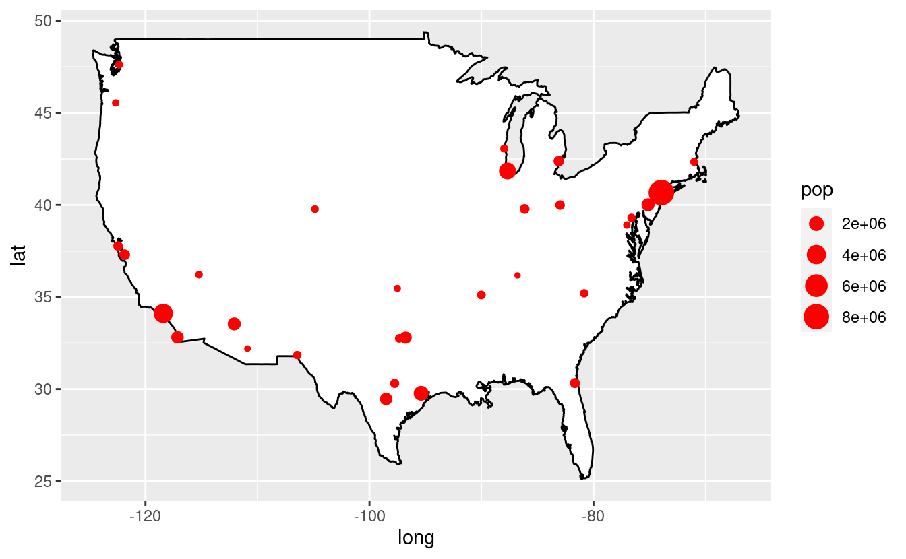

-   Tweak the map:

<pre class='chroma'><code class='language-r' data-lang='r'># No scientific notation in legend r ggplot:
# scales package adds the "scale_size_continuous" function, and we can set label=comma
<a href='https://rdrr.io/r/base/library.html'>library</a>(<a href='https://scales.r-lib.org'>scales</a>)

# Change the column name to make the legend nicer"
usa_big_cities$Population &lt;- usa_big_cities$pop
usa_big_cities$Qualitative &lt;- usa_big_cities$qual

# Do some additional refining:
ggplot(data = usa, mapping = aes(x = long, y= lat, group = group)) + 
  geom_polygon(color = "black", fill = "white") +
  geom_point(data = usa_big_cities,
             aes(x = long, y = lat, group = NULL,
                 color = Qualitative, size = Population)) +
  scale_size_continuous(label = comma)

</code></pre>
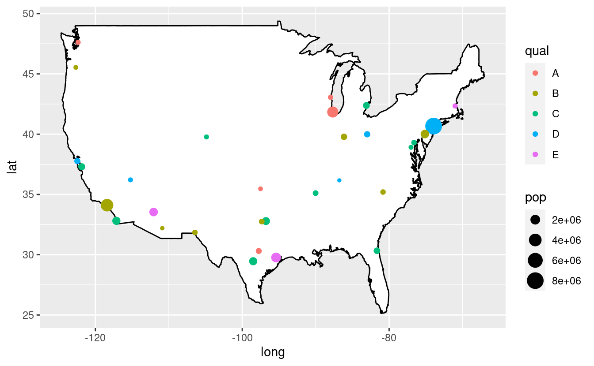

-   Work with Ohio counties with external data:

<pre class='chroma'><code class='language-r' data-lang='r'># Get basic map data for all USA counties:
usa_counties = map_data("county") 

# Subset to counties in Ohio:
oh = <a href='https://rdrr.io/r/base/subset.html'>subset</a>(usa_counties, region == "ohio") 
<a href='https://rdrr.io/r/utils/head.html'>head</a>(oh)

#&gt;            long      lat group order region subregion
#&gt; 59960 -83.66902 39.02989  2012 59960   ohio     adams
#&gt; 59961 -83.56590 39.02989  2012 59961   ohio     adams
#&gt; 59962 -83.37109 39.06426  2012 59962   ohio     adams
#&gt; 59963 -83.30806 39.06426  2012 59963   ohio     adams
#&gt; 59964 -83.30233 39.05280  2012 59964   ohio     adams
#&gt; 59965 -83.25649 39.01842  2012 59965   ohio     adams
</code></pre>

<pre class='chroma'><code class='language-r' data-lang='r'># Plot ohio counties
ggplot() +
  geom_polygon(data = oh,
               aes(x = long, y = lat, group = group, fill = subregion),
               color = "black", alpha = 0.3) + 
  coord_fixed(1.3) +
  guides(fill = FALSE) +
  ggtitle("Ohio counties")  

</code></pre>

-   Read population data for Ohio counties:

<pre class='chroma'><code class='language-r' data-lang='r'># The data of the estimated population of each  county in 2021 and percent change from 2010
Ohio &lt;- read_csv("Ohio.csv")
<a href='https://rdrr.io/r/utils/head.html'>head</a>(Ohio)

#&gt; # A tibble: 6 x 3
#&gt;   county     Pop  Perc
#&gt;   &lt;chr&gt;    &lt;dbl&gt; &lt;dbl&gt;
#&gt; 1 Vinton   12965 -3.28
#&gt; 2 Monroe   13388 -8.36
#&gt; 3 Morgan   14362 -4.47
#&gt; 4 Noble    14578 -0.56
#&gt; 5 Harrison 14786 -6.57
#&gt; 6 Paulding 18532 -5.24
</code></pre>

-   Prepare the data for plotting:

<pre class='chroma'><code class='language-r' data-lang='r'># Create a new  column called  "county" so that counties start with capital letters
# using str_to_title function 
oh$county &lt;- <a href='https://stringr.tidyverse.org/reference/case.html'>str_to_title</a>(oh$subregion)

# Merge population data with counties data by county variable using inner_join
# function, and named the new object "ohio_pop"
ohio_pop &lt;- inner_join(oh, Ohio, by = "county")

# Select counties with population greater than 100000
ohio_big_pop &lt;- <a href='https://rdrr.io/r/stats/filter.html'>filter</a>(ohio_pop, Pop &gt; 100000)
</code></pre>

-   Create the plot where we vary point size by population size:

<pre class='chroma'><code class='language-r' data-lang='r'>ggplot(data = ohio_pop, mapping = aes(x = long, y = lat, group = group)) +
  geom_polygon(color = "black", fill = "white") +
  geom_point(data = ohio_big_pop, color = "red",
             aes(x = long, y = lat, group = NULL, size = Pop)) +
  guides(size = FALSE)  #  Do this to omit the legend

</code></pre>

-   The points are plotted on the boundaries of the counties Improve the graph by creating groups of population using quantile.

<pre class='chroma'><code class='language-r' data-lang='r'>ApplyQuintiles &lt;- function(x) &#123;
  <a href='https://rdrr.io/r/base/cut.html'>cut</a>(x, breaks = <a href='https://rdrr.io/r/base/c.html'>c</a>(<a href='https://rdrr.io/r/stats/quantile.html'>quantile</a>(ohio_pop$Pop, probs = <a href='https://rdrr.io/r/base/seq.html'>seq</a>(0, 1, by = 0.2))),
      labels = <a href='https://rdrr.io/r/base/c.html'>c</a>("0-20", "20-40", "40-60", "60-80", "80-100"),
      include.lowest = TRUE)
&#125;

ohio_pop$grouped_pop &lt;- <a href='https://rdrr.io/r/base/lapply.html'>sapply</a>(ohio_pop$Pop, ApplyQuintiles)
<a href='https://rdrr.io/r/utils/head.html'>head</a>(ohio_pop)

#&gt;        long      lat group order region subregion county   Pop  Perc
#&gt; 1 -83.66902 39.02989  2012 59960   ohio     adams  Adams 27706 -2.91
#&gt; 2 -83.56590 39.02989  2012 59961   ohio     adams  Adams 27706 -2.91
#&gt; 3 -83.37109 39.06426  2012 59962   ohio     adams  Adams 27706 -2.91
#&gt; 4 -83.30806 39.06426  2012 59963   ohio     adams  Adams 27706 -2.91
#&gt; 5 -83.30233 39.05280  2012 59964   ohio     adams  Adams 27706 -2.91
#&gt; 6 -83.25649 39.01842  2012 59965   ohio     adams  Adams 27706 -2.91
#&gt;   grouped_pop
#&gt; 1        0-20
#&gt; 2        0-20
#&gt; 3        0-20
#&gt; 4        0-20
#&gt; 5        0-20
#&gt; 6        0-20
</code></pre>

-   Plot the map:

<pre class='chroma'><code class='language-r' data-lang='r'>ggplot() +
  geom_polygon(data = ohio_pop,
               aes(x = long, y = lat, group = group, fill = grouped_pop),
               color = "black") + 
  coord_fixed(1.3) +
  scale_fill_brewer(palette = "Set1", direction = -1) +
  labs(fill = "Population Quantiles") 

</code></pre>
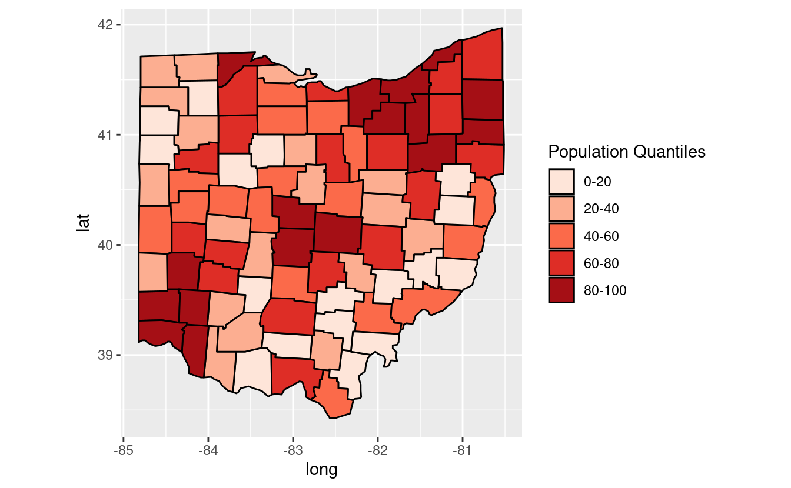

Breakout rooms
--------------

### Exercise 1

Use the dataset of 2021 Ohio county's population to plot counties with % positive population growth.

 Solution (click here) 

<pre class='chroma'><code class='language-r' data-lang='r'># get basic map data for all USA counties 
usa_counties = map_data("county")    

# subset to counties in Ohio 
oh = <a href='https://rdrr.io/r/base/subset.html'>subset</a>(usa_counties, region == "ohio")  

# read population data
Ohio &lt;- read_csv("Ohio.csv") 

# Create a new  column called  "county" so that counties start with capital letters using str_to_title function 
oh$county = <a href='https://stringr.tidyverse.org/reference/case.html'>str_to_title</a>(oh$subregion)

# merge counties with population
ohio_pop&lt;-inner_join(oh, Ohio, by = "county")

# Select counties with % positive population growth
ohio_pos_pop &lt;- <a href='https://rdrr.io/r/stats/filter.html'>filter</a>(ohio_pop, Perc&gt;0)
ggplot(data = ohio_pop,
       mapping = aes(x = long, y= lat, group = group)) +
  geom_polygon(color = "black", fill = "white") +
  geom_point(data = ohio_pos_pop,
             aes(x = long, y = lat, group = NULL, color = "red", size = Pop)) + 
  guides(size = FALSE)  #  do this to leave off the size legend 

</code></pre>
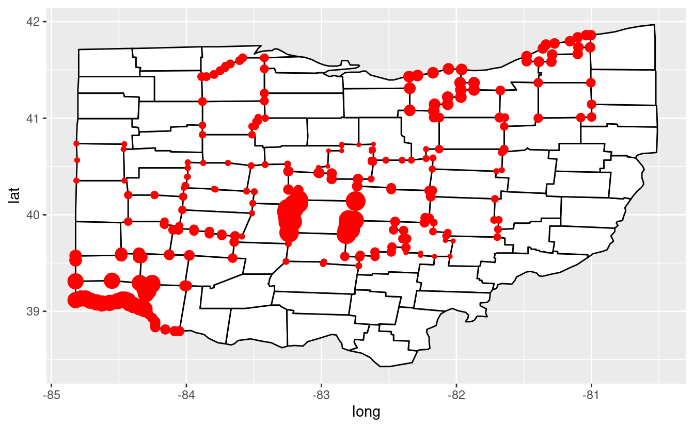

### Exercise 2

Use the same data to plot counties with % negative population growth with quantile of 0-20, 20-40, 40-60, 60-80, and 80-100.

 Solution (click here) 

<pre class='chroma'><code class='language-r' data-lang='r'>ohio_neg_pop &lt;- <a href='https://rdrr.io/r/stats/filter.html'>filter</a>(ohio_pop, Perc &lt; 0)

ggplot(data = ohio_pop,
       mapping = aes(x= long, y= lat, group = group)) +
  geom_polygon(color = "black", fill = "white") +
  geom_point(data = ohio_neg_pop, color = "red",
             aes(x = long, y = lat, group = NULL, size = Perc)) +
  guides(size = FALSE) # Omit the legend

</code></pre>

<pre class='chroma'><code class='language-r' data-lang='r'>
ApplyQuintiles_n &lt;- function(x) &#123;
  <a href='https://rdrr.io/r/base/cut.html'>cut</a>(x, breaks = <a href='https://rdrr.io/r/base/c.html'>c</a>(<a href='https://rdrr.io/r/stats/quantile.html'>quantile</a>(ohio_neg_pop$Perc, probs = <a href='https://rdrr.io/r/base/seq.html'>seq</a>(0, 1, by = 0.2))),
      labels = <a href='https://rdrr.io/r/base/c.html'>c</a>("0-20", "20-40", "40-60", "60-80", "80-100"),
      include.lowest = TRUE)
&#125;

ohio_neg_pop$grouped_pop &lt;- <a href='https://rdrr.io/r/base/lapply.html'>sapply</a>(ohio_neg_pop$Perc, ApplyQuintiles_n)

#  plot the map
ggplot() +
  geom_polygon(data = ohio_neg_pop,
               aes(x = long, y = lat, group = group, fill = grouped_pop),
               color = "black") + 
  coord_fixed(1.3) +
  scale_fill_brewer(palette = "Set1", direction = -1) +
  labs(fill = "Negative population growth counties") 

</code></pre>

### Bonus exercise

Plot the cities of France with population greater than 100,000. Vary size of point by city size, and vary the color of the dots.

 Solution (click here) 

<pre class='chroma'><code class='language-r' data-lang='r'>world &lt;- map_data("world")

france &lt;- <a href='https://rdrr.io/r/stats/filter.html'>filter</a>(world,region == "France")

ggplot(data = france,
       mapping = aes(x = long, y = lat, group = group)) +
  geom_polygon(color = "black", fill = "white") +
  labs(fill = "France") 

</code></pre>
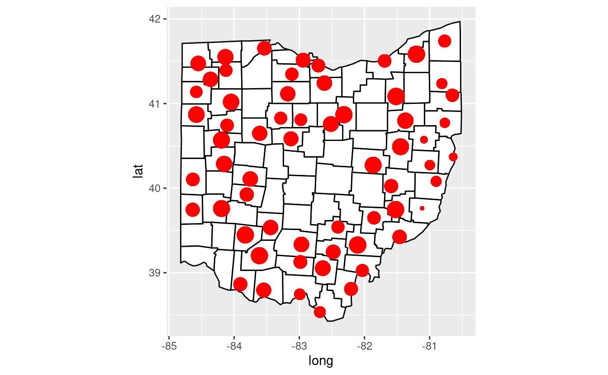
<pre class='chroma'><code class='language-r' data-lang='r'>
# The "maps" package has city data
<a href='https://rdrr.io/r/utils/head.html'>head</a>(maps::<a href='https://rdrr.io/pkg/maps/man/world.cities.html'>world.cities</a>)

#&gt;                 name country.etc   pop   lat  long capital
#&gt; 1 'Abasan al-Jadidah   Palestine  5629 31.31 34.34       0
#&gt; 2 'Abasan al-Kabirah   Palestine 18999 31.32 34.35       0
#&gt; 3       'Abdul Hakim    Pakistan 47788 30.55 72.11       0
#&gt; 4 'Abdullah-as-Salam      Kuwait 21817 29.36 47.98       0
#&gt; 5              'Abud   Palestine  2456 32.03 35.07       0
#&gt; 6            'Abwein   Palestine  3434 32.03 35.20       0

my_cities &lt;-maps::<a href='https://rdrr.io/pkg/maps/man/world.cities.html'>world.cities</a>

france_cities &lt;- <a href='https://rdrr.io/r/stats/filter.html'>filter</a>(my_cities, country.etc == "France")

<a href='https://rdrr.io/r/utils/head.html'>head</a>(france_cities)

#&gt;              name country.etc    pop   lat long capital
#&gt; 1       Abbeville      France  26656 50.12 1.83       0
#&gt; 2         Acheres      France  23219 48.97 2.06       0
#&gt; 3            Agde      France  23477 43.33 3.46       0
#&gt; 4            Agen      France  34742 44.20 0.62       0
#&gt; 5 Aire-sur-la-Lys      France  10470 50.64 2.39       0
#&gt; 6 Aix-en-Provence      France 148622 43.53 5.44       0

# Make a point for every city:
ggplot(data = france, mapping = aes(x = long, y = lat, group = group)) +
  geom_polygon(color = "black", fill = "white") +
  geom_point(data = france_cities, color = "red",
             aes(x = long, y = lat, group = NULL))

</code></pre>

<pre class='chroma'><code class='language-r' data-lang='r'># Let's pick just the big cities:
france_big_cities &lt;- <a href='https://rdrr.io/r/stats/filter.html'>filter</a>(my_cities,country.etc == "France" &amp; pop &gt; 100000)

ggplot(data = france,
       mapping = aes(x = long, y = lat, group = group)) +
  geom_polygon(color = "black", fill = "white") +
  geom_point(data = france_big_cities, color = "red",
             aes(x = long, y = lat, group = NULL)) 

</code></pre>

<pre class='chroma'><code class='language-r' data-lang='r'># vary size of point by city size
ggplot(data = france, mapping = aes(x = long, y = lat, group = group)) +
  geom_polygon(color = "black", fill = "white") +
  geom_point(data = france_big_cities, color = "red",
             aes(x = long, y = lat, group = NULL, size = pop))

</code></pre>

<pre class='chroma'><code class='language-r' data-lang='r'># Now vary the color of the dots
france_big_cities$qual &lt;- <a href='https://rdrr.io/r/base/sample.html'>sample</a>(LETTERS[1:5],
                                 <a href='https://rdrr.io/r/base/nrow.html'>nrow</a>(france_big_cities),
                                 replace = TRUE)

ggplot(data = france,
       mapping = aes(x = long, y = lat, group = group)) +
  geom_polygon(color = "black",fill = "white") +
  geom_point(data = france_big_cities,
             aes(x = long, y = lat, group = NULL, color = qual, size = pop))

</code></pre>
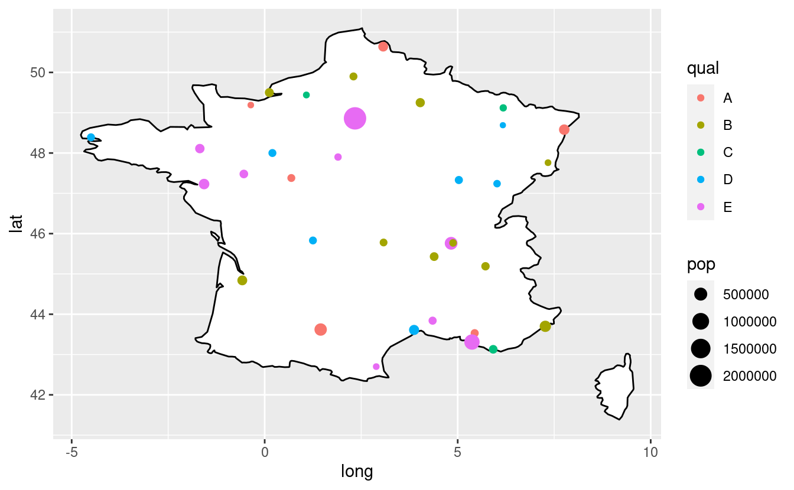

<pre class='chroma'><code class='language-r' data-lang='r'># Do some tweaking:
# no scientific notation in legend r ggplot
# scales package adds the "scale_size_continuous" function to our arsenal, and we can set label=comma
<a href='https://rdrr.io/r/base/library.html'>library</a>(<a href='https://scales.r-lib.org'>scales</a>)

# Change the column name to make the legend nicer:
france_big_cities$Population &lt;- france_big_cities$pop
france_big_cities$Qualitative &lt;- france_big_cities$qual

# Do some additional refining:
ggplot(data = france,
       mapping = aes(x = long, y = lat, group = group)) +
  geom_polygon(color = "black", fill = "white") +
  geom_point(data = france_big_cities,
             aes(x = long, y = lat, group = NULL,
                 color = Qualitative, size = Population)) +
  scale_size_continuous(label = comma)

</code></pre>
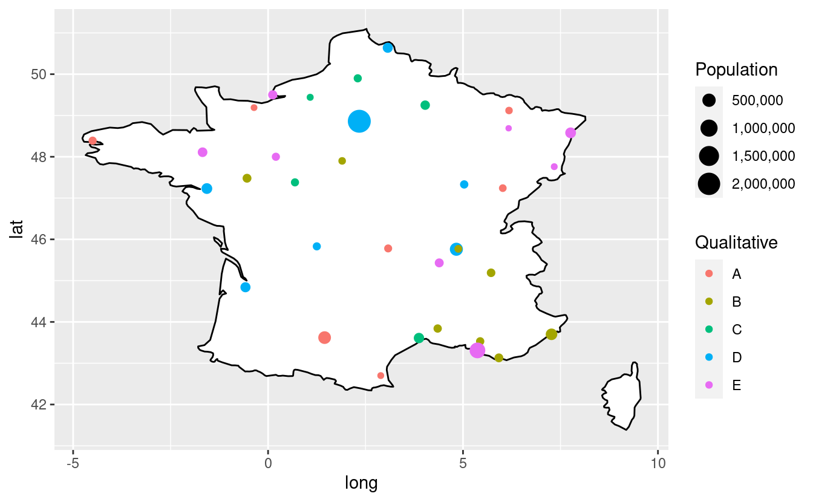

