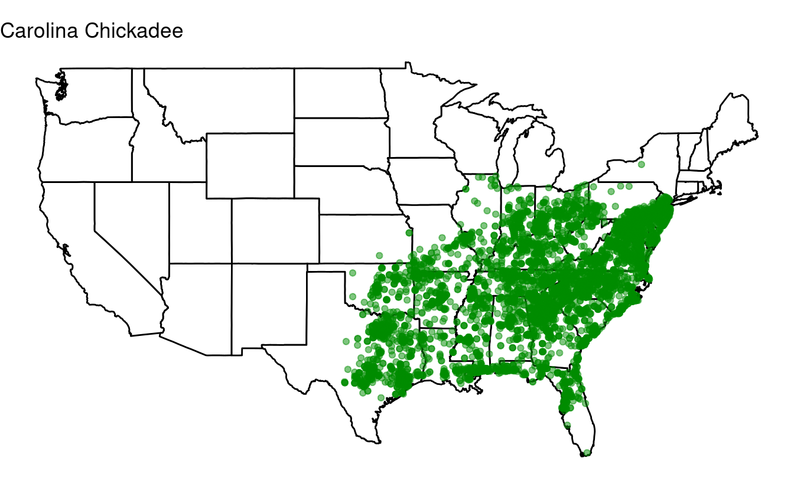
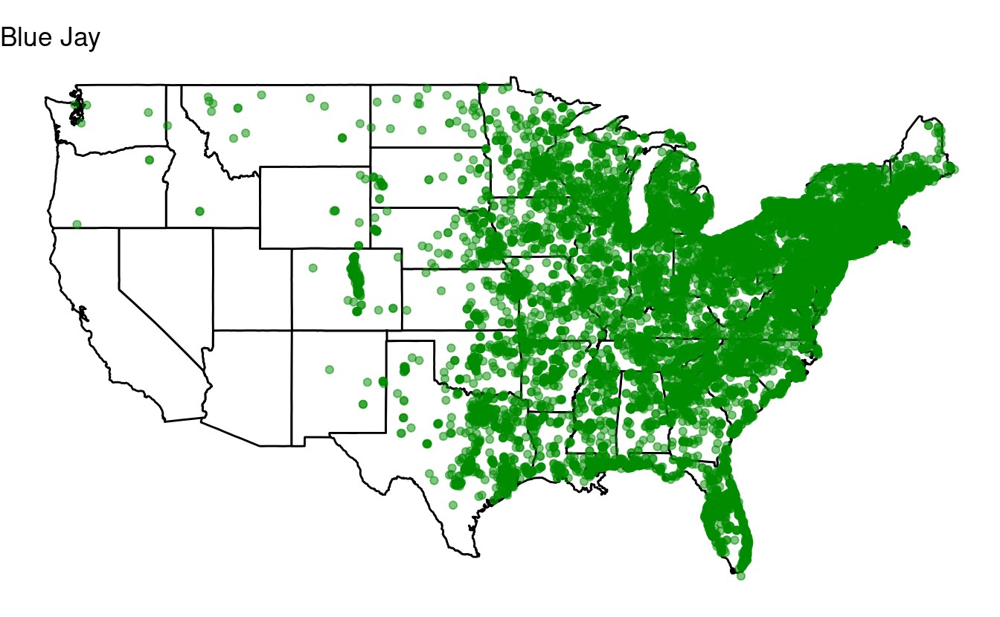
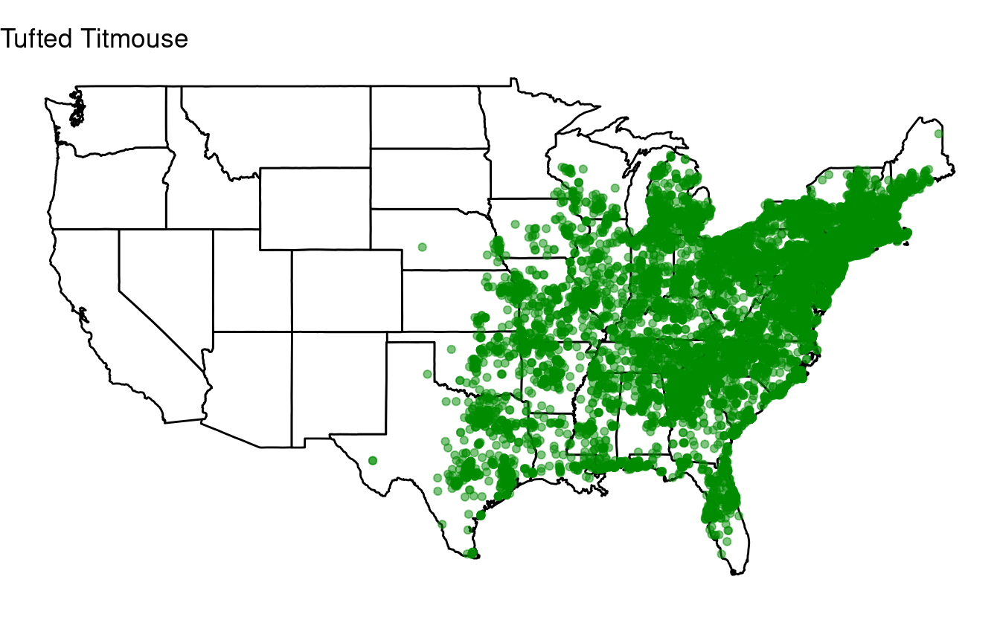
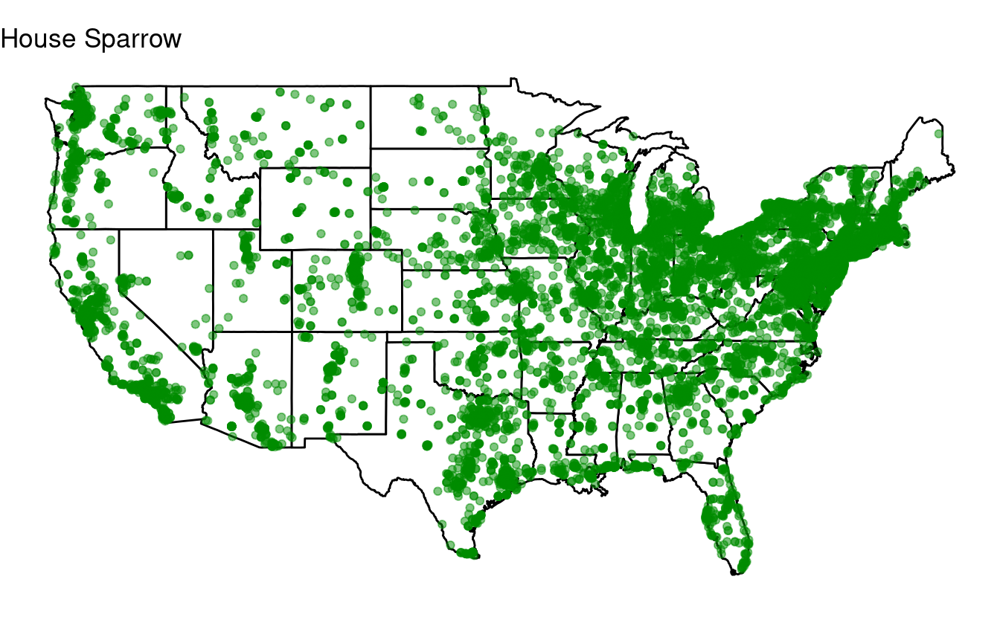
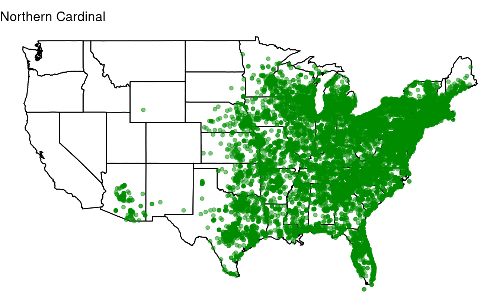
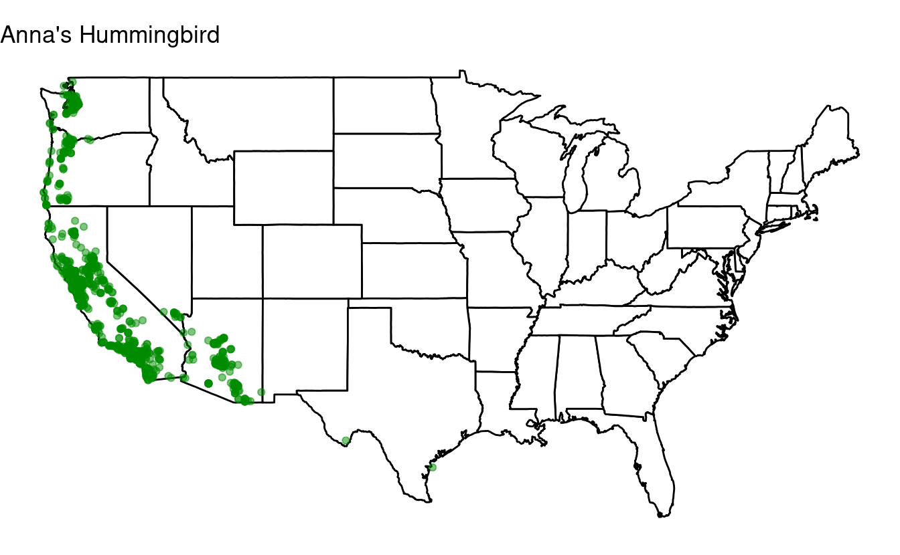

<br> <br> <br>

------------------------------------------------------------------------

Setup
-----

#### New to Code Club?

-   If you didn't already do this, please follow the [Code Club Computer Setup](/codeclub-setup/04_ggplot2/) instructions, which also have pointers for if you're new to R or RStudio.

-   If you're able to do so, please open RStudio a bit before Code Club starts -- and in case you run into issues, please join the Zoom call early and we'll help you troubleshoot.

#### Session goals

Today, you will learn:

-   That you should avoid copying your code.
-   What different strategies for *iteration* exist in R.
-   What *vectorization* is and how to make use of it.
-   How to write a `for` loop.
-   Best practices when using `for` loops.
-   When you should (not) use `for` loops.
-   Bonus: `if` statements.

<br>

------------------------------------------------------------------------

Introduction
------------

### Don't Repeat Yourself

Sometimes, you have a block of code and you need to repeat the operations in that code *almost* exactly. For instance, you may want to rerun a statistical model with different parameter values, rerun an analysis for a different batch of samples, or extract the same information for many different genes.

Your first instinct may be to copy-and-paste the block of code, and make the necessary slight adjustments in the pasted block. However, ***iterating*** and ***writing your own functions*** are strategies that are clearer, less error-prone, and more flexible (and these two can also be combined). When the number of repeats are high, *iteration* is needed. When the code that needs to be repeated is more than a line or two, *writing your own functions* becomes useful.

### Iteration

***Loops*** are the most universal iteration tool and the one we will focus on today. However, R has "functional programming" iteration methods that are less verbose and that can also be quicker to execute. These are the `apply` family of functions, and a more recent *tidyverse* approach implemented in the *purrr* package: we will learn more about those in the two upcoming Code Club sessions.

Loops are still a very good place to start using iteration because they make the iteration explicit and are therefore more intuitive than functional alternatives. In addition, they can easily accommodate longer blocks of code without the need to *also* write your own function.

Today, we will talk about the most common type of loop: the `for` loops. (Other types of loops in R are `while` loops and `repeat` loops. Related to loops are `if` statements, see the [bonus exercise](#bonus-exercise-if-statements) for some basics.)

#### But first...

Before we tackle loops we should take a step back and explore ***vectorization*** a bit more, which was briefly introduced by Michael in [Code Club session 9](https://biodash.github.io/codeclub/09_subsetting/). Besides functional programming methods, *vectorization is the other reason that loops are not as widely used in R as in other programming languages*.

------------------------------------------------------------------------

I: Vectorization
----------------

Let's say we have a *vector* (i.e., a collection of values) that consists of distances in miles:

<div class="highlight">

<pre class='chroma'><code class='language-r' data-lang='r'><span class='nv'>dists_miles</span> <span class='o'>&lt;-</span> <span class='nf'><a href='https://rdrr.io/r/base/c.html'>c</a></span><span class='o'>(</span><span class='m'>24</span>, <span class='m'>81</span>, <span class='m'>48</span>, <span class='m'>29</span>, <span class='m'>177</span>, <span class='m'>175</span>, <span class='m'>20</span>, <span class='m'>11</span>, <span class='m'>62</span>, <span class='m'>156</span><span class='o'>)</span>
</code></pre>

</div>

Of course, we can't science with miles, so we'll have to convert these distances to kilometers by multiplying each value in the vector by 1.61. You may or may not know that this can be done *really easily* in R:

<div class="highlight">

<pre class='chroma'><code class='language-r' data-lang='r'><span class='nv'>dists_km</span> <span class='o'>&lt;-</span> <span class='nv'>dists_miles</span> <span class='o'>*</span> <span class='m'>1.61</span>
<span class='nv'>dists_km</span>

<span class='c'>#&gt;  [1]  38.64 130.41  77.28  46.69 284.97 281.75  32.20  17.71  99.82 251.16</span>
</code></pre>

</div>

What is happening here is called a ***vectorized operation***: `1.61` is automatically recycled as many times as needed to be multiplied with *each individual value* in the `dist_miles` vector. This is a pretty unique and very useful feature of R!

In many other languages, we would need a ***loop*** or a similar construct to iterate over each value in the vector and multiply by 1.61. In fact, under the hood, R *also* uses a loop to do this! So does it even make a difference? Yes -- the advantages of using vectorization in R are:

-   You don't have to write the loop, saving you a fair bit of typing and making the code clearer.

-   The under-the-hood-loop is being executed *much* faster than a loop that you would write. This is because it is written in `C`/`C++` code which only has to be called once (instead of at least as many times as there are iterations in our loop).

<br>

### Other vectorization patterns

Above, we saw an example of multiplying a vector by a single number. We can also use vectorized operations when both objects contain multiple items. For instance, say we have a vector with corresponding values for two dates:

<div class="highlight">

<pre class='chroma'><code class='language-r' data-lang='r'><span class='nv'>dists_Mar4</span> <span class='o'>&lt;-</span> <span class='nf'><a href='https://rdrr.io/r/base/c.html'>c</a></span><span class='o'>(</span><span class='m'>17</span>, <span class='m'>93</span>, <span class='m'>56</span>, <span class='m'>19</span>, <span class='m'>175</span>, <span class='m'>40</span>, <span class='m'>69</span>, <span class='m'>267</span>, <span class='m'>4</span>, <span class='m'>91</span><span class='o'>)</span>
<span class='nv'>dists_Mar5</span> <span class='o'>&lt;-</span> <span class='nf'><a href='https://rdrr.io/r/base/c.html'>c</a></span><span class='o'>(</span><span class='m'>87</span>, <span class='m'>143</span>, <span class='m'>103</span>, <span class='m'>223</span>, <span class='m'>106</span>, <span class='m'>18</span>, <span class='m'>87</span>, <span class='m'>72</span>, <span class='m'>59</span>, <span class='m'>5</span><span class='o'>)</span>
</code></pre>

</div>

To get the sum of these values at each position (index) of the two vectors (`17 + 87`, `93 + 143`, etc.), we can simply do the following:

<div class="highlight">

<pre class='chroma'><code class='language-r' data-lang='r'><span class='nv'>dists_Mar4</span> <span class='o'>+</span> <span class='nv'>dists_Mar5</span>

<span class='c'>#&gt;  [1] 104 236 159 242 281  58 156 339  63  96</span>
</code></pre>

</div>

<br>

<div class="alert alert-note">

<div>

The two vectors don't need to be of equal length, either:  
in the example below, we negate ***every other*** value in a vector:

<div class="highlight">

<pre class='chroma'><code class='language-r' data-lang='r'><span class='nf'><a href='https://rdrr.io/r/base/c.html'>c</a></span><span class='o'>(</span><span class='m'>17</span>, <span class='m'>93</span>, <span class='m'>56</span>, <span class='m'>19</span>, <span class='m'>175</span>, <span class='m'>40</span>, <span class='m'>69</span>, <span class='m'>267</span>, <span class='m'>4</span>, <span class='m'>91</span><span class='o'>)</span> <span class='o'>*</span> <span class='nf'><a href='https://rdrr.io/r/base/c.html'>c</a></span><span class='o'>(</span><span class='m'>1</span>, <span class='o'>-</span><span class='m'>1</span><span class='o'>)</span>

<span class='c'>#&gt;  [1]   17  -93   56  -19  175  -40   69 -267    4  -91</span>
</code></pre>

</div>

</div>

</div>

<br>

This also works for columns of a data frame, which we can extract using the `dataframe_name$column_name` notation (see [Code Club session 9's section on data frames](https://biodash.github.io/codeclub/09_subsetting/#data-frames), and the Base R data frame indexing summary [below](#base-r-data-frame-indexing)). Let's say we wanted the mean distance this time:

<div class="highlight">

<pre class='chroma'><code class='language-r' data-lang='r'><span class='nv'>dist_df</span> <span class='o'>&lt;-</span> <span class='nf'><a href='https://rdrr.io/r/base/data.frame.html'>data.frame</a></span><span class='o'>(</span><span class='nv'>dists_Mar4</span>, <span class='nv'>dists_Mar5</span><span class='o'>)</span>

<span class='nv'>dist_df</span><span class='o'>$</span><span class='nv'>dists_mean</span> <span class='o'>=</span> <span class='o'>(</span><span class='nv'>dist_df</span><span class='o'>$</span><span class='nv'>dists_Mar4</span> <span class='o'>+</span> <span class='nv'>dist_df</span><span class='o'>$</span><span class='nv'>dists_Mar5</span><span class='o'>)</span> <span class='o'>/</span> <span class='m'>2</span>
<span class='nf'><a href='https://rdrr.io/r/utils/head.html'>head</a></span><span class='o'>(</span><span class='nv'>dist_df</span><span class='o'>)</span>

<span class='c'>#&gt;   dists_Mar4 dists_Mar5 dists_mean</span>
<span class='c'>#&gt; 1         17         87       52.0</span>
<span class='c'>#&gt; 2         93        143      118.0</span>
<span class='c'>#&gt; 3         56        103       79.5</span>
<span class='c'>#&gt; 4         19        223      121.0</span>
<span class='c'>#&gt; 5        175        106      140.5</span>
<span class='c'>#&gt; 6         40         18       29.0</span>
</code></pre>

</div>

<br>

### Vectorization with matrices

Furthermore, we can also perform vectorized operations on *entire matrices*. With the following matrix:

<div class="highlight">

<pre class='chroma'><code class='language-r' data-lang='r'><span class='c'>## We use the "sample" function to get 25 random values between 1 and a 100,</span>
<span class='c'>## and put those in a 5*5 matrix:</span>
<span class='nv'>mat</span> <span class='o'>&lt;-</span> <span class='nf'><a href='https://rdrr.io/r/base/matrix.html'>matrix</a></span><span class='o'>(</span><span class='nf'><a href='https://rdrr.io/r/base/sample.html'>sample</a></span><span class='o'>(</span><span class='m'>1</span><span class='o'>:</span><span class='m'>100</span>, <span class='m'>25</span><span class='o'>)</span>, nrow <span class='o'>=</span> <span class='m'>5</span>, ncol <span class='o'>=</span> <span class='m'>5</span><span class='o'>)</span>
<span class='nv'>mat</span>

<span class='c'>#&gt;      [,1] [,2] [,3] [,4] [,5]</span>
<span class='c'>#&gt; [1,]   92   79   64    3   23</span>
<span class='c'>#&gt; [2,]   33   14   11   22   80</span>
<span class='c'>#&gt; [3,]   50   47   91   10   58</span>
<span class='c'>#&gt; [4,]   43   59   32   60   16</span>
<span class='c'>#&gt; [5,]   35   88   24   28   62</span>
</code></pre>

</div>

...we could multiple all values by 10 or get the square of each value simply as follows:

<div class="highlight">

<pre class='chroma'><code class='language-r' data-lang='r'><span class='nv'>mat_more</span> <span class='o'>&lt;-</span> <span class='nv'>mat</span> <span class='o'>*</span> <span class='m'>10</span>
<span class='nv'>mat_more</span>

<span class='c'>#&gt;      [,1] [,2] [,3] [,4] [,5]</span>
<span class='c'>#&gt; [1,]  920  790  640   30  230</span>
<span class='c'>#&gt; [2,]  330  140  110  220  800</span>
<span class='c'>#&gt; [3,]  500  470  910  100  580</span>
<span class='c'>#&gt; [4,]  430  590  320  600  160</span>
<span class='c'>#&gt; [5,]  350  880  240  280  620</span>


<span class='nv'>mat_squared</span> <span class='o'>&lt;-</span> <span class='nv'>mat</span> <span class='o'>*</span> <span class='nv'>mat</span>
<span class='nv'>mat_squared</span>

<span class='c'>#&gt;      [,1] [,2] [,3] [,4] [,5]</span>
<span class='c'>#&gt; [1,] 8464 6241 4096    9  529</span>
<span class='c'>#&gt; [2,] 1089  196  121  484 6400</span>
<span class='c'>#&gt; [3,] 2500 2209 8281  100 3364</span>
<span class='c'>#&gt; [4,] 1849 3481 1024 3600  256</span>
<span class='c'>#&gt; [5,] 1225 7744  576  784 3844</span>
</code></pre>

</div>

<br>

### Vectorization with indices

We can also use vectorized solutions when we want to operate only on elements that satisfy a certain condition.

Let's say we consider any distance in one of our vectors that is below 50 to be insufficient, and we want to turn those values into negatives (a little harsh maybe, but we go with it).

To do so, we make use of R's ability to index a vector with a logical vector:

<div class="highlight">

<pre class='chroma'><code class='language-r' data-lang='r'><span class='c'>## "not_far_enough" will be a vector of logicals:</span>
<span class='nv'>not_far_enough</span> <span class='o'>&lt;-</span> <span class='nv'>dists_Mar4</span> <span class='o'>&lt;</span> <span class='m'>50</span>
<span class='nv'>not_far_enough</span>

<span class='c'>#&gt;  [1]  TRUE FALSE FALSE  TRUE FALSE  TRUE FALSE FALSE  TRUE FALSE</span>


<span class='c'>## When we index the original vector with a logical vector,</span>
<span class='c'>## we get only those values for which "not_far_enough" is TRUE:</span>
<span class='nv'>dists_Mar4</span><span class='o'>[</span><span class='nv'>not_far_enough</span><span class='o'>]</span>

<span class='c'>#&gt; [1] 17 19 40  4</span>
</code></pre>

</div>

With the following syntax, we can replace just those low distances in our original vector:

<div class="highlight">

<pre class='chroma'><code class='language-r' data-lang='r'><span class='nv'>dists_Mar4</span><span class='o'>[</span><span class='nv'>not_far_enough</span><span class='o'>]</span> <span class='o'>&lt;-</span> <span class='nv'>dists_Mar4</span><span class='o'>[</span><span class='nv'>not_far_enough</span><span class='o'>]</span> <span class='o'>*</span> <span class='o'>-</span><span class='m'>1</span>
<span class='nv'>dists_Mar4</span>

<span class='c'>#&gt;  [1] -17  93  56 -19 175 -40  69 267  -4  91</span>
</code></pre>

</div>

<div class="alert alert-note">

<div>

In a simple case like this, we could also use the vectorized [`ifelse()`](https://rdrr.io/r/base/ifelse.html) function:

<div class="highlight">

<pre class='chroma'><code class='language-r' data-lang='r'><span class='nf'><a href='https://rdrr.io/r/base/ifelse.html'>ifelse</a></span><span class='o'>(</span><span class='nv'>dists_Mar5</span> <span class='o'>&lt;</span> <span class='m'>50</span>, <span class='nv'>dists_Mar5</span> <span class='o'>*</span> <span class='o'>-</span><span class='m'>1</span>, <span class='nv'>dists_Mar5</span><span class='o'>)</span>

<span class='c'>#&gt;  [1]  87 143 103 223 106 -18  87  72  59  -5</span>
</code></pre>

</div>

</div>

</div>

<br>

------------------------------------------------------------------------

II: For loops
-------------

While it is important to use vectorization whenever possible, it can only be applied to a specific set of problems. A more universal solution when you need to repeat operations is the `for` loop. `for` loops iterate over a collection of values, allowing you to perform one or more actions for each value in the collection.

The basic syntax is as follows:

``` r
for (variable_name in collection_name) {
  #...do things for each item (variable_name) in the collection, one at a time...
}
```

On the first line, you initialize the `for` loop, telling it to assign each item in the collection to a variable (here, `variable_name`) **one at a time**.

The *variable name* is arbitrary, and the *collection* is whatever you want to loop over. However, `for`, the parentheses `()`, `in`, and the curly braces `{}` are all fixed elements of `for` loops. A simple example will help to understand the synax:

<div class="highlight">

<pre class='chroma'><code class='language-r' data-lang='r'><span class='c'>## A loop to print negated values:</span>
<span class='kr'>for</span> <span class='o'>(</span><span class='nv'>one_number</span> <span class='kr'>in</span> <span class='nf'><a href='https://rdrr.io/r/base/c.html'>c</a></span><span class='o'>(</span><span class='m'>1</span>, <span class='m'>2</span>, <span class='m'>3</span>, <span class='m'>4</span><span class='o'>)</span><span class='o'>)</span> <span class='o'>&#123;</span>  <span class='c'># We iterate over 1, 2, 3, 4</span>
  <span class='nf'><a href='https://rdrr.io/r/base/print.html'>print</a></span><span class='o'>(</span><span class='nv'>one_number</span> <span class='o'>*</span> <span class='o'>-</span><span class='m'>1</span><span class='o'>)</span>             <span class='c'># Multiply each number by -1</span>
<span class='o'>&#125;</span>

<span class='c'>#&gt; [1] -1</span>
<span class='c'>#&gt; [1] -2</span>
<span class='c'>#&gt; [1] -3</span>
<span class='c'>#&gt; [1] -4</span>
</code></pre>

</div>

Note that we don't *have to* use the variable that we are looping over: we could also use a `for` loop as a roundabout way to simply repeat something as many times as there are values in our collection:

<div class="highlight">

<pre class='chroma'><code class='language-r' data-lang='r'><span class='kr'>for</span> <span class='o'>(</span><span class='nv'>dummy</span> <span class='kr'>in</span> <span class='nf'><a href='https://rdrr.io/r/base/c.html'>c</a></span><span class='o'>(</span><span class='m'>1</span>, <span class='m'>2</span>, <span class='m'>3</span>, <span class='m'>4</span><span class='o'>)</span><span class='o'>)</span> <span class='o'>&#123;</span>
  <span class='nf'><a href='https://rdrr.io/r/base/print.html'>print</a></span><span class='o'>(</span><span class='s'>"Yes!"</span><span class='o'>)</span>                     <span class='c'># Print "Yes!" in each of our four iterations </span>
<span class='o'>&#125;</span>

<span class='c'>#&gt; [1] "Yes!"</span>
<span class='c'>#&gt; [1] "Yes!"</span>
<span class='c'>#&gt; [1] "Yes!"</span>
<span class='c'>#&gt; [1] "Yes!"</span>
</code></pre>

</div>

As mentioned, the **variable name** that we assign is arbitrary: we could use anything, as long as we reference it with the same name inside the loop:

<div class="highlight">

<pre class='chroma'><code class='language-r' data-lang='r'><span class='c'>## Example 1 with a different variable name: "positive_number"</span>
<span class='kr'>for</span> <span class='o'>(</span><span class='nv'>positive_number</span> <span class='kr'>in</span> <span class='nf'><a href='https://rdrr.io/r/base/c.html'>c</a></span><span class='o'>(</span><span class='m'>1</span>, <span class='m'>2</span>, <span class='m'>3</span>, <span class='m'>4</span><span class='o'>)</span><span class='o'>)</span> <span class='o'>&#123;</span>
  <span class='nf'><a href='https://rdrr.io/r/base/print.html'>print</a></span><span class='o'>(</span><span class='nv'>positive_number</span> <span class='o'>*</span> <span class='o'>-</span><span class='m'>1</span><span class='o'>)</span>
<span class='o'>&#125;</span>

<span class='c'>#&gt; [1] -1</span>
<span class='c'>#&gt; [1] -2</span>
<span class='c'>#&gt; [1] -3</span>
<span class='c'>#&gt; [1] -4</span>


<span class='c'>## Example 2 with a different variable name: "i"</span>
<span class='kr'>for</span> <span class='o'>(</span><span class='nv'>i</span> <span class='kr'>in</span> <span class='nf'><a href='https://rdrr.io/r/base/c.html'>c</a></span><span class='o'>(</span><span class='m'>1</span>, <span class='m'>2</span>, <span class='m'>3</span>, <span class='m'>4</span><span class='o'>)</span><span class='o'>)</span> <span class='o'>&#123;</span>
  <span class='nf'><a href='https://rdrr.io/r/base/print.html'>print</a></span><span class='o'>(</span><span class='nv'>i</span> <span class='o'>*</span> <span class='o'>-</span><span class='m'>1</span><span class='o'>)</span>
<span class='o'>&#125;</span>

<span class='c'>#&gt; [1] -1</span>
<span class='c'>#&gt; [1] -2</span>
<span class='c'>#&gt; [1] -3</span>
<span class='c'>#&gt; [1] -4</span>
</code></pre>

</div>

Note that the variable as it was last assigned in the loop does **persist in your environment**:

<div class="highlight">

<pre class='chroma'><code class='language-r' data-lang='r'><span class='nv'>i</span>

<span class='c'>#&gt; [1] 4</span>
</code></pre>

</div>

The ***curly braces*** are not strictly necessary for one-liners like this:

<div class="highlight">

<pre class='chroma'><code class='language-r' data-lang='r'><span class='kr'>for</span> <span class='o'>(</span><span class='nv'>i</span> <span class='kr'>in</span> <span class='m'>1</span><span class='o'>:</span><span class='m'>4</span><span class='o'>)</span> <span class='nf'><a href='https://rdrr.io/r/base/print.html'>print</a></span><span class='o'>(</span><span class='nv'>i</span> <span class='o'>*</span> <span class='o'>-</span><span class='m'>1</span><span class='o'>)</span>

<span class='c'>#&gt; [1] -1</span>
<span class='c'>#&gt; [1] -2</span>
<span class='c'>#&gt; [1] -3</span>
<span class='c'>#&gt; [1] -4</span>
</code></pre>

</div>

<br>

### `for` loop output

Note that we need the [`print()`](https://rdrr.io/r/base/print.html) function to print anything to screen -- nothing will be printed if we omit this:

<div class="highlight">

<pre class='chroma'><code class='language-r' data-lang='r'><span class='kr'>for</span> <span class='o'>(</span><span class='nv'>i</span> <span class='kr'>in</span> <span class='m'>1</span><span class='o'>:</span><span class='m'>4</span><span class='o'>)</span> <span class='o'>&#123;</span>
  <span class='nv'>i</span> <span class='o'>*</span> <span class='o'>-</span><span class='m'>1</span>
<span class='o'>&#125;</span>
</code></pre>

</div>

Similarly, if we want the output to be saved in an object of some kind, we need to explicitly make an assignment in each iteration of the loop. *This is where we need to start paying attention to the design of our loop.* Unless computational speed is of no concern at all, you should **avoid growing an object in each iteration of the loop**.

For example, you might be inclined to do the following if you wanted to compute the median of each column in a data frame:

<div class="highlight">

<pre class='chroma'><code class='language-r' data-lang='r'><span class='c'>## We initialize a vector in which we collect the column medians:</span>
<span class='nv'>column_medians</span> <span class='o'>&lt;-</span> <span class='nf'><a href='https://rdrr.io/r/base/vector.html'>vector</a></span><span class='o'>(</span><span class='o'>)</span>

<span class='kr'>for</span> <span class='o'>(</span><span class='nv'>column_number</span> <span class='kr'>in</span> <span class='m'>1</span><span class='o'>:</span><span class='nf'><a href='https://rdrr.io/r/base/nrow.html'>ncol</a></span><span class='o'>(</span><span class='nv'>dist_df</span><span class='o'>)</span><span class='o'>)</span> <span class='o'>&#123;</span>
  
  <span class='c'>## We extract one column using "dataframe_name[[column_number]]":</span>
  <span class='nv'>column_median</span> <span class='o'>&lt;-</span> <span class='nf'><a href='https://rdrr.io/r/stats/median.html'>median</a></span><span class='o'>(</span><span class='nv'>dist_df</span><span class='o'>[[</span><span class='nv'>column_number</span><span class='o'>]</span><span class='o'>]</span><span class='o'>)</span>
  
  <span class='c'>## We add the single-column median to our vector of medians:</span>
  <span class='nv'>column_medians</span> <span class='o'>&lt;-</span> <span class='nf'><a href='https://rdrr.io/r/base/c.html'>c</a></span><span class='o'>(</span><span class='nv'>column_medians</span>, <span class='nv'>column_median</span><span class='o'>)</span>
<span class='o'>&#125;</span>

<span class='nv'>column_medians</span>

<span class='c'>#&gt; [1] 62.50 87.00 78.75</span>
</code></pre>

</div>

Similarly, you may be tempted to add a column (with [`cbind()`](https://rdrr.io/r/base/cbind.html)) or a row (with [`rbind()`](https://rdrr.io/r/base/cbind.html)) to a data frame in each iteration of the loop. However, the problem with these approaches is that **R has to create an entirely new object in each iteration of the loop**, because the object's memory requirements keep increasing.

Instead, you'll want to give the final vector (here, `column_medians`) the appropriate size before you start the loop:

<div class="highlight">

<pre class='chroma'><code class='language-r' data-lang='r'><span class='nv'>column_medians</span> <span class='o'>&lt;-</span> <span class='nf'><a href='https://rdrr.io/r/base/vector.html'>vector</a></span><span class='o'>(</span>length <span class='o'>=</span> <span class='nf'><a href='https://rdrr.io/r/base/nrow.html'>ncol</a></span><span class='o'>(</span><span class='nv'>dist_df</span><span class='o'>)</span><span class='o'>)</span>

<span class='kr'>for</span> <span class='o'>(</span><span class='nv'>column_number</span> <span class='kr'>in</span> <span class='m'>1</span><span class='o'>:</span><span class='nf'><a href='https://rdrr.io/r/base/nrow.html'>ncol</a></span><span class='o'>(</span><span class='nv'>dist_df</span><span class='o'>)</span><span class='o'>)</span> <span class='o'>&#123;</span>
  <span class='nv'>column_median</span> <span class='o'>&lt;-</span> <span class='nf'><a href='https://rdrr.io/r/stats/median.html'>median</a></span><span class='o'>(</span><span class='nv'>dist_df</span><span class='o'>[[</span><span class='nv'>column_number</span><span class='o'>]</span><span class='o'>]</span><span class='o'>)</span>
  <span class='nv'>column_medians</span><span class='o'>[</span><span class='nv'>column_number</span><span class='o'>]</span> <span class='o'>&lt;-</span> <span class='nv'>column_median</span>
<span class='o'>&#125;</span>
</code></pre>

</div>

Note that for very small problems, such as the example above, there will not be a noticeable difference in computation time between pre-assigning a properly sized object versus growing an object inside the loop. However, it is still good to get into the habit of pre-assigning an object of the right size.

<br>

### Summary guidelines (when speed is an issue)

-   Don't use a loop when you can instead use vectorized operations.
-   Don't grow objects inside the loop. Instead, pre-assign an object large enough to contain all output of the loop and fill it in inside the loop.
-   When you write a loop, avoid doing things *inside* the loop that don't need to be repeated.

Learning about how to create your own functions and/or to use functional programming techniques like *purrr* and the `apply` family of functions (upcoming Code Club sessions!) will likely reduce your reliance on loops. For instance, as we'll see next week, computing the median of each column in a data frame can be done *much* more succinctly with [`apply()`](https://rdrr.io/r/base/apply.html).

**Even for more experienced users, loops remain a more viable option when longer blocks of code need to be repeated: we will practice with that in the exercises.**

<br>

------------------------------------------------------------------------

Breakout rooms!
---------------

For the exercises, you can download an R Markdown file with some code to get set up (I recommend coding in that document to get a nice overview of the maps that you will make):

<div class="highlight">

<pre class='chroma'><code class='language-r' data-lang='r'><span class='nf'><a href='https://rdrr.io/r/base/files2.html'>dir.create</a></span><span class='o'>(</span><span class='s'>'S12'</span><span class='o'>)</span>
<span class='nv'>todays_rmd</span> <span class='o'>&lt;-</span> <span class='s'>'https://raw.githubusercontent.com/biodash/biodash.github.io/master/content/codeclub/12_loops/exercises.Rmd'</span>
<span class='nf'><a href='https://rdrr.io/r/utils/download.file.html'>download.file</a></span><span class='o'>(</span>url <span class='o'>=</span> <span class='nv'>todays_rmd</span>, destfile <span class='o'>=</span> <span class='s'>'S12/exercises.Rmd'</span><span class='o'>)</span>
</code></pre>

</div>

The following code is already in your R Markdown file, which will download and read the bird dataset and the necessary packages:

<div class="highlight">

<pre class='chroma'><code class='language-r' data-lang='r'><span class='c'>## Download the file with bird data:</span>
<span class='nv'>birds_url</span> <span class='o'>&lt;-</span> <span class='s'>'https://raw.githubusercontent.com/biodash/biodash.github.io/master/assets/data/birds/backyard-birds_sample_error.tsv'</span>
<span class='nv'>birds_file</span> <span class='o'>&lt;-</span> <span class='s'>'backyard-birds_sample_error.tsv'</span>
<span class='nf'><a href='https://rdrr.io/r/utils/download.file.html'>download.file</a></span><span class='o'>(</span>url <span class='o'>=</span> <span class='nv'>birds_url</span>, destfile <span class='o'>=</span> <span class='nv'>birds_file</span><span class='o'>)</span>
</code></pre>

</div>

<div class="highlight">

</div>

<div class="highlight">

<pre class='chroma'><code class='language-r' data-lang='r'><span class='c'>## Load the tidyverse:</span>
<span class='kr'><a href='https://rdrr.io/r/base/library.html'>library</a></span><span class='o'>(</span><span class='nv'><a href='http://tidyverse.tidyverse.org'>tidyverse</a></span><span class='o'>)</span>

<span class='c'>## Read the file with bird data:</span>
<span class='nv'>birds</span> <span class='o'>&lt;-</span> <span class='nf'>read_tsv</span><span class='o'>(</span><span class='nv'>birds_file</span><span class='o'>)</span>

<span class='c'>## Load the maps package and get the state map:</span>
<span class='c'># install.packages('maps')   # first install if necessary</span>
<span class='kr'><a href='https://rdrr.io/r/base/library.html'>library</a></span><span class='o'>(</span><span class='nv'>maps</span><span class='o'>)</span>
<span class='nv'>states</span> <span class='o'>&lt;-</span> <span class='nf'>map_data</span><span class='o'>(</span><span class='s'>"state"</span><span class='o'>)</span>
</code></pre>

</div>

Last week, we learned about making maps. If you attended one of the first few Code Club sessions, you'll recall our **Great Backyard Birdcount data set**. Here, we'll use a country-wide random subset of this data (the full file is over 4 GB) to see where Carolina Chickadees were seen:

<div class="highlight">

<pre class='chroma'><code class='language-r' data-lang='r'><span class='c'>## With this line, we select only the rows where the column "species_en"</span>
<span class='c'>## (English species name) equals "Carolina Chickadee",</span>
<span class='c'>## i.e. we are getting just the records for the Carolina Chickadee:</span>
<span class='nv'>caro_chickadee</span> <span class='o'>&lt;-</span> <span class='nv'>birds</span><span class='o'>[</span><span class='nv'>birds</span><span class='o'>$</span><span class='nv'>species_en</span> <span class='o'>==</span> <span class='s'>'Carolina Chickadee'</span>, <span class='o'>]</span>

<span class='c'>## Or in tidyverse-speak:</span>
<span class='c'># caro_chickadee &lt;- birds %&gt;% filter(species_en == 'Carolina Chickadee')</span>

<span class='c'># Next, we create a map much like we did last week:</span>
<span class='nf'>ggplot</span><span class='o'>(</span>data <span class='o'>=</span> <span class='nv'>states</span>,                               <span class='c'># Use "states" for underlying map</span>
       mapping <span class='o'>=</span> <span class='nf'>aes</span><span class='o'>(</span>x <span class='o'>=</span> <span class='nv'>long</span>, y <span class='o'>=</span> <span class='nv'>lat</span>, group <span class='o'>=</span> <span class='nv'>group</span><span class='o'>)</span><span class='o'>)</span> <span class='o'>+</span>
  <span class='nf'>geom_polygon</span><span class='o'>(</span>color <span class='o'>=</span> <span class='s'>"black"</span>, fill <span class='o'>=</span> <span class='s'>"white"</span><span class='o'>)</span> <span class='o'>+</span>   <span class='c'># Black state outlines, white fill</span>
  <span class='nf'>geom_point</span><span class='o'>(</span>data <span class='o'>=</span> <span class='nv'>caro_chickadee</span>,                 <span class='c'># Plot points from bird data set</span>
             <span class='nf'>aes</span><span class='o'>(</span>x <span class='o'>=</span> <span class='nv'>long</span>, y <span class='o'>=</span> <span class='nv'>lat</span>, group <span class='o'>=</span> <span class='kc'>NULL</span><span class='o'>)</span>,
             color <span class='o'>=</span> <span class='s'>"green4"</span>, alpha <span class='o'>=</span> <span class='m'>0.5</span><span class='o'>)</span> <span class='o'>+</span>       <span class='c'># Green points, somewhat transparent</span>
  <span class='nf'>coord_fixed</span><span class='o'>(</span><span class='m'>1.3</span><span class='o'>)</span> <span class='o'>+</span>                                <span class='c'># Fix projection</span>
  <span class='nf'>labs</span><span class='o'>(</span>title <span class='o'>=</span> <span class='s'>'Carolina Chickadee'</span><span class='o'>)</span>

</code></pre>


</div>

Uh-oh! Something appears to have gone wrong. In the first exercise, you'll use vectorization to fix the coordinates in the bird data set.

In the second exercise, you'll use a loop to quickly produce similar plots for several other species.

<div class="puzzle">

<div>

### Exercise 1: Vectorization

Try to fix the coordinates using vectorized operations, and recreate the map to see if it worked.

-   Start with the **latitude**, which is wrong for all points.

<details>
<summary> Hints (click here) </summary>
<p>

-   You'll need to modify the `caro_chickadee` data frame, while you can keep the plotting code exactly the same.

-   Simply prepending the latitude column with a minus sign ([`-`](https://rdrr.io/r/base/Arithmetic.html)) will negate the values.

-   Equivalent base R ways to refer to the column with latitudes are `caro_chickadee$lat` and `caro_chickadee[['lat']]`.

</p>
</details>

<br>

<details>

<summary> Solution (click here) </summary> <br>

First we fix the latitude, which was simply negated:

<div class="highlight">

<pre class='chroma'><code class='language-r' data-lang='r'><span class='nv'>caro_chickadee</span><span class='o'>$</span><span class='nv'>lat</span> <span class='o'>&lt;-</span> <span class='o'>-</span><span class='nv'>caro_chickadee</span><span class='o'>$</span><span class='nv'>lat</span>

<span class='c'>## Or equivalently:</span>
<span class='c'># caro_chickadee[['lat']] &lt;- -caro_chickadee[['lat']]</span>

<span class='c'>## Or a tidyverse way of doing this:</span>
<span class='c'># caro_chickadee &lt;- caro_chickadee %&gt;% mutate(lat = -lat)</span>
</code></pre>

</div>

Create the first map with the same code as the example:

<div class="highlight">

<pre class='chroma'><code class='language-r' data-lang='r'><span class='nf'>ggplot</span><span class='o'>(</span>data <span class='o'>=</span> <span class='nv'>states</span>,
       mapping <span class='o'>=</span> <span class='nf'>aes</span><span class='o'>(</span>x <span class='o'>=</span> <span class='nv'>long</span>, y <span class='o'>=</span> <span class='nv'>lat</span>, group <span class='o'>=</span> <span class='nv'>group</span><span class='o'>)</span><span class='o'>)</span> <span class='o'>+</span>
  <span class='nf'>geom_polygon</span><span class='o'>(</span>color <span class='o'>=</span> <span class='s'>"black"</span>, fill <span class='o'>=</span> <span class='s'>"white"</span><span class='o'>)</span> <span class='o'>+</span>
  <span class='nf'>geom_point</span><span class='o'>(</span>data <span class='o'>=</span> <span class='nv'>caro_chickadee</span>,
             <span class='nf'>aes</span><span class='o'>(</span>x <span class='o'>=</span> <span class='nv'>long</span>, y <span class='o'>=</span> <span class='nv'>lat</span>, group <span class='o'>=</span> <span class='kc'>NULL</span><span class='o'>)</span>,
             color <span class='o'>=</span> <span class='s'>"green4"</span>, alpha <span class='o'>=</span> <span class='m'>0.5</span><span class='o'>)</span> <span class='o'>+</span>
  <span class='nf'>coord_fixed</span><span class='o'>(</span><span class='m'>1.3</span><span class='o'>)</span> <span class='o'>+</span>
  <span class='nf'>labs</span><span class='o'>(</span>title <span class='o'>=</span> <span class='s'>'Carolina Chickadee'</span><span class='o'>)</span>

</code></pre>


</div>

</p>
</details>

<br>

-   Once you have fixed the latitude, you should notice that *for one state*, there is a problem with the **longitude** (the offset is 10 decimal degrees).

<details>
<summary> Hints (click here) </summary>
<p>

-   The displaced state is North Carolina.

-   The state of each sighting is in the `stateProvince` column, and North Carolina's name is simply "North Carolina" in that column.

-   It may help to first create a logical vector indicating whether for each row in the `caro_chickadee` data frame, `stateProvincefor` equals "North Carolina".

-   Your final map will look nicer if you get rid of the plotting canvas by adding  
    <code>+ theme\_void()</code> to the code for the plot.

</p>
</details>

<br>

<details>

<summary> Solution (click here) </summary> <br>

It turns out that North Carolina's chickadees are above the Atlantic. Let's perform a rescue operation by fixing the longitudes, which are offset by 10 degrees, **just for North Carolina**:

<div class="highlight">

<pre class='chroma'><code class='language-r' data-lang='r'><span class='c'>## Get a vector of logicals, indicating which rows are from North Carolina:</span>
<span class='nv'>NC_rows</span> <span class='o'>&lt;-</span> <span class='nv'>caro_chickadee</span><span class='o'>$</span><span class='nv'>stateProvince</span> <span class='o'>==</span> <span class='s'>"North Carolina"</span>

<span class='c'>## Only for North Carolina rows, change the longitude:</span>
<span class='nv'>caro_chickadee</span><span class='o'>$</span><span class='nv'>long</span><span class='o'>[</span><span class='nv'>NC_rows</span><span class='o'>]</span> <span class='o'>&lt;-</span> <span class='nv'>caro_chickadee</span><span class='o'>$</span><span class='nv'>long</span><span class='o'>[</span><span class='nv'>NC_rows</span><span class='o'>]</span> <span class='o'>-</span> <span class='m'>10</span>

<span class='c'>## Or with ifelse in one line:</span>
<span class='c'># caro_chickadee$long &lt;- ifelse(caro_chickadee$stateProvince == "North Carolina",</span>
<span class='c'>#                               caro_chickadee$long - 10,</span>
<span class='c'>#                               caro_chickadee$long)</span>

<span class='c'>## Or with mutate and ifelse:</span>
<span class='c'># caro_chickadee %&gt;%</span>
<span class='c'>#   mutate(long = ifelse(stateProvince == "North Carolina", long - 10, long))</span>
</code></pre>

</div>

And we create the final map:

<div class="highlight">

<pre class='chroma'><code class='language-r' data-lang='r'><span class='nf'>ggplot</span><span class='o'>(</span>data <span class='o'>=</span> <span class='nv'>states</span>,
       mapping <span class='o'>=</span> <span class='nf'>aes</span><span class='o'>(</span>x <span class='o'>=</span> <span class='nv'>long</span>, y <span class='o'>=</span> <span class='nv'>lat</span>, group <span class='o'>=</span> <span class='nv'>group</span><span class='o'>)</span><span class='o'>)</span> <span class='o'>+</span>
  <span class='nf'>geom_polygon</span><span class='o'>(</span>color <span class='o'>=</span> <span class='s'>"black"</span>, fill <span class='o'>=</span> <span class='s'>"white"</span><span class='o'>)</span> <span class='o'>+</span>
  <span class='nf'>geom_point</span><span class='o'>(</span>data <span class='o'>=</span> <span class='nv'>caro_chickadee</span>,
             <span class='nf'>aes</span><span class='o'>(</span>x <span class='o'>=</span> <span class='nv'>long</span>, y <span class='o'>=</span> <span class='nv'>lat</span>, group <span class='o'>=</span> <span class='kc'>NULL</span><span class='o'>)</span>,
             color <span class='o'>=</span> <span class='s'>"green4"</span>, alpha <span class='o'>=</span> <span class='m'>0.5</span><span class='o'>)</span> <span class='o'>+</span>
  <span class='nf'>coord_fixed</span><span class='o'>(</span><span class='m'>1.3</span><span class='o'>)</span> <span class='o'>+</span>
  <span class='nf'>labs</span><span class='o'>(</span>title <span class='o'>=</span> <span class='s'>'Carolina Chickadee'</span><span class='o'>)</span> <span class='o'>+</span>
  <span class='nf'>theme_void</span><span class='o'>(</span><span class='o'>)</span>

</code></pre>


</div>

Nice!

<br>
</details>

</div>

</div>

<div class="puzzle">

<div>

### Exercise 2: for loops

Find the 10 most commonly observed bird species in the data set, and save their English names (found in the `species_en` column) in a vector.

Feel free to check out the solution if you're not sure how, because the focus here is on the next step: trying to create a loop.

<details>
<summary> Solution (click here) </summary>
<p>

<div class="highlight">

<pre class='chroma'><code class='language-r' data-lang='r'><span class='nv'>top10</span> <span class='o'>&lt;-</span> <span class='nv'>birds</span> <span class='o'>%&gt;%</span>
  <span class='nf'>count</span><span class='o'>(</span><span class='nv'>species_en</span>, sort <span class='o'>=</span> <span class='kc'>TRUE</span><span class='o'>)</span> <span class='o'>%&gt;%</span>  <span class='c'># Produces a sorted count table for "species_en"</span>
  <span class='nf'>pull</span><span class='o'>(</span><span class='nv'>species_en</span><span class='o'>)</span> <span class='o'>%&gt;%</span>                <span class='c'># Extracts the "species_en" column</span>
  <span class='nf'><a href='https://rdrr.io/r/utils/head.html'>head</a></span><span class='o'>(</span>n <span class='o'>=</span> <span class='m'>10</span><span class='o'>)</span>                        <span class='c'># Take the top 10</span>
</code></pre>

</div>

</p>
</details>

<br>

Next, loop over the top-10 species to produce a plot for each one of them.  
Start with the code for the Carolina Chickadee, including the subsetting operation, and modify that.

<details>
<summary> Hints (click here) </summary>
<p>

-   In the subsetting operation where you select data for the focal species, replace "Carolina Chickadee" with whatever you name the variable (indicating an individual species) that you loop over.

    Because this is a variable name, and not a string like "Carolina Chickadee", don't forget to omit the quotes.

-   You'll also need to change the title with the looping variable.

</p>
</details>

<br>

<details>

<summary>Solution (click here)</summary> <br>

<div class="highlight">

<pre class='chroma'><code class='language-r' data-lang='r'><span class='kr'>for</span> <span class='o'>(</span><span class='nv'>one_species</span> <span class='kr'>in</span> <span class='nv'>top10</span><span class='o'>)</span> <span class='o'>&#123;</span>

<span class='c'>## Select just the data for one species:</span>
<span class='nv'>one_bird_data</span> <span class='o'>&lt;-</span> <span class='nv'>birds</span><span class='o'>[</span><span class='nv'>birds</span><span class='o'>$</span><span class='nv'>species_en</span> <span class='o'>==</span> <span class='nv'>one_species</span>, <span class='o'>]</span>
<span class='c'>## Or in tidyverse-speak:</span>
<span class='c'># one_bird_data &lt;- birds %&gt;% filter(species_en == one_species)</span>

<span class='nv'>p</span> <span class='o'>&lt;-</span> <span class='nf'>ggplot</span><span class='o'>(</span>data <span class='o'>=</span> <span class='nv'>states</span>,
            mapping <span class='o'>=</span> <span class='nf'>aes</span><span class='o'>(</span>x <span class='o'>=</span> <span class='nv'>long</span>, y <span class='o'>=</span> <span class='nv'>lat</span>, group <span class='o'>=</span> <span class='nv'>group</span><span class='o'>)</span><span class='o'>)</span> <span class='o'>+</span>
  <span class='nf'>geom_polygon</span><span class='o'>(</span>color <span class='o'>=</span> <span class='s'>"black"</span>, fill <span class='o'>=</span> <span class='s'>"white"</span><span class='o'>)</span> <span class='o'>+</span>
  <span class='nf'>geom_point</span><span class='o'>(</span>data <span class='o'>=</span> <span class='nv'>one_bird_data</span>,
             <span class='nf'>aes</span><span class='o'>(</span>x <span class='o'>=</span> <span class='nv'>long</span>, y <span class='o'>=</span> <span class='nv'>lat</span>, group <span class='o'>=</span> <span class='kc'>NULL</span><span class='o'>)</span>,
             color <span class='o'>=</span> <span class='s'>"green4"</span>, alpha <span class='o'>=</span> <span class='m'>0.5</span><span class='o'>)</span> <span class='o'>+</span>
  <span class='nf'>coord_fixed</span><span class='o'>(</span><span class='m'>1.3</span><span class='o'>)</span> <span class='o'>+</span>
  <span class='nf'>labs</span><span class='o'>(</span>title <span class='o'>=</span> <span class='nv'>one_species</span><span class='o'>)</span> <span class='o'>+</span>  <span class='c'># Make sure to change this to the looping variable</span>
  <span class='nf'>theme_void</span><span class='o'>(</span><span class='o'>)</span>
<span class='nf'><a href='https://rdrr.io/r/base/print.html'>print</a></span><span class='o'>(</span><span class='nv'>p</span><span class='o'>)</span>
<span class='o'>&#125;</span>

</code></pre>


</div>

<br>
</details>

</div>

</div>

### Bonus exercise: if statements

`if` statements are similar in syntax to `for` loops, and are also considered a "control flow" structure. But their purpose is different from loops: instead of iterating, **`if` statements do something once and they *only* do it when a condition is fulfilled.**

For instance, we may want to check in a script whether a certain directory (folder) exists on our computer, and if it doesn't, then we create the directory:

<div class="highlight">

<pre class='chroma'><code class='language-r' data-lang='r'><span class='kr'>if</span> <span class='o'>(</span><span class='nf'><a href='https://rdrr.io/r/base/files2.html'>dir.exists</a></span><span class='o'>(</span><span class='s'>'path/to/my/dir'</span><span class='o'>)</span><span class='o'>)</span> <span class='o'>&#123;</span>
  <span class='kr'><a href='https://rdrr.io/r/base/warning.html'>warning</a></span><span class='o'>(</span><span class='s'>"Oh my, the output directory doesn't exist yet!"</span><span class='o'>)</span>
  <span class='nf'><a href='https://rdrr.io/r/base/files2.html'>dir.create</a></span><span class='o'>(</span><span class='s'>'path/to/my/dir'</span><span class='o'>)</span>
<span class='o'>&#125;</span>
</code></pre>

</div>

Inside the parentheses `()` after `if` should be a statement that evaluates to either `TRUE` or `FALSE` ([`dir.exists()`](https://rdrr.io/r/base/files2.html) will be `TRUE` if the directory exists, and `FALSE` if it does not). If it is `TRUE`, whatever is inside the curly braces `{}` will be executed, and if it is `FALSE`, what is inside the curly braces will be ignored.

`if` statements are commonly combined with `for` loops: we may want to only execute the functions in our loop for items in our collection that fulfill a certain condition:

<div class="highlight">

<pre class='chroma'><code class='language-r' data-lang='r'><span class='kr'>for</span> <span class='o'>(</span><span class='nv'>one_number</span> <span class='kr'>in</span> <span class='m'>1</span><span class='o'>:</span><span class='m'>10</span><span class='o'>)</span> <span class='o'>&#123;</span>
  <span class='kr'>if</span><span class='o'>(</span><span class='nv'>one_number</span> <span class='o'>&gt;</span> <span class='m'>7</span><span class='o'>)</span> <span class='o'>&#123;</span>
    <span class='nf'><a href='https://rdrr.io/r/base/print.html'>print</a></span><span class='o'>(</span><span class='nv'>one_number</span><span class='o'>)</span>
  <span class='o'>&#125;</span>
<span class='o'>&#125;</span>

<span class='c'>#&gt; [1] 8</span>
<span class='c'>#&gt; [1] 9</span>
<span class='c'>#&gt; [1] 10</span>
</code></pre>

</div>

In the example above, `one number > 7` will only be `TRUE` for numbers larger than 7. This example is quite contrived, as it would have been easier (and faster!) to remove these items from the vector before the loop, but it hopefully gets the point across of how an `if` statement works.

<div class="puzzle">

<div>

Many of the maps we produced in the previous exercise looked quite similar, with most species very widespread and a few restricted to the east of the US. Maybe if we select species that haven't been seen in Ohio, we can find some other distributional patterns.

First, select the the top 50 most observed bird species, just like you did in exercise 2.

Then, use an `if` statement to create plots only for those top-50 birds that have *not* been seen in Ohio.

<details>

<summary> Solution (click here) </summary> <br>

-   Select the top-50 birds:

<div class="highlight">

<pre class='chroma'><code class='language-r' data-lang='r'><span class='nv'>all_species</span> <span class='o'>&lt;-</span> <span class='nv'>birds</span> <span class='o'>%&gt;%</span>
  <span class='nf'>count</span><span class='o'>(</span><span class='nv'>species_en</span>, sort <span class='o'>=</span> <span class='kc'>TRUE</span><span class='o'>)</span> <span class='o'>%&gt;%</span>
  <span class='nf'>pull</span><span class='o'>(</span><span class='nv'>species_en</span><span class='o'>)</span> <span class='o'>%&gt;%</span>
  <span class='nf'><a href='https://rdrr.io/r/utils/head.html'>head</a></span><span class='o'>(</span>n <span class='o'>=</span> <span class='m'>50</span><span class='o'>)</span>
</code></pre>

</div>

-   Loop over the species:

<div class="highlight">

<pre class='chroma'><code class='language-r' data-lang='r'><span class='kr'>for</span> <span class='o'>(</span><span class='nv'>one_species</span> <span class='kr'>in</span> <span class='nv'>all_species</span><span class='o'>)</span> <span class='o'>&#123;</span>

  <span class='c'>## Select the focal species:</span>
  <span class='nv'>one_bird</span> <span class='o'>&lt;-</span> <span class='nv'>birds</span><span class='o'>[</span><span class='nv'>birds</span><span class='o'>$</span><span class='nv'>species_en</span> <span class='o'>==</span> <span class='nv'>one_species</span>, <span class='o'>]</span>
  
  <span class='c'>## Create a data frame with only records from Ohio:</span>
  <span class='nv'>one_bird_ohio</span> <span class='o'>&lt;-</span> <span class='nv'>one_bird</span><span class='o'>[</span><span class='nv'>one_bird</span><span class='o'>$</span><span class='nv'>stateProvince</span> <span class='o'>==</span> <span class='s'>'Ohio'</span>, <span class='o'>]</span>

  <span class='c'>## Test whether the data frame with only records from Ohio has any rows.</span>
  <span class='c'>## If it does not, we create the map for the species in question: </span>
  <span class='kr'>if</span><span class='o'>(</span><span class='nf'><a href='https://rdrr.io/r/base/nrow.html'>nrow</a></span><span class='o'>(</span><span class='nv'>one_bird_ohio</span><span class='o'>)</span> <span class='o'>==</span> <span class='m'>0</span><span class='o'>)</span> <span class='o'>&#123;</span>
  
    <span class='nv'>p</span> <span class='o'>&lt;-</span> <span class='nf'>ggplot</span><span class='o'>(</span>data <span class='o'>=</span> <span class='nv'>states</span>,
           mapping <span class='o'>=</span> <span class='nf'>aes</span><span class='o'>(</span>x <span class='o'>=</span> <span class='nv'>long</span>, y <span class='o'>=</span> <span class='nv'>lat</span>, group <span class='o'>=</span> <span class='nv'>group</span><span class='o'>)</span><span class='o'>)</span> <span class='o'>+</span>
      <span class='nf'>geom_polygon</span><span class='o'>(</span>color <span class='o'>=</span> <span class='s'>"black"</span>, fill <span class='o'>=</span> <span class='s'>"white"</span><span class='o'>)</span> <span class='o'>+</span>
      <span class='nf'>geom_point</span><span class='o'>(</span>data <span class='o'>=</span> <span class='nv'>one_bird</span>,
                 <span class='nf'>aes</span><span class='o'>(</span>x <span class='o'>=</span> <span class='nv'>long</span>, y <span class='o'>=</span> <span class='nv'>lat</span>, group <span class='o'>=</span> <span class='kc'>NULL</span><span class='o'>)</span>,
                 color <span class='o'>=</span> <span class='s'>"green4"</span>, alpha <span class='o'>=</span> <span class='m'>0.5</span><span class='o'>)</span> <span class='o'>+</span>
      <span class='nf'>coord_fixed</span><span class='o'>(</span><span class='m'>1.3</span><span class='o'>)</span> <span class='o'>+</span>
      <span class='nf'>labs</span><span class='o'>(</span>title <span class='o'>=</span> <span class='nv'>one_species</span><span class='o'>)</span> <span class='o'>+</span>
      <span class='nf'>theme_void</span><span class='o'>(</span><span class='o'>)</span>
    <span class='nf'><a href='https://rdrr.io/r/base/print.html'>print</a></span><span class='o'>(</span><span class='nv'>p</span><span class='o'>)</span>
    <span class='o'>&#125;</span>
<span class='o'>&#125;</span>

</code></pre>


</div>

<br>
</details>

</div>

</div>

<br>

------------------------------------------------------------------------

Going further
-------------

<div class="alert alert-note">

<div>

### Base R data frame indexing

Extract a column *as a vector*:

<div class="highlight">

<pre class='chroma'><code class='language-r' data-lang='r'><span class='c'>## By name:</span>
<span class='nv'>birds</span><span class='o'>$</span><span class='nv'>lat</span>
<span class='nv'>birds</span><span class='o'>[[</span><span class='s'>'lat'</span><span class='o'>]</span><span class='o'>]</span>   <span class='c'># Equivalent, $ notation is shorthand</span>

<span class='c'>## By index (column number):</span>
<span class='nv'>birds</span><span class='o'>[[</span><span class='m'>8</span><span class='o'>]</span><span class='o'>]</span>
</code></pre>

</div>

Extract one or more columns *as a data frame* using `[row, column]` notation,  
with a leading comma (`[, column]`) meaning all rows:

<div class="highlight">

<pre class='chroma'><code class='language-r' data-lang='r'><span class='c'>## By name:</span>
<span class='nv'>birds</span><span class='o'>[</span>, <span class='s'>'lat'</span><span class='o'>]</span>   <span class='c'># dataframe['row_name', 'column_name']</span>
<span class='nv'>birds</span><span class='o'>[</span>, <span class='nf'><a href='https://rdrr.io/r/base/c.html'>c</a></span><span class='o'>(</span><span class='s'>'lat'</span>, <span class='s'>'long'</span><span class='o'>)</span><span class='o'>]</span>

<span class='c'>## By index (column numbers):</span>
<span class='nv'>birds</span><span class='o'>[</span>, <span class='m'>8</span><span class='o'>]</span>       <span class='c'># dataframe[row_number, column_number]</span>
<span class='nv'>birds</span><span class='o'>[</span>, <span class='nf'><a href='https://rdrr.io/r/base/c.html'>c</a></span><span class='o'>(</span><span class='m'>8</span>, <span class='m'>9</span><span class='o'>)</span><span class='o'>]</span>

</code></pre>

</div>

Subset rows by a condition, with a trailing comma (`[row, ]`) meaning all columns:

<div class="highlight">

<pre class='chroma'><code class='language-r' data-lang='r'><span class='nv'>birds</span><span class='o'>[</span><span class='nv'>birds</span><span class='o'>$</span><span class='nv'>lat</span> <span class='o'>&gt;</span> <span class='m'>25</span>, <span class='o'>]</span>
<span class='nv'>birds</span><span class='o'>[</span><span class='nv'>birds</span><span class='o'>$</span><span class='nv'>species_en</span> <span class='o'>==</span> <span class='s'>'Carolina Chickadee'</span>, <span class='o'>]</span>
</code></pre>

</div>

</div>

</div>

<br>

<div class="alert alert-note">

<div>

#### `seq_along()`

To loop over column indices, we have used `1:ncol()` above, and to loop over vector indices, you could similarly use `1:length()`.

However, an alternative is [`seq_along()`](https://rdrr.io/r/base/seq.html), which will create an index for you.

<div class="highlight">

<pre class='chroma'><code class='language-r' data-lang='r'><span class='nv'>birds</span> <span class='o'>&lt;-</span> <span class='nf'><a href='https://rdrr.io/r/base/c.html'>c</a></span><span class='o'>(</span><span class='s'>'titmouse'</span>, <span class='s'>'chickadee'</span>, <span class='s'>'cardinal'</span><span class='o'>)</span>
<span class='nf'><a href='https://rdrr.io/r/base/seq.html'>seq_along</a></span><span class='o'>(</span><span class='nv'>birds</span><span class='o'>)</span>

<span class='c'>#&gt; [1] 1 2 3</span>
</code></pre>

</div>

The advantage of [`seq_along()`](https://rdrr.io/r/base/seq.html) is thtat it will behave better when your vector accidentally has length 0 (because `1:length()` will have `1` and `0` when the length is 0, and you'll get odd-seeming errors).

</div>

</div>

#### Further reading

-   [Vectorization in R: Why?](http://www.noamross.net/archives/2014-04-16-vectorization-in-r-why/) (Noam Ross, 2014)
-   The [Iteration chapter](https://r4ds.had.co.nz/iteration.html) in Hadley Wickham's R for Data Science (2017)

