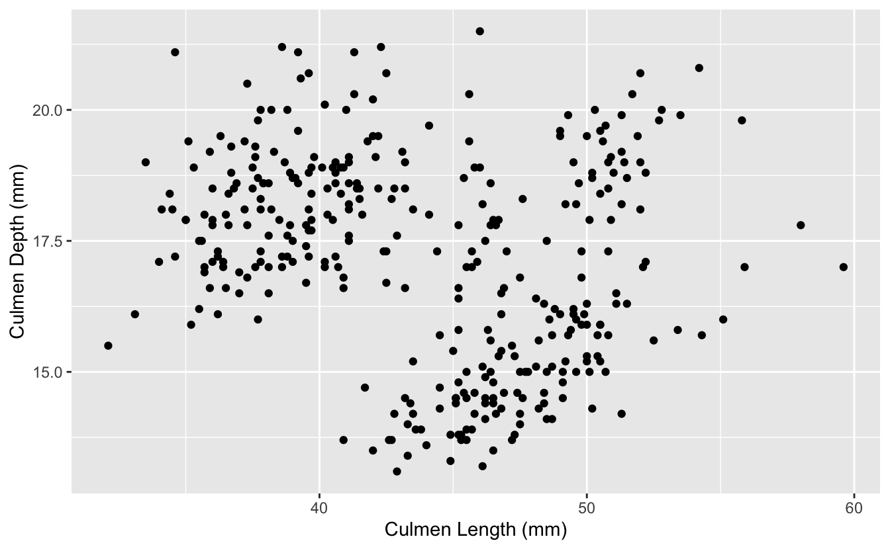

------------------------------------------------------------------------

Prep homework
-------------

### Basic computer setup

-   If you didn't already do this, please follow the [Code Club Computer Setup](/codeclub-setup/04_ggplot2/) instructions, which also has pointers for if you're new to R or RStudio.

-   If you're able to do so, please open RStudio a bit before Code Club starts -- and in case you run into issues, please join the Zoom call early and we'll help you troubleshoot.

### New to ggplot?

Check out the three Code Club pages for [Session 4](/codeclub/04_ggplot2/), [Session 5](/codeclub/05_ggplot-round-2/) and [Session 10](/codeclub/10_faceting-animating/) which are all about `ggplot2`.

If you've never used `ggplot2` before (or even if you have), you may find [this cheat sheet](https://github.com/rstudio/cheatsheets/blob/master/data-visualization-2.1.pdf) useful.

 

Getting Started
---------------

### RMarkdown for today's session

<pre class='chroma'><code class='language-r' data-lang='r'># directory for Code Club Session 15:
<a href='https://rdrr.io/r/base/files2.html'>dir.create</a>("S15")

# directory for our RMarkdown
# ("recursive" to create two levels at once.)
<a href='https://rdrr.io/r/base/files2.html'>dir.create</a>("S15/Rmd/")

# save the url location for today's script
todays_Rmd &lt;- 
  'https://raw.githubusercontent.com/biodash/biodash.github.io/master/content/codeclub/15_plotly/Plotly-withOUT-answers.Rmd'

# indicate the name of the new Rmd
Session15_Rmd &lt;- "S15/Rmd/Session15_plotly.Rmd"

# go get that file! 
<a href='https://rdrr.io/r/utils/download.file.html'>download.file</a>(url = todays_Rmd,
              destfile = Session15_Rmd)</code></pre>

 

------------------------------------------------------------------------

1 - What is plotly?
-------------------

Today we are going to talk about making interactive plots using [Plotly](https://plotly.com/). Plotly exists in a variety of programming languages, but today we will be just talking about using it in [R](https://plotly.com/r/). All of the plotly documentation can be found [here](https://cran.r-project.org/web/packages/plotly/plotly.pdf).

If you have never used `plotly` before, install it with the code below.

<pre class='chroma'><code class='language-r' data-lang='r'><a href='https://rdrr.io/r/utils/install.packages.html'>install.packages</a>("plotly")</code></pre>

Here are some useful links to find info about using `ggplotly`.

-   [Basic ggplot2 charts](https://plotly.com/ggplot2/#layout-options)
-   [Plotly R library fundamentals](https://plotly.com/r/plotly-fundamentals/)
-   [Intro to `ggplotly()`](https://plotly-r.com/overview.html#intro-ggplotly)
-   [Using `layout()`](https://plotly.com/r/reference/layout/#)
-   [`ggplotly()` tooltips](https://plotly-r.com/controlling-tooltips.html#tooltip-text-ggplotly)

Before we start, there are two basic ways to use plot in R using plotly:

-   Using [`ggplotly()`](https://www.rdocumentation.org/packages/plotly/versions/4.9.3/topics/ggplotly) - this is what we will go over today because it has the same syntax as `ggplot()` which we have already learned
-   Using [`plot_ly()`](https://www.rdocumentation.org/packages/plotly/versions/4.9.3/topics/plot_ly) - there is slightly more functionality in this function, but the syntax is all new, so I'd suggest if you can do what you want with [`ggplotly()`](https://docs.ropensci.org/plotly/reference/ggplotly.html), do that. The syntax is not particularly hard so don't be scared to use it if interactive plots are something you're very interested in.

When you are googling about using plotly, you will find a combination of [`ggplotly()`](https://docs.ropensci.org/plotly/reference/ggplotly.html) and [`plot_ly()`](https://docs.ropensci.org/plotly/reference/plot_ly.html) approaches, and some parts of the code are interchangable. The easiesy way to see which parts are, is to try.

Also note, Google gets a bit confused when googling "ggplotly" and often returns information about just ggplot, so read extra carefully when problem solving.

This is an example of work from my group where we have found plotly to be particularly useful.

`` Data from [Bilbrey et al., bioRxiv 2021](https://www.biorxiv.org/content/10.1101/2021.02.18.431481v1)

------------------------------------------------------------------------

2 - Load libraries, get data
----------------------------

Lets load the libraries we are using for today.

<pre class='chroma'><code class='language-r' data-lang='r'><a href='https://rdrr.io/r/base/library.html'>library</a>(<a href='http://tidyverse.tidyverse.org'>tidyverse</a>)
<a href='https://rdrr.io/r/base/library.html'>library</a>(<a href='https://plotly-r.com'>plotly</a>) # for making interactive plots
<a href='https://rdrr.io/r/base/library.html'>library</a>(<a href='https://github.com/ramnathv/htmlwidgets'>htmlwidgets</a>) # for saving html files
<a href='https://rdrr.io/r/base/library.html'>library</a>(<a href='https://allisonhorst.github.io/palmerpenguins/'>palmerpenguins</a>) # for our penguins data</code></pre>

Let's look at `penguins_raw` this time, a df that has a bit more data than the `penguins` df.

<pre class='chroma'><code class='language-r' data-lang='r'><a href='https://rdrr.io/r/utils/head.html'>head</a>(penguins_raw)
#&gt; # A tibble: 6 x 17
#&gt;   studyName `Sample Number` Species       Region Island  Stage   `Individual ID`
#&gt;   &lt;chr&gt;               &lt;dbl&gt; &lt;chr&gt;         &lt;chr&gt;  &lt;chr&gt;   &lt;chr&gt;   &lt;chr&gt;          
#&gt; 1 PAL0708                 1 Adelie Pengu… Anvers Torger… Adult,… N1A1           
#&gt; 2 PAL0708                 2 Adelie Pengu… Anvers Torger… Adult,… N1A2           
#&gt; 3 PAL0708                 3 Adelie Pengu… Anvers Torger… Adult,… N2A1           
#&gt; 4 PAL0708                 4 Adelie Pengu… Anvers Torger… Adult,… N2A2           
#&gt; 5 PAL0708                 5 Adelie Pengu… Anvers Torger… Adult,… N3A1           
#&gt; 6 PAL0708                 6 Adelie Pengu… Anvers Torger… Adult,… N3A2           
#&gt; # … with 10 more variables: Clutch Completion &lt;chr&gt;, Date Egg &lt;date&gt;,
#&gt; #   Culmen Length (mm) &lt;dbl&gt;, Culmen Depth (mm) &lt;dbl&gt;,
#&gt; #   Flipper Length (mm) &lt;dbl&gt;, Body Mass (g) &lt;dbl&gt;, Sex &lt;chr&gt;,
#&gt; #   Delta 15 N (o/oo) &lt;dbl&gt;, Delta 13 C (o/oo) &lt;dbl&gt;, Comments &lt;chr&gt;
<a href='https://rdrr.io/r/utils/head.html'>head</a>(penguins)
#&gt; # A tibble: 6 x 8
#&gt;   species island bill_length_mm bill_depth_mm flipper_length_… body_mass_g sex  
#&gt;   &lt;fct&gt;   &lt;fct&gt;           &lt;dbl&gt;         &lt;dbl&gt;            &lt;int&gt;       &lt;int&gt; &lt;fct&gt;
#&gt; 1 Adelie  Torge…           39.1          18.7              181        3750 male 
#&gt; 2 Adelie  Torge…           39.5          17.4              186        3800 fema…
#&gt; 3 Adelie  Torge…           40.3          18                195        3250 fema…
#&gt; 4 Adelie  Torge…           NA            NA                 NA          NA NA   
#&gt; 5 Adelie  Torge…           36.7          19.3              193        3450 fema…
#&gt; 6 Adelie  Torge…           39.3          20.6              190        3650 male 
#&gt; # … with 1 more variable: year &lt;int&gt;</code></pre>

3 - Create base ggplot object
-----------------------------

Using the `penguins_raw` dataset and make a scatter plot with Culmen Length on the y, and Culmen Depth on the x.

<pre class='chroma'><code class='language-r' data-lang='r'>bill_depth_length &lt;- penguins_raw %&gt;%
  ggplot(aes(x = `Culmen Length (mm)`, y = `Culmen Depth (mm)`)) +
  geom_point()

bill_depth_length
#&gt; Warning: Removed 2 rows containing missing values (geom_point).
</code></pre>

4 - Make it interactive with [`ggplotly()`](https://docs.ropensci.org/plotly/reference/ggplotly.html)
-----------------------------------------

You can learn more about the [`ggplotly()`](https://docs.ropensci.org/plotly/reference/ggplotly.html) function, including its arguments [here](https://www.rdocumentation.org/packages/plotly/versions/4.9.3/topics/ggplotly).

<pre class='chroma'><code class='language-r' data-lang='r'><a href='https://docs.ropensci.org/plotly/reference/ggplotly.html'>ggplotly</a>(bill_depth_length)</code></pre>

``

Wow that was easy!

Let's add a title and change the theme to make our plot a little prettier before we progress.

<pre class='chroma'><code class='language-r' data-lang='r'>bill_depth_length &lt;- penguins_raw %&gt;%
  ggplot(aes(x = `Culmen Length (mm)`, y = `Culmen Depth (mm)`)) +
  geom_point() +
  theme_minimal() +
  labs(title = "Understanding Penguin Bill Dimensions")

<a href='https://docs.ropensci.org/plotly/reference/ggplotly.html'>ggplotly</a>(bill_depth_length)</code></pre>

``

5 - Using tooltip
-----------------

Using tooltip helps you to indicate what appears when you hover over different parts of your plot. You can learn more about controlling `tooltip` [here](https://plotly-r.com/controlling-tooltips.html).

What if we want to hover over each point and be able to tell which `Island` the penguin was found on?

To do this, we indicate what we want to hover with using `text =` in our aesthetic mappings. Then, we indicate `tooltip = "text"` to tell [`ggplotly()`](https://docs.ropensci.org/plotly/reference/ggplotly.html) what we want to hover.

<pre class='chroma'><code class='language-r' data-lang='r'>bill_depth_length &lt;- penguins_raw %&gt;%
  ggplot(aes(x = `Culmen Length (mm)`, y = `Culmen Depth (mm)`,
             text = Island)) +
  geom_point() +
  theme_minimal() +
  labs(title = "Understanding Penguin Bill Dimensions")

<a href='https://docs.ropensci.org/plotly/reference/ggplotly.html'>ggplotly</a>(bill_depth_length,
         tooltip = "text")</code></pre>

``

You can play around a lot with tooltip to get it to be exactly how you want, and you can include multiple things in your hover text.

You can also indicate to hover with data that is not inherently in your plot by mapping it to a `group` aesthetic.

<pre class='chroma'><code class='language-r' data-lang='r'>bill_depth_length &lt;- penguins_raw %&gt;%
  ggplot(aes(x = `Culmen Length (mm)`, y = `Culmen Depth (mm)`,
             text = Island, group = `Individual ID`)) +
  geom_point() +
  theme_minimal() +
  labs(title = "Understanding Penguin Bill Dimensions")

<a href='https://docs.ropensci.org/plotly/reference/ggplotly.html'>ggplotly</a>(bill_depth_length,
         tooltip = <a href='https://rdrr.io/r/base/c.html'>c</a>("text", "Individual ID")) # hover test will be in this order</code></pre>

``

You may also want to paste in some text to your hover info to provide additional clarity on what you are showing.

You can use `paste` to add some information you'd like to see in each of the hover texts, here, we are indicating Island: `Island`. You can also add multiple variables within text, and it will populate in the hover text in the way you indicate. There is an example of how to do this in Bonus 1.

<pre class='chroma'><code class='language-r' data-lang='r'>bill_depth_length &lt;- penguins_raw %&gt;%
  ggplot(aes(x = `Culmen Length (mm)`, y = `Culmen Depth (mm)`,
             text = <a href='https://rdrr.io/r/base/paste.html'>paste</a>("Island:", Island))) +
  geom_point() +
  theme_minimal() +
  labs(title = "Understanding Penguin Bill Dimensions")

<a href='https://docs.ropensci.org/plotly/reference/ggplotly.html'>ggplotly</a>(bill_depth_length,
         tooltip = "text")</code></pre>

``

6 - Hover label aesthetics
--------------------------

You might not like the default hover text aesthetics, and can change them! You can do this using `style` and `layout` and adding these functions using the pipe [`%>%`](https://magrittr.tidyverse.org/reference/pipe.html).

<pre class='chroma'><code class='language-r' data-lang='r'># setting fonts for the plot
font &lt;- <a href='https://rdrr.io/r/base/list.html'>list</a>(
  family = "Roboto Condensed",
  size = 15,
  color = "white")

# setting hover label specs
label &lt;- <a href='https://rdrr.io/r/base/list.html'>list</a>(
  bgcolor = "#FF0000",
  bordercolor = "transparent",
  font = font) # we can do this bc we already set font

# plotting like normal
bill_depth_length &lt;- penguins_raw %&gt;%
  ggplot(aes(x = `Culmen Length (mm)`, y = `Culmen Depth (mm)`,
             text = <a href='https://rdrr.io/r/base/paste.html'>paste</a>("Island:", Island))) +
  geom_point() +
  theme_minimal() +
  labs(title = "A Deep Dive (ha) Into \nUnderstanding Penguin Bill Dimensions")
# use\n to bring your text to another line

# amending our ggplotly call to include new fonts and hover label specs
<a href='https://docs.ropensci.org/plotly/reference/ggplotly.html'>ggplotly</a>(bill_depth_length, tooltip = "text") %&gt;%
  <a href='https://docs.ropensci.org/plotly/reference/style.html'>style</a>(hoverlabel = label) %&gt;%
  <a href='https://docs.ropensci.org/plotly/reference/layout.html'>layout</a>(font = font)</code></pre>

``

7 - Dynamic ticks
-----------------

Keep your axis labels so when you zoom, you can see where you are on your plot. Remember, you can zoom and pan around your plot!

<pre class='chroma'><code class='language-r' data-lang='r'><a href='https://docs.ropensci.org/plotly/reference/ggplotly.html'>ggplotly</a>(bill_depth_length,
         tooltip = "text",
         dynamicTicks = TRUE)</code></pre>

``

8 - Animating
-------------

Add `frame` in your aesthetics mapping to tell plotly what column to animate over. You can then play your animation, or toggle from one view to another.

<pre class='chroma'><code class='language-r' data-lang='r'># add frame
bill_depth_length &lt;- penguins_raw %&gt;%
  ggplot(aes(x = `Culmen Length (mm)`, y = `Culmen Depth (mm)`,
             frame = Island, text = `Individual ID`)) +
  geom_point() +
  theme_minimal() +
  labs(title = "Understanding Penguin Bill Dimensions")

<a href='https://docs.ropensci.org/plotly/reference/ggplotly.html'>ggplotly</a>(bill_depth_length,
         tooltip = "text")</code></pre>

``

**Note:** I know this plot isn't animating, this is just because of how this website is formatting and I couldn't figure out how to fix it. But, if you do this in R, you will find the code works.

9 - Everything you know about ggplot still applies!
---------------------------------------------------

Don't forget you can use things like faceting, that we have gone over previously in [Session 10](https://biodash.github.io/codeclub/10_faceting-animating/).

<pre class='chroma'><code class='language-r' data-lang='r'>bill_depth_length &lt;- penguins %&gt;%
  ggplot(aes(x = bill_length_mm, y = bill_depth_mm, color = species,
             text = <a href='https://rdrr.io/r/base/paste.html'>paste</a>("Island:", island))) +
  geom_point() +
  theme_minimal() +
  theme(legend.position = "none") +
  labs(title = "Understanding Penguin Bill Dimensions",
       x = "Culmen Bill Length (mm)",
       y = "Culmen Bill Depth (mm)") +
  facet_wrap(~species)

<a href='https://docs.ropensci.org/plotly/reference/ggplotly.html'>ggplotly</a>(bill_depth_length,
         tooltip = "text")</code></pre>

``

10 - Saving your plots
----------------------

Now that you've made a beautiful interactive plot, you probably want to save it.

Assign the plot you want to save to an object, and use the function [`saveWidget()`](https://rdrr.io/pkg/htmlwidgets/man/saveWidget.html) to save it. You can find the documentation [here](https://www.rdocumentation.org/packages/htmlwidgets/versions/1.5.3/topics/saveWidget).

<pre class='chroma'><code class='language-r' data-lang='r'># assign ggplotly plot to an object
ggplotly_to_save &lt;- <a href='https://docs.ropensci.org/plotly/reference/ggplotly.html'>ggplotly</a>(bill_depth_length,
                             tooltip = "text")

# save
<a href='https://rdrr.io/pkg/htmlwidgets/man/saveWidget.html'>saveWidget</a>(widget = ggplotly_to_save,
           file = "ggplotlying.html")</code></pre>

Breakout rooms
--------------

We are going to use the birds dataset from previous weeks, and gapminder data for the bonus.

Let's grab the birds data.

<pre class='chroma'><code class='language-r' data-lang='r'># create directory for data to go
<a href='https://rdrr.io/r/base/files2.html'>dir.create</a>('data/birds/', recursive = TRUE)

# preparing to download
# denote bird file url
birds_url &lt;-
'https://raw.githubusercontent.com/biodash/biodash.github.io/master/assets/data/birds/backyard-birds_Ohio.tsv'
# denote file name
birds_file &lt;- 'data/birds/backyard-birds_Ohio.tsv'

# get file
<a href='https://rdrr.io/r/utils/download.file.html'>download.file</a>(url = birds_url, 
              destfile = birds_file)</code></pre>

Read in data.

<pre class='chroma'><code class='language-r' data-lang='r'># read in birds data
birds &lt;- read_tsv(file = 'data/birds/backyard-birds_Ohio.tsv')
#&gt; 
#&gt; ── Column specification ────────────────────────────────────────────────────────
#&gt; cols(
#&gt;   class = col_character(),
#&gt;   order = col_character(),
#&gt;   family = col_character(),
#&gt;   genus = col_character(),
#&gt;   species = col_character(),
#&gt;   locality = col_character(),
#&gt;   stateProvince = col_character(),
#&gt;   decimalLatitude = col_double(),
#&gt;   decimalLongitude = col_double(),
#&gt;   eventDate = col_datetime(format = ""),
#&gt;   species_en = col_character(),
#&gt;   range = col_character()
#&gt; )</code></pre>

Look at your new df.

<pre class='chroma'><code class='language-r' data-lang='r'><a href='https://rdrr.io/r/utils/head.html'>head</a>(birds)
#&gt; # A tibble: 6 x 12
#&gt;   class order   family  genus  species   locality  stateProvince decimalLatitude
#&gt;   &lt;chr&gt; &lt;chr&gt;   &lt;chr&gt;   &lt;chr&gt;  &lt;chr&gt;     &lt;chr&gt;     &lt;chr&gt;                   &lt;dbl&gt;
#&gt; 1 Aves  Passer… Corvid… Cyano… Cyanocit… 44805 As… Ohio                     40.9
#&gt; 2 Aves  Passer… Corvid… Cyano… Cyanocit… 45244 Ci… Ohio                     39.1
#&gt; 3 Aves  Passer… Corvid… Cyano… Cyanocit… 44132 Eu… Ohio                     41.6
#&gt; 4 Aves  Passer… Corvid… Cyano… Cyanocit… 45242 Ci… Ohio                     39.2
#&gt; 5 Aves  Passer… Corvid… Cyano… Cyanocit… 45246 Ci… Ohio                     39.3
#&gt; 6 Aves  Passer… Corvid… Cyano… Cyanocit… 44484 Wa… Ohio                     41.2
#&gt; # … with 4 more variables: decimalLongitude &lt;dbl&gt;, eventDate &lt;dttm&gt;,
#&gt; #   species_en &lt;chr&gt;, range &lt;chr&gt;</code></pre>

Exercises
---------

### Exercise 1

Filter your new `birds` df to only inclue Blue Jays. Check to see how many Blue Jay sightings there were in Ohio.

 Hints (click here) 

Try using a [`filter()`](https://dplyr.tidyverse.org/reference/filter.html), and consider filtering based on `species_en`  

 

 Solutions (click here) 

<pre class='chroma'><code class='language-r' data-lang='r'>bald_eagle &lt;- birds %&gt;%
  <a href='https://dplyr.tidyverse.org/reference/filter.html'>filter</a>(species_en == "Bald Eagle")

# what do we have?
<a href='https://rdrr.io/r/utils/head.html'>head</a>(bald_eagle)
#&gt; # A tibble: 6 x 12
#&gt;   class order   family  genus  species   locality  stateProvince decimalLatitude
#&gt;   &lt;chr&gt; &lt;chr&gt;   &lt;chr&gt;   &lt;chr&gt;  &lt;chr&gt;     &lt;chr&gt;     &lt;chr&gt;                   &lt;dbl&gt;
#&gt; 1 Aves  Accipi… Accipi… Halia… Haliaeet… Mentor    Ohio                     41.7
#&gt; 2 Aves  Accipi… Accipi… Halia… Haliaeet… 45742 Li… Ohio                     39.3
#&gt; 3 Aves  Accipi… Accipi… Halia… Haliaeet… Moreland… Ohio                     41.4
#&gt; 4 Aves  Accipi… Accipi… Halia… Haliaeet… Eastlake  Ohio                     41.7
#&gt; 5 Aves  Accipi… Accipi… Halia… Haliaeet… 44060 Me… Ohio                     41.7
#&gt; 6 Aves  Accipi… Accipi… Halia… Haliaeet… 44839 Hu… Ohio                     41.4
#&gt; # … with 4 more variables: decimalLongitude &lt;dbl&gt;, eventDate &lt;dttm&gt;,
#&gt; #   species_en &lt;chr&gt;, range &lt;chr&gt;

# check our df dimensions
<a href='https://rdrr.io/r/base/dim.html'>dim</a>(bald_eagle)
#&gt; [1] 381  12</code></pre>

 

------------------------------------------------------------------------

### Exercise 2

Create a map that plots all the Blue Jays found around Ohio. Color the points blue. Make sure the aspect ratio of Ohio looks reasonable to you.

 Hints (click here) 

Go back to Sessions [11](https://biodash.github.io/codeclub/11_ggplot-maps/) and [12](https://biodash.github.io/codeclub/12_loops/) to re-remember how maps work. Don't forget to call [`library(maps)`](https://rdrr.io/r/base/library.html).  

 

 Solutions (click here) 

<pre class='chroma'><code class='language-r' data-lang='r'><a href='https://rdrr.io/r/base/library.html'>library</a>(maps)
#&gt; 
#&gt; Attaching package: 'maps'
#&gt; The following object is masked from 'package:purrr':
#&gt; 
#&gt;     map

# get map of the states
states &lt;- map_data("state")

# filter states to only include ohio
ohio &lt;- states %&gt;%
  <a href='https://dplyr.tidyverse.org/reference/filter.html'>filter</a>(region == "ohio")

# plot
ggplot(data = ohio,
       aes(x = long, y = lat, group = group)) +
  geom_polygon(color = "black", fill = "white") +   
  geom_point(data = bald_eagle,                 
             aes(x = decimalLongitude, y = decimalLatitude, group = NULL),
             color = "blue", alpha = 0.2) +
  coord_fixed(1.2) +
  labs(title = 'Bald Eagles Around Ohio')
</code></pre>

 

------------------------------------------------------------------------

### Exercise 3

Make your plot interactive so you can hover and and see the locality of each bald eagle observation.

 Hints (click here) 

You may want to call `text` within `geom_point()`.  

 

 Solutions (click here) 

<pre class='chroma'><code class='language-r' data-lang='r'>bald_eagles_ohio &lt;- 
  ggplot(data = ohio,
         aes(x = long, y = lat, group = group)) +
  geom_polygon(color = "black", fill = "white") +   
  geom_point(data = bald_eagle,                 
             aes(x = decimalLongitude, y = decimalLatitude, group = NULL,
                 text = locality),
             color = "blue", alpha = 0.2) +
  coord_fixed(1.2) +
  labs(title = 'Bald Eagles Around Ohio')

<a href='https://docs.ropensci.org/plotly/reference/ggplotly.html'>ggplotly</a>(bald_eagles_ohio,
         tooltip = "text")</code></pre>

``

 

------------------------------------------------------------------------

### Exercise 4

Change the hover text so that the background color is red, clean up your axis labels, and make all the fonts for the plot Arial.

 Hints (click here) 

You can set fonts either within your `ggplot()` call, or setting `font` within [`layout()`](https://docs.ropensci.org/plotly/reference/layout.html). You can customize the hover label with [`style()`](https://docs.ropensci.org/plotly/reference/style.html).  

 

 Solutions (click here) 

<pre class='chroma'><code class='language-r' data-lang='r'># setting fonts for the plot
eagle_font &lt;- <a href='https://rdrr.io/r/base/list.html'>list</a>(
  family = "Arial",
  size = 15,
  color = "white")

# setting hover label specs
eagle_label &lt;- <a href='https://rdrr.io/r/base/list.html'>list</a>(
  bgcolor = "red",
  bordercolor = "transparent",
  font = eagle_font) # we can do this bc we already set font

bald_eagles_ohio &lt;- 
  ggplot(data = ohio,
         aes(x = long, y = lat, group = group)) +
  geom_polygon(color = "black", fill = "white") +   
  geom_point(data = bald_eagle,                 
             aes(x = decimalLongitude, y = decimalLatitude, group = NULL,
                 text = locality),
             color = "blue", alpha = 0.2) +
  coord_fixed(1.2) +
  labs(title = 'Bald Eagles Around Ohio',
       x = "Latitude",
       y = "Longitude")

# amending our ggplotly call to include new fonts and hover label specs
<a href='https://docs.ropensci.org/plotly/reference/ggplotly.html'>ggplotly</a>(bald_eagles_ohio, tooltip = "text") %&gt;%
  <a href='https://docs.ropensci.org/plotly/reference/style.html'>style</a>(hoverlabel = eagle_label) %&gt;%
  <a href='https://docs.ropensci.org/plotly/reference/layout.html'>layout</a>(font = eagle_font)</code></pre>

``

 

------------------------------------------------------------------------

Bonus
-----

### Bonus 1

Let's go back to the Gapminder data we looked at in the instructional part of [Session 10](https://biodash.github.io/codeclub/10_faceting-animating/) on faceting, animating, and multi-plotting.

Make a bubble-style plot that shows the life expectancy vs. GDP per capita over 1952 to 2007 for all countries. Color by continent, and indicate population by size. Use your knowledge of making plots to alter it such that you think it is descriptive and aesthetic.

 Hints (click here) 

Set `text` to what you want to hover (try adding multiple variables in there!), play around with `theme` and scaling, change fonts and aesthetics until you are pleased. You can download the `gapminder` data like this:

<pre class='chroma'><code class='language-r' data-lang='r'># install.packages("gapminder") # if you weren't at Session 10
<a href='https://rdrr.io/r/base/library.html'>library</a>(<a href='https://github.com/jennybc/gapminder'>gapminder</a>)
<a href='https://rdrr.io/r/utils/head.html'>head</a>(gapminder)
#&gt; # A tibble: 6 x 6
#&gt;   country     continent  year lifeExp      pop gdpPercap
#&gt;   &lt;fct&gt;       &lt;fct&gt;     &lt;int&gt;   &lt;dbl&gt;    &lt;int&gt;     &lt;dbl&gt;
#&gt; 1 Afghanistan Asia       1952    28.8  8425333      779.
#&gt; 2 Afghanistan Asia       1957    30.3  9240934      821.
#&gt; 3 Afghanistan Asia       1962    32.0 10267083      853.
#&gt; 4 Afghanistan Asia       1967    34.0 11537966      836.
#&gt; 5 Afghanistan Asia       1972    36.1 13079460      740.
#&gt; 6 Afghanistan Asia       1977    38.4 14880372      786.</code></pre>

 

 

 Solutions (click here) 

<pre class='chroma'><code class='language-r' data-lang='r'>gapminder_font &lt;- <a href='https://rdrr.io/r/base/list.html'>list</a>(
  family = "Roboto Condensed")

gapminder_bubble &lt;- gapminder %&gt;%
  ggplot(aes(x = gdpPercap, y = lifeExp, 
             fill = continent, size = pop, 
             text = <a href='https://rdrr.io/r/base/paste.html'>paste</a>(
               "Country:", country,
               "\nLife expectancy:", <a href='https://rdrr.io/r/base/Round.html'>round</a>(lifeExp,1),
               "\nGDP per capita:", <a href='https://rdrr.io/r/base/Round.html'>round</a>(gdpPercap,0)))) +
  geom_point(aes(frame = year), color = "black", shape = 21, stroke = 0.2) +
  scale_x_log10() +
  theme_minimal() +
  theme(plot.title = element_text(size = 18)) +
  labs(title = "Changing Life Expectancy and GDP Per Capita Worldwide \nFrom 1952 to 2007",
       x = "GDP per capita (in International Dollars)",
       y = "Life Expectancy (years)",
       fill = "",
       size = "")

<a href='https://docs.ropensci.org/plotly/reference/ggplotly.html'>ggplotly</a>(gapminder_bubble, 
         tooltip = <a href='https://rdrr.io/r/base/c.html'>c</a>("text")) %&gt;%
  <a href='https://docs.ropensci.org/plotly/reference/layout.html'>layout</a>(font = gapminder_font)</code></pre>

``

**Note:** I know this plot isn't animating, this is just because of how this website is formatting and I couldn't figure out how to fix it. But, if you do this in R, you will find the code works.

 

------------------------------------------------------------------------

