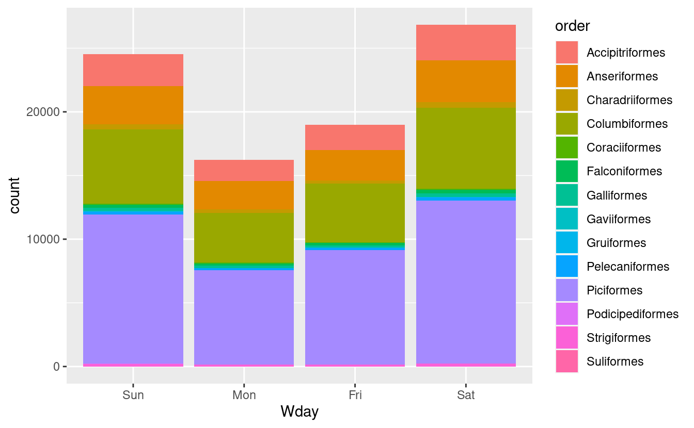

     

------------------------------------------------------------------------

## New to Code Club?

-   If you didn't already do this, please follow the [Code Club Computer Setup](/codeclub-setup/04_ggplot2/) instructions, which also has pointers for if you're new to R or RStudio.

-   If you're able to do so, please open RStudio a bit before Code Club starts -- and in case you run into issues, please join the Zoom call early and we'll help you troubleshoot.

 

------------------------------------------------------------------------

## 1. Getting set up

R has a range of functions that allow you to work with dates and times. However, today we will discuss how to work with dates and times in R using the package "*lubridate*".

While *lubridate* is *tidyverse*-style, it is not part of the core *tidyverse*, so we need to install it.

We are also going to use the bird data that was first discussed in Code Club session 1, and we will need to download that.

<pre class='chroma'><code class='language-r' data-lang='r'># If needed, install the lubridate package:
# install.packages("lubridate")

# Load the tidyverse and lubridate:
<a href='https://rdrr.io/r/base/library.html'>library</a>(<a href='http://tidyverse.tidyverse.org'>tidyverse</a>)
<a href='https://rdrr.io/r/base/library.html'>library</a>(<a href='https://lubridate.tidyverse.org'>lubridate</a>)
</code></pre>

<pre class='chroma'><code class='language-r' data-lang='r'># Create a dir for our bird data ("recursive" to create two levels at once):
<a href='https://rdrr.io/r/base/files2.html'>dir.create</a>("data/birds/", recursive = TRUE)

# The URL to our file:
birds_file_url &lt;- "https://raw.githubusercontent.com/biodash/biodash.github.io/master/assets/data/birds/backyard-birds_Ohio.tsv"

# The path to the file that we want to download the data to:
birds_file &lt;- "data/birds/backyard-birds_Ohio.tsv"

# Download:
<a href='https://rdrr.io/r/utils/download.file.html'>download.file</a>(url = birds_file_url, destfile = birds_file)

# Read the data:
birds &lt;- read_tsv(file = birds_file)
</code></pre>

 

------------------------------------------------------------------------

## 2. What is *lubridate*?

*lubridate* provides tools that make it easier to parse and manipulate dates.

We will discuss the common use of lubridate under the following themes:

1.  Parsing dates

2.  Manipulating dates  
    a) *Instants*: Rounding dates, time zones  
    b) *Time spans*: Durations, periods, intervals

 

------------------------------------------------------------------------

## 3. Parsing dates

*lubridate*'s parsing functions read strings into R as "date-time" objects. Year is represented by `y`, month by `m`, and day by `d`.

Strings can be parsed using the following functions: [`dmy()`](http://lubridate.tidyverse.org/reference/ymd.html), [`myd()`](http://lubridate.tidyverse.org/reference/ymd.html), [`ymd()`](http://lubridate.tidyverse.org/reference/ymd.html), [`ydm()`](http://lubridate.tidyverse.org/reference/ymd.html), [`dym()`](http://lubridate.tidyverse.org/reference/ymd.html), [`mdy()`](http://lubridate.tidyverse.org/reference/ymd.html), [`ymd_hms()`](http://lubridate.tidyverse.org/reference/ymd_hms.html).

*Let us look at some examples*

<pre class='chroma'><code class='language-r' data-lang='r'># parsing by year, month, day
<a href='http://lubridate.tidyverse.org/reference/ymd.html'>ymd</a>(20170131)

#&gt; [1] "2017-01-31"

# parsing by month, day, year
<a href='http://lubridate.tidyverse.org/reference/ymd.html'>mdy</a>("December 1st, 2020")

#&gt; [1] "2020-12-01"

# parsing by day, month, year
<a href='http://lubridate.tidyverse.org/reference/ymd.html'>dmy</a>("01-Dec-2020")

#&gt; [1] "2020-12-01"

<a href='http://lubridate.tidyverse.org/reference/ymd.html'>dmy</a>("01/Dec/2020")

#&gt; [1] "2020-12-01"

<a href='http://lubridate.tidyverse.org/reference/ymd.html'>dmy</a>("01Dec2020")

#&gt; [1] "2020-12-01"

# parsing by year, month, day, hour, minutes, and seconds
<a href='http://lubridate.tidyverse.org/reference/ymd_hms.html'>ymd_hms</a>("2020-01-31 20:11:59")

#&gt; [1] "2020-01-31 20:11:59 UTC"
</code></pre>

 

------------------------------------------------------------------------

## 4. Manipulating dates: Instants

*lubridate* distinguishes between *moments* in time (instants) and *spans* of time (time spans).

Instants are specific moments of time. They are a combination of measurements on different units (i.e, years, months, days, etc.).

-   [`now()`](http://lubridate.tidyverse.org/reference/now.html) returns the current system time.  
-   [`today()`](http://lubridate.tidyverse.org/reference/now.html) returns the current system date.

The individual values for [`now()`](http://lubridate.tidyverse.org/reference/now.html) and [`today()`](http://lubridate.tidyverse.org/reference/now.html) units can be extracted from an instant and set with the accessor functions [`second()`](http://lubridate.tidyverse.org/reference/second.html), [`minute()`](http://lubridate.tidyverse.org/reference/minute.html), [`hour()`](http://lubridate.tidyverse.org/reference/hour.html), [`day()`](http://lubridate.tidyverse.org/reference/day.html), [`yday()`](http://lubridate.tidyverse.org/reference/day.html), [`mday()`](http://lubridate.tidyverse.org/reference/day.html), [`wday()`](http://lubridate.tidyverse.org/reference/day.html), [`week()`](http://lubridate.tidyverse.org/reference/week.html), [`month()`](http://lubridate.tidyverse.org/reference/month.html), and [`year()`](http://lubridate.tidyverse.org/reference/year.html).

*Let us look at some examples*

<pre class='chroma'><code class='language-r' data-lang='r'># Find the current system date using function today ()
<a href='http://lubridate.tidyverse.org/reference/now.html'>today</a>()

#&gt; [1] "2021-03-31"

# Find the current system time using function now ()
Now &lt;- <a href='http://lubridate.tidyverse.org/reference/now.html'>now</a>()
Now

#&gt; [1] "2021-03-31 20:02:08 EDT"

# Extract the day of the month from an object Now using function mday ()
<a href='http://lubridate.tidyverse.org/reference/day.html'>mday</a>(Now)

#&gt; [1] 31

# Extract the day of the week from an object Now using function wday()
<a href='http://lubridate.tidyverse.org/reference/day.html'>wday</a>(Now)

#&gt; [1] 4

# Extract the week of the year from an object Now using function week ()
<a href='http://lubridate.tidyverse.org/reference/week.html'>week</a>(Now)

#&gt; [1] 13

# Extract the month from an object Now using function month ()
<a href='http://lubridate.tidyverse.org/reference/month.html'>month</a>(Now)

#&gt; [1] 3

# Extract the year from an object Now using function year ()
<a href='http://lubridate.tidyverse.org/reference/year.html'>year</a>(Now)

#&gt; [1] 2021
</code></pre>

### Rounding instants

Instants can be *rounded* to a convenient unit using the functions [`ceiling_date()`](http://lubridate.tidyverse.org/reference/round_date.html), [`floor_date()`](http://lubridate.tidyverse.org/reference/round_date.html), and [`round_date()`](http://lubridate.tidyverse.org/reference/round_date.html).

-   [`ceiling_date()`](http://lubridate.tidyverse.org/reference/round_date.html) takes a date-time object and rounds it up to the nearest boundary of the specified time unit.

-   [`round_date()`](http://lubridate.tidyverse.org/reference/round_date.html) takes a date-time object and time unit, and rounds it to the nearest value of the specified time unit.

-   [`floor_date()`](http://lubridate.tidyverse.org/reference/round_date.html) takes a date-time object and rounds it down to the nearest boundary of the specified time unit.

*Let us look at some examples*

<pre class='chroma'><code class='language-r' data-lang='r'><a href='http://lubridate.tidyverse.org/reference/round_date.html'>ceiling_date</a>(Now, unit = "minute")

#&gt; [1] "2021-03-31 20:03:00 EDT"

<a href='http://lubridate.tidyverse.org/reference/round_date.html'>round_date</a>(Now, unit = "minute")

#&gt; [1] "2021-03-31 20:02:00 EDT"

<a href='http://lubridate.tidyverse.org/reference/round_date.html'>floor_date</a>(Now, unit = "minute")

#&gt; [1] "2021-03-31 20:02:00 EDT"
</code></pre>

### Time zones

Naming time zones is challenging because everyday names of time zones tend to be ambiguous. For example, USA has EST, or Eastern Standard Time. However, both Australia and Canada also have EST!

To avoid confusion, R uses the international standard IANA time zones. These use a consistent naming scheme "/", typically in the form `<continent>/<city>` (there are a few exceptions because not every country lies on a continent). Examples include `America/New_York`, `Europe/Paris`, and `Pacific/Auckland`.

Unless otherwise specified, *lubridate* always uses UTC. UTC (Coordinated Universal Time) is the standard time zone used by the scientific community and roughly equivalent to its predecessor GMT (Greenwich Mean Time).

Example: [`ymd_hms("2021-03-27 11:54:54 EDT", tz="America/New_York")`](http://lubridate.tidyverse.org/reference/ymd_hms.html)

To find your current time zone, use the [`Sys.timezone()`](https://rdrr.io/r/base/timezones.html) function:

<pre class='chroma'><code class='language-r' data-lang='r'><a href='https://rdrr.io/r/base/timezones.html'>Sys.timezone</a>()

#&gt; [1] "America/New_York"
</code></pre>

To see the complete list of all time zone names, use [`OlsonNames()`](https://rdrr.io/r/base/timezones.html):

<pre class='chroma'><code class='language-r' data-lang='r'># See the first four countries in the list of the time zone
<a href='https://rdrr.io/r/utils/head.html'>head</a>(<a href='https://rdrr.io/r/base/timezones.html'>OlsonNames</a>(), 4)

#&gt; [1] "Africa/Abidjan"     "Africa/Accra"       "Africa/Addis_Ababa"
#&gt; [4] "Africa/Algiers"
</code></pre>

*lubridate* has two functions for working with time zones:

-   [`with_tz()`](http://lubridate.tidyverse.org/reference/with_tz.html): Changes the time zone in which an instant is displayed. The clock time displayed for the instant changes, but the moment of time described remains the same.

-   [`force_tz()`](http://lubridate.tidyverse.org/reference/force_tz.html): Changes only the time zone element of an instant. The clock time displayed remains the same, but the resulting instant describes a new moment of time.

<pre class='chroma'><code class='language-r' data-lang='r'>x1 &lt;- <a href='http://lubridate.tidyverse.org/reference/now.html'>now</a>()

# An example using with_tz()
x1a &lt;- <a href='http://lubridate.tidyverse.org/reference/with_tz.html'>with_tz</a>(x1, tzone = "Australia/Lord_Howe")
x1 - x1a

#&gt; Time difference of 0 secs

# Now use force_tz()
x1b &lt;- <a href='http://lubridate.tidyverse.org/reference/force_tz.html'>force_tz</a>(x1, tzone = "Australia/Lord_Howe")
x1 - x1b

#&gt; Time difference of 15 hours
</code></pre>

 

------------------------------------------------------------------------

## 4. Manipulating dates: Time spans

A timespan is a length of time that may or may not be connected to a particular instant. For example, two months is a timespan. *lubridate* has three timespan classes: Durations, Periods and Intervals.

### Durations

Durations measure the exact amount of time that occurs between two instants.

Functions for working with durations include [`is.duration()`](http://lubridate.tidyverse.org/reference/duration.html), [`as.duration()`](http://lubridate.tidyverse.org/reference/as.duration.html) and [`duration()`](http://lubridate.tidyverse.org/reference/duration.html). For specific lengths, [`dseconds()`](http://lubridate.tidyverse.org/reference/duration.html), [`dminutes()`](http://lubridate.tidyverse.org/reference/duration.html), [`dhours()`](http://lubridate.tidyverse.org/reference/duration.html), [`ddays()`](http://lubridate.tidyverse.org/reference/duration.html), [`dweeks()`](http://lubridate.tidyverse.org/reference/duration.html) and [`dyears()`](http://lubridate.tidyverse.org/reference/duration.html) convenient lengths.

### Periods

Periods measure the change in clock time that occurs between two instants.

Functions for working with periods include [`is.period()`](http://lubridate.tidyverse.org/reference/period.html), [`as.period()`](http://lubridate.tidyverse.org/reference/as.period.html) and [`period()`](http://lubridate.tidyverse.org/reference/period.html). [`seconds()`](http://lubridate.tidyverse.org/reference/period.html), [`minutes()`](http://lubridate.tidyverse.org/reference/period.html), [`hours()`](http://lubridate.tidyverse.org/reference/period.html), [`days()`](http://lubridate.tidyverse.org/reference/period.html), [`weeks()`](http://lubridate.tidyverse.org/reference/period.html), [`months()`](https://rdrr.io/r/base/weekday.POSIXt.html) and [`years()`](http://lubridate.tidyverse.org/reference/period.html) quickly create periods of convenient lengths.

### Intervals

Intervals are timespans that begin at a specific instant and end at a specific instant. Intervals retain complete information about a timespan. They provide the only reliable way to convert between periods and durations.

Functions for working with intervals include [`is.interval()`](http://lubridate.tidyverse.org/reference/interval.html), [`as.interval()`](http://lubridate.tidyverse.org/reference/as.interval.html), [`interval()`](http://lubridate.tidyverse.org/reference/interval.html), [`int_shift()`](http://lubridate.tidyverse.org/reference/interval.html), [`int_flip()`](http://lubridate.tidyverse.org/reference/interval.html), [`int_aligns()`](http://lubridate.tidyverse.org/reference/interval.html), [`int_overlaps()`](http://lubridate.tidyverse.org/reference/interval.html).

*Let us look at an example*

<pre class='chroma'><code class='language-r' data-lang='r'># John was born on 19841014. How old is John
h_age &lt;- <a href='http://lubridate.tidyverse.org/reference/now.html'>today</a>() - <a href='http://lubridate.tidyverse.org/reference/ymd.html'>ymd</a>(19841014)
h_age

#&gt; Time difference of 13317 days

# Time difference in days
<a href='http://lubridate.tidyverse.org/reference/as.duration.html'>as.duration</a>(h_age)

#&gt; [1] "1150588800s (~36.46 years)"
</code></pre>

 

------------------------------------------------------------------------

## 5. Plotting the bird data

We will plot the bird data using *ggplot2*.

First, we plot a bar graph of days of the week:

<pre class='chroma'><code class='language-r' data-lang='r'>birds %&gt;%
  mutate(Wday = <a href='http://lubridate.tidyverse.org/reference/day.html'>wday</a>(eventDate, label = TRUE)) %&gt;% 
  ggplot(aes(x = Wday)) +
  geom_bar()

</code></pre>

Second, we'll plot the relative relative abundance of different bird orders by day of the week:

<pre class='chroma'><code class='language-r' data-lang='r'>birds %&gt;% 
  mutate(Wday = <a href='http://lubridate.tidyverse.org/reference/day.html'>wday</a>(eventDate, label = TRUE)) %&gt;% 
  ggplot(aes(x = Wday, fill = order)) +
  geom_bar()

</code></pre>

 

------------------------------------------------------------------------

## 6. Breakout rooms!

### Exercise 1

Jane was born on January 31st, 1992. How old is Jane today?

Hints (click here)

  Use the functions [`today()`](http://lubridate.tidyverse.org/reference/now.html), [`mdy()`](http://lubridate.tidyverse.org/reference/ymd.html), and [`as.duration()`](http://lubridate.tidyverse.org/reference/as.duration.html).

 

Solution (click here)

 

<pre class='chroma'><code class='language-r' data-lang='r'>Jane_age &lt;- <a href='http://lubridate.tidyverse.org/reference/now.html'>today</a>() - <a href='http://lubridate.tidyverse.org/reference/ymd.html'>mdy</a>("January 31st, 1992")
<a href='http://lubridate.tidyverse.org/reference/as.duration.html'>as.duration</a>(Jane_age)

#&gt; [1] "920332800s (~29.16 years)"
</code></pre>

### Exercise 2

Calculate the time differences between the last four countries in the time zone lists with the current time.

Hints (click here)

  Use the [`force_tz()`](http://lubridate.tidyverse.org/reference/force_tz.html) function.

 

Solution (click here)

 

<pre class='chroma'><code class='language-r' data-lang='r'># Current time 
C_time &lt;- <a href='http://lubridate.tidyverse.org/reference/now.html'>now</a>()

# Time zones of of the last four countries
<a href='https://rdrr.io/r/utils/head.html'>tail</a>(<a href='https://rdrr.io/r/base/timezones.html'>OlsonNames</a>(), 4)

#&gt; [1] "UTC"  "W-SU" "WET"  "Zulu"

# Calculate time for UTC time zone 
UTC_time &lt;- <a href='http://lubridate.tidyverse.org/reference/force_tz.html'>force_tz</a>(C_time, tzone = "UTC")

# Calculate time difference
C_time - UTC_time

#&gt; Time difference of 4 hours

# Calculate time for W-SU time zone 
WSU_time &lt;- <a href='http://lubridate.tidyverse.org/reference/force_tz.html'>force_tz</a>(C_time, tzone = "W-SU")
WSU_time

#&gt; [1] "2021-03-31 20:02:10 MSK"

# Calculate time difference
C_time - WSU_time

#&gt; Time difference of 7 hours

C_time

#&gt; [1] "2021-03-31 20:02:10 EDT"

# Calculate time for WET time zone 
WET_time &lt;- <a href='http://lubridate.tidyverse.org/reference/force_tz.html'>force_tz</a>(C_time, tzone = "WET")

# Calculate time difference
C_time - WET_time

#&gt; Time difference of 5 hours

# Calculate time for Zulu time zone 
Zulu_time &lt;- <a href='http://lubridate.tidyverse.org/reference/force_tz.html'>force_tz</a>(C_time, tzone = "Zulu")

# Calculate time difference
C_time - Zulu_time

#&gt; Time difference of 4 hours
</code></pre>

### Bonus exercise

Remove the order "Passeriformes" from the bird data, and plot relative abundance of order based on days of the week.

Hints (click here)

  Use the functions [`filter()`](https://rdrr.io/r/stats/filter.html) and `mutate()`.

 

Solution (click here)

 

<pre class='chroma'><code class='language-r' data-lang='r'># Remove Passeriformes:
birds_a &lt;- <a href='https://rdrr.io/r/stats/filter.html'>filter</a>(birds, order != "Passeriformes")

# Create the plot:
birds_a %&gt;% 
  mutate(Wday = <a href='http://lubridate.tidyverse.org/reference/day.html'>wday</a>(eventDate, label = TRUE)) %&gt;% 
  ggplot(aes(x = Wday, fill = order)) +
  geom_bar()

</code></pre>

