     

------------------------------------------------------------------------

## New to Code Club?

-   If you didn't already do this, please follow the [Code Club Computer Setup](/codeclub-setup/) instructions, which also has pointers for if you're new to R or RStudio.

-   If you're able to do so, please open RStudio a bit before Code Club starts -- and in case you run into issues, please join the Zoom call early and we'll help you troubleshoot.

 

------------------------------------------------------------------------

## 1. Getting set up

While base R also has functions to work with regular expressions (such as [`grep()`](https://rdrr.io/r/base/grep.html) and [`regexp()`](https://rdrr.io/r/base/regex.html)), we will work with the *stringr* package, one of the core *tidyverse* packages.

<pre class='chroma'><code class='language-r' data-lang='r'>## If needed, install the tidyverse:
# install.packages("tidyverse")

## Load the tidyverse -- this will include loading "stringr". 
<a href='https://rdrr.io/r/base/library.html'>library</a>(<a href='http://tidyverse.tidyverse.org'>tidyverse</a>)
</code></pre>

To get access to some strings that we can match with regular expressions, we will use the *bakeoff* data package:

<pre class='chroma'><code class='language-r' data-lang='r'>## If needed, first install the "remotes" package:
# install.packages("remotes")

remotes::<a href='https://remotes.r-lib.org/reference/install_github.html'>install_github</a>("apreshill/bakeoff")
</code></pre>

<pre class='chroma'><code class='language-r' data-lang='r'><a href='https://rdrr.io/r/base/library.html'>library</a>(<a href='https://bakeoff.netlify.com'>bakeoff</a>)
</code></pre>

 

------------------------------------------------------------------------

## 2. Regular expressions: what and why?

You would probably have no trouble recognizing internet and email addresses, most phone numbers, or a DNA sequence embedded in a piece of text. And you would do so even if these were presented without context, and even though you may have never seen that *specific* email address, DNA sequence, and so on.

We can recognize these things because they adhere to certain patterns: a DNA sequence, for instance, typically consists of a sequence of capital As, Cs, Gs, and Ts.

**Regular expressions provide a way to describe and match text that contains specific patterns to computers**, with expressions that convey things like *"any digit"* and *"one or more or the previous character or character type"*. For example, **`\d{5}`** is a regular expression that matches at least five consecutive digits and would be a good start to finding all US ZIP codes embedded in a piece of text.

Regular expressions are extremely useful for a couple of related purposes:

-   **Finding and extracting information that adheres to patterns**

    -   Finding addresses, citations, or identifiers such as accession numbers.

    -   Finding degenerate primers (or the DNA sequence between them) or transcription factor binding sites, in which certain positions may vary.

    -   Finding DNA repeats: you know that something is repeated, but not what is.

    -   While we often *generalize* and *constrain* matches at the same time, we could also merely constrain them:

        -   Only find instances of "*chocolate*" if it is the first or last word of a line/sentence/string.

        -   Only find instances of "*chocolate*" which are followed by "cake", "tart", or "croissant".

 

-   **Sophisticated find-and-replace**

    -   Replace multiple variations of the same thing at once:  
        e.g. change all DNA repeats to lowercase letters or Ns.

    -   Change a date format from `M/DD/YY` to `YYYY-MM-DD`, or GPS coordinates in degrees/minutes/seconds format to decimal degrees (note that this needs a bit of conversion too).

    -   Rename files: switch sample ID and treatment ID separated by underscores,  
        or pad numbers (`1`-`100` =\> `001`-`100` for proper ordering).

Finally, regular expressions can be used to **parse and convert file formats**, though you generally don't have to do this yourself unless you are dealing with highly custom file types.

**Regular expressions are used in nearly all programming languages. They are also widely used in text editors and therefore provide a first taste of programming for many people.**

 

------------------------------------------------------------------------

## 3. `str_view()` and strings

Today, to get to know regular expressions, we will just use the `str_view()` function from the *stringr* package. Next week, we'll get introduced to other *stringr* functions to search and also to replace strings.

The basic syntax is `str_view(<target-string(s)>, <search-pattern>)`, for example:

<pre class='chroma'><code class='language-r' data-lang='r'>str_view("chocolate", "cola")
</code></pre>

`str_view()` shows us which part of the target string was matched in the `Viewer` pane of RStudio. This particular match is rather obvious because we searched for a "literal string" without any special meaning. However, the visual representation will become useful when we start using special characters in our regular expressions: then, we know what *pattern* we should be matching, but not what *exact string* we actually matched.

If we want to see all matches, and not just the first one, we have to use `str_view_all`:

<pre class='chroma'><code class='language-r' data-lang='r'>str_view("chocolate", "o")
</code></pre>

<pre class='chroma'><code class='language-r' data-lang='r'>str_view_all("chocolate", "o")
</code></pre>

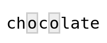

*stringr* functions are vectorized, so we can use them not just to match a single string but also to match a vector of strings:

<pre class='chroma'><code class='language-r' data-lang='r'>desserts &lt;- <a href='https://rdrr.io/r/base/c.html'>c</a>("plum pudding", "chocolate cake", "sticky toffee pudding")
str_view(desserts, "pudding")
</code></pre>

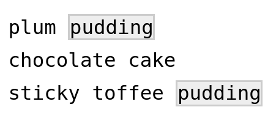

Note that the non-matching string "*chocolate cake*" was displayed despite the lack of a match. If we only want to see strings that matched, we can set the `match` argument to `TRUE`:

<pre class='chroma'><code class='language-r' data-lang='r'>str_view(desserts, "pudding", match = TRUE)
</code></pre>

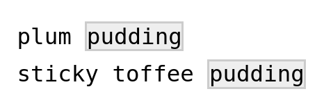

{} **Strings in R**

A "string" or "character string" is a contiguous sequence of characters. To indicate that something is a string in R, we put quotes around it: `"Hello"` and `"9"`. If you forget the quotes, R would interpret `"Hello"` as an *object* (because it starts with a letter) and `"9"` as a *number* (because it starts with a digit).

There is *no difference* between single quotes (`'Hello'`) and double quotes (`"Hello"`), but double quotes are generally recommended.

If your string is itself supposed to contain a quote symbol of some kind, it is convenient to use the *other type* of quote to define the string:

<pre class='chroma'><code class='language-r' data-lang='r'># The string contains a single quote, so we use double quotes to define it:
"This cake's 7th layer is particularly good."

#&gt; [1] "This cake's 7th layer is particularly good."
</code></pre>

Alternatively, a quote can be **escaped** using a backslash **`\`** to indicate that it does *not end the string* but represents a literal quote *inside the string*, which may be necessary if a string contains both single and double quotes:

<pre class='chroma'><code class='language-r' data-lang='r'>"This cake is only 2'4\" tall - do better!"

#&gt; [1] "This cake is only 2'4\" tall - do better!"
</code></pre>

{}

 

------------------------------------------------------------------------

## 4. Special characters

#### Special characters and escaping them

In regular expressions (regex), we need a way to succinctly convey descriptions such as "any character" or "any digit". *However, there are no characters exclusive to regular expressions:* *instead, we re-use normal characters.* For instance:

-   "**Any character**" is represented by a period, **`.`**
-   "**Any digit**" is represented by **`\d`**, with the **`\`** basically preventing the **`d`** from being interpreted literally.

But how, then, do we indicate a literal **`.`** or **`\`** in a regular expression? The solution is to **escape** the special character with a backslash: the regular expression **`\.`** matches a **`.`**.

{}

#### TLDR for the rest of this section

**When writing regular expressions as strings in R,** **we always need to add an extra backslash:**

-   The regex **`\d`** matches a digit --- and we write it as **`"\\d"`** in R.
-   The regex **`\.`** matches a period --- and we write it as **`"\\."`** in R.

{}

The "escaping" described above also applies to backslashes, such that the regex **`\\`** matches a **`\`**.

 

#### Escape sequences in regular strings

Outside of regular expressions, R also uses backslashes **`\`** to form so-called "escape sequences". This works similarly to how the regular expression **`\d`** means "any digit" -- for example, when we use **`\n`** *in any string*, it will be interpreted as a newline:

<pre class='chroma'><code class='language-r' data-lang='r'><a href='https://rdrr.io/r/base/cat.html'>cat</a>("cho\nco")

#&gt; cho
#&gt; co
</code></pre>

In fact, a single backslash **`\`** is **never taken literally** in any regular R string:

<pre class='chroma'><code class='language-r' data-lang='r'>cat("cho\dco")

#&gt; Error: '\d' is an unrecognized escape in character string starting ""cho\d"
</code></pre>

Because this is *not* a regular expression, and **`\d`** does not happen to be an escape sequence like **`\n`** was earlier, **`\d`** doesn't mean anything to R. But instead of assuming that the backslash is therefore a literal backslash, R throws an error, demonstrating that a backslash is always interpreted as the first character in an escape sequence.

How can we include a backslash in a string, then? Same as before: we "escape" it with another backslash:

<pre class='chroma'><code class='language-r' data-lang='r'><a href='https://rdrr.io/r/base/cat.html'>cat</a>("bla\\dbla")

#&gt; bla\dbla
</code></pre>

 

#### The backslash plague

We saw that the regular expression **`\d`** matches a digit, but also that using string **`"\d"`** will merely throw an error!

Therefore, to actually define a regular expression that contains **`\d`**, we need to use the string **`"\\d"`**:

<pre class='chroma'><code class='language-r' data-lang='r'>str_view("The cake has 8 layers", "\d")

#&gt; Error: '\d' is an unrecognized escape in character string starting ""\d"
</code></pre>

<pre class='chroma'><code class='language-r' data-lang='r'>str_view("The cake has 8 layers", "\\d")
</code></pre>

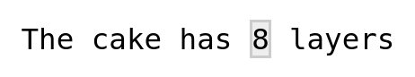

**So, to define any regular expression symbol that contains a backslash,** **we need to always use two backslashes!**

This also applies when we want to match a literal character. For example, **to match a literal period, we need the regex `\.`,** **which we have to write as `\\.` in an R string:**

<pre class='chroma'><code class='language-r' data-lang='r'>str_view("The cake has 8.5 layers", "\\.")
</code></pre>

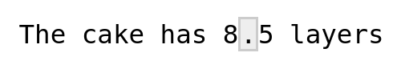

Now to the worst case: what if we want to match a backslash? We need the regular expression **`\\`**, but to define that regex as a string, we have to escape each of the two backslashes -- only to end up with four backslashes!

<pre class='chroma'><code class='language-r' data-lang='r'>str_view("C:\\Windows", "\\")

#&gt; Error in stri_locate_first_regex(string, pattern, opts_regex = opts(pattern)): Unrecognized backslash escape sequence in pattern. (U_REGEX_BAD_ESCAPE_SEQUENCE, context=`\`)
</code></pre>

<pre class='chroma'><code class='language-r' data-lang='r'>str_view("C:\\Windows", "\\\\")
</code></pre>

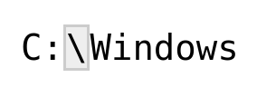

Welcome to the backslash plague! [^1]

 

------------------------------------------------------------------------

## 5. The Great British Bake Off

Let's take a look at some of the data in the *bakeoff* package, which is about "The Great British Bake Off" (GBBO) television show.

The `bakers` dataframe contains some information about each participant (baker) in the show, and we will be matching names from the `baker_full` column:

<pre class='chroma'><code class='language-r' data-lang='r'><a href='https://rdrr.io/r/utils/head.html'>head</a>(bakers)

#&gt; # A tibble: 6 x 8
#&gt;   series baker_full   baker    age occupation   hometown  baker_last baker_first
#&gt;   &lt;fct&gt;  &lt;chr&gt;        &lt;chr&gt;  &lt;dbl&gt; &lt;chr&gt;        &lt;chr&gt;     &lt;chr&gt;      &lt;chr&gt;      
#&gt; 1 1      "Annetha Mi… Annet…    30 Midwife      Essex     Mills      Annetha    
#&gt; 2 1      "David Cham… David     31 Entrepreneur Milton K… Chambers   David      
#&gt; 3 1      "Edward \"E… Edd       24 Debt collec… Bradford  Kimber     Edward     
#&gt; 4 1      "Jasminder … Jasmi…    45 Assistant C… Birmingh… Randhawa   Jasminder  
#&gt; 5 1      "Jonathan S… Jonat…    25 Research An… St Albans Shepherd   Jonathan   
#&gt; 6 1      "Lea Harris" Lea       51 Retired      Midlothi… Harris     Lea
</code></pre>

The `challenge_results` dataframe contains "signature" and "showstopper" bakes made by each participant in each episode:

<pre class='chroma'><code class='language-r' data-lang='r'><a href='https://rdrr.io/r/utils/head.html'>head</a>(challenge_results)

#&gt; # A tibble: 6 x 7
#&gt;   series episode baker  result signature        technical showstopper           
#&gt;    &lt;int&gt;   &lt;int&gt; &lt;chr&gt;  &lt;chr&gt;  &lt;chr&gt;                &lt;int&gt; &lt;chr&gt;                 
#&gt; 1      1       1 Annet… IN     Light Jamaican …         2 Red, White &amp; Blue Cho…
#&gt; 2      1       1 David  IN     Chocolate Orang…         3 Black Forest Floor Ga…
#&gt; 3      1       1 Edd    IN     Caramel Cinnamo…         1 NA                    
#&gt; 4      1       1 Jasmi… IN     Fresh Mango and…        NA NA                    
#&gt; 5      1       1 Jonat… IN     Carrot Cake wit…         9 Three Tiered White an…
#&gt; 6      1       1 Louise IN     Carrot and Oran…        NA Never Fail Chocolate …
</code></pre>

The "signature" bakes are the first bakes presented in each GBBO episode, so we'll start trying to match these bakes with regular expressions. Let's save them in a vector for easy access later on:

<pre class='chroma'><code class='language-r' data-lang='r'>signatures &lt;- challenge_results$signature     # Assign the column to a vector
signatures &lt;- signatures[!<a href='https://rdrr.io/r/base/NA.html'>is.na</a>(signatures)]  # Remove NAs

signatures[1:20]                              # Look at the first 20 items

#&gt;  [1] "Light Jamaican Black Cakewith Strawberries and Cream"                       
#&gt;  [2] "Chocolate Orange Cake"                                                      
#&gt;  [3] "Caramel Cinnamon and Banana Cake"                                           
#&gt;  [4] "Fresh Mango and Passion Fruit Hummingbird Cake"                             
#&gt;  [5] "Carrot Cake with Lime and Cream Cheese Icing"                               
#&gt;  [6] "Carrot and Orange Cake"                                                     
#&gt;  [7] "Triple Layered Brownie Meringue Cake\nwith Raspberry Cream"                 
#&gt;  [8] "Three Tiered Lemon Drizzle Cakewith Fresh Cream and freshly made Lemon Curd"
#&gt;  [9] "Cranberry and Pistachio Cakewith Orange Flower Water Icing"                 
#&gt; [10] "Sticky Marmalade Tea Loaf"                                                  
#&gt; [11] "Cheddar Cheese and Fresh Rosemary Biscuits"                                 
#&gt; [12] "Oatmeal Raisin Cookie"                                                      
#&gt; [13] "Millionaires' Shortbread"                                                   
#&gt; [14] "Honey and Candied Ginger Cookies"                                           
#&gt; [15] "Fresh Vanilla Biscuits with Royal Icing"                                    
#&gt; [16] "Peanut Shortbread withSalted Peanut Caramel"                                
#&gt; [17] "Rose Petal Shortbread"                                                      
#&gt; [18] "Stained Glass Window Shortbread"                                            
#&gt; [19] "Chilli Bread"                                                               
#&gt; [20] "Olive Bread"
</code></pre>

 

------------------------------------------------------------------------

## 6. Components of regular expressions

### Literal characters

Literal characters can be a part of regular expressions. In fact, as we saw in the first example, our entire search pattern for `str_view()` can perfectly well consist of *only* literal characters.

But the power of regular expressions comes with special characters, and below, we'll go through several different categories of these.

### Metacharacters

Above, we already learned that **`.`** matches any single character. Other metacharacters, that is, characters that represent a single instance of **a character type**, are actually character combinations starting with a **`\`**.

| Symbol   | Matches                                                | Negation ("anything but") |
|----------|--------------------------------------------------------|---------------------------|
| **`.`**  | Any single character.                                  |                           |
| **`\d`** | Any digit.                                             | **`\D`**                  |
| **`\s`** | Any white space: space, tab, newline, carriage return. | **`\S`**                  |
| **`\w`** | Any word character: alphanumeric and underscore.       | **`\W`**                  |
| **`\n`** | A newline.                                             |                           |
| **`\t`** | A tab.                                                 |                           |

Negated metacharacters match anything except that character type: **`\D`** matches anything except a digit.

*Some examples:*

-   Are there any digits (**`\d`**) in the bake names?

    

    <pre class='chroma'><code class='language-r' data-lang='r'>str_view_all(signatures, "\\d", match = TRUE)
    </code></pre>

    

    

    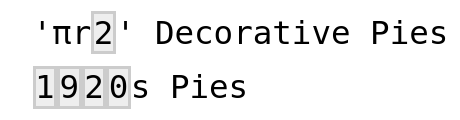

    

 

-   What about periods? Note that we need to escape the period with two **`\\`**.

    

    <pre class='chroma'><code class='language-r' data-lang='r'>str_view_all(signatures, "\\.", match = TRUE)
    </code></pre>

    

    

    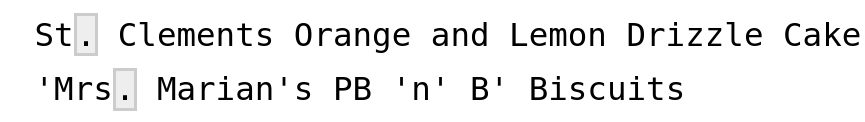

    

 

-   Let's match 5-character strings that start with "*Ma*":

    

    <pre class='chroma'><code class='language-r' data-lang='r'>str_view_all(signatures, "Ma...", match = TRUE)
    </code></pre>

    

    

    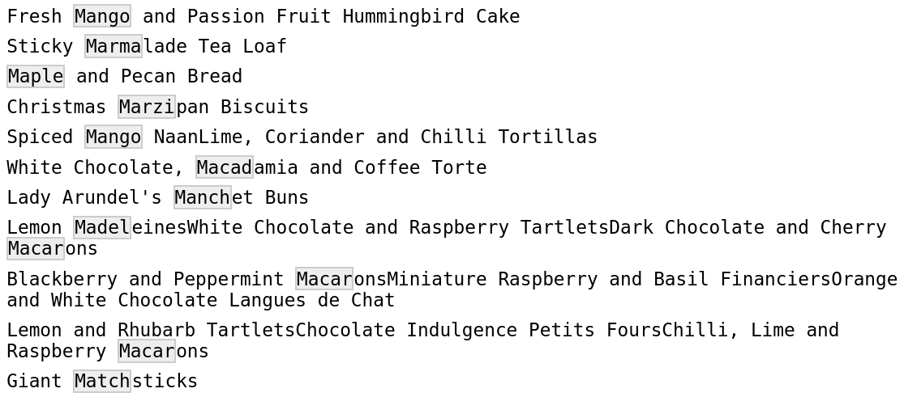

    

    Note that the only constraint we are setting with **`...`** is that at least three characters should follow **`Ma`** -- we are *not* restricting matches to five-character words, or something along those lines.

 

-   Let's find the bakers whose (first or last) names contain at least 11 word characters **`\w`**:

    

    <pre class='chroma'><code class='language-r' data-lang='r'>str_view_all(bakers$baker_full, "\\w\\w\\w\\w\\w\\w\\w\\w\\w\\w\\w", match = TRUE)
    </code></pre>

    

    

    

    

    It's not very convenient to have to repeat `\\w` so many times!

Or let's say we wanted to get all three-part names: names that contain three sets of one or more word characters separated by non-word characters. How could we describe such a pattern? "Quantifiers" to the rescue!

### Quantifiers

Quantifiers describe how many consecutive instances of the **preceding** character should be matched:

| Quantifier  | Matches                                                   |
|-------------|-----------------------------------------------------------|
| **[`*`](https://rdrr.io/r/base/Arithmetic.html)**     | Preceding character *any number of times* (0 or more).    |
| **[`+`](https://rdrr.io/r/base/Arithmetic.html)**     | Preceding character *at least* once (1 or more).          |
| **[`?`](https://rdrr.io/r/utils/Question.html)**     | Preceding character *at most* once (0 or 1).              |
| **`{n}`**   | Preceding character *exactly `n` times*.                  |
| **`{n,}`**  | Preceding character *at least `n` times*.                 |
| **`{n,m}`** | Preceding character *at least `n` and at most `m` times*. |

*Some examples:*

-   Names with at least 11 (**`{11,}`**) characters -- note that this matches the entire word:

    

    <pre class='chroma'><code class='language-r' data-lang='r'>str_view(bakers$baker_full, "\\w&#123;11,&#125;", match=TRUE)
    </code></pre>

    

    

    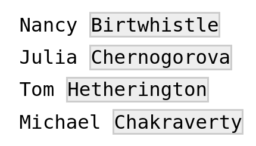

    

 

-   Match the entire string (full names -- by flanking the pattern with **`.*`**) of names with 2 to 3 (**`{2,3}`**) consecutive "*e*" characters:

    

    <pre class='chroma'><code class='language-r' data-lang='r'>str_view(bakers$baker_full, ".*e&#123;2,3&#125;.*", match=TRUE)
    </code></pre>

    

    

    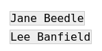

    

 

-   Account for different spelling options with **[`?`](https://rdrr.io/r/utils/Question.html)** -- match "*flavor*" or "*flavour*":

    

    <pre class='chroma'><code class='language-r' data-lang='r'>str_view_all(signatures, "flavou?r", match=TRUE)
    </code></pre>

    

    

    

    

 

-   Match all three-part names -- one or more word characters (**`\w+`**) separated by a non-word character (**`\W`**) at least two consecutive times:

    

    <pre class='chroma'><code class='language-r' data-lang='r'>str_view(bakers$baker_full, "\\w+\\W\\w+\\W\\w+", match=TRUE)
    </code></pre>

    

    

    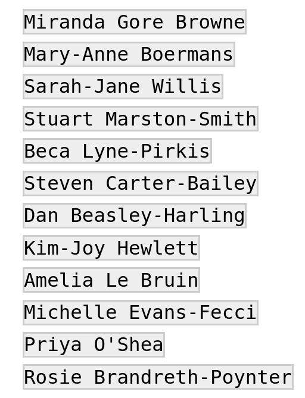

    

 

-   Match all three-letter names by looking for non-word characters (**`\W`**) surrounding three word characters (**`\w{3}`**)?

    

    <pre class='chroma'><code class='language-r' data-lang='r'>str_view_all(bakers$baker_full, "\\W\\w&#123;3&#125;\\W", match = TRUE)
    </code></pre>

    

    

    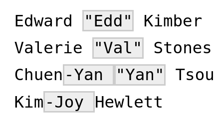

    

That last attempt didn't really work -- note that we only got three-letter *middle names*, since we required our three-letter names to be flanked by non-word characters.

To get *all* three-letter names, we need to be able to "anchor" our regular expressions, e.g. demand that a pattern starts at the beginning of the string.

### Anchors

| Anchor | Matches                      |
|--------|------------------------------|
| [`^`](https://rdrr.io/r/base/Arithmetic.html)    | Beginning of the string/line |
| [`$`](https://rdrr.io/r/base/Extract.html)    | End of the string/line       |
| `\b`   | A word *boundary*            |

*Some examples:*

-   Match all three-letter *first* names, by anchoring the three word characters (**`\w{3}`**) to the beginning of the string with **[`^`](https://rdrr.io/r/base/Arithmetic.html)**, and including a space at the end:

    

    <pre class='chroma'><code class='language-r' data-lang='r'>str_view(bakers$baker_full, "^\\w&#123;3&#125; ", match = TRUE)
    </code></pre>

    

    

    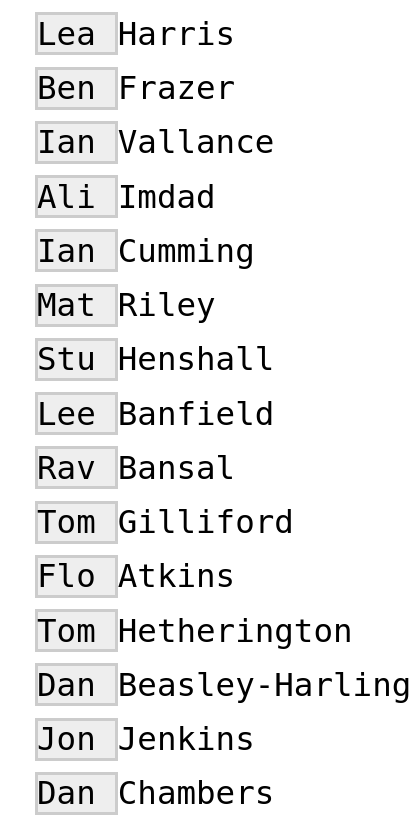

    

-   Match all three-letter names --first or last-- by matching three word-characters (**`\w`**) surrounded by word-boundaries (**`\b`**):

    

    <pre class='chroma'><code class='language-r' data-lang='r'>str_view_all(bakers$baker_full, "\\b\\w&#123;3&#125;\\b", match = TRUE)
    </code></pre>

    

    

    

    

#### Regex components for next week

Next week, we'll talk about:

-   Character classes
-   Alternation
-   Grouping
-   Backreferences
-   Making quantifiers non-greedy

 

{} **Regular expressions vs globbing**

Do not confuse regular expressions with *globbing*!

If you have worked in a terminal before, you may know that you can match file names using *shell wildcards*, which is known as "globbing".

There are only a few characters used in shell wildcards, but their meanings differ from regular expressions in two instances!

| Shell wildcard         | Equivalent regex | Meaning                                 |
|------------------------|------------------|-----------------------------------------|
| **[`?`](https://rdrr.io/r/utils/Question.html)**                | **`.`**          | Any single character                    |
| **[`*`](https://rdrr.io/r/base/Arithmetic.html)**                | **`.*`**         | Any number of any character             |
| **`[]`** and **`[^]`** | same!            | Match/negate match of *character class* |

-   Note also that **`.`** is interpreted as a literal period in globbing.
-   We will talk about "character classes" next week.

{}

 

------------------------------------------------------------------------

## 7. Breakout rooms

### Exercise 1

Find all participant names in `bakers$baker_full` that contain at least 4 lowercase "*e*" characters. (That, the "*e*"s don't need to be consecutive, but you should not disallow consecutive "*e*"s either.)

Hints

Use `.*` to allow for *optional* characters in between the "e"s.

Solution

<pre class='chroma'><code class='language-r' data-lang='r'>str_view(bakers$baker_full, "e.*e.*e.*e", match = TRUE)
</code></pre>

### Exercise 2

In the `signatures` vector, match words of exactly five characters that start with "*Ta*".

Hints

-   To describe the five-letter word you should include three word characters after "*Ta*".

-   To exclusively match five-letter words, you should use the "word boundary" anchor before and after the part that should match the word.

Solution

<pre class='chroma'><code class='language-r' data-lang='r'>str_view_all(signatures, "\\bTa\\w&#123;3&#125;\\b", match = TRUE)
</code></pre>

### Exercise 3

Match "*Donut*" as well as "*Doughnut*" in the `signatures` vector.

Unfortunately, `signatures` only contains the spelling "Doughnut". Therefore, you should separately test whether your regex would actually match "Donut".

Hints

Since "*donut*" is contained within "*doughnut*", you can build a single regex and use **[`?`](https://rdrr.io/r/utils/Question.html)** to indicate optional characters.

Solution

<pre class='chroma'><code class='language-r' data-lang='r'>str_view_all(signatures, "Dou?g?h?nut", match=TRUE)
</code></pre>

<pre class='chroma'><code class='language-r' data-lang='r'>str_view_all(<a href='https://rdrr.io/r/base/c.html'>c</a>(signatures, "Donut"), "Dou?g?h?nut", match=TRUE)
</code></pre>

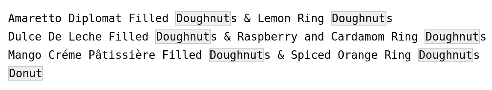

### Exercise 4

Match both dates in the string: "*The best cakes were baked between 2016-03-10 and 2017-08-31.*".

Hints

Make sure you use `str_view_all()` and not `str_view()`!

Solution

<pre class='chroma'><code class='language-r' data-lang='r'>mystring &lt;- "The best cakes were baked between 2016-03-10 and 2017-08-31."

str_view_all(mystring, "\\d&#123;4&#125;-\\d&#123;2&#125;-\\d&#123;2&#125;")
</code></pre>

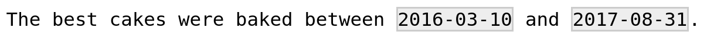

### Bonus exercise

You can use the [`list.files()`](https://rdrr.io/r/base/list.files.html) function in R to list files on your computer. [`list.files()`](https://rdrr.io/r/base/list.files.html) takes an argument `pattern` to which you can specify a regular expression in order to narrow down the results.

For example, the code below would find all files with "*codeclub*" in the name, from your current working directory (the default for the `path` argument) and downwards (due to `recursive = TRUE`):

<pre class='chroma'><code class='language-r' data-lang='r'><a href='https://rdrr.io/r/base/list.files.html'>list.files</a>(pattern = "codeclub", recursive = TRUE)
</code></pre>

You can also specify a path -- for instance, the code below would search your home or (on Windows) Documents directory and nothing below it:

<pre class='chroma'><code class='language-r' data-lang='r'><a href='https://rdrr.io/r/base/list.files.html'>list.files</a>(path = "~", pattern = "codeclub") # "~" is your home dir
<a href='https://rdrr.io/r/base/list.files.html'>list.files</a>(path = "C:/Users/myname/Documents", pattern = "codeclub")
</code></pre>

**Use this function to list only R scripts, i.e. files *ending in* `.R`,** **in a directory of your choice.**

Hints

Make sure to use the "end of string" anchor.

Solution

Here we are searching the the home dir and everything below it -- could take a while, but then you know how many R scripts you actually have!

<pre class='chroma'><code class='language-r' data-lang='r'><a href='https://rdrr.io/r/base/list.files.html'>list.files</a>(path = "~", pattern = "\\.R$", recursive = TRUE)
</code></pre>

 

------------------------------------------------------------------------

## 8. Further resources

-   [The chapter on strings](https://r4ds.had.co.nz/strings.html#strings) in Hadley Wickham's R for Data Science (freely abailable online!).

-   [RStudio regex cheatsheet](https://www.rstudio.com/wp-content/uploads/2016/09/RegExCheatsheet.pdf).

-   [A course video by Roger Peng introducing regular expressions](https://www.youtube.com/watch?v=NvHjYOilOf8).

-   [RegExplain](https://www.garrickadenbuie.com/project/regexplain), an RStudio add-in to visualize regex matches and help build regular expressions.

[^1]: Since R 4.0, which was released last year, there is also a "raw string" or "raw character constant" construct, which circumvents some of these problems -- see [this blogpost](https://mpopov.com/blog/2020/05/22/strings-in-r-4.x/) that summarizes this new syntax. Because many are not yet using R 4.x, and most current examples, vignettes, and tutorials on the internet don't use this, we will stick to being stuck with all the backslashes for now.

