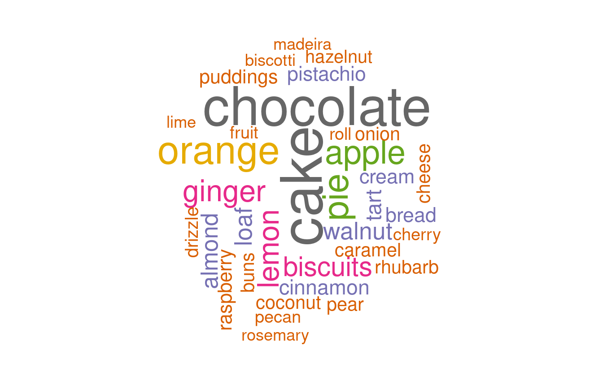

<br> <br> <br>

------------------------------------------------------------------------

## New To Code Club?

-   First, check out the [Code Club Computer Setup](/codeclub-setup/) instructions, which also has some pointers that might be helpful if you're new to R or RStudio.

-   Please open RStudio before Code Club to test things out -- if you run into issues, join the Zoom call early and we'll troubleshoot.

------------------------------------------------------------------------

## Session Goals

-   Learn the fundamentals of **text mining**.
-   Learn how to do text mining in a tidyverse setting.
-   Reuse some of our dplyr and ggplot skills on text.
-   Learn how to very simply create word cloud visualizations.

------------------------------------------------------------------------

## Setup

This is another in our current series on text processing. We'll be using the following previously used packages which you should load first (install them if you haven't already):

<div class="highlight">

<pre class='chroma'><code class='language-r' data-lang='r'><span class='kr'><a href='https://rdrr.io/r/base/library.html'>library</a></span><span class='o'>(</span><span class='nv'><a href='http://tidyverse.tidyverse.org'>tidyverse</a></span><span class='o'>)</span>
<span class='kr'><a href='https://rdrr.io/r/base/library.html'>library</a></span><span class='o'>(</span><span class='nv'><a href='https://bakeoff.netlify.com'>bakeoff</a></span><span class='o'>)</span>
</code></pre>

</div>

We'll also be using the following packages, which you should install and load:

<div class="highlight">

<pre class='chroma'><code class='language-r' data-lang='r'><span class='c'># Uncomment the following line to install:</span>
<span class='c'># install.packages(c("tidytext", "gutenbergr", "wordcloud"))</span>
                 
<span class='kr'><a href='https://rdrr.io/r/base/library.html'>library</a></span><span class='o'>(</span><span class='nv'><a href='https://github.com/juliasilge/tidytext'>tidytext</a></span><span class='o'>)</span>
<span class='kr'><a href='https://rdrr.io/r/base/library.html'>library</a></span><span class='o'>(</span><span class='nv'><a href='https://docs.ropensci.org/gutenbergr/'>gutenbergr</a></span><span class='o'>)</span>
<span class='kr'><a href='https://rdrr.io/r/base/library.html'>library</a></span><span class='o'>(</span><span class='nv'><a href='http://blog.fellstat.com/?cat=11'>wordcloud</a></span><span class='o'>)</span>
</code></pre>

</div>

## Introduction

In this CodeClub session we'll see how to create word clouds (also known as tag clouds) from text, using the **tidytext** and **wordcloud** packages. A word cloud is a visualization of word frequencies, graphically highlighting the most common words.

We need to get some text from somewhere, so first let's do it in the simplest possible way. Here we manually enter a quote, line by line, as a vector of five character strings. This is the first stanza from Robert Lowell's [Skunk Hour](https://www.poetryfoundation.org/poems/47694/skunk-hour):

<div class="highlight">

<pre class='chroma'><code class='language-r' data-lang='r'><span class='nv'>lowell</span> <span class='o'>&lt;-</span> <span class='nf'><a href='https://rdrr.io/r/base/c.html'>c</a></span><span class='o'>(</span><span class='s'>"Nautilus Island's hermit"</span>,
          <span class='s'>"heiress still lives through winter in her Spartan cottage;"</span>,
          <span class='s'>"her sheep still graze above the sea."</span>,
          <span class='s'>"Her son's a bishop. Her farmer is first selectman in our village;"</span>,
          <span class='s'>"she's in her dotage."</span><span class='o'>)</span>
</code></pre>

</div>

In textual analysis we distinguish between word **types**, and word **tokens** (multiple instances of those words in text). For example there are two tokens of the word-type "still" in this stanza:

> heiress `still` lives through winter  
> her sheep `still` graze above the sea

And slightly more abstractly there are four tokens of "her", modulo capitalization:

> `her` Spartan cottage  
> `her` sheep still graze  
> `Her` son's a bishop.  
> `Her` farmer

Formally, it's the *token frequency* of the *word types* we are ultimately interested in capturing. So: two tasks, extract the word tokens, and count them! Done!

The reason this is tricky is that natural language text is messy: the task of extracting a clean set of tokens to count is termed **text mining** or **tokenization**. We would also like to get the output into a tidyverse compliant data frame, so we can use familiar **dplyr** and **ggplot** functions to analyze it.

We could imagine attacking this using **stingr** functions:

<div class="highlight">

<pre class='chroma'><code class='language-r' data-lang='r'><span class='nv'>lowell_tokens</span> <span class='o'>&lt;-</span> <span class='nv'>lowell</span> <span class='o'>%&gt;%</span> 
  <span class='c'># convert upper to lower case; returns a character vector.</span>
  <span class='nf'>str_to_lower</span><span class='o'>(</span><span class='o'>)</span> <span class='o'>%&gt;%</span>
  <span class='c'># remove punctuation with a character class; returns a list.</span>
  <span class='nf'>str_extract_all</span><span class='o'>(</span><span class='s'>"[a-z]+"</span><span class='o'>)</span> <span class='o'>%&gt;%</span> 
  <span class='c'># flatten that list</span>
  <span class='nf'><a href='https://rdrr.io/r/base/unlist.html'>unlist</a></span><span class='o'>(</span><span class='o'>)</span> <span class='o'>%&gt;%</span>
  <span class='c'># stick it in a data frame</span>
  <span class='nf'>as_tibble</span><span class='o'>(</span><span class='o'>)</span>                      

<span class='nf'><a href='https://rdrr.io/r/base/print.html'>print</a></span><span class='o'>(</span><span class='nv'>lowell_tokens</span>, n <span class='o'>=</span> <span class='m'>38</span><span class='o'>)</span>

<span class='c'>#&gt; <span style='color: #555555;'># A tibble: 38 x 1</span></span>
<span class='c'>#&gt;    value    </span>
<span class='c'>#&gt;    <span style='color: #555555;font-style: italic;'>&lt;chr&gt;</span><span>    </span></span>
<span class='c'>#&gt; <span style='color: #555555;'> 1</span><span> nautilus </span></span>
<span class='c'>#&gt; <span style='color: #555555;'> 2</span><span> island   </span></span>
<span class='c'>#&gt; <span style='color: #555555;'> 3</span><span> s        </span></span>
<span class='c'>#&gt; <span style='color: #555555;'> 4</span><span> hermit   </span></span>
<span class='c'>#&gt; <span style='color: #555555;'> 5</span><span> heiress  </span></span>
<span class='c'>#&gt; <span style='color: #555555;'> 6</span><span> still    </span></span>
<span class='c'>#&gt; <span style='color: #555555;'> 7</span><span> lives    </span></span>
<span class='c'>#&gt; <span style='color: #555555;'> 8</span><span> through  </span></span>
<span class='c'>#&gt; <span style='color: #555555;'> 9</span><span> winter   </span></span>
<span class='c'>#&gt; <span style='color: #555555;'>10</span><span> in       </span></span>
<span class='c'>#&gt; <span style='color: #555555;'>11</span><span> her      </span></span>
<span class='c'>#&gt; <span style='color: #555555;'>12</span><span> spartan  </span></span>
<span class='c'>#&gt; <span style='color: #555555;'>13</span><span> cottage  </span></span>
<span class='c'>#&gt; <span style='color: #555555;'>14</span><span> her      </span></span>
<span class='c'>#&gt; <span style='color: #555555;'>15</span><span> sheep    </span></span>
<span class='c'>#&gt; <span style='color: #555555;'>16</span><span> still    </span></span>
<span class='c'>#&gt; <span style='color: #555555;'>17</span><span> graze    </span></span>
<span class='c'>#&gt; <span style='color: #555555;'>18</span><span> above    </span></span>
<span class='c'>#&gt; <span style='color: #555555;'>19</span><span> the      </span></span>
<span class='c'>#&gt; <span style='color: #555555;'>20</span><span> sea      </span></span>
<span class='c'>#&gt; <span style='color: #555555;'>21</span><span> her      </span></span>
<span class='c'>#&gt; <span style='color: #555555;'>22</span><span> son      </span></span>
<span class='c'>#&gt; <span style='color: #555555;'>23</span><span> s        </span></span>
<span class='c'>#&gt; <span style='color: #555555;'>24</span><span> a        </span></span>
<span class='c'>#&gt; <span style='color: #555555;'>25</span><span> bishop   </span></span>
<span class='c'>#&gt; <span style='color: #555555;'>26</span><span> her      </span></span>
<span class='c'>#&gt; <span style='color: #555555;'>27</span><span> farmer   </span></span>
<span class='c'>#&gt; <span style='color: #555555;'>28</span><span> is       </span></span>
<span class='c'>#&gt; <span style='color: #555555;'>29</span><span> first    </span></span>
<span class='c'>#&gt; <span style='color: #555555;'>30</span><span> selectman</span></span>
<span class='c'>#&gt; <span style='color: #555555;'>31</span><span> in       </span></span>
<span class='c'>#&gt; <span style='color: #555555;'>32</span><span> our      </span></span>
<span class='c'>#&gt; <span style='color: #555555;'>33</span><span> village  </span></span>
<span class='c'>#&gt; <span style='color: #555555;'>34</span><span> she      </span></span>
<span class='c'>#&gt; <span style='color: #555555;'>35</span><span> s        </span></span>
<span class='c'>#&gt; <span style='color: #555555;'>36</span><span> in       </span></span>
<span class='c'>#&gt; <span style='color: #555555;'>37</span><span> her      </span></span>
<span class='c'>#&gt; <span style='color: #555555;'>38</span><span> dotage</span></span>
</code></pre>

</div>

This is a good start: it gets rid of the capitalization issue, and also gets rid of the punctuation. But there's a problem. The regular expression pattern `[a-z]+` doesn't recognize *possessives* or *contractions*: it just strips anything that's not a letter, so it messes up with `Island's`, `son's`, and `she's`: welcome to the subtleties of processing natural language text algorithmically! Exceptions, exceptions!!

We could fiddle about with our regex, but... *there's a package for that!* This kind of text mining is exactly what the [tidytext](https://www.tidytextmining.com) package was built for. It will simultaneously strip punctuation intelligently and 'unnest' lines into word tokens.

Tidytext functions need a dataframe to operate on. So first we need to get the poem into a data frame; here we'll use the column name `text`.

<div class="highlight">

<pre class='chroma'><code class='language-r' data-lang='r'><span class='nv'>lowell_df</span> <span class='o'>&lt;-</span> <span class='nf'>tibble</span><span class='o'>(</span>text <span class='o'>=</span> <span class='nv'>lowell</span><span class='o'>)</span>

<span class='nv'>lowell_df</span>

<span class='c'>#&gt; <span style='color: #555555;'># A tibble: 5 x 1</span></span>
<span class='c'>#&gt;   text                                                             </span>
<span class='c'>#&gt;   <span style='color: #555555;font-style: italic;'>&lt;chr&gt;</span><span>                                                            </span></span>
<span class='c'>#&gt; <span style='color: #555555;'>1</span><span> Nautilus Island's hermit                                         </span></span>
<span class='c'>#&gt; <span style='color: #555555;'>2</span><span> heiress still lives through winter in her Spartan cottage;       </span></span>
<span class='c'>#&gt; <span style='color: #555555;'>3</span><span> her sheep still graze above the sea.                             </span></span>
<span class='c'>#&gt; <span style='color: #555555;'>4</span><span> Her son's a bishop. Her farmer is first selectman in our village;</span></span>
<span class='c'>#&gt; <span style='color: #555555;'>5</span><span> she's in her dotage.</span></span>
</code></pre>

</div>

Each string in the character vector becomes a single row in the data frame.

Again we want one word-token per row, to 'tidy' our data. This is what [`tidytext::unnest_tokens()`](https://rdrr.io/pkg/tidytext/man/unnest_tokens.html) does. We're going to unnest words in this case (we can unnest other things, like characters, sentences, regexes, even tweets) and we need to specify the variable in the dataframe we are unnesting (in this case just `text`). This will create a new word-token data frame, and we'll name the variable in the data frame `word`. This is important (see later on stop words).

<div class="highlight">

<pre class='chroma'><code class='language-r' data-lang='r'><span class='nv'>lowell_tidy</span> <span class='o'>&lt;-</span> <span class='nv'>lowell_df</span> <span class='o'>%&gt;%</span>
    <span class='nf'><a href='https://rdrr.io/pkg/tidytext/man/unnest_tokens.html'>unnest_tokens</a></span><span class='o'>(</span><span class='nv'>word</span>, <span class='nv'>text</span><span class='o'>)</span>

<span class='nf'><a href='https://rdrr.io/r/base/print.html'>print</a></span><span class='o'>(</span><span class='nv'>lowell_tidy</span>, n <span class='o'>=</span> <span class='m'>35</span><span class='o'>)</span>

<span class='c'>#&gt; <span style='color: #555555;'># A tibble: 35 x 1</span></span>
<span class='c'>#&gt;    word     </span>
<span class='c'>#&gt;    <span style='color: #555555;font-style: italic;'>&lt;chr&gt;</span><span>    </span></span>
<span class='c'>#&gt; <span style='color: #555555;'> 1</span><span> nautilus </span></span>
<span class='c'>#&gt; <span style='color: #555555;'> 2</span><span> island's </span></span>
<span class='c'>#&gt; <span style='color: #555555;'> 3</span><span> hermit   </span></span>
<span class='c'>#&gt; <span style='color: #555555;'> 4</span><span> heiress  </span></span>
<span class='c'>#&gt; <span style='color: #555555;'> 5</span><span> still    </span></span>
<span class='c'>#&gt; <span style='color: #555555;'> 6</span><span> lives    </span></span>
<span class='c'>#&gt; <span style='color: #555555;'> 7</span><span> through  </span></span>
<span class='c'>#&gt; <span style='color: #555555;'> 8</span><span> winter   </span></span>
<span class='c'>#&gt; <span style='color: #555555;'> 9</span><span> in       </span></span>
<span class='c'>#&gt; <span style='color: #555555;'>10</span><span> her      </span></span>
<span class='c'>#&gt; <span style='color: #555555;'>11</span><span> spartan  </span></span>
<span class='c'>#&gt; <span style='color: #555555;'>12</span><span> cottage  </span></span>
<span class='c'>#&gt; <span style='color: #555555;'>13</span><span> her      </span></span>
<span class='c'>#&gt; <span style='color: #555555;'>14</span><span> sheep    </span></span>
<span class='c'>#&gt; <span style='color: #555555;'>15</span><span> still    </span></span>
<span class='c'>#&gt; <span style='color: #555555;'>16</span><span> graze    </span></span>
<span class='c'>#&gt; <span style='color: #555555;'>17</span><span> above    </span></span>
<span class='c'>#&gt; <span style='color: #555555;'>18</span><span> the      </span></span>
<span class='c'>#&gt; <span style='color: #555555;'>19</span><span> sea      </span></span>
<span class='c'>#&gt; <span style='color: #555555;'>20</span><span> her      </span></span>
<span class='c'>#&gt; <span style='color: #555555;'>21</span><span> son's    </span></span>
<span class='c'>#&gt; <span style='color: #555555;'>22</span><span> a        </span></span>
<span class='c'>#&gt; <span style='color: #555555;'>23</span><span> bishop   </span></span>
<span class='c'>#&gt; <span style='color: #555555;'>24</span><span> her      </span></span>
<span class='c'>#&gt; <span style='color: #555555;'>25</span><span> farmer   </span></span>
<span class='c'>#&gt; <span style='color: #555555;'>26</span><span> is       </span></span>
<span class='c'>#&gt; <span style='color: #555555;'>27</span><span> first    </span></span>
<span class='c'>#&gt; <span style='color: #555555;'>28</span><span> selectman</span></span>
<span class='c'>#&gt; <span style='color: #555555;'>29</span><span> in       </span></span>
<span class='c'>#&gt; <span style='color: #555555;'>30</span><span> our      </span></span>
<span class='c'>#&gt; <span style='color: #555555;'>31</span><span> village  </span></span>
<span class='c'>#&gt; <span style='color: #555555;'>32</span><span> she's    </span></span>
<span class='c'>#&gt; <span style='color: #555555;'>33</span><span> in       </span></span>
<span class='c'>#&gt; <span style='color: #555555;'>34</span><span> her      </span></span>
<span class='c'>#&gt; <span style='color: #555555;'>35</span><span> dotage</span></span>
</code></pre>

</div>

Punctuation has been stripped and all words are lower case, but possessives and contractions are preserved (fancy usage of `str_` regular expression functions under the hood...).

## Bakeoff!

Now that we have the basic idea, let's look at a more interesting data set, from the `bakeoff` package.

First we'll create a data frame with just the `signature` column from the `bakes` data set:

<div class="highlight">

<pre class='chroma'><code class='language-r' data-lang='r'><span class='nv'>signature_df</span> <span class='o'>&lt;-</span> <span class='nf'>select</span><span class='o'>(</span><span class='nv'>bakes</span>, <span class='nv'>signature</span><span class='o'>)</span>

<span class='nv'>signature_df</span>

<span class='c'>#&gt; <span style='color: #555555;'># A tibble: 548 x 1</span></span>
<span class='c'>#&gt;    signature                                                                    </span>
<span class='c'>#&gt;    <span style='color: #555555;font-style: italic;'>&lt;chr&gt;</span><span>                                                                        </span></span>
<span class='c'>#&gt; <span style='color: #555555;'> 1</span><span> </span><span style='color: #555555;'>"</span><span>Light Jamaican Black Cakewith Strawberries and Cream</span><span style='color: #555555;'>"</span><span>                       </span></span>
<span class='c'>#&gt; <span style='color: #555555;'> 2</span><span> </span><span style='color: #555555;'>"</span><span>Chocolate Orange Cake</span><span style='color: #555555;'>"</span><span>                                                      </span></span>
<span class='c'>#&gt; <span style='color: #555555;'> 3</span><span> </span><span style='color: #555555;'>"</span><span>Caramel Cinnamon and Banana Cake</span><span style='color: #555555;'>"</span><span>                                           </span></span>
<span class='c'>#&gt; <span style='color: #555555;'> 4</span><span> </span><span style='color: #555555;'>"</span><span>Fresh Mango and Passion Fruit Hummingbird Cake</span><span style='color: #555555;'>"</span><span>                             </span></span>
<span class='c'>#&gt; <span style='color: #555555;'> 5</span><span> </span><span style='color: #555555;'>"</span><span>Carrot Cake with Lime and Cream Cheese Icing</span><span style='color: #555555;'>"</span><span>                               </span></span>
<span class='c'>#&gt; <span style='color: #555555;'> 6</span><span> </span><span style='color: #555555;'>"</span><span>Cranberry and Pistachio Cakewith Orange Flower Water Icing</span><span style='color: #555555;'>"</span><span>                 </span></span>
<span class='c'>#&gt; <span style='color: #555555;'> 7</span><span> </span><span style='color: #555555;'>"</span><span>Carrot and Orange Cake</span><span style='color: #555555;'>"</span><span>                                                     </span></span>
<span class='c'>#&gt; <span style='color: #555555;'> 8</span><span> </span><span style='color: #555555;'>"</span><span>Sticky Marmalade Tea Loaf</span><span style='color: #555555;'>"</span><span>                                                  </span></span>
<span class='c'>#&gt; <span style='color: #555555;'> 9</span><span> </span><span style='color: #555555;'>"</span><span>Triple Layered Brownie Meringue Cake\nwith Raspberry Cream</span><span style='color: #555555;'>"</span><span>                 </span></span>
<span class='c'>#&gt; <span style='color: #555555;'>10</span><span> </span><span style='color: #555555;'>"</span><span>Three Tiered Lemon Drizzle Cakewith Fresh Cream and freshly made Lemon Curd</span><span style='color: #555555;'>"</span></span>
<span class='c'>#&gt; <span style='color: #555555;'># … with 538 more rows</span></span>
</code></pre>

</div>

Next we tokenize by word on the signature column:

<div class="highlight">

<pre class='chroma'><code class='language-r' data-lang='r'><span class='nv'>signature_tidy</span> <span class='o'>&lt;-</span> <span class='nv'>signature_df</span> <span class='o'>%&gt;%</span>
    <span class='nf'><a href='https://rdrr.io/pkg/tidytext/man/unnest_tokens.html'>unnest_tokens</a></span><span class='o'>(</span><span class='nv'>word</span>, <span class='nv'>signature</span><span class='o'>)</span>

<span class='nv'>signature_tidy</span>

<span class='c'>#&gt; <span style='color: #555555;'># A tibble: 2,762 x 1</span></span>
<span class='c'>#&gt;    word        </span>
<span class='c'>#&gt;    <span style='color: #555555;font-style: italic;'>&lt;chr&gt;</span><span>       </span></span>
<span class='c'>#&gt; <span style='color: #555555;'> 1</span><span> light       </span></span>
<span class='c'>#&gt; <span style='color: #555555;'> 2</span><span> jamaican    </span></span>
<span class='c'>#&gt; <span style='color: #555555;'> 3</span><span> black       </span></span>
<span class='c'>#&gt; <span style='color: #555555;'> 4</span><span> cakewith    </span></span>
<span class='c'>#&gt; <span style='color: #555555;'> 5</span><span> strawberries</span></span>
<span class='c'>#&gt; <span style='color: #555555;'> 6</span><span> and         </span></span>
<span class='c'>#&gt; <span style='color: #555555;'> 7</span><span> cream       </span></span>
<span class='c'>#&gt; <span style='color: #555555;'> 8</span><span> chocolate   </span></span>
<span class='c'>#&gt; <span style='color: #555555;'> 9</span><span> orange      </span></span>
<span class='c'>#&gt; <span style='color: #555555;'>10</span><span> cake        </span></span>
<span class='c'>#&gt; <span style='color: #555555;'># … with 2,752 more rows</span></span>
</code></pre>

</div>

Now we want to count those tokens: i.e. we want to collapse all duplicate word tokens into a single word type, with the corresponding frequency. Since we now have tidy data, dplyr to the rescue!

> dplyr `count()` lets you quickly count the unique values of one or more variables. The option `sort`, if TRUE, will show the largest groups at the top.

<div class="highlight">

<pre class='chroma'><code class='language-r' data-lang='r'><span class='nv'>signature_count</span> <span class='o'>&lt;-</span> <span class='nv'>signature_tidy</span> <span class='o'>%&gt;%</span> 
    <span class='nf'>count</span><span class='o'>(</span><span class='nv'>word</span>, sort <span class='o'>=</span> <span class='kc'>TRUE</span><span class='o'>)</span>

<span class='nv'>signature_count</span>

<span class='c'>#&gt; <span style='color: #555555;'># A tibble: 806 x 2</span></span>
<span class='c'>#&gt;    word          n</span>
<span class='c'>#&gt;    <span style='color: #555555;font-style: italic;'>&lt;chr&gt;</span><span>     </span><span style='color: #555555;font-style: italic;'>&lt;int&gt;</span></span>
<span class='c'>#&gt; <span style='color: #555555;'> 1</span><span> and         321</span></span>
<span class='c'>#&gt; <span style='color: #555555;'> 2</span><span> cake         66</span></span>
<span class='c'>#&gt; <span style='color: #555555;'> 3</span><span> chocolate    61</span></span>
<span class='c'>#&gt; <span style='color: #555555;'> 4</span><span> orange       42</span></span>
<span class='c'>#&gt; <span style='color: #555555;'> 5</span><span> with         42</span></span>
<span class='c'>#&gt; <span style='color: #555555;'> 6</span><span> pie          37</span></span>
<span class='c'>#&gt; <span style='color: #555555;'> 7</span><span> apple        34</span></span>
<span class='c'>#&gt; <span style='color: #555555;'> 8</span><span> ginger       30</span></span>
<span class='c'>#&gt; <span style='color: #555555;'> 9</span><span> lemon        29</span></span>
<span class='c'>#&gt; <span style='color: #555555;'>10</span><span> biscuits     26</span></span>
<span class='c'>#&gt; <span style='color: #555555;'># … with 796 more rows</span></span>
</code></pre>

</div>

We're way more interested in `cake` than `and`: this is an example of a **stop word**:

> In computing, stop words are words which are filtered out before or after processing of natural language data (text). "stop words" usually refers to the most common words in a language.

> One of our major performance (search) optimizations... is removing the top 10,000 most common English dictionary words (as determined by Google search). It's shocking how little is left of most posts once you remove the top 10k English dictionary words...

The tidytext package has a database of just over a thousand of these words, including 'and':

<div class="highlight">

<pre class='chroma'><code class='language-r' data-lang='r'><span class='nf'><a href='https://rdrr.io/r/base/print.html'>print</a></span><span class='o'>(</span><span class='nv'>stop_words</span>, n <span class='o'>=</span> <span class='m'>30</span><span class='o'>)</span>

<span class='c'>#&gt; <span style='color: #555555;'># A tibble: 1,149 x 2</span></span>
<span class='c'>#&gt;    word        lexicon</span>
<span class='c'>#&gt;    <span style='color: #555555;font-style: italic;'>&lt;chr&gt;</span><span>       </span><span style='color: #555555;font-style: italic;'>&lt;chr&gt;</span><span>  </span></span>
<span class='c'>#&gt; <span style='color: #555555;'> 1</span><span> a           SMART  </span></span>
<span class='c'>#&gt; <span style='color: #555555;'> 2</span><span> a's         SMART  </span></span>
<span class='c'>#&gt; <span style='color: #555555;'> 3</span><span> able        SMART  </span></span>
<span class='c'>#&gt; <span style='color: #555555;'> 4</span><span> about       SMART  </span></span>
<span class='c'>#&gt; <span style='color: #555555;'> 5</span><span> above       SMART  </span></span>
<span class='c'>#&gt; <span style='color: #555555;'> 6</span><span> according   SMART  </span></span>
<span class='c'>#&gt; <span style='color: #555555;'> 7</span><span> accordingly SMART  </span></span>
<span class='c'>#&gt; <span style='color: #555555;'> 8</span><span> across      SMART  </span></span>
<span class='c'>#&gt; <span style='color: #555555;'> 9</span><span> actually    SMART  </span></span>
<span class='c'>#&gt; <span style='color: #555555;'>10</span><span> after       SMART  </span></span>
<span class='c'>#&gt; <span style='color: #555555;'>11</span><span> afterwards  SMART  </span></span>
<span class='c'>#&gt; <span style='color: #555555;'>12</span><span> again       SMART  </span></span>
<span class='c'>#&gt; <span style='color: #555555;'>13</span><span> against     SMART  </span></span>
<span class='c'>#&gt; <span style='color: #555555;'>14</span><span> ain't       SMART  </span></span>
<span class='c'>#&gt; <span style='color: #555555;'>15</span><span> all         SMART  </span></span>
<span class='c'>#&gt; <span style='color: #555555;'>16</span><span> allow       SMART  </span></span>
<span class='c'>#&gt; <span style='color: #555555;'>17</span><span> allows      SMART  </span></span>
<span class='c'>#&gt; <span style='color: #555555;'>18</span><span> almost      SMART  </span></span>
<span class='c'>#&gt; <span style='color: #555555;'>19</span><span> alone       SMART  </span></span>
<span class='c'>#&gt; <span style='color: #555555;'>20</span><span> along       SMART  </span></span>
<span class='c'>#&gt; <span style='color: #555555;'>21</span><span> already     SMART  </span></span>
<span class='c'>#&gt; <span style='color: #555555;'>22</span><span> also        SMART  </span></span>
<span class='c'>#&gt; <span style='color: #555555;'>23</span><span> although    SMART  </span></span>
<span class='c'>#&gt; <span style='color: #555555;'>24</span><span> always      SMART  </span></span>
<span class='c'>#&gt; <span style='color: #555555;'>25</span><span> am          SMART  </span></span>
<span class='c'>#&gt; <span style='color: #555555;'>26</span><span> among       SMART  </span></span>
<span class='c'>#&gt; <span style='color: #555555;'>27</span><span> amongst     SMART  </span></span>
<span class='c'>#&gt; <span style='color: #555555;'>28</span><span> an          SMART  </span></span>
<span class='c'>#&gt; <span style='color: #555555;'>29</span><span> and         SMART  </span></span>
<span class='c'>#&gt; <span style='color: #555555;'>30</span><span> another     SMART  </span></span>
<span class='c'>#&gt; <span style='color: #555555;'># … with 1,119 more rows</span></span>
</code></pre>

</div>

Note that the name of the stop word column is `word`, and the name we used in our tokenized column is `word` (now you will see why we used that name) so we can use dplyr's `anti_join()` to filter the word tokens!

> `anti_join()` returns all rows from x without a match in y (where x are the word tokens, and y are the stop words)

<div class="highlight">

<pre class='chroma'><code class='language-r' data-lang='r'><span class='nv'>signature_count</span> <span class='o'>&lt;-</span> <span class='nv'>signature_tidy</span> <span class='o'>%&gt;%</span> 
    <span class='nf'>count</span><span class='o'>(</span><span class='nv'>word</span>, sort <span class='o'>=</span> <span class='kc'>TRUE</span><span class='o'>)</span> <span class='o'>%&gt;%</span> 
    <span class='nf'>anti_join</span><span class='o'>(</span><span class='nv'>stop_words</span><span class='o'>)</span>

<span class='c'>#&gt; Joining, by = "word"</span>


<span class='nv'>signature_count</span>

<span class='c'>#&gt; <span style='color: #555555;'># A tibble: 762 x 2</span></span>
<span class='c'>#&gt;    word          n</span>
<span class='c'>#&gt;    <span style='color: #555555;font-style: italic;'>&lt;chr&gt;</span><span>     </span><span style='color: #555555;font-style: italic;'>&lt;int&gt;</span></span>
<span class='c'>#&gt; <span style='color: #555555;'> 1</span><span> cake         66</span></span>
<span class='c'>#&gt; <span style='color: #555555;'> 2</span><span> chocolate    61</span></span>
<span class='c'>#&gt; <span style='color: #555555;'> 3</span><span> orange       42</span></span>
<span class='c'>#&gt; <span style='color: #555555;'> 4</span><span> pie          37</span></span>
<span class='c'>#&gt; <span style='color: #555555;'> 5</span><span> apple        34</span></span>
<span class='c'>#&gt; <span style='color: #555555;'> 6</span><span> ginger       30</span></span>
<span class='c'>#&gt; <span style='color: #555555;'> 7</span><span> lemon        29</span></span>
<span class='c'>#&gt; <span style='color: #555555;'> 8</span><span> biscuits     26</span></span>
<span class='c'>#&gt; <span style='color: #555555;'> 9</span><span> loaf         22</span></span>
<span class='c'>#&gt; <span style='color: #555555;'>10</span><span> walnut       22</span></span>
<span class='c'>#&gt; <span style='color: #555555;'># … with 752 more rows</span></span>
</code></pre>

</div>

Since we are in the tidyverse, we can pipe our results into ggplot. First we filter on counts above a certain threshold (here 12, just for visualization purposes):

<div class="highlight">

<pre class='chroma'><code class='language-r' data-lang='r'><span class='nv'>signature_count</span> <span class='o'>%&gt;%</span>
    <span class='nf'><a href='https://rdrr.io/r/stats/filter.html'>filter</a></span><span class='o'>(</span><span class='nv'>n</span> <span class='o'>&gt;</span> <span class='m'>12</span><span class='o'>)</span> <span class='o'>%&gt;%</span>
    <span class='nf'>ggplot</span><span class='o'>(</span><span class='nf'>aes</span><span class='o'>(</span><span class='nv'>n</span>, <span class='nv'>word</span><span class='o'>)</span><span class='o'>)</span> <span class='o'>+</span>
    <span class='nf'>geom_col</span><span class='o'>(</span><span class='o'>)</span> <span class='o'>+</span>
    <span class='nf'>theme_minimal</span><span class='o'>(</span><span class='o'>)</span> <span class='o'>+</span>
    <span class='nf'>labs</span><span class='o'>(</span>y <span class='o'>=</span> <span class='kc'>NULL</span><span class='o'>)</span>

</code></pre>


</div>

This is ordered alphabetically by default, bottom to top; but we can reorder by count (n) using dplyr `mutate()`:

<div class="highlight">

<pre class='chroma'><code class='language-r' data-lang='r'><span class='nv'>signature_count</span> <span class='o'>%&gt;%</span>
    <span class='nf'><a href='https://rdrr.io/r/stats/filter.html'>filter</a></span><span class='o'>(</span><span class='nv'>n</span> <span class='o'>&gt;</span> <span class='m'>12</span><span class='o'>)</span> <span class='o'>%&gt;%</span>
    <span class='nf'>mutate</span><span class='o'>(</span>word <span class='o'>=</span> <span class='nf'><a href='https://rdrr.io/r/stats/reorder.factor.html'>reorder</a></span><span class='o'>(</span><span class='nv'>word</span>, <span class='nv'>n</span><span class='o'>)</span><span class='o'>)</span> <span class='o'>%&gt;%</span>
    <span class='nf'>ggplot</span><span class='o'>(</span><span class='nf'>aes</span><span class='o'>(</span><span class='nv'>n</span>, <span class='nv'>word</span><span class='o'>)</span><span class='o'>)</span> <span class='o'>+</span>
    <span class='nf'>geom_col</span><span class='o'>(</span><span class='o'>)</span> <span class='o'>+</span>
    <span class='nf'>theme_minimal</span><span class='o'>(</span><span class='o'>)</span> <span class='o'>+</span>
    <span class='nf'>labs</span><span class='o'>(</span>y <span class='o'>=</span> <span class='kc'>NULL</span><span class='o'>)</span>

</code></pre>


</div>

We now have everything we need for a word cloud: word types and their token frequencies:

The only **obligatory** arguments to [`wordcloud()`](https://rdrr.io/pkg/wordcloud/man/wordcloud.html) are the first two: the rest just let you tweak the graphic:

<div class="highlight">

<pre class='chroma'><code class='language-r' data-lang='r'><span class='nf'><a href='https://rdrr.io/pkg/wordcloud/man/wordcloud.html'>wordcloud</a></span><span class='o'>(</span>words <span class='o'>=</span> <span class='nv'>signature_count</span><span class='o'>$</span><span class='nv'>word</span>, 
          freq <span class='o'>=</span> <span class='nv'>signature_count</span><span class='o'>$</span><span class='nv'>n</span>, 
          min.freq <span class='o'>=</span> <span class='m'>12</span>, 
          random.order<span class='o'>=</span><span class='kc'>FALSE</span>, 
          rot.per<span class='o'>=</span><span class='m'>0.3</span>, 
          colors<span class='o'>=</span><span class='nf'>brewer.pal</span><span class='o'>(</span><span class='m'>8</span>, <span class='s'>"Dark2"</span><span class='o'>)</span><span class='o'>)</span>

</code></pre>


</div>

`min.freq` lets you filter on a frequency threshold. `random.order=FALSE` plots words in decreasing frequency (highest most central); `rot.per` is the proportion of words with 90 degree rotation; `colors=brewer.pal(8, "Dark2")` lets you choose an [RColorBrewer](https://www.r-graph-gallery.com/38-rcolorbrewers-palettes.html) color palette of your choice.

{}

Lemmatization

If you create a count data frame of `signature_tidy` without the `sort = TRUE` option, the words are sorted alphabetically. And if you look through that table you will see many instances such as `apple, apples;  apricot, apricots; cake, cakes` etc. Arguably, these are the same word type (think "dictionary word") just grammatical variations. Properly collapsing these into a single type is called **lemmatization**: a very difficult problem which would take us far afield into the **morphology of words**. Again in general there are many exceptions, only partly due to English borrowing so many words from other languages: besides `apple, apples` there is `mouse, mice; self, selves; bacillus, bacilli; basis, bases`. etc. These are known as [irregular plurals](https://www.thoughtco.com/irregular-plural-nouns-in-english-1692634).

Verbs are worse! Perhaps you would also consider the inflectional forms `run, runs, ran, running` as the same type, just as a dictionary does. How do you reduce those algorithmically? And if you consider inflectional forms as the same dictionary word, how would you tackle Ancient Greek, which has **hundreds** of inflected forms for the same verb? Here are just a few, there are pages and pages of them...


Currently machine learning has been unleashed on this problem, with limited success. The traditional computational linguists' algorithms are still winning...

{}

## The `gutenbergr` package

Say we wanted to do a word cloud for a more substantive text like Darwin's *Origin of Species*.

[Project Gutenberg](https://www.gutenberg.org) is a volunteer effort to digitize and archive cultural works and is the oldest digital library. It has over 60,000 books in the public domain (including Darwin's works).

The [gutenbergr](https://cran.r-project.org/web/packages/gutenbergr/vignettes/intro.html) package allows you to download any of these works **directly into a data frame** using just the Project Gutenberg ID. This is then perfect input for tidytext. The package provides all the metadata to search for author and work IDs inside R (you can also just find the ID by searching on the Project Gutenberg website):

<div class="highlight">

<pre class='chroma'><code class='language-r' data-lang='r'><span class='nv'>darwins_works</span> <span class='o'>&lt;-</span> <span class='nv'>gutenberg_metadata</span> <span class='o'>%&gt;%</span>
    <span class='nf'><a href='https://rdrr.io/r/stats/filter.html'>filter</a></span><span class='o'>(</span><span class='nv'>author</span> <span class='o'>==</span> <span class='s'>"Darwin, Charles"</span><span class='o'>)</span>

<span class='nv'>darwins_works</span>

<span class='c'>#&gt; <span style='color: #555555;'># A tibble: 40 x 8</span></span>
<span class='c'>#&gt;    gutenberg_id title author gutenberg_autho… language gutenberg_books… rights</span>
<span class='c'>#&gt;           <span style='color: #555555;font-style: italic;'>&lt;int&gt;</span><span> </span><span style='color: #555555;font-style: italic;'>&lt;chr&gt;</span><span> </span><span style='color: #555555;font-style: italic;'>&lt;chr&gt;</span><span>             </span><span style='color: #555555;font-style: italic;'>&lt;int&gt;</span><span> </span><span style='color: #555555;font-style: italic;'>&lt;chr&gt;</span><span>    </span><span style='color: #555555;font-style: italic;'>&lt;chr&gt;</span><span>            </span><span style='color: #555555;font-style: italic;'>&lt;chr&gt;</span><span> </span></span>
<span class='c'>#&gt; <span style='color: #555555;'> 1</span><span>          944 </span><span style='color: #555555;'>"</span><span>The… Darwi…              485 en       Travel/Harvard … Publi…</span></span>
<span class='c'>#&gt; <span style='color: #555555;'> 2</span><span>         </span><span style='text-decoration: underline;'>1</span><span>227 </span><span style='color: #555555;'>"</span><span>The… Darwi…              485 en       </span><span style='color: #BB0000;'>NA</span><span>               Publi…</span></span>
<span class='c'>#&gt; <span style='color: #555555;'> 3</span><span>         </span><span style='text-decoration: underline;'>1</span><span>228 </span><span style='color: #555555;'>"</span><span>On … Darwi…              485 en       Harvard Classic… Publi…</span></span>
<span class='c'>#&gt; <span style='color: #555555;'> 4</span><span>         </span><span style='text-decoration: underline;'>2</span><span>009 </span><span style='color: #555555;'>"</span><span>The… Darwi…              485 en       Harvard Classic… Publi…</span></span>
<span class='c'>#&gt; <span style='color: #555555;'> 5</span><span>         </span><span style='text-decoration: underline;'>2</span><span>010 </span><span style='color: #555555;'>"</span><span>The… Darwi…              485 en       </span><span style='color: #BB0000;'>NA</span><span>               Publi…</span></span>
<span class='c'>#&gt; <span style='color: #555555;'> 6</span><span>         </span><span style='text-decoration: underline;'>2</span><span>087 </span><span style='color: #555555;'>"</span><span>Lif… Darwi…              485 en       </span><span style='color: #BB0000;'>NA</span><span>               Publi…</span></span>
<span class='c'>#&gt; <span style='color: #555555;'> 7</span><span>         </span><span style='text-decoration: underline;'>2</span><span>088 </span><span style='color: #555555;'>"</span><span>Lif… Darwi…              485 en       </span><span style='color: #BB0000;'>NA</span><span>               Publi…</span></span>
<span class='c'>#&gt; <span style='color: #555555;'> 8</span><span>         </span><span style='text-decoration: underline;'>2</span><span>300 </span><span style='color: #555555;'>"</span><span>The… Darwi…              485 en       </span><span style='color: #BB0000;'>NA</span><span>               Publi…</span></span>
<span class='c'>#&gt; <span style='color: #555555;'> 9</span><span>         </span><span style='text-decoration: underline;'>2</span><span>355 </span><span style='color: #555555;'>"</span><span>The… Darwi…              485 en       </span><span style='color: #BB0000;'>NA</span><span>               Publi…</span></span>
<span class='c'>#&gt; <span style='color: #555555;'>10</span><span>         </span><span style='text-decoration: underline;'>2</span><span>485 </span><span style='color: #555555;'>"</span><span>The… Darwi…              485 en       Botany           Publi…</span></span>
<span class='c'>#&gt; <span style='color: #555555;'># … with 30 more rows, and 1 more variable: has_text </span><span style='color: #555555;font-style: italic;'>&lt;lgl&gt;</span></span>
</code></pre>

</div>

An inspection of the results of *Origin of Species* on the website reveals that the latest edition is ID 2009. Let's grab it:

<div class="highlight">

<pre class='chroma'><code class='language-r' data-lang='r'><span class='nv'>OoS</span> <span class='o'>&lt;-</span> <span class='nf'><a href='https://docs.ropensci.org/gutenbergr/reference/gutenberg_download.html'>gutenberg_download</a></span><span class='o'>(</span><span class='m'>2009</span><span class='o'>)</span>

<span class='c'>#&gt; Determining mirror for Project Gutenberg from http://www.gutenberg.org/robot/harvest</span>

<span class='c'>#&gt; Using mirror http://aleph.gutenberg.org</span>
</code></pre>

</div>

In the breakout rooms, we'll work through inspecting the frequencies and creating a word cloud for this text.

The `gutenbergr` package is extremely useful, but as long as you can read a document into R, you can then convert it to a data frame as we did in the very first example above, and then the tidytext pipeline will work. The [readtext](https://cran.r-project.org/web/packages/readtext/vignettes/readtext_vignette.html) package can import a variety of formats, including PDFs and Microsoft Word documents.

## Breakout rooms

### Exercise 1

<div class="puzzle">

Run the command:

``` r
OoS <- gutenberg_download(2009)
```

and inspect the data frame. Identify the name of the column you want to tokenize.

Then use the [`unnest_tokens()`](https://rdrr.io/pkg/tidytext/man/unnest_tokens.html) command to create a data frame of word tokens.

<details>
<summary>
Hints (click here)
</summary>
<br>It's the <code>text</code> column you want. <code>gutenbergr</code> includes the <code>gutenberg_ID</code> in case you download multiple texts into the same data frame. Remember to name the column in the new data frame <code>word</code> so we can filter any stop words later on. <br>
</details>

<br>

<details>
<summary>
Solution (click here)
</summary>

<br>

<div class="highlight">

<pre class='chroma'><code class='language-r' data-lang='r'><span class='nv'>OoS</span> <span class='o'>&lt;-</span> <span class='nf'><a href='https://docs.ropensci.org/gutenbergr/reference/gutenberg_download.html'>gutenberg_download</a></span><span class='o'>(</span><span class='m'>2009</span><span class='o'>)</span>

<span class='nv'>OoS</span>

<span class='c'>#&gt; <span style='color: #555555;'># A tibble: 21,556 x 2</span></span>
<span class='c'>#&gt;    gutenberg_id text                                                            </span>
<span class='c'>#&gt;           <span style='color: #555555;font-style: italic;'>&lt;int&gt;</span><span> </span><span style='color: #555555;font-style: italic;'>&lt;chr&gt;</span><span>                                                           </span></span>
<span class='c'>#&gt; <span style='color: #555555;'> 1</span><span>         </span><span style='text-decoration: underline;'>2</span><span>009 </span><span style='color: #555555;'>"</span><span>1228    1859, First Edition</span><span style='color: #555555;'>"</span><span>                                   </span></span>
<span class='c'>#&gt; <span style='color: #555555;'> 2</span><span>         </span><span style='text-decoration: underline;'>2</span><span>009 </span><span style='color: #555555;'>"</span><span>22764   1860, Second Edition</span><span style='color: #555555;'>"</span><span>                                  </span></span>
<span class='c'>#&gt; <span style='color: #555555;'> 3</span><span>         </span><span style='text-decoration: underline;'>2</span><span>009 </span><span style='color: #555555;'>"</span><span>2009    1872, Sixth Edition, considered the definitive edition…</span></span>
<span class='c'>#&gt; <span style='color: #555555;'> 4</span><span>         </span><span style='text-decoration: underline;'>2</span><span>009 </span><span style='color: #555555;'>""</span><span>                                                              </span></span>
<span class='c'>#&gt; <span style='color: #555555;'> 5</span><span>         </span><span style='text-decoration: underline;'>2</span><span>009 </span><span style='color: #555555;'>""</span><span>                                                              </span></span>
<span class='c'>#&gt; <span style='color: #555555;'> 6</span><span>         </span><span style='text-decoration: underline;'>2</span><span>009 </span><span style='color: #555555;'>""</span><span>                                                              </span></span>
<span class='c'>#&gt; <span style='color: #555555;'> 7</span><span>         </span><span style='text-decoration: underline;'>2</span><span>009 </span><span style='color: #555555;'>""</span><span>                                                              </span></span>
<span class='c'>#&gt; <span style='color: #555555;'> 8</span><span>         </span><span style='text-decoration: underline;'>2</span><span>009 </span><span style='color: #555555;'>"</span><span>On the Origin of Species</span><span style='color: #555555;'>"</span><span>                                      </span></span>
<span class='c'>#&gt; <span style='color: #555555;'> 9</span><span>         </span><span style='text-decoration: underline;'>2</span><span>009 </span><span style='color: #555555;'>""</span><span>                                                              </span></span>
<span class='c'>#&gt; <span style='color: #555555;'>10</span><span>         </span><span style='text-decoration: underline;'>2</span><span>009 </span><span style='color: #555555;'>"</span><span>BY MEANS OF NATURAL SELECTION,</span><span style='color: #555555;'>"</span><span>                                </span></span>
<span class='c'>#&gt; <span style='color: #555555;'># … with 21,546 more rows</span></span>
</code></pre>

</div>

<div class="highlight">

<pre class='chroma'><code class='language-r' data-lang='r'><span class='nv'>OoS_tidy</span> <span class='o'>&lt;-</span> <span class='nv'>OoS</span> <span class='o'>%&gt;%</span>
    <span class='nf'><a href='https://rdrr.io/pkg/tidytext/man/unnest_tokens.html'>unnest_tokens</a></span><span class='o'>(</span><span class='nv'>word</span>, <span class='nv'>text</span><span class='o'>)</span>
    
<span class='nv'>OoS_tidy</span>

<span class='c'>#&gt; <span style='color: #555555;'># A tibble: 209,048 x 2</span></span>
<span class='c'>#&gt;    gutenberg_id word   </span>
<span class='c'>#&gt;           <span style='color: #555555;font-style: italic;'>&lt;int&gt;</span><span> </span><span style='color: #555555;font-style: italic;'>&lt;chr&gt;</span><span>  </span></span>
<span class='c'>#&gt; <span style='color: #555555;'> 1</span><span>         </span><span style='text-decoration: underline;'>2</span><span>009 1228   </span></span>
<span class='c'>#&gt; <span style='color: #555555;'> 2</span><span>         </span><span style='text-decoration: underline;'>2</span><span>009 1859   </span></span>
<span class='c'>#&gt; <span style='color: #555555;'> 3</span><span>         </span><span style='text-decoration: underline;'>2</span><span>009 first  </span></span>
<span class='c'>#&gt; <span style='color: #555555;'> 4</span><span>         </span><span style='text-decoration: underline;'>2</span><span>009 edition</span></span>
<span class='c'>#&gt; <span style='color: #555555;'> 5</span><span>         </span><span style='text-decoration: underline;'>2</span><span>009 22764  </span></span>
<span class='c'>#&gt; <span style='color: #555555;'> 6</span><span>         </span><span style='text-decoration: underline;'>2</span><span>009 1860   </span></span>
<span class='c'>#&gt; <span style='color: #555555;'> 7</span><span>         </span><span style='text-decoration: underline;'>2</span><span>009 second </span></span>
<span class='c'>#&gt; <span style='color: #555555;'> 8</span><span>         </span><span style='text-decoration: underline;'>2</span><span>009 edition</span></span>
<span class='c'>#&gt; <span style='color: #555555;'> 9</span><span>         </span><span style='text-decoration: underline;'>2</span><span>009 2009   </span></span>
<span class='c'>#&gt; <span style='color: #555555;'>10</span><span>         </span><span style='text-decoration: underline;'>2</span><span>009 1872   </span></span>
<span class='c'>#&gt; <span style='color: #555555;'># … with 209,038 more rows</span></span>
</code></pre>

</div>

<br>

</details>

</div>

------------------------------------------------------------------------

### Exercise 2

<div class="puzzle">

Count and sort the tokens into a new data frame. Inspect the output. Are there any stop words?

<details>
<summary>
Hints (click here)
</summary>
<br> Pipe the <code>word</code> column of the data frame into the dplyr <code>count()</code> function with the <code>sort = TRUE</code> option. <br>
</details>

<br>

<details>
<summary>
Solution (click here)
</summary>

<br>

<div class="highlight">

<pre class='chroma'><code class='language-r' data-lang='r'><span class='nv'>OoS_count</span> <span class='o'>&lt;-</span> <span class='nv'>OoS_tidy</span> <span class='o'>%&gt;%</span> 
    <span class='nf'>count</span><span class='o'>(</span><span class='nv'>word</span>, sort <span class='o'>=</span> <span class='kc'>TRUE</span><span class='o'>)</span>

<span class='nv'>OoS_count</span>

<span class='c'>#&gt; <span style='color: #555555;'># A tibble: 9,233 x 2</span></span>
<span class='c'>#&gt;    word      n</span>
<span class='c'>#&gt;    <span style='color: #555555;font-style: italic;'>&lt;chr&gt;</span><span> </span><span style='color: #555555;font-style: italic;'>&lt;int&gt;</span></span>
<span class='c'>#&gt; <span style='color: #555555;'> 1</span><span> the   </span><span style='text-decoration: underline;'>14</span><span>570</span></span>
<span class='c'>#&gt; <span style='color: #555555;'> 2</span><span> of    </span><span style='text-decoration: underline;'>10</span><span>438</span></span>
<span class='c'>#&gt; <span style='color: #555555;'> 3</span><span> and    </span><span style='text-decoration: underline;'>5</span><span>853</span></span>
<span class='c'>#&gt; <span style='color: #555555;'> 4</span><span> in     </span><span style='text-decoration: underline;'>5</span><span>414</span></span>
<span class='c'>#&gt; <span style='color: #555555;'> 5</span><span> to     </span><span style='text-decoration: underline;'>4</span><span>753</span></span>
<span class='c'>#&gt; <span style='color: #555555;'> 6</span><span> a      </span><span style='text-decoration: underline;'>3</span><span>368</span></span>
<span class='c'>#&gt; <span style='color: #555555;'> 7</span><span> that   </span><span style='text-decoration: underline;'>2</span><span>749</span></span>
<span class='c'>#&gt; <span style='color: #555555;'> 8</span><span> as     </span><span style='text-decoration: underline;'>2</span><span>230</span></span>
<span class='c'>#&gt; <span style='color: #555555;'> 9</span><span> have   </span><span style='text-decoration: underline;'>2</span><span>114</span></span>
<span class='c'>#&gt; <span style='color: #555555;'>10</span><span> be     </span><span style='text-decoration: underline;'>2</span><span>099</span></span>
<span class='c'>#&gt; <span style='color: #555555;'># … with 9,223 more rows</span></span>
</code></pre>

</div>

<br>

</details>

</div>

------------------------------------------------------------------------

### Exercise 3

<div class="puzzle">

Remove the stop words from the output and inspect the results.

<details>
<summary>
Hints (click here)
</summary>
<br> Use <code>antijoin()</code> with the tidytext <code>stop_words</code> data frame: <br>
</details>

<br>

<details>
<summary>
Solution (click here)
</summary>

<br>

<div class="highlight">

<pre class='chroma'><code class='language-r' data-lang='r'><span class='nv'>OoS_count</span> <span class='o'>&lt;-</span> <span class='nv'>OoS_tidy</span> <span class='o'>%&gt;%</span>
    <span class='nf'>count</span><span class='o'>(</span><span class='nv'>word</span>, sort <span class='o'>=</span> <span class='kc'>TRUE</span><span class='o'>)</span> <span class='o'>%&gt;%</span> 
    <span class='nf'>anti_join</span><span class='o'>(</span><span class='nv'>stop_words</span><span class='o'>)</span>

<span class='c'>#&gt; Joining, by = "word"</span>


<span class='nv'>OoS_count</span>

<span class='c'>#&gt; <span style='color: #555555;'># A tibble: 8,678 x 2</span></span>
<span class='c'>#&gt;    word          n</span>
<span class='c'>#&gt;    <span style='color: #555555;font-style: italic;'>&lt;chr&gt;</span><span>     </span><span style='color: #555555;font-style: italic;'>&lt;int&gt;</span></span>
<span class='c'>#&gt; <span style='color: #555555;'> 1</span><span> species    </span><span style='text-decoration: underline;'>1</span><span>921</span></span>
<span class='c'>#&gt; <span style='color: #555555;'> 2</span><span> forms       565</span></span>
<span class='c'>#&gt; <span style='color: #555555;'> 3</span><span> selection   561</span></span>
<span class='c'>#&gt; <span style='color: #555555;'> 4</span><span> natural     535</span></span>
<span class='c'>#&gt; <span style='color: #555555;'> 5</span><span> varieties   486</span></span>
<span class='c'>#&gt; <span style='color: #555555;'> 6</span><span> plants      471</span></span>
<span class='c'>#&gt; <span style='color: #555555;'> 7</span><span> animals     436</span></span>
<span class='c'>#&gt; <span style='color: #555555;'> 8</span><span> distinct    357</span></span>
<span class='c'>#&gt; <span style='color: #555555;'> 9</span><span> life        350</span></span>
<span class='c'>#&gt; <span style='color: #555555;'>10</span><span> nature      325</span></span>
<span class='c'>#&gt; <span style='color: #555555;'># … with 8,668 more rows</span></span>
</code></pre>

</div>

<br>

</details>

</div>

------------------------------------------------------------------------

### Exercise 4

<div class="puzzle">

Visualize the counts using `ggplot()`, from highest frequency to lowest, using a frequency cutoff of 200. Does any one word stand out in any way?

Does the tidytext package perform lemmatization? Are there any irregular plurals in this result?

<details>
<summary>
Hints (click here)
</summary>
<br> Use a dplyr <code>filter()</code> command on the <code>n</code> column, and, well just look at the examples in the presentation for the details of piping it into <code>ggplot()</code>! <br>
</details>

<br>

<details>
<summary>
Solution (click here)
</summary>

<br>

<div class="highlight">

<pre class='chroma'><code class='language-r' data-lang='r'><span class='nv'>OoS_count</span> <span class='o'>%&gt;%</span>
    <span class='nf'><a href='https://rdrr.io/r/stats/filter.html'>filter</a></span><span class='o'>(</span><span class='nv'>n</span> <span class='o'>&gt;</span> <span class='m'>200</span><span class='o'>)</span> <span class='o'>%&gt;%</span>
    <span class='nf'>mutate</span><span class='o'>(</span>word <span class='o'>=</span> <span class='nf'><a href='https://rdrr.io/r/stats/reorder.factor.html'>reorder</a></span><span class='o'>(</span><span class='nv'>word</span>, <span class='nv'>n</span><span class='o'>)</span><span class='o'>)</span> <span class='o'>%&gt;%</span>
    <span class='nf'>ggplot</span><span class='o'>(</span><span class='nf'>aes</span><span class='o'>(</span><span class='nv'>n</span>, <span class='nv'>word</span><span class='o'>)</span><span class='o'>)</span> <span class='o'>+</span>
    <span class='nf'>geom_col</span><span class='o'>(</span><span class='o'>)</span> <span class='o'>+</span>
    <span class='nf'>theme_minimal</span><span class='o'>(</span><span class='o'>)</span> <span class='o'>+</span>
    <span class='nf'>labs</span><span class='o'>(</span>y <span class='o'>=</span> <span class='kc'>NULL</span><span class='o'>)</span>

</code></pre>


</div>

<br>

tidytext does not lemmatize. There are many plurals in this list, so undoubtedly there are corresponding singulars of lower frequency. Indeed we see both `forms` and `form`. And of course the irregular `genera` is the plural of `genus`.

</details>

</div>

------------------------------------------------------------------------

### Exercise 5

<div class="puzzle">

Create a word cloud of this data frame, with the same frequency cut off as the `ggplot()` (200). Otherwise use the same settings as in the presentation. Tweak those settings, especially the frequency threshold and rotation proportion. See what happens when you set `random.order=TRUE`.

<details>
<summary>
Hints (click here)
</summary>
<br>The option for the the frequency threshold is <code>min.freq = 200</code>. <br>
</details>

<br>

<details>
<summary>
Solution (click here)
</summary>

<br>

<div class="highlight">

<pre class='chroma'><code class='language-r' data-lang='r'><span class='nf'><a href='https://rdrr.io/pkg/wordcloud/man/wordcloud.html'>wordcloud</a></span><span class='o'>(</span>words <span class='o'>=</span> <span class='nv'>OoS_count</span><span class='o'>$</span><span class='nv'>word</span>, 
          freq <span class='o'>=</span> <span class='nv'>OoS_count</span><span class='o'>$</span><span class='nv'>n</span>, 
          min.freq <span class='o'>=</span> <span class='m'>200</span>, 
          random.order<span class='o'>=</span><span class='kc'>FALSE</span>, 
          rot.per<span class='o'>=</span><span class='m'>0.35</span>, 
          colors<span class='o'>=</span><span class='nf'>brewer.pal</span><span class='o'>(</span><span class='m'>8</span>, <span class='s'>"Dark2"</span><span class='o'>)</span><span class='o'>)</span>

</code></pre>


</div>

<br>

</details>

</div>

------------------------------------------------------------------------

