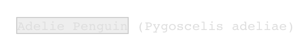
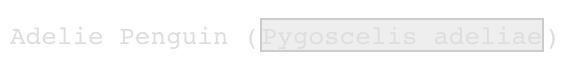
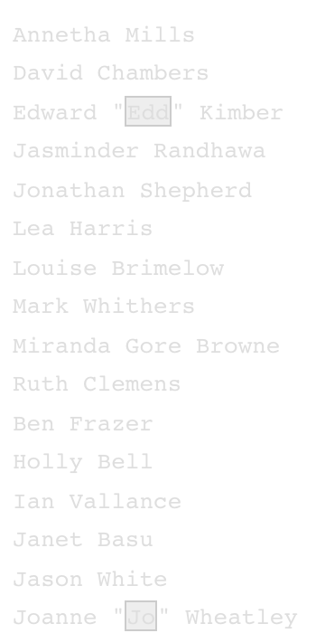

     

------------------------------------------------------------------------

Prep homework
-------------

### Basic computer setup

-   If you didn't already do this, please follow the [Code Club Computer Setup](/codeclub-setup/04_ggplot2/) instructions, which also has pointers for if you're new to R or RStudio.

-   If you're able to do so, please open RStudio a bit before Code Club starts -- and in case you run into issues, please join the Zoom call early and we'll help you troubleshoot.

 

------------------------------------------------------------------------

Getting Started
---------------

### RMarkdown for today's session

<pre class='chroma'><code class='language-r' data-lang='r'># directory for Code Club Session 20:
<a href='https://rdrr.io/r/base/files2.html'>dir.create</a>("S20")

# directory for our RMarkdown
# ("recursive" to create two levels at once.)
<a href='https://rdrr.io/r/base/files2.html'>dir.create</a>("S20/Rmd/")

# save the url location for today's script
todays_Rmd &lt;- 
  'https://raw.githubusercontent.com/biodash/biodash.github.io/master/content/codeclub/20_cleaning-up/CleaningUp.Rmd'

# indicate the name of the new script file
Session20_Rmd &lt;- "S20/Rmd/CleaningUp.Rmd"

# go get that file! 
<a href='https://rdrr.io/r/utils/download.file.html'>download.file</a>(url = todays_Rmd,
              destfile = Session20_Rmd)</code></pre>

 

------------------------------------------------------------------------

1 - Using regexs for wrangling
------------------------------

Artwork by [Allison Horst](https://github.com/allisonhorst/stats-illustrations)

Now that we have gone through a mini-series on regular expressions, with the [basics](https://biodash.github.io/codeclub/17_regex/), some [next level helpers](https://biodash.github.io/codeclub/18_regex2/), and [using tidytext to make word clouds](https://biodash.github.io/codeclub/19_wordclouds/), I thought I'd talk today about some applications of this information to cleaning up your data.

To do this, we are going to practice with the [`palmerpenguins`](https://allisonhorst.github.io/palmerpenguins/) dataset, and get back to the [`bakeoff`](https://bakeoff.netlify.app/) for our practice exercises.

 

------------------------------------------------------------------------

2 - Accessing our data
----------------------

-   You can do this locally, or at OSC. You can find instructions if you are having trouble [here](/codeclub-setup/).

First load your libraries. We will be using `stringr` and `tidyr` but those are both part of core `tidyverse`. We are also using a new package today called `janitor` which helps you "clean up" your data.

If you don't have the package `janitor`, please install it.

<pre class='chroma'><code class='language-r' data-lang='r'><a href='https://rdrr.io/r/utils/install.packages.html'>install.packages</a>("janitor")</code></pre>

<pre class='chroma'><code class='language-r' data-lang='r'><a href='https://rdrr.io/r/base/library.html'>library</a>(<a href='http://tidyverse.tidyverse.org'>tidyverse</a>)
<a href='https://rdrr.io/r/base/library.html'>library</a>(<a href='https://github.com/sfirke/janitor'>janitor</a>) # for cleaning up column names

<a href='https://rdrr.io/r/base/library.html'>library</a>(<a href='https://allisonhorst.github.io/palmerpenguins/'>palmerpenguins</a>) # for penguins data
<a href='https://rdrr.io/r/base/library.html'>library</a>(<a href='https://bakeoff.netlify.com'>bakeoff</a>) # for bakeoff data</code></pre>

Then we will use the package `palmerpenguins` and the dataset `penguins_raw`, which has a bit more info than `penguins`, which we have used previously.

Artwork by [Allison Horst](https://allisonhorst.github.io/palmerpenguins/articles/art.html)

 

------------------------------------------------------------------------

3 - Variable names
------------------

There are many instances where you may have variables names and/or sample names that are messy. For example, variable names that include characters like white spaces, special characters like symbols, or begin with a number are going to give you problems with some R coding. I'll say that you *can* have these non-standard variable names, but occasionally they will give you a big headache and so I'd recommend to just avoid them.

R variable "rules":

-   can contain letters, numbers, underscores (`_`) and periods (`.`)
-   cannot start with a number or underscore
-   shouldn't be a "reserved" word, like if, else, function, TRUE, FALSE etc. (if you want to see them all, execute [`?reserved`](https://rdrr.io/r/base/Reserved.html) in your console)

You can read about the [tidyverse style guide](https://style.tidyverse.org/syntax.html) if you want to learn more.

Lets look at the variable names in `penguins_raw`.

<pre class='chroma'><code class='language-r' data-lang='r'>glimpse(penguins_raw)
#&gt; Rows: 344
#&gt; Columns: 17
#&gt; $ studyName             &lt;chr&gt; "PAL0708", "PAL0708", "PAL0708", "PAL0708", "PAL…
#&gt; $ `Sample Number`       &lt;dbl&gt; 1, 2, 3, 4, 5, 6, 7, 8, 9, 10, 11, 12, 13, 14, 1…
#&gt; $ Species               &lt;chr&gt; "Adelie Penguin (Pygoscelis adeliae)", "Adelie P…
#&gt; $ Region                &lt;chr&gt; "Anvers", "Anvers", "Anvers", "Anvers", "Anvers"…
#&gt; $ Island                &lt;chr&gt; "Torgersen", "Torgersen", "Torgersen", "Torgerse…
#&gt; $ Stage                 &lt;chr&gt; "Adult, 1 Egg Stage", "Adult, 1 Egg Stage", "Adu…
#&gt; $ `Individual ID`       &lt;chr&gt; "N1A1", "N1A2", "N2A1", "N2A2", "N3A1", "N3A2", …
#&gt; $ `Clutch Completion`   &lt;chr&gt; "Yes", "Yes", "Yes", "Yes", "Yes", "Yes", "No", …
#&gt; $ `Date Egg`            &lt;date&gt; 2007-11-11, 2007-11-11, 2007-11-16, 2007-11-16,…
#&gt; $ `Culmen Length (mm)`  &lt;dbl&gt; 39.1, 39.5, 40.3, NA, 36.7, 39.3, 38.9, 39.2, 34…
#&gt; $ `Culmen Depth (mm)`   &lt;dbl&gt; 18.7, 17.4, 18.0, NA, 19.3, 20.6, 17.8, 19.6, 18…
#&gt; $ `Flipper Length (mm)` &lt;dbl&gt; 181, 186, 195, NA, 193, 190, 181, 195, 193, 190,…
#&gt; $ `Body Mass (g)`       &lt;dbl&gt; 3750, 3800, 3250, NA, 3450, 3650, 3625, 4675, 34…
#&gt; $ Sex                   &lt;chr&gt; "MALE", "FEMALE", "FEMALE", NA, "FEMALE", "MALE"…
#&gt; $ `Delta 15 N (o/oo)`   &lt;dbl&gt; NA, 8.94956, 8.36821, NA, 8.76651, 8.66496, 9.18…
#&gt; $ `Delta 13 C (o/oo)`   &lt;dbl&gt; NA, -24.69454, -25.33302, NA, -25.32426, -25.298…
#&gt; $ Comments              &lt;chr&gt; "Not enough blood for isotopes.", NA, NA, "Adult…</code></pre>

What you can see is that there are variable names here that don't comply with the "rules" I just indicated. How can that be?! You can see for the variable `Sample Number` that it is surrounded by backticks. This is how R know that this is a variable name.

Okay, so who cares? If you want to call that particular variable, you will have to put it in backticks. For example:

<pre class='chroma'><code class='language-r' data-lang='r'># this doesn't work
penguins_raw %>%
  select(Sample Number)</code></pre>

<pre class='chroma'><code class='language-r' data-lang='r'># this works but is clunky
penguins_raw %&gt;%
  select(`Sample Number`)
#&gt; # A tibble: 344 x 1
#&gt;    `Sample Number`
#&gt;              &lt;dbl&gt;
#&gt;  1               1
#&gt;  2               2
#&gt;  3               3
#&gt;  4               4
#&gt;  5               5
#&gt;  6               6
#&gt;  7               7
#&gt;  8               8
#&gt;  9               9
#&gt; 10              10
#&gt; # … with 334 more rows</code></pre>

And, this is using `tidyverse` functions - there will be other situations where you will get non-solvable errors because of your variable names.

 

**tl;dr just make your variable names R compliant, there are lots of other harder things you're going to be doing with coding, so just make this easier for yourself.**

 

### Using `clean_names()`

Artwork by [Allison Horst](https://github.com/allisonhorst/stats-illustrations)

You may be thinking now, okay but what happens if someone else gives me data that has unclean variable names?

Don't worry too much, you can easily fix it. My favorite, and the simplest way to do this is using the package `janitor`, and the function [`clean_names()`](https://www.rdocumentation.org/packages/janitor/versions/1.2.0/topics/clean_names). Certainly you could clean your variable names manually, but why? This is really easy.

<pre class='chroma'><code class='language-r' data-lang='r'>penguins_clean &lt;- <a href='https://rdrr.io/pkg/janitor/man/clean_names.html'>clean_names</a>(penguins_raw)

glimpse(penguins_clean)  
#&gt; Rows: 344
#&gt; Columns: 17
#&gt; $ study_name        &lt;chr&gt; "PAL0708", "PAL0708", "PAL0708", "PAL0708", "PAL0708…
#&gt; $ sample_number     &lt;dbl&gt; 1, 2, 3, 4, 5, 6, 7, 8, 9, 10, 11, 12, 13, 14, 15, 1…
#&gt; $ species           &lt;chr&gt; "Adelie Penguin (Pygoscelis adeliae)", "Adelie Pengu…
#&gt; $ region            &lt;chr&gt; "Anvers", "Anvers", "Anvers", "Anvers", "Anvers", "A…
#&gt; $ island            &lt;chr&gt; "Torgersen", "Torgersen", "Torgersen", "Torgersen", …
#&gt; $ stage             &lt;chr&gt; "Adult, 1 Egg Stage", "Adult, 1 Egg Stage", "Adult, …
#&gt; $ individual_id     &lt;chr&gt; "N1A1", "N1A2", "N2A1", "N2A2", "N3A1", "N3A2", "N4A…
#&gt; $ clutch_completion &lt;chr&gt; "Yes", "Yes", "Yes", "Yes", "Yes", "Yes", "No", "No"…
#&gt; $ date_egg          &lt;date&gt; 2007-11-11, 2007-11-11, 2007-11-16, 2007-11-16, 200…
#&gt; $ culmen_length_mm  &lt;dbl&gt; 39.1, 39.5, 40.3, NA, 36.7, 39.3, 38.9, 39.2, 34.1, …
#&gt; $ culmen_depth_mm   &lt;dbl&gt; 18.7, 17.4, 18.0, NA, 19.3, 20.6, 17.8, 19.6, 18.1, …
#&gt; $ flipper_length_mm &lt;dbl&gt; 181, 186, 195, NA, 193, 190, 181, 195, 193, 190, 186…
#&gt; $ body_mass_g       &lt;dbl&gt; 3750, 3800, 3250, NA, 3450, 3650, 3625, 4675, 3475, …
#&gt; $ sex               &lt;chr&gt; "MALE", "FEMALE", "FEMALE", NA, "FEMALE", "MALE", "F…
#&gt; $ delta_15_n_o_oo   &lt;dbl&gt; NA, 8.94956, 8.36821, NA, 8.76651, 8.66496, 9.18718,…
#&gt; $ delta_13_c_o_oo   &lt;dbl&gt; NA, -24.69454, -25.33302, NA, -25.32426, -25.29805, …
#&gt; $ comments          &lt;chr&gt; "Not enough blood for isotopes.", NA, NA, "Adult not…</code></pre>

You can see that `Sample Number` became `sample_number`, `Culmen Length (mm)` became `culmen_length_mm`.

The default is to parse with "snake" case, which would look like snake\_case. You could also set the argument `case` to:

-   `"lower_camel"` or `"small_camel"` to get lowerCamel
-   `"upper_camel"` or `"big_camel"` to get UpperCamel
-   `"screaming_snake"` or `"all_caps"` to get SCREAMING\_SNAKE (stop yelling please)
-   `"lower_upper"` to get lowerUPPER (I don't know why you'd want this)
-   `"upper_lower"` to get UPPERlower (I also don't know why you'd want this)

Artwork by [Allison Horst](https://github.com/allisonhorst/stats-illustrations)

 

------------------------------------------------------------------------

4 - Unite character columns
---------------------------

There will be times when you'd like to take a variable, and combine it with another variable. For example, you might want a column called `region_island` which contains a combination of the `region` and `island` that each penguin is from. We can do this with the function [`unite()`](https://tidyr.tidyverse.org/reference/unite.html). The function `unite()` allows you to paste together multiple columns to become one column.

The arguments to `unite` work like this:

`unite(data, col, ..., sep = "_", remove = TRUE, na.rm = FALSE)`

<pre class='chroma'><code class='language-r' data-lang='r'>penguins_clean_unite &lt;- penguins_clean %&gt;%
  unite(col = "region_island", 
        region:island, # indicate the columns to unite
        remove = FALSE) # don't remove region and island</code></pre>

Did it work?

<pre class='chroma'><code class='language-r' data-lang='r'><a href='https://rdrr.io/r/utils/head.html'>head</a>(penguins_clean_unite)
#&gt; # A tibble: 6 x 18
#&gt;   study_name sample_number species         region_island  region island stage   
#&gt;   &lt;chr&gt;              &lt;dbl&gt; &lt;chr&gt;           &lt;chr&gt;          &lt;chr&gt;  &lt;chr&gt;  &lt;chr&gt;   
#&gt; 1 PAL0708                1 Adelie Penguin… Anvers_Torger… Anvers Torge… Adult, …
#&gt; 2 PAL0708                2 Adelie Penguin… Anvers_Torger… Anvers Torge… Adult, …
#&gt; 3 PAL0708                3 Adelie Penguin… Anvers_Torger… Anvers Torge… Adult, …
#&gt; 4 PAL0708                4 Adelie Penguin… Anvers_Torger… Anvers Torge… Adult, …
#&gt; 5 PAL0708                5 Adelie Penguin… Anvers_Torger… Anvers Torge… Adult, …
#&gt; 6 PAL0708                6 Adelie Penguin… Anvers_Torger… Anvers Torge… Adult, …
#&gt; # … with 11 more variables: individual_id &lt;chr&gt;, clutch_completion &lt;chr&gt;,
#&gt; #   date_egg &lt;date&gt;, culmen_length_mm &lt;dbl&gt;, culmen_depth_mm &lt;dbl&gt;,
#&gt; #   flipper_length_mm &lt;dbl&gt;, body_mass_g &lt;dbl&gt;, sex &lt;chr&gt;,
#&gt; #   delta_15_n_o_oo &lt;dbl&gt;, delta_13_c_o_oo &lt;dbl&gt;, comments &lt;chr&gt;</code></pre>

This is a silly example since there is only one region, but I think you can see how this function is used.

 

------------------------------------------------------------------------

5 - Separate character columns
------------------------------

There will be times that you have a column that has two variables embedded within it, and you will want to separate or parse the column to become two separate columns. You can do this with the function [`separate()`](https://tidyr.tidyverse.org/reference/separate.html).

The arguments to separate look like this:

`separate(data, col, into, sep = "yourregex", remove = TRUE, extra = "warn", fill = "warn")`

Let's look at the column `stage`.

<pre class='chroma'><code class='language-r' data-lang='r'>penguins_clean$stage[1:5]
#&gt; [1] "Adult, 1 Egg Stage" "Adult, 1 Egg Stage" "Adult, 1 Egg Stage"
#&gt; [4] "Adult, 1 Egg Stage" "Adult, 1 Egg Stage"</code></pre>

We might want to separate the column `stage` into `age` and `egg_stage`. We can do this with `separate()`.

<pre class='chroma'><code class='language-r' data-lang='r'>penguins_clean_stage &lt;- penguins_clean %&gt;%
  separate(col = stage,
           into = <a href='https://rdrr.io/r/base/c.html'>c</a>("age", "egg_stage"),
           sep = ",", # the comma is the separator
           remove = FALSE) </code></pre>

Did it work?

<pre class='chroma'><code class='language-r' data-lang='r'>penguins_clean_stage %&gt;%
  select(stage, age, egg_stage) %&gt;%
  <a href='https://rdrr.io/r/utils/head.html'>head</a>()
#&gt; # A tibble: 6 x 3
#&gt;   stage              age   egg_stage     
#&gt;   &lt;chr&gt;              &lt;chr&gt; &lt;chr&gt;         
#&gt; 1 Adult, 1 Egg Stage Adult " 1 Egg Stage"
#&gt; 2 Adult, 1 Egg Stage Adult " 1 Egg Stage"
#&gt; 3 Adult, 1 Egg Stage Adult " 1 Egg Stage"
#&gt; 4 Adult, 1 Egg Stage Adult " 1 Egg Stage"
#&gt; 5 Adult, 1 Egg Stage Adult " 1 Egg Stage"
#&gt; 6 Adult, 1 Egg Stage Adult " 1 Egg Stage"</code></pre>

A different type of example:

The column `individual_id` has two parts: the letter N and then a number, and the letter A and then a number. Let's split this column into two columns, one called `id_n` that contains the number after the N, and a second called `id_a` that contains the number after the A.

<pre class='chroma'><code class='language-r' data-lang='r'>penguins_clean_fixID &lt;- penguins_clean %&gt;%
  separate(col = individual_id,
           into = <a href='https://rdrr.io/r/base/c.html'>c</a>("id_n", "id_a"),
           sep = "A", # can also use regex "[A]"
           remove = FALSE) </code></pre>

Did it work?

<pre class='chroma'><code class='language-r' data-lang='r'>penguins_clean_fixID %&gt;%
  select(individual_id, id_n, id_a) %&gt;%
  <a href='https://rdrr.io/r/utils/head.html'>head</a>()
#&gt; # A tibble: 6 x 3
#&gt;   individual_id id_n  id_a 
#&gt;   &lt;chr&gt;         &lt;chr&gt; &lt;chr&gt;
#&gt; 1 N1A1          N1    1    
#&gt; 2 N1A2          N1    2    
#&gt; 3 N2A1          N2    1    
#&gt; 4 N2A2          N2    2    
#&gt; 5 N3A1          N3    1    
#&gt; 6 N3A2          N3    2</code></pre>

This worked to separate out the A, but the N is still linked with `id_n`. We can use separate again to remove it. In this case, we don't want to keep the column that will include only Ns, so we will indicate that in the `into` argument, and we set `remote = TRUE` (which actually you can omit because it is the default).

<pre class='chroma'><code class='language-r' data-lang='r'>penguins_clean_fixID &lt;- penguins_clean_fixID %&gt;%
  separate(col = id_n,
           into = <a href='https://rdrr.io/r/base/c.html'>c</a>(NA, "id_n"), # the NA omits the variable
           sep = "N", # can also use regex "[N]"
           remove = TRUE) # optional, since this is the default </code></pre>

Did it work?

<pre class='chroma'><code class='language-r' data-lang='r'>penguins_clean_fixID %&gt;%
  select(individual_id, id_n, id_a) %&gt;%
  <a href='https://rdrr.io/r/utils/head.html'>head</a>()
#&gt; # A tibble: 6 x 3
#&gt;   individual_id id_n  id_a 
#&gt;   &lt;chr&gt;         &lt;chr&gt; &lt;chr&gt;
#&gt; 1 N1A1          1     1    
#&gt; 2 N1A2          1     2    
#&gt; 3 N2A1          2     1    
#&gt; 4 N2A2          2     2    
#&gt; 5 N3A1          3     1    
#&gt; 6 N3A2          3     2</code></pre>

6 - Extract character columns
-----------------------------

We can use [`extract()`](https://tidyr.tidyverse.org/reference/extract.html) to set up regular expressions to allow the separation of our variable `species` into exactly what we want.

We will use str\_view to figure out a regex that will work for us.

<pre class='chroma'><code class='language-r' data-lang='r'># indicate our string
string &lt;- "Adelie Penguin (Pygoscelis adeliae)"</code></pre>

<pre class='chroma'><code class='language-r' data-lang='r'># to get Adelie Penguin
str_view(string, "[[:alnum:]]+\\s[[:alnum:]]+")</code></pre>

-   `[[:alnum:]]` gives you anything alphanumeric.  
-   the [`+`](https://rdrr.io/r/base/Arithmetic.html) indicates to match alphanumeric at least 1 time
-   `\\s` indicates a space

<pre class='chroma'><code class='language-r' data-lang='r'># to get Pygoscelis adeliae
str_view(string, "(?&lt;=\\()[[:alnum:]]+\\s[[:alnum:]]+")</code></pre>

-   `(?<=)` is called the positive lookbehind, and has this general structure `(?<=B)A` which can be read like "find exprssion A which is preceeded by expression B." In our example, expression B is a parentheses `(`. But there is some additional complexity here because parentheses have their own meanings in R, so you need to use the `\\` to escape them. The whole expression for this part of our regex is `(?<=\\()`.
-   `[[:alnum:]]` gives you anything alphanumeric.  
-   the [`+`](https://rdrr.io/r/base/Arithmetic.html) indicates to match alphanumeric at least 1 time
-   `\\s` indicates a space

Ok our regexs work as desired! Now we can incorporate them into `extract()`. Here I am using `.*?` to indicate the separator, as our separator is `(`. If you had a simpler separator, this would look simpler.

<pre class='chroma'><code class='language-r' data-lang='r'>penguins_clean_extract &lt;- penguins_clean %&gt;%
  extract(col = species,
          into = <a href='https://rdrr.io/r/base/c.html'>c</a>("common_name", "genus_species"),
          regex = "([[:alnum:]]+\\s[[:alnum:]]+).*?((?&lt;=\\()[[:alnum:]]+\\s[[:alnum:]]+)", 
          remove = FALSE) </code></pre>

Did it work?

<pre class='chroma'><code class='language-r' data-lang='r'>penguins_clean_extract %&gt;%
  select(species, common_name, genus_species) %&gt;%
  <a href='https://rdrr.io/r/utils/head.html'>head</a>()
#&gt; # A tibble: 6 x 3
#&gt;   species                             common_name    genus_species     
#&gt;   &lt;chr&gt;                               &lt;chr&gt;          &lt;chr&gt;             
#&gt; 1 Adelie Penguin (Pygoscelis adeliae) Adelie Penguin Pygoscelis adeliae
#&gt; 2 Adelie Penguin (Pygoscelis adeliae) Adelie Penguin Pygoscelis adeliae
#&gt; 3 Adelie Penguin (Pygoscelis adeliae) Adelie Penguin Pygoscelis adeliae
#&gt; 4 Adelie Penguin (Pygoscelis adeliae) Adelie Penguin Pygoscelis adeliae
#&gt; 5 Adelie Penguin (Pygoscelis adeliae) Adelie Penguin Pygoscelis adeliae
#&gt; 6 Adelie Penguin (Pygoscelis adeliae) Adelie Penguin Pygoscelis adeliae</code></pre>

Voila!

 

------------------------------------------------------------------------

Exercises
---------

We will be doing our exercises today with a couple of datasets from the `bakeoff` package.

 

------------------------------------------------------------------------

### Exercise 1

Using the dataset `bakers`, combine `bakers_last` with `bakers_first` to create a new column `bakers_last_first` which is indicated like this: Lastname, Firstname.

 Hints (click here) 

Use [`head()`](https://rdrr.io/r/utils/head.html) or `glimpse()` to see the structure of this data. Use `unite()` to combine columns. Don't forget to indicate the correct `sep`  

 

 Solutions (click here) 

<pre class='chroma'><code class='language-r' data-lang='r'><a href='https://rdrr.io/r/utils/head.html'>head</a>(bakers)
#&gt; # A tibble: 6 x 8
#&gt;   series baker_full   baker    age occupation   hometown  baker_last baker_first
#&gt;   &lt;fct&gt;  &lt;chr&gt;        &lt;chr&gt;  &lt;dbl&gt; &lt;chr&gt;        &lt;chr&gt;     &lt;chr&gt;      &lt;chr&gt;      
#&gt; 1 1      "Annetha Mi… Annet…    30 Midwife      Essex     Mills      Annetha    
#&gt; 2 1      "David Cham… David     31 Entrepreneur Milton K… Chambers   David      
#&gt; 3 1      "Edward \"E… Edd       24 Debt collec… Bradford  Kimber     Edward     
#&gt; 4 1      "Jasminder … Jasmi…    45 Assistant C… Birmingh… Randhawa   Jasminder  
#&gt; 5 1      "Jonathan S… Jonat…    25 Research An… St Albans Shepherd   Jonathan   
#&gt; 6 1      "Lea Harris" Lea       51 Retired      Midlothi… Harris     Lea

bakers_2 &lt;- bakers %&gt;%
  unite(col = "bakers_last_first",
        <a href='https://rdrr.io/r/base/c.html'>c</a>(baker_last, baker_first),
        sep = ", ")

# did it work?
<a href='https://rdrr.io/r/utils/head.html'>head</a>(bakers_2)
#&gt; # A tibble: 6 x 7
#&gt;   series baker_full    baker    age occupation       hometown   bakers_last_fir…
#&gt;   &lt;fct&gt;  &lt;chr&gt;         &lt;chr&gt;  &lt;dbl&gt; &lt;chr&gt;            &lt;chr&gt;      &lt;chr&gt;           
#&gt; 1 1      "Annetha Mil… Annet…    30 Midwife          Essex      Mills, Annetha  
#&gt; 2 1      "David Chamb… David     31 Entrepreneur     Milton Ke… Chambers, David 
#&gt; 3 1      "Edward \"Ed… Edd       24 Debt collector … Bradford   Kimber, Edward  
#&gt; 4 1      "Jasminder R… Jasmi…    45 Assistant Credi… Birmingham Randhawa, Jasmi…
#&gt; 5 1      "Jonathan Sh… Jonat…    25 Research Analyst St Albans  Shepherd, Jonat…
#&gt; 6 1      "Lea Harris"  Lea       51 Retired          Midlothia… Harris, Lea</code></pre>

 

------------------------------------------------------------------------

### Exercise 2

Using the dataset `bakers`, convert the column `hometown` to two columns, where whatever comes before the comma is in a column called `city` and whatever comes after is in a column called `locale`.

 Hints (click here) 

Try using `separate()`.  

 

 Solutions (click here) 

<pre class='chroma'><code class='language-r' data-lang='r'><a href='https://rdrr.io/r/utils/head.html'>head</a>(bakers)
#&gt; # A tibble: 6 x 8
#&gt;   series baker_full   baker    age occupation   hometown  baker_last baker_first
#&gt;   &lt;fct&gt;  &lt;chr&gt;        &lt;chr&gt;  &lt;dbl&gt; &lt;chr&gt;        &lt;chr&gt;     &lt;chr&gt;      &lt;chr&gt;      
#&gt; 1 1      "Annetha Mi… Annet…    30 Midwife      Essex     Mills      Annetha    
#&gt; 2 1      "David Cham… David     31 Entrepreneur Milton K… Chambers   David      
#&gt; 3 1      "Edward \"E… Edd       24 Debt collec… Bradford  Kimber     Edward     
#&gt; 4 1      "Jasminder … Jasmi…    45 Assistant C… Birmingh… Randhawa   Jasminder  
#&gt; 5 1      "Jonathan S… Jonat…    25 Research An… St Albans Shepherd   Jonathan   
#&gt; 6 1      "Lea Harris" Lea       51 Retired      Midlothi… Harris     Lea

bakers_hometown &lt;- bakers %&gt;%
  separate(col = hometown,
           into = <a href='https://rdrr.io/r/base/c.html'>c</a>("city", "locale"),
           sep = ", ")
#&gt; Warning: Expected 2 pieces. Additional pieces discarded in 1 rows [71].
#&gt; Warning: Expected 2 pieces. Missing pieces filled with `NA` in 65 rows [1, 2, 3, 4, 5, 7, 8, 11, 12, 15, 19, 20, 23, 25, 27, 28, 31, 34, 38, 41, ...].

# did it work?
<a href='https://rdrr.io/r/utils/head.html'>head</a>(bakers_hometown)
#&gt; # A tibble: 6 x 9
#&gt;   series baker_full  baker    age occupation city  locale baker_last baker_first
#&gt;   &lt;fct&gt;  &lt;chr&gt;       &lt;chr&gt;  &lt;dbl&gt; &lt;chr&gt;      &lt;chr&gt; &lt;chr&gt;  &lt;chr&gt;      &lt;chr&gt;      
#&gt; 1 1      "Annetha M… Annet…    30 Midwife    Essex NA     Mills      Annetha    
#&gt; 2 1      "David Cha… David     31 Entrepren… Milt… NA     Chambers   David      
#&gt; 3 1      "Edward \"… Edd       24 Debt coll… Brad… NA     Kimber     Edward     
#&gt; 4 1      "Jasminder… Jasmi…    45 Assistant… Birm… NA     Randhawa   Jasminder  
#&gt; 5 1      "Jonathan … Jonat…    25 Research … St A… NA     Shepherd   Jonathan   
#&gt; 6 1      "Lea Harri… Lea       51 Retired    Midl… Scotl… Harris     Lea</code></pre>

 

------------------------------------------------------------------------

### Exercise 3

Using the dataset `bakers` add a column `nickname` which indicates the bakers nickname, if they have one.

 Hints (click here) 

Think about how to make a regex that would pull out the nickname. Try using `str_view_all()` to get your regex working before you apply it to `bakers`.  
 

 

 Solutions (click here) 

<pre class='chroma'><code class='language-r' data-lang='r'>baker_full &lt;- bakers$baker_full</code></pre>

<pre class='chroma'><code class='language-r' data-lang='r'># note I used single quotes because there were double quotes in the regex
str_view_all(baker_full, '(?&lt;=\\").*(?=\\")') </code></pre>

<pre class='chroma'><code class='language-r' data-lang='r'>bakers_nickname &lt;- bakers %&gt;%
  extract(col = baker_full,
          into = "nickname",
          regex = '((?&lt;=\\").*(?=\\"))')

bakers_nickname %&gt;%
  arrange(nickname) %&gt;%
  <a href='https://rdrr.io/r/utils/head.html'>head</a>()
#&gt; # A tibble: 6 x 8
#&gt;   series nickname baker    age occupation       hometown  baker_last baker_first
#&gt;   &lt;fct&gt;  &lt;chr&gt;    &lt;chr&gt;  &lt;dbl&gt; &lt;chr&gt;            &lt;chr&gt;     &lt;chr&gt;      &lt;chr&gt;      
#&gt; 1 1      Edd      Edd       24 Debt collector … Bradford  Kimber     Edward     
#&gt; 2 2      Jo       Joanne    41 Housewife        Ongar, E… Wheatley   Joanne     
#&gt; 3 7      Val      Val       66 Semi-retired, S… Yeovil    Stones     Valerie    
#&gt; 4 8      Yan      Yan       46 Laboratory rese… North Lo… Tsou       Chuen-Yan  
#&gt; 5 1      NA       Annet…    30 Midwife          Essex     Mills      Annetha    
#&gt; 6 1      NA       David     31 Entrepreneur     Milton K… Chambers   David</code></pre>

 

------------------------------------------------------------------------

### Exercise 4

Using the dataset `challenge_results`, write a regex to find any `signature` that contains chocolate. Remove all observations that contain `NA` for the `signature`. How many of the signature bakes contain chocolate? What percentage of the total signature bakes (for which we have bake names) does this represent?

 Hints (click here) 

You can get rid of NAs with `drop_na()`. Try using `str_count()` to see how many occurances you have of chocolate in the signatures.  

 

 Solutions (click here) 

<pre class='chroma'><code class='language-r' data-lang='r'># select only signatures, drop NAs
signatures &lt;- challenge_results %&gt;%
  select(signature) %&gt;%
  drop_na() 

# check dimensions 
<a href='https://rdrr.io/r/base/dim.html'>dim</a>(signatures)
#&gt; [1] 703   1

# regex for chocolate (or Chocolate, or Chocolatey)
str_count(signatures, "C?c?hocolat") 
#&gt; Warning in stri_count_regex(string, pattern, opts_regex = opts(pattern)): argument is not an atomic vector; coercing
#&gt; [1] 77

# what percent of signatures contain chocolate
(str_count(signatures, "C?c?hocolat")/count(signatures))*100
#&gt; Warning in stri_count_regex(string, pattern, opts_regex = opts(pattern)): argument is not an atomic vector; coercing
#&gt;          n
#&gt; 1 10.95306</code></pre>

 

------------------------------------------------------------------------

