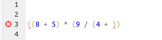

<br> <br>

## Learning objectives

> * Learn what Code Club is all about
> * Get some basic familiarity with R and RStudio
> * Learn why and how to use RStudio Projects
> * Understand a bit about R *objects* and how to use them

<br>

----

## To do beforehand

Before the Code Club Zoom session,
please follow the [Code Club Computer Setup](/codeclub-setup/) instructions.

In brief, you should have R and RStudio installed on your computer
*or* you should be set up to run RStudio Server at the Ohio Supercomputer Center (OSC).
(As a bonus, you can try to install and load the *tidyverse* package
as the setup page suggests, but no sweat if you can't get that to work yet.)

In case you run into issues, contact [Jelmer](mailto:poelstra.1@osu.edu) or for
last-minute troubleshooting, you can join the Zoom call 15-30 minutes early.

<br>

----

## (Re)Introducing Code Club

OSU Code Club is a regularly occurring, interactive, online gathering to improve coding skills.
 
Some of the general ideas behind Code Club:

- Ongoing exposure and practice is a good way to learn.

- Coding is best learned by doing, so Code Club is interactive and hands-on.

- We aim to keep it informal and maybe even fun.

- We have a core group of 5 organizers that do most of the presenting,
  but we also encourage participants to present, 
  and will have a couple of participant-led sessions at the end of this semester
  (see the [schedule](/codeclub-schedule/)).

#### Organizers

- Jelmer Poelstra (Molecular and Cellular Imaging Center (MCIC), Wooster Campus)
- Jessica Cooperstone (Dept. of Horticulture and Crop Science & Dept. of Food Science and Technology)
- Michael Broe (Dept. of Evolution, Ecology and Organismal Biology)
- Mike Sovic (Center for Applied Plant Sciences)
- Stephen Opiyo (MCIC, Columbus Campus)

#### Session structure

Each session consists of an instructional part
where you can either listen or code along,
some exercises in breakout rooms with 3-4 people,
and exercise recaps with the entire group.

#### Zoom guidelines

- We very much welcome questions at any time,
  so please either unmute yourself and speak,
  or post in the chat whenever you have a question!
  
- Having your camera on helps, *especially* in breakout rooms.
  We will record the whole-group part of each session, so we understand if some
  of you prefer to have their cameras off during that part.
  (But note that we will only share the recordings with other Code Clubbers.)

- You can use the icons under the "Participants" menu in Zoom when we ask for
  a "show of hands" or if you are having problems.

- In breakout rooms:
  - Briefly introduce yourselves.
  - Have someone share their screen, preferably one of the least experienced people.
  - Be friendly and patient, keep everyone aboard.
  - The Zoom `Ask for help` button will alert us,
    and one of the organizers will come into the breakout room.
    (`Raise hand` is not seen by us outside of the room.)

#### Otherwise

- We need your feedback!

- Show Code Club menu and how to get around on the BioDASH website.

- Polling question: are you working at OSC or locally?

<br>

----

## 1 -- Why R?

R is a programming language that is most well-known
for being excellent for *statistical analysis* and *data visualization*.

**While the learning curve is steeper than for most programs with graphical user
interfaces (GUIs), it pays off to invest in learning R:**

- R gives you greater **flexibility** to do anything you want.

- Writing computer instructions as *code*, like you have to do in R,
  is more **reproducible** than clicking around in a GUI.
  It also makes it much _easier to redo analyses_ with slight modifications!

- R is highly **interdisciplinary** and can be used with many different kinds of data.
  To just name two examples,
  R has a very strong ecosystem for bioinformatics analysis ("Bioconductor" project),
  and can be used to create maps and perform GIS analyses.

- R is more than a platform to perform analysis and create figures.
  **R Markdown** combines R with *Markdown*, a very simple text markup language,
  to produce _analysis reports_ that integrate code, results, and text,
  and to create _slide decks_, _data dashboards_, _websites_, and even _books_!
  In the third session of Code Club, Michael Broe will introduce R Markdown.

- While not as versatile outside of data-focused topics as a language like Python,
  R can be used a general programming language,
  for instance to **automate tasks** such as large-scale file renaming.

Finally, R:

- Is open-source and freely available for all platforms (Windows, Mac, Linux).

- Has a large and welcoming user community.

## 2 -- Exploring RStudio

R simply provides a "*console*" where you can type your commands.
However, because you want to save your sequences of commands in scripts,
and regularly examine output such as graphics,
it is more effective to work in an environment that provides all of this
side-by-side.

We will use RStudio, an excellent "Integrated Development Environment" (IDE) for R.
In RStudio, we have a *single interface* to write code in text files or directly
in the console, visualize plots, navigate the files found on our computer,
and inspect the data and other objects we work with.

_I will now demonstrate how to start an RStudio Server session from
the Ohio Supercomputer Center's website following the steps from our
[Code Club Computer Setup page](/codeclub-setup/#osc-run-rstudio)._

Once we have a running instance of RStudio,
let's have a look at the different "panes" that the RStudio window is divided into:

- _Top-left_: The **Editor** for your scripts and documents (_hidden when you don't have a file open_).
- _Bottom-left_: The **R Console** (+ a tab with a **Terminal**).
- _Top-right_: Your **Environment** (+ several other tabs).
- _Bottom-left_: Tabs for **Files**, **Plots**, **Help**, and others.

<p align="center">

</p>

RStudio has a lot of useful features and during the next few sessions of Code Club,
we will introduce some tips and tricks for working with it.

<br>

----

## Breakout rooms I (~5 min.)

<div class="puzzle">
<div>

#### Introduce yourselves!

We'll return to the same breakout room configuration later in this session to
do a few exercises, so please take a moment to introduce yourself to your
breakout roommates. Make sure to also mention:

- Your level of experience with R and other coding languages.

- What you are aiming to use or are already using R for.

<br>

#### Check that everyone has RStudio working

And if you can't figure it out among yourselves,
click the `Ask for help` button.

</div>
</div>

-----

<br>

## 3 -- Interacting with R

#### R as a calculator

The lower-left RStudio pane, i.e. **the R console**,
is where you can interact with R directly.

The **`>`** sign is the R "prompt".
It indicates that R is ready for you to type something.

Let's start by performing a division:

```{r setup, include=FALSE}
knitr::opts_chunk$set(echo = TRUE, eval=FALSE)
```

```{r add, eval=TRUE, results='show'}
203 / 2.54
```

R does the calculation and prints the result in the console as well.
Afterwards, you get your **`>`** prompt back.
(The `[1]` may look a bit weird when there is only one output element; 
this is how you can keep count of output elements when there are many.)

With the expected set of symbols, you can use R as a general calculator:

```{r calculations, eval = TRUE, results='show'}
203 * 2.54   # Multiplication
203 + 2.54   # Addition
```

<br>

#### Experimenting a bit...

What if we add spaces around our valies?

```{r space, eval=TRUE, results="show"}
         203                     - 2.54
```

This works: as it turns out, R simply ignores any extra spaces.

Similarly, we _could_ omit the single spaces around the mathematical operators
that we used earlier (though we will keep using them for clarity):

```{r, eval=TRUE, results="show"}
203/2.54
```

<br>

How about:

```{r hanging_prompt}
203 +
```

Now the _prompt_ turned into a `+` instead of the usual `>`. 

<details>
<summary>
<b>What is going on here?</b> (Click for the answer)
</summary>
<br>

R is waiting for you to finish the command, since you typed an incomplete command:
something has to follow the `+`.

While it was obvious here that our command was incomplete,
you will often type incomplete commands without realizing you did so.
Just remember that when you see the `+` prompt,
*something* has to be missing in your command:
most commonly, you'll have forgotten a closing parenthesis `)`
or you accidentally opened up an unwanted opening parenthesis `(`.

In the editor, RStudio will also alert you when you are making so-called
*syntax errors* such as this:

<p align="center">

</p>

</details>

<br>

And if we just type a number:

```{r number, eval=TRUE, results='show'}
203
```

R will print the number back to us!
It turns out that the default, implicit action that R will perform
on anything you type is to print it back to us
(under the hood, it is calling a *function* called `print()`).

<br>

Instead of a number, what if we try to have R print some _text_ back to us?

```{r eval=TRUE, results='show', error=TRUE}
Fantastic
```

```{r eval=TRUE, results='show', error=TRUE}
Code Club
```

<details>
<summary>
<b>What seems to be going wrong here?</b> (Click for the answer)
</summary>
<br>

Whenever you type a *character string* (text),
R expects to find an *object* with that name.
When no object exists with that name, R will throw an error.
We will learn some of the basics of objects in section 5 of today's session.

</details>

<br>


We *can* get R to print character strings back to us,
and work with strings in other ways, as long as we quote them:

```{r print_char, eval=TRUE, results='show'}
"Well, I'm really liking R so far."
```

<br>

----

## 4 -- Working with a script

#### Need for scripts

We can go along like this, typing commands directly into the R console.
But to keep better track of what we're doing,
it's a good idea to write code in plain text files, i.e. to write "**scripts**".
And when we start creating scripts, we need to worry about how we
organize the scripts and data for a project.

So let's take a short diversion to talk about file organization.

<br>

#### Our first R script

- Create a new R script by clicking `File` > `New File` > `R Script`.

- Click `File` > `Save As` to save the script; 
  give it a descriptive name like `intro-to-R.R`.  
  (You may want to put the script in a new subfolder for this Code Club session.)
  
<br>

#### Interacting with the R console from your script

We recommend that you generally *type your commands into a script*
and execute the commands from there,
instead of typing directly into the console.

We want to make sure to save our division command,
so start by typing the following into the R script in the top-left pane:

```{r}
203 / 2.54
```

With the cursor still on this line,
press <kbd>Ctrl</kbd> + <kbd>Enter</kbd>.
The command will be copied to the R console and executed,
and then the cursor will move to the next line.
(And when you have selected multiple lines of code,
<kbd>Ctrl</kbd> + <kbd>Enter</kbd> will execute them all.)

<br>

#### Commenting

You can use `#` signs to annotate (comment) your code.
Anything to the right of a `#` is ignored by R, meaning it won't be executed.
You can use `#` both at the start of a line or anywhere in a line following code.

Comments are a great way to describe what your code does within the code itself,
so comment liberally in your R scripts!

```{r, eval=FALSE}
# Divide by 2.54 to get the wingspan in inches:
203 / 2.54    # Original measurement was in cm
```

<br>

----

## 5 -- R Objects

#### Assigning stuff to R objects

We can assign any value, character, or set of values or characters
to an *object* with the assignment operator, `<-`.
(This is a smaller-than sign `<` followed by a dash `-`.)^[In RStudio, typing <kbd>Alt</kbd> + <kbd>-</kbd> will write ` <- ` in
a single keystroke. You can also use `=` as assignment, but that symbol can have other
meanings, so we recommend sticking with the `<-` combination.]

For example:

```{r assign, eval=TRUE}
wingspan_in <- 203 / 2.54
```

Type that into your script,
and use <kbd>Ctrl</kbd> + <kbd>Enter</kbd> to send it to the console.

After you've assigned a number to an object,
you can use it in other calculations:

```{r sqrt, eval=TRUE, results='show'}
wingspan_in * 2.54
```

More generally speaking, the object name that you provide is substituted with its
contents by R, so it is a *pointer* (reference) to any underlying values.

While our object `wingspan_in` just contained a single number,
objects can get much bigger, and more complex too.
R distinguishes between different *types* of objects as we will see next week.

<br>

<div class="alert alert-note">
<div>

#### Object names

Objects can be given any name such as `x`, `current_temperature`, or
`subject_id`.

Some pointers on object names:

- Make them descriptive yet not too long.

- An object name cannot contain a space, so for readability, separate words using:
    - **`_`** -- e.g. `total_weight` (this is called "snake case", which we will tend to use in Code Club instructional materials)
    - **`.`** -- e.g. `total.weight`
    - _capitalization_ -- e.g. `totalWeight` or `TotalWeight` ("camel case")

- Because R is case sensitive, `weight` is different from `Weight`.

- Object names can contain but cannot start with a number (`2x` is not valid, but `x2` is)^[There are some names that
cannot be used because they are the names of fundamental keywords in R (e.g.,
`if`, `else`, `for`, see
[here](https://stat.ethz.ch/R-manual/R-devel/library/base/html/Reserved.html)
for a complete list). In general, it's best not to use
other function names even if it's "allowed" (e.g., `c`, `T`, `mean`, `data`, `df`, `weights`).
If in doubt, check the Help to see if the name is already in use.].

You will make things easier for yourself by naming objects in a consistent way,
for instance by always sticking to your favorite case like "snake case."^[It is also 
recommended to use *nouns* for variable names, and *verbs* for function names.
For more, two popular R style guides are [Hadley Wickham's](http://adv-r.had.co.nz/Style.html)
and [Google's](https://google.github.io/styleguide/Rguide.xml).]

</div></div>

<br>

#### Objects in your workspace

The objects you create get added to your "workspace" or "environment."
RStudio shows this in the **Environment panel.**
(You can also list all objects in your workspace with `ls()`.)

<br>

#### Objects, your workspace, and closing R

When you close R, it will probably ask you whether you want to save your workspace.
When you do so, then the next time you start R, you can reload everything the way it was,
such as your previously created objects.

While this may seem convenient, we recommend that you don't do this.

<details>
<summary>
<b>Can you think of a reason why saving and reloading your workspace may not be a good idea?</b>
(Click for the answer)
</summary>
<br>

The main reason why this is generally not considered good practice
relates to the idea that you should be able to
_reproduce your workspace (and more broadly speaking, your analysis) from the code in your script_.

Remember that you can modify your workspace either by entering commands in the console directly,
or by running them from a script -- or even from multiple different scripts.
Also, in practice, you often run lines in the script out of order,
or write lines in the script that you don't execute.

Therefore, if you "carry around" the same workspace across multiple different sessions,
you run a greater risk of not having a reproducible set of steps in your script.

To make RStudio stop asking you about saving your workspace,
click `Tools` > `Global Options` > `General` and set the options as follows:

<p align="center">

</p>

Taking these ideas a step further,
it can be a good idea to occasionally restart R so you can check whether the code
in your script is correct and complete,
that you are not relying on code that is not in the script, and so on.
To do so, you don't need to close and reopen RStudio itself:
under `Session` in the top menu bar, you can click `Restart R`
(and you should also see the keyboard shortcut for it in the menu bar, which is
<kbd>Ctrl</kbd> + <kbd>Shift</kbd> + <kbd>F10</kbd> for Windows/Linux,
and <kbd>Cmd</kbd> + <kbd>Shift</kbd> + <kbd>F10</kbd> for Mac).

</details>

<br>

----

## Breakout rooms II (5-10 min.)

_Note that in both of these exercises,
the answers are not contained in what we just discussed.
I would like you to think about your intuition for R's behavior,
and then see if R indeed works that way or not._

<div class="puzzle">
<div>

### Exercise 1: Object "linkage"

What do you think the value of `y` will be after executing the following lines in R?
100 or 160, and why?

```{r, eval=FALSE}
x <- 50       # x is now 50
y <- x * 2    # y is now 100
x <- 80       # x is now 80, but what is y?
```

<details>

<summary>
<b>Solution</b> (click here)
</summary>
<br>

Objects don't get linked to each other, so if you change one objects,
it won't affect the values of other objects that were defined earlier.

**Therefore, `y` will continue to be `100`.**

</details>

</div>
</div>

<div class="puzzle">
<div>

### Exercise 2: Errors... (Bonus)

In section 3, you might have noticed that we got a different error when typing
one versus multiple unquoted words. 
Here are those examples again:

```{r eval=TRUE, results='show', error=TRUE}
Fantastic
```

```{r eval=TRUE, results='show', error=TRUE}
Code Club
```

Reproduce these errors for yourself:
in Rstudio's editor pane,
type these or equivalent error-generating examples in a script saved with a `.R` extension,
and send them to the console.

Why is error in the second case different, and what does it mean?

<details>
<summary>
<b>Hints</b> (click here)
</summary>

<br>

- Can you see how RStudio can "notice" errors already in the editor --
  but only for the second of these two examples?
  The editor checks for *syntax* ("R grammar") errors but not whether objects
  already exist.
  
  <figure>
  <p align="center">
  
  <figcaption>If you hover over the red cross in the margin, you can see what RStudio is upset about.</figcaption>
  </p>
  </figure>
  
- What if we put a `+` or another operator between the two words?

  ```{r eval=TRUE, results='show', error=TRUE}
  Code + Club
  ```

</details>

<details>
<summary>
<b>Solution</b> (click here)
</summary>

<br>

When typing a single unquoted word which is not an existing object,
R will look for an object and then complain that it can't find that object.

When typing multiple unquoted words with a space between them,
regardless of whether those are existing objects, 
R will notice a *syntax ("R grammar") error* before it even gets around to checking objects.

The problem is that you be referring to two objects sequentially and
without any mathematical operator in between them,
or some other syntax to "join" them.
In R, that's not valid syntax.
(You may think it would perhaps simply try to print both objects, but this is not the case.)

</details>

A general lesson here is that you should always pay attention to the
error message that your are getting.
While the language may seem terse and odd at first,
it usually holds important clues as to what is going wrong exactly.

</div>
</div>

----

## In closing

#### Where to go from here

For a list of recommended resources for learning R, see our
[R Resources and Tips page](/tutorials/r-resources-tips/) page.

#### Attribution

This was modified after material from [The Carpentries](https://carpentries.org/),
especially from [this Data Carpentry workshop](http://uw-madison-aci.github.io/2016-06-01-uwmadison/)
and [this "R for Ecology" workshop](https://datacarpentry.org/R-ecology-lesson).

<br> <br>
