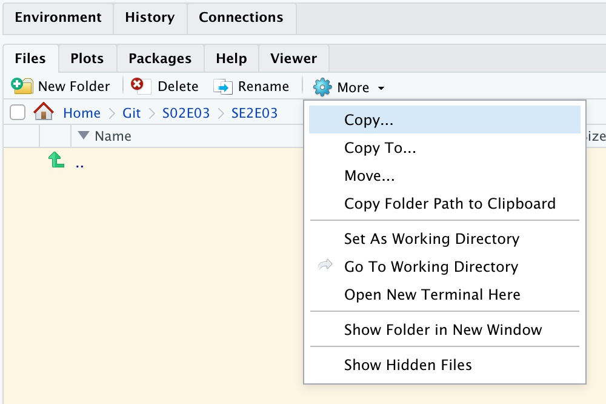
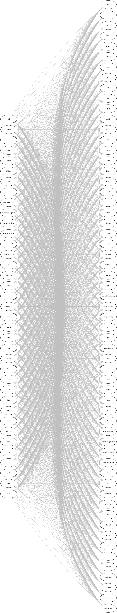
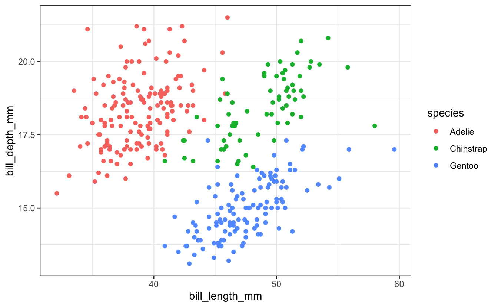

<br> <br> <br>

------------------------------------------------------------------------

## Introduction

R Markdown consists of an amazing ecosystem of R packages to produce many types of technical content. Its signature capability is that is can **print formatted text, run R code, and display the results, all inside a single document**. Furthermore, you can easily export this document in a large variety of formats, including HTML, PDF, Word, RTF, etc. The webpage you are looking at now was written completely in R Markdown.

At the most basic level, instead of using comments interleaved with your code in an R script:  
`# This is a comment`  
you can insert formatted text around your code in an R Markdown file. You can structure your document with headings and subheadings. You can add tables of contents. You can even generate formatted bibliographies. And the R code you insert in the document runs **inside the document** and the results go to the document itself, not to the console or (in the case of plots) to the Plots pane in RStudio.

This makes RMarkdown a great **computer lab notebook**, since you can explain what you're doing and why (to colleagues or your future self). It's also an example of **reproducible research** since you share not just a Word file, say, with example code, but an active document in which the code actually runs and the results are reproduced.

To understand R Markdown, we need to learn about three new things:

1.  **Markdown**, a very lightweight text formatting language.

2.  **Code chunks**, which allow us to incorporate R code that can be executed and whose results we can display in text, figures, and tables.

3.  **The YAML header**, which encodes metadata about the output, such as the desired output format and specific formatting features.

We'll focus on HTML output, but will also glance at other possibilities for the output format: with R Markdown, it is possible to create not just technical reports, but also slide decks, websites, books, scientific articles, dissertations, and so on.

<br>

#### Setup

At the core of the R Markdown ecosystem is the *rmarkdown* package. We need to install this but don't need to load it:

<div class="highlight">

<pre class='chroma'><code class='language-r' data-lang='r'><span class='nf'><a href='https://rdrr.io/r/utils/install.packages.html'>install.packages</a></span><span class='o'>(</span><span class='s'>"rmarkdown"</span><span class='o'>)</span></code></pre>

</div>

Inside your directory for Code Club, create a folder for this week:

<div class="highlight">

<pre class='chroma'><code class='language-r' data-lang='r'><span class='nf'><a href='https://rdrr.io/r/base/files2.html'>dir.create</a></span><span class='o'>(</span><span class='s'>'S02E03'</span><span class='o'>)</span></code></pre>

</div>

Select this folder in the Files pane. Then make this your working directory, using "Set as Working Directory" from the More options:

<p align="center">



</p>

<br>

#### First, an example

Before we go into details, let's first see a quick demonstration of what we're talking about. RStudio lets you create an example R Markdown document with a couple of clicks. Here are the instructions. I'll run through them, and then we'll open Breakout rooms so you can try it out yourself.

1.  Go to `File` =\> `New File` =\> `R Markdown`, change the *Title* to "Markdown demo", and click `OK`.

2.  Take a look at the R Markdown document, and notice that there seems to be some sort of header bounded by three dashes (=\> ***YAML***), followed by R code wrapped in strange constructs with backticks and curly brackets (=\> ***Code chunks***), and formatted written text (=\> ***Markdown***).

3.  Before we can render the output, we need to save the document. Click the `Save` button and save the files as `demo.Rmd` inside your newly created directory.

4.  Now click the **Knit button** in one of the top bars, and a document should show up in a pop-up or the Viewer pane. This is the *rendered output* from the R Markdown document, translated into .html behind the scenes, and displayed using a built in web-browser.

Notice that the YAML header is not printed (at least not verbatim) while some of the code is printed (some is hidden), and we also see code output, including a plot!

This is what the raw and rendered output look side-by-side:

<p align="center">


</p>

|                                                                                                                                                                                                                                      |
|:-------------------------------------------------------------------------------------------------------------------------------------------------------------------------------------------------------------------------------------|
| \#\# Breakout room                                                                                                                                                                                                                   |
| :::puzzle                                                                                                                                                                                                                            |
| Work through the example above yourselves. Generate a sample R Markdown file, in the correct directory, look at the contents, and make sure you can render it on your system using the "Knit" to HTML button in the top command bar. |
| :::                                                                                                                                                                                                                                  |
| <br>                                                                                                                                                                                                                                 |

We'll now talk about Markdown, code chunks, and the YAML header in turn.

## I: Markdown

To fully appreciate the magic of Markdown and where it came from, it's useful to just briefly visit the notion of a [Markup language](https://en.m.wikipedia.org/wiki/Markup_language).

The original markup was a blue pencil on a handwritten manuscript. This markup included typographic instructions, such as to make a heading larger or text boldface, etc.

Computer Markup languages have the same kind of annotations, which are included in the plain text, but are visually different from the content. This marked-up text is then sent to an interpreter (e.g. a web browser, a PDF viewer, an app like Word) which renders the final document.

A large number of markup languages have been developed over the years. At current count there are about 60. This is how you would markup italic text in a small selection of them:

**HTML**

`<i>This text is italic</i>`

**Word .docx**

`<w:t>This is italic text.</w:t>`

**TeX**

`\textit{This text is italic}`

**ODF text document .odt**

`<text:p text:style-name="P1">This text is italic.</text:p>`

**Rich text format .rtf**

`{\rtlch\ai \ltrch\loch\i\loch This text is italic.}`

Some of these are more readable than others. Some are never meant to be read by humans at all! But underneath the hood **every format is actually markup**.

The aim of Markdown is to create lightweight markup language, which is **easy to read and easy to write** in a text editor. It embodies the principle "make common things easy, and rare things possible". Then we let the computer do the work of translating Markdown into various markup languages and rendering them, so we don't have to worry about the details:

**Markdown**

`*This text is italic.*`

The "Swiss Army Knife" for letting the computer convert between Markup languages is [Pandoc](https://pandoc.org). The site contains a graphic which shows what can be translated to what (just so you get a sense of the extend of this Markup world):



R Markdown uses Pandoc as its engine for translating Markdown to various Markup languages.

<br>

#### An overview of commonly used Markdown syntax

| Syntax                                            | Result                                                                                  |
|---------------------------------------------------|-----------------------------------------------------------------------------------------|
| \# My Title                                       | Header level 1 (largest)                                                                |
| \#\# My Section                                   | Header level 2                                                                          |
| \#\#\# My Subsection                              | Header level 3 -- and so forth                                                          |
| \*italic\* or \_italic\_                          | *italic*                                                                                |
| \*\*bold\*\* or \_\_bold\_\_                      | **bold**                                                                                |
| `[Markdown Guide](markdownguide.org)`             | [Markdown Guide](https://markdownguide.org) (Link with custom text)                     |
| !\[\](path/to/figure.png)                         | Figure                                                                                  |
| \- List item                                      | Unordered (bulleted) list                                                               |
| 1\. List item                                     | Ordered (numbered) list                                                                 |
| `` `inline code` ``                               | `inline code`                                                                           |
| ```` ``` ```` <br> ...code... <br> ```` ``` ````  | Generic code block (for formatting only) <br> (*Alternative syntax: 4 leading spaces.*) |
| ```` ```r ```` <br> ...code... <br> ```` ``` ```` | `r` code block (for formatting only)                                                    |
| `---`                                             | Horizontal rule (line)                                                                  |

Below you'll see an examples of raw Markdown on the left, and its *rendered* (formatted) output on the right:

<p align="center">


</p>

<div class="alert alert-note">

<div>

"Plain" Markdown files have the extension `.md`, whereas R Markdown

files have the extension `.Rmd`.

</div>

</div>

<br>

------------------------------------------------------------------------

#### An overview of commonly used Markdown syntax

| Syntax                                            | Result                                                                                  |
|---------------------------------------------------|-----------------------------------------------------------------------------------------|
| \# My Title                                       | Header level 1 (largest)                                                                |
| \#\# My Section                                   | Header level 2                                                                          |
| \#\#\# My Subsection                              | Header level 3 -- and so forth                                                          |
| \*italic\* or \_italic\_                          | *italic*                                                                                |
| \*\*bold\*\* or \_\_bold\_\_                      | **bold**                                                                                |
| `[Markdown Guide](markdownguide.org)`             | [Markdown Guide](https://markdownguide.org) (Link with custom text)                     |
| !\[\](path/to/figure.png)                         | Figure                                                                                  |
| \- List item                                      | Unordered (bulleted) list                                                               |
| 1\. List item                                     | Ordered (numbered) list                                                                 |
| `` `inline code` ``                               | `inline code`                                                                           |
| ```` ``` ```` <br> ...code... <br> ```` ``` ````  | Generic code block (for formatting only) <br> (*Alternative syntax: 4 leading spaces.*) |
| ```` ```r ```` <br> ...code... <br> ```` ``` ```` | `r` code block (for formatting only)                                                    |
| `---`                                             | Horizontal rule (line)                                                                  |

To see this formatting in action, see below an example of a raw Markdown file on the left, and its *rendered* (formatted) output on the right:

<p align="center">

</p>

"Plain" Markdown files have the extension `.md`, whereas R Markdown files have the extension `.Rmd`.

<br>

------------------------------------------------------------------------

## II: Integrating R code

As we saw above, plain Markdown has syntax for code *formatting*, but the code is not actually being executed. **In R Markdown, however, we are able run code!** The syntax to do so is only slightly modified from what we saw above:

-   For **inline code**, we add `r` and a space before the R code that is to be executed, for example:

    | Raw                                        | Rendered                           |
    |--------------------------------------------|------------------------------------|
    | There are `` `365*24` `` hours in a year   | There are `365*24` hours in a year |
    | There are `` `r 365*24` `` hours in a year | There are 8760 hours in a year     |

-   To generate *code blocks*, which we call **code chunks** in an R Markdown context,  
    we add r *inside curly braces*: ```` ```{r} ````

    We can optionally add settings that we want to apply to that chunk:

    ```` ```{r, option1=value, ...} ````

    These options control things like:

    -   do you want your code to be displayed in the document, or just the results?
    -   do you want alerts and warnings to be displayed or not?
    -   do you want to turn off results, temporarily or permanently?

and many others.

<div class="alert alert-note">

<div>

RStudio keyboard shortcut to insert a code chunk: <kbd>Cmd/Ctrl</kbd>+<kbd>Alt</kbd>+<kbd>I</kbd>.

There is also an Insert Code Chunk Button in the top bar of RStudio.

</div>

</div>

<br>

#### Code chunk examples

In these examples we'll use the [Palmer Penguins](https://allisonhorst.github.io/palmerpenguins/) dataset. To access this dataset yourself, do:

``` r
install.packages("palmerpenguins")
library(palmerpenguins)
```

The example code we'll be using comes from the **tidyverse** package. If you don't have that installed yet, you need to do:

``` r
install.packages("tidyverse")
library(tidyverse)
```

Don't worry **at all** if you don't understand the example code. This is exactly what we'll be moving onto in the coming weeks. The point is that the code is executed and displayed inside the document.

-   A code chunk with **default options**...

    <p align="left">

    

    </p>

    ...will be executed and shown followed by the output of the code:

    <div class="highlight">

    <pre class='chroma'><code class='language-r' data-lang='r'><span class='nf'><a href='https://rdrr.io/r/base/mean.html'>mean</a></span><span class='o'>(</span><span class='nv'>penguins</span><span class='o'>$</span><span class='nv'>bill_depth_mm</span>, na.rm <span class='o'>=</span> <span class='kc'>TRUE</span><span class='o'>)</span>
    <span class='c'>#&gt; [1] 17.15117</span></code></pre>

    </div>

-   As an example of using a **code chunk option**, we will disable printing the code using `echo=FALSE` (the code will still run and the output will still be shown):

    <p align="left">

    

    </p>

    <div class="highlight">

    <pre class='chroma'><code class='language-r' data-lang='r'><span class='c'>#&gt; [1] 17.15117</span></code></pre>

    </div>

-   **Figures** have some specific options, including **captions**:

    <p align="left">

    

    </p>

    <div class="highlight">

    <pre class='chroma'><code class='language-r' data-lang='r'><span class='nf'>ggplot</span><span class='o'>(</span><span class='nv'>penguins</span><span class='o'>)</span> <span class='o'>+</span>
      <span class='nf'>geom_point</span><span class='o'>(</span><span class='nf'>aes</span><span class='o'>(</span>x <span class='o'>=</span> <span class='nv'>bill_length_mm</span>, y <span class='o'>=</span> <span class='nv'>bill_depth_mm</span>, color <span class='o'>=</span> <span class='nv'>species</span><span class='o'>)</span><span class='o'>)</span> <span class='o'>+</span>
      <span class='nf'>theme_bw</span><span class='o'>(</span><span class='o'>)</span>
    <span class='c'>#&gt; Warning: Removed 2 rows containing missing values (geom_point).</span>
    </code></pre>

    <div class="figure" style="text-align: center">

    
    <p class="caption">
    Fig. 1: Bill length and depth are correlated within species, <br> and differ subtly between species.
    </p>

    </div>

    </div>

We added a caption for the figure using the `fig.cap` argument (with a little trick to force a line break, using the `<br>` HTML syntax).

<div class="alert alert-note">

<div>

#### Code chunk options

There are huge number of options, and various options are specific to certain types of code chunks. Just learn the basic structure first, and if you ever wonder "Can I do X to modify the output?", just know that many, many people have wondered that before, and if it makes sense to do it, you can probably do it with options.

Here is an overview of some the most commonly made *changes to defaults* for code chunk options. This quickly gets confusing, but you'll get the hang of it after experimenting a bit.

-   `echo=FALSE` -- Don't print the code in the output file.
-   `eval=FALSE` -- Don't run (**eval**uate) the code.
-   `include=FALSE` -- Run but don't print the code, nor any of its results.
-   `results="hide"` -- Don't print the *text output* of the code.
-   `fig.show="hide"` -- Don't print *figures* produced by the code.

Furthermore, you can use `message=FALSE` and `warning=FALSE` to suppress any *messages* (like the output when loading packages) and *warnings* (like the warning for the penguin figure above), respectively, that R might produce.

For figures, the following options are especially useful:

-   `fig.cap="My caption"` -- Include a caption.
-   `fig.asp=0.6` -- Aspect ratio.
-   `fig.width=6` -- Width of in inches: same as sizing in regular R code.
-   `fig.height=9.6` -- Height in inches: same as sizing in regular R code.
-   `out.width="70%"` -- Figure width as *printed in the document* (in `%` or pixels, `px`).
-   `out.height="500px"` -- Figure height as *printed in the document*.

Finally, if your document takes a long time to knit, use `cache=TRUE` to enable caching of results.

</div>

</div>

<div class="alert alert-note">
<div>

<br>

------------------------------------------------------------------------

## III: The YAML header

YAML (*"YAML Ain't Markup Language"*) is a simple format commonly used for *configuration files*, which allows you to provide key-value pairs such as `author: John Doe`.

In R Markdown files, it is used as a **header** which configures certain aspects of the output, especially the formatting. Put another way, the YAML header *contains the metadata* for the output.

#### A basic YAML header

Here is an example of a very basic YAML header:

    ---
    author: My name
    title: The document's title
    output: html_document
    ---

Note the lines which just contain **three dashes**, which mark the beginning and the end of the YAML header.

#### Adding options

Often, a value (like `html_document`) can itself be given key-value pairs to specify additional options -- see the example below where we include a Table of Contents (`toc`) and also set it to "float":

    ---
    output:
      html_document:
        toc: true
        toc_float: true
    ---

-   Note that indentation in YAML uses two (or four) spaces (no tabs!) per indentation level, and it is *sensitive to indentation errors*. (Fortunately, RStudio inserts spaces for tabs by default -- check/set in `Tools` =\> `Global Options` =\> `Code` =\> `Editing`.)

<div class="alert alert-note">

<div>

#### Some options for `html_document` output

`html_document` is the most commonly used output format for R Markdown documents, and here are few particularly useful options to customize the output:

-   `code_download: true` -- Include a button to download the code.
-   `code_folding: hide` -- Using `hide` or `show` will enable the folding of code chunks, with `hide` hiding them by default.
-   `toc: true` -- Include a table of contents (Also: `toc_depth: 3` sets depth to 3, `toc_float: true` lets the TOC "float" as you scroll down the document).
-   `number_sections: true` -- Number the section headings.
-   `df_print: paged` -- Get nicely formatted and paged data frame printing (also try: `df_print: kable`).
-   `theme: cerulean` -- Use a pre-built theme, controlling the overall look and feel of the document. See [here](https://www.datadreaming.org/post/r-markdown-theme-gallery/) for a visual overview.

<figure>
<p align="center">

<figcaption>
Three HTML document <code>theme</code> options: <code>darkly</code>, <code>flatly</code>, and <code>cerulean</code>.
</figcaption>
</p>
</figure>

</div>

</div>

<br>

------------------------------------------------------------------------

## IV: R Markdown and RStudio

The R Markdown ecosystem of packages is being developed by RStudio, so it should come as no surprise that the RStudio IDE has some nice R Markdown functionality.

#### Knitting and previewing your document

The process of rendering an R Markdown file into another format, as specified by the YAML header, is called **knitting**. We already saw the button to knit the current document (keyboard shortcut: <kbd>Cmd/Ctrl</kbd>+<kbd>Shift</kbd>+<kbd>K</kbd>).

<div class="alert alert-note">

<div>

If you get preview pop-up windows in RStudio, click the cog wheel icon next to the Knit button, and then select "*Preview in Viewer Pane*".

</div>

</div>

<br> Instead of knitting the entire document, you can also **run individual code chunks** using the green "play button" (or <kbd>Cmd/Ctrl</kbd>+<kbd>Shift</kbd>+<kbd>Enter</kbd>), or all code chunks up until the current one (button to the left of the play button).

<br>

------------------------------------------------------------------------

## V: A single source doc, many output formats!

Because of the Pandoc backend, a great feature of R Markdown is that you can output to many formats. So from one source document, or very similar variants, you can create completely different output depending on what you need.

#### Built-in output formats

The [built-in output formats](https://rmarkdown.rstudio.com/docs/reference/index.html#section-output-formats), which can be used with just the *rmarkdown* package, are listed below. These include HTML, PDF, Word, PowerPoint, and different HTML slide show formats.

<p align="center">

</p>

<br>

#### Extension output formats

It's worth highlighting a few of the output formats that can be used with the following packages in the R Markdown ecosystem:

-   [*distill*](https://rstudio.github.io/distill/) -- An output format geared towards technical content, e.g. with extended support for equations, citations, and footnotes. Can also create websites.

-   [*rticles*](https://github.com/rstudio/rticles) -- R Markdown templates to format output for specific scientific journals.

-   [*flexdashboard*](https://rmarkdown.rstudio.com/flexdashboard/) -- Create interactive "dashboards" to present data.

-   [*bookdown*](https://bookdown.org/) -- A book format, the [R Markdown book](https://bookdown.org/yihui/rmarkdown/) is an example.

-   [*xaringan*](https://bookdown.org/yihui/rmarkdown/xaringan.html) -- Create fancier presentation slides thanks to a JavaScript library.

Starting to use these and other output formats is often as simple as changing the YAML header:

``` yaml
---
output: distill::distill_article
---
```

<br>

------------------------------------------------------------------------

#### Further resources

-   Free online books by the primary creator of R Markdown and other authors:
    -   [R Markdown -- The Definitive Guide](https://bookdown.org/yihui/rmarkdown/)
    -   [R Markdown Cookbook](https://bookdown.org/yihui/rmarkdown-cookbook/)
-   [RStudio's 5-page R Markdown Reference PDF](https://rstudio.com/wp-content/uploads/2015/03/rmarkdown-reference.pdf)
-   [RStudio's R Markdown Cheatsheet](https://github.com/rstudio/cheatsheets/raw/master/rmarkdown-2.0.pdf)
-   [RStudio R Markdown lessons](https://rmarkdown.rstudio.com/lesson-1.html)
-   [Markdown tutorial](https://commonmark.org/help/tutorial/)

