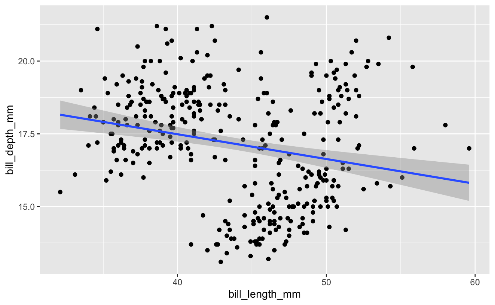
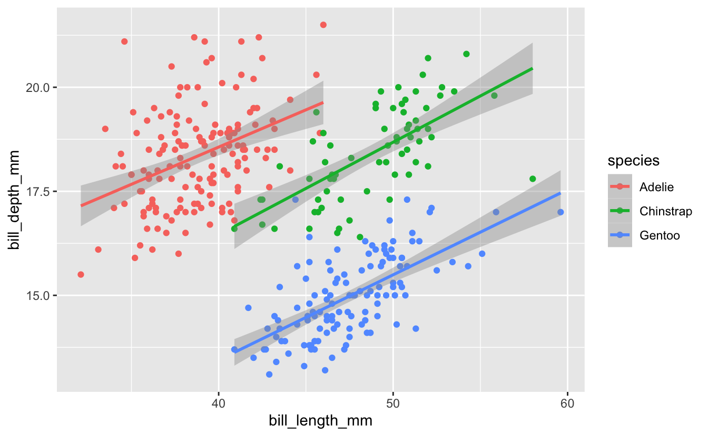
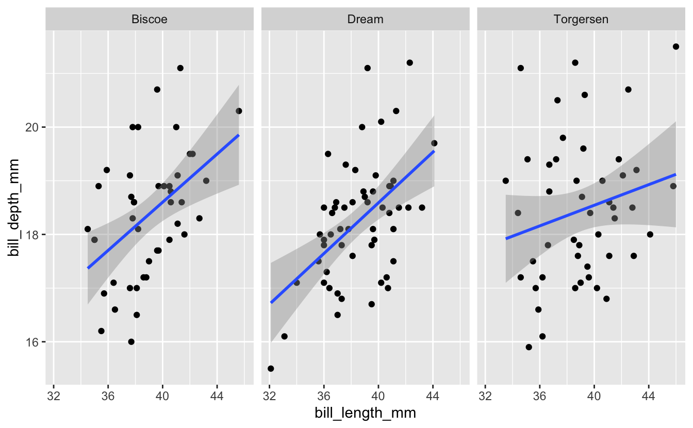
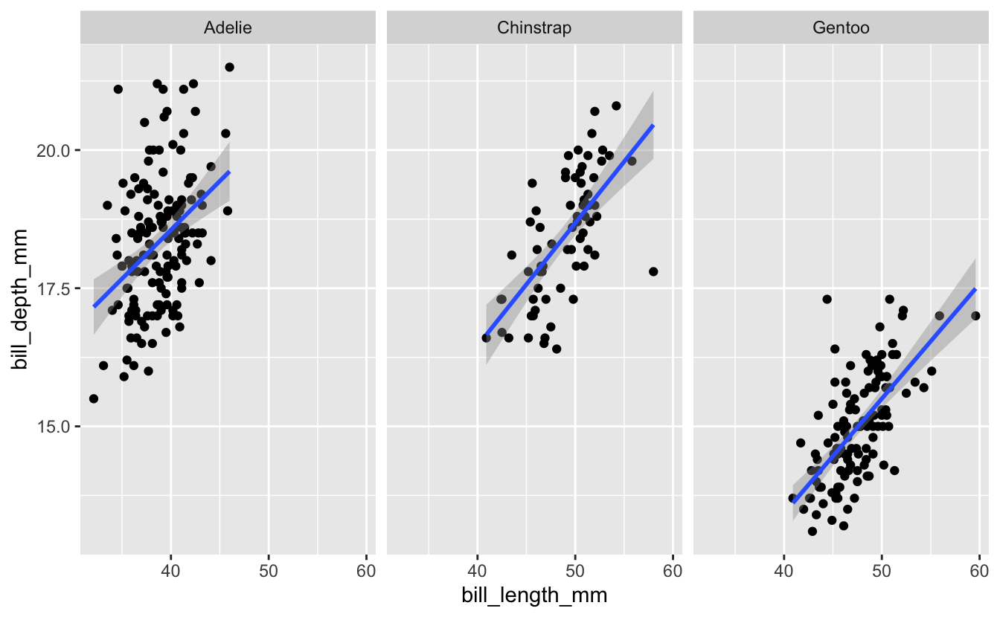
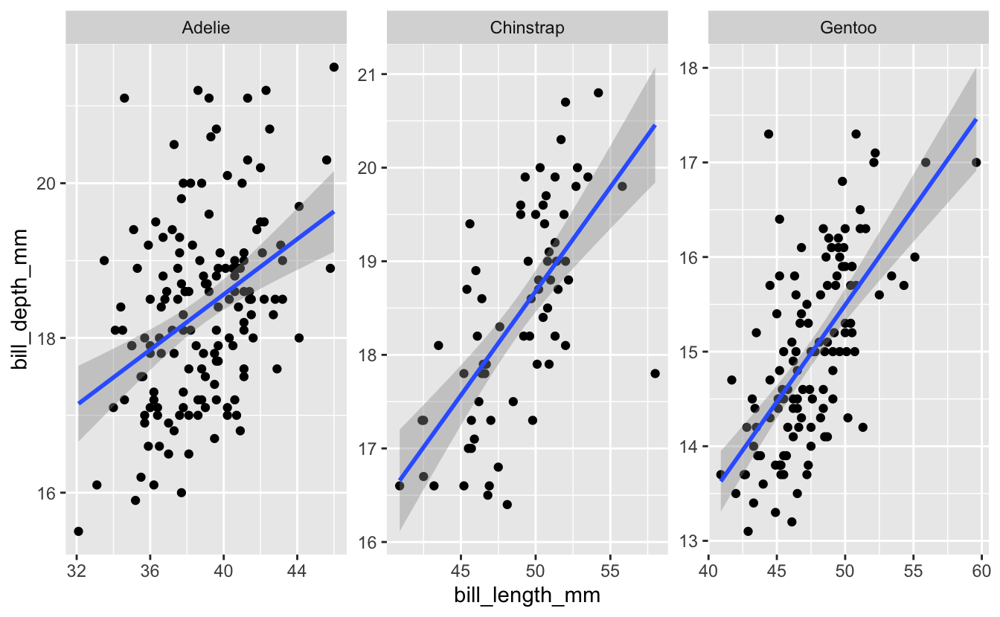

 

## Learning objectives

> -   Continue to practice creating plots with ggplot
> -   Use faceting to divide a plot into multiple panels according to some variable.
> -   Arrange multiple plots of different types on a single figure.

 

------------------------------------------------------------------------

## 1 -- Intro

We'll continue with our theme on plotting by exploring some options for arranging multiple plots on a single figure. A couple scenarios where you might want to do this...

1.) You create a plot that needs to be subdivided according to some variable, possibly because accounting for that variable is important for the interpretation, or maybe there's just too much on one plot and it helps to split the data up according to some factor.

2.) You have a series of different plots that all address some related question, maybe each in a slightly different way, and you want to present them all in one figure.

We'll take a couple approaches during this and next week's sessions to deal with these two scenarios. Today we'll look at some *ggplot* functions like `facet_wrap()` and `facet_grid()` that allow us to easily deal with scenario 1. Then in the next session we'll try a separate package, *patchwork*, that offers one good option for scenario 2.

Like in previous sessions, we'll use some packages from the *tidyverse* and also the *palmerpenguins* dataset. If you haven't installed either of those yet, you can do so with the following commands. If you installed them previously, you can just run the latter of the commands ([`library()`](https://rdrr.io/r/base/library.html)) to load them for the current session.

<pre class='chroma'><code class='language-r' data-lang='r'><a href='https://rdrr.io/r/utils/install.packages.html'>install.packages</a>("tidyverse")
<a href='https://rdrr.io/r/utils/install.packages.html'>install.packages</a>("palmerpenguins")
</code></pre>

<pre class='chroma'><code class='language-r' data-lang='r'><a href='https://rdrr.io/r/base/library.html'>library</a>(<a href='https://allisonhorst.github.io/palmerpenguins/'>palmerpenguins</a>)
<a href='https://rdrr.io/r/base/library.html'>library</a>(<a href='https://tidyverse.tidyverse.org'>tidyverse</a>)
</code></pre>

And now let's preview/explore the penguins dataset just to remind ourselves of what's in there...

<pre class='chroma'><code class='language-r' data-lang='r'><a href='https://rdrr.io/r/utils/head.html'>head</a>(penguins)

#&gt; # A tibble: 6 x 8
#&gt;   species island bill_length_mm bill_depth_mm flipper_length_… body_mass_g sex  
#&gt;   &lt;fct&gt;   &lt;fct&gt;           &lt;dbl&gt;         &lt;dbl&gt;            &lt;int&gt;       &lt;int&gt; &lt;fct&gt;
#&gt; 1 Adelie  Torge…           39.1          18.7              181        3750 male 
#&gt; 2 Adelie  Torge…           39.5          17.4              186        3800 fema…
#&gt; 3 Adelie  Torge…           40.3          18                195        3250 fema…
#&gt; 4 Adelie  Torge…           NA            NA                 NA          NA NA   
#&gt; 5 Adelie  Torge…           36.7          19.3              193        3450 fema…
#&gt; 6 Adelie  Torge…           39.3          20.6              190        3650 male 
#&gt; # … with 1 more variable: year &lt;int&gt;

<a href='https://rdrr.io/r/base/summary.html'>summary</a>(penguins)

#&gt;       species          island    bill_length_mm  bill_depth_mm  
#&gt;  Adelie   :152   Biscoe   :168   Min.   :32.10   Min.   :13.10  
#&gt;  Chinstrap: 68   Dream    :124   1st Qu.:39.23   1st Qu.:15.60  
#&gt;  Gentoo   :124   Torgersen: 52   Median :44.45   Median :17.30  
#&gt;                                  Mean   :43.92   Mean   :17.15  
#&gt;                                  3rd Qu.:48.50   3rd Qu.:18.70  
#&gt;                                  Max.   :59.60   Max.   :21.50  
#&gt;                                  NA's   :2       NA's   :2      
#&gt;  flipper_length_mm  body_mass_g       sex           year     
#&gt;  Min.   :172.0     Min.   :2700   female:165   Min.   :2007  
#&gt;  1st Qu.:190.0     1st Qu.:3550   male  :168   1st Qu.:2007  
#&gt;  Median :197.0     Median :4050   NA's  : 11   Median :2008  
#&gt;  Mean   :200.9     Mean   :4202                Mean   :2008  
#&gt;  3rd Qu.:213.0     3rd Qu.:4750                3rd Qu.:2009  
#&gt;  Max.   :231.0     Max.   :6300                Max.   :2009  
#&gt;  NA's   :2         NA's   :2
</code></pre>

## 2 -- Faceting

Let's start by revisiting some plots Michael Broe created in his intro to ggplot a couple sessions ago. He was using the plots to investigate whether a relationship exists between the variables *bill length* and *bill depth* in these penguins. A scatterplot with a line of best fit from *ggplot*...

<pre class='chroma'><code class='language-r' data-lang='r'>penguins %&gt;% 
  ggplot(aes(x = bill_length_mm, y = bill_depth_mm)) +
  geom_point() +
  geom_smooth(method = "lm")

#&gt; `geom_smooth()` using formula 'y ~ x'

#&gt; Warning: Removed 2 rows containing non-finite values (stat_smooth).

#&gt; Warning: Removed 2 rows containing missing values (geom_point).

</code></pre>

As Michael pointed out previously, mapping an additional aesthetic (color) to the variable *species* helps us see a relationship a little more clearly...

<pre class='chroma'><code class='language-r' data-lang='r'>penguins %&gt;% 
  ggplot(aes(x = bill_length_mm, y = bill_depth_mm, color = species)) +
  geom_point() +
  geom_smooth(method = "lm")

#&gt; `geom_smooth()` using formula 'y ~ x'

#&gt; Warning: Removed 2 rows containing non-finite values (stat_smooth).

#&gt; Warning: Removed 2 rows containing missing values (geom_point).

</code></pre>

The color aesthetic partitions the data according to some variable (in this case, species), and here helps add important information to the visualization. An alternative might be to plot the data in separate panels, with each corresponding to a different species. We can do that with either of two functions from ggplot, `facet_wrap()` or `facet_grid()`. Let's start with `facet_wrap()`. This is added as an additional layer to the plot, and indicates one or more variables that will be used to split the data into separate panels. I'll facet here by species.

<pre class='chroma'><code class='language-r' data-lang='r'>penguins %&gt;% 
  ggplot(aes(x = bill_length_mm, y = bill_depth_mm)) +
  geom_point() +
  geom_smooth(method = "lm") +
  facet_wrap("species")

#&gt; `geom_smooth()` using formula 'y ~ x'

#&gt; Warning: Removed 2 rows containing non-finite values (stat_smooth).

#&gt; Warning: Removed 2 rows containing missing values (geom_point).

</code></pre>

The effect here is similar to what we did with adding a color aesthetic to the *species* variable earlier - it allows us to evaluate the relationship between bill length and bill depth for each species separately.

------------------------------------------------------------------------

### Breakout Rooms: Faceting

#### Exercise 1: Analyze Adelie Penguins By Island

Try analyzing the relationship between bill length and bill depth for just the Adelie penguins (the only species with observations from each of the three islands). For this species, try faceting by island. Does the relationship seem to be consistent across all islands?

<b>Hint</b> (click here)

  Use [`filter()`](https://rdrr.io/r/stats/filter.html) to select out Adelie penguins, then create a plot similar to the one in the example, but facet on *island* instead of *species*  

<b>Solution</b> (click here)

<pre class='chroma'><code class='language-r' data-lang='r'>penguins %&gt;%
  <a href='https://rdrr.io/r/stats/filter.html'>filter</a>(species == "Adelie") %&gt;%
  ggplot(aes(x = bill_length_mm, y = bill_depth_mm)) +
  geom_point() +
  geom_smooth(method = "lm") +
  facet_wrap("island")

#&gt; `geom_smooth()` using formula 'y ~ x'

#&gt; Warning: Removed 1 rows containing non-finite values (stat_smooth).

#&gt; Warning: Removed 1 rows containing missing values (geom_point).

</code></pre>

#### Exercise 2a: Multiple Facets

Now building on the plot you just created for Adelie Penguins, what if you wanted to facet on not just *island*, but a combination of *island* and *sex*? Give it a try.

<b>Hint</b> (click here)

  `facet_wrap()` accepts a character vector of column names. Use the c() function to provide a vector with two column names.  

<b>Solution</b> (click here)

<pre class='chroma'><code class='language-r' data-lang='r'>penguins %&gt;% 
  <a href='https://rdrr.io/r/stats/filter.html'>filter</a>(species == "Adelie") %&gt;%
  ggplot(aes(x = bill_length_mm, y = bill_depth_mm)) +
  geom_point() +
  geom_smooth(method = "lm") +
  facet_wrap(<a href='https://rdrr.io/r/base/c.html'>c</a>("island", "sex"))

#&gt; `geom_smooth()` using formula 'y ~ x'

#&gt; Warning: Removed 1 rows containing non-finite values (stat_smooth).

#&gt; Warning: Removed 1 rows containing missing values (geom_point).

</code></pre>

#### Exercise 2b: Multiple Facets

There are some facets coming through in that last plot that are based on NA's. Try getting rid of all observations that include missing data before creating the plot.

<b>Hint</b> (click here)

  Use the `drop_na()` function to remove observations with NA before calling ggplot.  

<b>Solution</b> (click here)

<pre class='chroma'><code class='language-r' data-lang='r'>penguins %&gt;% 
  drop_na() %&gt;%
  <a href='https://rdrr.io/r/stats/filter.html'>filter</a>(species == "Adelie") %&gt;%
  ggplot(aes(x = bill_length_mm, y = bill_depth_mm)) +
  geom_point() +
  geom_smooth(method = "lm") +
  facet_wrap(<a href='https://rdrr.io/r/base/c.html'>c</a>("island", "sex"))

#&gt; `geom_smooth()` using formula 'y ~ x'

</code></pre>

#### Exercise 3: Axis Scales

Now let's go back to the full dataset where we faceted by species. The code we used (with the `drop_na` function added), along with its associated plot, are below...

<pre class='chroma'><code class='language-r' data-lang='r'>penguins %&gt;% 
  drop_na() %&gt;%
  ggplot(aes(x = bill_length_mm, y = bill_depth_mm)) +
  geom_point() +
  geom_smooth(method = "lm") +
  facet_wrap("species")

#&gt; `geom_smooth()` using formula 'y ~ x'

</code></pre>

Use the help page for `facet_wrap` to look in to the *scales* option. Try changing the value of this option to see what effect it has on the plot.

<b>Hint 1</b> (click here)

  Use `?facet_wrap` to get the help page for the function, and find information about the *scales* option.  

<b>Hint 2</b> (click here)

  Within the `facet_wrap()` function, set scales = "free_y".  

<b>Solution</b> (click here)

<pre class='chroma'><code class='language-r' data-lang='r'>penguins %&gt;% 
  ggplot(aes(x = bill_length_mm, y = bill_depth_mm)) +
  geom_point() +
  geom_smooth(method = "lm") +
  facet_wrap("species", scales = "free")

#&gt; `geom_smooth()` using formula 'y ~ x'

#&gt; Warning: Removed 2 rows containing non-finite values (stat_smooth).

#&gt; Warning: Removed 2 rows containing missing values (geom_point).

</code></pre>

 

------------------------------------------------------------------------

In next week's session, we'll use `facet_grid()`, which has some similarities to `facet_wrap()`, and then check out the *patchwork* package, which gives you more control over how multiple plots are combined in a single figure.

