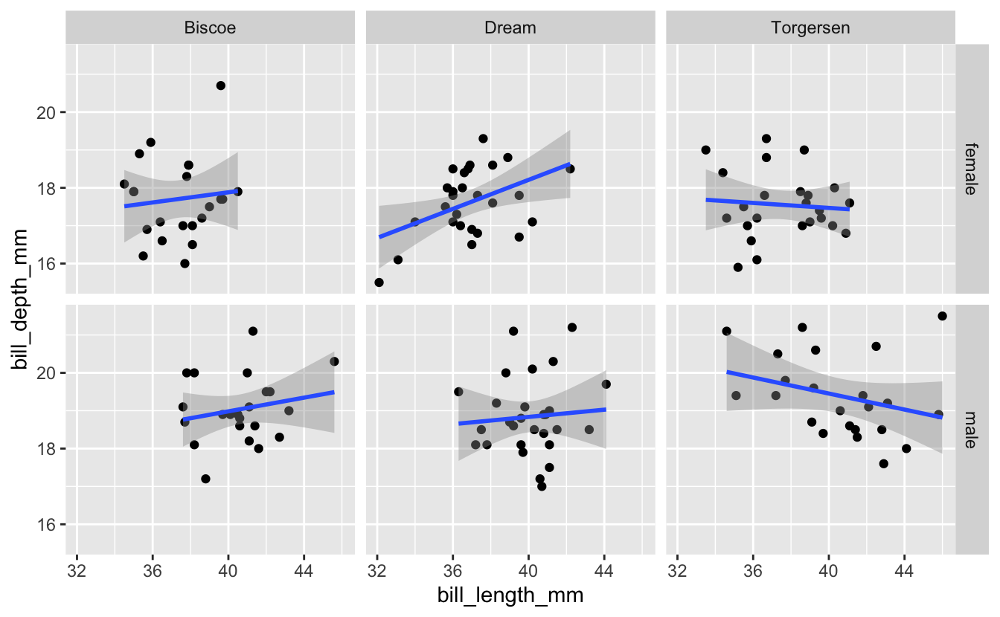

 

## Learning objectives

> -   Continue to practice creating plots with ggplot
> -   Use faceting to divide a plot into multiple panels according to some variable.
> -   Arrange multiple plots of different types on a single figure.

 

------------------------------------------------------------------------

## 1 -- Intro

We'll continue in our theme on plotting by exploring some options for arranging multiple plots on a single figure. A couple scenarios where you might want to do this...

1.) You create a plot that needs to be subdivided according to some variable, possibly because accounting for that variable is important for the interpretation, or maybe there's just too much on one plot and it helps to split the data up according to some factor.

2.) You have a series of different plots that all address some related question, maybe each in a slightly different way, and you want to present them all in one figure.

We'll take a couple approaches during today's session to deal with these two scenarios. First, we'll look at some *ggplot* functions like `facet_wrap()` and `facet_grid()` that allow us to easily deal with scenario 1. Then we'll try a separate package, *patchwork*, that provides one good option for scenario 2.

Like in previous sessions, we'll use some packages from the *tidyverse* and also the *palmerpenguins* dataset. If you haven't installed either of those yet, you can do so with the following commands. If you installed them previously, you can just run the latter of the commands (library) to load them for the current session.

<pre class='chroma'><code class='language-r' data-lang='r'><a href='https://rdrr.io/r/utils/install.packages.html'>install.packages</a>("tidyverse")
<a href='https://rdrr.io/r/utils/install.packages.html'>install.packages</a>("palmerpenguins")
</code></pre>

<pre class='chroma'><code class='language-r' data-lang='r'><a href='https://rdrr.io/r/base/library.html'>library</a>(<a href='https://allisonhorst.github.io/palmerpenguins/'>palmerpenguins</a>)
<a href='https://rdrr.io/r/base/library.html'>library</a>(<a href='https://tidyverse.tidyverse.org'>tidyverse</a>)
</code></pre>

## 2 -- Faceting

Let's start by revisiting some plots Michael Broe created in his intro to ggplot a couple sessions ago. He was using the plots to investigate whether a relationship exists between the variables *bill length* and *bill depth* in these penguins. A scatterplot with a line of best fit from *ggplot*...

<pre class='chroma'><code class='language-r' data-lang='r'>penguins %&gt;% 
  drop_na() %&gt;%
  ggplot(aes(x = bill_length_mm, y = bill_depth_mm)) +
  geom_point() +
  geom_smooth(method = "lm")

#&gt; `geom_smooth()` using formula 'y ~ x'

</code></pre>

As Michael pointed out previously, mapping an additional aesthetic (color) to the variable *species* helps us see a relationship a little more clearly...

<pre class='chroma'><code class='language-r' data-lang='r'>penguins %&gt;% 
  drop_na() %&gt;%
  ggplot(aes(x = bill_length_mm, y = bill_depth_mm, color = species)) +
  geom_point() +
  geom_smooth(method = "lm")

#&gt; `geom_smooth()` using formula 'y ~ x'

</code></pre>

The color aesthetic partitions the data according to some variable (in this case, species), and here helps add important information to the visualization. An alternative might be to plot the data in separate panels, with each corresponding to a different species. We can do that with either of two functions from ggplot, `facet_wrap()` or `facet_grid()`. Let's start with `facet_wrap()`. This is added as an additional layer to the plot, and indicates one or more variables that will be used to split the data into separate panels. I'll facet here by species.

<pre class='chroma'><code class='language-r' data-lang='r'>penguins %&gt;% 
  drop_na() %&gt;%
  ggplot(aes(x = bill_length_mm, y = bill_depth_mm)) +
  geom_point() +
  geom_smooth(method = "lm") +
  facet_wrap("species")

#&gt; `geom_smooth()` using formula 'y ~ x'

</code></pre>

The effect here is similar to what we did with adding a color aesthetic to the *species* variable earlier - it allows us to evaluate the relationship between bill length and bill depth for each species separately.

------------------------------------------------------------------------

### Breakout Rooms I: Faceting

#### Exercise 1: Analyze Adelie Penguins By Island

Try analyzing just the data for Adelie penguins (the only species with observations from each of the three islands). For this species, try faceting by island. Does the relationship seem to be consistent across all islands?

<b>Hint</b> (click here)

  Use [`filter()`](https://rdrr.io/r/stats/filter.html) to select out Adelie penguins, then create a plot similar to the one in the example, but facet on *island* instead of *species*  

<b>Solution</b> (click here)

<pre class='chroma'><code class='language-r' data-lang='r'>penguins %&gt;%
  drop_na() %&gt;%
  <a href='https://rdrr.io/r/stats/filter.html'>filter</a>(species == "Adelie") %&gt;%
  ggplot(aes(x = bill_length_mm, y = bill_depth_mm)) +
  geom_point() +
  geom_smooth(method = "lm") +
  facet_wrap("island")

#&gt; `geom_smooth()` using formula 'y ~ x'

</code></pre>

#### Exercise 2a: Multiple Facets

Now building on the plot you just created for Adelie Penguins, what if you wanted to facet on not just *island*, but a combination of *island* and *sex*? Give it a try.

<b>Hint</b> (click here)

  `facet_wrap()` accepts a character vector of column names. Use the c() function to provide a vector with two column names.  

<b>Solution</b> (click here)

<pre class='chroma'><code class='language-r' data-lang='r'>penguins %&gt;% 
  <a href='https://rdrr.io/r/stats/filter.html'>filter</a>(species == "Adelie") %&gt;%
  ggplot(aes(x = bill_length_mm, y = bill_depth_mm)) +
  geom_point() +
  geom_smooth(method = "lm") +
  facet_wrap(<a href='https://rdrr.io/r/base/c.html'>c</a>("island", "sex"))

#&gt; `geom_smooth()` using formula 'y ~ x'

#&gt; Warning: Removed 1 rows containing non-finite values (stat_smooth).

#&gt; Warning: Removed 1 rows containing missing values (geom_point).

</code></pre>

#### Exercise 2b: Multiple Facets

There are some facets coming through in that last plot that are based on NA's. Try getting rid of all observations that include missing data before creating the plot.

<b>Hint</b> (click here)

  Use the `drop_na()` function to remove observations with NA before calling ggplot.  

<b>Solution</b> (click here)

<pre class='chroma'><code class='language-r' data-lang='r'>penguins %&gt;% 
  drop_na() %&gt;%
  <a href='https://rdrr.io/r/stats/filter.html'>filter</a>(species == "Adelie") %&gt;%
  ggplot(aes(x = bill_length_mm, y = bill_depth_mm)) +
  geom_point() +
  geom_smooth(method = "lm") +
  facet_wrap(<a href='https://rdrr.io/r/base/c.html'>c</a>("island", "sex"))

#&gt; `geom_smooth()` using formula 'y ~ x'

</code></pre>

#### Exercise 3: Axis Scales

Now let's go back to the full dataset where we faceted by species. The code we used, along with its associated plot, are below...

<pre class='chroma'><code class='language-r' data-lang='r'>penguins %&gt;% 
  drop_na() %&gt;%
  ggplot(aes(x = bill_length_mm, y = bill_depth_mm)) +
  geom_point() +
  geom_smooth(method = "lm") +
  facet_wrap("species")

#&gt; `geom_smooth()` using formula 'y ~ x'

</code></pre>

Use the help page for `facet_wrap` to look in to the *scales* option. Try changing the value of this option to see what effect it has on the plot.

<b>Hint</b> (click here)

  Within the `facet_wrap()` function, set scales = "free_y".  

<b>Solution</b> (click here)

<pre class='chroma'><code class='language-r' data-lang='r'>penguins %&gt;% 
  ggplot(aes(x = bill_length_mm, y = bill_depth_mm)) +
  geom_point() +
  geom_smooth(method = "lm") +
  facet_wrap("species", scales = "free")

#&gt; `geom_smooth()` using formula 'y ~ x'

#&gt; Warning: Removed 2 rows containing non-finite values (stat_smooth).

#&gt; Warning: Removed 2 rows containing missing values (geom_point).

</code></pre>

 

------------------------------------------------------------------------

## 3 -- Grids

In the breakout room, we tried faceting by two variables. While you can do this, `facet_wrap()` really is best suited for faceting on one variable. When you want to partition things based on more than one variable, `facet_grid()` might be a better option. Below, I'll create a plot similar to the one in the breakout room where we faceted on a combination of *island* and *sex*, but will do it with `facet_grid()` instead...

<pre class='chroma'><code class='language-r' data-lang='r'>penguins %&gt;% 
  drop_na() %&gt;%
  <a href='https://rdrr.io/r/stats/filter.html'>filter</a>(species == "Adelie") %&gt;%
  ggplot(aes(x = bill_length_mm, y = bill_depth_mm)) +
  geom_point() +
  geom_smooth(method = "lm") +
  facet_grid(rows = vars(sex), cols = vars(island))

#&gt; `geom_smooth()` using formula 'y ~ x'

</code></pre>

This plot's a little cleaner than what we created with `facet_wrap()`, which looked like...

<pre class='chroma'><code class='language-r' data-lang='r'>penguins %&gt;% 
  drop_na() %&gt;%
  <a href='https://rdrr.io/r/stats/filter.html'>filter</a>(species == "Adelie") %&gt;%
  ggplot(aes(x = bill_length_mm, y = bill_depth_mm)) +
  geom_point() +
  geom_smooth(method = "lm") +
  facet_wrap(<a href='https://rdrr.io/r/base/c.html'>c</a>("island", "sex"))

#&gt; `geom_smooth()` using formula 'y ~ x'

</code></pre>

------------------------------------------------------------------------

## 4 -- Multi-Panel Plots: Patchwork

The faceting above works when you want to partition the plots based on one or more variables in the dataset. But if you want to just arrange different plots into one figure, possibly even different types of plots, one good option is the *patchwork* package. Let's install and load it...

<pre class='chroma'><code class='language-r' data-lang='r'><a href='https://rdrr.io/r/utils/install.packages.html'>install.packages</a>("patchwork")
</code></pre>

<pre class='chroma'><code class='language-r' data-lang='r'><a href='https://rdrr.io/r/base/library.html'>library</a>(<a href='https://patchwork.data-imaginist.com'>patchwork</a>)
</code></pre>

With *patchwork*, you create and save each plot as a separate object. Then, once you've made the plots, you just tell patchwork how to arrange them. The syntax to define the layout is based on common mathematical operators.

Some examples:

-   `plot1 + plot2` puts two plots side-by-side
-   `plot1 / plot2` stacks two plots vertically
-   `plot1 / (plot2 + plot3)` gives plot1 on a top row, and plots 2 and 3 on a bottom row

In the examples above, *plot1*, *plot2*, and *plot3* represent plots that have been saved as objects with those names.

Below is an example from *palmerpenguins*. First we create the plots, saving each as a new object...

<pre class='chroma'><code class='language-r' data-lang='r'>avg_island_lgth &lt;- penguins %&gt;%
  drop_na() %&gt;%
  group_by(island) %&gt;%
  summarize("mean_bill_length" = <a href='https://rdrr.io/r/base/mean.html'>mean</a>(bill_length_mm)) %&gt;%
  ggplot(aes(x = island, y = mean_bill_length)) +
  geom_col() +
  ggtitle("Average Penguin Bill Length")

mass_by_sex &lt;- penguins %&gt;%
  drop_na() %&gt;%
  ggplot(aes(x = sex, y = body_mass_g)) +
  geom_boxplot() +
  ggtitle("Effect of Sex on Penguin Size")

lgth_by_depth &lt;- penguins %&gt;% 
  drop_na() %&gt;%
  ggplot(aes(x = bill_length_mm, y = bill_depth_mm)) +
  geom_point() +
  geom_smooth(method = "lm") +
  facet_wrap("species") +
  ggtitle("Relationship Between Bill Length and Bill Depth")
</code></pre>

Then we simply use the patchwork syntax to define how these 3 plots will be arranged. In this case, the first (faceted) plot on top, with the other two side-by-side below it...

<pre class='chroma'><code class='language-r' data-lang='r'>lgth_by_depth / (avg_island_lgth + mass_by_sex)

#&gt; `geom_smooth()` using formula 'y ~ x'

</code></pre>

------------------------------------------------------------------------

### Breakout Rooms II: Combining Plots

Use the palmerpenguin data to try to create the plot below...

<b>Hints</b> (click here)

  1.) For the boxplot, R initially interprets the *year* variable as a continuous variable. Boxplots need a discrete x axis. Convert that variable to character or factor. You can use `mutate` along with `as.character` or `as.factor`.  
2.) For the formatting, try `theme_classic()` 3.) The title and axis labels can be specified with `labs()`, among other options.  

<b>Solution</b> (click here)

<pre class='chroma'><code class='language-r' data-lang='r'>bill_flipper &lt;- penguins %&gt;%
  drop_na() %&gt;%
  ggplot(aes(x = bill_length_mm, y = flipper_length_mm)) +
  geom_point() +
  facet_wrap("species") +
  geom_smooth(method = "lm") +
  theme_classic() +
  labs(title = "Relationship Between Bill Length and Flipper Length",
       x = "Bill Length (mm)",
       y = "Flipper Length (mm)")
  
mass_yr &lt;- penguins %&gt;%
  drop_na() %&gt;%
  mutate("year" = <a href='https://rdrr.io/r/base/character.html'>as.character</a>(year)) %&gt;%
  ggplot(aes(x = year, y = body_mass_g)) +
  geom_boxplot() + 
  theme_classic() +
  labs(title = "Penguin Size Over Time",
       x = "Body Mass (g)",
       y = "Year")

bill_flipper / mass_yr + 
  <a href='https://patchwork.data-imaginist.com/reference/plot_annotation.html'>plot_annotation</a>(tag_levels = 'A')
</code></pre>

 

------------------------------------------------------------------------

