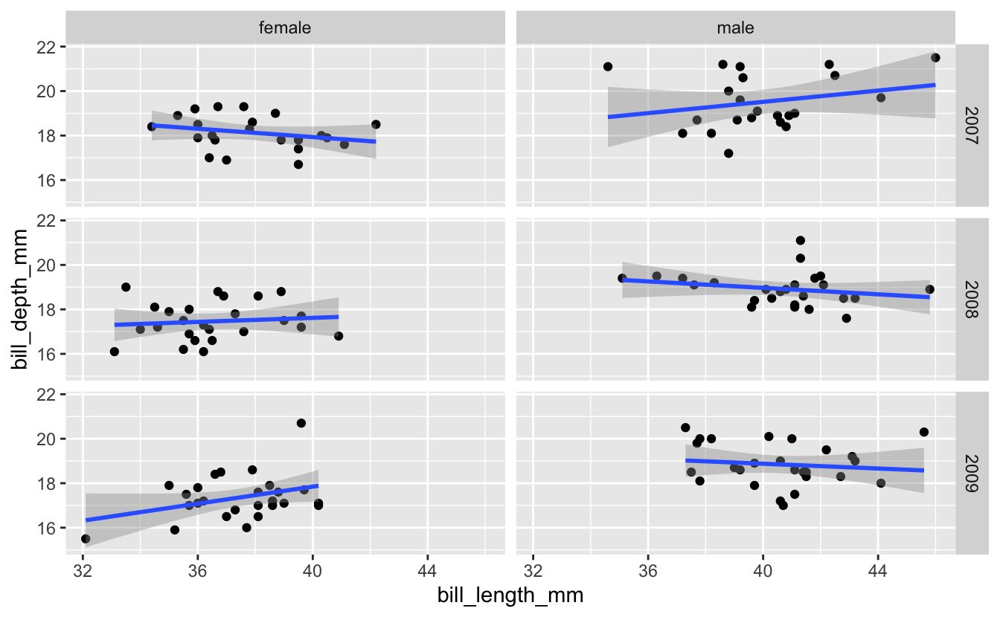
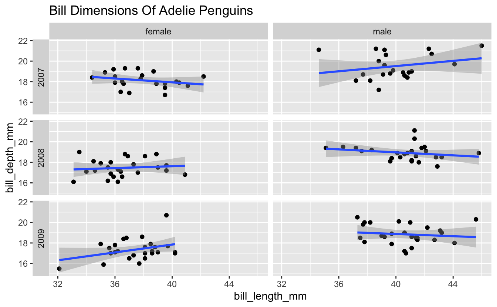

 

## Learning objectives

> -   Continue to practice creating plots with ggplot
> -   Compare the ggplot functions `facet_grid()` and `facet_wrap()`
> -   Arrange multiple plots of different types on a single figure

 

------------------------------------------------------------------------

## 1 -- Intro

In the previous session we worked with the `facet_wrap()` function from ggplot, which allowed us to use some variable (column) in the dataset to partition data into multiple panels of a single plot. In this session, we'll see how the `facet_wrap()` approach compares to a similar function, `facet_grid()`, and also explore the *patchwork* package, which offers more control and flexibility in arranging multiple plots in a single figure.

We'll continue to use *tidyverse* functions and data from *palmerpenguins*, so install those if you need to. If you already have them installed, just load them into your current R session with the [`library()`](https://rdrr.io/r/base/library.html) functions below...

<pre class='chroma'><code class='language-r' data-lang='r'><a href='https://rdrr.io/r/utils/install.packages.html'>install.packages</a>("tidyverse")
<a href='https://rdrr.io/r/utils/install.packages.html'>install.packages</a>("palmerpenguins")
</code></pre>

<pre class='chroma'><code class='language-r' data-lang='r'><a href='https://rdrr.io/r/base/library.html'>library</a>(<a href='https://allisonhorst.github.io/palmerpenguins/'>palmerpenguins</a>)
<a href='https://rdrr.io/r/base/library.html'>library</a>(<a href='https://tidyverse.tidyverse.org'>tidyverse</a>)
</code></pre>

And now let's preview/explore the penguins dataset just to remind ourselves of what's in there...

<pre class='chroma'><code class='language-r' data-lang='r'><a href='https://rdrr.io/r/utils/head.html'>head</a>(penguins)

#&gt; # A tibble: 6 x 8
#&gt;   species island bill_length_mm bill_depth_mm flipper_length_… body_mass_g sex  
#&gt;   &lt;fct&gt;   &lt;fct&gt;           &lt;dbl&gt;         &lt;dbl&gt;            &lt;int&gt;       &lt;int&gt; &lt;fct&gt;
#&gt; 1 Adelie  Torge…           39.1          18.7              181        3750 male 
#&gt; 2 Adelie  Torge…           39.5          17.4              186        3800 fema…
#&gt; 3 Adelie  Torge…           40.3          18                195        3250 fema…
#&gt; 4 Adelie  Torge…           NA            NA                 NA          NA NA   
#&gt; 5 Adelie  Torge…           36.7          19.3              193        3450 fema…
#&gt; 6 Adelie  Torge…           39.3          20.6              190        3650 male 
#&gt; # … with 1 more variable: year &lt;int&gt;

<a href='https://rdrr.io/r/base/summary.html'>summary</a>(penguins)

#&gt;       species          island    bill_length_mm  bill_depth_mm  
#&gt;  Adelie   :152   Biscoe   :168   Min.   :32.10   Min.   :13.10  
#&gt;  Chinstrap: 68   Dream    :124   1st Qu.:39.23   1st Qu.:15.60  
#&gt;  Gentoo   :124   Torgersen: 52   Median :44.45   Median :17.30  
#&gt;                                  Mean   :43.92   Mean   :17.15  
#&gt;                                  3rd Qu.:48.50   3rd Qu.:18.70  
#&gt;                                  Max.   :59.60   Max.   :21.50  
#&gt;                                  NA's   :2       NA's   :2      
#&gt;  flipper_length_mm  body_mass_g       sex           year     
#&gt;  Min.   :172.0     Min.   :2700   female:165   Min.   :2007  
#&gt;  1st Qu.:190.0     1st Qu.:3550   male  :168   1st Qu.:2007  
#&gt;  Median :197.0     Median :4050   NA's  : 11   Median :2008  
#&gt;  Mean   :200.9     Mean   :4202                Mean   :2008  
#&gt;  3rd Qu.:213.0     3rd Qu.:4750                3rd Qu.:2009  
#&gt;  Max.   :231.0     Max.   :6300                Max.   :2009  
#&gt;  NA's   :2         NA's   :2
</code></pre>

## 2 -- Review Of `facet_wrap()`

Last week we started with a plot Michael Broe had previously constructed...

<pre class='chroma'><code class='language-r' data-lang='r'>penguins %&gt;% 
  drop_na() %&gt;%
  ggplot(aes(x = bill_length_mm, y = bill_depth_mm, color = species)) +
  geom_point() +
  geom_smooth(method = "lm")

#&gt; `geom_smooth()` using formula 'y ~ x'

</code></pre>

We then used `facet_wrap()` to present the data for the three species in separate panels, in place of using color...

<pre class='chroma'><code class='language-r' data-lang='r'>penguins %&gt;% 
  drop_na() %&gt;%
  ggplot(aes(x = bill_length_mm, y = bill_depth_mm)) +
  geom_point() +
  geom_smooth(method = "lm") +
  facet_wrap(vars(species))

#&gt; `geom_smooth()` using formula 'y ~ x'

</code></pre>

Then as part of the breakout rooms, we tried faceting on more than one variable - we subsetted the dataset for only Adelie penguins, then plotted the relationship between bill length and bill depth faceted across both *island* and *sex*...

<pre class='chroma'><code class='language-r' data-lang='r'>penguins %&gt;% 
  drop_na() %&gt;%
  <a href='https://rdrr.io/r/stats/filter.html'>filter</a>(species == "Adelie") %&gt;%
  ggplot(aes(x = bill_length_mm, y = bill_depth_mm)) +
  geom_point() +
  geom_smooth(method = "lm") +
  facet_wrap(vars(island, sex))

#&gt; `geom_smooth()` using formula 'y ~ x'

</code></pre>

## 3 -- `facet_grid()`

While you can use `facet_wrap()` as above, `facet_grid()` is often a better option when faceting on two variables. Here's what the example above looks like with `facet_grid()`...

<pre class='chroma'><code class='language-r' data-lang='r'>penguins %&gt;% 
  drop_na() %&gt;%
  <a href='https://rdrr.io/r/stats/filter.html'>filter</a>(species == "Adelie") %&gt;%
  ggplot(aes(x = bill_length_mm, y = bill_depth_mm)) +
  geom_point() +
  geom_smooth(method = "lm") +
  facet_grid(rows = vars(sex), cols = vars(island))

#&gt; `geom_smooth()` using formula 'y ~ x'

</code></pre>

Notice that with `facet_grid()` we specify which variable defines the rows and which variable defines the columns.

------------------------------------------------------------------------

### Breakout Rooms I: Facet Grids

#### Exercise 1

Try analyzing the relationship between Adelie penguin bill length and bill depth separately for each combination of *year* and *sex*. Make the columns represent male/female, and the rows represent the different years (in this case, 2007-2009).

<b>Hint</b> (click here)

  Use [`filter()`](https://rdrr.io/r/stats/filter.html) to select out Adelie penguins, then create a scatter plot similar to the one in the `facet_grid()` example. Assign the rows as *year* and the columns as *sex*.  

<b>Solution</b> (click here)

<pre class='chroma'><code class='language-r' data-lang='r'>penguins %&gt;% 
  drop_na() %&gt;%
  <a href='https://rdrr.io/r/stats/filter.html'>filter</a>(species == "Adelie") %&gt;%
  ggplot(aes(x = bill_length_mm, y = bill_depth_mm)) +
  geom_point() +
  geom_smooth(method = "lm") +
  facet_grid(rows = vars(year), cols = vars(sex))

#&gt; `geom_smooth()` using formula 'y ~ x'

</code></pre>

#### Exercise 2

Now let's modify the plot you just created a bit. Add the title "Bill Dimensions Of Adelie Penguins", and move the year labels from the right side to the left side of the plot.

<b>Hint</b> (click here)

  Check out the *switch* option in the `facet_grid()` documentation for moving the year labels. For the title, consider `labs()` or `ggtitle()`.  

<b>Solution</b> (click here)

<pre class='chroma'><code class='language-r' data-lang='r'>penguins %&gt;% 
  drop_na() %&gt;%
  <a href='https://rdrr.io/r/stats/filter.html'>filter</a>(species == "Adelie") %&gt;%
  ggplot(aes(x = bill_length_mm, y = bill_depth_mm)) +
  geom_point() +
  geom_smooth(method = "lm") +
  facet_grid(rows = vars(year), cols = vars(sex), switch = "y") +
  ggtitle("Bill Dimensions Of Adelie Penguins")

#&gt; `geom_smooth()` using formula 'y ~ x'

</code></pre>

------------------------------------------------------------------------

## 4 -- Multi-Panel Plots: Patchwork

Faceting with `facet_wrap()` or `facet_grid()` works when you want to partition the plots based on one or more variables in the dataset. But if you want to arrange multiple plots into one figure, possibly even different types of plots, one good option is the *patchwork* package. Let's install and load it...

<pre class='chroma'><code class='language-r' data-lang='r'><a href='https://rdrr.io/r/utils/install.packages.html'>install.packages</a>("patchwork")
</code></pre>

<pre class='chroma'><code class='language-r' data-lang='r'><a href='https://rdrr.io/r/base/library.html'>library</a>(<a href='https://patchwork.data-imaginist.com'>patchwork</a>)
</code></pre>

With *patchwork*, you create and save each plot as a separate object. Then, once you've made the plots, you just tell patchwork how to arrange them. The syntax to define the layout is based on common mathematical operators.

Some examples:

-   `plot1 + plot2` puts two plots side-by-side
-   `plot1 / plot2` stacks two plots vertically
-   `plot1 / (plot2 + plot3)` gives plot1 on a top row, and plots 2 and 3 on a bottom row

In the examples above, *plot1*, *plot2*, and *plot3* represent plots that have been saved as objects with those names.

Below is an example from *palmerpenguins*. First we create the plots, saving each as a new object...

<pre class='chroma'><code class='language-r' data-lang='r'>avg_island_lgth &lt;- penguins %&gt;%
  drop_na() %&gt;%
  group_by(island) %&gt;%
  summarize("mean_bill_length" = <a href='https://rdrr.io/r/base/mean.html'>mean</a>(bill_length_mm)) %&gt;%
  ggplot(aes(x = island, y = mean_bill_length)) +
  geom_col() +
  ggtitle("Average Penguin Bill Length")

mass_by_sex &lt;- penguins %&gt;%
  drop_na() %&gt;%
  ggplot(aes(x = sex, y = body_mass_g)) +
  geom_boxplot() +
  ggtitle("Effect of Sex on Penguin Size")

lgth_by_depth &lt;- penguins %&gt;% 
  drop_na() %&gt;%
  ggplot(aes(x = bill_length_mm, y = bill_depth_mm)) +
  geom_point() +
  geom_smooth(method = "lm") +
  facet_wrap("species") +
  ggtitle("Relationship Between Bill Length and Bill Depth")
</code></pre>

Then we simply use the patchwork syntax to define how these 3 plots will be arranged. In this case, the first (faceted) plot on top, with the other two side-by-side below it...

<pre class='chroma'><code class='language-r' data-lang='r'>lgth_by_depth / (avg_island_lgth + mass_by_sex)

#&gt; `geom_smooth()` using formula 'y ~ x'

</code></pre>

------------------------------------------------------------------------

### Breakout Rooms II: Combining Plots

Use the palmerpenguin data to try to create the plot below...

<b>Hint 1 (Boxplot)</b> (click here)

  For the boxplot, use `geom_boxplot()`.  

<b>Hint 2 (Boxplot)</b> (click here)

  Notice that R initially interprets the *year* variable as a continuous variable, but boxplots need a discrete x axis. Convert that variable to character or factor. You can use `mutate` along with `as.character` or `as.factor`.  

<b>Hint 3 (Plot Formatting)</b> (click here)

  For the formatting, try `theme_classic()`  

<b>Hint 4 (Labels 1)</b> (click here)

  The title and axis labels can be specified with `labs()`, among other options.  

<b>Hint 5 (Labels 2)</b> (click here)

  To get the 'A' and 'B' plot annotations, check out the help page for the [`plot_annotation()`](https://patchwork.data-imaginist.com/reference/plot_annotation.html) function within *patchwork*.  

<b>Solution</b> (click here)

<pre class='chroma'><code class='language-r' data-lang='r'>bill_flipper &lt;- penguins %&gt;%
  drop_na() %&gt;%
  ggplot(aes(x = bill_length_mm, y = flipper_length_mm)) +
  geom_point() +
  facet_wrap("species") +
  geom_smooth(method = "lm") +
  theme_classic() +
  labs(title = "Relationship Between Bill Length and Flipper Length",
       x = "Bill Length (mm)",
       y = "Flipper Length (mm)")
  
mass_yr &lt;- penguins %&gt;%
  drop_na() %&gt;%
  mutate("year" = <a href='https://rdrr.io/r/base/character.html'>as.character</a>(year)) %&gt;%
  ggplot(aes(x = year, y = body_mass_g)) +
  geom_boxplot() + 
  theme_classic() +
  labs(title = "Penguin Size Over Time",
       x = "Body Mass (g)",
       y = "Year")

bill_flipper / mass_yr + 
  <a href='https://patchwork.data-imaginist.com/reference/plot_annotation.html'>plot_annotation</a>(tag_levels = 'A')
</code></pre>

 

------------------------------------------------------------------------

