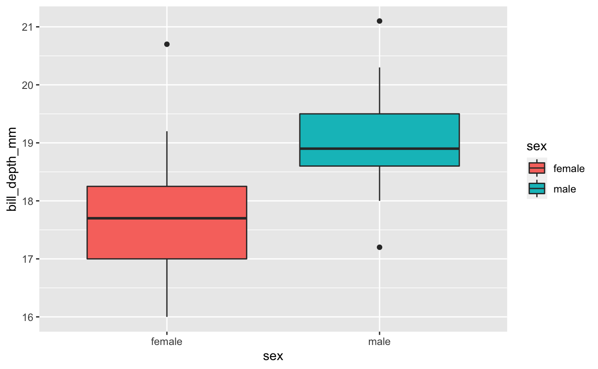
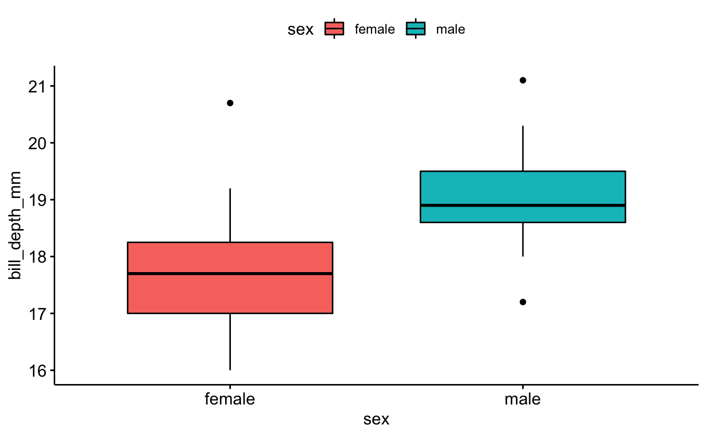
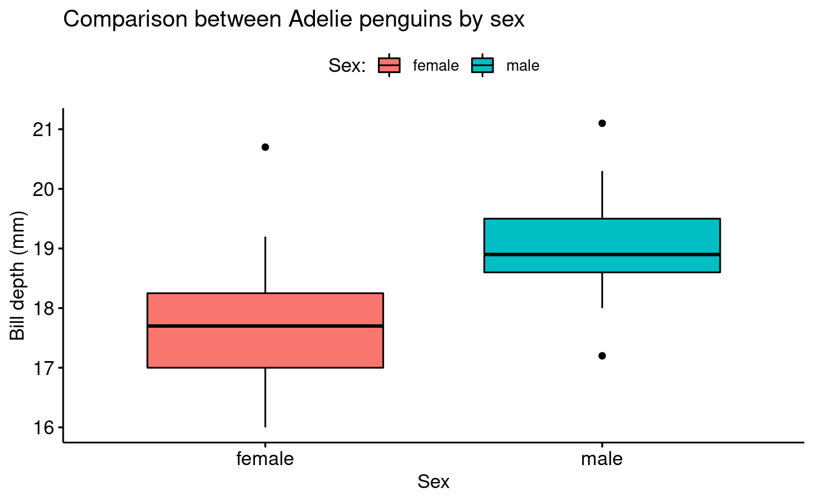
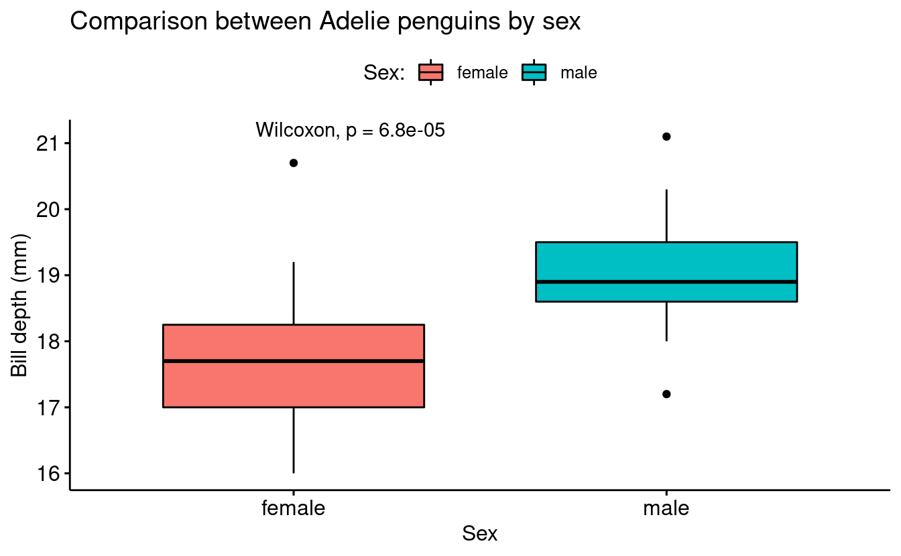
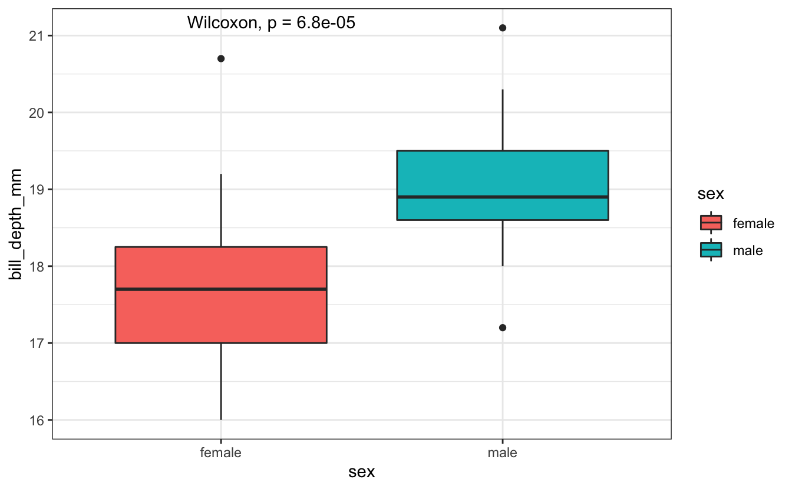
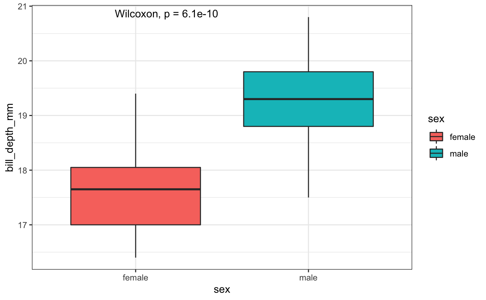
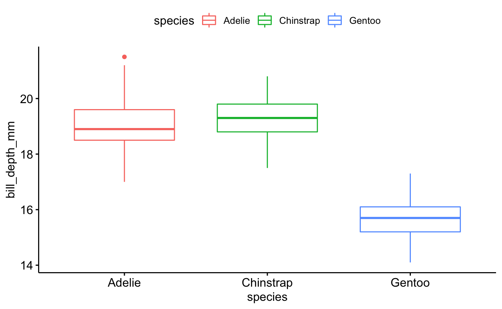
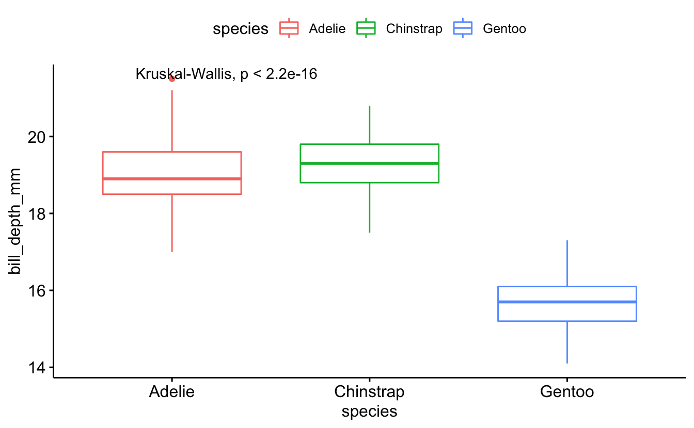
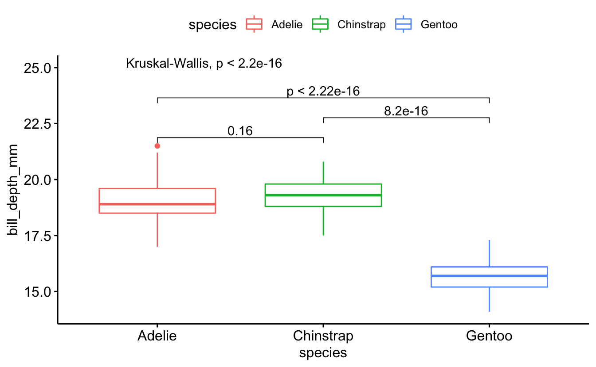
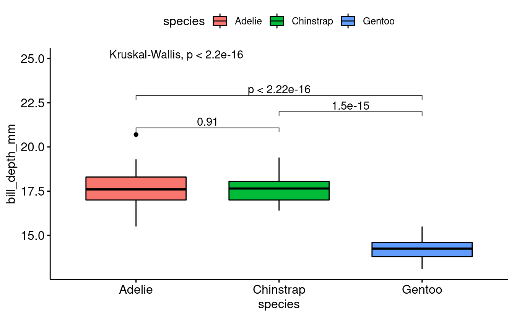

 

# Learning objectives

> -   Understand what is a ggplot extension
> -   Define what is ggpubr
> -   Recognize the advantages and drawback of ggpubr
> -   Create a density plot with ggpubr
> -   Add statistical results to density plots

 

------------------------------------------------------------------------

## Understand what is a ggplot extension

A ggplot extension is a set of functions that helps in the automation of a given task. In the case of ggplot extensions, there are 102 registered extensions up today.

ggplots extensions are developed based in the core of ggplot and helps to create a customized plot with certain features such as animation, specific color scales, or to produce a ready to publish figure.

<iframe src="https://exts.ggplot2.tidyverse.org/gallery/" width="100%" height="400px" data-external="1">
</iframe>

## Define what is ggpubr

ggpubr is an R package that produces ggplot-based plots with a more elegant aesthetic. Although ggpubr has default figures themes, plots usually require some formatting before sending them for publication.

## Getting everything ready

First, we can take a look at the data that we are going to use. In this case, since we are already familiar with *palmerpenguins* dataset, we are going to continue using this data.

To remember the data structure, we can use the *glimpse* function.

------------------------------------------------------------------------

**WARNING**

If you do not have installed the palmergenguins library, you can do it with this line. If you already have it, skip this line.

<pre class='chroma'><code class='language-r' data-lang='r'><a href='https://rdrr.io/r/utils/install.packages.html'>install.packages</a>("palmerpenguins")</code></pre>

To install the ggpubr package for the first time, you can use this command.

<pre class='chroma'><code class='language-r' data-lang='r'><a href='https://rdrr.io/r/utils/install.packages.html'>install.packages</a>("ggpubr")</code></pre>

------------------------------------------------------------------------

### Loading all required packages

|                                                                                                                    |
|--------------------------------------------------------------------------------------------------------------------|
| **NOTE**                                                                                                           |
| According to the good programming coding style, is better to load all packages at the very begining of the script. |

<pre class='chroma'><code class='language-r' data-lang='r'><a href='https://rdrr.io/r/base/library.html'>library</a>(<a href='https://tidyverse.tidyverse.org'>tidyverse</a>) # To load all packages including in the tidyverse
<a href='https://rdrr.io/r/base/library.html'>library</a>(<a href='https://allisonhorst.github.io/palmerpenguins/'>palmerpenguins</a>) # Load the example data
<a href='https://rdrr.io/r/base/library.html'>library</a>(<a href='https://rpkgs.datanovia.com/ggpubr/'>ggpubr</a>) # Create ready to publish figures</code></pre>

### Remembering palmer penguins data

<pre class='chroma'><code class='language-r' data-lang='r'><a href='https://pillar.r-lib.org/reference/glimpse.html'>glimpse</a>(penguins)
#&gt; Rows: 344
#&gt; Columns: 8
#&gt; $ species           &lt;fct&gt; Adelie, Adelie, Adelie, Adelie, Adelie, Adelie, Adel…
#&gt; $ island            &lt;fct&gt; Torgersen, Torgersen, Torgersen, Torgersen, Torgerse…
#&gt; $ bill_length_mm    &lt;dbl&gt; 39.1, 39.5, 40.3, NA, 36.7, 39.3, 38.9, 39.2, 34.1, …
#&gt; $ bill_depth_mm     &lt;dbl&gt; 18.7, 17.4, 18.0, NA, 19.3, 20.6, 17.8, 19.6, 18.1, …
#&gt; $ flipper_length_mm &lt;int&gt; 181, 186, 195, NA, 193, 190, 181, 195, 193, 190, 186…
#&gt; $ body_mass_g       &lt;int&gt; 3750, 3800, 3250, NA, 3450, 3650, 3625, 4675, 3475, …
#&gt; $ sex               &lt;fct&gt; male, female, female, NA, female, male, female, male…
#&gt; $ year              &lt;int&gt; 2007, 2007, 2007, 2007, 2007, 2007, 2007, 2007, 2007…</code></pre>

For the downstream example, we are going to contrast the bill depth of the female vs male penguins of the Adelie species found in Biscoe island.

Therefore, we need to filter based on *species == Adelie* and *island == Biscoe*.

<pre class='chroma'><code class='language-r' data-lang='r'># Filter by species and island
penguins_filtered &lt;- penguins <a href='https://rpkgs.datanovia.com/ggpubr/reference/pipe.html'>%&gt;%</a> 
  <a href='https://dplyr.tidyverse.org/reference/filter.html'>filter</a>(species == "Adelie", island == "Biscoe")

# Count the occurence of the factors levels of sex, species and island
penguins_filtered <a href='https://rpkgs.datanovia.com/ggpubr/reference/pipe.html'>%&gt;%</a> <a href='https://dplyr.tidyverse.org/reference/count.html'>count</a>(sex, species, island)
#&gt; # A tibble: 2 x 4
#&gt;   sex    species island     n
#&gt;   &lt;fct&gt;  &lt;fct&gt;   &lt;fct&gt;  &lt;int&gt;
#&gt; 1 female Adelie  Biscoe    22
#&gt; 2 male   Adelie  Biscoe    22</code></pre>

### Creating the plot with ggplot

One of the main difference between ggplot and ggpubr is the syntax to create the plot. In the case of ggplot, it is a layer based syntax, while in ggpubr, the syntax is embedded in a single function.

<pre class='chroma'><code class='language-r' data-lang='r'><a href='https://ggplot2.tidyverse.org/reference/ggplot.html'>ggplot</a>(penguins_filtered, <a href='https://ggplot2.tidyverse.org/reference/aes.html'>aes</a>(x = sex, y = bill_depth_mm, fill = sex)) +
  <a href='https://ggplot2.tidyverse.org/reference/geom_boxplot.html'>geom_boxplot</a>()
</code></pre>

Now, since ggpubr has its own built-in geoms, the we can use the *ggboxplot()* functions.

<pre class='chroma'><code class='language-r' data-lang='r'>base_plot &lt;- <a href='https://rpkgs.datanovia.com/ggpubr/reference/ggboxplot.html'>ggboxplot</a>(data = penguins_filtered, x = "sex",
                       y = "bill_depth_mm", fill = "sex")
base_plot
</code></pre>

|                                                                                                                                                                              |
|------------------------------------------------------------------------------------------------------------------------------------------------------------------------------|
| **NOTE**                                                                                                                                                                     |
| Since ggpubr creates plots based on ggplot syntax, can treat these plots as another ggplot figure and use the same functions that you would use to format base ggplot plots. |

<pre class='chroma'><code class='language-r' data-lang='r'>base_plot &lt;- <a href='https://rpkgs.datanovia.com/ggpubr/reference/ggboxplot.html'>ggboxplot</a>(data = penguins_filtered, x = "sex",
                       y = "bill_depth_mm", fill = "sex") +
  <a href='https://ggplot2.tidyverse.org/reference/labs.html'>labs</a>(title = "Comparison between Adelie penguins by sex",
       fill = "Sex:", x = "Sex", y = "Bill depth (mm)")
base_plot
</code></pre>

------------------------------------------------------------------------

## Add statistical results to the density plot

When hypotheses testing is brought to the table, we need to consider which type of stats wee can and cannot apply to our data. Briefly, if our data fits the assumptions for normally distribution and variance homogeneity, we can apply parametric tests. On the other hand, if our data does not fit the assumptions, we need to apply non parametric test to the data.

| Parametric    | Non parametric      |
|---------------|---------------------|
| t-test        | Wilcoxon test       |
| one-way anova | Krustal-Wallis test |

### Checking assumptions

If we would like to conduct a hypotheses test, we need first to check assumptions (homogeneity of variance and and normality)

<pre class='chroma'><code class='language-r' data-lang='r'><a href='https://rdrr.io/r/stats/bartlett.test.html'>bartlett.test</a>(bill_depth_mm ~ sex, data = penguins_filtered)
#&gt; 
#&gt;   Bartlett test of homogeneity of variances
#&gt; 
#&gt; data:  bill_depth_mm by sex
#&gt; Bartlett's K-squared = 0.94576, df = 1, p-value = 0.3308</code></pre>

### Exploring the *stat_compare_means()* functions

<pre class='chroma'><code class='language-r' data-lang='r'>base_plot + <a href='https://rpkgs.datanovia.com/ggpubr/reference/stat_compare_means.html'>stat_compare_means</a>()
</code></pre>

In order to be 100% sure about the computed p-value, we can compute the Wilcoxon test in the console.

<pre class='chroma'><code class='language-r' data-lang='r'><a href='https://rdrr.io/r/stats/wilcox.test.html'>wilcox.test</a>(bill_depth_mm ~ sex, data = penguins_filtered)
#&gt; 
#&gt;   Wilcoxon rank sum test with continuity correction
#&gt; 
#&gt; data:  bill_depth_mm by sex
#&gt; W = 72, p-value = 6.79e-05
#&gt; alternative hypothesis: true location shift is not equal to 0</code></pre>

#### Using ggplot to recreate the plot

<pre class='chroma'><code class='language-r' data-lang='r'><a href='https://ggplot2.tidyverse.org/reference/ggplot.html'>ggplot</a>(penguins_filtered, <a href='https://ggplot2.tidyverse.org/reference/aes.html'>aes</a>(sex, bill_depth_mm, fill = sex)) +
  <a href='https://ggplot2.tidyverse.org/reference/geom_boxplot.html'>geom_boxplot</a>() + <a href='https://ggplot2.tidyverse.org/reference/ggtheme.html'>theme_bw</a>() + <a href='https://rpkgs.datanovia.com/ggpubr/reference/stat_compare_means.html'>stat_compare_means</a>()
</code></pre>

### Breakout Rooms I (10 min)

### Exercise 1

-   Filter the penguins data in order to have only the observations (rows) from the Chinstrap specie from the Dream island.

-   Create a boxplot using the ggpubr package or using base ggplot.

-   Use *stat_compare_means()* function to add p-value

Hints (click here)

 

-   Use the *filter()* function
-   filter by species == Chinstrap and island == Dream
-   Use *ggboxplot()* function to create the boxplot
-   Use *stat_compare_means()* to add p-value

Solution (click here)

 

<pre class='chroma'><code class='language-r' data-lang='r'># Using ggpubr

penguins_exc1 &lt;- penguins <a href='https://rpkgs.datanovia.com/ggpubr/reference/pipe.html'>%&gt;%</a> 
  # Filter by species and island
  <a href='https://dplyr.tidyverse.org/reference/filter.html'>filter</a>(species == "Chinstrap", island == "Dream")

exc1_plot &lt;- <a href='https://rpkgs.datanovia.com/ggpubr/reference/ggboxplot.html'>ggboxplot</a>(data = penguins_exc1, x = "sex",
                       y = "bill_depth_mm", fill = "sex") +
  <a href='https://rpkgs.datanovia.com/ggpubr/reference/stat_compare_means.html'>stat_compare_means</a>()

exc1_plot
</code></pre>

<pre class='chroma'><code class='language-r' data-lang='r'># Using ggplot only

penguins_exc1 &lt;- penguins <a href='https://rpkgs.datanovia.com/ggpubr/reference/pipe.html'>%&gt;%</a> 
  # Filter by species and island
  <a href='https://dplyr.tidyverse.org/reference/filter.html'>filter</a>(species == "Chinstrap", island == "Dream")

exc1_plot_ggplot &lt;- <a href='https://ggplot2.tidyverse.org/reference/ggplot.html'>ggplot</a>(penguins_exc1, <a href='https://ggplot2.tidyverse.org/reference/aes.html'>aes</a>(sex, bill_depth_mm, fill = sex)) +
  <a href='https://ggplot2.tidyverse.org/reference/geom_boxplot.html'>geom_boxplot</a>() +
  <a href='https://rpkgs.datanovia.com/ggpubr/reference/stat_compare_means.html'>stat_compare_means</a>() +
  <a href='https://ggplot2.tidyverse.org/reference/ggtheme.html'>theme_bw</a>()

exc1_plot_ggplot
</code></pre>

 

### Multiple group comparison within a variable

In many experiments we can have multiple groups in a single variable. For example, within the a *nutrient concentration* we can have multiple nutrient concentration levels such as 10%, 20%, 30% and so on.

In the case of the penguins data we can find this layout if we need to compare the males bill depth between species. Only for teaching purposes, we are not going to consider any difference by island.

<pre class='chroma'><code class='language-r' data-lang='r'>penguins_male &lt;- penguins <a href='https://rpkgs.datanovia.com/ggpubr/reference/pipe.html'>%&gt;%</a> <a href='https://dplyr.tidyverse.org/reference/filter.html'>filter</a>(sex == "male")
penguins_male <a href='https://rpkgs.datanovia.com/ggpubr/reference/pipe.html'>%&gt;%</a> <a href='https://dplyr.tidyverse.org/reference/count.html'>count</a>( species, sex)
#&gt; # A tibble: 3 x 3
#&gt;   species   sex       n
#&gt;   &lt;fct&gt;     &lt;fct&gt; &lt;int&gt;
#&gt; 1 Adelie    male     73
#&gt; 2 Chinstrap male     34
#&gt; 3 Gentoo    male     61</code></pre>

<pre class='chroma'><code class='language-r' data-lang='r'>penguins_male_plot &lt;- <a href='https://rpkgs.datanovia.com/ggpubr/reference/ggboxplot.html'>ggboxplot</a>(penguins_male,
                                 x = "species", y = "bill_depth_mm",
                                 color = "species")
penguins_male_plot
</code></pre>

<pre class='chroma'><code class='language-r' data-lang='r'>penguins_male_plot + <a href='https://rpkgs.datanovia.com/ggpubr/reference/stat_compare_means.html'>stat_compare_means</a>()
</code></pre>

<pre class='chroma'><code class='language-r' data-lang='r'>comparison_list &lt;- <a href='https://rdrr.io/r/base/list.html'>list</a>(<a href='https://rdrr.io/r/base/c.html'>c</a>("Adelie", "Chinstrap"),
                        <a href='https://rdrr.io/r/base/c.html'>c</a>("Chinstrap", "Gentoo"),
                         <a href='https://rdrr.io/r/base/c.html'>c</a>("Adelie", "Gentoo"))

penguins_male_plot + <a href='https://rpkgs.datanovia.com/ggpubr/reference/stat_compare_means.html'>stat_compare_means</a>(comparisons = comparison_list) +
  <a href='https://rpkgs.datanovia.com/ggpubr/reference/stat_compare_means.html'>stat_compare_means</a>(label.y = 25)
</code></pre>

### Breakout Rooms II (10 min)

### Exercise 2

-   Filter the penguins data in order to have only the observations (rows) from female penguins.

-   Create a boxplot using the ggpubr package.

-   Add the multiple group comparison

-   Add pairwise comparison between all groups combinations

Hints (click here)

 

-   Use the *filter()* function to select desired rows

-   filter by sex == "female"

-   Use *ggboxplot()* function for the base plot

-   Use *stat_compare_means()* function for multiple group comparison

-   Use the *comparison* argument to add pairwise comparison

Solution (click here)

 

<pre class='chroma'><code class='language-r' data-lang='r'># Filtering by sex
penguins_exc2 &lt;- penguins <a href='https://rpkgs.datanovia.com/ggpubr/reference/pipe.html'>%&gt;%</a> 
  # Filter by species and island
  <a href='https://dplyr.tidyverse.org/reference/filter.html'>filter</a>(sex == "female")

# Creating the base plot
exc2_plot &lt;- <a href='https://rpkgs.datanovia.com/ggpubr/reference/ggboxplot.html'>ggboxplot</a>(data = penguins_exc2, x = "species",
                       y = "bill_depth_mm", fill = "species")

# Adding the multiple group comparison
exc2_plot &lt;- exc2_plot 

# Creating the pairwise comparison
exc2_comparison &lt;-  <a href='https://rdrr.io/r/base/list.html'>list</a>(<a href='https://rdrr.io/r/base/c.html'>c</a>("Adelie", "Chinstrap"),
                        <a href='https://rdrr.io/r/base/c.html'>c</a>("Chinstrap", "Gentoo"),
                         <a href='https://rdrr.io/r/base/c.html'>c</a>("Adelie", "Gentoo"))

exc2_plot &lt;- exc2_plot +
  <a href='https://rpkgs.datanovia.com/ggpubr/reference/stat_compare_means.html'>stat_compare_means</a>(comparisons = comparison_list) +
  <a href='https://rpkgs.datanovia.com/ggpubr/reference/stat_compare_means.html'>stat_compare_means</a>(label.y = 25)

exc2_plot
</code></pre>

 

