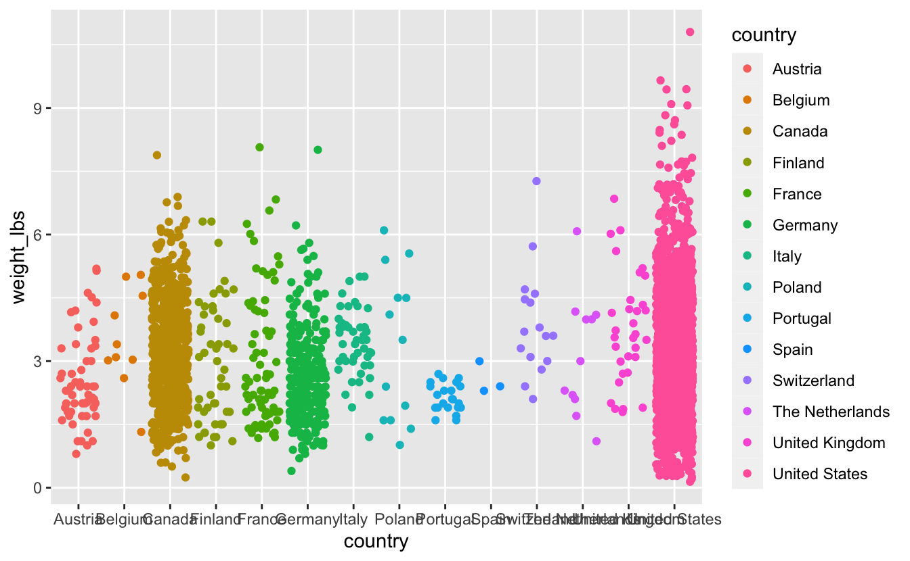
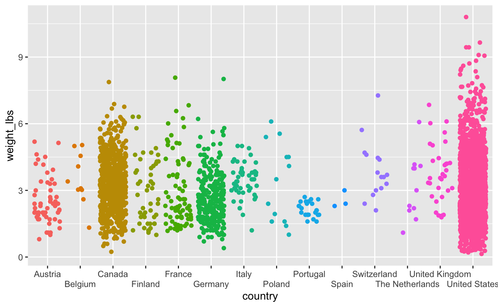
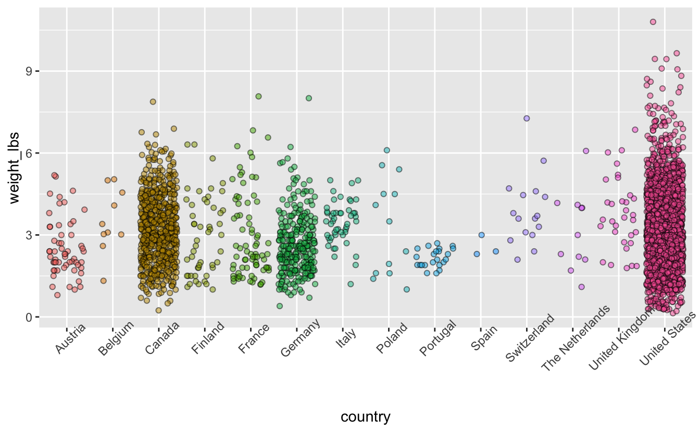
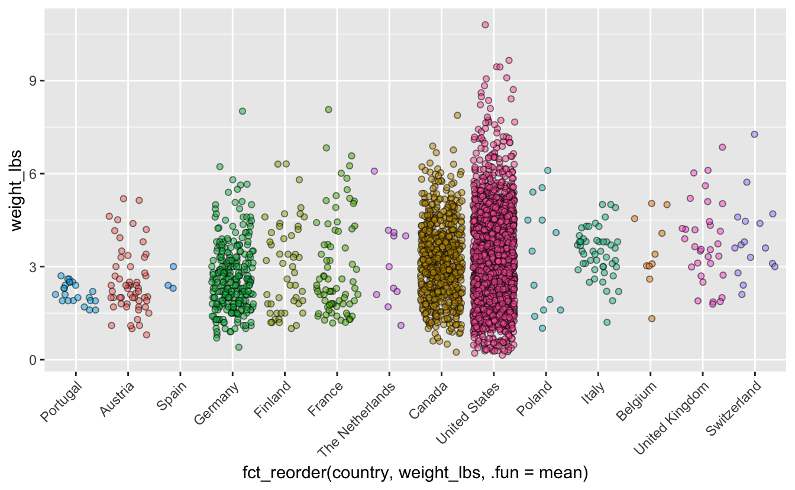
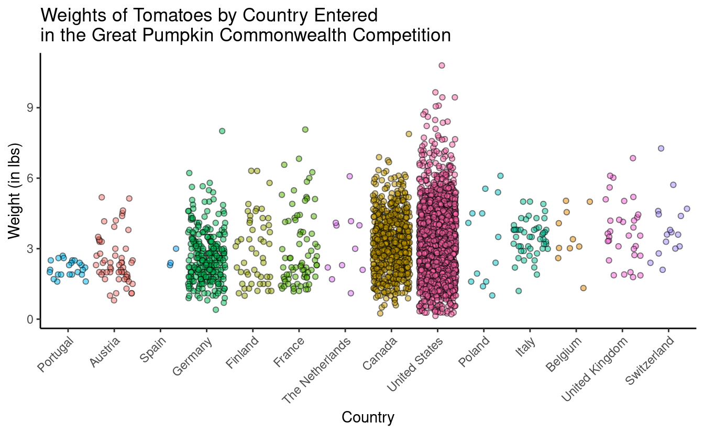
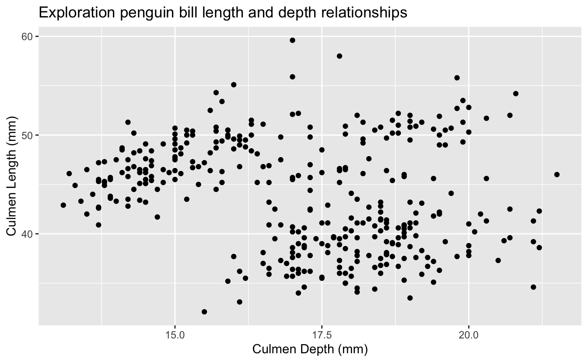

------------------------------------------------------------------------

## Prep homework

### Basic computer setup

-   If you didn't already do this, please follow the [Code Club Computer Setup](/codeclub-setup/04_ggplot2/) instructions, which also has pointers for if you're new to R or RStudio.

-   If you're able to do so, please open RStudio a bit before Code Club starts -- and in case you run into issues, please join the Zoom call early and we'll help you troubleshoot.

### New to ggplot?

Check out the PAST Code Club sessions covering `ggplot2`:

-   [S01E04](/codeclub/04_ggplot2/): intro to ggplot2
-   [S01E05](/codeclub/05_ggplot-round-2/): intro to ggplot2 round 2
-   [S01E10](/codeclub/10_faceting-animating/): faceting and animating
-   [S02E06](/codeclub/s02e06_ggplot2/): another intro to ggplot2
-   [S02E07](/codeclub/s02e07_ggplot2_part2/): a second intro to ggplot2 round 2
-   [S02E08](/codeclub/s02e08_multiple_plots/): combining plots using faceting
-   [S02E09](/codeclub/s02e09_multiple_plots_part2/): combining plots using faceting and patchwork
-   [S02E10](/codeclub/s02e10_ggpubr/): adding statistics to plots

If you've never used `ggplot2` before (or even if you have), you may find [this cheat sheet](https://github.com/rstudio/cheatsheets/blob/master/data-visualization-2.1.pdf) useful.

 

## Getting Started

### RMarkdown for today's session

<pre class='chroma'><code class='language-r' data-lang='r'># directory for Code Club Session 15:
<a href='https://rdrr.io/r/base/files2.html'>dir.create</a>("S02E12")

# directory for our RMarkdown
# ("recursive" to create two levels at once.)
<a href='https://rdrr.io/r/base/files2.html'>dir.create</a>("S02E12/Rmd/")

# save the url location for today's script
todays_Rmd &lt;- 
  "https://raw.githubusercontent.com/biodash/biodash.github.io/master/content/codeclub/S02E12_plotly/plotly.Rmd"

# indicate the name of the new Rmd
S02E12_Rmd &lt;- "S02E12/Rmd/S02E12_plotly.Rmd"

# go get that file! 
<a href='https://rdrr.io/r/utils/download.file.html'>download.file</a>(url = todays_Rmd,
              destfile = S02E12_Rmd)</code></pre>

 

------------------------------------------------------------------------

## 1 - What is plotly?

Today we are going to talk about making interactive plots using [Plotly](https://plotly.com/). Plotly exists in a variety of programming languages, but today we will be just talking about using it in [R](https://plotly.com/r/). All of the plotly documentation can be found [here](https://cran.r-project.org/web/packages/plotly/plotly.pdf).

If you have never used `plotly` before, install it with the code below.

<pre class='chroma'><code class='language-r' data-lang='r'><a href='https://rdrr.io/r/utils/install.packages.html'>install.packages</a>("plotly")</code></pre>

Here are some useful links to find info about using `ggplotly`.

-   [Basic ggplot2 charts](https://plotly.com/ggplot2/#layout-options)
-   [Plotly R library fundamentals](https://plotly.com/r/plotly-fundamentals/)
-   [Intro to `ggplotly()`](https://plotly-r.com/overview.html#intro-ggplotly)
-   [Using `layout()`](https://plotly.com/r/reference/layout/#)
-   [`ggplotly()` tooltips](https://plotly-r.com/controlling-tooltips.html#tooltip-text-ggplotly)

Before we start, there are two basic ways to use plot in R using plotly:

-   Using [`ggplotly()`](https://www.rdocumentation.org/packages/plotly/versions/4.9.3/topics/ggplotly) - this is what we will go over today because it has the same syntax as [`ggplot()`](https://ggplot2.tidyverse.org/reference/ggplot.html) which we have already learned
-   Using [`plot_ly()`](https://www.rdocumentation.org/packages/plotly/versions/4.9.3/topics/plot_ly) - there is slightly more functionality in this function, but the syntax is all new, so I'd suggest if you can do what you want with [`ggplotly()`](https://rdrr.io/pkg/plotly/man/ggplotly.html), do that. The syntax is not particularly hard so don't be scared to use it if interactive plots are something you're very interested in.

When you are googling about using plotly, you will find a combination of [`ggplotly()`](https://rdrr.io/pkg/plotly/man/ggplotly.html) and [`plot_ly()`](https://rdrr.io/pkg/plotly/man/plot_ly.html) approaches, and some parts of the code are interchangable. The easiesy way to see which parts are, is to try.

Also note, Google gets a bit confused when googling "ggplotly" and often returns information about just ggplot, so read extra carefully when problem solving.

This is an example of work from my group where we have found plotly to be particularly useful.

`` Data from [Bilbrey et al., New Phytologist 2021](https://pubmed.ncbi.nlm.nih.gov/34472097/)

 

------------------------------------------------------------------------

## 2 - Load libraries, get data

Lets load the libraries we are using for today.

<pre class='chroma'><code class='language-r' data-lang='r'><a href='https://rdrr.io/r/base/library.html'>library</a>(<a href='https://tidyverse.tidyverse.org'>tidyverse</a>)
<a href='https://rdrr.io/r/base/library.html'>library</a>(<a href='https://plotly-r.com'>plotly</a>) # for making interactive plots
<a href='https://rdrr.io/r/base/library.html'>library</a>(<a href='https://github.com/tidyverse/glue'>glue</a>) # for easy pasting
<a href='https://rdrr.io/r/base/library.html'>library</a>(<a href='https://github.com/ramnathv/htmlwidgets'>htmlwidgets</a>) # for saving html files</code></pre>

We are going to continue to use the pumpkins data we downloaded last week when we were learning about [Shiny](/codeclub/S02E11_shiny_intro/).

<pre class='chroma'><code class='language-r' data-lang='r'>pumpkins &lt;- <a href='https://readr.tidyverse.org/reference/read_delim.html'>read_csv</a>('https://raw.githubusercontent.com/rfordatascience/tidytuesday/master/data/2021/2021-10-19/pumpkins.csv')
#&gt; Rows: 28065 Columns: 14
#&gt; ── Column specification ────────────────────────────────────────────────────────
#&gt; Delimiter: ","
#&gt; chr (14): id, place, weight_lbs, grower_name, city, state_prov, country, gpc...
#&gt; 
#&gt; ℹ Use `spec()` to retrieve the full column specification for this data.
#&gt; ℹ Specify the column types or set `show_col_types = FALSE` to quiet this message.</code></pre>

We will start with the wrangling that Matt shared with us last week, and then go from there.

<pre class='chroma'><code class='language-r' data-lang='r'>pumpkins &lt;- pumpkins <a href='https://magrittr.tidyverse.org/reference/pipe.html'>%&gt;%</a>
  # separate the year column
  <a href='https://tidyr.tidyverse.org/reference/separate.html'>separate</a>(col = id, into = <a href='https://rdrr.io/r/base/c.html'>c</a>("year", "vegetable"), sep = "-") <a href='https://magrittr.tidyverse.org/reference/pipe.html'>%&gt;%</a>
  # find and tag the rows that do not have data
  <a href='https://dplyr.tidyverse.org/reference/mutate.html'>mutate</a>(delete = <a href='https://stringr.tidyverse.org/reference/str_detect.html'>str_detect</a>(place, "\\d*\\s*Entries")) <a href='https://magrittr.tidyverse.org/reference/pipe.html'>%&gt;%</a>
  # filter out the rows that do not have data
  <a href='https://dplyr.tidyverse.org/reference/filter.html'>filter</a>(delete==FALSE) <a href='https://magrittr.tidyverse.org/reference/pipe.html'>%&gt;%</a>
  # remove the tagging column
  <a href='https://dplyr.tidyverse.org/reference/select.html'>select</a>(-delete)

# rename the vegetables to their actual names
pumpkins$vegetable &lt;- pumpkins$vegetable <a href='https://magrittr.tidyverse.org/reference/pipe.html'>%&gt;%</a>
  <a href='https://stringr.tidyverse.org/reference/str_replace.html'>str_replace</a>("^F$", "Field Pumpkin") <a href='https://magrittr.tidyverse.org/reference/pipe.html'>%&gt;%</a>
  <a href='https://stringr.tidyverse.org/reference/str_replace.html'>str_replace</a>("^P$", "Giant Pumpkin") <a href='https://magrittr.tidyverse.org/reference/pipe.html'>%&gt;%</a>
  <a href='https://stringr.tidyverse.org/reference/str_replace.html'>str_replace</a>("^S$", "Giant Squash") <a href='https://magrittr.tidyverse.org/reference/pipe.html'>%&gt;%</a>
  <a href='https://stringr.tidyverse.org/reference/str_replace.html'>str_replace</a>("^W$", "Giant Watermelon") <a href='https://magrittr.tidyverse.org/reference/pipe.html'>%&gt;%</a>
  <a href='https://stringr.tidyverse.org/reference/str_replace.html'>str_replace</a>("^L$", "Long Gourd") <a href='https://magrittr.tidyverse.org/reference/pipe.html'>%&gt;%</a>
  <a href='https://stringr.tidyverse.org/reference/str_replace.html'>str_replace</a>("^T$", "Tomato")

# get rid of commas in the weight_lbs column
pumpkins$weight_lbs &lt;- <a href='https://rdrr.io/r/base/numeric.html'>as.numeric</a>(<a href='https://rdrr.io/r/base/grep.html'>gsub</a>(",","",pumpkins$weight_lbs))</code></pre>

Lets look at our data structure.

<pre class='chroma'><code class='language-r' data-lang='r'><a href='https://pillar.r-lib.org/reference/glimpse.html'>glimpse</a>(pumpkins)
#&gt; Rows: 28,011
#&gt; Columns: 15
#&gt; $ year              &lt;chr&gt; "2013", "2013", "2013", "2013", "2013", "2013", "201…
#&gt; $ vegetable         &lt;chr&gt; "Field Pumpkin", "Field Pumpkin", "Field Pumpkin", "…
#&gt; $ place             &lt;chr&gt; "1", "2", "3", "4", "5", "5", "7", "8", "9", "10", "…
#&gt; $ weight_lbs        &lt;dbl&gt; 154.5, 146.5, 145.0, 140.8, 139.0, 139.0, 136.5, 136…
#&gt; $ grower_name       &lt;chr&gt; "Ellenbecker, Todd &amp; Sequoia", "Razo, Steve", "Ellen…
#&gt; $ city              &lt;chr&gt; "Gleason", "New Middletown", "Glenson", "Combined Lo…
#&gt; $ state_prov        &lt;chr&gt; "Wisconsin", "Ohio", "Wisconsin", "Wisconsin", "Wisc…
#&gt; $ country           &lt;chr&gt; "United States", "United States", "United States", "…
#&gt; $ gpc_site          &lt;chr&gt; "Nekoosa Giant Pumpkin Fest", "Ohio Valley Giant Pum…
#&gt; $ seed_mother       &lt;chr&gt; "209 Werner", "150.5 Snyder", "209 Werner", "109 Mar…
#&gt; $ pollinator_father &lt;chr&gt; "Self", NA, "103 Mackinnon", "209 Werner '12", "open…
#&gt; $ ott               &lt;chr&gt; "184.0", "194.0", "177.0", "194.0", "0.0", "190.0", …
#&gt; $ est_weight        &lt;chr&gt; "129.00", "151.00", "115.00", "151.00", "0.00", "141…
#&gt; $ pct_chart         &lt;chr&gt; "20.0", "-3.0", "26.0", "-7.0", "0.0", "-1.0", "-4.0…
#&gt; $ variety           &lt;chr&gt; NA, NA, NA, NA, NA, NA, NA, NA, NA, NA, NA, NA, NA, …</code></pre>

Note that all of the columns have the class "character" except `weight_lbs` which is numeric. We could just fix this now, but I'm going to show you an alternative way to handle this in a minute.

 

------------------------------------------------------------------------

## 3 - Create base ggplot object

Using the `pumpkins` dataset lets work towards creating a plot that shows the distribution of weights of tomatoes by country. I will show you here how you can use `dplyr` functions within your `ggplot2` call.

<pre class='chroma'><code class='language-r' data-lang='r'>pumpkins <a href='https://magrittr.tidyverse.org/reference/pipe.html'>%&gt;%</a>
  <a href='https://dplyr.tidyverse.org/reference/filter.html'>filter</a>(vegetable == "Tomato") <a href='https://magrittr.tidyverse.org/reference/pipe.html'>%&gt;%</a>
  <a href='https://ggplot2.tidyverse.org/reference/ggplot.html'>ggplot</a>(<a href='https://ggplot2.tidyverse.org/reference/aes.html'>aes</a>(x = country, 
             y = weight_lbs, 
             color = country)) +
  <a href='https://ggplot2.tidyverse.org/reference/geom_jitter.html'>geom_jitter</a>()
</code></pre>

We have a plot, its not horrible but it has a number of issues.

1.  The country names are getting cut off because some are too long, and there are enough of them that we are having overlapping.
2.  We have an [overplotting](https://www.displayr.com/what-is-overplotting/) problem
3.  The x-axis countries are ordered alphabetically. We will order our axis based on something more meaningful, like a characteristic of our data (more about this later).
4.  The aesthetics need some adjustment for a more beautiful plot

We will work on making our plot a bit better, and then we will make it interactive, such that you can hover your mouse over each datapoint, and learn more about that datapoint than what is directly visualized in the plot.

 

------------------------------------------------------------------------

## 4 - Optimize our base plot

### 1. Prevent country name overlap

We can do this using by using [`guide_axis()`](https://ggplot2.tidyverse.org/reference/guide_axis.html) within a `scale` function, here, [`scale_x_discrete()`](https://ggplot2.tidyverse.org/reference/scale_discrete.html). To learn more about ggplot scales, click [here](https://ggplot2-book.org/scales-guides.html).  

<pre class='chroma'><code class='language-r' data-lang='r'>pumpkins <a href='https://magrittr.tidyverse.org/reference/pipe.html'>%&gt;%</a>
  <a href='https://dplyr.tidyverse.org/reference/filter.html'>filter</a>(vegetable == "Tomato") <a href='https://magrittr.tidyverse.org/reference/pipe.html'>%&gt;%</a>
  <a href='https://ggplot2.tidyverse.org/reference/ggplot.html'>ggplot</a>(<a href='https://ggplot2.tidyverse.org/reference/aes.html'>aes</a>(x = country, 
             y = weight_lbs, 
             color = country)) +
  <a href='https://ggplot2.tidyverse.org/reference/geom_jitter.html'>geom_jitter</a>() +
  <a href='https://ggplot2.tidyverse.org/reference/scale_discrete.html'>scale_x_discrete</a>(guide = <a href='https://ggplot2.tidyverse.org/reference/guide_axis.html'>guide_axis</a>(n.dodge = 2)) # dodge every other name
</code></pre>

Wow that was easy. We still have some overlapping, though we have a big figure legend that is in this case, not necessary. Lets remove it.

<pre class='chroma'><code class='language-r' data-lang='r'>pumpkins <a href='https://magrittr.tidyverse.org/reference/pipe.html'>%&gt;%</a>
  <a href='https://dplyr.tidyverse.org/reference/filter.html'>filter</a>(vegetable == "Tomato") <a href='https://magrittr.tidyverse.org/reference/pipe.html'>%&gt;%</a>
  <a href='https://ggplot2.tidyverse.org/reference/ggplot.html'>ggplot</a>(<a href='https://ggplot2.tidyverse.org/reference/aes.html'>aes</a>(x = country, 
             y = weight_lbs, 
             color = country)) +
  <a href='https://ggplot2.tidyverse.org/reference/geom_jitter.html'>geom_jitter</a>() +
  <a href='https://ggplot2.tidyverse.org/reference/scale_discrete.html'>scale_x_discrete</a>(guide = <a href='https://ggplot2.tidyverse.org/reference/guide_axis.html'>guide_axis</a>(n.dodge = 2)) +
  <a href='https://ggplot2.tidyverse.org/reference/theme.html'>theme</a>(legend.position = "none")
</code></pre>

This is not the only way to fix the plot to avoid label overlap. Instead, you could put the x-axis country labels on an angle by using `theme(axis.text.x = element_text(angle = 45))`.

### 2. Reduce overplotting

For the countries that have a lot of tomato entries, its hard to see some individual data points because there are just so many of them. We can add some transparency to the datapoints such that its easier to see them. I am also playing around with `color`, `fill`, and point `shape` so you can see what changing those values does to the plot.

<pre class='chroma'><code class='language-r' data-lang='r'>pumpkins <a href='https://magrittr.tidyverse.org/reference/pipe.html'>%&gt;%</a>
  <a href='https://dplyr.tidyverse.org/reference/filter.html'>filter</a>(vegetable == "Tomato") <a href='https://magrittr.tidyverse.org/reference/pipe.html'>%&gt;%</a>
  <a href='https://ggplot2.tidyverse.org/reference/ggplot.html'>ggplot</a>(<a href='https://ggplot2.tidyverse.org/reference/aes.html'>aes</a>(x = country, 
             y = weight_lbs, 
             fill = country)) +
  <a href='https://ggplot2.tidyverse.org/reference/geom_jitter.html'>geom_jitter</a>(alpha = 0.5, color = "black", shape = 21) +
  <a href='https://ggplot2.tidyverse.org/reference/theme.html'>theme</a>(legend.position = "none",
        axis.text.x = <a href='https://ggplot2.tidyverse.org/reference/element.html'>element_text</a>(angle = 45)) 
</code></pre>

We still have overplotting but I think this is an improvement.

### 3. Reorder x-axis to something meaningful

Our x-axis is currently ordered alphabetically. This is really a meaningless ordering - instead lets order our data by some characteristic of the data that we want to communicate to our viewer. For example, we could order by increasing mean tomato weight. This would tell us, just by looking at the order of the x-axis, which country has on average, the biggest tomatoes. This is something that is hard to see with the data in its current form.

Remember before we saw that each of the columns except for `weight_lbs` was of the class "character." To allow reordering, we need to change `country` to be a factor. We can do this directly in the `pumpkins` dataframe, or we can do it within the ggplot call using the pipe `%>%`.

We will use [`fct_reorder()`](https://forcats.tidyverse.org/reference/fct_reorder.html) to do this, where we provide the the column we want to reorder (here, `country`), and what we want to reorder based on (here, `weight_lbs`), and what function to use for the reordering (here, `.fun = mean`).

<pre class='chroma'><code class='language-r' data-lang='r'>pumpkins <a href='https://magrittr.tidyverse.org/reference/pipe.html'>%&gt;%</a>
  <a href='https://dplyr.tidyverse.org/reference/filter.html'>filter</a>(vegetable == "Tomato") <a href='https://magrittr.tidyverse.org/reference/pipe.html'>%&gt;%</a>
  <a href='https://dplyr.tidyverse.org/reference/mutate.html'>mutate</a>(country = <a href='https://rdrr.io/r/base/factor.html'>as.factor</a>(country)) <a href='https://magrittr.tidyverse.org/reference/pipe.html'>%&gt;%</a>
  <a href='https://ggplot2.tidyverse.org/reference/ggplot.html'>ggplot</a>(<a href='https://ggplot2.tidyverse.org/reference/aes.html'>aes</a>(x = <a href='https://forcats.tidyverse.org/reference/fct_reorder.html'>fct_reorder</a>(country, weight_lbs, .fun = mean), 
             y = weight_lbs, 
             fill = country)) +
  <a href='https://ggplot2.tidyverse.org/reference/geom_jitter.html'>geom_jitter</a>(alpha = 0.5, color = "black", shape = 21) +
  <a href='https://ggplot2.tidyverse.org/reference/theme.html'>theme</a>(legend.position = "none",
        axis.text.x = <a href='https://ggplot2.tidyverse.org/reference/element.html'>element_text</a>(angle = 45, hjust = 1)) 
</code></pre>

Now we can see easily that Switzerland has the heaviest tomatoes on average entered into this competition.

### 4. Pretty it up

Let's fix up the aesthetics of the plot, and adjust the axis labels, and add a title. Note, in the title, adding `\n` into your title inserts a line break.

<pre class='chroma'><code class='language-r' data-lang='r'>tomato_plot &lt;- pumpkins <a href='https://magrittr.tidyverse.org/reference/pipe.html'>%&gt;%</a>
  <a href='https://dplyr.tidyverse.org/reference/filter.html'>filter</a>(vegetable == "Tomato") <a href='https://magrittr.tidyverse.org/reference/pipe.html'>%&gt;%</a>
  <a href='https://dplyr.tidyverse.org/reference/mutate.html'>mutate</a>(country = <a href='https://rdrr.io/r/base/factor.html'>as.factor</a>(country)) <a href='https://magrittr.tidyverse.org/reference/pipe.html'>%&gt;%</a>
  <a href='https://ggplot2.tidyverse.org/reference/ggplot.html'>ggplot</a>(<a href='https://ggplot2.tidyverse.org/reference/aes.html'>aes</a>(x = <a href='https://forcats.tidyverse.org/reference/fct_reorder.html'>fct_reorder</a>(country, weight_lbs, .fun = mean), 
             y = weight_lbs, 
             fill = country)) +
  <a href='https://ggplot2.tidyverse.org/reference/geom_jitter.html'>geom_jitter</a>(alpha = 0.5, color = "black", shape = 21) +
  <a href='https://ggplot2.tidyverse.org/reference/ggtheme.html'>theme_classic</a>() +
  <a href='https://ggplot2.tidyverse.org/reference/theme.html'>theme</a>(legend.position = "none",
        axis.text.x = <a href='https://ggplot2.tidyverse.org/reference/element.html'>element_text</a>(angle = 45, hjust = 1)) +
  <a href='https://ggplot2.tidyverse.org/reference/labs.html'>labs</a> (x = "Country",
        y = "Weight (in lbs)",
        title = "Weights of Tomatoes by Country Entered \nin the Great Pumpkin Commonwealth Competition")

tomato_plot
</code></pre>

## 5 - Make it interactive with `ggplotly()`

You can learn more about the [`ggplotly()`](https://rdrr.io/pkg/plotly/man/ggplotly.html) function, including its arguments [here](https://www.rdocumentation.org/packages/plotly/versions/4.9.3/topics/ggplotly).

<pre class='chroma'><code class='language-r' data-lang='r'><a href='https://rdrr.io/pkg/plotly/man/ggplotly.html'>ggplotly</a>(tomato_plot)</code></pre>

``

Wow that was easy! Note that when you hover over a data point you see the information mapped in your [`aes()`](https://ggplot2.tidyverse.org/reference/aes.html) statement -- this is the default. We will go over ways to change this.

 

------------------------------------------------------------------------

## 6 - Using tooltip

Using tooltip helps you to indicate what appears when you hover over different parts of your plot. You can learn more about controlling `tooltip` [here](https://plotly-r.com/controlling-tooltips.html).

What if we want to hover over each point and be able to tell who grew that tomato?

To do this, we indicate what we want to hover with using `text =` in our aesthetic mappings. Then, we indicate `tooltip = "text"` to tell [`ggplotly()`](https://rdrr.io/pkg/plotly/man/ggplotly.html) what we want to hover.

<pre class='chroma'><code class='language-r' data-lang='r'>tomato_plot &lt;- pumpkins <a href='https://magrittr.tidyverse.org/reference/pipe.html'>%&gt;%</a>
  <a href='https://dplyr.tidyverse.org/reference/filter.html'>filter</a>(vegetable == "Tomato") <a href='https://magrittr.tidyverse.org/reference/pipe.html'>%&gt;%</a>
  <a href='https://dplyr.tidyverse.org/reference/mutate.html'>mutate</a>(country = <a href='https://rdrr.io/r/base/factor.html'>as.factor</a>(country)) <a href='https://magrittr.tidyverse.org/reference/pipe.html'>%&gt;%</a>
  <a href='https://ggplot2.tidyverse.org/reference/ggplot.html'>ggplot</a>(<a href='https://ggplot2.tidyverse.org/reference/aes.html'>aes</a>(x = <a href='https://forcats.tidyverse.org/reference/fct_reorder.html'>fct_reorder</a>(country, weight_lbs, .fun = mean), 
             y = weight_lbs, 
             fill = country,
             text = grower_name)) +
  <a href='https://ggplot2.tidyverse.org/reference/geom_jitter.html'>geom_jitter</a>(alpha = 0.5, color = "black", shape = 21) +
  <a href='https://ggplot2.tidyverse.org/reference/ggtheme.html'>theme_classic</a>() +
  <a href='https://ggplot2.tidyverse.org/reference/theme.html'>theme</a>(legend.position = "none",
        axis.text.x = <a href='https://ggplot2.tidyverse.org/reference/element.html'>element_text</a>(angle = 45)) +
  <a href='https://ggplot2.tidyverse.org/reference/labs.html'>labs</a> (x = "Country",
        y = "Weight (in lbs)",
        title = "Weights of Tomatoes by Country Entered \nin the Great Pumpkin Commonwealth Competition")

<a href='https://rdrr.io/pkg/plotly/man/ggplotly.html'>ggplotly</a>(tomato_plot,
         tooltip = "text")</code></pre>

``

You can play around a lot with tooltip to get it to be exactly how you want, and you can include multiple things in your hover text.

You can add multiple items to `text`, and also use the function [`glue()`](https://glue.tidyverse.org/reference/glue.html) which allows more intuitive pasting to get your hover text to in your preferred format.

<pre class='chroma'><code class='language-r' data-lang='r'>tomato_plot &lt;- pumpkins <a href='https://magrittr.tidyverse.org/reference/pipe.html'>%&gt;%</a>
  <a href='https://dplyr.tidyverse.org/reference/filter.html'>filter</a>(vegetable == "Tomato") <a href='https://magrittr.tidyverse.org/reference/pipe.html'>%&gt;%</a>
  <a href='https://dplyr.tidyverse.org/reference/mutate.html'>mutate</a>(country = <a href='https://rdrr.io/r/base/factor.html'>as.factor</a>(country)) <a href='https://magrittr.tidyverse.org/reference/pipe.html'>%&gt;%</a>
  <a href='https://ggplot2.tidyverse.org/reference/ggplot.html'>ggplot</a>(<a href='https://ggplot2.tidyverse.org/reference/aes.html'>aes</a>(x = <a href='https://forcats.tidyverse.org/reference/fct_reorder.html'>fct_reorder</a>(country, weight_lbs, .fun = mean), 
             y = weight_lbs, 
             fill = country,
             text = <a href='https://glue.tidyverse.org/reference/glue.html'>glue</a>("Grown by &#123;grower_name&#125;
                         From &#123;city&#125;, &#123;state_prov&#125;"))) +
  <a href='https://ggplot2.tidyverse.org/reference/geom_jitter.html'>geom_jitter</a>(alpha = 0.5, color = "black", shape = 21) +
  <a href='https://ggplot2.tidyverse.org/reference/ggtheme.html'>theme_classic</a>() +
  <a href='https://ggplot2.tidyverse.org/reference/theme.html'>theme</a>(legend.position = "none",
        axis.text.x = <a href='https://ggplot2.tidyverse.org/reference/element.html'>element_text</a>(angle = 45)) +
  <a href='https://ggplot2.tidyverse.org/reference/labs.html'>labs</a> (x = "Country",
        y = "Weight (in lbs)",
        title = "Weights of Tomatoes by Country Entered \nin the Great Pumpkin Commonwealth Competition")

<a href='https://rdrr.io/pkg/plotly/man/ggplotly.html'>ggplotly</a>(tomato_plot,
         tooltip = "text")</code></pre>

``

 

------------------------------------------------------------------------

## 7 - Hover label aesthetics

You might not like the default hover text aesthetics, and can change them! You can do this using `style` and `layout` and adding these functions using the pipe `%>%`.

<pre class='chroma'><code class='language-r' data-lang='r'># setting fonts for the plot
font &lt;- <a href='https://rdrr.io/r/base/list.html'>list</a>(
  family = "Calibri",
  size = 15,
  color = "white")

# setting hover label specs
label &lt;- <a href='https://rdrr.io/r/base/list.html'>list</a>(
  bgcolor = "#FF0000",
  bordercolor = "transparent",
  font = font) # we can do this bc we already set font

# amending our ggplotly call to include new fonts and hover label specs
<a href='https://rdrr.io/pkg/plotly/man/ggplotly.html'>ggplotly</a>(tomato_plot, tooltip = "text") <a href='https://magrittr.tidyverse.org/reference/pipe.html'>%&gt;%</a>
  <a href='https://rdrr.io/pkg/plotly/man/style.html'>style</a>(hoverlabel = label) <a href='https://magrittr.tidyverse.org/reference/pipe.html'>%&gt;%</a>
  <a href='https://rdrr.io/pkg/plotly/man/layout.html'>layout</a>(font = font)</code></pre>

``

 

------------------------------------------------------------------------

## 8 - Saving your plots

Now that you've made a beautiful interactive plot, you probably want to save it.

Assign the plot you want to save to an object, and use the function [`saveWidget()`](https://rdrr.io/pkg/htmlwidgets/man/saveWidget.html) to save it. You can find the documentation [here](https://www.rdocumentation.org/packages/htmlwidgets/versions/1.5.3/topics/saveWidget).

<pre class='chroma'><code class='language-r' data-lang='r'># assign ggplotly plot to an object
ggplotly_to_save &lt;- <a href='https://rdrr.io/pkg/plotly/man/ggplotly.html'>ggplotly</a>(tomato_plot,
                             tooltip = "text") <a href='https://magrittr.tidyverse.org/reference/pipe.html'>%&gt;%</a>
                      <a href='https://rdrr.io/pkg/plotly/man/style.html'>style</a>(hoverlabel = label) <a href='https://magrittr.tidyverse.org/reference/pipe.html'>%&gt;%</a>
                      <a href='https://rdrr.io/pkg/plotly/man/layout.html'>layout</a>(font = font)

# save
<a href='https://rdrr.io/pkg/htmlwidgets/man/saveWidget.html'>saveWidget</a>(widget = ggplotly_to_save,
           file = "ggplotlying.html")</code></pre>

 

------------------------------------------------------------------------

## Breakout rooms

We are going to use the `palmerpenguins` dataset called `penguins`.

<pre class='chroma'><code class='language-r' data-lang='r'><a href='https://rdrr.io/r/base/library.html'>library</a>(<a href='https://allisonhorst.github.io/palmerpenguins/'>palmerpenguins</a>)

<a href='https://rdrr.io/r/utils/head.html'>head</a>(penguins)
#&gt; # A tibble: 6 × 8
#&gt;   species island bill_length_mm bill_depth_mm flipper_length_… body_mass_g sex  
#&gt;   &lt;fct&gt;   &lt;fct&gt;           &lt;dbl&gt;         &lt;dbl&gt;            &lt;int&gt;       &lt;int&gt; &lt;fct&gt;
#&gt; 1 Adelie  Torge…           39.1          18.7              181        3750 male 
#&gt; 2 Adelie  Torge…           39.5          17.4              186        3800 fema…
#&gt; 3 Adelie  Torge…           40.3          18                195        3250 fema…
#&gt; 4 Adelie  Torge…           NA            NA                 NA          NA NA   
#&gt; 5 Adelie  Torge…           36.7          19.3              193        3450 fema…
#&gt; 6 Adelie  Torge…           39.3          20.6              190        3650 male 
#&gt; # … with 1 more variable: year &lt;int&gt;</code></pre>

### Exercise 1

Using the `penguins` dataset and make a base scatter plot with bill length on the y, and bill depth on the x. Remove any observations with missing data.

Hints (click here)

You can use [`drop_na()`](https://tidyr.tidyverse.org/reference/drop_na.html) to remove NAs. The helper [`any_of()`](https://tidyselect.r-lib.org/reference/all_of.html) is useful for removing NAs only from certain variables. You can also just remove any NAs, it doesn't really matter here.  

 

Solutions (click here)

<pre class='chroma'><code class='language-r' data-lang='r'>bill_depth_length &lt;- penguins <a href='https://magrittr.tidyverse.org/reference/pipe.html'>%&gt;%</a>
  <a href='https://tidyr.tidyverse.org/reference/drop_na.html'>drop_na</a>(<a href='https://tidyselect.r-lib.org/reference/all_of.html'>any_of</a>(<a href='https://rdrr.io/r/base/c.html'>c</a>("bill_depth_mm", "bill_length_mm"))) <a href='https://magrittr.tidyverse.org/reference/pipe.html'>%&gt;%</a>
  <a href='https://ggplot2.tidyverse.org/reference/ggplot.html'>ggplot</a>(<a href='https://ggplot2.tidyverse.org/reference/aes.html'>aes</a>(x = bill_depth_mm, y = bill_length_mm)) +
  <a href='https://ggplot2.tidyverse.org/reference/geom_point.html'>geom_point</a>()

bill_depth_length
</code></pre>

 

------------------------------------------------------------------------

### Exercise 2

Add appropriate x and y-axis labels, and a title to your plot.

Hints (click here)

You can add labels for x, y, and a title using `labs().`  

 

Solutions (click here)

<pre class='chroma'><code class='language-r' data-lang='r'>bill_depth_length &lt;- penguins <a href='https://magrittr.tidyverse.org/reference/pipe.html'>%&gt;%</a>
  <a href='https://tidyr.tidyverse.org/reference/drop_na.html'>drop_na</a>(<a href='https://tidyselect.r-lib.org/reference/all_of.html'>any_of</a>(<a href='https://rdrr.io/r/base/c.html'>c</a>("bill_depth_mm", "bill_length_mm"))) <a href='https://magrittr.tidyverse.org/reference/pipe.html'>%&gt;%</a>
  <a href='https://ggplot2.tidyverse.org/reference/ggplot.html'>ggplot</a>(<a href='https://ggplot2.tidyverse.org/reference/aes.html'>aes</a>(x = bill_depth_mm, y = bill_length_mm)) +
  <a href='https://ggplot2.tidyverse.org/reference/geom_point.html'>geom_point</a>() +
  <a href='https://ggplot2.tidyverse.org/reference/labs.html'>labs</a>(x = "Culmen Depth (mm)",
       y = "Culmen Length (mm)",
       title = "Exploration penguin bill length and depth relationships")

bill_depth_length
</code></pre>

 

------------------------------------------------------------------------

### Exercise 3

Make your plot interactive such that when you hover over a point, it tell you what island the penguin is from.

Hints (click here)

Specify what you want your "tooltip" to be by using `text` within your [`aes()`](https://ggplot2.tidyverse.org/reference/aes.html) statement.  

 

Solutions (click here)

<pre class='chroma'><code class='language-r' data-lang='r'>bill_depth_length &lt;- penguins <a href='https://magrittr.tidyverse.org/reference/pipe.html'>%&gt;%</a>
  <a href='https://tidyr.tidyverse.org/reference/drop_na.html'>drop_na</a>(<a href='https://tidyselect.r-lib.org/reference/all_of.html'>any_of</a>(<a href='https://rdrr.io/r/base/c.html'>c</a>("bill_depth_mm", "bill_length_mm"))) <a href='https://magrittr.tidyverse.org/reference/pipe.html'>%&gt;%</a>
  <a href='https://ggplot2.tidyverse.org/reference/ggplot.html'>ggplot</a>(<a href='https://ggplot2.tidyverse.org/reference/aes.html'>aes</a>(x = bill_depth_mm, y = bill_length_mm, text = island)) +
  <a href='https://ggplot2.tidyverse.org/reference/geom_point.html'>geom_point</a>() +
  <a href='https://ggplot2.tidyverse.org/reference/labs.html'>labs</a>(x = "Culmen Depth (mm)",
       y = "Culmen Length (mm)",
       title = "Exploration penguin bill length and depth relationships")

<a href='https://rdrr.io/pkg/plotly/man/ggplotly.html'>ggplotly</a>(bill_depth_length,
         tooltip = "text")</code></pre>

``

 

------------------------------------------------------------------------

### Exercise 4

Add the sex of the penguin to the hover text, change the hover text so that the background color is red, and make all the fonts for the plot something other than the default.

Hints (click here)

You can set fonts either within your [`ggplot()`](https://ggplot2.tidyverse.org/reference/ggplot.html) call, or setting `font` within [`layout()`](https://rdrr.io/pkg/plotly/man/layout.html). You can customize the hover label with [`style()`](https://rdrr.io/pkg/plotly/man/style.html). Use [`glue()`](https://glue.tidyverse.org/reference/glue.html) to paste in some information that helps your reader know what your hover text is referring to.  

 

Solutions (click here)

<pre class='chroma'><code class='language-r' data-lang='r'># setting fonts for the plot
penguins_font &lt;- <a href='https://rdrr.io/r/base/list.html'>list</a>(
  family = "Proxima Nova", # this is the official OSU font
  size = 15,
  color = "white")

# setting hover label specs
penguins_label &lt;- <a href='https://rdrr.io/r/base/list.html'>list</a>(
  bgcolor = "blue",
  bordercolor = "transparent",
  font = penguins_font) # we can do this bc we already set font

bill_depth_length &lt;- penguins <a href='https://magrittr.tidyverse.org/reference/pipe.html'>%&gt;%</a>
  <a href='https://tidyr.tidyverse.org/reference/drop_na.html'>drop_na</a>(<a href='https://tidyselect.r-lib.org/reference/all_of.html'>any_of</a>(<a href='https://rdrr.io/r/base/c.html'>c</a>("bill_depth_mm", "bill_length_mm"))) <a href='https://magrittr.tidyverse.org/reference/pipe.html'>%&gt;%</a>
  <a href='https://ggplot2.tidyverse.org/reference/ggplot.html'>ggplot</a>(<a href='https://ggplot2.tidyverse.org/reference/aes.html'>aes</a>(x = bill_depth_mm, y = bill_length_mm, 
             text = <a href='https://glue.tidyverse.org/reference/glue.html'>glue</a>("Island: &#123;island&#125;
                         Sex: &#123;sex&#125;"))) +
  <a href='https://ggplot2.tidyverse.org/reference/geom_point.html'>geom_point</a>() +
  <a href='https://ggplot2.tidyverse.org/reference/labs.html'>labs</a>(x = "Culmen Depth (mm)",
       y = "Culmen Length (mm)",
       title = "Exploration penguin bill length and depth relationships")

# amending our ggplotly call to include new fonts and hover label specs
<a href='https://rdrr.io/pkg/plotly/man/ggplotly.html'>ggplotly</a>(bill_depth_length, tooltip = "text") <a href='https://magrittr.tidyverse.org/reference/pipe.html'>%&gt;%</a>
  <a href='https://rdrr.io/pkg/plotly/man/style.html'>style</a>(hoverlabel = penguins_label) <a href='https://magrittr.tidyverse.org/reference/pipe.html'>%&gt;%</a>
  <a href='https://rdrr.io/pkg/plotly/man/layout.html'>layout</a>(font = penguins_font)</code></pre>

``

 

 

------------------------------------------------------------------------

