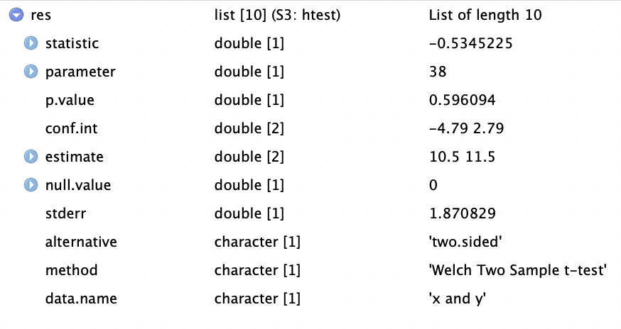

<br>

## Learning objectives

> * Identify the types of data structures underlying the inputs and outputs of a basic t-test in R, with focus on vectors, lists, and data frames.
> * Use the "broom" package to clean (tidy) up t-test results.
> * Create some t-test-related visualizations.
> * Practice with some basic tidyverse/dplyr functions (`select()`, `filter()`)

## Notes For Beginners

We're starting this new session of Code Club a bit differently than we've started previous major sessions in that we're not easing in with basic R material, but instead assuming a bit of prior knowledge. But if you're new to Code Club and/or R though, don't worry - this section, and the rest of us in Code Club are here to help. Below I'll give a very brief overview of R, with an emphasis on things that will be relevant for today's session. Remember too that all previous Code Club material is available online, so feel free to check that out. And please don't hesitate to ask questions during the session, whether in the main room or in Breakout rooms. Some highlights for today's session...

In R there are objects and functions. 

### Objects

Objects are things you assign a name to, and we do that with something called the assignment operator ( <- )...

```{r}
#assign the value 5 to an object named "my_object"
my_object <- 5

#ask R to return that object
my_object
```
You create lots of objects as you work in R. They persist until you remove them or until you close your R session.

Each object is categorized into a type of data structure. Some common ones in R (and ones relevant for this session) include vectors, lists, and data frames. 

 - Vectors: Have one dimension, meaning they can be characterized by their length. "my_object" that I created above is a vector of length 1. If vectors contain more than one entry, all the entries must be of the same type, or class, at least from R's perspective. Numeric, character, and logical (TRUE/FALSE) are a few examples, and "my_object" is a numeric vector.
 - Lists: A list is an object that can store multiple objects. Unlike vectors, the different objects stored in a list can be of different types. For example, a list could have three entries - 1.) a numeric vector of length 5 that stores the values 10:14, 2.) another list that itself stores several objects, and 3.) a character vector of length 3 that stores "red", "blue", "green".
  - Data Frames: Data frames store "rectangular data", meaning datasets that are organized into colums and rows, and specifically those that have the same number of rows for each column. They are somewhat analgous to an Excel spreadsheet, assuming the data in that worksheet are perfectly rectangular.
 
### Functions

Functions in R usually have a descriptive name that gives you an idea of what they do, and they look like...
`mean()`
`sum()`
`c()`

The `c()` one might not be all that descriptive, but it stands for combine, and is a function that's used a lot to combine items into vectors of length >1.

Inside the parentheses you often specify one or more objects for the function to operate on, and also might give some function-specific directives that tweak its behavior.
  
### Syntax

There are essentially two dialects in R - often referred to as "base R" and the "tidyverse". You should be able to do most anything you want in R with either approach, and they can be mixed and matched. In general, base R tends to use more parentheses, square brackets, and $'s, while with the "tidyverse" you'll see functions like `select()` and `filter()` a lot, along with the pipe symbol ( %>% ) which takes results from one function and "pipes" them directly into a next function. Admittedly, essentially having two languages can lead to confusion, especially if you're just getting started. We mostly stick with "tidy" code during Code Club, as it tends to be easier to follow/interpret. 

### Data Visualization
R is really useful for creating data visualizations. Again, there are "base R"" ways to plot data and "tidyverse" ways, which utilize functions that are part of a package named "ggplot2". While ggplot is a bit harder to learn than the base R plotting functions, it's also much more powerful, and in sticking with the "tidy" theme, we generally use it. Plots in ggplot are built by adding one or more layers to a plot, and data are specified with aesthetics, which link aspects of the plot (like the x and y axes, colors for points or lines on the plot, etc) to columns of a data frame that store the data. 


<br>

----

## 1 -- Intro

Starting today, the upcoming block of Code Club sessions will center around performing some common statistical tests in R. We don't plan to dive in to a lot of statistical details, but will instead focus on practical aspects of running the tests/analyses. We'll pay particular attention to things like the types/classes of data that need to go in to each test, the structure of the results that come out, and since R is so good with visualization, we'll probably do a fair amount of plotting along the way too. Let's go ahead and load the tidyverse before we get started...

```{r, warning=FALSE, message=FALSE}
library(tidyverse)
```

In this session we'll do t-tests with the `t.test()` function. First I'm going to use the `rnorm()` function to get some example data to work with by generating random samples (N=20) for each of two populations from a normal distribution with a mean of 10 and standard deviation of 3.

```{r}
#generate a sample for population 1
pop1 <- rnorm(n = 20, mean = 10, sd = 3)
#view the population 1 data
pop1

#generate a sample for population 2
pop2 <- rnorm(n = 20, mean = 10, sd = 3)
#view the population 2 data
pop2
```

A t-test is a good choice here if we want to use our samples to draw inference around whether the true means of these two populations are different. First we can check the means of the samples...

```{r}
mean(pop1)
mean(pop2)
```

The sample means are a bit different, but given they're random samples, that's not surprising even if they were drawn from the same population. The question is whether the observed difference in the means is large enough that, at some given level of confidence, we can infer that the true population means are different. Let's take a look at the documentation for the `t.test()` function...

```{r}
?t.test
```


Like documentation for all R functions, this gives us some information on how to use `t.test()`. In its most basic form, the only thing that has to be provided is the 'x' argument, though since we have a two-sample test, we'll need to provide both 'x' and 'y'. According to the documentation, these need to be numeric vectors. Let's check that they are...

```{r}
is.numeric(pop1)
is.vector(pop1)

is.numeric(pop2)
is.vector(pop2)
```

Looks like our two sets of data are in the right format, so we can run the t-test...

```{r}
#run the t-test
t.test(x = pop1, y = pop2)
```

This result gives us several pieces of information. If it's not immediately apparent, we can again get some information about these results from the help, where the "Value" section tells us about what's returned by the function...


It says the result is a list, which is a flexible data structure in R that allows you to store multiple items of different types. This particular list has 10 entries. We can see details with the `str()` command. First we'll rerun `t.test()` and this time save the results as an object named *tresult*...

```{r}
#run t.test and save output to 'tresult'
tresult <- t.test(x = pop1, y = pop2)
#get the structure of 'tresult'
str(tresult)
```

Another (arguably better, or at least cleaner) way to view this list is by simply clicking on *tresult* in the Environment window (usually top right on screen). Doing so allows us to view the object itself...




From this we see that the list of 10 items consists of a mixture of numerics and characters. Each of the list entries has a name, and the '$' can be used with the name of the entry to extract an item from the list (this applies to lists in general in R - not just this one). Alternatively, the square bracket notation can be used to index (pull out) items from the list. Let's try several options for pulling out the pvalue, which is the 3rd entry...

```{r}
tresult$p.value
tresult[3]
tresult[[3]]
```

We've talked in a number of previous Code Club sessions about working with tidy data - this list doesn't fall in to that category, but can be converted to a tidy object with the `tidy()` function from the broom package, which is installed as part of the tidyverse (though not loaded).

```{r}
tidytresult <- broom::tidy(tresult)
tidytresult

```

The `tidy()` function from broom takes results from a number of base R functions and makes them tidy. Now instead of a list we have a data frame (which actually is just a special kind of list) with 10 columns (though note they don't correspond directly to the 10 entries of the original list).

Having results in this tidy format allows you to use the tidy approaches we've worked with in the past. Let's try plotting the means of the two samples as a simple bar (column) plot. The two sample means are in the *estimate1* and *estimate2* columns. First we'll create a separate data frame that stores those means in long format (the values in one column and associated labels in a separate column).

```{r}
#get popualation 1 mean
pop1_mean <- tidytresult %>%
  select(estimate1) %>%
  unlist()
#view population 1 mean
pop1_mean

#get popualation 1 mean
pop2_mean <- tidytresult %>%
  select(estimate2) %>%
  unlist()
#view population 2 mean
pop2_mean

means_to_plot <- data.frame("mean" = c(pop1_mean, pop2_mean),
                            "sample" = c("Population 1", "Population 2"))
  
means_to_plot
```

Now we can use that data frame to create the plot with *ggplot2*.

```{r}
#get a basic plot
means_to_plot %>% ggplot(aes(x = sample, y = mean)) +
  geom_col()
```

And we can do a little customization...

```{r}
#customize the plot a bit
means_to_plot %>% ggplot(aes(x = sample, y = mean)) +
  geom_col() +
  theme_classic() +
  labs(title = "Mean Values From Random Samples", 
       x = NULL,
       y = "Mean Value")

```


Now let's work with some real data. R has a small example dataset named *mtcars* already built in. It's a data frame with data on different models of car. It can be called with `mtcars`.

```{r}
mtcars
```


As a quick reminder, `select()` allows you to choose columns of a data frame by name, while `filter()` allows you to select rows based on one or more logical (True/False) expressions.

```{r}
#example of "select()"
mtcars %>% select(mpg, disp, carb)

#example of "filter()"
mtcars %>% filter(wt > 4)

```

We'll focus on just a couple of the variables in this dataset: Horsepower (hp) and 1/4 mile time in seconds (qsec). Note that in some cases I've provided a couple equivalent solutions that represent a tidy way of doing things (generally preferred) and a non-tidy (aka base R) way of doing things, just so you can see the difference if you are interested. If this is likely to confuse you, feel free to ignore the alternative (non-tidy) parts.

----

### Breakout Room: Does Average 1/4-mile Speed Differ For High And Low Horsepower Cars?

<div class="puzzle">
<div>

We'll define "low" horsepower cars as those with <120 hp, and "high" horsepower cars as >=120 hp. First let's get the average 1/4-mile times (qsec) for each of these groups. Save these mean times as the objects 'low_hp_time' and 'high_hp_time'.

<details>

<summary><b>Hint</b> (click here) </summary>

<br> Use `filter()`, `select()`, and `unlist()` to pull out the appropriate sets of numeric values for each group, and then `mean()` to get the averages. Note that `unlist()` takes a list or data frame object and "flattens" it, or in other words, simplifies it down to, in this case, a numeric vector. <br> 

</details>

<details><summary><b>Solution 1 (tidy)</b> (click here) </summary>
```{r}
low_hp_time <- mtcars %>%
  filter(hp < 120) %>%
  select(qsec) %>%
  unlist() %>%
  mean()

low_hp_time

high_hp_time <- mtcars %>%
  filter(hp >= 120) %>%
  select(qsec) %>%
  unlist() %>%
  mean()

high_hp_time
```

</details>


<details><summary><b>Solution 2 (not tidy) </b> (click here) </summary>
```{r}
low_hp_time <- mean(mtcars$qsec[mtcars$hp < 120]) 

low_hp_time

high_hp_time <- mean(mtcars$qsec[mtcars$hp >= 120])

high_hp_time
```

</details>

</div>
</div>


<div class="puzzle">
<div>
<br> 
 
Now let's plot those mean values with a bar plot (`geom_col()`).

<details>

<summary><b>Hint</b> (click here) </summary>

<br> All ggplots (`geom_col()` is a ggplot function) need input data from a data frame (or tibble, which is just a special data frame). First create a data frame named "time_df" that has a column named "time" that stores the average qsec values and a column named "hp_class" that indicates whether the corresponding time is for "High HP" or "Low HP" cars. Then map the ggplot "x" aesthetic to the "hp_class" column and the "y" aesthetic to the "time" column and add a `geom_col()` layer.<br> 

</details>

<details><summary><b>Solution</b> (click here) </summary>
```{r}
time_df <- data.frame("time" = c(low_hp_time, high_hp_time),
                      "hp_class" = c("Low HP", "High HP"))

time_df

time_df %>% ggplot(aes(x = hp_class, y = time)) +
  geom_col()

```

</details>

</div>
</div>


<div class="puzzle">
<div>
<br> 
 
So, do these data provide evidence for true differences in 1/4 mile speed between high and low horsepower cars? Try running a t-test to test for differences in the two groups of 1/4 mile times, and save the pvalue as an object named *speed_p*.

<details>

<summary><b>Hint</b> (click here) </summary>

<br> Use the `t.test()` function. Remember that the "x" and "y" arguments each need to be numeric vectors. <br> 

</details>

<details><summary><b>Solution 1 (tidy)</b> (click here) </summary>
```{r}
#get the values for low-horsepower cars
low_hp_vals <- mtcars %>%
  filter(hp < 120) %>%
  select(qsec) %>%
  unlist()

#get the values for high-horsepower cars
high_hp_vals <- mtcars %>%
  filter(hp >= 120) %>%
  select(qsec) %>%
  unlist()

#run the t-test and save the results
speed_res <- t.test(x = low_hp_vals, y = high_hp_vals)

speed_p <- speed_res$p.value

speed_p

```

</details>

<details><summary><b>Solution 2 (not tidy)</b> (click here) </summary>
```{r}
#get the values for low-horsepower cars
low_hp_vals <- mtcars$qsec[mtcars$hp < 120]

#get the values for high-horsepower cars
high_hp_vals <- mtcars$qsec[mtcars$hp >= 120]

#run the t-test and save the results
speed_res <- t.test(x = low_hp_vals, y = high_hp_vals)

speed_p <- speed_res$p.value

speed_p

```

</details>


</div>
</div>


<div class="puzzle">
<div>
<br> 
 
Try running the same test as above, but this time, do it as a one-sided test, with the alternative hypothesis that the 1/4-mile time for the high-horsepower group will be lower than that for the low-horsepower group. How does the p-value from this test compare to the previous (two-sided) test?

<details>

<summary><b>Hint</b> (click here) </summary>

<br> Check out the *alternative* argument on the t.test help page, along with information in the **Details** section of that same page. <br> 

</details>

<details><summary><b>Solution</b> (click here) </summary>
```{r}
#run the t-test and save the results
speed_res <- t.test(x = low_hp_vals, y = high_hp_vals, alternative = "greater")

speed_p <- speed_res$p.value

speed_p

```

</details>

</div>
</div>


----

### Bonus

<div class="puzzle">
<div>
<br> 
 
Let's visualize the data in a different way. This time, try plotting the distribution of values in each of the samples together on a single plot. See if you can recreate the plot below...

```{r, echo = FALSE, message=FALSE}
low_hp_vals <- mtcars %>%
  filter(hp < 120) %>%
  select(qsec) %>%
  unlist()

high_hp_vals <- mtcars %>%
  filter(hp >= 120) %>%
  select(qsec) %>%
  unlist()

vals_to_plot <- data.frame("seconds" = c(low_hp_vals, high_hp_vals),
                           "hp_class" = c(rep("Low HP", length(low_hp_vals)),
                                          rep("High HP", length(high_hp_vals))))

vals_to_plot %>% ggplot(aes(x = seconds, fill = hp_class)) +
  geom_histogram(alpha = 0.7, position = "identity") +
  theme_classic() +
  labs(x = "Time (seconds)",
       y = "Count",
       title = "Distribution of 1/4 Mile Times By Horsepower Class")
```

<details>

<summary><b>Hint</b> (click here) </summary>

<br> First obtain a long data frame with the raw values for both groups in one column, and an identifier (high-hp, low-hp) in another column. You can do this by hand, using similar methods as we used in exercises above, or you can go back to the original *mtcars* data frame and use `mutate()` in combination with either `ifelse()` or `case_when()` to add the identifier column. Then use `geom_histogram()`, adjusting the *alpha* and *position* arguments, and customize the theme and the labels. <br> 

</details>

<details><summary><b>Solution</b> (click here) </summary>
```{r}
mtcars %>% mutate("hp_class" = ifelse(hp < 120, "Low_HP", "High_HP")) %>%
  ggplot(aes(x = qsec, fill = hp_class)) +
  geom_histogram(alpha = 0.7, position = "identity") +
  theme_classic() +
  labs(x = "Time (seconds)",
       y = "Count",
       title = "Distribution of 1/4 Mile Times By Horsepower Class")

```

</details>

</div>
</div>

<br>

----
