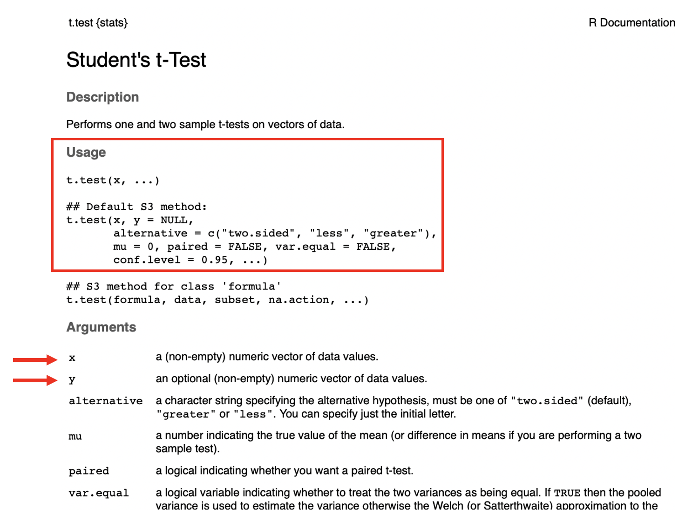
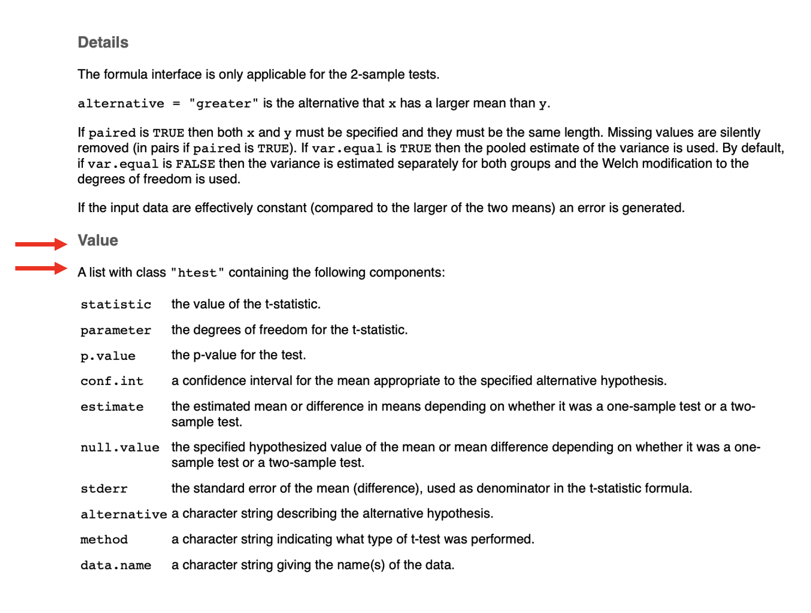
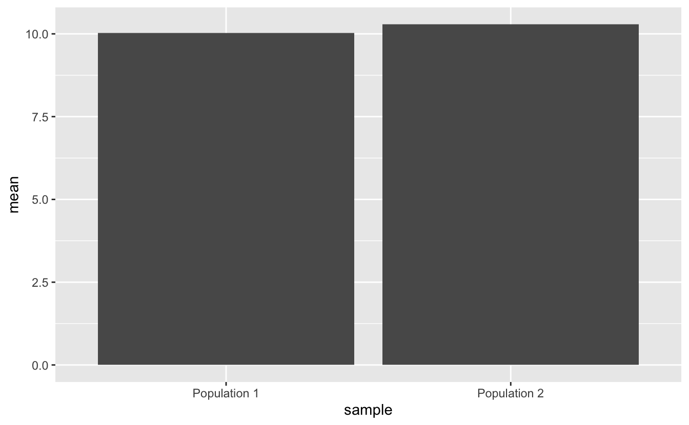
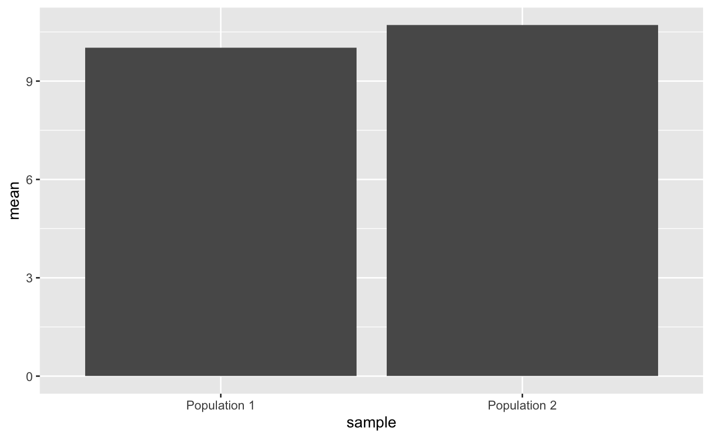
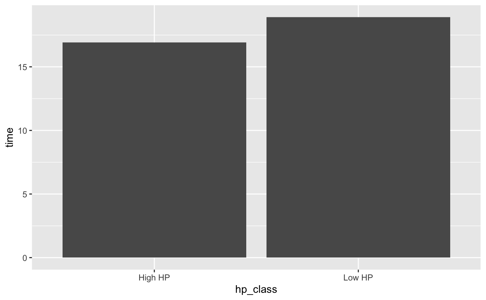
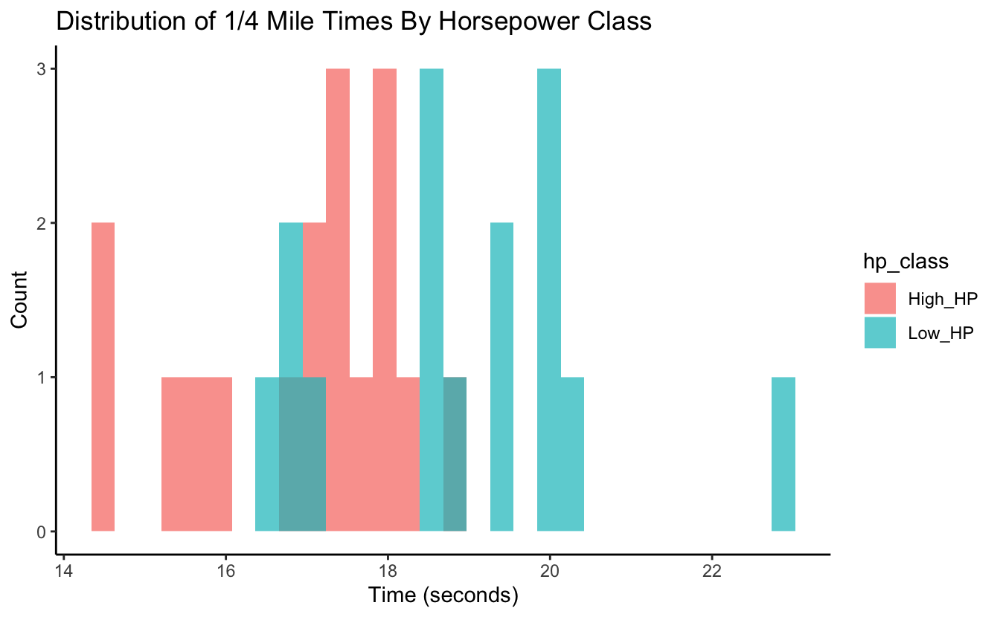

 

## Learning objectives

> -   Identify the types of data structures underlying the inputs and outputs of a basic t-test in R, with focus on vectors, lists, and data frames.
> -   Use a helper tidy package (broom) to clean up t-test results.
> -   Create some t-test-related visualizations.
> -   Practice with some basic tidyverse/dplyr functions (select, filter)

 

------------------------------------------------------------------------

## 1 -- Intro

Starting today, the upcoming block of Code Club sessions will center around performing some common statistical tests in R. We don't plan to dive in to a lot of statistical details, but will instead focus on practical aspects of running the tests/analyses. We'll pay particular attention to things like the types/classes of data that need to go in to each test, the structure of the results that come out, and since R is so good with visualization, we'll probably do a fair amount of plotting along the way too. Let's go ahead and load the tidyverse before we get started...

<pre class='chroma'><code class='language-r' data-lang='r'><a href='https://rdrr.io/r/base/library.html'>library</a>(<a href='https://tidyverse.tidyverse.org'>tidyverse</a>)
</code></pre>

In this session we'll do t-tests with the [`t.test()`](https://rdrr.io/r/stats/t.test.html) function. First I'm going to use the [`rnorm()`](https://rdrr.io/r/stats/Normal.html) function to get some example data to work with by generating random samples (N=20) for each of two populations from a normal distribution with a mean of 10 and standard deviation of 3.

<pre class='chroma'><code class='language-r' data-lang='r'>#generate a sample for population 1
pop1 &lt;- <a href='https://rdrr.io/r/stats/Normal.html'>rnorm</a>(n = 20, mean = 10, sd = 3)
#view the population 1 data
pop1

#&gt;  [1]  5.768260  8.557372 10.971429 10.649832  8.088188 14.940798 12.890222
#&gt;  [8] 11.976135 11.202048 12.652296 12.290697  8.053090  9.374655 11.088953
#&gt; [15]  7.866983  7.948705 12.953359 11.017880  8.615094  3.599791

#generate a sample for population 2
pop2 &lt;- <a href='https://rdrr.io/r/stats/Normal.html'>rnorm</a>(n = 20, mean = 10, sd = 3)
#view the population 2 data
pop2

#&gt;  [1]  7.905270  3.495405 14.574270 13.983999  6.879837  6.010075  4.481750
#&gt;  [8]  5.499168 11.481124 12.772900 13.914296 15.452734 11.653593 17.513278
#&gt; [15] 13.021984  8.409504 12.502958  8.316560  8.356185  9.599970
</code></pre>

A t-test is a good choice here if we want to use our samples to draw inference around whether the true means of these two populations are different. First we can check the means of the samples...

<pre class='chroma'><code class='language-r' data-lang='r'><a href='https://rdrr.io/r/base/mean.html'>mean</a>(pop1)

#&gt; [1] 10.02529

<a href='https://rdrr.io/r/base/mean.html'>mean</a>(pop2)

#&gt; [1] 10.29124
</code></pre>

The sample means are a bit different, but given they're random samples, that's not surprising even if they were drawn from the same population. The question is whether the observed difference in the means is large enough that, at some given level of confidence, we can infer that the true population means are different. Let's take a look at the documentation for the [`t.test()`](https://rdrr.io/r/stats/t.test.html) function...

<pre class='chroma'><code class='language-r' data-lang='r'>?t.test
</code></pre>

Like documentation for all R functions, this gives us some information on how to use [`t.test()`](https://rdrr.io/r/stats/t.test.html). In its most basic form, the only thing that has to be provided is the 'x' argument, though since we have a two-sample test, we'll need to provide both 'x' and 'y'. According to the documentation, these need to be numeric vectors. Let's check that they are...

<pre class='chroma'><code class='language-r' data-lang='r'><a href='https://rdrr.io/r/base/numeric.html'>is.numeric</a>(pop1)

#&gt; [1] TRUE

<a href='https://rdrr.io/r/base/vector.html'>is.vector</a>(pop1)

#&gt; [1] TRUE

<a href='https://rdrr.io/r/base/numeric.html'>is.numeric</a>(pop2)

#&gt; [1] TRUE

<a href='https://rdrr.io/r/base/vector.html'>is.vector</a>(pop2)

#&gt; [1] TRUE
</code></pre>

Looks like our two sets of data are in the right format, so we can run the t-test...

<pre class='chroma'><code class='language-r' data-lang='r'>#run the t-test
<a href='https://rdrr.io/r/stats/t.test.html'>t.test</a>(x = pop1, y = pop2)

#&gt; 
#&gt;   Welch Two Sample t-test
#&gt; 
#&gt; data:  pop1 and pop2
#&gt; t = -0.2477, df = 33.833, p-value = 0.8059
#&gt; alternative hypothesis: true difference in means is not equal to 0
#&gt; 95 percent confidence interval:
#&gt;  -2.448338  1.916431
#&gt; sample estimates:
#&gt; mean of x mean of y 
#&gt;  10.02529  10.29124
</code></pre>

This result gives us several pieces of information. If it's not immediately apparent, we can again get some information about these results from the help, where the "Value" section tells us about what's returned by the function...

It says the result is a list, which is a flexible data structure in R that allows you to store multiple items of different types. This particular list has 10 entries. We can see details with the [`str()`](https://rdrr.io/r/utils/str.html) command. First we'll rerun [`t.test()`](https://rdrr.io/r/stats/t.test.html) and this time save the results as an object named *tresult*...

<pre class='chroma'><code class='language-r' data-lang='r'>#run t.test and save output to 'tresult'
tresult &lt;- <a href='https://rdrr.io/r/stats/t.test.html'>t.test</a>(x = pop1, y = pop2)
#get the structure of 'tresult'
<a href='https://rdrr.io/r/utils/str.html'>str</a>(tresult)

#&gt; List of 10
#&gt;  $ statistic  : Named num -0.248
#&gt;   ..- attr(*, "names")= chr "t"
#&gt;  $ parameter  : Named num 33.8
#&gt;   ..- attr(*, "names")= chr "df"
#&gt;  $ p.value    : num 0.806
#&gt;  $ conf.int   : num [1:2] -2.45 1.92
#&gt;   ..- attr(*, "conf.level")= num 0.95
#&gt;  $ estimate   : Named num [1:2] 10 10.3
#&gt;   ..- attr(*, "names")= chr [1:2] "mean of x" "mean of y"
#&gt;  $ null.value : Named num 0
#&gt;   ..- attr(*, "names")= chr "difference in means"
#&gt;  $ stderr     : num 1.07
#&gt;  $ alternative: chr "two.sided"
#&gt;  $ method     : chr "Welch Two Sample t-test"
#&gt;  $ data.name  : chr "pop1 and pop2"
#&gt;  - attr(*, "class")= chr "htest"
</code></pre>

From this we see that the list of 10 items consists of a mixture of numerics and characters. Each of the list entries has a name, and the '\$' can be used with the name of the entry to extract an item from the list (this applies to lists in general in R - not just this one). Alternatively, the square bracket notation can be used to index (pull out) items from the list. Let's try several options for pulling out the pvalue, which is the 3rd entry...

<pre class='chroma'><code class='language-r' data-lang='r'>tresult$p.value

#&gt; [1] 0.805862

tresult[3]

#&gt; $p.value
#&gt; [1] 0.805862

tresult[[3]]

#&gt; [1] 0.805862
</code></pre>

We've talked in a number of previous Code Club sessions about working with tidy data - this list doesn't fall in to that category, but can be converted to a tidy object with the `tidy()` function from the broom package, which is installed as part of the tidyverse (though not loaded).

<pre class='chroma'><code class='language-r' data-lang='r'>tidytresult &lt;- broom::<a href='https://rdrr.io/pkg/generics/man/tidy.html'>tidy</a>(tresult)
tidytresult

#&gt; # A tibble: 1 x 10
#&gt;   estimate estimate1 estimate2 statistic p.value parameter conf.low conf.high
#&gt;      &lt;dbl&gt;     &lt;dbl&gt;     &lt;dbl&gt;     &lt;dbl&gt;   &lt;dbl&gt;     &lt;dbl&gt;    &lt;dbl&gt;     &lt;dbl&gt;
#&gt; 1   -0.266      10.0      10.3    -0.248   0.806      33.8    -2.45      1.92
#&gt; # … with 2 more variables: method &lt;chr&gt;, alternative &lt;chr&gt;
</code></pre>

The `tidy()` function from broom takes results from a number of base R functions and makes them tidy. Now instead of a list we have a data frame (which actually is just a special kind of list) with 10 columns (though note they don't correspond directly to the 10 entries of the original list).

Having results in this tidy format allows you to use the tidy approaches we've worked with in the past. Let's try plotting the means of the two samples as a simple bar (column) plot. The two sample means are in the *estimate1* and *estimate2* columns. First we'll create a separate data frame that stores those means in long format (the values in one column and associated labels in a separate column).

<pre class='chroma'><code class='language-r' data-lang='r'>#get popualation 1 mean
pop1_mean &lt;- tidytresult %&gt;%
  select(estimate1) %&gt;%
  <a href='https://rdrr.io/r/base/unlist.html'>unlist</a>()
#view population 1 mean
pop1_mean

#&gt; estimate1 
#&gt;  10.02529

#get popualation 1 mean
pop2_mean &lt;- tidytresult %&gt;%
  select(estimate2) %&gt;%
  <a href='https://rdrr.io/r/base/unlist.html'>unlist</a>()
#view population 2 mean
pop2_mean

#&gt; estimate2 
#&gt;  10.29124

means_to_plot &lt;- <a href='https://rdrr.io/r/base/data.frame.html'>data.frame</a>("mean" = <a href='https://rdrr.io/r/base/c.html'>c</a>(pop1_mean, pop2_mean),
                            "sample" = <a href='https://rdrr.io/r/base/c.html'>c</a>("Population 1", "Population 2"))
  
means_to_plot

#&gt;               mean       sample
#&gt; estimate1 10.02529 Population 1
#&gt; estimate2 10.29124 Population 2
</code></pre>

Now we can use that data frame to create the plot with *ggplot2*.

<pre class='chroma'><code class='language-r' data-lang='r'>#get a basic plot
means_to_plot %&gt;% ggplot(aes(x = sample, y = mean)) +
  geom_col()

</code></pre>

And we can do a little customization...

<pre class='chroma'><code class='language-r' data-lang='r'>#customize the plot a bit
means_to_plot %&gt;% ggplot(aes(x = sample, y = mean)) +
  geom_col() +
  theme_classic() +
  labs(title = "Mean Values From Random Samples", 
       x = NULL,
       y = "Mean Value")

</code></pre>

Now let's work with some real data. R has a small example dataset named *mtcars* already built in. It's a data frame with data on different models of car. It can be called with `mtcars`.

<pre class='chroma'><code class='language-r' data-lang='r'>mtcars

#&gt;                      mpg cyl  disp  hp drat    wt  qsec vs am gear carb
#&gt; Mazda RX4           21.0   6 160.0 110 3.90 2.620 16.46  0  1    4    4
#&gt; Mazda RX4 Wag       21.0   6 160.0 110 3.90 2.875 17.02  0  1    4    4
#&gt; Datsun 710          22.8   4 108.0  93 3.85 2.320 18.61  1  1    4    1
#&gt; Hornet 4 Drive      21.4   6 258.0 110 3.08 3.215 19.44  1  0    3    1
#&gt; Hornet Sportabout   18.7   8 360.0 175 3.15 3.440 17.02  0  0    3    2
#&gt; Valiant             18.1   6 225.0 105 2.76 3.460 20.22  1  0    3    1
#&gt; Duster 360          14.3   8 360.0 245 3.21 3.570 15.84  0  0    3    4
#&gt; Merc 240D           24.4   4 146.7  62 3.69 3.190 20.00  1  0    4    2
#&gt; Merc 230            22.8   4 140.8  95 3.92 3.150 22.90  1  0    4    2
#&gt; Merc 280            19.2   6 167.6 123 3.92 3.440 18.30  1  0    4    4
#&gt; Merc 280C           17.8   6 167.6 123 3.92 3.440 18.90  1  0    4    4
#&gt; Merc 450SE          16.4   8 275.8 180 3.07 4.070 17.40  0  0    3    3
#&gt; Merc 450SL          17.3   8 275.8 180 3.07 3.730 17.60  0  0    3    3
#&gt; Merc 450SLC         15.2   8 275.8 180 3.07 3.780 18.00  0  0    3    3
#&gt; Cadillac Fleetwood  10.4   8 472.0 205 2.93 5.250 17.98  0  0    3    4
#&gt; Lincoln Continental 10.4   8 460.0 215 3.00 5.424 17.82  0  0    3    4
#&gt; Chrysler Imperial   14.7   8 440.0 230 3.23 5.345 17.42  0  0    3    4
#&gt; Fiat 128            32.4   4  78.7  66 4.08 2.200 19.47  1  1    4    1
#&gt; Honda Civic         30.4   4  75.7  52 4.93 1.615 18.52  1  1    4    2
#&gt; Toyota Corolla      33.9   4  71.1  65 4.22 1.835 19.90  1  1    4    1
#&gt; Toyota Corona       21.5   4 120.1  97 3.70 2.465 20.01  1  0    3    1
#&gt; Dodge Challenger    15.5   8 318.0 150 2.76 3.520 16.87  0  0    3    2
#&gt; AMC Javelin         15.2   8 304.0 150 3.15 3.435 17.30  0  0    3    2
#&gt; Camaro Z28          13.3   8 350.0 245 3.73 3.840 15.41  0  0    3    4
#&gt; Pontiac Firebird    19.2   8 400.0 175 3.08 3.845 17.05  0  0    3    2
#&gt; Fiat X1-9           27.3   4  79.0  66 4.08 1.935 18.90  1  1    4    1
#&gt; Porsche 914-2       26.0   4 120.3  91 4.43 2.140 16.70  0  1    5    2
#&gt; Lotus Europa        30.4   4  95.1 113 3.77 1.513 16.90  1  1    5    2
#&gt; Ford Pantera L      15.8   8 351.0 264 4.22 3.170 14.50  0  1    5    4
#&gt; Ferrari Dino        19.7   6 145.0 175 3.62 2.770 15.50  0  1    5    6
#&gt; Maserati Bora       15.0   8 301.0 335 3.54 3.570 14.60  0  1    5    8
#&gt; Volvo 142E          21.4   4 121.0 109 4.11 2.780 18.60  1  1    4    2
</code></pre>

As a quick reminder, `select()` allows you to choose columns of a data frame by name, while [`filter()`](https://rdrr.io/r/stats/filter.html) allows you to select rows based on one or more logical (True/False) expressions.

<pre class='chroma'><code class='language-r' data-lang='r'>#example of "select()"
mtcars %&gt;% select(mpg, disp, carb)

#&gt;                      mpg  disp carb
#&gt; Mazda RX4           21.0 160.0    4
#&gt; Mazda RX4 Wag       21.0 160.0    4
#&gt; Datsun 710          22.8 108.0    1
#&gt; Hornet 4 Drive      21.4 258.0    1
#&gt; Hornet Sportabout   18.7 360.0    2
#&gt; Valiant             18.1 225.0    1
#&gt; Duster 360          14.3 360.0    4
#&gt; Merc 240D           24.4 146.7    2
#&gt; Merc 230            22.8 140.8    2
#&gt; Merc 280            19.2 167.6    4
#&gt; Merc 280C           17.8 167.6    4
#&gt; Merc 450SE          16.4 275.8    3
#&gt; Merc 450SL          17.3 275.8    3
#&gt; Merc 450SLC         15.2 275.8    3
#&gt; Cadillac Fleetwood  10.4 472.0    4
#&gt; Lincoln Continental 10.4 460.0    4
#&gt; Chrysler Imperial   14.7 440.0    4
#&gt; Fiat 128            32.4  78.7    1
#&gt; Honda Civic         30.4  75.7    2
#&gt; Toyota Corolla      33.9  71.1    1
#&gt; Toyota Corona       21.5 120.1    1
#&gt; Dodge Challenger    15.5 318.0    2
#&gt; AMC Javelin         15.2 304.0    2
#&gt; Camaro Z28          13.3 350.0    4
#&gt; Pontiac Firebird    19.2 400.0    2
#&gt; Fiat X1-9           27.3  79.0    1
#&gt; Porsche 914-2       26.0 120.3    2
#&gt; Lotus Europa        30.4  95.1    2
#&gt; Ford Pantera L      15.8 351.0    4
#&gt; Ferrari Dino        19.7 145.0    6
#&gt; Maserati Bora       15.0 301.0    8
#&gt; Volvo 142E          21.4 121.0    2

#example of "filter()"
mtcars %&gt;% <a href='https://rdrr.io/r/stats/filter.html'>filter</a>(wt &gt; 4)

#&gt;                      mpg cyl  disp  hp drat    wt  qsec vs am gear carb
#&gt; Merc 450SE          16.4   8 275.8 180 3.07 4.070 17.40  0  0    3    3
#&gt; Cadillac Fleetwood  10.4   8 472.0 205 2.93 5.250 17.98  0  0    3    4
#&gt; Lincoln Continental 10.4   8 460.0 215 3.00 5.424 17.82  0  0    3    4
#&gt; Chrysler Imperial   14.7   8 440.0 230 3.23 5.345 17.42  0  0    3    4
</code></pre>

We'll focus on just a couple of the variables in this dataset: Horsepower (hp) and 1/4 mile time in seconds (qsec). Note that in some cases I've provided a couple equivalent solutions that represent a tidy way of doing things (generally preferred) and a non-tidy (aka base R) way of doing things, just so you can see the difference if you are interested. If this is likely to confuse you, feel free to ignore the alternative (non-tidy) parts.

------------------------------------------------------------------------

### Breakout Room: Does Average 1/4-mile Speed Differ For High And Low Horsepower Cars?

We'll define "low" horsepower cars as those with \<120 hp, and "high" horsepower cars as \>=120 hp. First let's get the average 1/4-mile times (qsec) for each of these groups. Save these mean times as the objects 'low_hp_time' and 'high_hp_time'.

<b>Hint</b> (click here)

  Use [`filter()`](https://rdrr.io/r/stats/filter.html), `select()`, and [`unlist()`](https://rdrr.io/r/base/unlist.html) to pull out the appropriate sets of numeric values for each group, and then [`mean()`](https://rdrr.io/r/base/mean.html) to get the averages. Note that [`unlist()`](https://rdrr.io/r/base/unlist.html) takes a list or data frame object and "flattens" it, or in other words, simplifies it down to, in this case, a numeric vector.  

<b>Solution 1 (tidy)</b> (click here)

<pre class='chroma'><code class='language-r' data-lang='r'>low_hp_time &lt;- mtcars %&gt;%
  <a href='https://rdrr.io/r/stats/filter.html'>filter</a>(hp &lt; 120) %&gt;%
  select(qsec) %&gt;%
  <a href='https://rdrr.io/r/base/unlist.html'>unlist</a>() %&gt;%
  <a href='https://rdrr.io/r/base/mean.html'>mean</a>()

low_hp_time

#&gt; [1] 18.91

high_hp_time &lt;- mtcars %&gt;%
  <a href='https://rdrr.io/r/stats/filter.html'>filter</a>(hp &gt;= 120) %&gt;%
  select(qsec) %&gt;%
  <a href='https://rdrr.io/r/base/unlist.html'>unlist</a>() %&gt;%
  <a href='https://rdrr.io/r/base/mean.html'>mean</a>()

high_hp_time

#&gt; [1] 16.91235
</code></pre>

<b>Solution 2 (not tidy) </b> (click here)

<pre class='chroma'><code class='language-r' data-lang='r'>low_hp_time &lt;- <a href='https://rdrr.io/r/base/mean.html'>mean</a>(mtcars$qsec[mtcars$hp &lt; 120]) 

low_hp_time

#&gt; [1] 18.91

high_hp_time &lt;- <a href='https://rdrr.io/r/base/mean.html'>mean</a>(mtcars$qsec[mtcars$hp &gt;= 120])

high_hp_time

#&gt; [1] 16.91235
</code></pre>

 

Now let's plot those mean values with a bar plot (`geom_col()`).

<b>Hint</b> (click here)

  All ggplots (`geom_col()` is a ggplot function) need input data from a data frame (or tibble, which is just a special data frame). First create a data frame named "time_df" that has a column named "time" that stores the average qsec values and a column named "hp_class" that indicates whether the corresponding time is for "High HP" or "Low HP" cars. Then map the ggplot "x" aesthetic to the "hp_class" column and the "y" aesthetic to the "time" column and add a `geom_col()` layer. 

<b>Solution</b> (click here)

<pre class='chroma'><code class='language-r' data-lang='r'>time_df &lt;- <a href='https://rdrr.io/r/base/data.frame.html'>data.frame</a>("time" = <a href='https://rdrr.io/r/base/c.html'>c</a>(low_hp_time, high_hp_time),
                      "hp_class" = <a href='https://rdrr.io/r/base/c.html'>c</a>("Low HP", "High HP"))

time_df

#&gt;       time hp_class
#&gt; 1 18.91000   Low HP
#&gt; 2 16.91235  High HP

time_df %&gt;% ggplot(aes(x = hp_class, y = time)) +
  geom_col()

</code></pre>

 

So, do these data provide evidence for true differences in 1/4 mile speed between high and low horsepower cars? Try running a t-test to test for differences in the two groups of 1/4 mile times, and save the pvalue as an object named *speed_p*.

<b>Hint</b> (click here)

  Use the [`t.test()`](https://rdrr.io/r/stats/t.test.html) function. Remember that the "x" and "y" arguments each need to be numeric vectors.  

<b>Solution 1 (tidy)</b> (click here)

<pre class='chroma'><code class='language-r' data-lang='r'>#get the values for low-horsepower cars
low_hp_vals &lt;- mtcars %&gt;%
  <a href='https://rdrr.io/r/stats/filter.html'>filter</a>(hp &lt; 120) %&gt;%
  select(qsec) %&gt;%
  <a href='https://rdrr.io/r/base/unlist.html'>unlist</a>()

#get the values for high-horsepower cars
high_hp_vals &lt;- mtcars %&gt;%
  <a href='https://rdrr.io/r/stats/filter.html'>filter</a>(hp &gt;= 120) %&gt;%
  select(qsec) %&gt;%
  <a href='https://rdrr.io/r/base/unlist.html'>unlist</a>()

#run the t-test and save the results
speed_res &lt;- <a href='https://rdrr.io/r/stats/t.test.html'>t.test</a>(x = low_hp_vals, y = high_hp_vals)

speed_p &lt;- speed_res$p.value

speed_p

#&gt; [1] 0.001007059
</code></pre>

<b>Solution 2 (not tidy)</b> (click here)

<pre class='chroma'><code class='language-r' data-lang='r'>#get the values for low-horsepower cars
low_hp_vals &lt;- mtcars$qsec[mtcars$hp &lt; 120]

#get the values for high-horsepower cars
high_hp_vals &lt;- mtcars$qsec[mtcars$hp &gt;= 120]

#run the t-test and save the results
speed_res &lt;- <a href='https://rdrr.io/r/stats/t.test.html'>t.test</a>(x = low_hp_vals, y = high_hp_vals)

speed_p &lt;- speed_res$p.value

speed_p

#&gt; [1] 0.001007059
</code></pre>

 

Try running the same test as above, but this time, do it as a one-sided test, with the alternative hypothesis that the 1/4-mile time for the high-horsepower group will be lower than that for the low-horsepower group. How does the p-value from this test compare to the previous (two-sided) test?

<b>Hint</b> (click here)

  Check out the *alternative* argument on the t.test help page, along with information in the **Details** section of that same page.  

<b>Solution</b> (click here)

<pre class='chroma'><code class='language-r' data-lang='r'>#run the t-test and save the results
speed_res &lt;- <a href='https://rdrr.io/r/stats/t.test.html'>t.test</a>(x = low_hp_vals, y = high_hp_vals, alternative = "greater")

speed_p &lt;- speed_res$p.value

speed_p

#&gt; [1] 0.0005035295
</code></pre>

------------------------------------------------------------------------

### Bonus

 

Let's try to visualize the data in a different way? This time, let's try plotting the distribution of values in each of the samples together on a single plot. See if you can recreate the plot below...

<b>Hint</b> (click here)

  First obtain a long data frame with the raw values for both groups in one column, and an identifier (high-hp, low-hp) in another column. You can do this by hand, using similar methods as we used in exercises above, or you can go back to the original *mtcars* data frame and use `mutate()` in combination with either [`ifelse()`](https://rdrr.io/r/base/ifelse.html) or `case_when()` to add the identifier column. Then use `geom_histogram()`, adjusting the *alpha* and *position* arguments, and customize the theme and the labels.  

<b>Solution</b> (click here)

<pre class='chroma'><code class='language-r' data-lang='r'>mtcars %&gt;% mutate("hp_class" = <a href='https://rdrr.io/r/base/ifelse.html'>ifelse</a>(hp &lt; 120, "Low_HP", "High_HP")) %&gt;%
  ggplot(aes(x = qsec, fill = hp_class)) +
  geom_histogram(alpha = 0.7, position = "identity") +
  theme_classic() +
  labs(x = "Time (seconds)",
       y = "Count",
       title = "Distribution of 1/4 Mile Times By Horsepower Class")

#&gt; `stat_bin()` using `bins = 30`. Pick better value with `binwidth`.

</code></pre>

 

------------------------------------------------------------------------

