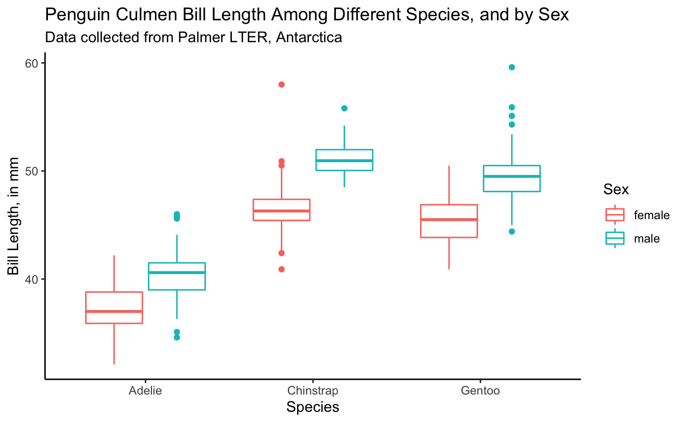
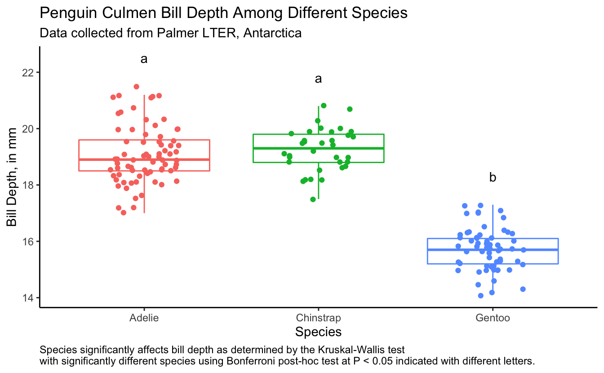

------------------------------------------------------------------------

## Prep homework

### Basic computer setup

-   If you didn't already do this, please follow the [Code Club Computer Setup](/codeclub-setup/04_ggplot2/) instructions, which also has pointers for if you're new to R or RStudio.

-   If you're able to do so, please open RStudio a bit before Code Club starts -- and in case you run into issues, please join the Zoom call early and we'll help you troubleshoot.

### New to ggplot?

This isn't a ggplot specific session, though we will be using it a bit. Check out the past Code Club sessions covering `ggplot2`:

-   [S01E04](/codeclub/04_ggplot2/): intro to ggplot2
-   [S01E05](/codeclub/05_ggplot-round-2/): intro to ggplot2 round 2
-   [S01E10](/codeclub/10_faceting-animating/): faceting and animating
-   [S02E06](/codeclub/s02e06_ggplot2/): another intro to ggplot2
-   [S02E07](/codeclub/s02e07_ggplot2_part2/): a second intro to ggplot2 round 2
-   [S02E08](/codeclub/s02e08_multiple_plots/): combining plots using faceting
-   [S02E09](/codeclub/s02e09_multiple_plots_part2/): combining plots using faceting and patchwork
-   [S02E10](/codeclub/s02e10_ggpubr/): adding statistics to plots
-   [S02E11](/codeclub/s02e12_plotly/)

If you've never used `ggplot2` before (or even if you have), you may find [this cheat sheet](https://github.com/rstudio/cheatsheets/blob/master/data-visualization-2.1.pdf) useful.

### Adding statistics to plots

We had a previous session [S02E10](/codeclub/s02e10_ggpubr/) developed by Daniel Quiroz that covers the package `ggpubr` and adding statistics to ggplots.

### We already did t-tests

Mike Sovic covered in the last code club [S03E01](/codeclub/s03e01_ttests/) how to run t-tests in R. We will be building on what we learned last week.

 

## Getting Started

Click here to get an Rmd (optional)

### RMarkdown for today

<pre class='chroma'><code class='language-r' data-lang='r'># directory 
<a href='https://rdrr.io/r/base/files2.html'>dir.create</a>("S03E02")

# directory for our RMarkdown
# ("recursive" to create two levels at once.)
<a href='https://rdrr.io/r/base/files2.html'>dir.create</a>("S03E02/Rmd/")

# save the url location for today's script
todays_Rmd &lt;- 
  "https://raw.githubusercontent.com/biodash/biodash.github.io/master/content/codeclub/S03E02_anova/anova.Rmd"

# indicate the name of the new Rmd
S03E02_Rmd &lt;- "S03E02/Rmd/S03E02_anova.Rmd"

# go get that file! 
<a href='https://rdrr.io/r/utils/download.file.html'>download.file</a>(url = todays_Rmd,
              destfile = S03E02_Rmd)</code></pre>

 

 

------------------------------------------------------------------------

### Introduction

Often people are first introduced to the R programming language when they are wanting to conduct statistical analyses. My experience is that beginners are often able to conduct the analysis they want, and print their results to the console. But, the process of locating and then using the output of their analysis tends to be more complex.

Today, we are going to go over how to:

-   test if our data is suitable for running ANOVA
-   run an ANOVA test
-   run posthoc tests to understand group differences
-   use the ANOVA data output object as a means to understand R data structure.

The purpose of today's session is more to give you practical experience with running and retrieving ANOVA analysis output, than teaching about the assumptions and background of the test itself.

If you are looking for a good statistics test, I would recommend Dr. Kristin Mercer's [HCS 8887 Experimental Design](https://hcs.osu.edu/courses/hcs-8887).

 

------------------------------------------------------------------------

#### - Load libraries, get data

We are going to start with our favorite dataset `palmerpenguins` to provide the input data for our analysis.

<pre class='chroma'><code class='language-r' data-lang='r'><a href='https://rdrr.io/r/base/library.html'>library</a>(<a href='https://tidyverse.tidyverse.org'>tidyverse</a>)
<a href='https://rdrr.io/r/base/library.html'>library</a>(<a href='https://allisonhorst.github.io/palmerpenguins/'>palmerpenguins</a>) # for data
<a href='https://rdrr.io/r/base/library.html'>library</a>(<a href='https://rpkgs.datanovia.com/rstatix/'>rstatix</a>) # for testing assumptions
<a href='https://rdrr.io/r/base/library.html'>library</a>(agricolae) # for post-hoc comparison of groups</code></pre>

 

------------------------------------------------------------------------

## 1 - Getting acclimated

Some words on syntax: the dataset `penguins` is an object within the `palmerpenguins` package. If you call the object `penguins` (after executing [`library(palmerpenguins)`](https://allisonhorst.github.io/palmerpenguins/)), you will be able to see what is contained within that dataframe.

<pre class='chroma'><code class='language-r' data-lang='r'>penguins
#&gt; # A tibble: 344 × 8
#&gt;    species island    bill_length_mm bill_depth_mm flipper_length_mm body_mass_g
#&gt;    &lt;fct&gt;   &lt;fct&gt;              &lt;dbl&gt;         &lt;dbl&gt;             &lt;int&gt;       &lt;int&gt;
#&gt;  1 Adelie  Torgersen           39.1          18.7               181        3750
#&gt;  2 Adelie  Torgersen           39.5          17.4               186        3800
#&gt;  3 Adelie  Torgersen           40.3          18                 195        3250
#&gt;  4 Adelie  Torgersen           NA            NA                  NA          NA
#&gt;  5 Adelie  Torgersen           36.7          19.3               193        3450
#&gt;  6 Adelie  Torgersen           39.3          20.6               190        3650
#&gt;  7 Adelie  Torgersen           38.9          17.8               181        3625
#&gt;  8 Adelie  Torgersen           39.2          19.6               195        4675
#&gt;  9 Adelie  Torgersen           34.1          18.1               193        3475
#&gt; 10 Adelie  Torgersen           42            20.2               190        4250
#&gt; # … with 334 more rows, and 2 more variables: sex &lt;fct&gt;, year &lt;int&gt;</code></pre>

However, `penguins` will not be in your environment tab because it is not in your local environment. You can use it without it being in your local environment, but if you are bothered by this, you can save a copy in your local environment such it shows up in that top right pane.

<pre class='chroma'><code class='language-r' data-lang='r'>penguins &lt;- penguins</code></pre>

What is within this dataset?

<pre class='chroma'><code class='language-r' data-lang='r'><a href='https://pillar.r-lib.org/reference/glimpse.html'>glimpse</a>(penguins)
#&gt; Rows: 344
#&gt; Columns: 8
#&gt; $ species           &lt;fct&gt; Adelie, Adelie, Adelie, Adelie, Adelie, Adelie, Adel…
#&gt; $ island            &lt;fct&gt; Torgersen, Torgersen, Torgersen, Torgersen, Torgerse…
#&gt; $ bill_length_mm    &lt;dbl&gt; 39.1, 39.5, 40.3, NA, 36.7, 39.3, 38.9, 39.2, 34.1, …
#&gt; $ bill_depth_mm     &lt;dbl&gt; 18.7, 17.4, 18.0, NA, 19.3, 20.6, 17.8, 19.6, 18.1, …
#&gt; $ flipper_length_mm &lt;int&gt; 181, 186, 195, NA, 193, 190, 181, 195, 193, 190, 186…
#&gt; $ body_mass_g       &lt;int&gt; 3750, 3800, 3250, NA, 3450, 3650, 3625, 4675, 3475, …
#&gt; $ sex               &lt;fct&gt; male, female, female, NA, female, male, female, male…
#&gt; $ year              &lt;int&gt; 2007, 2007, 2007, 2007, 2007, 2007, 2007, 2007, 2007…</code></pre>

Illustration by [Allison Horst](https://allisonhorst.github.io/palmerpenguins/articles/art.html)

 

------------------------------------------------------------------------

## 2. ANOVA function

We want to see if there are any differences in bill length (`bill_length_mm`) in penguins by `sex` or by `species`. We do this using ANOVA.

Illustration by [Allison Horst](https://allisonhorst.github.io/palmerpenguins/articles/art.html)

First let's get some descriptive information about our data.

<pre class='chroma'><code class='language-r' data-lang='r'>penguins <a href='https://rpkgs.datanovia.com/rstatix/reference/pipe.html'>%&gt;%</a>
  <a href='https://tidyr.tidyverse.org/reference/drop_na.html'>drop_na</a>() <a href='https://rpkgs.datanovia.com/rstatix/reference/pipe.html'>%&gt;%</a>
  <a href='https://dplyr.tidyverse.org/reference/group_by.html'>group_by</a>(species, sex) <a href='https://rpkgs.datanovia.com/rstatix/reference/pipe.html'>%&gt;%</a>
  <a href='https://dplyr.tidyverse.org/reference/count.html'>count</a>()
#&gt; # A tibble: 6 × 3
#&gt; # Groups:   species, sex [6]
#&gt;   species   sex        n
#&gt;   &lt;fct&gt;     &lt;fct&gt;  &lt;int&gt;
#&gt; 1 Adelie    female    73
#&gt; 2 Adelie    male      73
#&gt; 3 Chinstrap female    34
#&gt; 4 Chinstrap male      34
#&gt; 5 Gentoo    female    58
#&gt; 6 Gentoo    male      61</code></pre>

The most commonly used function to run ANOVA in R is called [`aov()`](https://www.rdocumentation.org/packages/stats/versions/3.6.2/topics/aov) which is a part of the `stats` package that is pre-loaded with base R. So no new packages need to be installed here.

If we want to learn more about the function [`aov()`](https://rdrr.io/r/stats/aov.html) we can do so using the code below. The help documentation will show up in the bottom right quadrant of your RStudio.

<pre class='chroma'><code class='language-r' data-lang='r'>?aov</code></pre>

We can run an ANOVA by indicating our model, and here I'm also selecting to drop the NAs.

<pre class='chroma'><code class='language-r' data-lang='r'>bill_length_anova &lt;- 
  <a href='https://rdrr.io/r/stats/aov.html'>aov</a>(data = penguins <a href='https://rpkgs.datanovia.com/rstatix/reference/pipe.html'>%&gt;%</a> <a href='https://tidyr.tidyverse.org/reference/drop_na.html'>drop_na</a>(),
      bill_length_mm ~ species + sex + species*sex)</code></pre>

<pre class='chroma'><code class='language-r' data-lang='r'><a href='https://rdrr.io/r/base/summary.html'>summary</a>(bill_length_anova)
#&gt;              Df Sum Sq Mean Sq F value Pr(&gt;F)    
#&gt; species       2   7015    3508 654.189 &lt;2e-16 ***
#&gt; sex           1   1136    1136 211.807 &lt;2e-16 ***
#&gt; species:sex   2     24      12   2.284  0.103    
#&gt; Residuals   327   1753       5                   
#&gt; ---
#&gt; Signif. codes:  0 '***' 0.001 '**' 0.01 '*' 0.05 '.' 0.1 ' ' 1</code></pre>

Illustration by [Allison Horst](https://github.com/allisonhorst/stats-illustrations)

We can take the output of our ANOVA and use the function [`tidy()`](https://generics.r-lib.org/reference/tidy.html) within the `broom` package to turn our output into a tidy table.

<pre class='chroma'><code class='language-r' data-lang='r'>tidy_anova &lt;- broom::<a href='https://generics.r-lib.org/reference/tidy.html'>tidy</a>(bill_length_anova)

<a href='https://rdrr.io/r/base/print.html'>print</a>(tidy_anova)
#&gt; # A tibble: 4 × 6
#&gt;   term           df  sumsq  meansq statistic    p.value
#&gt;   &lt;chr&gt;       &lt;dbl&gt;  &lt;dbl&gt;   &lt;dbl&gt;     &lt;dbl&gt;      &lt;dbl&gt;
#&gt; 1 species         2 7015.  3508.      654.    5.03e-115
#&gt; 2 sex             1 1136.  1136.      212.    2.42e- 37
#&gt; 3 species:sex     2   24.5   12.2       2.28  1.03e-  1
#&gt; 4 Residuals     327 1753.     5.36     NA    NA    </code></pre>

We can also look at our data by visually plotting it, as below.

<pre class='chroma'><code class='language-r' data-lang='r'>penguins <a href='https://rpkgs.datanovia.com/rstatix/reference/pipe.html'>%&gt;%</a>
  <a href='https://tidyr.tidyverse.org/reference/drop_na.html'>drop_na</a>() <a href='https://rpkgs.datanovia.com/rstatix/reference/pipe.html'>%&gt;%</a>
  <a href='https://ggplot2.tidyverse.org/reference/ggplot.html'>ggplot</a>(<a href='https://ggplot2.tidyverse.org/reference/aes.html'>aes</a>(x = species, y = bill_length_mm, color = sex)) +
  <a href='https://ggplot2.tidyverse.org/reference/geom_boxplot.html'>geom_boxplot</a>()
</code></pre>

## 3. Posthoc group analysis

Now that we've seen that `sex` and `species` are significant effectors of `bill_length_mm`, our next logical question might be, which groups are different from each other? We can determine this by conducting post-hoc tests. We will do our post-hoc analysis using Tukey's Honestly Significant Difference test and the function [`HSD.test()`](https://www.rdocumentation.org/packages/agricolae/versions/1.3-5/topics/HSD.test) which is a part of the useful package `agricolae`.

<pre class='chroma'><code class='language-r' data-lang='r'>tukey_bill_length &lt;- <a href='https://rdrr.io/pkg/agricolae/man/HSD.test.html'>HSD.test</a>(bill_length_anova, 
                      trt = <a href='https://rdrr.io/r/base/c.html'>c</a>("species", "sex"), 
                      console = TRUE) # prints the results to console
#&gt; 
#&gt; Study: bill_length_anova ~ c("species", "sex")
#&gt; 
#&gt; HSD Test for bill_length_mm 
#&gt; 
#&gt; Mean Square Error:  5.361892 
#&gt; 
#&gt; species:sex,  means
#&gt; 
#&gt;                  bill_length_mm      std  r  Min  Max
#&gt; Adelie:female          37.25753 2.028883 73 32.1 42.2
#&gt; Adelie:male            40.39041 2.277131 73 34.6 46.0
#&gt; Chinstrap:female       46.57353 3.108669 34 40.9 58.0
#&gt; Chinstrap:male         51.09412 1.564558 34 48.5 55.8
#&gt; Gentoo:female          45.56379 2.051247 58 40.9 50.5
#&gt; Gentoo:male            49.47377 2.720594 61 44.4 59.6
#&gt; 
#&gt; Alpha: 0.05 ; DF Error: 327 
#&gt; Critical Value of Studentized Range: 4.054126 
#&gt; 
#&gt; Groups according to probability of means differences and alpha level( 0.05 )
#&gt; 
#&gt; Treatments with the same letter are not significantly different.
#&gt; 
#&gt;                  bill_length_mm groups
#&gt; Chinstrap:male         51.09412      a
#&gt; Gentoo:male            49.47377      b
#&gt; Chinstrap:female       46.57353      c
#&gt; Gentoo:female          45.56379      c
#&gt; Adelie:male            40.39041      d
#&gt; Adelie:female          37.25753      e</code></pre>

Like we did with t-tests, you can also look at the resulting HSD.test object (here, `tukey_bill_length`) in your environment pane.

Here, instead of using the `broom` package, you can convert the part of the `tukey_bill_length` object that contains the post-hoc groupings into a dataframe using [`as.data.frame()`](https://rdrr.io/r/base/as.data.frame.html).

<pre class='chroma'><code class='language-r' data-lang='r'>tidy_tukey &lt;- <a href='https://rdrr.io/r/base/as.data.frame.html'>as.data.frame</a>(tukey_bill_length$groups)</code></pre>

 

------------------------------------------------------------------------

## 4. Testing assumptions

I know I said we weren't going to talk about this, but I thought I'd be remiss if I didn't show you how to test that you aren't violating any of the assumptions needed to conduct an ANOVA. We went over this a little bit back in the session put together by Daniel Quiroz on [ggpubr](https://biodash.github.io/codeclub/s02e10_ggpubr/) and adding statistical results to ggplots.

Briefly, in order to use parametric procedures (like ANOVA), we need to be sure our data meets the assumptions for 1) normality and 2) constant variance. This can be done in a few different ways.

### Shapiro-Wilk test for normality

We are going to use the Shapiro-Wilk test (using the function [`shapiro_test()`](https://rpkgs.datanovia.com/rstatix/reference/shapiro_test.html) which is in the package `rstatix` to determine normality, but will do it groupwise. This function is a pipe-friendly wrapper for the function [`shapiro.test()`](https://www.rdocumentation.org/packages/stats/versions/3.6.2/topics/shapiro.test), which just means you can use it with pipes.

<pre class='chroma'><code class='language-r' data-lang='r'>penguins <a href='https://rpkgs.datanovia.com/rstatix/reference/pipe.html'>%&gt;%</a>
  <a href='https://tidyr.tidyverse.org/reference/drop_na.html'>drop_na</a>() <a href='https://rpkgs.datanovia.com/rstatix/reference/pipe.html'>%&gt;%</a>
  rstatix::<a href='https://rpkgs.datanovia.com/rstatix/reference/shapiro_test.html'>shapiro_test</a>(bill_length_mm)
#&gt; # A tibble: 1 × 3
#&gt;   variable       statistic         p
#&gt;   &lt;chr&gt;              &lt;dbl&gt;     &lt;dbl&gt;
#&gt; 1 bill_length_mm     0.974 0.0000119

penguins <a href='https://rpkgs.datanovia.com/rstatix/reference/pipe.html'>%&gt;%</a>
  <a href='https://tidyr.tidyverse.org/reference/drop_na.html'>drop_na</a>() <a href='https://rpkgs.datanovia.com/rstatix/reference/pipe.html'>%&gt;%</a>
  <a href='https://dplyr.tidyverse.org/reference/group_by.html'>group_by</a>(species, sex) <a href='https://rpkgs.datanovia.com/rstatix/reference/pipe.html'>%&gt;%</a>
  rstatix::<a href='https://rpkgs.datanovia.com/rstatix/reference/shapiro_test.html'>shapiro_test</a>(bill_length_mm)
#&gt; # A tibble: 6 × 5
#&gt;   species   sex    variable       statistic       p
#&gt;   &lt;fct&gt;     &lt;fct&gt;  &lt;chr&gt;              &lt;dbl&gt;   &lt;dbl&gt;
#&gt; 1 Adelie    female bill_length_mm     0.991 0.895  
#&gt; 2 Adelie    male   bill_length_mm     0.986 0.607  
#&gt; 3 Chinstrap female bill_length_mm     0.883 0.00170
#&gt; 4 Chinstrap male   bill_length_mm     0.955 0.177  
#&gt; 5 Gentoo    female bill_length_mm     0.989 0.895  
#&gt; 6 Gentoo    male   bill_length_mm     0.940 0.00511</code></pre>

Can we visualize normality in another way?

<pre class='chroma'><code class='language-r' data-lang='r'>penguins <a href='https://rpkgs.datanovia.com/rstatix/reference/pipe.html'>%&gt;%</a>
  <a href='https://tidyr.tidyverse.org/reference/drop_na.html'>drop_na</a>() <a href='https://rpkgs.datanovia.com/rstatix/reference/pipe.html'>%&gt;%</a>
  <a href='https://ggplot2.tidyverse.org/reference/ggplot.html'>ggplot</a>(<a href='https://ggplot2.tidyverse.org/reference/aes.html'>aes</a>(x = bill_length_mm)) +
  <a href='https://ggplot2.tidyverse.org/reference/geom_histogram.html'>geom_histogram</a>() +
  <a href='https://ggplot2.tidyverse.org/reference/facet_grid.html'>facet_grid</a>(cols = <a href='https://ggplot2.tidyverse.org/reference/vars.html'>vars</a>(species),
             rows = <a href='https://ggplot2.tidyverse.org/reference/vars.html'>vars</a>(sex))
#&gt; `stat_bin()` using `bins = 30`. Pick better value with `binwidth`.
</code></pre>

### Equal variance

We can test for equal variance using Levene's test, [`levene_test()`](https://www.rdocumentation.org/packages/rstatix/versions/0.7.0/topics/levene_test) which is part of the `rstatix` package. Again, this is a pipe-friendly wrapper for the function [`levene.test()`](https://www.rdocumentation.org/packages/lawstat/versions/3.4/topics/levene.test).

<pre class='chroma'><code class='language-r' data-lang='r'>rstatix::<a href='https://rpkgs.datanovia.com/rstatix/reference/levene_test.html'>levene_test</a>(data = penguins <a href='https://rpkgs.datanovia.com/rstatix/reference/pipe.html'>%&gt;%</a> <a href='https://tidyr.tidyverse.org/reference/drop_na.html'>drop_na</a>(),
                       bill_length_mm ~ species*sex)
#&gt; # A tibble: 1 × 4
#&gt;     df1   df2 statistic     p
#&gt;   &lt;int&gt; &lt;int&gt;     &lt;dbl&gt; &lt;dbl&gt;
#&gt; 1     5   327      1.40 0.222</code></pre>

 

------------------------------------------------------------------------

## 5. Bringing it together in a plot

We already looked at a first-pass plot, but let's customize it now, and add our statistical info. Here is our base plot.

<pre class='chroma'><code class='language-r' data-lang='r'>penguins <a href='https://rpkgs.datanovia.com/rstatix/reference/pipe.html'>%&gt;%</a>
  <a href='https://tidyr.tidyverse.org/reference/drop_na.html'>drop_na</a>() <a href='https://rpkgs.datanovia.com/rstatix/reference/pipe.html'>%&gt;%</a>
  <a href='https://ggplot2.tidyverse.org/reference/ggplot.html'>ggplot</a>(<a href='https://ggplot2.tidyverse.org/reference/aes.html'>aes</a>(x = species, y = bill_length_mm, color = sex)) +
  <a href='https://ggplot2.tidyverse.org/reference/geom_boxplot.html'>geom_boxplot</a>()
</code></pre>

First let's make the plot more aesthetically pleasing.

<pre class='chroma'><code class='language-r' data-lang='r'>(bill_length_plot &lt;- penguins <a href='https://rpkgs.datanovia.com/rstatix/reference/pipe.html'>%&gt;%</a>
  <a href='https://tidyr.tidyverse.org/reference/drop_na.html'>drop_na</a>() <a href='https://rpkgs.datanovia.com/rstatix/reference/pipe.html'>%&gt;%</a>
  <a href='https://ggplot2.tidyverse.org/reference/ggplot.html'>ggplot</a>(<a href='https://ggplot2.tidyverse.org/reference/aes.html'>aes</a>(x = species, y = bill_length_mm, color = sex)) +
  <a href='https://ggplot2.tidyverse.org/reference/geom_boxplot.html'>geom_boxplot</a>() +
  <a href='https://ggplot2.tidyverse.org/reference/ggtheme.html'>theme_classic</a>() + 
  <a href='https://ggplot2.tidyverse.org/reference/labs.html'>labs</a>(x = "Species",
       y = "Bill Length, in mm",
       color = "Sex",
       title = "Penguin Culmen Bill Length Among Different Species, and by Sex",
       subtitle = "Data collected from Palmer LTER, Antarctica"))
</code></pre>

We want to add the letters to this plot, so we can tell which groups of species by sex are significantly different. We are going to figure out what the maximum `bill_length_mm` for each species by sex is, so it will help us determine where to put our letter labels. Then, we cna add our labels to be higher than the largest data point.

<pre class='chroma'><code class='language-r' data-lang='r'>bill_length_max &lt;- penguins <a href='https://rpkgs.datanovia.com/rstatix/reference/pipe.html'>%&gt;%</a>
  <a href='https://tidyr.tidyverse.org/reference/drop_na.html'>drop_na</a>() <a href='https://rpkgs.datanovia.com/rstatix/reference/pipe.html'>%&gt;%</a>
  <a href='https://dplyr.tidyverse.org/reference/group_by.html'>group_by</a>(species, sex) <a href='https://rpkgs.datanovia.com/rstatix/reference/pipe.html'>%&gt;%</a>
  <a href='https://dplyr.tidyverse.org/reference/summarise.html'>summarize</a>(max_bill_length_mm = <a href='https://rdrr.io/r/base/Extremes.html'>max</a>(bill_length_mm))
#&gt; `summarise()` has grouped output by 'species'. You can override using the `.groups` argument.

bill_length_max
#&gt; # A tibble: 6 × 3
#&gt; # Groups:   species [3]
#&gt;   species   sex    max_bill_length_mm
#&gt;   &lt;fct&gt;     &lt;fct&gt;               &lt;dbl&gt;
#&gt; 1 Adelie    female               42.2
#&gt; 2 Adelie    male                 46  
#&gt; 3 Chinstrap female               58  
#&gt; 4 Chinstrap male                 55.8
#&gt; 5 Gentoo    female               50.5
#&gt; 6 Gentoo    male                 59.6</code></pre>

Let's add our post-hoc group info to `bill_length_max`, since those two dataframes are not in the same order. We are going to use the function [`separate()`](https://tidyr.tidyverse.org/reference/separate.html) which we used back in a [previous code club](https://biodash.github.io/codeclub/20_cleaning-up/#5---separate-character-columns).

<pre class='chroma'><code class='language-r' data-lang='r'>tidier_tukey &lt;- tidy_tukey <a href='https://rpkgs.datanovia.com/rstatix/reference/pipe.html'>%&gt;%</a>
  <a href='https://tibble.tidyverse.org/reference/rownames.html'>rownames_to_column</a>() <a href='https://rpkgs.datanovia.com/rstatix/reference/pipe.html'>%&gt;%</a>
  <a href='https://tidyr.tidyverse.org/reference/separate.html'>separate</a>(col = rowname,
           into = <a href='https://rdrr.io/r/base/c.html'>c</a>("species", "sex"),
           sep = ":")
  

bill_for_plotting &lt;- <a href='https://dplyr.tidyverse.org/reference/mutate-joins.html'>full_join</a>(tidier_tukey, bill_length_max,
                               by = <a href='https://rdrr.io/r/base/c.html'>c</a>("species", "sex"))</code></pre>

Let's plot.

<pre class='chroma'><code class='language-r' data-lang='r'>bill_length_plot +
  <a href='https://ggplot2.tidyverse.org/reference/geom_text.html'>geom_text</a>(data = bill_for_plotting,
            <a href='https://ggplot2.tidyverse.org/reference/aes.html'>aes</a>(x = species,
                y = 5 + max_bill_length_mm, 
                color = sex,
                label = groups))
</code></pre>

Almost there. We want the letters to be over the right box plot (coloring here by `sex` helps us to see what is going on better). Let's fix it.

<pre class='chroma'><code class='language-r' data-lang='r'>bill_length_plot +
  <a href='https://ggplot2.tidyverse.org/reference/geom_text.html'>geom_text</a>(data = bill_for_plotting,
            <a href='https://ggplot2.tidyverse.org/reference/aes.html'>aes</a>(x = species,
                y = 3 + max_bill_length_mm, 
                color = sex,
                label = groups),
            position = <a href='https://ggplot2.tidyverse.org/reference/position_dodge.html'>position_dodge</a>(width = 0.75),
            show.legend = FALSE) +
  <a href='https://ggplot2.tidyverse.org/reference/labs.html'>labs</a>(caption = "Groups with different letters are statistically different using a\n two way ANOVA and Tukey's post-hoc test")
</code></pre>

Also remember Daniel showed us how we can do [somthing similar](https://biodash.github.io/codeclub/s02e10_ggpubr/) using the package `ggpubr`.

 

------------------------------------------------------------------------

## Breakout rooms

We have investigated `bill_length_mm` - but what about `body_mass_g`? Let's investigate only the male penguins.

<pre class='chroma'><code class='language-r' data-lang='r'><a href='https://rdrr.io/r/base/library.html'>library</a>(<a href='https://allisonhorst.github.io/palmerpenguins/'>palmerpenguins</a>)

<a href='https://rdrr.io/r/utils/head.html'>head</a>(penguins)
#&gt; # A tibble: 6 × 8
#&gt;   species island bill_length_mm bill_depth_mm flipper_length_… body_mass_g sex  
#&gt;   &lt;fct&gt;   &lt;fct&gt;           &lt;dbl&gt;         &lt;dbl&gt;            &lt;int&gt;       &lt;int&gt; &lt;fct&gt;
#&gt; 1 Adelie  Torge…           39.1          18.7              181        3750 male 
#&gt; 2 Adelie  Torge…           39.5          17.4              186        3800 fema…
#&gt; 3 Adelie  Torge…           40.3          18                195        3250 fema…
#&gt; 4 Adelie  Torge…           NA            NA                 NA          NA NA   
#&gt; 5 Adelie  Torge…           36.7          19.3              193        3450 fema…
#&gt; 6 Adelie  Torge…           39.3          20.6              190        3650 male 
#&gt; # … with 1 more variable: year &lt;int&gt;</code></pre>

### Exercise 1

Test the assumptions used by ANOVA to see if it is an appropriate test for you to use in this case. If it is not, find out what the appropriate test to use is, and then use it!

Hints (click here)

Test for normality and equal variance using [`shapiro_test()`](https://rpkgs.datanovia.com/rstatix/reference/shapiro_test.html) and [`levene_test()`](https://rpkgs.datanovia.com/rstatix/reference/levene_test.html) respectively.  

 

Solutions (click here)

Testing for normality:

<pre class='chroma'><code class='language-r' data-lang='r'>penguins <a href='https://rpkgs.datanovia.com/rstatix/reference/pipe.html'>%&gt;%</a>
  <a href='https://tidyr.tidyverse.org/reference/drop_na.html'>drop_na</a>() <a href='https://rpkgs.datanovia.com/rstatix/reference/pipe.html'>%&gt;%</a>
  <a href='https://dplyr.tidyverse.org/reference/filter.html'>filter</a>(sex == "male") <a href='https://rpkgs.datanovia.com/rstatix/reference/pipe.html'>%&gt;%</a>
  <a href='https://dplyr.tidyverse.org/reference/group_by.html'>group_by</a>(species) <a href='https://rpkgs.datanovia.com/rstatix/reference/pipe.html'>%&gt;%</a>
  rstatix::<a href='https://rpkgs.datanovia.com/rstatix/reference/shapiro_test.html'>shapiro_test</a>(bill_depth_mm)
#&gt; # A tibble: 3 × 4
#&gt;   species   variable      statistic      p
#&gt;   &lt;fct&gt;     &lt;chr&gt;             &lt;dbl&gt;  &lt;dbl&gt;
#&gt; 1 Adelie    bill_depth_mm     0.964 0.0335
#&gt; 2 Chinstrap bill_depth_mm     0.983 0.863 
#&gt; 3 Gentoo    bill_depth_mm     0.980 0.401</code></pre>

Testing for equal variance:

<pre class='chroma'><code class='language-r' data-lang='r'>rstatix::<a href='https://rpkgs.datanovia.com/rstatix/reference/levene_test.html'>levene_test</a>(data = penguins <a href='https://rpkgs.datanovia.com/rstatix/reference/pipe.html'>%&gt;%</a> <a href='https://tidyr.tidyverse.org/reference/drop_na.html'>drop_na</a>() <a href='https://rpkgs.datanovia.com/rstatix/reference/pipe.html'>%&gt;%</a> <a href='https://dplyr.tidyverse.org/reference/filter.html'>filter</a>(sex == "male"),
                       bill_depth_mm ~ species*sex)
#&gt; # A tibble: 1 × 4
#&gt;     df1   df2 statistic     p
#&gt;   &lt;int&gt; &lt;int&gt;     &lt;dbl&gt; &lt;dbl&gt;
#&gt; 1     2   165      2.30 0.103</code></pre>

We are finding non-normal distribution of the male, Adelie penguins. I will take this opportunity to show you how to run non-parametric tests as well.

 

------------------------------------------------------------------------

### Exercise 2

Conduct ANOVA or another relevant test to see if there are significant differences in `bill_depth_mm` in the Palmer penguins by by `species`.

Hints (click here)

The non-parametric version of a one-way ANOVA is the Kruskal-Wallis test, and you can use the `rstatix` function [`kruskal_test()`](https://www.rdocumentation.org/packages/rstatix/versions/0.7.0/topics/kruskal_test).  

 

Solutions (click here)

<pre class='chroma'><code class='language-r' data-lang='r'>bill_depth_kruskal &lt;- penguins <a href='https://rpkgs.datanovia.com/rstatix/reference/pipe.html'>%&gt;%</a>
  <a href='https://tidyr.tidyverse.org/reference/drop_na.html'>drop_na</a>() <a href='https://rpkgs.datanovia.com/rstatix/reference/pipe.html'>%&gt;%</a>
  <a href='https://dplyr.tidyverse.org/reference/filter.html'>filter</a>(sex == "male") <a href='https://rpkgs.datanovia.com/rstatix/reference/pipe.html'>%&gt;%</a>
  <a href='https://rpkgs.datanovia.com/rstatix/reference/kruskal_test.html'>kruskal_test</a>(bill_depth_mm ~ species)

bill_depth_kruskal
#&gt; # A tibble: 1 × 6
#&gt;   .y.               n statistic    df     p method        
#&gt; * &lt;chr&gt;         &lt;int&gt;     &lt;dbl&gt; &lt;int&gt; &lt;dbl&gt; &lt;chr&gt;         
#&gt; 1 bill_depth_mm   168      116.     2 6e-26 Kruskal-Wallis</code></pre>

If this were a parametric test, we could do it like this. [`aov()`](https://rdrr.io/r/stats/aov.html) is not a very pipe friendly function.

<pre class='chroma'><code class='language-r' data-lang='r'>bill_depth_anova &lt;- 
  <a href='https://rdrr.io/r/stats/aov.html'>aov</a>(data = penguins <a href='https://rpkgs.datanovia.com/rstatix/reference/pipe.html'>%&gt;%</a> <a href='https://tidyr.tidyverse.org/reference/drop_na.html'>drop_na</a>() <a href='https://rpkgs.datanovia.com/rstatix/reference/pipe.html'>%&gt;%</a> <a href='https://dplyr.tidyverse.org/reference/filter.html'>filter</a>(sex == "male"),
      bill_depth_mm ~ species)

<a href='https://rdrr.io/r/base/summary.html'>summary</a>(bill_depth_anova)
#&gt;              Df Sum Sq Mean Sq F value Pr(&gt;F)    
#&gt; species       2  453.0  226.51   294.7 &lt;2e-16 ***
#&gt; Residuals   165  126.8    0.77                   
#&gt; ---
#&gt; Signif. codes:  0 '***' 0.001 '**' 0.01 '*' 0.05 '.' 0.1 ' ' 1</code></pre>

 

------------------------------------------------------------------------

### Exercise 3

Conduct post-hoc tests to see where significant differences exist between your `species`. You can use any post-hoc test you like.

Hints (click here)

Check out the function [`LSD.test`](https://www.rdocumentation.org/packages/agricolae/versions/1.3-5/topics/LSD.test) and the p-value adjustment procedures.  

 

Solutions (click here)

Using a Bonferroni correction  

<pre class='chroma'><code class='language-r' data-lang='r'>bonferroni_bill_depth &lt;- <a href='https://rdrr.io/pkg/agricolae/man/LSD.test.html'>LSD.test</a>(bill_depth_anova, 
                      trt = "species", 
                      p.adj = "bonferroni",
                      console = TRUE)
#&gt; 
#&gt; Study: bill_depth_anova ~ "species"
#&gt; 
#&gt; LSD t Test for bill_depth_mm 
#&gt; P value adjustment method: bonferroni 
#&gt; 
#&gt; Mean Square Error:  0.7686065 
#&gt; 
#&gt; species,  means and individual ( 95 %) CI
#&gt; 
#&gt;           bill_depth_mm       std  r      LCL      UCL  Min  Max
#&gt; Adelie         19.07260 1.0188856 73 18.87000 19.27520 17.0 21.5
#&gt; Chinstrap      19.25294 0.7612730 34 18.95608 19.54981 17.5 20.8
#&gt; Gentoo         15.71803 0.7410596 61 15.49640 15.93966 14.1 17.3
#&gt; 
#&gt; Alpha: 0.05 ; DF Error: 165
#&gt; Critical Value of t: 2.418634 
#&gt; 
#&gt; Groups according to probability of means differences and alpha level( 0.05 )
#&gt; 
#&gt; Treatments with the same letter are not significantly different.
#&gt; 
#&gt;           bill_depth_mm groups
#&gt; Chinstrap      19.25294      a
#&gt; Adelie         19.07260      a
#&gt; Gentoo         15.71803      b</code></pre>

Using Tukey's posthoc test

<pre class='chroma'><code class='language-r' data-lang='r'>tukey_bill_length &lt;- <a href='https://rdrr.io/pkg/agricolae/man/HSD.test.html'>HSD.test</a>(bill_depth_anova, 
                      trt = "species", 
                      console = TRUE) # prints the results to console
#&gt; 
#&gt; Study: bill_depth_anova ~ "species"
#&gt; 
#&gt; HSD Test for bill_depth_mm 
#&gt; 
#&gt; Mean Square Error:  0.7686065 
#&gt; 
#&gt; species,  means
#&gt; 
#&gt;           bill_depth_mm       std  r  Min  Max
#&gt; Adelie         19.07260 1.0188856 73 17.0 21.5
#&gt; Chinstrap      19.25294 0.7612730 34 17.5 20.8
#&gt; Gentoo         15.71803 0.7410596 61 14.1 17.3
#&gt; 
#&gt; Alpha: 0.05 ; DF Error: 165 
#&gt; Critical Value of Studentized Range: 3.344694 
#&gt; 
#&gt; Groups according to probability of means differences and alpha level( 0.05 )
#&gt; 
#&gt; Treatments with the same letter are not significantly different.
#&gt; 
#&gt;           bill_depth_mm groups
#&gt; Chinstrap      19.25294      a
#&gt; Adelie         19.07260      a
#&gt; Gentoo         15.71803      b</code></pre>

 

------------------------------------------------------------------------

### Exercise 4

Make a plot to express your findings. I will leave it up to you to decide what this plot will look like. Add your statistical findings.

Hints (click here)

Review the information in section 5 of this post. You could also use the package `ggpubr`.  

 

Solutions (click here)

Preparing to plot.

<pre class='chroma'><code class='language-r' data-lang='r'>bill_depth_max &lt;- penguins <a href='https://rpkgs.datanovia.com/rstatix/reference/pipe.html'>%&gt;%</a>
  <a href='https://tidyr.tidyverse.org/reference/drop_na.html'>drop_na</a>() <a href='https://rpkgs.datanovia.com/rstatix/reference/pipe.html'>%&gt;%</a>
  <a href='https://dplyr.tidyverse.org/reference/filter.html'>filter</a>(sex == "male") <a href='https://rpkgs.datanovia.com/rstatix/reference/pipe.html'>%&gt;%</a>
  <a href='https://dplyr.tidyverse.org/reference/group_by.html'>group_by</a>(species) <a href='https://rpkgs.datanovia.com/rstatix/reference/pipe.html'>%&gt;%</a>
  <a href='https://dplyr.tidyverse.org/reference/summarise.html'>summarize</a>(max_bill_depth_mm = <a href='https://rdrr.io/r/base/Extremes.html'>max</a>(bill_depth_mm))

bill_depth_max
#&gt; # A tibble: 3 × 2
#&gt;   species   max_bill_depth_mm
#&gt;   &lt;fct&gt;                 &lt;dbl&gt;
#&gt; 1 Adelie                 21.5
#&gt; 2 Chinstrap              20.8
#&gt; 3 Gentoo                 17.3</code></pre>

<pre class='chroma'><code class='language-r' data-lang='r'># grab group information from bonferroni test
# species is a rowname instead of column so lets change that
bonferroni_bill_depth_groups &lt;- <a href='https://rdrr.io/r/base/as.data.frame.html'>as.data.frame</a>(bonferroni_bill_depth$groups <a href='https://rpkgs.datanovia.com/rstatix/reference/pipe.html'>%&gt;%</a>
                                                <a href='https://tibble.tidyverse.org/reference/rownames.html'>rownames_to_column</a>(var = "species"))

# join dfs
bill_depth_for_plotting &lt;- <a href='https://dplyr.tidyverse.org/reference/mutate-joins.html'>full_join</a>(bill_depth_max, bonferroni_bill_depth_groups,
                                     by = "species")

# check
bill_depth_for_plotting
#&gt; # A tibble: 3 × 4
#&gt;   species   max_bill_depth_mm bill_depth_mm groups
#&gt;   &lt;chr&gt;                 &lt;dbl&gt;         &lt;dbl&gt; &lt;chr&gt; 
#&gt; 1 Adelie                 21.5          19.1 a     
#&gt; 2 Chinstrap              20.8          19.3 a     
#&gt; 3 Gentoo                 17.3          15.7 b</code></pre>

<pre class='chroma'><code class='language-r' data-lang='r'>(bill_depth_plot &lt;- penguins <a href='https://rpkgs.datanovia.com/rstatix/reference/pipe.html'>%&gt;%</a>
  <a href='https://tidyr.tidyverse.org/reference/drop_na.html'>drop_na</a>() <a href='https://rpkgs.datanovia.com/rstatix/reference/pipe.html'>%&gt;%</a>
  <a href='https://dplyr.tidyverse.org/reference/filter.html'>filter</a>(sex == "male") <a href='https://rpkgs.datanovia.com/rstatix/reference/pipe.html'>%&gt;%</a>
  <a href='https://ggplot2.tidyverse.org/reference/ggplot.html'>ggplot</a>(<a href='https://ggplot2.tidyverse.org/reference/aes.html'>aes</a>(x = species, y = bill_depth_mm, color = species)) +
  <a href='https://ggplot2.tidyverse.org/reference/geom_boxplot.html'>geom_boxplot</a>(outlier.shape = NA) +
  <a href='https://ggplot2.tidyverse.org/reference/geom_jitter.html'>geom_jitter</a>(width = 0.2) +
  <a href='https://ggplot2.tidyverse.org/reference/geom_text.html'>geom_text</a>(data = bill_depth_for_plotting,
            <a href='https://ggplot2.tidyverse.org/reference/aes.html'>aes</a>(x = species, y = 1 + max_bill_depth_mm,
                label = groups), color = "black") +
  <a href='https://ggplot2.tidyverse.org/reference/ggtheme.html'>theme_classic</a>() + 
  <a href='https://ggplot2.tidyverse.org/reference/theme.html'>theme</a>(legend.position = "none",
        plot.caption = <a href='https://ggplot2.tidyverse.org/reference/element.html'>element_text</a>(hjust = 0)) +
  <a href='https://ggplot2.tidyverse.org/reference/labs.html'>labs</a>(x = "Species",
       y = "Bill Depth, in mm",
       title = "Penguin Culmen Bill Depth Among Different Species",
       subtitle = "Data collected from Palmer LTER, Antarctica",
       caption = "Species significantly affects bill depth as determined by the Kruskal-Wallis test \nwith significantly different species using Bonferroni post-hoc test at P &lt; 0.05 indicated with different letters."))
</code></pre>

 

 

------------------------------------------------------------------------

