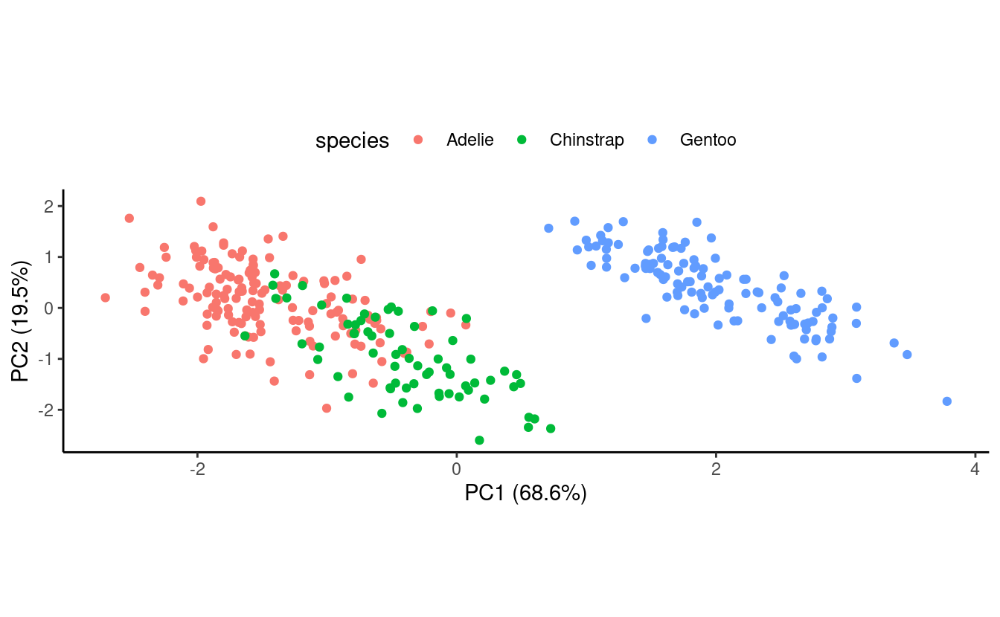
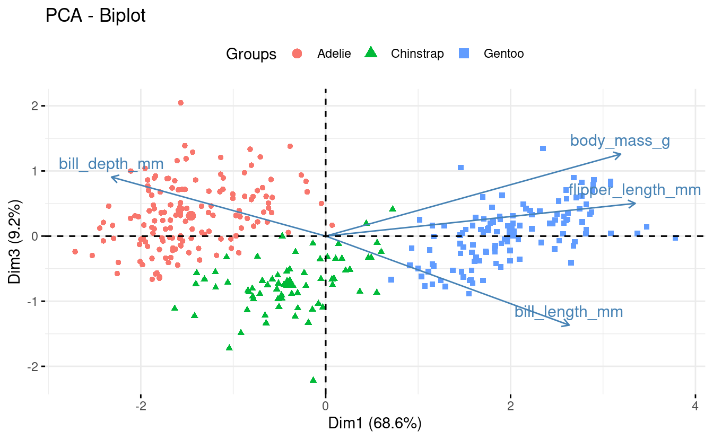
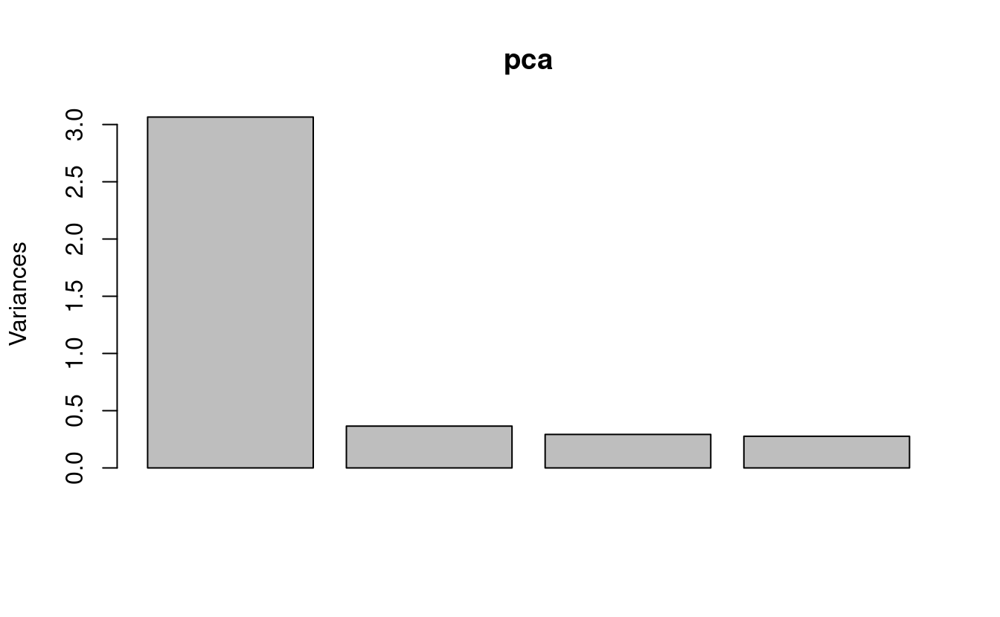
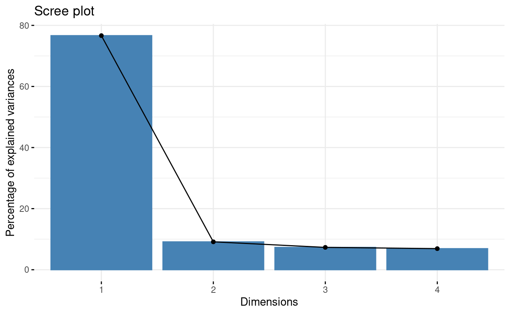
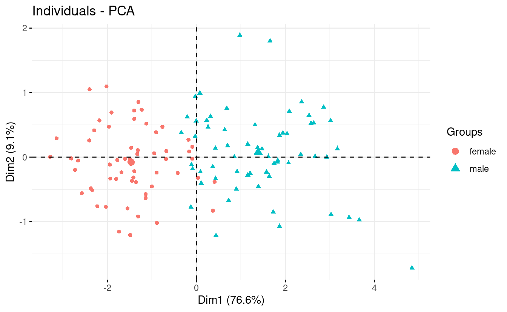

<figure>

<figcaption>
A PCA of genetic variation among Europeans, from <a href="https://www.nature.com/articles/nature07331">Novembre et al 2008</a>: "Genes mirror geography within Europe"
</figcaption>

</figure>

------------------------------------------------------------------------

## Housekeeping

#### New to Code Club?

Check out the [Code Club Computer Setup](/codeclub-setup/) instructions, which also has pointers for if you're new to R or RStudio. A few related Code Club sessions include:

-   [S03E01](/codeclub/s03e01_ttests/): T-tests
-   [S03E01](/codeclub/s03e02_anova/): ANOVA
-   [S02E06](/codeclub/s02e06_ggplot2/): Intro to *ggplot2*, part I
-   [S02E07](/codeclub/s02e07_ggplot2_part2/): Intro to *ggplot2*, part II

#### Session goals

-   Learn **how to perform a PCA** in R using the [`prcomp()`](https://rdrr.io/r/stats/prcomp.html) function.

-   Understand what is represented by the **different components of the output**.

-   Learn about **three kinds of plots** commonly used to visualize PCA results, and how to create them.

#### R packages we will use

-   *palmerpenguins* -- A data package containing the data we will explore
-   *tidyverse* -- A metapackage that includes *ggplot2* which we'll use for plotting, access to the `%>%` pipe, etc.
-   *broom* -- We'll again use the [`tidy()`](https://generics.r-lib.org/reference/tidy.html) function in *broom* to create tidy dataframes from untidy statistical function output
-   *glue* -- For pasting strings with variables
-   *factoextra* -- For easily creating a PCA biplot (and other PCA plots)

#### Getting set up

*If you plan to just listen during the first part,* *you can wait until the Breakout Rooms to do the following.* *Also, instead of copying-and-pasting code,* *you could download this [R script - TBA](TBA) with today's code.*

-   Open a new R script in RStudio (`File` => `New File` => `R Script`)

-   Save the script, as something along the lines of `codeclub_S03E03_PCA.R`

-   Copy the following code into the script, for installing packages where needed:

    

    <pre class='chroma'><code class='language-r' data-lang='r'>## `require(glue)` returns FALSE if glue isn't installed; therefore,
      ## these lines will only try to install packages that aren't already installed.
      if (!<a href='https://rdrr.io/r/base/library.html'>require</a>(<a href='https://allisonhorst.github.io/palmerpenguins/'>palmerpenguins</a>)) <a href='https://rdrr.io/r/utils/install.packages.html'>install.packages</a>("palmerpenguins")
      if (!<a href='https://rdrr.io/r/base/library.html'>require</a>(<a href='https://tidyverse.tidyverse.org'>tidyverse</a>)) <a href='https://rdrr.io/r/utils/install.packages.html'>install.packages</a>("tidyverse")
      if (!<a href='https://rdrr.io/r/base/library.html'>require</a>(<a href='https://broom.tidymodels.org/'>broom</a>)) <a href='https://rdrr.io/r/utils/install.packages.html'>install.packages</a>("broom")
      if (!<a href='https://rdrr.io/r/base/library.html'>require</a>(<a href='https://github.com/tidyverse/glue'>glue</a>)) <a href='https://rdrr.io/r/utils/install.packages.html'>install.packages</a>("glue")
      if (!<a href='https://rdrr.io/r/base/library.html'>require</a>(<a href='http://www.sthda.com/english/rpkgs/factoextra'>factoextra</a>)) <a href='https://rdrr.io/r/utils/install.packages.html'>install.packages</a>("factoextra")</code></pre>

    

-   Also copy the following code to load the packages into your R session:

    

    <pre class='chroma'><code class='language-r' data-lang='r'><a href='https://rdrr.io/r/base/library.html'>library</a>(<a href='https://allisonhorst.github.io/palmerpenguins/'>palmerpenguins</a>)
      <a href='https://rdrr.io/r/base/library.html'>library</a>(<a href='https://tidyverse.tidyverse.org'>tidyverse</a>)
      <a href='https://rdrr.io/r/base/library.html'>library</a>(<a href='https://broom.tidymodels.org/'>broom</a>)
      <a href='https://rdrr.io/r/base/library.html'>library</a>(<a href='https://github.com/tidyverse/glue'>glue</a>)
      <a href='https://rdrr.io/r/base/library.html'>library</a>(<a href='http://www.sthda.com/english/rpkgs/factoextra'>factoextra</a>)</code></pre>

    

-   Run the code above in the R console.

 

------------------------------------------------------------------------

## 1 - A brief intro to PCA

**Principal Component Analysis (PCA)** is a popular method that creates *"summary variables" (Principal Components)* which represent as much of the information as possible from a high-dimensional dataset.

A *high-dimensional dataset* is a dataset with measurements for many variables, such as expression levels for thousands of genes.

PCA and similar methods like PCoA and nMDS (see box below) are also called "**dimension reduction**" or "**ordination**" methods, and can be classified as a type of *unsupervised learning*.

PCA is most commonly used for **exploratory data visualization** to see overall patterns in datasets, though you could also use the resulting Principal Components as response variables in a statistical model.

 

#### Glossary

-   **Principal Components (PCs)** -- the summary variables that a PCA produces.
-   **Loadings** (*rotations*) -- Loadings apply to the *original variables*. They are the contributions of variables to PCs, which form the "recipes" used to create the PCs.
-   **Scores** (*coordinates*) -- Scores apply to the *samples*. These scores, for each PC, are coordinates that can be used to create a score plot which is the "classic" PCA plot.
-   **Eigenvalue** -- The amount of variation explained by a PC.

 

#### Similar ordination methods

Besides PCA, other commonly used ordination methods that are also unconstrained (i.e., with no response variable) include the following:

-   *Principal Coordinate Analysis* (**PCoA**) is also known as *Metric Multidimensional Scaling* (**MDS** / mMDS). PCoA allows you to use distance measures other than Euclidean distance and can be run e.g. with [`stats::cmdscale()`](https://rdrr.io/r/stats/cmdscale.html).

-   *Non-metric Multidimensional Scaling* (**nMDS**) is a non-metric method with quite different inner workings from PCA and PCoA that is especially suitable when your distance values are imprecise. It can be run e.g. with [`vegan::metaMDS()`](https://rdrr.io/pkg/vegan/man/metaMDS.html).

If you're struggling to pick a suitable ordination approach for your data, take a look at [Table 1](https://journals.plos.org/ploscompbiol/article/figure?id=10.1371/journal.pcbi.1006907.t001) in [Nguyen & Holmes 2019](https://journals.plos.org/ploscompbiol/article?id=10.1371/journal.pcbi.1006907).

 

------------------------------------------------------------------------

## 2 - `prcomp()`, scaling, and centering

To perform a PCA analysis in R, there are two functions that can be used without the need to load any packages: [`prcomp()`](https://rdrr.io/r/stats/prcomp.html) and [`princomp()`](https://rdrr.io/r/stats/princomp.html).

(Like last week's [`aov()`](https://rdrr.io/r/stats/aov.html) function, these functions are in the *stats* package, which is loaded into your R session by default. More PCA functions are available in other packages but these tend to be very similar and/or simply wrap the two base R functions.)

We will use **[`prcomp()`](https://rdrr.io/r/stats/prcomp.html)**, which is preferred among these two due to its slightly better accuracy[^1].

#### Two important data pre-processing steps...

...need to be done for many PCA analyses. Luckily, these can be done alongside the PCA computation in a single call to [`prcomp()`](https://rdrr.io/r/stats/prcomp.html):

**Centering the data** -- *Centering* the data around the origin (subtracting the mean of variables) is basically always advisable and is controlled by the `center` argument of [`prcomp()`](https://rdrr.io/r/stats/prcomp.html), which is *set to `TRUE` by default*.

**Scaling the data** -- Standardizing the standard deviation across the variables in the data (i.e., scaling) is advisable when variables are in different units or on different scales but is generally not recommended when all variables are of the same type and in the same units (e.g., gene counts[^2]). Whether or not to scale the data is controlled by the `scale.` argument of [`prcomp()`](https://rdrr.io/r/stats/prcomp.html), which is *set to `FALSE` by default*.

 

------------------------------------------------------------------------

## 3 - Our first PCA

As a simple example, we want to *run a PCA summarizing the four numerical measurements taken for each penguin* (bill length, bill depth, flipper length, and body mass) in the *palmerpenguins* dataset.

First, we'll subset the `penguins` dataframe to:

-   Remove rows with `NA`s ([`prcomp()`](https://rdrr.io/r/stats/prcomp.html) will return an error if any of our variables contain `NA`s)

-   Select only the columns that we want to include in the PCA

<pre class='chroma'><code class='language-r' data-lang='r'>## Remove rows with NAs
penguins_noNA &lt;- drop_na(penguins)

## Select columns
penguins_for_pca &lt;- penguins_noNA %&gt;% 
  select(bill_length_mm, bill_depth_mm, flipper_length_mm, body_mass_g)</code></pre>

Let's take a look at the resulting dataframe:

<pre class='chroma'><code class='language-r' data-lang='r'><a href='https://rdrr.io/r/utils/head.html'>head</a>(penguins_for_pca)
#&gt; # A tibble: 6 × 4
#&gt;   bill_length_mm bill_depth_mm flipper_length_mm body_mass_g
#&gt;            &lt;dbl&gt;         &lt;dbl&gt;             &lt;int&gt;       &lt;int&gt;
#&gt; 1           39.1          18.7               181        3750
#&gt; 2           39.5          17.4               186        3800
#&gt; 3           40.3          18                 195        3250
#&gt; 4           36.7          19.3               193        3450
#&gt; 5           39.3          20.6               190        3650
#&gt; 6           38.9          17.8               181        3625

<a href='https://rdrr.io/r/base/dim.html'>dim</a>(penguins_for_pca)
#&gt; [1] 333   4</code></pre>

#### Run the PCA!

Now, we are ready to run the PCA:

<pre class='chroma'><code class='language-r' data-lang='r'>pca &lt;- <a href='https://rdrr.io/r/stats/prcomp.html'>prcomp</a>(penguins_for_pca, scale = TRUE)
# (Because `center = TRUE` by default, we don't have to include that.)</code></pre>

Scaling is desirable here because as we saw above, the variables we use in our PCA are in different units (`mm` and `g`).

<b>More on scaling</b> (click here)

 

Because our variables are in different units, standard deviations for those variables may differ dramatically. This would lead the PCA to put more weight on variables with a higher standard deviation, which we don't want if those differences are merely a consequence of different units.

If we check the standard deviations in our dataset, we can indeed see large differences:

<pre class='chroma'><code class='language-r' data-lang='r'>map(penguins_for_pca, sd)
#&gt; $bill_length_mm
#&gt; [1] 5.468668
#&gt; 
#&gt; $bill_depth_mm
#&gt; [1] 1.969235
#&gt; 
#&gt; $flipper_length_mm
#&gt; [1] 14.01577
#&gt; 
#&gt; $body_mass_g
#&gt; [1] 805.2158</code></pre>

 

------------------------------------------------------------------------

## 4 - Exploring the output I

Like with objects returned by the statistical tests we saw in the previous weeks, the object returned by [`prcomp()`](https://rdrr.io/r/stats/prcomp.html) is not just a dataframe or even a regular list...

<pre class='chroma'><code class='language-r' data-lang='r'><a href='https://rdrr.io/r/base/class.html'>class</a>(pca)
#&gt; [1] "prcomp"</code></pre>

... and trying to print the object to screen will only give you a summary of sorts:

<pre class='chroma'><code class='language-r' data-lang='r'>pca
#&gt; Standard deviations (1, .., p=4):
#&gt; [1] 1.6569115 0.8821095 0.6071594 0.3284579
#&gt; 
#&gt; Rotation (n x k) = (4 x 4):
#&gt;                          PC1         PC2        PC3        PC4
#&gt; bill_length_mm     0.4537532 -0.60019490 -0.6424951  0.1451695
#&gt; bill_depth_mm     -0.3990472 -0.79616951  0.4258004 -0.1599044
#&gt; flipper_length_mm  0.5768250 -0.00578817  0.2360952 -0.7819837
#&gt; body_mass_g        0.5496747 -0.07646366  0.5917374  0.5846861</code></pre>

Like we saw last week with [`aov()`](https://rdrr.io/r/stats/aov.html), we can get a more useful summary of the results with the [`summary()`](https://rdrr.io/r/base/summary.html) function:

<pre class='chroma'><code class='language-r' data-lang='r'><a href='https://rdrr.io/r/base/summary.html'>summary</a>(pca)
#&gt; Importance of components:
#&gt;                           PC1    PC2     PC3     PC4
#&gt; Standard deviation     1.6569 0.8821 0.60716 0.32846
#&gt; Proportion of Variance 0.6863 0.1945 0.09216 0.02697
#&gt; Cumulative Proportion  0.6863 0.8809 0.97303 1.00000</code></pre>

This shows us the "importance" of the 4 principal components that our PCA returned, i.e. the amount of variation they explain.

#### Seeing all elements with `str()`

These summaries are nice and all, but like we saw in previous weeks, they don't make it obvious where and how to access *all* the information contained in the object.

Running the [`str()`](https://rdrr.io/r/utils/str.html) function is a good start for getting to the raw contents of the object, even though the information printed isn't easy to look at:

<pre class='chroma'><code class='language-r' data-lang='r'><a href='https://rdrr.io/r/utils/str.html'>str</a>(pca)
#&gt; List of 5
#&gt;  $ sdev    : num [1:4] 1.657 0.882 0.607 0.328
#&gt;  $ rotation: num [1:4, 1:4] 0.454 -0.399 0.577 0.55 -0.6 ...
#&gt;   ..- attr(*, "dimnames")=List of 2
#&gt;   .. ..$ : chr [1:4] "bill_length_mm" "bill_depth_mm" "flipper_length_mm" "body_mass_g"
#&gt;   .. ..$ : chr [1:4] "PC1" "PC2" "PC3" "PC4"
#&gt;  $ center  : Named num [1:4] 44 17.2 201 4207.1
#&gt;   ..- attr(*, "names")= chr [1:4] "bill_length_mm" "bill_depth_mm" "flipper_length_mm" "body_mass_g"
#&gt;  $ scale   : Named num [1:4] 5.47 1.97 14.02 805.22
#&gt;   ..- attr(*, "names")= chr [1:4] "bill_length_mm" "bill_depth_mm" "flipper_length_mm" "body_mass_g"
#&gt;  $ x       : num [1:333, 1:4] -1.85 -1.31 -1.37 -1.88 -1.92 ...
#&gt;   ..- attr(*, "dimnames")=List of 2
#&gt;   .. ..$ : NULL
#&gt;   .. ..$ : chr [1:4] "PC1" "PC2" "PC3" "PC4"
#&gt;  - attr(*, "class")= chr "prcomp"</code></pre>

In the first breakout room session, you'll explore the contents of our `pca` object a bit more.

 

------------------------------------------------------------------------

## Breakout Rooms I

### Exercise 1

If you didn't do so already, get set up for the remaining exercises. Either download this [R script - TBA](TBA), open it in RStudio, and run the code, or:

-   Open a new R script in RStudio (`File` => `New File` => `R Script`)

-   Save the script, as something along the lines of `codeclub_S03E03_PCA.R`

-   Copy the following code into the script:

<pre class='chroma'><code class='language-r' data-lang='r'>## Install packages if needed
## (`require(glue)` returns FALSE if glue isn't installed; therefore,
##  these lines will only try to install packages that aren't already installed.)
if (!<a href='https://rdrr.io/r/base/library.html'>require</a>(<a href='https://allisonhorst.github.io/palmerpenguins/'>palmerpenguins</a>)) <a href='https://rdrr.io/r/utils/install.packages.html'>install.packages</a>("palmerpenguins")
if (!<a href='https://rdrr.io/r/base/library.html'>require</a>(<a href='https://tidyverse.tidyverse.org'>tidyverse</a>)) <a href='https://rdrr.io/r/utils/install.packages.html'>install.packages</a>("tidyverse")
if (!<a href='https://rdrr.io/r/base/library.html'>require</a>(<a href='https://broom.tidymodels.org/'>broom</a>)) <a href='https://rdrr.io/r/utils/install.packages.html'>install.packages</a>("broom")
if (!<a href='https://rdrr.io/r/base/library.html'>require</a>(<a href='https://github.com/tidyverse/glue'>glue</a>)) <a href='https://rdrr.io/r/utils/install.packages.html'>install.packages</a>("glue")
if (!<a href='https://rdrr.io/r/base/library.html'>require</a>(<a href='http://www.sthda.com/english/rpkgs/factoextra'>factoextra</a>)) <a href='https://rdrr.io/r/utils/install.packages.html'>install.packages</a>("factoextra")

## Load the packages into your R session
<a href='https://rdrr.io/r/base/library.html'>library</a>(<a href='https://allisonhorst.github.io/palmerpenguins/'>palmerpenguins</a>)
<a href='https://rdrr.io/r/base/library.html'>library</a>(<a href='https://tidyverse.tidyverse.org'>tidyverse</a>)
<a href='https://rdrr.io/r/base/library.html'>library</a>(<a href='https://broom.tidymodels.org/'>broom</a>)
<a href='https://rdrr.io/r/base/library.html'>library</a>(<a href='https://github.com/tidyverse/glue'>glue</a>)
<a href='https://rdrr.io/r/base/library.html'>library</a>(<a href='http://www.sthda.com/english/rpkgs/factoextra'>factoextra</a>)

## Prep the penguin data for the PCA
penguins_noNA &lt;- drop_na(penguins)
penguins_for_pca &lt;- penguins_noNA %&gt;% 
  select(bill_length_mm, bill_depth_mm, flipper_length_mm, body_mass_g)

## Run the PCA
pca &lt;- <a href='https://rdrr.io/r/stats/prcomp.html'>prcomp</a>(penguins_for_pca, scale = TRUE)</code></pre>

-   Run the code above in the R console.

 

### Exercise 2

How can you access the different components in the `List of 5` that is summarized when running [`str(pca)`](https://rdrr.io/r/utils/str.html)? For example, say you wanted to see the `rotation` element in its entirety, how could you do this?

<b>Hints</b> (click here)

 

The **[`$`](https://rdrr.io/r/base/Extract.html)** (dollar sign) operator can be used to access the different elements (as implied by the dollar signs shown in front of the names of the elements).

<b>Solution</b> (click here)

 

To see the `rotation` element, type **`pca$rotation`**:

<pre class='chroma'><code class='language-r' data-lang='r'>pca$rotation
#&gt;                          PC1         PC2        PC3        PC4
#&gt; bill_length_mm     0.4537532 -0.60019490 -0.6424951  0.1451695
#&gt; bill_depth_mm     -0.3990472 -0.79616951  0.4258004 -0.1599044
#&gt; flipper_length_mm  0.5768250 -0.00578817  0.2360952 -0.7819837
#&gt; body_mass_g        0.5496747 -0.07646366  0.5917374  0.5846861</code></pre>

 

### Exercise 3 (bonus)

Take a look at the contents of all five elements in the `pca` object. Do you have a (rough) understanding of what each represents?

<b>Hints</b> (click here)

 

Take a look at the [Glossary](#glossary).

<b>Solution</b> (click here)

 

All elements of the output are explained in the next section of this page.

 

------------------------------------------------------------------------

## 5 - Exploring the output II

Let's take a quick look together at the three most important elements in the object returned by [`prcomp()`](https://rdrr.io/r/stats/prcomp.html), which we named `pca`:

-   **`pca$sdev`** is a vector of standard deviations associated with each principal component (PC), i.e. it is the **amount of variation explained by each PC**. (This is also known as the *eigenvector*, which contains *eigenvalues*.) We also saw this information when running [`summary(pca)`](https://rdrr.io/r/base/summary.html).

    

    <pre class='chroma'><code class='language-r' data-lang='r'>pca$sdev
      #&gt; [1] 1.6569115 0.8821095 0.6071594 0.3284579</code></pre>

    

-   **`pca$rotation`** is a matrix that contains the **loadings** for each variable in each PC. These are the "recipes" for creating each PC, with *higher absolute values* indicating a larger influence of the variable on the PC. The *sign* (- or +) matters too: in PC1, larger values of bill depth lower the PC value, and vice versa for the other three variables.

    

    <pre class='chroma'><code class='language-r' data-lang='r'>pca$rotation
      #&gt;                          PC1         PC2        PC3        PC4
      #&gt; bill_length_mm     0.4537532 -0.60019490 -0.6424951  0.1451695
      #&gt; bill_depth_mm     -0.3990472 -0.79616951  0.4258004 -0.1599044
      #&gt; flipper_length_mm  0.5768250 -0.00578817  0.2360952 -0.7819837
      #&gt; body_mass_g        0.5496747 -0.07646366  0.5917374  0.5846861</code></pre>

    

-   **`pca$x`** is the most-used part of the output: a matrix containing the **scores (or coordinates)** for each sample for each PC, used to create a score plot.

    

    <pre class='chroma'><code class='language-r' data-lang='r'><a href='https://rdrr.io/r/utils/head.html'>head</a>(pca$x)
      #&gt;            PC1         PC2         PC3        PC4
      #&gt; [1,] -1.850808 -0.03202119  0.23454869  0.5276026
      #&gt; [2,] -1.314276  0.44286031  0.02742880  0.4011230
      #&gt; [3,] -1.374537  0.16098821 -0.18940423 -0.5278675
      #&gt; [4,] -1.882455  0.01233268  0.62792772 -0.4721826
      #&gt; [5,] -1.917096 -0.81636958  0.69999797 -0.1961213
      #&gt; [6,] -1.770356  0.36567266 -0.02841769  0.5046092</code></pre>

    

 

<b>...And the remaining two elements</b> (click here)

-   **`pca$center`** is a vector containing the means for each variable, which was subsequently used for centering the data (this would contain just `FALSE` if the data wasn't centered).
    

    <pre class='chroma'><code class='language-r' data-lang='r'>pca$center
      #&gt;    bill_length_mm     bill_depth_mm flipper_length_mm       body_mass_g 
      #&gt;          43.99279          17.16486         200.96697        4207.05706</code></pre>

    

-   **`pca$scale`** similarly is a vector containing the scaling constant for each variable (column) in the data, and would be `FALSE` if the data wasn't scaled.
    

    <pre class='chroma'><code class='language-r' data-lang='r'>pca$scale
      #&gt;    bill_length_mm     bill_depth_mm flipper_length_mm       body_mass_g 
      #&gt;          5.468668          1.969235         14.015765        805.215802</code></pre>

    

 

------------------------------------------------------------------------

## 6 - Scree plot

A "scree plot"[^3] is a barplot that shows the **amount of variation (*eigenvalues*) explained by each PC.**

We'll make a base R version of this plot (gasp!) because it is so quick to make, and we don't need this figure to be fancy:

<pre class='chroma'><code class='language-r' data-lang='r'><a href='https://rdrr.io/r/graphics/plot.default.html'>plot</a>(pca)
</code></pre>

#### Interpretation

This gives us a quick visual overview of the importance of the PCs: PC1 is *by far* the most important, and PC4 doesn't do much at all. (PCs are always ordered by the amount of variation they explain, with PC1 explaining most.)

 

------------------------------------------------------------------------

## 7 - Score (classic PCA) plot

A "score plot" shows **the scores (coordinates) for each sample for two PCs**, typically the first two.

We're going to need a dataframe to plot. But if we were to [`broom::tidy()`](https://generics.r-lib.org/reference/tidy.html) the scores matrix (`pca$x`), akin to what we've done with t-test and ANOVA output in previous weeks, we would get a dataframe with all PCs in one column that wouldn't be that easy to plot.

So in this case, we'll just manipulate `pca$x` ourselves -- in particular, we want to add the source `penguins_noNA` dataframe back to it, which will allow us to color points by, say, `species`.

<pre class='chroma'><code class='language-r' data-lang='r'>## Column-bind (= put side-by-side) the scores and the source dataframe
pca_scores &lt;- bind_cols(<a href='https://rdrr.io/r/base/data.frame.html'>data.frame</a>(pca$x), penguins_noNA)

<a href='https://rdrr.io/r/utils/head.html'>head</a>(pca_scores)
#&gt;         PC1         PC2         PC3        PC4 species    island bill_length_mm
#&gt; 1 -1.850808 -0.03202119  0.23454869  0.5276026  Adelie Torgersen           39.1
#&gt; 2 -1.314276  0.44286031  0.02742880  0.4011230  Adelie Torgersen           39.5
#&gt; 3 -1.374537  0.16098821 -0.18940423 -0.5278675  Adelie Torgersen           40.3
#&gt; 4 -1.882455  0.01233268  0.62792772 -0.4721826  Adelie Torgersen           36.7
#&gt; 5 -1.917096 -0.81636958  0.69999797 -0.1961213  Adelie Torgersen           39.3
#&gt; 6 -1.770356  0.36567266 -0.02841769  0.5046092  Adelie Torgersen           38.9
#&gt;   bill_depth_mm flipper_length_mm body_mass_g    sex year
#&gt; 1          18.7               181        3750   male 2007
#&gt; 2          17.4               186        3800 female 2007
#&gt; 3          18.0               195        3250 female 2007
#&gt; 4          19.3               193        3450 female 2007
#&gt; 5          20.6               190        3650   male 2007
#&gt; 6          17.8               181        3625 female 2007</code></pre>

Now we're ready to create the plot:

<pre class='chroma'><code class='language-r' data-lang='r'>score_plot &lt;- ggplot(pca_scores) +
  geom_point(aes(x = PC1, y = PC2, color = species)) +
  theme_classic()

score_plot
</code></pre>

### A better aspect ratio

One way to improve our plot is to set the aspect ratio (the proportional relationship between the height and the width) according to the relative percentages of variation explained by the two plotted PCs: because PC1 on the x-axis explains more variation, we want the plot to be wide.

To get the percentages in a dataframe, now we *will* use the [`tidy()`](https://generics.r-lib.org/reference/tidy.html) function. But because the output of [`prcomp()`](https://rdrr.io/r/stats/prcomp.html) contains multiple matrices, we'll have to point [`tidy()`](https://generics.r-lib.org/reference/tidy.html) to the eigenvalues using the `matrix` argument (see the [docs]((https://broom.tidymodels.org/reference/tidy.prcomp.html))):

<pre class='chroma'><code class='language-r' data-lang='r'>pca_eigen &lt;- <a href='https://generics.r-lib.org/reference/tidy.html'>tidy</a>(pca, matrix = "eigenvalues")
pca_eigen
#&gt; # A tibble: 4 × 4
#&gt;      PC std.dev percent cumulative
#&gt;   &lt;dbl&gt;   &lt;dbl&gt;   &lt;dbl&gt;      &lt;dbl&gt;
#&gt; 1     1   1.66   0.686       0.686
#&gt; 2     2   0.882  0.195       0.881
#&gt; 3     3   0.607  0.0922      0.973
#&gt; 4     4   0.328  0.0270      1</code></pre>

Now, we'll store the percentages explained by the first two PCs (rounded to one decimal):

<pre class='chroma'><code class='language-r' data-lang='r'># (Note: pca_eigen$percent contains proportions, not percentages...)
PC1_percent &lt;- <a href='https://rdrr.io/r/base/Round.html'>round</a>(pca_eigen$percent[1] * 100, 1)
PC2_percent &lt;- <a href='https://rdrr.io/r/base/Round.html'>round</a>(pca_eigen$percent[2] * 100, 1)

PC1_percent
#&gt; [1] 68.6
PC2_percent
#&gt; [1] 19.5</code></pre>

Finally, we can modify the aspect ratio, which is expressed as `height / width` -- and we'll also move the legend to the top, and add the percentages to the axis titles:

<pre class='chroma'><code class='language-r' data-lang='r'>score_plot &lt;- score_plot +
  theme(aspect.ratio = PC2_percent / PC1_percent,
        legend.position = "top") +
  labs(x = <a href='https://glue.tidyverse.org/reference/glue.html'>glue</a>("PC1 (&#123;PC1_percent&#125;%)"),
       y = <a href='https://glue.tidyverse.org/reference/glue.html'>glue</a>("PC2 (&#123;PC2_percent&#125;%)"))

score_plot
</code></pre>

#### Interpretation

Across these four measurements, Gentoo Penguins can be very clearly distinguished from the other two species, whereas among Adelie and Chinstrap Penguins, there are average differences but they are not fully separable.

 

------------------------------------------------------------------------

## 8 - Biplot

A "biplot" shows the **scores of samples for two PCs *and* the loadings for the original variables** along the two PCs.

Because biplots are more complicated to make "from scratch" using *ggplot2*, we will turn to the package *factoextra*, which has a convenient function for making biplots, [`fviz_pca()`](https://rdrr.io/pkg/factoextra/man/fviz_pca.html):

<pre class='chroma'><code class='language-r' data-lang='r'><a href='https://rdrr.io/pkg/factoextra/man/fviz_pca.html'>fviz_pca</a>(pca,
         label = "var",                       # Show labels for variables only
         habillage = penguins_noNA$species) + # color by / shape by
  theme(legend.position = "top")
</code></pre>

While this plot can certainly be improved upon, *biplots are by their nature a little unwieldy*.

#### Interpretation

Biplots can be especially useful when you have a modest number of original variables, like here. Some information we can glean from this particular biplot:

-   Flipper length and body mass are highly correlated among individuals, even across species. So flipper length relative to body mass is similar across species.

-   Gentoo penguins are larger and with narrower bills than the other two species.

While we made a scree plot with base R and a score plot with "base *ggplot2*", there are also *factoextra* functions for these and for other PCA plots:

-   [`fviz_eig()`](https://rdrr.io/pkg/factoextra/man/eigenvalue.html) -- scree plots
-   [`fviz_pca_ind()`](https://rdrr.io/pkg/factoextra/man/fviz_pca.html) -- score plots
-   [`fviz_pca_var()`](https://rdrr.io/pkg/factoextra/man/fviz_pca.html) -- "correlation circles"; plots showing loadings only ([example](https://journals.plos.org/ploscompbiol/article/figure?id=10.1371/journal.pcbi.1006907.g003)).
-   [`fviz_contrib()`](https://rdrr.io/pkg/factoextra/man/fviz_contrib.html) -- a barplot with the contribution of variables to 1 PC ([example](https://journals.plos.org/ploscompbiol/article/figure?id=10.1371/journal.pcbi.1006907.g003)).

<b>Or, to create a biplot from scratch...</b> (click here)

 

First, let's save the loadings in a dataframe:

<pre class='chroma'><code class='language-r' data-lang='r'>pca_loadings &lt;- <a href='https://rdrr.io/r/base/data.frame.html'>data.frame</a>(pca$rotation) %&gt;%
  rownames_to_column("var")</code></pre>

Next, we start with the score plot object `score_plot` we created above.

What we need to add are the variable loading, which we'll do with `geom_segment()` to draw arrows, and `geom_text()` to add text labels near the tips of the arrows:

<pre class='chroma'><code class='language-r' data-lang='r'>## To make the arrows longer (all by the same amount),
## just to improve the visualization, we use a multiplication factor:
mult &lt;- 2.5

score_plot +
  ## geom_segment draws lines
  geom_segment(data = pca_loadings,
               ## The lines should start from the origin:
               aes(x = 0, y = 0, xend = PC1 * mult, yend = PC2 * mult),
               ## We turn the line into an arrow:
               arrow = arrow(),
               ## A gray-tone might work better than black:
               color = "grey40") +
  geom_text(data = pca_loadings,
            ## The text labels go at the end of the arrows:
            aes(x = PC1 * mult, y = PC2 * mult, label = var),
            ## We left-align (hjust = 0) and lower (vjust = 1) the labels
            hjust = 0, vjust = 1,
            ## Again, we use a gray color:
            color = "grey40")
</code></pre>

 

------------------------------------------------------------------------

## Breakout Rooms II

### Exercise 4

Above, we plotted the scores for the first two PCs in our score plot and biplot. Now, *create a biplot with another combination of PCSs* (e.g., PC1 & PC3, or PC3 & PC4 -- whatever you think will be more informative).

Take a look at the help for the [`fviz_pca()`](https://rdrr.io/pkg/factoextra/man/fviz_pca.html) function by typing  
[`?fviz_pca`](https://rdrr.io/pkg/factoextra/man/fviz_pca.html) to find out how you might be able to plot different PCs.

<b>Hints</b> (click here)

 

The `axes` argument to [`fviz_pca()`](https://rdrr.io/pkg/factoextra/man/fviz_pca.html) controls which axes will be plotted; this argument accepts a vector of two numbers.

<b>Solution</b> (click here)

 

To plot PC1 & PC3 (which may be a better choice than including PC4 because it explains so little variation):

<pre class='chroma'><code class='language-r' data-lang='r'><a href='https://rdrr.io/pkg/factoextra/man/fviz_pca.html'>fviz_pca</a>(pca,
         axes = <a href='https://rdrr.io/r/base/c.html'>c</a>(1, 3),
         label = "var",
         habillage = penguins_noNA$species) +
  theme(legend.position = "top")
</code></pre>

Behold, now we can distinguish much better between Adelie and Chinstrap Penguins!

 

### Exercise 5

Run the PCA for just one of the three penguin species.

Then, make a biplot of the results, in which you color by something else than `species`, e.g. by `sex`. (If you want, also make a scree plot and/or a score plot.)

<b>Hints</b> (click here)

 

-   Use the *dplyr* function [`filter()`](https://rdrr.io/r/stats/filter.html) on `penguins_noNA` object to select rows corresponding to one penguin species.

-   After that, the code will be nearly identical to that used before; just make sure to refer to the correct objects if you copy-and-paste code.

<b>Solution</b> (click here)

 

This example solution runs a PCA for *Gentoo Penguins only*.

First, select rows corresponding to our focal penguin species, and run the PCA:

<pre class='chroma'><code class='language-r' data-lang='r'>## (Save this object rather than using one pipeline,
## because you'll need it color the biplot by a factor)
onepenguin_noNA &lt;- penguins_noNA %&gt;% <a href='https://rdrr.io/r/stats/filter.html'>filter</a>(species == "Gentoo")

pca &lt;- onepenguin_noNA %&gt;%
  select(bill_length_mm, bill_depth_mm, flipper_length_mm, body_mass_g) %&gt;% 
  <a href='https://rdrr.io/r/stats/prcomp.html'>prcomp</a>(scale = TRUE)</code></pre>

Next, we create the biplot:

<pre class='chroma'><code class='language-r' data-lang='r'><a href='https://rdrr.io/pkg/factoextra/man/fviz_pca.html'>fviz_pca</a>(pca,
         label = "var",
         habillage = onepenguin_noNA$sex) +
  theme(legend.position = "top")
</code></pre>

To create a scree plot:

<pre class='chroma'><code class='language-r' data-lang='r'><a href='https://rdrr.io/r/graphics/plot.default.html'>plot</a>(pca)
</code></pre>

Or a scree plot with [`fviz_eig()`](https://rdrr.io/pkg/factoextra/man/eigenvalue.html):

<pre class='chroma'><code class='language-r' data-lang='r'><a href='https://rdrr.io/pkg/factoextra/man/eigenvalue.html'>fviz_eig</a>(pca)
</code></pre>

To create a quick score plot (no aspect ratio manipulation):

<pre class='chroma'><code class='language-r' data-lang='r'>bind_cols(<a href='https://rdrr.io/r/base/data.frame.html'>data.frame</a>(pca$x), onepenguin_noNA) %&gt;%
  ggplot() +
  geom_point(aes(x = PC1, y = PC2, color = sex)) +
  theme_classic()
</code></pre>

Or a score plot with [`fviz_pca_ind()`](https://rdrr.io/pkg/factoextra/man/fviz_pca.html):

<pre class='chroma'><code class='language-r' data-lang='r'><a href='https://rdrr.io/pkg/factoextra/man/fviz_pca.html'>fviz_pca_ind</a>(pca, geom = "point", habillage = onepenguin_noNA$sex)
</code></pre>

 

### Exercise 6 (bonus)

Make a scree plot of our original PCA results with *ggplot2* instead of base R.

<b>Hints</b> (click here)

 

Use the `pca_eigen` dataframe that we created above for plotting, and use the geom `geom_col()`.

<b>Solution</b> (click here)

 

<pre class='chroma'><code class='language-r' data-lang='r'>ggplot(pca_eigen, aes(x = PC, y = percent)) +
  geom_col() +
  labs(y = "Proportion of the variation explained") +
  theme_minimal()
</code></pre>

 

------------------------------------------------------------------------

## Further watching & reading

-   "StatQuest" videos on:
    -   [PCA (22 minutes)](https://www.youtube.com/watch?v=FgakZw6K1QQ)
    -   [PCA follow-up: practical tips (8 minutes)](https://www.youtube.com/watch?v=oRvgq966yZg)
    -   [MDS and PCoA](https://www.youtube.com/watch?v=GEn-_dAyYME)
-   [Chapter on Multivariate Analysis from the book "Modern Statistics for Modern Biology"](http://web.stanford.edu/class/bios221/book/Chap-Multivariate.html)
-   [Nguyen & Holmes 2019: "Ten quick tips for effective dimensionality reduction"](https://journals.plos.org/ploscompbiol/article?id=10.1371/journal.pcbi.1006907)

 

[^1]: Crawley 2012 -- "The R Book" -- [pdf](https://www.cs.upc.edu/~robert/teaching/estadistica/TheRBook.pdf)

[^2]: However, high-throughput sequencing results such as gene counts do need to be normalized by sample sequencing depth ("library size") and subjected to a variance stabilizing normalization.

[^3]: As "The R Book" (Crawley 2012) explains: "*This is called a scree plot in PCA because it is supposed to look like a cliff face on a mountainside (on the left), with a scree slope below it (the tail on the right).*"

