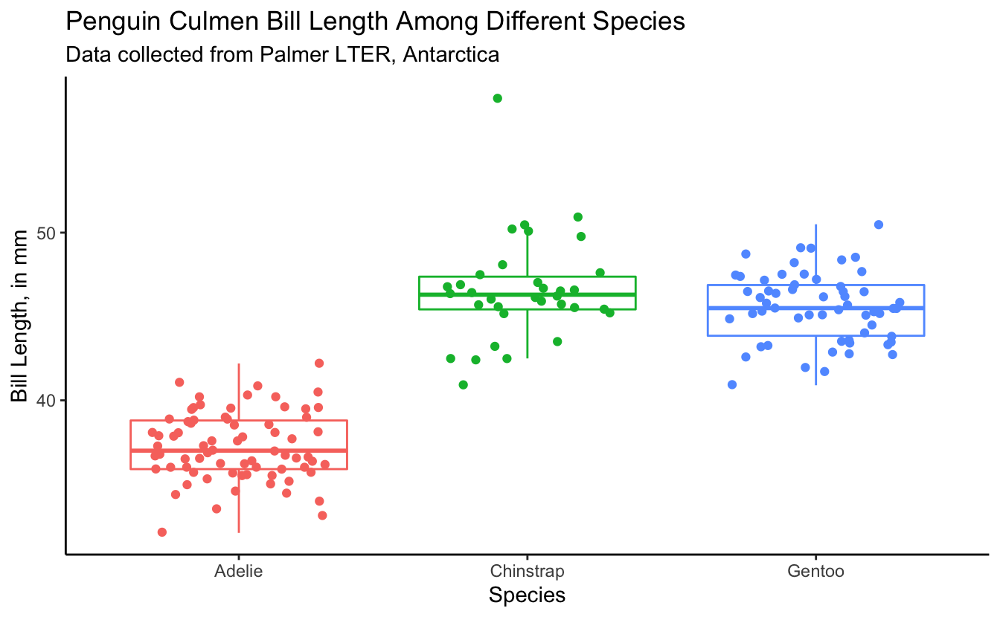
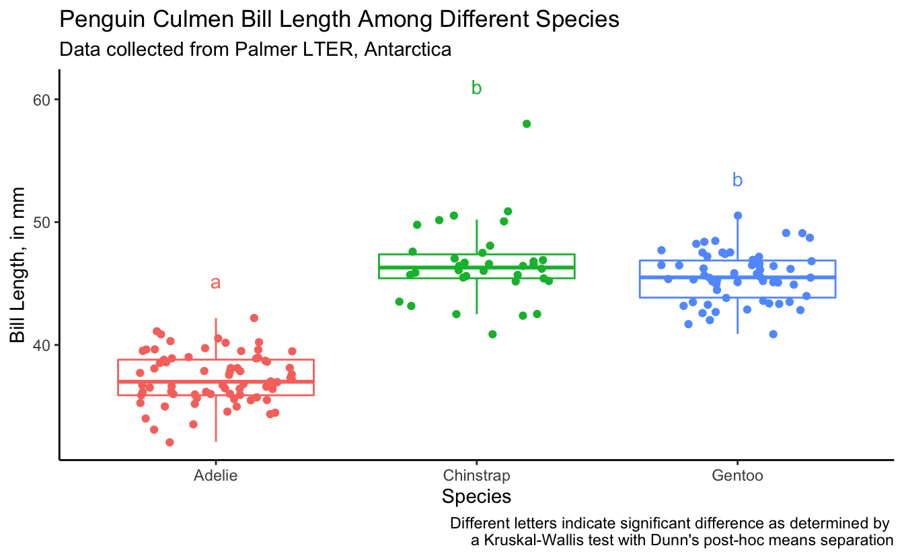
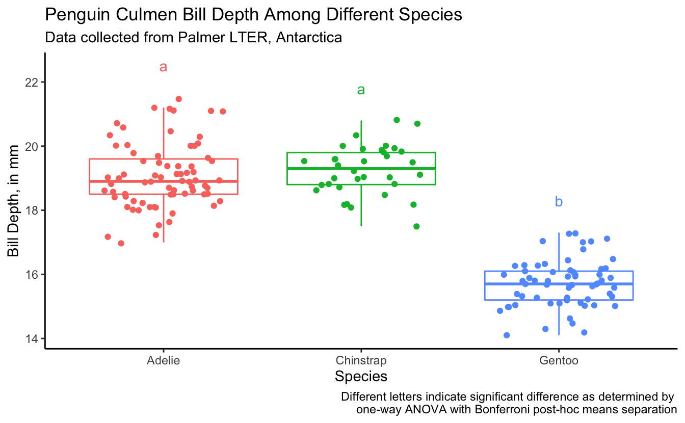

------------------------------------------------------------------------

## Prep homework

#### Basic computer setup

-   If you didn't already do this, please follow the [Code Club Computer Setup](/codeclub-setup/04_ggplot2/) instructions, which also has pointers for if you're new to R or RStudio.

-   If you're able to do so, please open RStudio a bit before Code Club starts -- and in case you run into issues, please join the Zoom call early and we'll help you troubleshoot.

#### New to ggplot?

This isn't a ggplot specific session, though we will be using it a bit. Check out the past Code Club sessions covering `ggplot2`:

-   [S01E04](/codeclub/04_ggplot2/): intro to ggplot2
-   [S01E05](/codeclub/05_ggplot-round-2/): intro to ggplot2 round 2
-   [S01E10](/codeclub/10_faceting-animating/): faceting and animating
-   [S02E06](/codeclub/s02e06_ggplot2/): another intro to ggplot2
-   [S02E07](/codeclub/s02e07_ggplot2_part2/): a second intro to ggplot2 round 2
-   [S02E08](/codeclub/s02e08_multiple_plots/): combining plots using faceting
-   [S02E09](/codeclub/s02e09_multiple_plots_part2/): combining plots using faceting and patchwork
-   [S02E10](/codeclub/s02e10_ggpubr/): adding statistics to plots
-   [S02E11](/codeclub/s02e12_plotly/): making interactive plots with plotly

If you've never used `ggplot2` before (or even if you have), you may find [this cheat sheet](https://github.com/rstudio/cheatsheets/blob/master/data-visualization-2.1.pdf) useful.

#### Adding statistics to plots

We had a previous session [S02E10](/codeclub/s02e10_ggpubr/) developed by Daniel Quiroz that covers the package `ggpubr` and adding statistics to ggplots.

#### We already did t-tests and ANOVA part 1

Mike Sovic covered in code club [S03E01](/codeclub/s03e01_ttests/) how to run t-tests in R. I covered ANOVA two weeks ago [S03E02](/codeclub/s03e02_anova/) and we will be building off that session today.

 

#### Getting an R Markdown

Click here to get an Rmd (optional)

#### RMarkdown for today

<pre class='chroma'><code class='language-r' data-lang='r'># directory 
<a href='https://rdrr.io/r/base/files2.html'>dir.create</a>("S03E04")

# directory for our RMarkdown
# ("recursive" to create two levels at once.)
<a href='https://rdrr.io/r/base/files2.html'>dir.create</a>("S03E04/Rmd/")

# save the url location for today's script
todays_Rmd &lt;- 
  "https://raw.githubusercontent.com/biodash/biodash.github.io/master/content/codeclub/S03E04_anova2/anova2.Rmd"

# indicate the name of the new Rmd
S03E04_Rmd &lt;- "S03E04/Rmd/S03E04_anova2.Rmd"

# go get that file! 
<a href='https://rdrr.io/r/utils/download.file.html'>download.file</a>(url = todays_Rmd,
              destfile = S03E04_Rmd)</code></pre>

 

 

------------------------------------------------------------------------

## Introduction

We have gone through a first pass of running ANOVAs in [Code Club a couple weeks ago](/codeclub/content/S03E02_anova/) but didn't have the time to go through all of the content. We are going to re-visit that material today.

Often people are first introduced to the R programming language when they are wanting to conduct statistical analyses. My experience is that beginners are often able to conduct the analysis they want, and print their results to the console. But, the process of locating and then using the output of their analysis tends to be more complex.

Today, we are going to go over how to:

-   test if our data is suitable for running ANOVA
-   run an ANOVA (parametric) or Kruskal Wallis (non-parametric) test
-   run posthoc tests to understand group differences
-   use the ANOVA data output object as a means to understand R data structure.

If you are looking for a good statistics class, I would recommend Dr. Kristin Mercer's [HCS 8887 Experimental Design](https://hcs.osu.edu/courses/hcs-8887).

 

------------------------------------------------------------------------

#### Load packages, get data

We are going to start with our favorite dataset `palmerpenguins` to provide the input data for our analysis.

If you don't have any of the packages below, use [`install.packages()`](https://rdrr.io/r/utils/install.packages.html) to download them.

<pre class='chroma'><code class='language-r' data-lang='r'><a href='https://rdrr.io/r/base/library.html'>library</a>(<a href='https://tidyverse.tidyverse.org'>tidyverse</a>)
<a href='https://rdrr.io/r/base/library.html'>library</a>(<a href='https://allisonhorst.github.io/palmerpenguins/'>palmerpenguins</a>) # for data
<a href='https://rdrr.io/r/base/library.html'>library</a>(<a href='https://rpkgs.datanovia.com/rstatix/'>rstatix</a>) # for testing assumptions and running tests
<a href='https://rdrr.io/r/base/library.html'>library</a>(agricolae) # for post-hoc comparison of groups</code></pre>

 

------------------------------------------------------------------------

## 1 - Getting acclimated

Some words on syntax: the dataset `penguins` is an object within the `palmerpenguins` package. If you call the object `penguins` (after executing [`library(palmerpenguins)`](https://allisonhorst.github.io/palmerpenguins/)), you will be able to see what is contained within that dataframe.

<pre class='chroma'><code class='language-r' data-lang='r'>penguins
#&gt; # A tibble: 344 × 8
#&gt;    species island    bill_length_mm bill_depth_mm flipper_length_mm body_mass_g
#&gt;    &lt;fct&gt;   &lt;fct&gt;              &lt;dbl&gt;         &lt;dbl&gt;             &lt;int&gt;       &lt;int&gt;
#&gt;  1 Adelie  Torgersen           39.1          18.7               181        3750
#&gt;  2 Adelie  Torgersen           39.5          17.4               186        3800
#&gt;  3 Adelie  Torgersen           40.3          18                 195        3250
#&gt;  4 Adelie  Torgersen           NA            NA                  NA          NA
#&gt;  5 Adelie  Torgersen           36.7          19.3               193        3450
#&gt;  6 Adelie  Torgersen           39.3          20.6               190        3650
#&gt;  7 Adelie  Torgersen           38.9          17.8               181        3625
#&gt;  8 Adelie  Torgersen           39.2          19.6               195        4675
#&gt;  9 Adelie  Torgersen           34.1          18.1               193        3475
#&gt; 10 Adelie  Torgersen           42            20.2               190        4250
#&gt; # … with 334 more rows, and 2 more variables: sex &lt;fct&gt;, year &lt;int&gt;</code></pre>

However, `penguins` will not be in your environment tab because it is not in your local environment. You can use it without it being in your local environment, but if you are bothered by this, you can save a copy in your local environment such it shows up in that top right pane.

<pre class='chroma'><code class='language-r' data-lang='r'>penguins &lt;- penguins</code></pre>

What is within this dataset?

<pre class='chroma'><code class='language-r' data-lang='r'>glimpse(penguins)
#&gt; Rows: 344
#&gt; Columns: 8
#&gt; $ species           &lt;fct&gt; Adelie, Adelie, Adelie, Adelie, Adelie, Adelie, Adel…
#&gt; $ island            &lt;fct&gt; Torgersen, Torgersen, Torgersen, Torgersen, Torgerse…
#&gt; $ bill_length_mm    &lt;dbl&gt; 39.1, 39.5, 40.3, NA, 36.7, 39.3, 38.9, 39.2, 34.1, …
#&gt; $ bill_depth_mm     &lt;dbl&gt; 18.7, 17.4, 18.0, NA, 19.3, 20.6, 17.8, 19.6, 18.1, …
#&gt; $ flipper_length_mm &lt;int&gt; 181, 186, 195, NA, 193, 190, 181, 195, 193, 190, 186…
#&gt; $ body_mass_g       &lt;int&gt; 3750, 3800, 3250, NA, 3450, 3650, 3625, 4675, 3475, …
#&gt; $ sex               &lt;fct&gt; male, female, female, NA, female, male, female, male…
#&gt; $ year              &lt;int&gt; 2007, 2007, 2007, 2007, 2007, 2007, 2007, 2007, 2007…</code></pre>

Illustration by [Allison Horst](https://allisonhorst.github.io/palmerpenguins/articles/art.html)

 

------------------------------------------------------------------------

## 2. Testing assumptions

I'd be remiss if I didn't show you how to test that you aren't violating any of the assumptions needed to conduct an ANOVA. We went over this a little bit back in the session put together by Daniel Quiroz on [ggpubr](https://biodash.github.io/codeclub/s02e10_ggpubr/) and adding statistical results to ggplots.

Briefly, in order to use parametric procedures (like ANOVA), we need to be sure our data meets the assumptions for 1) normality and 2) constant variance. This can be done in a few different ways.

Illustration by [Allison Horst](https://allisonhorst.github.io/palmerpenguins/articles/art.html)

#### Shapiro-Wilk test for normality

We are going to use the Shapiro-Wilk test (using the function [`shapiro_test()`](https://rpkgs.datanovia.com/rstatix/reference/shapiro_test.html) which is in the package `rstatix` to determine normality, but will do it groupwise. This function is a pipe-friendly wrapper for the function [`shapiro.test()`](https://www.rdocumentation.org/packages/stats/versions/3.6.2/topics/shapiro.test), which just means you can use it with pipes.

Our question is:

-   Does `bill_length_mm` vary by `species` in female penguins?

<figure>

<figcaption>
Illustration by <a href="https://allisonhorst.github.io/palmerpenguins/articles/art.html">Allison Horst</a>
</figcaption>

</figure>
Caputuring some descriptive statistics

<pre class='chroma'><code class='language-r' data-lang='r'>penguins %&gt;%
  <a href='https://dplyr.tidyverse.org/reference/filter.html'>filter</a>(sex == "female") %&gt;%
  <a href='https://tidyr.tidyverse.org/reference/drop_na.html'>drop_na</a>() %&gt;%
  <a href='https://dplyr.tidyverse.org/reference/group_by.html'>group_by</a>(species) %&gt;%
  count()
#&gt; # A tibble: 3 × 2
#&gt; # Groups:   species [3]
#&gt;   species       n
#&gt;   &lt;fct&gt;     &lt;int&gt;
#&gt; 1 Adelie       73
#&gt; 2 Chinstrap    34
#&gt; 3 Gentoo       58</code></pre>

<pre class='chroma'><code class='language-r' data-lang='r'># testing for all female penguins together
penguins %&gt;%
  <a href='https://dplyr.tidyverse.org/reference/filter.html'>filter</a>(sex == "female") %&gt;%
  <a href='https://tidyr.tidyverse.org/reference/drop_na.html'>drop_na</a>() %&gt;%
  rstatix::<a href='https://rpkgs.datanovia.com/rstatix/reference/shapiro_test.html'>shapiro_test</a>(bill_length_mm)
#&gt; # A tibble: 1 × 3
#&gt;   variable       statistic         p
#&gt;   &lt;chr&gt;              &lt;dbl&gt;     &lt;dbl&gt;
#&gt; 1 bill_length_mm     0.950 0.0000140

# testing by species
penguins %&gt;%
  <a href='https://tidyr.tidyverse.org/reference/drop_na.html'>drop_na</a>() %&gt;%
  <a href='https://dplyr.tidyverse.org/reference/filter.html'>filter</a>(sex == "female") %&gt;%
  <a href='https://dplyr.tidyverse.org/reference/group_by.html'>group_by</a>(species) %&gt;%
  rstatix::<a href='https://rpkgs.datanovia.com/rstatix/reference/shapiro_test.html'>shapiro_test</a>(bill_length_mm)
#&gt; # A tibble: 3 × 4
#&gt;   species   variable       statistic       p
#&gt;   &lt;fct&gt;     &lt;chr&gt;              &lt;dbl&gt;   &lt;dbl&gt;
#&gt; 1 Adelie    bill_length_mm     0.991 0.895  
#&gt; 2 Chinstrap bill_length_mm     0.883 0.00170
#&gt; 3 Gentoo    bill_length_mm     0.989 0.895</code></pre>

Note that if we test all the penguins together, it looks like we do not have normal data. If we test by species, we see that two speces have normal data distribution and one (Chinstrap) does not.

Can we visualize normality in another way?

Let's quickly make a new dataframe that includes only the female penguins, and drop missing values, so that we don't have to keep including the [`filter()`](https://dplyr.tidyverse.org/reference/filter.html) and [`drop_na()`](https://tidyr.tidyverse.org/reference/drop_na.html) statements.

<pre class='chroma'><code class='language-r' data-lang='r'>female_penguins &lt;- penguins %&gt;%
  <a href='https://dplyr.tidyverse.org/reference/filter.html'>filter</a>(sex == "female") %&gt;%
  <a href='https://tidyr.tidyverse.org/reference/drop_na.html'>drop_na</a>()</code></pre>

Visualizing with a histogram by `species`.

<pre class='chroma'><code class='language-r' data-lang='r'>female_penguins %&gt;%
  ggplot(aes(x = bill_length_mm)) +
  geom_histogram() +
  facet_grid(cols = vars(species))
#&gt; `stat_bin()` using `bins = 30`. Pick better value with `binwidth`.
</code></pre>

We can see here too that the Chinstrap penguins look maybe not that normal (and we saw earlier they have the fewest numbers of observations). This is consistent with the results from the Shapiro test.

##### Log transforming

Would our data look more normal if we log transformed it? Let's see. We can use the function [`mutate()`](https://dplyr.tidyverse.org/reference/mutate.html) to create a new column called `bill_length_mm_log2` which will have the data from `bill_length_mm` but log transformed using base 2 (using the base R function [`log2()`](https://www.rdocumentation.org/packages/SparkR/versions/2.1.2/topics/log2)).

Illustration by [Allison Horst](https://allisonhorst.github.io/palmerpenguins/articles/art.html)

The syntax of [`mutate()`](https://dplyr.tidyverse.org/reference/mutate.html) is like this:

-   `mutate(new_variable = function(existing_variable))`

<pre class='chroma'><code class='language-r' data-lang='r'>log_female_penguins &lt;- female_penguins %&gt;%
  <a href='https://dplyr.tidyverse.org/reference/mutate.html'>mutate</a>(bill_length_mm_log2 = <a href='https://rdrr.io/r/base/Log.html'>log2</a>(bill_length_mm))</code></pre>

Testing using [`shapiro_test()`](https://rpkgs.datanovia.com/rstatix/reference/shapiro_test.html) again.

<pre class='chroma'><code class='language-r' data-lang='r'>log_female_penguins %&gt;% 
  # don't need drop_na() because we already did that
  <a href='https://dplyr.tidyverse.org/reference/group_by.html'>group_by</a>(species) %&gt;%
  <a href='https://rpkgs.datanovia.com/rstatix/reference/shapiro_test.html'>shapiro_test</a>(bill_length_mm_log2)
#&gt; # A tibble: 3 × 4
#&gt;   species   variable            statistic       p
#&gt;   &lt;fct&gt;     &lt;chr&gt;                   &lt;dbl&gt;   &lt;dbl&gt;
#&gt; 1 Adelie    bill_length_mm_log2     0.991 0.868  
#&gt; 2 Chinstrap bill_length_mm_log2     0.911 0.00900
#&gt; 3 Gentoo    bill_length_mm_log2     0.988 0.841</code></pre>

Still not passing the test for normality. Let's still look at this visually.

<pre class='chroma'><code class='language-r' data-lang='r'>log_female_penguins %&gt;%
  ggplot(aes(x = bill_length_mm_log2)) +
  geom_histogram() +
  facet_grid(cols = vars(species))
#&gt; `stat_bin()` using `bins = 30`. Pick better value with `binwidth`.
</code></pre>

Doesn't look very different from the non-log2 transformed data. Ok, well we tried.

#### Equal variance

We can test for equal variance using Levene's test, [`levene_test()`](https://www.rdocumentation.org/packages/rstatix/versions/0.7.0/topics/levene_test) which is part of the `rstatix` package. Again, this is a pipe-friendly wrapper for the function [`levene.test()`](https://www.rdocumentation.org/packages/lawstat/versions/3.4/topics/levene.test).

<pre class='chroma'><code class='language-r' data-lang='r'>female_penguins %&gt;%
  <a href='https://rpkgs.datanovia.com/rstatix/reference/levene_test.html'>levene_test</a>(bill_length_mm ~ species)
#&gt; # A tibble: 1 × 4
#&gt;     df1   df2 statistic     p
#&gt;   &lt;int&gt; &lt;int&gt;     &lt;dbl&gt; &lt;dbl&gt;
#&gt; 1     2   162     0.819 0.442</code></pre>

Our data meets the assumption for equal variance, but not for normality, so we will need to be sure to select a test that does not have an assumption of normality.

 

------------------------------------------------------------------------

## 3. Kruskal Wallis test

The Kruskal Wallis test is the non-parametric version of a one-way ANOVA. This non-parametric test tests whether samples are coming from the same distribution, but uses ranks instead of means.

We want to see if there are any differences in bill length (`bill_length_mm`) in penguins by `species`. Since our data violates the assumptions of normality, we should do this using a test that does not require normality, and we can use the [Kruskal Wallis test](https://en.wikipedia.org/wiki/Kruskal%E2%80%93Wallis_one-way_analysis_of_variance). The Kruskal-Wallis test, can be run using the `rstatix` function [`kruskal_test()`](https://www.rdocumentation.org/packages/rstatix/versions/0.7.0/topics/kruskal_test).

First let's get some descriptive information about our data.

<pre class='chroma'><code class='language-r' data-lang='r'>female_penguins %&gt;%
  <a href='https://dplyr.tidyverse.org/reference/group_by.html'>group_by</a>(species) %&gt;%
  count()
#&gt; # A tibble: 3 × 2
#&gt; # Groups:   species [3]
#&gt;   species       n
#&gt;   &lt;fct&gt;     &lt;int&gt;
#&gt; 1 Adelie       73
#&gt; 2 Chinstrap    34
#&gt; 3 Gentoo       58</code></pre>

If we want to learn more about the function [`kruskal_test()`](https://rpkgs.datanovia.com/rstatix/reference/kruskal_test.html) we can do so using the code below. The help documentation will show up in the bottom right quadrant of your RStudio.

<pre class='chroma'><code class='language-r' data-lang='r'>?<a href='https://rpkgs.datanovia.com/rstatix/reference/kruskal_test.html'>kruskal_test</a>()</code></pre>

We can run a Kruskal-Wallis test by indicating our model.

<pre class='chroma'><code class='language-r' data-lang='r'>bill_length_kruskal &lt;- female_penguins %&gt;%
  <a href='https://rpkgs.datanovia.com/rstatix/reference/kruskal_test.html'>kruskal_test</a>(bill_length_mm ~ species)</code></pre>

The function [`kruskal_test()`](https://rpkgs.datanovia.com/rstatix/reference/kruskal_test.html) already puts the output of the function into a tidy format, so we can simply view it.

<pre class='chroma'><code class='language-r' data-lang='r'><a href='https://rdrr.io/r/utils/View.html'>View</a>(bill_length_kruskal)</code></pre>

| .y.            |   n | statistic |  df |   p | method         |
|:---------------|----:|----------:|----:|----:|:---------------|
| bill_length_mm | 165 |  121.6214 |   2 |   0 | Kruskal-Wallis |

We can also look at our data visually by plotting it, as below.

<pre class='chroma'><code class='language-r' data-lang='r'>female_penguins %&gt;%
  ggplot(aes(x = species, y = bill_length_mm)) +
  geom_boxplot(outlier.shape = NA) +
  geom_jitter(width = 0.3)
</code></pre>

 

------------------------------------------------------------------------

## Breakout rooms 1

We want to know if there are any significant differences in `bill_depth_mm` by `species` in male penguins.

### Exercise 1

Test your assumptions for normality to determine what would be the appropriate test to do to assess means separation.

Hints (click here)

  Use the function [`shapiro_test()`](https://rpkgs.datanovia.com/rstatix/reference/shapiro_test.html) to test normality. If your data is non-normal, you can check to see if log transforming it makes it normal.  

 

Solutions (click here)

Shapiro-Wilk Test

<pre class='chroma'><code class='language-r' data-lang='r'># create df with male penguins and no NAs
male_penguins &lt;- penguins %&gt;%
  <a href='https://dplyr.tidyverse.org/reference/filter.html'>filter</a>(sex == "male") %&gt;%
  <a href='https://tidyr.tidyverse.org/reference/drop_na.html'>drop_na</a>()</code></pre>

<pre class='chroma'><code class='language-r' data-lang='r'># run shapiro test
male_penguins %&gt;%
  <a href='https://dplyr.tidyverse.org/reference/group_by.html'>group_by</a>(species) %&gt;%
  rstatix::<a href='https://rpkgs.datanovia.com/rstatix/reference/shapiro_test.html'>shapiro_test</a>(bill_depth_mm)
#&gt; # A tibble: 3 × 4
#&gt;   species   variable      statistic      p
#&gt;   &lt;fct&gt;     &lt;chr&gt;             &lt;dbl&gt;  &lt;dbl&gt;
#&gt; 1 Adelie    bill_depth_mm     0.964 0.0335
#&gt; 2 Chinstrap bill_depth_mm     0.983 0.863 
#&gt; 3 Gentoo    bill_depth_mm     0.980 0.401</code></pre>

Visualize

<pre class='chroma'><code class='language-r' data-lang='r'>male_penguins %&gt;%
  ggplot(aes(x = bill_depth_mm)) +
  geom_histogram() +
  facet_grid(cols = vars(species))
#&gt; `stat_bin()` using `bins = 30`. Pick better value with `binwidth`.
</code></pre>

See if log-transforming your data would allow you to use parametric tests.

<pre class='chroma'><code class='language-r' data-lang='r'>log_male_penguins &lt;- male_penguins %&gt;%
  <a href='https://dplyr.tidyverse.org/reference/mutate.html'>mutate</a>(bill_depth_mm_log2 = <a href='https://rdrr.io/r/base/Log.html'>log2</a>(bill_depth_mm))</code></pre>

Testing using [`shapiro_test()`](https://rpkgs.datanovia.com/rstatix/reference/shapiro_test.html) again.

<pre class='chroma'><code class='language-r' data-lang='r'>log_male_penguins %&gt;% 
  # don't need drop_na() because we already did that
  <a href='https://dplyr.tidyverse.org/reference/group_by.html'>group_by</a>(species) %&gt;%
  <a href='https://rpkgs.datanovia.com/rstatix/reference/shapiro_test.html'>shapiro_test</a>(bill_depth_mm_log2)
#&gt; # A tibble: 3 × 4
#&gt;   species   variable           statistic      p
#&gt;   &lt;fct&gt;     &lt;chr&gt;                  &lt;dbl&gt;  &lt;dbl&gt;
#&gt; 1 Adelie    bill_depth_mm_log2     0.971 0.0914
#&gt; 2 Chinstrap bill_depth_mm_log2     0.981 0.814 
#&gt; 3 Gentoo    bill_depth_mm_log2     0.980 0.438</code></pre>

Ok! We could use log2 transformed data

Visualize.

<pre class='chroma'><code class='language-r' data-lang='r'>log_male_penguins %&gt;%
  ggplot(aes(x = bill_depth_mm_log2)) +
  geom_histogram() +
  facet_grid(cols = vars(species))
#&gt; `stat_bin()` using `bins = 30`. Pick better value with `binwidth`.
</code></pre>

 

------------------------------------------------------------------------

### Exercise 2

Test your assumptions for equal variance to determine what would be the appropriate test to do to assess means separation.

Hints (click here)

  You can use the function [`levene_test()`](https://rpkgs.datanovia.com/rstatix/reference/levene_test.html) to test for equal variance.  

 

Solutions (click here)

Equal variance

<pre class='chroma'><code class='language-r' data-lang='r'>male_penguins %&gt;%
  <a href='https://rpkgs.datanovia.com/rstatix/reference/levene_test.html'>levene_test</a>(bill_depth_mm ~ species)
#&gt; # A tibble: 1 × 4
#&gt;     df1   df2 statistic     p
#&gt;   &lt;int&gt; &lt;int&gt;     &lt;dbl&gt; &lt;dbl&gt;
#&gt; 1     2   165      2.30 0.103</code></pre>

 

------------------------------------------------------------------------

### Exercise 3

Conduct your Kruskal-Wallis test or ANOVA to see if there is any overall significant effect of `species` on `bill_depth_mm` of male penguins.

Hints (click here)

  Review the information in section 3 of this post. You could also use the package `ggpubr`.  

 

Solutions (click here)

Kruskal-Wallis

<pre class='chroma'><code class='language-r' data-lang='r'>bill_depth_kruskal &lt;- male_penguins %&gt;%
  <a href='https://rpkgs.datanovia.com/rstatix/reference/kruskal_test.html'>kruskal_test</a>(bill_depth_mm ~ species)</code></pre>

<pre class='chroma'><code class='language-r' data-lang='r'><a href='https://rdrr.io/r/utils/View.html'>View</a>(bill_depth_kruskal)</code></pre>

| .y.           |   n | statistic |  df |   p | method         |
|:--------------|----:|----------:|----:|----:|:---------------|
| bill_depth_mm | 168 |   116.152 |   2 |   0 | Kruskal-Wallis |

ANOVA - to use this you need to be using normal data (here, the log transformed data).

<pre class='chroma'><code class='language-r' data-lang='r'>bill_depth_anova &lt;- 
  <a href='https://rdrr.io/r/stats/aov.html'>aov</a>(data = log_male_penguins,
      formula = bill_depth_mm_log2 ~ species)</code></pre>

<pre class='chroma'><code class='language-r' data-lang='r'><a href='https://rdrr.io/r/base/summary.html'>summary</a>(bill_depth_anova)
#&gt;              Df Sum Sq Mean Sq F value Pr(&gt;F)    
#&gt; species       2 3.1221  1.5610   319.8 &lt;2e-16 ***
#&gt; Residuals   165 0.8053  0.0049                   
#&gt; ---
#&gt; Signif. codes:  0 '***' 0.001 '**' 0.01 '*' 0.05 '.' 0.1 ' ' 1</code></pre>

 

 

------------------------------------------------------------------------

## 4. Posthoc group analysis

Now that we've seen that `species` are significant effectors of `bill_length_mm`, our next logical question might be, which species specifically are different from each other? We can determine this by conducting a post-hoc test. We will do our post-hoc analysis using Dunn's test (which is for specifically ranked data) and the function [`dunn_test()`](https://rdrr.io/cran/rstatix/man/dunn_test.html) which is a part of `rstatix`. In the example below, we are using the Benjamini Hochberg method of pvalue adjustment for multiple corrections.

<pre class='chroma'><code class='language-r' data-lang='r'>dunn_bill_length &lt;- female_penguins %&gt;%
  <a href='https://rpkgs.datanovia.com/rstatix/reference/dunn_test.html'>dunn_test</a>(bill_length_mm ~ species,
            p.adjust.method = "BH") # there are others too</code></pre>

Like we did with t-tests, you can also look at the resulting [`dunn_test()`](https://rpkgs.datanovia.com/rstatix/reference/dunn_test.html) object (here, `dunn_bill_length`) in your environment pane.

<pre class='chroma'><code class='language-r' data-lang='r'><a href='https://rdrr.io/r/utils/View.html'>View</a>(dunn_bill_length)</code></pre>

| .y.            | group1    | group2    |  n1 |  n2 |  statistic |         p |     p.adj | p.adj.signif |
|:---------------|:----------|:----------|----:|----:|-----------:|----------:|----------:|:-------------|
| bill_length_mm | Adelie    | Chinstrap |  73 |  34 |  8.8609532 | 0.0000000 | 0.0000000 | \*\*\*\*     |
| bill_length_mm | Adelie    | Gentoo    |  73 |  58 |  9.4096815 | 0.0000000 | 0.0000000 | \*\*\*\*     |
| bill_length_mm | Chinstrap | Gentoo    |  34 |  58 | -0.8549426 | 0.3925829 | 0.3925829 | ns           |

From this result, we can see that Adelie is significantly different than Chinstrap and Gentoo, but Chinstrap and Gentoo are not significantly different from each other.

The structure of this resulting object `dunn_bill_length` can be determined using the code below.

<pre class='chroma'><code class='language-r' data-lang='r'><a href='https://rdrr.io/r/utils/str.html'>str</a>(dunn_bill_length)
#&gt; rstatix_test [3 × 9] (S3: rstatix_test/dunn_test/tbl_df/tbl/data.frame)
#&gt;  $ .y.         : chr [1:3] "bill_length_mm" "bill_length_mm" "bill_length_mm"
#&gt;  $ group1      : chr [1:3] "Adelie" "Adelie" "Chinstrap"
#&gt;  $ group2      : chr [1:3] "Chinstrap" "Gentoo" "Gentoo"
#&gt;  $ n1          : Named int [1:3] 73 73 34
#&gt;   ..- attr(*, "names")= chr [1:3] "Adelie" "Adelie" "Chinstrap"
#&gt;  $ n2          : Named int [1:3] 34 58 58
#&gt;   ..- attr(*, "names")= chr [1:3] "Chinstrap" "Gentoo" "Gentoo"
#&gt;  $ statistic   : num [1:3] 8.861 9.41 -0.855
#&gt;  $ p           : num [1:3] 7.93e-19 4.98e-21 3.93e-01
#&gt;  $ p.adj       : num [1:3] 1.19e-18 1.49e-20 3.93e-01
#&gt;  $ p.adj.signif: chr [1:3] "****" "****" "ns"
#&gt;  - attr(*, "na.action")= 'omit' Named int 3
#&gt;   ..- attr(*, "names")= chr "3"
#&gt;  - attr(*, "args")=List of 5
#&gt;   ..$ data           : tibble [165 × 8] (S3: tbl_df/tbl/data.frame)
#&gt;   .. ..$ species          : Factor w/ 3 levels "Adelie","Chinstrap",..: 1 1 1 1 1 1 1 1 1 1 ...
#&gt;   .. ..$ island           : Factor w/ 3 levels "Biscoe","Dream",..: 3 3 3 3 3 3 3 3 1 1 ...
#&gt;   .. ..$ bill_length_mm   : num [1:165] 39.5 40.3 36.7 38.9 41.1 36.6 38.7 34.4 37.8 35.9 ...
#&gt;   .. ..$ bill_depth_mm    : num [1:165] 17.4 18 19.3 17.8 17.6 17.8 19 18.4 18.3 19.2 ...
#&gt;   .. ..$ flipper_length_mm: int [1:165] 186 195 193 181 182 185 195 184 174 189 ...
#&gt;   .. ..$ body_mass_g      : int [1:165] 3800 3250 3450 3625 3200 3700 3450 3325 3400 3800 ...
#&gt;   .. ..$ sex              : Factor w/ 2 levels "female","male": 1 1 1 1 1 1 1 1 1 1 ...
#&gt;   .. ..$ year             : int [1:165] 2007 2007 2007 2007 2007 2007 2007 2007 2007 2007 ...
#&gt;   ..$ formula        :Class 'formula'  language bill_length_mm ~ species
#&gt;   .. .. ..- attr(*, ".Environment")=&lt;environment: 0x561e79ddb100&gt; 
#&gt;   ..$ p.adjust.method: chr "BH"
#&gt;   ..$ detailed       : logi FALSE
#&gt;   ..$ method         : chr "dunn_test"</code></pre>

This df does not have a 'groups' column, but if we want to plot in the same way, we can make a new object which we use for plotting. I'm going to show you here how to do this manually.

<pre class='chroma'><code class='language-r' data-lang='r'>dunn_for_plotting &lt;- <a href='https://rdrr.io/r/base/data.frame.html'>data.frame</a>(species = <a href='https://rdrr.io/r/base/c.html'>c</a>("Adelie", "Chinstrap", "Gentoo"),
                                groups = <a href='https://rdrr.io/r/base/c.html'>c</a>("a", "b", "b"))</code></pre>

 

------------------------------------------------------------------------

## 5. Bringing it together in a plot

We already looked at a first-pass plot, but let's customize it now, and add our statistical info. Here is our base plot.

<pre class='chroma'><code class='language-r' data-lang='r'>female_penguins %&gt;%
  ggplot(aes(x = species, y = bill_length_mm)) +
  geom_boxplot(outlier.shape = NA) +
  geom_jitter(width = 0.3)
</code></pre>

First let's make the plot more aesthetically pleasing.

<pre class='chroma'><code class='language-r' data-lang='r'>(bill_length_plot &lt;- female_penguins %&gt;%
  ggplot(aes(x = species, y = bill_length_mm, color = species)) +
  geom_boxplot(outlier.shape = NA) +
  geom_jitter(width = 0.3) +
  theme_classic() +
  theme(legend.position = "none") + # remove legend bc we don't need it
  labs(x = "Species",
       y = "Bill Length, in mm",
       title = "Penguin Culmen Bill Length Among Different Species",
       subtitle = "Data collected from Palmer LTER, Antarctica"))
</code></pre>

We want to add the letters to this plot, so we can tell which groups of species by sex are significantly different. We are going to figure out what the maximum `bill_length_mm` for each species by sex is, so it will help us determine where to put our letter labels. Then, we cna add our labels to be higher than the largest data point.

<pre class='chroma'><code class='language-r' data-lang='r'>bill_length_max &lt;- female_penguins %&gt;%
  <a href='https://dplyr.tidyverse.org/reference/group_by.html'>group_by</a>(species) %&gt;%
  summarize(max_bill_length_mm = <a href='https://rdrr.io/r/base/Extremes.html'>max</a>(bill_length_mm))

bill_length_max
#&gt; # A tibble: 3 × 2
#&gt;   species   max_bill_length_mm
#&gt;   &lt;fct&gt;                  &lt;dbl&gt;
#&gt; 1 Adelie                  42.2
#&gt; 2 Chinstrap               58  
#&gt; 3 Gentoo                  50.5</code></pre>

Let's add our `bill_length_max` back to the df with our post-hoc groups `dunn_for_plotting`.

<pre class='chroma'><code class='language-r' data-lang='r'>bill_for_plotting &lt;- full_join(dunn_for_plotting, bill_length_max,
                               by = "species")

bill_for_plotting
#&gt;     species groups max_bill_length_mm
#&gt; 1    Adelie      a               42.2
#&gt; 2 Chinstrap      b               58.0
#&gt; 3    Gentoo      b               50.5</code></pre>

Let's plot.

<pre class='chroma'><code class='language-r' data-lang='r'>bill_length_plot +
  geom_text(data = bill_for_plotting,
            aes(x = species,
                y = 3 + max_bill_length_mm, 
                color = species,
                label = groups)) +
  labs(caption = "Different letters indicate significant difference as determined by \na Kruskal-Wallis test with Dunn's post-hoc means separation")
</code></pre>

Also remember Daniel showed us how we can do [somthing similar](https://biodash.github.io/codeclub/s02e10_ggpubr/) using the package `ggpubr`.

 

------------------------------------------------------------------------

## Breakout rooms 2

### Exercise 4

Conduct a post-hoc analysis to understand which male penguin `species` have significantly different `bill_depth_mm`.

Hints (click here)

  Using the results from your assumption testing in Exercise 3, pick an appropriate post-hoc test to answer your question.  

 

Solutions (click here)

Dunn's test

<pre class='chroma'><code class='language-r' data-lang='r'>dunn_bill_depth &lt;- male_penguins %&gt;%
  <a href='https://rpkgs.datanovia.com/rstatix/reference/dunn_test.html'>dunn_test</a>(bill_depth_mm ~ species,
            p.adjust.method = "BH")</code></pre>

<pre class='chroma'><code class='language-r' data-lang='r'><a href='https://rdrr.io/r/utils/View.html'>View</a>(dunn_bill_depth)</code></pre>

| .y.           | group1    | group2    |  n1 |  n2 |  statistic |        p |    p.adj | p.adj.signif |
|:--------------|:----------|:----------|----:|----:|-----------:|---------:|---------:|:-------------|
| bill_depth_mm | Adelie    | Chinstrap |  73 |  34 |  0.9039517 | 0.366021 | 0.366021 | ns           |
| bill_depth_mm | Adelie    | Gentoo    |  73 |  61 | -9.5885513 | 0.000000 | 0.000000 | \*\*\*\*     |
| bill_depth_mm | Chinstrap | Gentoo    |  34 |  61 | -8.6487581 | 0.000000 | 0.000000 | \*\*\*\*     |

Parametric post-hoc test

<pre class='chroma'><code class='language-r' data-lang='r'>bonferroni_bill_depth &lt;- agricolae::<a href='https://rdrr.io/pkg/agricolae/man/LSD.test.html'>LSD.test</a>(bill_depth_anova, 
                                             trt = "species", 
                                             p.adj = "bonferroni",
                                             console = TRUE)
#&gt; 
#&gt; Study: bill_depth_anova ~ "species"
#&gt; 
#&gt; LSD t Test for bill_depth_mm_log2 
#&gt; P value adjustment method: bonferroni 
#&gt; 
#&gt; Mean Square Error:  0.004880851 
#&gt; 
#&gt; species,  means and individual ( 95 %) CI
#&gt; 
#&gt;           bill_depth_mm_log2        std  r      LCL      UCL      Min      Max
#&gt; Adelie              4.251426 0.07632273 73 4.235282 4.267571 4.087463 4.426265
#&gt; Chinstrap           4.265907 0.05726112 34 4.242250 4.289564 4.129283 4.378512
#&gt; Gentoo              3.972772 0.06803521 61 3.955110 3.990433 3.817623 4.112700
#&gt; 
#&gt; Alpha: 0.05 ; DF Error: 165
#&gt; Critical Value of t: 2.418634 
#&gt; 
#&gt; Groups according to probability of means differences and alpha level( 0.05 )
#&gt; 
#&gt; Treatments with the same letter are not significantly different.
#&gt; 
#&gt;           bill_depth_mm_log2 groups
#&gt; Chinstrap           4.265907      a
#&gt; Adelie              4.251426      a
#&gt; Gentoo              3.972772      b</code></pre>

 

------------------------------------------------------------------------

### Exercise 5

Bring it all together in a plot.

Hints (click here)

  Think about what you'd like to display and go back to section 5 for more help.  

 

Solutions (click here)

Using Kruskal-Wallis and Dunn's post-hoc test

<pre class='chroma'><code class='language-r' data-lang='r'>(bill_depth_plot_kruskal &lt;- male_penguins %&gt;%
  ggplot(aes(x = species, y = bill_depth_mm, color = species)) +
  geom_boxplot(outlier.shape = NA) +
  geom_jitter(width = 0.3) +
  theme_classic() +
  theme(legend.position = "none") + # remove legend bc we don't need it
  labs(x = "Species",
       y = "Bill Depth, in mm",
       title = "Penguin Culmen Bill Depth Among Different Species",
       subtitle = "Data collected from Palmer LTER, Antarctica"))
</code></pre>

<pre class='chroma'><code class='language-r' data-lang='r'>bill_depth_max &lt;- male_penguins %&gt;%
  <a href='https://dplyr.tidyverse.org/reference/group_by.html'>group_by</a>(species) %&gt;%
  summarize(max_bill_depth_mm = <a href='https://rdrr.io/r/base/Extremes.html'>max</a>(bill_depth_mm))

bill_depth_max
#&gt; # A tibble: 3 × 2
#&gt;   species   max_bill_depth_mm
#&gt;   &lt;fct&gt;                 &lt;dbl&gt;
#&gt; 1 Adelie                 21.5
#&gt; 2 Chinstrap              20.8
#&gt; 3 Gentoo                 17.3</code></pre>

<pre class='chroma'><code class='language-r' data-lang='r'><a href='https://rdrr.io/r/utils/View.html'>View</a>(dunn_bill_depth)</code></pre>

| .y.           | group1    | group2    |  n1 |  n2 |  statistic |        p |    p.adj | p.adj.signif |
|:--------------|:----------|:----------|----:|----:|-----------:|---------:|---------:|:-------------|
| bill_depth_mm | Adelie    | Chinstrap |  73 |  34 |  0.9039517 | 0.366021 | 0.366021 | ns           |
| bill_depth_mm | Adelie    | Gentoo    |  73 |  61 | -9.5885513 | 0.000000 | 0.000000 | \*\*\*\*     |
| bill_depth_mm | Chinstrap | Gentoo    |  34 |  61 | -8.6487581 | 0.000000 | 0.000000 | \*\*\*\*     |

<pre class='chroma'><code class='language-r' data-lang='r'>dunn_depth_for_plotting &lt;- <a href='https://rdrr.io/r/base/data.frame.html'>data.frame</a>(species = <a href='https://rdrr.io/r/base/c.html'>c</a>("Adelie", "Chinstrap", "Gentoo"),
                                groups = <a href='https://rdrr.io/r/base/c.html'>c</a>("a", "a", "b"))

depth_for_plotting_kruskal &lt;- full_join(dunn_depth_for_plotting, bill_depth_max,
                               by = "species")

depth_for_plotting_kruskal
#&gt;     species groups max_bill_depth_mm
#&gt; 1    Adelie      a              21.5
#&gt; 2 Chinstrap      a              20.8
#&gt; 3    Gentoo      b              17.3</code></pre>

Let's plot.

<pre class='chroma'><code class='language-r' data-lang='r'>bill_depth_plot_kruskal +
  geom_text(data = depth_for_plotting_kruskal,
            aes(x = species,
                y = 1 + max_bill_depth_mm, 
                color = species,
                label = groups)) +
  labs(caption = "Different letters indicate significant difference as determined by \nthe Kruskal Wallis with Dunn's test for post-hoc means separation")
</code></pre>

Using ANOVA and Bonferroni post-hoc test

<pre class='chroma'><code class='language-r' data-lang='r'>bonferroni_bill_depth$groups
#&gt;           bill_depth_mm_log2 groups
#&gt; Chinstrap           4.265907      a
#&gt; Adelie              4.251426      a
#&gt; Gentoo              3.972772      b

bonferroni_bill_depth_plotting &lt;- bonferroni_bill_depth$groups %&gt;%
  rownames_to_column(var = "species")

bonferroni_bill_depth_plotting
#&gt;     species bill_depth_mm_log2 groups
#&gt; 1 Chinstrap           4.265907      a
#&gt; 2    Adelie           4.251426      a
#&gt; 3    Gentoo           3.972772      b</code></pre>

<pre class='chroma'><code class='language-r' data-lang='r'>bonferroni_bill_depth_plotting &lt;- full_join(bonferroni_bill_depth_plotting, bill_depth_max,
                               by = "species")

bonferroni_bill_depth_plotting
#&gt;     species bill_depth_mm_log2 groups max_bill_depth_mm
#&gt; 1 Chinstrap           4.265907      a              20.8
#&gt; 2    Adelie           4.251426      a              21.5
#&gt; 3    Gentoo           3.972772      b              17.3</code></pre>

<pre class='chroma'><code class='language-r' data-lang='r'>(bill_depth_plot_bonf &lt;- male_penguins %&gt;%
  ggplot(aes(x = species, y = bill_depth_mm, color = species)) +
  geom_boxplot(outlier.shape = NA) +
  geom_jitter(width = 0.3) +
  geom_text(data = bonferroni_bill_depth_plotting,
            aes(x = species,
                y = 1 + max_bill_depth_mm, 
                color = species,
                label = groups))) +
  theme_classic() +
  theme(legend.position = "none") + # remove legend bc we don't need it
  labs(x = "Species",
       y = "Bill Depth, in mm",
       title = "Penguin Culmen Bill Depth Among Different Species",
       subtitle = "Data collected from Palmer LTER, Antarctica",
       caption = "Different letters indicate significant difference as determined by \none-way ANOVA with Bonferroni post-hoc means separation")
</code></pre>

 

------------------------------------------------------------------------

