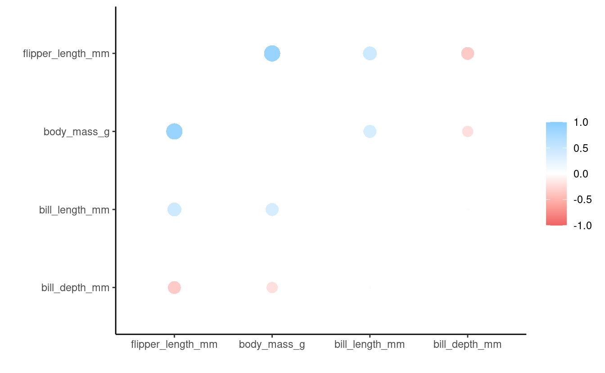
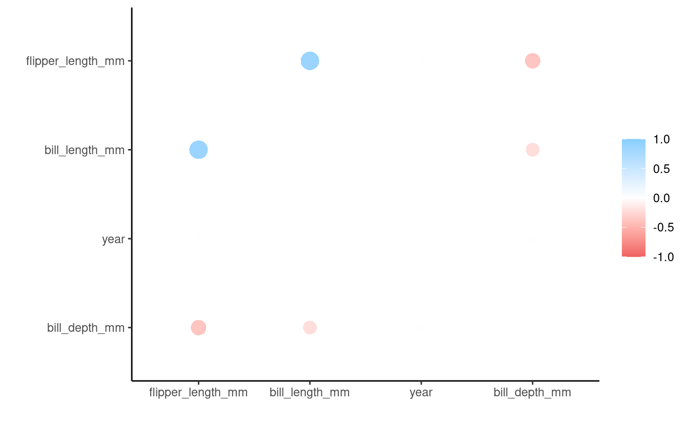

------------------------------------------------------------------------

## Housekeeping

#### New to Code Club?

Check out the [Code Club Computer Setup](/codeclub-setup/) instructions, which also has pointers for if you're new to R or RStudio. A few related Code Club sessions include:

-   [S03E01](/codeclub/s03e01_ttests/): T-tests
-   [S03E02](/codeclub/s03e02_anova/): ANOVA
-   [S03E03](/codeclub/s03e03_pca/): PCA
-   [S03E04](/codeclub/s03e04_anova2/): ANOVA part II

#### What will we go over today

-   We will introduce correlation.
-   Learn using the [`corrr()`](https://cran.r-project.org/web/packages/corrr/index.html) package.

#### R packages we will use

-   *corrr* -- for correlation analysis
-   *palmerpenguins* -- for the penguins data
-   *tidyverse* -- for data wrangling

 

------------------------------------------------------------------------

## 1 - What is correlation?

Correlation is a statistical method used to assess a linear association between two continuous variables. It is measured by a statistic called the correlation coefficient, which represents the strength of the linear association between the variables in question. It is a dimensionless quantity that takes a value in the range −1 to +1. A correlation coefficient of zero indicates that no linear relationship exists between two continuous variables, and a correlation coefficient of −1 or +1 indicates a perfect linear relationship. (The stronger the correlation, the closer the correlation coefficient comes to −1 and +1.)

**Positive coefficient**: If the coefficient is a positive number, the variables are positively related (i.e., as the value of one variable goes up, the value of the other also tends to do so).

**Negative coefficient**: If the coefficient is a negative number, the variables are inversely related (i.e., as the value of one variable goes up, the value of the other tends to go down).

**Types of correlation coefficients**: There are two main types of correlation coefficients, *Pearson's correlation coefficient* and *Spearman's rank correlation coefficient*. The correct usage of correlation coefficient type depends on the types of variables being studied.

-   *Pearson's correlation coefficient*: Pearson's correlation coefficient is denoted as **ϱ** for a population parameter and as **r** for a sample statistic. It is used when both variables being studied are normally distributed.

-   *Spearman's rank correlation coefficient*: Spearman's rank correlation coefficient is denoted as **ϱs** for a population parameter and as **rs** for a sample statistic. It is appropriate when one or both variables are skewed or ordinal.

**Rule of thumb for interpreting the size of a correlation coefficient**

-   .90 to 1.00 (−.90 to −1.00) -- Very high positive (negative) correlation
-   .70 to .90 (−.70 to −.90) -- High positive (negative) correlation
-   .50 to .70 (−.50 to −.70) -- Moderate positive (negative) correlation
-   .30 to .50 (−.30 to −.50) -- Low positive (negative) correlation
-   .00 to .30 (.00 to −.30) -- Negligible correlation

 

------------------------------------------------------------------------

## 2 - The *corrr* package and our data

The *corrr* package is a tool for exploring correlations. It makes it easy to perform routine tasks when exploring correlation matrices such as ignoring the diagonal, focusing on the correlations of certain variables against others, or rearranging and visualizing the matrix in terms of the strength of the correlations. The *corrr* package exists within the Comprehensive R Archive Network, or [CRAN](https://cran.r-project.org/).

Let's install it -- we only need to do this once:

<pre class='chroma'><code class='language-r' data-lang='r'><a href='https://rdrr.io/r/utils/install.packages.html'>install.packages</a>("corrr")</code></pre>

To use the *corrr* package, we need to load it up using [`library()`](https://rdrr.io/r/base/library.html). We also need to load the *tidyverse* since we will be using it later:

<pre class='chroma'><code class='language-r' data-lang='r'><a href='https://rdrr.io/r/base/library.html'>library</a>(<a href='https://github.com/tidymodels/corrr'>corrr</a>)
<a href='https://rdrr.io/r/base/library.html'>library</a>(<a href='https://tidyverse.tidyverse.org'>tidyverse</a>)
#&gt; ── Attaching packages ─────────────────────────────────────── tidyverse 1.3.1 ──
#&gt; ✔ ggplot2 3.3.5     ✔ purrr   0.3.4
#&gt; ✔ tibble  3.1.6     ✔ dplyr   1.0.7
#&gt; ✔ tidyr   1.2.0     ✔ stringr 1.4.0
#&gt; ✔ readr   2.1.2     ✔ forcats 0.5.1
#&gt; ── Conflicts ────────────────────────────────────────── tidyverse_conflicts() ──
#&gt; ✖ dplyr::filter() masks stats::filter()
#&gt; ✖ dplyr::lag()    masks stats::lag()</code></pre>

------------------------------------------------------------------------

**Let's get set up and grab some data to work with.**

We will use the same dataset [`palmerpenguins`](https://allisonhorst.github.io/palmerpenguins/) used in the previous weeks.

If you didn't install this package previously, please do so now:

<pre class='chroma'><code class='language-r' data-lang='r'><a href='https://rdrr.io/r/utils/install.packages.html'>install.packages</a>("palmerpenguins")</code></pre>

Then, to use the package, we need to use the function [`library()`](https://rdrr.io/r/base/library.html) to load it:

<pre class='chroma'><code class='language-r' data-lang='r'><a href='https://rdrr.io/r/base/library.html'>library</a>(<a href='https://allisonhorst.github.io/palmerpenguins/'>palmerpenguins</a>)</code></pre>

The data we will use today is a dataframe called `penguins`, which we reference after loading the package. We will look at the structure of the data:

<pre class='chroma'><code class='language-r' data-lang='r'># look at the first 10 rows, all columns
<a href='https://rdrr.io/r/utils/head.html'>head</a>(penguins, 10)
#&gt; # A tibble: 10 × 8
#&gt;    species island    bill_length_mm bill_depth_mm flipper_length_mm body_mass_g
#&gt;    &lt;fct&gt;   &lt;fct&gt;              &lt;dbl&gt;         &lt;dbl&gt;             &lt;int&gt;       &lt;int&gt;
#&gt;  1 Adelie  Torgersen           39.1          18.7               181        3750
#&gt;  2 Adelie  Torgersen           39.5          17.4               186        3800
#&gt;  3 Adelie  Torgersen           40.3          18                 195        3250
#&gt;  4 Adelie  Torgersen           NA            NA                  NA          NA
#&gt;  5 Adelie  Torgersen           36.7          19.3               193        3450
#&gt;  6 Adelie  Torgersen           39.3          20.6               190        3650
#&gt;  7 Adelie  Torgersen           38.9          17.8               181        3625
#&gt;  8 Adelie  Torgersen           39.2          19.6               195        4675
#&gt;  9 Adelie  Torgersen           34.1          18.1               193        3475
#&gt; 10 Adelie  Torgersen           42            20.2               190        4250
#&gt; # … with 2 more variables: sex &lt;fct&gt;, year &lt;int&gt;

# check the structure of penguins_data
# glimpse() which is a part of dplyr functions 
# similarly to str() and can be used interchangeably
glimpse(penguins)
#&gt; Rows: 344
#&gt; Columns: 8
#&gt; $ species           &lt;fct&gt; Adelie, Adelie, Adelie, Adelie, Adelie, Adelie, Adel…
#&gt; $ island            &lt;fct&gt; Torgersen, Torgersen, Torgersen, Torgersen, Torgerse…
#&gt; $ bill_length_mm    &lt;dbl&gt; 39.1, 39.5, 40.3, NA, 36.7, 39.3, 38.9, 39.2, 34.1, …
#&gt; $ bill_depth_mm     &lt;dbl&gt; 18.7, 17.4, 18.0, NA, 19.3, 20.6, 17.8, 19.6, 18.1, …
#&gt; $ flipper_length_mm &lt;int&gt; 181, 186, 195, NA, 193, 190, 181, 195, 193, 190, 186…
#&gt; $ body_mass_g       &lt;int&gt; 3750, 3800, 3250, NA, 3450, 3650, 3625, 4675, 3475, …
#&gt; $ sex               &lt;fct&gt; male, female, female, NA, female, male, female, male…
#&gt; $ year              &lt;int&gt; 2007, 2007, 2007, 2007, 2007, 2007, 2007, 2007, 2007…</code></pre>

Okay, now we have a sense of what the `penguins` dataset is.

 

------------------------------------------------------------------------

## 2 - Basic usage of the *corrr* package

Now we want to use the *corrr* package to correlate variables in the `penguins` dataframe. The *corrr* package uses the [`correlate()`](https://corrr.tidymodels.org/reference/correlate.html) function and returns correlation results in a tibble output.

Now let select variables from penguins using the pipe operator `%>%` and the `select()` function. We then specify name of the variables that we want to select. In this example, we are selecting variables `bill_length_mm`, `bill_depth_mm`, `flipper_length_mm`, and `body_mass_g`.

Then, we will compute correlations among the variables:

<pre class='chroma'><code class='language-r' data-lang='r'>penguins_cor &lt;- penguins %&gt;%   # Take penguins_data
  select(bill_length_mm, bill_depth_mm, flipper_length_mm, body_mass_g) %&gt;%
  <a href='https://corrr.tidymodels.org/reference/correlate.html'>correlate</a>()       # Select variables and calculate their correlations
#&gt; 
#&gt; Correlation method: 'pearson'
#&gt; Missing treated using: 'pairwise.complete.obs'

penguins_cor        # Correlation results in tibble
#&gt; # A tibble: 4 × 5
#&gt;   term              bill_length_mm bill_depth_mm flipper_length_mm body_mass_g
#&gt;   &lt;chr&gt;                      &lt;dbl&gt;         &lt;dbl&gt;             &lt;dbl&gt;       &lt;dbl&gt;
#&gt; 1 bill_length_mm            NA            -0.235             0.656       0.595
#&gt; 2 bill_depth_mm             -0.235        NA                -0.584      -0.472
#&gt; 3 flipper_length_mm          0.656        -0.584            NA           0.871
#&gt; 4 body_mass_g                0.595        -0.472             0.871      NA</code></pre>

The output of the [`correlate()`](https://corrr.tidymodels.org/reference/correlate.html) function can be piped (`%>%`) to:

-   The [`shave()`](https://corrr.tidymodels.org/reference/shave.html) and [`rearrange()`](https://corrr.tidymodels.org/reference/rearrange.html) functions for internal changes
-   The [`focus()`](https://corrr.tidymodels.org/reference/focus.html), and [`stretch()`](https://corrr.tidymodels.org/reference/stretch.html) functions to reshape the structure
-   And the [`rplot()`](https://corrr.tidymodels.org/reference/rplot.html), [`fashion()`](https://corrr.tidymodels.org/reference/fashion.html), and [`network_plot()`](https://corrr.tidymodels.org/reference/network_plot.html) for visualizations.

*Let us start with internal changes*.

-   The [`shave()`](https://corrr.tidymodels.org/reference/shave.html) function removes values of the upper or lower triangle and sets them to `NA`.
-   The [`rearrange()`](https://corrr.tidymodels.org/reference/rearrange.html) function arranges the columns and rows based on correlation strengths.

We can apply the [`shave()`](https://corrr.tidymodels.org/reference/shave.html) function remove the top triangle:

<pre class='chroma'><code class='language-r' data-lang='r'>penguins_cor %&gt;%   # Take penguins_cor results
  <a href='https://corrr.tidymodels.org/reference/shave.html'>shave</a>()          # Remove the upper triangle
#&gt; # A tibble: 4 × 5
#&gt;   term              bill_length_mm bill_depth_mm flipper_length_mm body_mass_g
#&gt;   &lt;chr&gt;                      &lt;dbl&gt;         &lt;dbl&gt;             &lt;dbl&gt;       &lt;dbl&gt;
#&gt; 1 bill_length_mm            NA            NA                NA              NA
#&gt; 2 bill_depth_mm             -0.235        NA                NA              NA
#&gt; 3 flipper_length_mm          0.656        -0.584            NA              NA
#&gt; 4 body_mass_g                0.595        -0.472             0.871          NA</code></pre>

You can see that values of upper triangle are replaced by `NA`s. Now let us remove `NA`s by using the [`fashion()`](https://corrr.tidymodels.org/reference/fashion.html) function:

<pre class='chroma'><code class='language-r' data-lang='r'>penguins_cor %&gt;%   # Take penguins_cor results
  shave %&gt;%        # Remove the upper triangle
  <a href='https://corrr.tidymodels.org/reference/fashion.html'>fashion</a>()        # Remove NAs
#&gt;                term bill_length_mm bill_depth_mm flipper_length_mm body_mass_g
#&gt; 1    bill_length_mm                                                           
#&gt; 2     bill_depth_mm           -.24                                            
#&gt; 3 flipper_length_mm            .66          -.58                              
#&gt; 4       body_mass_g            .60          -.47               .87</code></pre>

You can see that the `NA`s have been removed, and we have a clean tibble (dataframe).

Now, let's rearrange columns based on correlation strengths:

<pre class='chroma'><code class='language-r' data-lang='r'>penguins_cor %&gt;%   # Take penguins_cor results
  rearrange %&gt;%    # Rearrange based on correlation strengths
  shave %&gt;%        # Remove the upper triangle
  <a href='https://corrr.tidymodels.org/reference/fashion.html'>fashion</a>()        # Remove NAs
#&gt;                term flipper_length_mm body_mass_g bill_length_mm bill_depth_mm
#&gt; 1 flipper_length_mm                                                           
#&gt; 2       body_mass_g               .87                                         
#&gt; 3    bill_length_mm               .66         .60                             
#&gt; 4     bill_depth_mm              -.58        -.47           -.24</code></pre>

You can see that the values are arranged based on correlation strengths.

 

------------------------------------------------------------------------

## Breakout session 1

-   From the `penguins` dataframe, create a new dataset called `penguins_biscoe` by selecting only the penguins from the island of Biscoe.

-   In the `penguins_biscoe` dataframe, what are the correlations between `bill_length_mm`, `bill_depth_mm`, `flipper_length_mm`, and `year`?

-   Remove the upper triangle and `NA`s from the results, and arrange based on correlation strengths.

<b>Hints</b> (click here)

 

Use the [`filter()`](https://rdrr.io/r/stats/filter.html) function to only select penguins from the island of Biscoe.

<b>Solution</b> (click here)

 

Select the penguins from the island of Biscoe:

<pre class='chroma'><code class='language-r' data-lang='r'>penguins_biscoe &lt;- penguins %&gt;%  # Save results in new object
  <a href='https://rdrr.io/r/stats/filter.html'>filter</a>(island == "Biscoe")     # Select data from only Biscoe island  </code></pre>

Calculate correlation of the variables in `penguins_biscoe`:

<pre class='chroma'><code class='language-r' data-lang='r'>biscoe_cor &lt;- penguins_biscoe %&gt;%
  # select bill_length_mm, bill_depth_mm, flipper_length_mm, and year
  select(bill_length_mm, bill_depth_mm, flipper_length_mm, year) %&gt;%
  <a href='https://corrr.tidymodels.org/reference/correlate.html'>correlate</a>()        # Calculate correlation
#&gt; 
#&gt; Correlation method: 'pearson'
#&gt; Missing treated using: 'pairwise.complete.obs'

biscoe_cor
#&gt; # A tibble: 4 × 5
#&gt;   term              bill_length_mm bill_depth_mm flipper_length_mm    year
#&gt;   &lt;chr&gt;                      &lt;dbl&gt;         &lt;dbl&gt;             &lt;dbl&gt;   &lt;dbl&gt;
#&gt; 1 bill_length_mm           NA             -0.444             0.866  0.0968
#&gt; 2 bill_depth_mm            -0.444         NA                -0.579  0.138 
#&gt; 3 flipper_length_mm         0.866         -0.579            NA      0.105 
#&gt; 4 year                      0.0968         0.138             0.105 NA</code></pre>

To remove the upper triangle and rearrange the results:

<pre class='chroma'><code class='language-r' data-lang='r'>biscoe_cor  %&gt;%      # Take biscoe_cor results
  <a href='https://corrr.tidymodels.org/reference/rearrange.html'>rearrange</a>() %&gt;%    # Rearrange based on correlation strengths
  <a href='https://corrr.tidymodels.org/reference/shave.html'>shave</a>() %&gt;%        # Remove the upper triangle
  <a href='https://corrr.tidymodels.org/reference/fashion.html'>fashion</a>()          # Remove NAs
#&gt;                term flipper_length_mm bill_length_mm year bill_depth_mm
#&gt; 1 flipper_length_mm                                                    
#&gt; 2    bill_length_mm               .87                                  
#&gt; 3              year               .11            .10                   
#&gt; 4     bill_depth_mm              -.58           -.44  .14</code></pre>

 

------------------------------------------------------------------------

## 3 - Reshaping and visualizations

The output of the [`correlate()`](https://corrr.tidymodels.org/reference/correlate.html) function can also be piped to:

-   The [`focus()`](https://corrr.tidymodels.org/reference/focus.html) and [`stretch()`](https://corrr.tidymodels.org/reference/stretch.html) functions to reshape the structure
-   And the [`rplot()`](https://corrr.tidymodels.org/reference/rplot.html), and [`network_plot()`](https://corrr.tidymodels.org/reference/network_plot.html) for visualizations.

*Reshape structure*:

-   The [`focus()`](https://corrr.tidymodels.org/reference/focus.html) function select columns or rows based on the variable specified.
-   The [`stretch()`](https://corrr.tidymodels.org/reference/stretch.html) converts correction results from a tibble into a long format.

*Visualizations*:

-   The [`rplot()`](https://corrr.tidymodels.org/reference/rplot.html) function plots correlation results
-   The [`network_plot()`](https://corrr.tidymodels.org/reference/network_plot.html) function plots a point for each variable, joined by paths for correlations

Let use the [`stretch()`](https://corrr.tidymodels.org/reference/stretch.html) function to convert our correlation results `penguins_cor` into a long format:

<pre class='chroma'><code class='language-r' data-lang='r'>penguins_cor %&gt;%
  <a href='https://corrr.tidymodels.org/reference/stretch.html'>stretch</a>()
#&gt; # A tibble: 16 × 3
#&gt;    x                 y                      r
#&gt;    &lt;chr&gt;             &lt;chr&gt;              &lt;dbl&gt;
#&gt;  1 bill_length_mm    bill_length_mm    NA    
#&gt;  2 bill_length_mm    bill_depth_mm     -0.235
#&gt;  3 bill_length_mm    flipper_length_mm  0.656
#&gt;  4 bill_length_mm    body_mass_g        0.595
#&gt;  5 bill_depth_mm     bill_length_mm    -0.235
#&gt;  6 bill_depth_mm     bill_depth_mm     NA    
#&gt;  7 bill_depth_mm     flipper_length_mm -0.584
#&gt;  8 bill_depth_mm     body_mass_g       -0.472
#&gt;  9 flipper_length_mm bill_length_mm     0.656
#&gt; 10 flipper_length_mm bill_depth_mm     -0.584
#&gt; 11 flipper_length_mm flipper_length_mm NA    
#&gt; 12 flipper_length_mm body_mass_g        0.871
#&gt; 13 body_mass_g       bill_length_mm     0.595
#&gt; 14 body_mass_g       bill_depth_mm     -0.472
#&gt; 15 body_mass_g       flipper_length_mm  0.871
#&gt; 16 body_mass_g       body_mass_g       NA</code></pre>

You can see that the results are coverted into a long format.

We can also select a column we are interested in. Let us select only correlation between "bill_depth_mm" and the rest of the variables.

<pre class='chroma'><code class='language-r' data-lang='r'>penguins_cor %&gt;%
  <a href='https://corrr.tidymodels.org/reference/focus.html'>focus</a>("bill_depth_mm")
#&gt; # A tibble: 3 × 2
#&gt;   term              bill_depth_mm
#&gt;   &lt;chr&gt;                     &lt;dbl&gt;
#&gt; 1 bill_length_mm           -0.235
#&gt; 2 flipper_length_mm        -0.584
#&gt; 3 body_mass_g              -0.472</code></pre>

You can see that we selected only the correlations between `bill_depth_mm` and other variables.

We can now visualize the results:

<pre class='chroma'><code class='language-r' data-lang='r'>penguins_cor %&gt;% 
  <a href='https://corrr.tidymodels.org/reference/rearrange.html'>rearrange</a>() %&gt;%   # Rearrange based on correlation strengths
  <a href='https://corrr.tidymodels.org/reference/rplot.html'>rplot</a>()           # Plot
#&gt; Don't know how to automatically pick scale for object of type noquote. Defaulting to continuous.
</code></pre>

We plotted based on correlation strengths.

 

------------------------------------------------------------------------

## Breakout session 2

Use the dataframe (`penguins_biscoe`) you created in Breakout session 1 to:

-   Calculate correlations among the variables, and present the results in a long format

-   Select the correlations that include `year`

-   Plot a correlation graph based on correlation strengths

<b>Solution</b> (click here)

 

<pre class='chroma'><code class='language-r' data-lang='r'>biscoe_cor &lt;- penguins_biscoe %&gt;%
  select(bill_length_mm, bill_depth_mm, flipper_length_mm, year) %&gt;%
  <a href='https://corrr.tidymodels.org/reference/correlate.html'>correlate</a>()
#&gt; 
#&gt; Correlation method: 'pearson'
#&gt; Missing treated using: 'pairwise.complete.obs'

biscoe_cor %&gt;%
  <a href='https://corrr.tidymodels.org/reference/stretch.html'>stretch</a>()
#&gt; # A tibble: 16 × 3
#&gt;    x                 y                       r
#&gt;    &lt;chr&gt;             &lt;chr&gt;               &lt;dbl&gt;
#&gt;  1 bill_length_mm    bill_length_mm    NA     
#&gt;  2 bill_length_mm    bill_depth_mm     -0.444 
#&gt;  3 bill_length_mm    flipper_length_mm  0.866 
#&gt;  4 bill_length_mm    year               0.0968
#&gt;  5 bill_depth_mm     bill_length_mm    -0.444 
#&gt;  6 bill_depth_mm     bill_depth_mm     NA     
#&gt;  7 bill_depth_mm     flipper_length_mm -0.579 
#&gt;  8 bill_depth_mm     year               0.138 
#&gt;  9 flipper_length_mm bill_length_mm     0.866 
#&gt; 10 flipper_length_mm bill_depth_mm     -0.579 
#&gt; 11 flipper_length_mm flipper_length_mm NA     
#&gt; 12 flipper_length_mm year               0.105 
#&gt; 13 year              bill_length_mm     0.0968
#&gt; 14 year              bill_depth_mm      0.138 
#&gt; 15 year              flipper_length_mm  0.105 
#&gt; 16 year              year              NA</code></pre>

You can see that results are in a long format.

<pre class='chroma'><code class='language-r' data-lang='r'>biscoe_cor %&gt;%
   <a href='https://corrr.tidymodels.org/reference/focus.html'>focus</a>("year")
#&gt; # A tibble: 3 × 2
#&gt;   term                year
#&gt;   &lt;chr&gt;              &lt;dbl&gt;
#&gt; 1 bill_length_mm    0.0968
#&gt; 2 bill_depth_mm     0.138 
#&gt; 3 flipper_length_mm 0.105</code></pre>

Correlations with `year`:

<pre class='chroma'><code class='language-r' data-lang='r'>biscoe_cor %&gt;%
  <a href='https://corrr.tidymodels.org/reference/rearrange.html'>rearrange</a>() %&gt;%
  <a href='https://corrr.tidymodels.org/reference/rplot.html'>rplot</a>()
#&gt; Don't know how to automatically pick scale for object of type noquote. Defaulting to continuous.
</code></pre>

 

