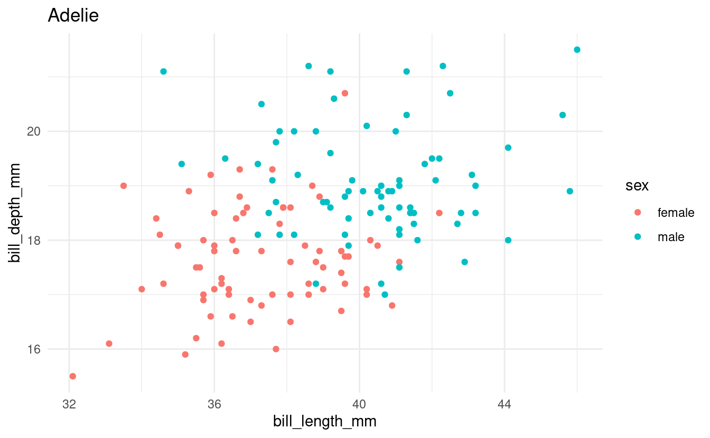
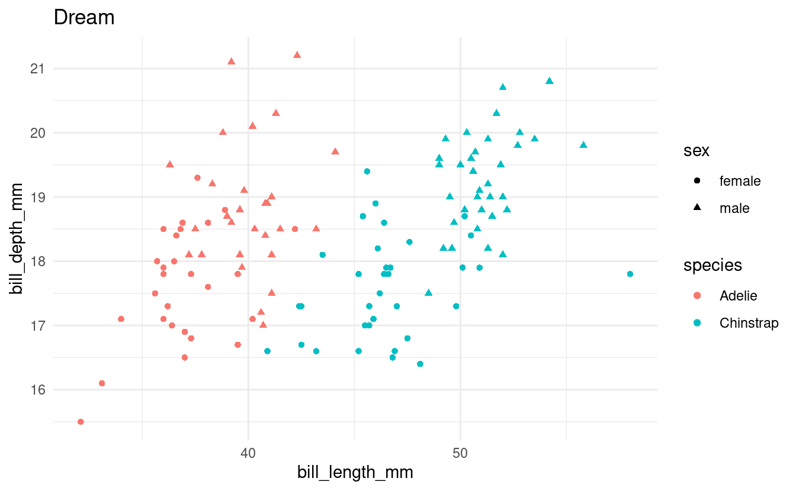

<br> <br> <br>

------------------------------------------------------------------------

## Housekeeping

#### New to Code Club?

Check out the [Code Club Computer Setup](/codeclub-setup/) instructions, which also has pointers for if you're new to R or RStudio.

#### Session goals

Today, you will learn:

-   The basics of `for` loops.
-   How to print and save output from `for` loops
-   How to use `if` statements

#### R packages we will use

<div class="highlight">

<pre class='chroma'><code class='language-r' data-lang='r'><span class='c'>## This will _install_ the packages only if you don't already have them:</span>
<span class='kr'>if</span> <span class='o'>(</span><span class='o'>!</span><span class='kr'><a href='https://rdrr.io/r/base/library.html'>require</a></span><span class='o'>(</span><span class='nv'><a href='https://allisonhorst.github.io/palmerpenguins/'>palmerpenguins</a></span><span class='o'>)</span><span class='o'>)</span> <span class='nf'><a href='https://rdrr.io/r/utils/install.packages.html'>install.packages</a></span><span class='o'>(</span><span class='s'>"palmerpenguins"</span><span class='o'>)</span>
<span class='kr'>if</span> <span class='o'>(</span><span class='o'>!</span><span class='kr'><a href='https://rdrr.io/r/base/library.html'>require</a></span><span class='o'>(</span><span class='nv'><a href='https://tidyverse.tidyverse.org'>tidyverse</a></span><span class='o'>)</span><span class='o'>)</span> <span class='nf'><a href='https://rdrr.io/r/utils/install.packages.html'>install.packages</a></span><span class='o'>(</span><span class='s'>"tidyverse"</span><span class='o'>)</span>
<span class='kr'>if</span> <span class='o'>(</span><span class='o'>!</span><span class='kr'><a href='https://rdrr.io/r/base/library.html'>require</a></span><span class='o'>(</span><span class='nv'><a href='https://github.com/tidyverse/glue'>glue</a></span><span class='o'>)</span><span class='o'>)</span> <span class='nf'><a href='https://rdrr.io/r/utils/install.packages.html'>install.packages</a></span><span class='o'>(</span><span class='s'>"glue"</span><span class='o'>)</span>

<span class='c'>## This will _load_ the packages:</span>
<span class='kr'><a href='https://rdrr.io/r/base/library.html'>library</a></span><span class='o'>(</span><span class='nv'><a href='https://allisonhorst.github.io/palmerpenguins/'>palmerpenguins</a></span><span class='o'>)</span>
<span class='kr'><a href='https://rdrr.io/r/base/library.html'>library</a></span><span class='o'>(</span><span class='nv'><a href='https://tidyverse.tidyverse.org'>tidyverse</a></span><span class='o'>)</span>
<span class='kr'><a href='https://rdrr.io/r/base/library.html'>library</a></span><span class='o'>(</span><span class='nv'><a href='https://github.com/tidyverse/glue'>glue</a></span><span class='o'>)</span></code></pre>

</div>

<br>

------------------------------------------------------------------------

## I -- Introduction

Last week, we learned that we should avoid copy-pasting our code when we want to repeat operations.

We also focused on one alternative approach: making use of R's vectorization capabilities. When passed a vector, most functions will automatically be performed separately for all elements in the vector, and you don't need to explicitly iterate over (e.g., loop over) these elements:

<div class="highlight">

<pre class='chroma'><code class='language-r' data-lang='r'><span class='nf'><a href='https://rdrr.io/r/base/c.html'>c</a></span><span class='o'>(</span><span class='m'>2.5</span>, <span class='m'>4.1</span>, <span class='m'>7</span>, <span class='m'>3.6</span><span class='o'>)</span> <span class='o'>*</span> <span class='m'>0.45</span>
<span class='c'>#&gt; [1] 1.125 1.845 3.150 1.620</span></code></pre>

</div>

However, vectorization can only be applied to a specific set of problems. A more universal solution when you need to repeat operations is **iteration**. The two main iteration approaches in R involve *loops* and *functionals*.

**Today, we will focus on loops and over the next two weeks, Mike Sovic will teach us about functionals.**

In R, *functionals* like `apply` and `map` are often preferred over loops because they are more elegant and succinct than loops -- but this can also make them harder to understand.

Loops are a good place to start learning to use iteration because:

-   They make the iteration aspect explicit and are therefore more intuitive than functionals.

-   They can easily accommodate longer blocks of code without the need to *also* write your own function.

-   They are a near-universal feature in programming languages and are a *very* common sight in languages like Python and Bash, so they are good to familiarize yourself with.

Today, we will talk about the most common type of loop: the `for` loop. (Other types of loops in R are `while` loops and `repeat` loops -- I honestly never use those.)

<br>

------------------------------------------------------------------------

## II -- `for` loop basics

`for` loops iterate over a *collection*, such as a vector, allowing you to **perform one or more actions for each element in the collection,** **one element at a time.**

The basic syntax is as follows:

``` r
for (item in collection) {
  # ...code to do things for each element, one at a time...
}
```

The simple example below will help to understand the syntax:

(Note that this example is so simple that vectorization would have also worked; we'll move on to more realistic loop examples in the next section.)

<div class="highlight">

<pre class='chroma'><code class='language-r' data-lang='r'><span class='c'>## A loop to print negated values:</span>
<span class='kr'>for</span> <span class='o'>(</span><span class='nv'>a_number</span> <span class='kr'>in</span> <span class='nf'><a href='https://rdrr.io/r/base/c.html'>c</a></span><span class='o'>(</span><span class='m'>1</span>, <span class='m'>2</span>, <span class='m'>3</span>, <span class='m'>4</span><span class='o'>)</span><span class='o'>)</span> <span class='o'>&#123;</span>  <span class='c'># We iterate over 1, 2, 3, 4</span>
  <span class='nf'><a href='https://rdrr.io/r/base/print.html'>print</a></span><span class='o'>(</span><span class='nv'>a_number</span> <span class='o'>*</span> <span class='o'>-</span><span class='m'>1</span><span class='o'>)</span>             <span class='c'># Multiply each number by -1</span>
<span class='o'>&#125;</span>
<span class='c'>#&gt; [1] -1</span>
<span class='c'>#&gt; [1] -2</span>
<span class='c'>#&gt; [1] -3</span>
<span class='c'>#&gt; [1] -4</span></code></pre>

</div>

On the first line, we initialized the `for` loop, telling it to **assign each item in the vector to the variable `a_number`,** **one at a time**.

The code *inside* the loop (which is inside the `{}` braces and is indented) *will run as many times as there are elements in the collection*. Each time it runs, `a_number` contains a single value from the vector.

In other words, what you are instructing R to do is:

<div class="highlight">

<pre class='chroma'><code class='language-r' data-lang='r'><span class='c'># Iteration 1</span>
<span class='nv'>a_number</span> <span class='o'>&lt;-</span> <span class='m'>1</span>
<span class='nf'><a href='https://rdrr.io/r/base/print.html'>print</a></span><span class='o'>(</span><span class='nv'>a_number</span> <span class='o'>*</span> <span class='o'>-</span><span class='m'>1</span><span class='o'>)</span>
<span class='c'>#&gt; [1] -1</span>

<span class='c'># Iteration 2</span>
<span class='nv'>a_number</span> <span class='o'>&lt;-</span> <span class='m'>2</span>
<span class='nf'><a href='https://rdrr.io/r/base/print.html'>print</a></span><span class='o'>(</span><span class='nv'>a_number</span> <span class='o'>*</span> <span class='o'>-</span><span class='m'>1</span><span class='o'>)</span>
<span class='c'>#&gt; [1] -2</span>

<span class='c'># Iteration 3</span>
<span class='nv'>a_number</span> <span class='o'>&lt;-</span> <span class='m'>2</span>
<span class='nf'><a href='https://rdrr.io/r/base/print.html'>print</a></span><span class='o'>(</span><span class='nv'>a_number</span> <span class='o'>*</span> <span class='o'>-</span><span class='m'>1</span><span class='o'>)</span>
<span class='c'>#&gt; [1] -2</span>

<span class='c'># Iteration 4</span>
<span class='nv'>a_number</span> <span class='o'>&lt;-</span> <span class='m'>3</span>
<span class='nf'><a href='https://rdrr.io/r/base/print.html'>print</a></span><span class='o'>(</span><span class='nv'>a_number</span> <span class='o'>*</span> <span class='o'>-</span><span class='m'>1</span><span class='o'>)</span>
<span class='c'>#&gt; [1] -3</span></code></pre>

</div>

<div class="highlight">

<pre class='chroma'><code class='language-r' data-lang='r'><span class='c'>## Just printing the same loop for reference:</span>
<span class='kr'>for</span> <span class='o'>(</span><span class='nv'>a_number</span> <span class='kr'>in</span> <span class='nf'><a href='https://rdrr.io/r/base/c.html'>c</a></span><span class='o'>(</span><span class='m'>1</span>, <span class='m'>2</span>, <span class='m'>3</span>, <span class='m'>4</span><span class='o'>)</span><span class='o'>)</span> <span class='o'>&#123;</span>  <span class='c'># We iterate over 1, 2, 3, 4</span>
  <span class='nf'><a href='https://rdrr.io/r/base/print.html'>print</a></span><span class='o'>(</span><span class='nv'>a_number</span> <span class='o'>*</span> <span class='o'>-</span><span class='m'>1</span><span class='o'>)</span>             <span class='c'># Multiply each number by -1</span>
<span class='o'>&#125;</span></code></pre>

</div>

-   The name given to the variable that will contain one *item* at a time, here `a_number`, is an arbitrary choice, just like when you assign variables the regular way (`a_number <- 1`).

-   The *collection* is usually a vector or a list: one that already exists or which you create on the fly in the loop initialization line, like we did above with [`c(1, 2, 3, 4)`](https://rdrr.io/r/base/c.html).

-   `for`, the parentheses `()`, `in`, and the curly braces `{}` are all fixed elements of `for` loops. Only the braces can be omitted in some cases, as we'll see below.

### The variable in the loop

As mentioned, the **variable name** that we assign to is arbitrary: we could use anything, as long as we reference it with the same name inside the loop:

<div class="highlight">

<pre class='chroma'><code class='language-r' data-lang='r'><span class='c'>## Example 1 with a different variable name: "positive_number"</span>
<span class='kr'>for</span> <span class='o'>(</span><span class='nv'>positive_number</span> <span class='kr'>in</span> <span class='nf'><a href='https://rdrr.io/r/base/c.html'>c</a></span><span class='o'>(</span><span class='m'>1</span>, <span class='m'>2</span>, <span class='m'>3</span>, <span class='m'>4</span><span class='o'>)</span><span class='o'>)</span> <span class='o'>&#123;</span>
  <span class='nf'><a href='https://rdrr.io/r/base/print.html'>print</a></span><span class='o'>(</span><span class='nv'>positive_number</span> <span class='o'>*</span> <span class='o'>-</span><span class='m'>1</span><span class='o'>)</span>
<span class='o'>&#125;</span>
<span class='c'>#&gt; [1] -1</span>
<span class='c'>#&gt; [1] -2</span>
<span class='c'>#&gt; [1] -3</span>
<span class='c'>#&gt; [1] -4</span>

<span class='c'>## Example 2 with a different variable name: "i"</span>
<span class='kr'>for</span> <span class='o'>(</span><span class='nv'>i</span> <span class='kr'>in</span> <span class='nf'><a href='https://rdrr.io/r/base/c.html'>c</a></span><span class='o'>(</span><span class='m'>1</span>, <span class='m'>2</span>, <span class='m'>3</span>, <span class='m'>4</span><span class='o'>)</span><span class='o'>)</span> <span class='o'>&#123;</span>
  <span class='nf'><a href='https://rdrr.io/r/base/print.html'>print</a></span><span class='o'>(</span><span class='nv'>i</span> <span class='o'>*</span> <span class='o'>-</span><span class='m'>1</span><span class='o'>)</span>
<span class='o'>&#125;</span>
<span class='c'>#&gt; [1] -1</span>
<span class='c'>#&gt; [1] -2</span>
<span class='c'>#&gt; [1] -3</span>
<span class='c'>#&gt; [1] -4</span></code></pre>

</div>

Note also that we actually don't *have to* use the variable we are looping over: we could also use a `for` loop as a roundabout way to simply repeat something as many times as there are values in our collection:

<div class="highlight">

<pre class='chroma'><code class='language-r' data-lang='r'><span class='kr'>for</span> <span class='o'>(</span><span class='nv'>i</span> <span class='kr'>in</span> <span class='nf'><a href='https://rdrr.io/r/base/c.html'>c</a></span><span class='o'>(</span><span class='m'>1</span>, <span class='m'>2</span>, <span class='m'>3</span>, <span class='m'>4</span><span class='o'>)</span><span class='o'>)</span> <span class='o'>&#123;</span>
  <span class='nf'><a href='https://rdrr.io/r/base/print.html'>print</a></span><span class='o'>(</span><span class='s'>"Yes!"</span><span class='o'>)</span>                     <span class='c'># Print "Yes!" in each of our four iterations </span>
<span class='o'>&#125;</span>
<span class='c'>#&gt; [1] "Yes!"</span>
<span class='c'>#&gt; [1] "Yes!"</span>
<span class='c'>#&gt; [1] "Yes!"</span>
<span class='c'>#&gt; [1] "Yes!"</span></code></pre>

</div>

### Printing the output

In a loop, we need to explicitly use the [`print()`](https://rdrr.io/r/base/print.html) function if we want to print something to screen -- nothing will be printed if we omit this:

<div class="highlight">

<pre class='chroma'><code class='language-r' data-lang='r'><span class='kr'>for</span> <span class='o'>(</span><span class='nv'>i</span> <span class='kr'>in</span> <span class='m'>1</span><span class='o'>:</span><span class='m'>4</span><span class='o'>)</span> <span class='o'>&#123;</span>
  <span class='nv'>i</span> <span class='o'>*</span> <span class='o'>-</span><span class='m'>1</span>
<span class='o'>&#125;</span></code></pre>

</div>

In practice, you might often want to store the result in a variable rather than just printing it to screen, and we'll see how to do that in the next section.

<div class="alert alert-note">

<div>

A note on syntax: the *curly braces* are not strictly necessary for one-liners like this:

<div class="highlight">

<pre class='chroma'><code class='language-r' data-lang='r'><span class='kr'>for</span> <span class='o'>(</span><span class='nv'>i</span> <span class='kr'>in</span> <span class='nf'><a href='https://rdrr.io/r/base/c.html'>c</a></span><span class='o'>(</span><span class='m'>1</span>, <span class='m'>2</span>, <span class='m'>3</span>, <span class='m'>4</span><span class='o'>)</span><span class='o'>)</span> <span class='nf'><a href='https://rdrr.io/r/base/print.html'>print</a></span><span class='o'>(</span><span class='nv'>i</span> <span class='o'>*</span> <span class='o'>-</span><span class='m'>1</span><span class='o'>)</span>
<span class='c'>#&gt; [1] -1</span>
<span class='c'>#&gt; [1] -2</span>
<span class='c'>#&gt; [1] -3</span>
<span class='c'>#&gt; [1] -4</span></code></pre>

</div>

</div>

</div>

<br>

------------------------------------------------------------------------

## Breakout Rooms I

#### Copy and run this code to get set up!

<div class="highlight">

<pre class='chroma'><code class='language-r' data-lang='r'><span class='c'>## This will _install_ the packages only if you don't already have them:</span>
<span class='kr'>if</span> <span class='o'>(</span><span class='o'>!</span><span class='kr'><a href='https://rdrr.io/r/base/library.html'>require</a></span><span class='o'>(</span><span class='nv'><a href='https://allisonhorst.github.io/palmerpenguins/'>palmerpenguins</a></span><span class='o'>)</span><span class='o'>)</span> <span class='nf'><a href='https://rdrr.io/r/utils/install.packages.html'>install.packages</a></span><span class='o'>(</span><span class='s'>"palmerpenguins"</span><span class='o'>)</span>
<span class='kr'>if</span> <span class='o'>(</span><span class='o'>!</span><span class='kr'><a href='https://rdrr.io/r/base/library.html'>require</a></span><span class='o'>(</span><span class='nv'><a href='https://tidyverse.tidyverse.org'>tidyverse</a></span><span class='o'>)</span><span class='o'>)</span> <span class='nf'><a href='https://rdrr.io/r/utils/install.packages.html'>install.packages</a></span><span class='o'>(</span><span class='s'>"tidyverse"</span><span class='o'>)</span>
<span class='kr'>if</span> <span class='o'>(</span><span class='o'>!</span><span class='kr'><a href='https://rdrr.io/r/base/library.html'>require</a></span><span class='o'>(</span><span class='nv'><a href='https://github.com/tidyverse/glue'>glue</a></span><span class='o'>)</span><span class='o'>)</span> <span class='nf'><a href='https://rdrr.io/r/utils/install.packages.html'>install.packages</a></span><span class='o'>(</span><span class='s'>"glue"</span><span class='o'>)</span>

<span class='c'>## This will _load_ the packages:</span>
<span class='kr'><a href='https://rdrr.io/r/base/library.html'>library</a></span><span class='o'>(</span><span class='nv'><a href='https://allisonhorst.github.io/palmerpenguins/'>palmerpenguins</a></span><span class='o'>)</span>
<span class='kr'><a href='https://rdrr.io/r/base/library.html'>library</a></span><span class='o'>(</span><span class='nv'><a href='https://tidyverse.tidyverse.org'>tidyverse</a></span><span class='o'>)</span>
<span class='kr'><a href='https://rdrr.io/r/base/library.html'>library</a></span><span class='o'>(</span><span class='nv'><a href='https://github.com/tidyverse/glue'>glue</a></span><span class='o'>)</span></code></pre>

</div>

</details>

<div class="puzzle">

<div>

### Exercise 1: First loops

Loop over the numbers 5 through 10; and inside the loop, simply print each number to screen.

(Of course, feel free to look at the examples above for reference -- but *type out the loop* to get the syntax under your fingers.)

<details>
<summary>
<b>Solution</b> (click here)
</summary>

<br>

<div class="highlight">

<pre class='chroma'><code class='language-r' data-lang='r'><span class='kr'>for</span> <span class='o'>(</span><span class='nv'>i</span> <span class='kr'>in</span> <span class='m'>5</span><span class='o'>:</span><span class='m'>10</span><span class='o'>)</span> <span class='o'>&#123;</span>
  <span class='nf'><a href='https://rdrr.io/r/base/print.html'>print</a></span><span class='o'>(</span><span class='nv'>i</span><span class='o'>)</span>
<span class='o'>&#125;</span>
<span class='c'>#&gt; [1] 5</span>
<span class='c'>#&gt; [1] 6</span>
<span class='c'>#&gt; [1] 7</span>
<span class='c'>#&gt; [1] 8</span>
<span class='c'>#&gt; [1] 9</span>
<span class='c'>#&gt; [1] 10</span></code></pre>

</div>

</details>

Loop over the first 8 penguin bill depth values (column `bill_depth_mm` in the `penguins` dataframe), and in each iteration of the loop, add `100` to the focal bill depth. Print the results to screen.

<details>
<summary>
<b>Hints on extracting the bill depths</b> (click here)
</summary>

<br>

-   One way to extract the `bill_depth_mm` column as a vector is using `penguins$bill_depth_mm`. (Another is `penguins %>% pull(bill_depth_mm)`.)

-   One way to take the first 8 values of a vector `my_vec` is using `my_vec[1:8]`. (Another is `my_vec %>% head(8)`.)

</details>
<details>
<summary>
<b>Solution</b> (click here)
</summary>

<br>

<div class="highlight">

<pre class='chroma'><code class='language-r' data-lang='r'><span class='kr'>for</span> <span class='o'>(</span><span class='nv'>bill_dep</span> <span class='kr'>in</span> <span class='nv'>penguins</span><span class='o'>$</span><span class='nv'>bill_depth_mm</span><span class='o'>[</span><span class='m'>1</span><span class='o'>:</span><span class='m'>8</span><span class='o'>]</span><span class='o'>)</span> <span class='o'>&#123;</span>
  <span class='nf'><a href='https://rdrr.io/r/base/print.html'>print</a></span><span class='o'>(</span><span class='nv'>bill_dep</span> <span class='o'>+</span> <span class='m'>100</span><span class='o'>)</span>
<span class='o'>&#125;</span>
<span class='c'>#&gt; [1] 118.7</span>
<span class='c'>#&gt; [1] 117.4</span>
<span class='c'>#&gt; [1] 118</span>
<span class='c'>#&gt; [1] NA</span>
<span class='c'>#&gt; [1] 119.3</span>
<span class='c'>#&gt; [1] 120.6</span>
<span class='c'>#&gt; [1] 117.8</span>
<span class='c'>#&gt; [1] 119.6</span></code></pre>

</div>

</details>

</div>

</div>

<br>

<div class="puzzle">

<div>

### Exercise 2: Keeping track of the iteration number

Create a vector with the first names of everyone in your breakout room group (e.g. `first_names <- c("Phillida", "Ethan", "Tonci")`), and a second vector with everyone's last names.

Next, use a loop to print your breakout room's equivalent of the following:

    The name of person 1 is Phillida Maas
    The name of person 2 is Ethan Hope
    The name of person 3 is Tonci Elwes

<details>
<summary>
<b>Hint 1</b> (click here)
</summary>

<br>

-   To get the numbers (`person 1` etc) *and* the corresponding first and last names, you'll want to **loop over a vector of numbers** (indices), in this case `1:3`. You can then extract the corresponding names inside the loop by indexing with this number (as in `first_names[1]`).

-   Ideally, you will determine the number of names in your room with code instead of just counting them manually -- you can do so using the [`length()`](https://rdrr.io/r/base/length.html) function. That way, you could use the exact same code if you had a different number of people in your group.

</details>
<details>
<summary>
<b>Hint 2: code with blanks</b> (click here)
</summary>

<br>

Use the following code as a template, replacing the `...` blanks:

<div class="highlight">

<pre class='chroma'><code class='language-r' data-lang='r'><span class='nv'>first_names</span> <span class='o'>&lt;-</span> <span class='nf'><a href='https://rdrr.io/r/base/c.html'>c</a></span><span class='o'>(</span><span class='s'>"Phillida"</span>, <span class='s'>"Ethan"</span>, <span class='s'>"Tonci"</span><span class='o'>)</span>
<span class='nv'>last_names</span> <span class='o'>&lt;-</span> <span class='nf'><a href='https://rdrr.io/r/base/c.html'>c</a></span><span class='o'>(</span><span class='s'>"Maas"</span>, <span class='s'>"Hope"</span>, <span class='s'>"Elwes"</span><span class='o'>)</span>
<span class='nv'>n_names</span> <span class='o'>&lt;-</span> <span class='nv'>...</span> <span class='c'># get the number of first or last names</span>

<span class='kr'>for</span> <span class='o'>(</span><span class='nv'>...</span> <span class='kr'>in</span> <span class='m'>1</span><span class='o'>:</span><span class='nv'>...</span><span class='o'>)</span> <span class='o'>&#123;</span>
  <span class='nv'>first_name</span> <span class='o'>&lt;-</span> <span class='nv'>...</span>
  <span class='nv'>last_name</span> <span class='o'>&lt;-</span> <span class='nv'>...</span>
  <span class='nv'>string</span> <span class='o'>&lt;-</span> <span class='nf'><a href='https://glue.tidyverse.org/reference/glue.html'>glue</a></span><span class='o'>(</span><span class='s'>"The name of person &#123;...&#125; is &#123;...&#125; &#123;...&#125;"</span><span class='o'>)</span>
  <span class='nf'><a href='https://rdrr.io/r/base/print.html'>print</a></span><span class='o'>(</span><span class='nv'>string</span><span class='o'>)</span>
<span class='o'>&#125;</span></code></pre>

</div>

</details>
<details>
<summary>
<b>Solution</b> (click here)
</summary>

<br>

<div class="highlight">

<pre class='chroma'><code class='language-r' data-lang='r'><span class='nv'>first_names</span> <span class='o'>&lt;-</span> <span class='nf'><a href='https://rdrr.io/r/base/c.html'>c</a></span><span class='o'>(</span><span class='s'>"Phillida"</span>, <span class='s'>"Ethan"</span>, <span class='s'>"Tonci"</span><span class='o'>)</span>
<span class='nv'>last_names</span> <span class='o'>&lt;-</span> <span class='nf'><a href='https://rdrr.io/r/base/c.html'>c</a></span><span class='o'>(</span><span class='s'>"Maas"</span>, <span class='s'>"Hope"</span>, <span class='s'>"Elwes"</span><span class='o'>)</span>
<span class='nv'>n_names</span> <span class='o'>&lt;-</span> <span class='nf'><a href='https://rdrr.io/r/base/length.html'>length</a></span><span class='o'>(</span><span class='nv'>first_names</span><span class='o'>)</span> <span class='c'># get the number of first or last names</span>

<span class='kr'>for</span> <span class='o'>(</span><span class='nv'>index</span> <span class='kr'>in</span> <span class='m'>1</span><span class='o'>:</span><span class='nv'>n_names</span><span class='o'>)</span> <span class='o'>&#123;</span>
  <span class='nv'>first_name</span> <span class='o'>&lt;-</span> <span class='nv'>first_names</span><span class='o'>[</span><span class='nv'>index</span><span class='o'>]</span>
  <span class='nv'>last_name</span> <span class='o'>&lt;-</span> <span class='nv'>last_names</span><span class='o'>[</span><span class='nv'>index</span><span class='o'>]</span>
  <span class='nv'>string</span> <span class='o'>&lt;-</span> <span class='nf'><a href='https://glue.tidyverse.org/reference/glue.html'>glue</a></span><span class='o'>(</span><span class='s'>"The name of person &#123;index&#125; is &#123;first_name&#125; &#123;last_name&#125;"</span><span class='o'>)</span>
  <span class='nf'><a href='https://rdrr.io/r/base/print.html'>print</a></span><span class='o'>(</span><span class='nv'>string</span><span class='o'>)</span>
<span class='o'>&#125;</span>
<span class='c'>#&gt; The name of person 1 is Phillida Maas</span>
<span class='c'>#&gt; The name of person 2 is Ethan Hope</span>
<span class='c'>#&gt; The name of person 3 is Tonci Elwes</span></code></pre>

</div>

</details>

</div>

</div>

<br>

------------------------------------------------------------------------

## III -- Plots or files as output

In the examples and exercises so far, we have simply printed some text output to screen. While this can be useful, in practice, you might often be interested in doing one of the following:

-   *Printing a plot* in each iteration of the loop

-   Saving results or a plot *to file* in each iteration of the loop

-   Creating *a single R object* (e.g. a dataframe) across the entire loop: in each iteration, you add one element (e.g. a row) to the object.

The latter scenario is especially verbose to do with a loop and moreover, the most intuitive way of doing that is unnecessarily slow (which is a key reason why loops in R have the *reputation* of being slow). I explain the way to store all loop output in one object in the [bonus materials below](/#storing-loop-output-in-an-object/) but when you need to do this, a functional approach is particularly worth considering -- we'll learn how to do so in the next few weeks.

Instead, let's take a look at **creating plots** and **saving files** in loops. We'll also take this opportunity to explicitly see how we *change a bit of code that does something once in order to use it in a loop.*

Say that we want to make a scatterplot of bill lengths vs. bill depths in all penguin species in the `penguins` dataframe. We'll start with some code to make a scatterplot for one of the three species:

<div class="highlight">

<pre class='chroma'><code class='language-r' data-lang='r'><span class='c'>## Select just the data for the focal species:</span>
<span class='nv'>one_penguin_df</span> <span class='o'>&lt;-</span> <span class='nv'>penguins</span> <span class='o'>%&gt;%</span>
  <span class='nf'><a href='https://rdrr.io/r/stats/filter.html'>filter</a></span><span class='o'>(</span><span class='nv'>species</span> <span class='o'>==</span> <span class='s'>"Gentoo"</span><span class='o'>)</span> <span class='o'>%&gt;%</span>   <span class='c'># Select only rows with Gentoo penguins</span>
  <span class='nf'>drop_na</span><span class='o'>(</span><span class='o'>)</span>                         <span class='c'># Remove rows with NAs</span>
  
<span class='c'>## Create the plot:</span>
<span class='nf'>ggplot</span><span class='o'>(</span><span class='nv'>one_penguin_df</span><span class='o'>)</span> <span class='o'>+</span>
  <span class='nf'>geom_point</span><span class='o'>(</span><span class='nf'>aes</span><span class='o'>(</span>x <span class='o'>=</span> <span class='nv'>bill_length_mm</span>, y <span class='o'>=</span> <span class='nv'>bill_depth_mm</span>, color <span class='o'>=</span> <span class='nv'>sex</span><span class='o'>)</span><span class='o'>)</span> <span class='o'>+</span>
  <span class='nf'>labs</span><span class='o'>(</span>title <span class='o'>=</span> <span class='s'>"Gentoo"</span><span class='o'>)</span> <span class='o'>+</span>
  <span class='nf'>theme_minimal</span><span class='o'>(</span><span class='o'>)</span>
</code></pre>


</div>

How can we adapt this code to run it for all three penguin species with a loop?

Since we will loop over the species, we'll start by saving the species names in a vector:

<div class="highlight">

<pre class='chroma'><code class='language-r' data-lang='r'><span class='nv'>all_penguin_species</span> <span class='o'>&lt;-</span> <span class='nf'><a href='https://rdrr.io/r/base/unique.html'>unique</a></span><span class='o'>(</span><span class='nv'>penguins</span><span class='o'>$</span><span class='nv'>species</span><span class='o'>)</span></code></pre>

</div>

Next, we write the loop, looping over our vector of species names.

The code inside the loop is going to be nearly identical to the code above, except that we use the variable `focal_species` instead of the literal string "Gentoo" (that way, we make a plot for each species and not three plots for Gentoo Penguins):

<div class="highlight">

<pre class='chroma'><code class='language-r' data-lang='r'><span class='kr'>for</span> <span class='o'>(</span><span class='nv'>focal_species</span> <span class='kr'>in</span> <span class='nv'>all_penguin_species</span><span class='o'>)</span> <span class='o'>&#123;</span>
  <span class='c'>## Select just the data for the focal species:</span>
  <span class='nv'>one_penguin_df</span> <span class='o'>&lt;-</span> <span class='nv'>penguins</span> <span class='o'>%&gt;%</span>
    <span class='nf'><a href='https://rdrr.io/r/stats/filter.html'>filter</a></span><span class='o'>(</span><span class='nv'>species</span> <span class='o'>==</span> <span class='nv'>focal_species</span><span class='o'>)</span> <span class='o'>%&gt;%</span>   <span class='c'># Using the `focal_species` variable</span>
    <span class='nf'>drop_na</span><span class='o'>(</span><span class='o'>)</span>
  
  <span class='c'>## Create the plot:</span>
  <span class='nv'>p</span> <span class='o'>&lt;-</span> <span class='nf'>ggplot</span><span class='o'>(</span><span class='nv'>one_penguin_df</span><span class='o'>)</span> <span class='o'>+</span>
    <span class='nf'>geom_point</span><span class='o'>(</span><span class='nf'>aes</span><span class='o'>(</span>x <span class='o'>=</span> <span class='nv'>bill_length_mm</span>, y <span class='o'>=</span> <span class='nv'>bill_depth_mm</span>, color <span class='o'>=</span> <span class='nv'>sex</span><span class='o'>)</span><span class='o'>)</span> <span class='o'>+</span>
    <span class='nf'>labs</span><span class='o'>(</span>title <span class='o'>=</span> <span class='nv'>focal_species</span><span class='o'>)</span> <span class='o'>+</span>         <span class='c'># Using the `focal_species` variable</span>
    <span class='nf'>theme_minimal</span><span class='o'>(</span><span class='o'>)</span>
  
  <span class='c'>## Print the plot:</span>
  <span class='nf'><a href='https://rdrr.io/r/base/print.html'>print</a></span><span class='o'>(</span><span class='nv'>p</span><span class='o'>)</span>
<span class='o'>&#125;</span>
</code></pre>


</div>

Note that the code above would be *exactly the same* regardless of whether we had 3 or all 18 species of penguins in the world in this dataframe.

Now, let's see an example where instead of just printing the plots, we wanted to save each plot in an appropriately named file:

<div class="highlight">

<pre class='chroma'><code class='language-r' data-lang='r'><span class='kr'>for</span> <span class='o'>(</span><span class='nv'>focal_species</span> <span class='kr'>in</span> <span class='nv'>all_penguin_species</span><span class='o'>)</span> <span class='o'>&#123;</span>
  <span class='c'>## Select just the data for the focal species:</span>
  <span class='nv'>one_penguin_df</span> <span class='o'>&lt;-</span> <span class='nv'>penguins</span> <span class='o'>%&gt;%</span>
    <span class='nf'><a href='https://rdrr.io/r/stats/filter.html'>filter</a></span><span class='o'>(</span><span class='nv'>species</span> <span class='o'>==</span> <span class='nv'>focal_species</span><span class='o'>)</span> <span class='o'>%&gt;%</span>
    <span class='nf'>drop_na</span><span class='o'>(</span><span class='o'>)</span>
  
  <span class='c'>## Create the plot:</span>
  <span class='nv'>p</span> <span class='o'>&lt;-</span> <span class='nf'>ggplot</span><span class='o'>(</span><span class='nv'>one_penguin_df</span><span class='o'>)</span> <span class='o'>+</span>
    <span class='nf'>geom_point</span><span class='o'>(</span><span class='nf'>aes</span><span class='o'>(</span>x <span class='o'>=</span> <span class='nv'>bill_length_mm</span>, y <span class='o'>=</span> <span class='nv'>bill_depth_mm</span>, color <span class='o'>=</span> <span class='nv'>sex</span><span class='o'>)</span><span class='o'>)</span> <span class='o'>+</span>
    <span class='nf'>labs</span><span class='o'>(</span>title <span class='o'>=</span> <span class='nv'>focal_species</span><span class='o'>)</span> <span class='o'>+</span>
    <span class='nf'>theme_minimal</span><span class='o'>(</span><span class='o'>)</span>
  
  <span class='c'>## Save the plot</span>
  <span class='nv'>filename</span> <span class='o'>&lt;-</span> <span class='nf'><a href='https://glue.tidyverse.org/reference/glue.html'>glue</a></span><span class='o'>(</span><span class='s'>"&#123;focal_species&#125;_bill-len_bill-dp.png"</span><span class='o'>)</span>
  <span class='nf'>ggsave</span><span class='o'>(</span><span class='nv'>filename</span>, <span class='nv'>p</span><span class='o'>)</span>         <span class='c'># Save the plot to file!</span>
<span class='o'>&#125;</span></code></pre>

</div>

This would create the following `png` files:

<div class="highlight">

<pre class='chroma'><code class='language-r' data-lang='r'><span class='c'># Adelie_bill-len_bill-dp.png</span>
<span class='c'># Gentoo_bill-len_bill-dp.png</span>
<span class='c'># Chinstrap_bill-len_bill-dp.png</span></code></pre>

</div>

Similarly, it is straightforward to save a text file with results in each iteration of a loop:

<div class="highlight">

<pre class='chroma'><code class='language-r' data-lang='r'><span class='kr'>for</span> <span class='o'>(</span><span class='nv'>focal_species</span> <span class='kr'>in</span> <span class='nv'>all_penguin_species</span><span class='o'>)</span> <span class='o'>&#123;</span>
  <span class='c'>## Select just the data for the focal species:</span>
  <span class='nv'>one_penguin_df</span> <span class='o'>&lt;-</span> <span class='nv'>penguins</span> <span class='o'>%&gt;%</span>
    <span class='nf'><a href='https://rdrr.io/r/stats/filter.html'>filter</a></span><span class='o'>(</span><span class='nv'>species</span> <span class='o'>==</span> <span class='nv'>focal_species</span><span class='o'>)</span> <span class='o'>%&gt;%</span>
    <span class='nf'>drop_na</span><span class='o'>(</span><span class='o'>)</span>
  
  <span class='c'>## Save the results in a tab-separated values (tsv) file:</span>
  <span class='nv'>filename</span> <span class='o'>&lt;-</span> <span class='nf'><a href='https://glue.tidyverse.org/reference/glue.html'>glue</a></span><span class='o'>(</span><span class='s'>"&#123;focal_species&#125;.tsv"</span><span class='o'>)</span>
  <span class='nf'>write_tsv</span><span class='o'>(</span><span class='nv'>one_penguin_df</span>, <span class='nv'>filename</span><span class='o'>)</span> <span class='c'># Save the dataframe to file!</span>
<span class='o'>&#125;</span></code></pre>

</div>

This would create the following text files:

<div class="highlight">

<pre class='chroma'><code class='language-r' data-lang='r'><span class='c'># Adelie.tsv</span>
<span class='c'># Gentoo.tsv</span>
<span class='c'># Chinstrap.tsv</span></code></pre>

</div>

<br>

------------------------------------------------------------------------

## IV -- `if` statements

`if` statements are similar in syntax to `for` loops, and are also considered a "control flow" structure. But their purpose is different from loops: instead of iterating, **`if` statements do something once and they *only* do it when a condition is fulfilled.**

For instance, we may want to check in a script whether a certain directory (folder) exists on our computer, and if it doesn't, then we create the directory:

<div class="highlight">

<pre class='chroma'><code class='language-r' data-lang='r'><span class='c'>## `!dir.exists()` will be `TRUE` if the directory doesn't already exist</span>
<span class='c'>## `!` inverts a logical, so the below says "If the directory does _not_ exist"</span>
<span class='kr'>if</span> <span class='o'>(</span><span class='o'>!</span><span class='nf'><a href='https://rdrr.io/r/base/files2.html'>dir.exists</a></span><span class='o'>(</span><span class='s'>"important_directory"</span><span class='o'>)</span><span class='o'>)</span> <span class='o'>&#123;</span>
  <span class='nf'><a href='https://rdrr.io/r/base/print.html'>print</a></span><span class='o'>(</span><span class='s'>"Creating new directory"</span><span class='o'>)</span>
  <span class='nf'><a href='https://rdrr.io/r/base/files2.html'>dir.create</a></span><span class='o'>(</span><span class='s'>"important_directory"</span><span class='o'>)</span>
<span class='o'>&#125;</span> <span class='kr'>else</span> <span class='o'>&#123;</span>
  <span class='nf'><a href='https://rdrr.io/r/base/print.html'>print</a></span><span class='o'>(</span><span class='s'>"Dir already exists"</span><span class='o'>)</span>
<span class='o'>&#125;</span></code></pre>

</div>

Inside the parentheses `()` after `if`, we should define a test that evaluates to either `TRUE` or `FALSE`. If the test evaluates to `TRUE`, whatever is inside the curly braces `{}` will be **executed**, and if it is `FALSE`, what is inside the curly braces will be **ignored**.

We can *optionally* add an `else` clause: what to do if the test evaluated to `FALSE`. (And for more complicated cases, `else if` clauses can add additional tests and actions.)

`if` statements are commonly combined with `for` loops -- we may want to only execute the functions in our loop for items in our collection that fulfill a certain condition:

<div class="highlight">

<pre class='chroma'><code class='language-r' data-lang='r'><span class='kr'>for</span> <span class='o'>(</span><span class='nv'>one_number</span> <span class='kr'>in</span> <span class='m'>1</span><span class='o'>:</span><span class='m'>10</span><span class='o'>)</span> <span class='o'>&#123;</span>
  <span class='kr'>if</span> <span class='o'>(</span><span class='nv'>one_number</span> <span class='o'>&gt;</span> <span class='m'>7</span><span class='o'>)</span> <span class='o'>&#123;</span>   <span class='c'># Only `TRUE` for numbers &gt;7</span>
    <span class='nf'><a href='https://rdrr.io/r/base/print.html'>print</a></span><span class='o'>(</span><span class='nv'>one_number</span><span class='o'>)</span>     <span class='c'># Hence, this is only executed for numbers &gt;7</span>
  <span class='o'>&#125;</span>
<span class='o'>&#125;</span>
<span class='c'>#&gt; [1] 8</span>
<span class='c'>#&gt; [1] 9</span>
<span class='c'>#&gt; [1] 10</span></code></pre>

</div>

<div class="alert alert-note">

<div>

Like in `for` loops, braces can be omitted in `if` statements in one-liners:

<div class="highlight">

<pre class='chroma'><code class='language-r' data-lang='r'><span class='kr'>for</span> <span class='o'>(</span><span class='nv'>one_number</span> <span class='kr'>in</span> <span class='m'>1</span><span class='o'>:</span><span class='m'>10</span><span class='o'>)</span> <span class='kr'>if</span> <span class='o'>(</span><span class='nv'>one_number</span> <span class='o'>&gt;</span> <span class='m'>7</span><span class='o'>)</span> <span class='nf'><a href='https://rdrr.io/r/base/print.html'>print</a></span><span class='o'>(</span><span class='nv'>one_number</span><span class='o'>)</span>
<span class='c'>#&gt; [1] 8</span>
<span class='c'>#&gt; [1] 9</span>
<span class='c'>#&gt; [1] 10</span></code></pre>

</div>

</div>

</div>

<br>

------------------------------------------------------------------------

## Breakout Rooms II

<div class="puzzle">

<div>

### Exercise 3: A plotting loop

Using a loop and the `penguins` dataframe, produce a separate scatterplot for each island with bill length vs. body weight, using different colors for the species and different shapes for the sexes.

Print each plot *and* save each plot to file.

<details>
<summary>
<b>Hints</b> (click here)
</summary>

<br>

-   The loop plotting example we went through above have almost the same code that you'll need here, so take another look at that if you're stuck.

-   Islands are in the `island` column and penguin sexes are in the `sex` column.

-   Use the `shape` aesthetic in *ggplot2* to get different shapes for the sexes.

</details>
<details>
<summary>
<b>Solution</b> (click here)
</summary>

<br>

<div class="highlight">

<pre class='chroma'><code class='language-r' data-lang='r'><span class='nv'>all_islands</span> <span class='o'>&lt;-</span> <span class='nf'><a href='https://rdrr.io/r/base/unique.html'>unique</a></span><span class='o'>(</span><span class='nv'>penguins</span><span class='o'>$</span><span class='nv'>island</span><span class='o'>)</span>

<span class='kr'>for</span> <span class='o'>(</span><span class='nv'>focal_island</span> <span class='kr'>in</span> <span class='nv'>all_islands</span><span class='o'>)</span> <span class='o'>&#123;</span>
  <span class='c'>## Select just the data for the focal island:</span>
  <span class='nv'>one_island_df</span> <span class='o'>&lt;-</span> <span class='nv'>penguins</span> <span class='o'>%&gt;%</span>
    <span class='nf'><a href='https://rdrr.io/r/stats/filter.html'>filter</a></span><span class='o'>(</span><span class='nv'>island</span> <span class='o'>==</span> <span class='nv'>focal_island</span><span class='o'>)</span> <span class='o'>%&gt;%</span>
    <span class='nf'>drop_na</span><span class='o'>(</span><span class='o'>)</span>
  
  <span class='c'>## Create the plot:</span>
  <span class='nv'>p</span> <span class='o'>&lt;-</span> <span class='nf'>ggplot</span><span class='o'>(</span><span class='nv'>one_island_df</span><span class='o'>)</span> <span class='o'>+</span>
    <span class='nf'>geom_point</span><span class='o'>(</span><span class='nf'>aes</span><span class='o'>(</span>x <span class='o'>=</span> <span class='nv'>bill_length_mm</span>, y <span class='o'>=</span> <span class='nv'>bill_depth_mm</span>,
                   color <span class='o'>=</span> <span class='nv'>species</span>, shape <span class='o'>=</span> <span class='nv'>sex</span><span class='o'>)</span><span class='o'>)</span> <span class='o'>+</span>
    <span class='nf'>labs</span><span class='o'>(</span>title <span class='o'>=</span> <span class='nv'>focal_island</span><span class='o'>)</span> <span class='o'>+</span>
    <span class='nf'>theme_minimal</span><span class='o'>(</span><span class='o'>)</span>
  
  <span class='c'>## Save and print the plot</span>
  <span class='nv'>filename</span> <span class='o'>&lt;-</span> <span class='nf'><a href='https://glue.tidyverse.org/reference/glue.html'>glue</a></span><span class='o'>(</span><span class='s'>"&#123;focal_island&#125;_bill-len_bill-dp.png"</span><span class='o'>)</span>
  <span class='nf'>ggsave</span><span class='o'>(</span><span class='nv'>filename</span>, <span class='nv'>p</span><span class='o'>)</span>
  
  <span class='nf'><a href='https://rdrr.io/r/base/print.html'>print</a></span><span class='o'>(</span><span class='nv'>p</span><span class='o'>)</span>
<span class='o'>&#125;</span>
</code></pre>


</div>

</details>

</div>

</div>

<br>

<div class="puzzle">

<div>

### Exercise 4: `if` in a loop

In the previous exercise, you should have noticed that one island only has a single species of penguin.

Let's say that we don't want to create this plot for islands with only a single species. Modify your loop from the previous exercise to include an `if` statement such that you will only make plots for islands with multiple species of penguins.

<details>
<summary>
<b>Hints</b> (click here)
</summary>

<br>

You'll want to count the number of distinct species in the dataframe after filtering it to contain penguins for one island only. One way to do that is using [`length(unique(...))`](https://rdrr.io/r/base/length.html).

</details>
<details>
<summary>
<b>Solution</b> (click here)
</summary>

<br>

<div class="highlight">

<pre class='chroma'><code class='language-r' data-lang='r'><span class='nv'>all_islands</span> <span class='o'>&lt;-</span> <span class='nf'><a href='https://rdrr.io/r/base/unique.html'>unique</a></span><span class='o'>(</span><span class='nv'>penguins</span><span class='o'>$</span><span class='nv'>island</span><span class='o'>)</span>

<span class='kr'>for</span> <span class='o'>(</span><span class='nv'>focal_island</span> <span class='kr'>in</span> <span class='nv'>all_islands</span><span class='o'>)</span> <span class='o'>&#123;</span>
  <span class='c'>## Select just the data for the focal island:</span>
  <span class='nv'>one_island_df</span> <span class='o'>&lt;-</span> <span class='nv'>penguins</span> <span class='o'>%&gt;%</span>
    <span class='nf'><a href='https://rdrr.io/r/stats/filter.html'>filter</a></span><span class='o'>(</span><span class='nv'>island</span> <span class='o'>==</span> <span class='nv'>focal_island</span><span class='o'>)</span> <span class='o'>%&gt;%</span>
    <span class='nf'>drop_na</span><span class='o'>(</span><span class='o'>)</span>
  
  <span class='c'>## Check how many species there are:</span>
  <span class='nv'>n_species</span> <span class='o'>&lt;-</span> <span class='nf'><a href='https://rdrr.io/r/base/length.html'>length</a></span><span class='o'>(</span><span class='nf'><a href='https://rdrr.io/r/base/unique.html'>unique</a></span><span class='o'>(</span><span class='nv'>one_island_df</span><span class='o'>$</span><span class='nv'>species</span><span class='o'>)</span><span class='o'>)</span>
  
  <span class='kr'>if</span> <span class='o'>(</span><span class='nv'>n_species</span> <span class='o'>&gt;</span> <span class='m'>1</span><span class='o'>)</span> <span class='o'>&#123;</span>
    <span class='c'>## Create the plot:</span>
    <span class='nv'>p</span> <span class='o'>&lt;-</span> <span class='nf'>ggplot</span><span class='o'>(</span><span class='nv'>one_island_df</span><span class='o'>)</span> <span class='o'>+</span>
      <span class='nf'>geom_point</span><span class='o'>(</span><span class='nf'>aes</span><span class='o'>(</span>x <span class='o'>=</span> <span class='nv'>bill_length_mm</span>, y <span class='o'>=</span> <span class='nv'>bill_depth_mm</span>,
                     color <span class='o'>=</span> <span class='nv'>species</span>, shape <span class='o'>=</span> <span class='nv'>sex</span><span class='o'>)</span><span class='o'>)</span> <span class='o'>+</span>
      <span class='nf'>labs</span><span class='o'>(</span>title <span class='o'>=</span> <span class='nv'>focal_island</span><span class='o'>)</span> <span class='o'>+</span>
      <span class='nf'>theme_minimal</span><span class='o'>(</span><span class='o'>)</span>
    
    <span class='c'>## Save and print the plot</span>
    <span class='nv'>filename</span> <span class='o'>&lt;-</span> <span class='nf'><a href='https://glue.tidyverse.org/reference/glue.html'>glue</a></span><span class='o'>(</span><span class='s'>"&#123;focal_island&#125;_bill-len_bill-dp.png"</span><span class='o'>)</span>
    <span class='nf'>ggsave</span><span class='o'>(</span><span class='nv'>filename</span>, <span class='nv'>p</span><span class='o'>)</span>
    
    <span class='nf'><a href='https://rdrr.io/r/base/print.html'>print</a></span><span class='o'>(</span><span class='nv'>p</span><span class='o'>)</span>
  <span class='o'>&#125;</span>
<span class='o'>&#125;</span>
</code></pre>


</div>

</details>

**Bonus:** Add an `else` clause to print a message to screen that no plot will be created for the focal island.

<details>
<summary>
<b>Solution</b> (click here)
</summary>

<br>

<div class="highlight">

<pre class='chroma'><code class='language-r' data-lang='r'><span class='nv'>all_islands</span> <span class='o'>&lt;-</span> <span class='nf'><a href='https://rdrr.io/r/base/unique.html'>unique</a></span><span class='o'>(</span><span class='nv'>penguins</span><span class='o'>$</span><span class='nv'>island</span><span class='o'>)</span>

<span class='kr'>for</span> <span class='o'>(</span><span class='nv'>focal_island</span> <span class='kr'>in</span> <span class='nv'>all_islands</span><span class='o'>)</span> <span class='o'>&#123;</span>
  <span class='c'>## Select just the data for the focal species:</span>
  <span class='nv'>one_island_df</span> <span class='o'>&lt;-</span> <span class='nv'>penguins</span> <span class='o'>%&gt;%</span>
    <span class='nf'><a href='https://rdrr.io/r/stats/filter.html'>filter</a></span><span class='o'>(</span><span class='nv'>island</span> <span class='o'>==</span> <span class='nv'>focal_island</span><span class='o'>)</span> <span class='o'>%&gt;%</span>
    <span class='nf'>drop_na</span><span class='o'>(</span><span class='o'>)</span>
   
  <span class='c'>## Check how many species there are</span>
  <span class='nv'>n_species</span> <span class='o'>&lt;-</span> <span class='nf'><a href='https://rdrr.io/r/base/length.html'>length</a></span><span class='o'>(</span><span class='nf'><a href='https://rdrr.io/r/base/unique.html'>unique</a></span><span class='o'>(</span><span class='nv'>one_island_df</span><span class='o'>$</span><span class='nv'>species</span><span class='o'>)</span><span class='o'>)</span>
  
  <span class='kr'>if</span> <span class='o'>(</span><span class='nv'>n_species</span> <span class='o'>&gt;</span> <span class='m'>1</span><span class='o'>)</span> <span class='o'>&#123;</span>
    <span class='c'>## Create the plot:</span>
    <span class='nv'>p</span> <span class='o'>&lt;-</span> <span class='nf'>ggplot</span><span class='o'>(</span><span class='nv'>one_island_df</span><span class='o'>)</span> <span class='o'>+</span>
      <span class='nf'>geom_point</span><span class='o'>(</span><span class='nf'>aes</span><span class='o'>(</span>x <span class='o'>=</span> <span class='nv'>bill_length_mm</span>, y <span class='o'>=</span> <span class='nv'>bill_depth_mm</span>,
                     color <span class='o'>=</span> <span class='nv'>species</span>, shape <span class='o'>=</span> <span class='nv'>sex</span><span class='o'>)</span><span class='o'>)</span> <span class='o'>+</span>
      <span class='nf'>labs</span><span class='o'>(</span>title <span class='o'>=</span> <span class='nv'>focal_island</span><span class='o'>)</span> <span class='o'>+</span>
      <span class='nf'>theme_minimal</span><span class='o'>(</span><span class='o'>)</span>
    
    <span class='c'>## Save and print the plot</span>
    <span class='nv'>filename</span> <span class='o'>&lt;-</span> <span class='nf'><a href='https://glue.tidyverse.org/reference/glue.html'>glue</a></span><span class='o'>(</span><span class='s'>"&#123;focal_island&#125;_bill-len_bill-dp.png"</span><span class='o'>)</span>
    <span class='nf'>ggsave</span><span class='o'>(</span><span class='nv'>filename</span>, <span class='nv'>p</span><span class='o'>)</span>
    
    <span class='nf'><a href='https://rdrr.io/r/base/print.html'>print</a></span><span class='o'>(</span><span class='nv'>p</span><span class='o'>)</span>
  <span class='o'>&#125;</span> <span class='kr'>else</span> <span class='o'>&#123;</span>
    <span class='nf'><a href='https://rdrr.io/r/base/print.html'>print</a></span><span class='o'>(</span><span class='nf'><a href='https://glue.tidyverse.org/reference/glue.html'>glue</a></span><span class='o'>(</span><span class='s'>"Not creating a plot for &#123;focal_island&#125;"</span><span class='o'>)</span><span class='o'>)</span>
  <span class='o'>&#125;</span>
<span class='o'>&#125;</span>
<span class='c'>#&gt; Not creating a plot for Torgersen</span>
</code></pre>


</div>

</details>

</div>

</div>

<br>

------------------------------------------------------------------------

## Bonus Material

### Test operators and functions

Common test operators and functions include:

-   **[`==`](https://rdrr.io/r/base/Comparison.html)** and **[`!=`](https://rdrr.io/r/base/Comparison.html)** to test for (in)equality for numbers and characters alike
-   **[`>`](https://rdrr.io/r/base/Comparison.html)**, **[`<`](https://rdrr.io/r/base/Comparison.html)**, **[`>=`](https://rdrr.io/r/base/Comparison.html)** and **[`<=`](https://rdrr.io/r/base/Comparison.html)** for numeric comparisons
-   **[`%in%`](https://rdrr.io/r/base/match.html)** to test for "group membership" (see examples below)
-   **[`is.na()`](https://rdrr.io/r/base/NA.html)** and **[`is.null()`](https://rdrr.io/r/base/NULL.html)** to test for `NA` and `NULL` values, respectively
-   Any test can be negated (inverted) with an exclamation mark **[`!`](https://rdrr.io/r/base/Logic.html)**

Some examples:

<div class="highlight">

<pre class='chroma'><code class='language-r' data-lang='r'><span class='m'>8</span> <span class='o'>!=</span> <span class='m'>8</span>
<span class='c'>#&gt; [1] FALSE</span>

<span class='m'>8</span> <span class='o'>%in%</span> <span class='nf'><a href='https://rdrr.io/r/base/c.html'>c</a></span><span class='o'>(</span><span class='m'>5</span>, <span class='m'>8</span>, <span class='m'>10</span><span class='o'>)</span>     <span class='c'># 8 is contained in the vector 5, 8, 10</span>
<span class='c'>#&gt; [1] TRUE</span>

<span class='m'>8</span> <span class='o'>%in%</span> <span class='nf'><a href='https://rdrr.io/r/base/c.html'>c</a></span><span class='o'>(</span><span class='m'>10</span><span class='o'>:</span><span class='m'>20</span><span class='o'>)</span>        <span class='c'># 8 is not contained in the vector 10:20</span>
<span class='c'>#&gt; [1] FALSE</span>

<span class='s'>"Adelie"</span> <span class='o'>%in%</span> <span class='nf'><a href='https://rdrr.io/r/base/c.html'>c</a></span><span class='o'>(</span><span class='s'>"Gentoo"</span>, <span class='s'>"Adelie"</span><span class='o'>)</span>
<span class='c'>#&gt; [1] TRUE</span>

<span class='o'>!</span><span class='nf'><a href='https://rdrr.io/r/base/NA.html'>is.na</a></span><span class='o'>(</span><span class='m'>8</span><span class='o'>)</span>
<span class='c'>#&gt; [1] TRUE</span></code></pre>

</div>

You can also combine tests with **[`&`](https://rdrr.io/r/base/Logic.html)** (logical and) and **[`|`](https://rdrr.io/r/base/Logic.html)** (logical or):

<div class="highlight">

<pre class='chroma'><code class='language-r' data-lang='r'><span class='c'># With `&amp;`, TRUE is returned if both tests are TRUE:</span>
<span class='m'>8</span> <span class='o'>==</span> <span class='m'>8</span> <span class='o'>&amp;</span> <span class='o'>!</span><span class='nf'><a href='https://rdrr.io/r/base/NA.html'>is.na</a></span><span class='o'>(</span><span class='m'>8</span><span class='o'>)</span>
<span class='c'>#&gt; [1] TRUE</span>
<span class='m'>8</span> <span class='o'>==</span> <span class='m'>8</span> <span class='o'>&amp;</span> <span class='nf'><a href='https://rdrr.io/r/base/NA.html'>is.na</a></span><span class='o'>(</span><span class='m'>8</span><span class='o'>)</span>
<span class='c'>#&gt; [1] FALSE</span>

<span class='c'># With `|`, TRUE is returned if at least one of the tests is TRUE: </span>
<span class='m'>8</span> <span class='o'>==</span> <span class='m'>8</span> <span class='o'>|</span> <span class='o'>!</span><span class='nf'><a href='https://rdrr.io/r/base/NA.html'>is.na</a></span><span class='o'>(</span><span class='m'>8</span><span class='o'>)</span>
<span class='c'>#&gt; [1] TRUE</span>
<span class='m'>8</span> <span class='o'>==</span> <span class='m'>8</span> <span class='o'>|</span> <span class='nf'><a href='https://rdrr.io/r/base/NA.html'>is.na</a></span><span class='o'>(</span><span class='m'>8</span><span class='o'>)</span>
<span class='c'>#&gt; [1] TRUE</span>
<span class='m'>8</span> <span class='o'>!=</span> <span class='m'>8</span> <span class='o'>|</span> <span class='nf'><a href='https://rdrr.io/r/base/NA.html'>is.na</a></span><span class='o'>(</span><span class='m'>8</span><span class='o'>)</span>
<span class='c'>#&gt; [1] FALSE</span></code></pre>

</div>

<br>

### Storing loop output

If we want the output to be saved in an object of some kind, we need to explicitly make an assignment in each iteration of the loop. *This is where we need to start paying attention to the design of our loop.* Unless computational speed is of no concern, you should **avoid growing an object in each iteration of the loop**.

For example, you might be inclined to do the following if you wanted to compute and store the medians of each column in a data frame:

<div class="highlight">

<pre class='chroma'><code class='language-r' data-lang='r'><span class='c'>## We initialize a vector in which we collect the column medians:</span>
<span class='nv'>column_medians</span> <span class='o'>&lt;-</span> <span class='nf'><a href='https://rdrr.io/r/base/vector.html'>vector</a></span><span class='o'>(</span><span class='o'>)</span>

<span class='kr'>for</span> <span class='o'>(</span><span class='nv'>column_number</span> <span class='kr'>in</span> <span class='m'>3</span><span class='o'>:</span><span class='m'>6</span><span class='o'>)</span> <span class='o'>&#123;</span>
  <span class='c'>## We extract one column using "dataframe_name[[column_number]]":</span>
  <span class='nv'>column_median</span> <span class='o'>&lt;-</span> <span class='nf'><a href='https://rdrr.io/r/stats/median.html'>median</a></span><span class='o'>(</span><span class='nv'>penguins</span><span class='o'>[[</span><span class='nv'>column_number</span><span class='o'>]</span><span class='o'>]</span>, na.rm <span class='o'>=</span> <span class='kc'>TRUE</span><span class='o'>)</span>
  
  <span class='c'>## We add the single-column median to our vector of medians:</span>
  <span class='nv'>column_medians</span> <span class='o'>&lt;-</span> <span class='nf'><a href='https://rdrr.io/r/base/c.html'>c</a></span><span class='o'>(</span><span class='nv'>column_medians</span>, <span class='nv'>column_median</span><span class='o'>)</span>
<span class='o'>&#125;</span>

<span class='nv'>column_medians</span>
<span class='c'>#&gt; [1]   44.45   17.30  197.00 4050.00</span></code></pre>

</div>

Similarly, if you were working with a data frame, you may be tempted to add a column (with [`cbind()`](https://rdrr.io/r/base/cbind.html)) or a row (with [`rbind()`](https://rdrr.io/r/base/cbind.html)) to the data frame in each iteration of the loop.

The problem with these approaches is that **R has to create an entirely new object in each iteration of the loop**, because the object's memory requirements keep increasing.

Instead, before you start the loop, you'll want to give the final vector (here, `column_medians`) the appropriate size:

<div class="highlight">

<pre class='chroma'><code class='language-r' data-lang='r'><span class='nv'>column_medians</span> <span class='o'>&lt;-</span> <span class='nf'><a href='https://rdrr.io/r/base/vector.html'>vector</a></span><span class='o'>(</span>length <span class='o'>=</span> <span class='nf'><a href='https://rdrr.io/r/base/length.html'>length</a></span><span class='o'>(</span><span class='m'>3</span><span class='o'>:</span><span class='m'>6</span><span class='o'>)</span><span class='o'>)</span>

<span class='kr'>for</span> <span class='o'>(</span><span class='nv'>column_number</span> <span class='kr'>in</span> <span class='m'>3</span><span class='o'>:</span><span class='m'>6</span><span class='o'>)</span> <span class='o'>&#123;</span>
  <span class='nv'>column_median</span> <span class='o'>&lt;-</span> <span class='nf'><a href='https://rdrr.io/r/stats/median.html'>median</a></span><span class='o'>(</span><span class='nv'>penguins</span><span class='o'>[[</span><span class='nv'>column_number</span><span class='o'>]</span><span class='o'>]</span>, na.rm <span class='o'>=</span> <span class='kc'>TRUE</span><span class='o'>)</span>
  <span class='nv'>column_medians</span><span class='o'>[</span><span class='nv'>column_number</span><span class='o'>]</span> <span class='o'>&lt;-</span> <span class='nv'>column_median</span>
<span class='o'>&#125;</span>

<span class='nv'>column_medians</span>
<span class='c'>#&gt; [1]    0.00    0.00   44.45   17.30  197.00 4050.00</span></code></pre>

</div>

Note that for very small problems, such as the example above, there will *not* be a noticeable difference in computing time between pre-assigning a properly sized object versus growing an object inside the loop. However, it is still good to get into the habit of pre-assigning an object of the right size.

Some **summary guidelines for loops**, especially when you are working with large datasets and speed is an issue:

-   Don't use a loop when you can instead use vectorized operations.
-   When you write a loop, avoid doing things *inside* the loop that don't need to be repeated.
-   Don't grow objects inside the loop. Instead, pre-assign an object large enough to contain all output of the loop and fill it in inside the loop.

<br>

#### Further reading

-   [The iteration chapter](https://r4ds.had.co.nz/iteration.html) in Hadley Wickham's R for Data Science (2017). Doesn't really cover `if` statements.

-   [Software Carpentry Control Flow lesson](https://swcarpentry.github.io/r-novice-gapminder/07-control-flow/index.html). Starts out with `if` statements.

