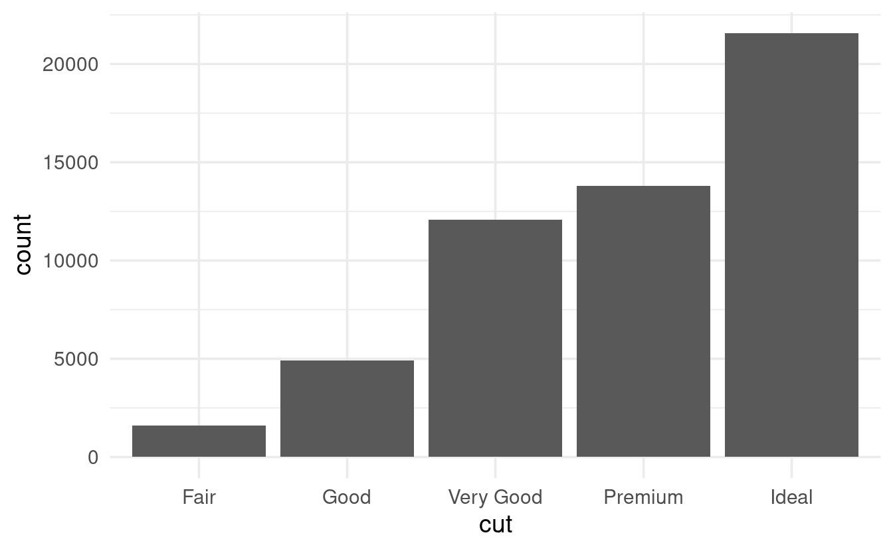
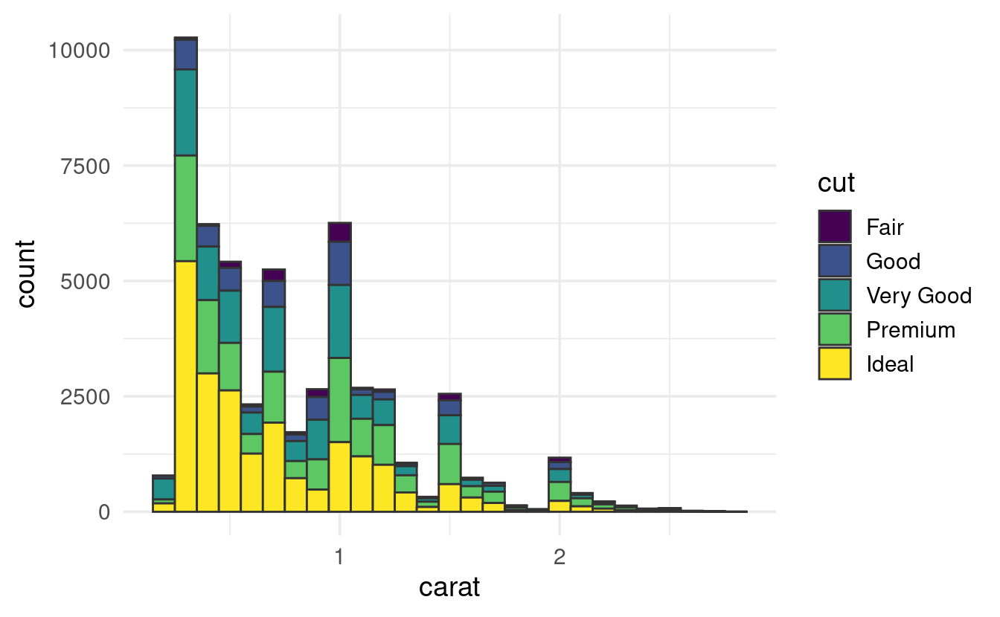
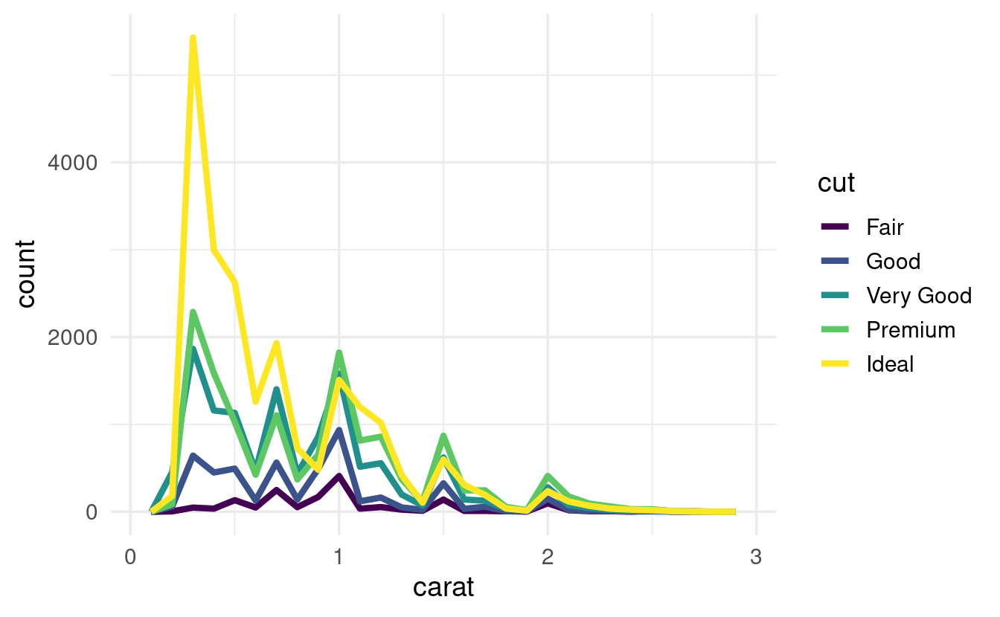
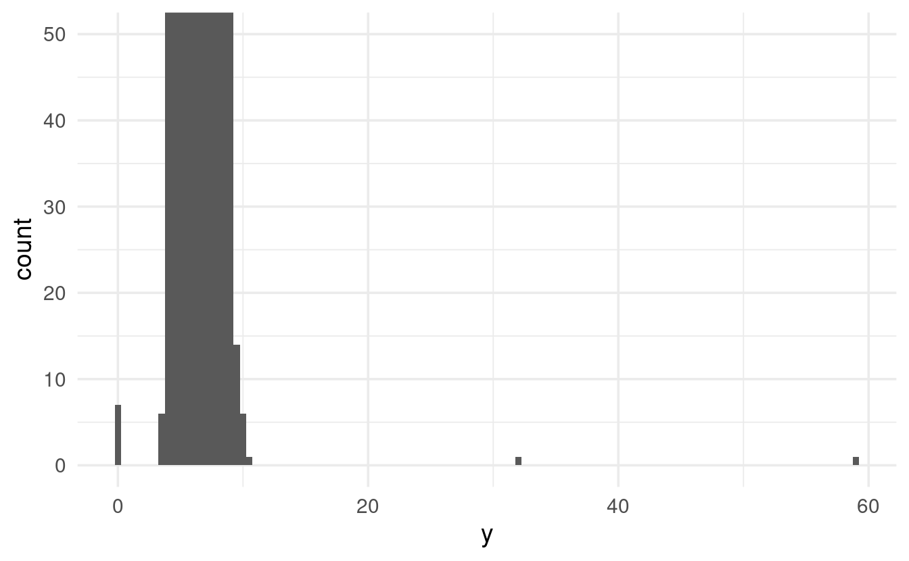
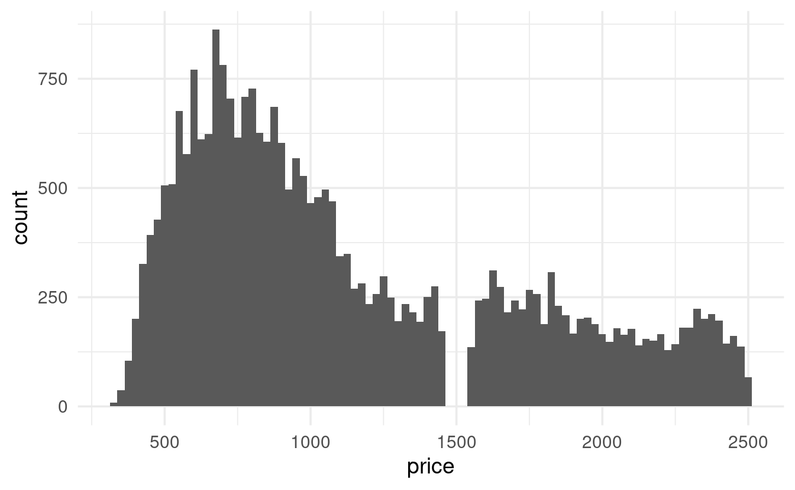
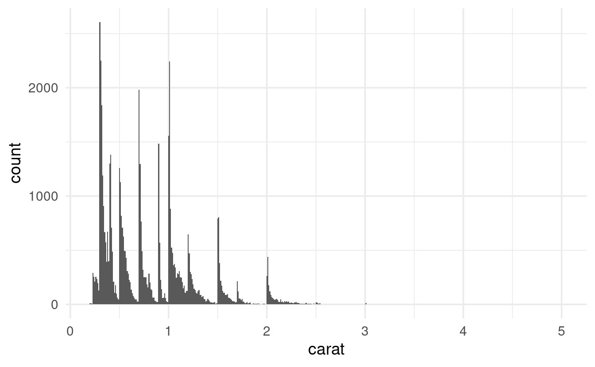
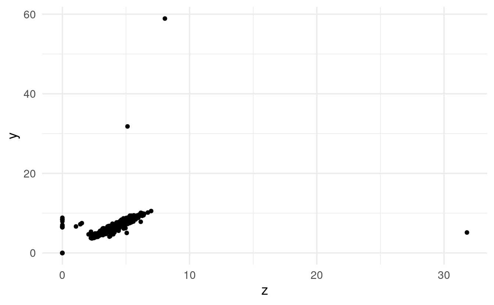
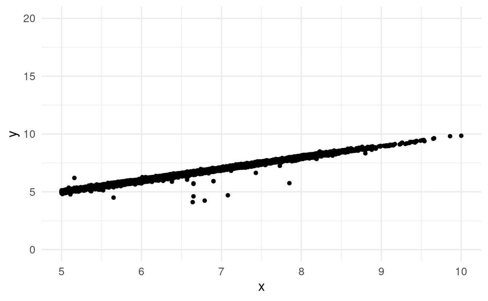
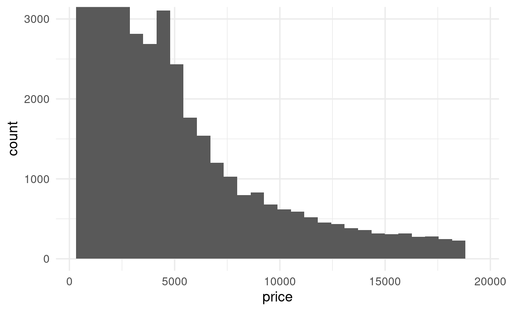
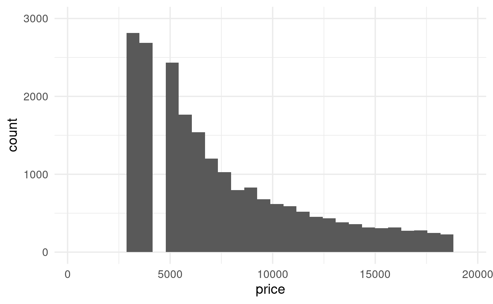

------------------------------------------------------------------------

## Load packages

Today, we'll only need to load the *tidyverse*, as we'll work with datasets that are automatically loaded along with it.

<pre class='chroma'><code class='language-r' data-lang='r'>## You only need to install if you haven't previously done so
# install.packages("tidyverse")

<a href='https://rdrr.io/r/base/library.html'>library</a>(<a href='https://tidyverse.tidyverse.org'>tidyverse</a>)</code></pre>

We'll mostly explore the `diamonds` dataset, so let's take a quick look at it before we begin:

<pre class='chroma'><code class='language-r' data-lang='r'><a href='https://rdrr.io/r/utils/head.html'>head</a>(diamonds)
#&gt; # A tibble: 6 × 10
#&gt;   carat cut       color clarity depth table price     x     y     z
#&gt;   &lt;dbl&gt; &lt;ord&gt;     &lt;ord&gt; &lt;ord&gt;   &lt;dbl&gt; &lt;dbl&gt; &lt;int&gt; &lt;dbl&gt; &lt;dbl&gt; &lt;dbl&gt;
#&gt; 1  0.23 Ideal     E     SI2      61.5    55   326  3.95  3.98  2.43
#&gt; 2  0.21 Premium   E     SI1      59.8    61   326  3.89  3.84  2.31
#&gt; 3  0.23 Good      E     VS1      56.9    65   327  4.05  4.07  2.31
#&gt; 4  0.29 Premium   I     VS2      62.4    58   334  4.2   4.23  2.63
#&gt; 5  0.31 Good      J     SI2      63.3    58   335  4.34  4.35  2.75
#&gt; 6  0.24 Very Good J     VVS2     62.8    57   336  3.94  3.96  2.48</code></pre>

On each row, we have information about one individual diamond, such as its `carat` and `price`. Note that `x`, `y`, and `z` represent the diamond's length, width, and depth, respectively.

Since we'll be making a bunch of plots with ggplot2, let's use the following trick to set an overarching "theme" for all plots that is a little better-looking than the default one:

<pre class='chroma'><code class='language-r' data-lang='r'># This changes two things:
# - theme_minimal() gives an overall different look, with a white background
# - base_size = 14 will make the text relatively bigger
<a href='https://ggplot2.tidyverse.org/reference/theme_get.html'>theme_set</a>(<a href='https://ggplot2.tidyverse.org/reference/ggtheme.html'>theme_minimal</a>(base_size = 14))</code></pre>

 

------------------------------------------------------------------------

## Chapter 7.3: Variation

### Exploring variation in a categorical variable

Let's say we want to see how many diamonds there are for each value of `cut`. When we printed the first lines of the dataframe above, we could see that `cut` has values like `Ideal`, `Premium`, and `Good`: this is therefore a "categorical" and not a "continuous" variable.

We could also see that the data type indication for `cut` was `<ord>`, which is short for *ordered factor*. In R, categorical variables can be represented not just as character strings or integers, but also as **factors**. Factors have a defined set of *levels* (e.g. the levels `Ideal` or `Premium` for the factor `cut`), and those levels can be given a custom order. That is handy when plotting or when you need to set a reference level in a model.

To quickly see all values that `cut` can take on, and their frequencies, we can use the [`count()`](https://dplyr.tidyverse.org/reference/count.html) function that we've previously seen:

<pre class='chroma'><code class='language-r' data-lang='r'>diamonds <a href='https://magrittr.tidyverse.org/reference/pipe.html'>%&gt;%</a> <a href='https://dplyr.tidyverse.org/reference/count.html'>count</a>(cut)
#&gt; # A tibble: 5 × 2
#&gt;   cut           n
#&gt;   &lt;ord&gt;     &lt;int&gt;
#&gt; 1 Fair       1610
#&gt; 2 Good       4906
#&gt; 3 Very Good 12082
#&gt; 4 Premium   13791
#&gt; 5 Ideal     21551</code></pre>

Making a barplot of different `cut` frequencies might also be useful. Recall that when making a plot with *ggplot2*, we at least need the following components:

-   The [`ggplot()`](https://ggplot2.tidyverse.org/reference/ggplot.html) function, in which we supply the dataframe that we want to use.

-   A *geom* function, which is basically the type of plot we want to make, such as [`geom_point()`](https://ggplot2.tidyverse.org/reference/geom_point.html) for a scatterplot and [`geom_bar()`](https://ggplot2.tidyverse.org/reference/geom_bar.html) for a barplot.

-   An "aesthetic mapping" that defines which variables (columns) to plot along the x-axis, y-axis, and/or to map colors or shapes too.

For a barplot showing `cut`, our ggplot code would look as follows:

<pre class='chroma'><code class='language-r' data-lang='r'><a href='https://ggplot2.tidyverse.org/reference/ggplot.html'>ggplot</a>(data = diamonds) +
  <a href='https://ggplot2.tidyverse.org/reference/geom_bar.html'>geom_bar</a>(mapping = <a href='https://ggplot2.tidyverse.org/reference/aes.html'>aes</a>(x = cut))
</code></pre>

We typically specify what should go along the y-axis, too, when making plots. But that is not the case for bar plots, where the default is to plot a *count which is computed from the data*.

 

### Exploring variation in a continuous variable

To explore variation in a continuous variable like `carat`, a histogram is a classic approach -- we can make one using [`geom_histogram()`](https://ggplot2.tidyverse.org/reference/geom_histogram.html):

<pre class='chroma'><code class='language-r' data-lang='r'><a href='https://ggplot2.tidyverse.org/reference/ggplot.html'>ggplot</a>(data = diamonds) +
  <a href='https://ggplot2.tidyverse.org/reference/geom_histogram.html'>geom_histogram</a>(mapping = <a href='https://ggplot2.tidyverse.org/reference/aes.html'>aes</a>(x = carat))
</code></pre>

Under the hood, a histogram discretized the continuous data into bins, and then shows the counts (here: number of diamonds) in each bin. We may want to play around with the width of the bins (and thus of the bars) to see more fine-grained or coarse-grained patterns, and can do so using the `binwidth` argument:

<pre class='chroma'><code class='language-r' data-lang='r'><a href='https://ggplot2.tidyverse.org/reference/ggplot.html'>ggplot</a>(data = diamonds) +
  <a href='https://ggplot2.tidyverse.org/reference/geom_histogram.html'>geom_histogram</a>(mapping = <a href='https://ggplot2.tidyverse.org/reference/aes.html'>aes</a>(x = carat), binwidth = 0.5)
</code></pre>

If we wanted to see this kind of representation in table-form, we can use the ggplot2 function `cut_width`, in which the `width` argument does the same thing as `geom_histogram`'s `binwidth`:

<pre class='chroma'><code class='language-r' data-lang='r'>diamonds <a href='https://magrittr.tidyverse.org/reference/pipe.html'>%&gt;%</a>
  <a href='https://dplyr.tidyverse.org/reference/mutate.html'>mutate</a>(carat_discrete = <a href='https://ggplot2.tidyverse.org/reference/cut_interval.html'>cut_width</a>(carat, width = 0.5)) <a href='https://magrittr.tidyverse.org/reference/pipe.html'>%&gt;%</a>
  <a href='https://dplyr.tidyverse.org/reference/count.html'>count</a>(carat_discrete)
#&gt; # A tibble: 11 × 2
#&gt;    carat_discrete     n
#&gt;    &lt;fct&gt;          &lt;int&gt;
#&gt;  1 [-0.25,0.25]     785
#&gt;  2 (0.25,0.75]    29498
#&gt;  3 (0.75,1.25]    15977
#&gt;  4 (1.25,1.75]     5313
#&gt;  5 (1.75,2.25]     2002
#&gt;  6 (2.25,2.75]      322
#&gt;  7 (2.75,3.25]       32
#&gt;  8 (3.25,3.75]        5
#&gt;  9 (3.75,4.25]        4
#&gt; 10 (4.25,4.75]        1
#&gt; 11 (4.75,5.25]        1</code></pre>

<pre class='chroma'><code class='language-r' data-lang='r'># Or the same thing more concisely:
diamonds <a href='https://magrittr.tidyverse.org/reference/pipe.html'>%&gt;%</a> <a href='https://dplyr.tidyverse.org/reference/count.html'>count</a>(<a href='https://ggplot2.tidyverse.org/reference/cut_interval.html'>cut_width</a>(carat, width = 0.5))</code></pre>

If we want to show the variation for different levels of `cut` separately but all in one graph, we can simply provide a variable to map to `fill`, which is the fill color of the bars:

<pre class='chroma'><code class='language-r' data-lang='r'>smaller &lt;- diamonds <a href='https://magrittr.tidyverse.org/reference/pipe.html'>%&gt;%</a> <a href='https://dplyr.tidyverse.org/reference/filter.html'>filter</a>(carat &lt; 3)

<a href='https://ggplot2.tidyverse.org/reference/ggplot.html'>ggplot</a>(data = smaller,
       mapping = <a href='https://ggplot2.tidyverse.org/reference/aes.html'>aes</a>(x = carat, fill = cut)) +
  <a href='https://ggplot2.tidyverse.org/reference/geom_histogram.html'>geom_histogram</a>(binwidth = 0.1, color = "grey20")
</code></pre>

Though in such cases, a linegraph with [`geom_freqpoly()`](https://ggplot2.tidyverse.org/reference/geom_histogram.html) might be easier to interpret:

<pre class='chroma'><code class='language-r' data-lang='r'><a href='https://ggplot2.tidyverse.org/reference/ggplot.html'>ggplot</a>(data = smaller,
       mapping = <a href='https://ggplot2.tidyverse.org/reference/aes.html'>aes</a>(x = carat, colour = cut)) +
  <a href='https://ggplot2.tidyverse.org/reference/geom_histogram.html'>geom_freqpoly</a>(binwidth = 0.1, size = 1.5)
</code></pre>

### Unusual values

Sometimes a histogram may have very wide axis limits, but there are no visible bars on the sides:

<pre class='chroma'><code class='language-r' data-lang='r'><a href='https://ggplot2.tidyverse.org/reference/ggplot.html'>ggplot</a>(diamonds) + 
  <a href='https://ggplot2.tidyverse.org/reference/geom_histogram.html'>geom_histogram</a>(mapping = <a href='https://ggplot2.tidyverse.org/reference/aes.html'>aes</a>(x = y), binwidth = 0.5)
</code></pre>

The x-axis limits are automatically picked based on the data, so there should be some values all the way up to about 60. But since the y-axis scale goes all the way up to 12 thousand, a count of 1 and perhaps even 10 or more would probably not be visible. To see these counts in the graph, we could *zoom in* on the y-axis with [`coord_cartesian()`](https://ggplot2.tidyverse.org/reference/coord_cartesian.html):

<pre class='chroma'><code class='language-r' data-lang='r'><a href='https://ggplot2.tidyverse.org/reference/ggplot.html'>ggplot</a>(diamonds) + 
  <a href='https://ggplot2.tidyverse.org/reference/geom_histogram.html'>geom_histogram</a>(mapping = <a href='https://ggplot2.tidyverse.org/reference/aes.html'>aes</a>(x = y), binwidth = 0.5) +
  <a href='https://ggplot2.tidyverse.org/reference/coord_cartesian.html'>coord_cartesian</a>(ylim = <a href='https://rdrr.io/r/base/c.html'>c</a>(0, 50)) # c(&lt;lower-limit&gt;, &lt;upper-limit&gt;)
</code></pre>

Note that in *ggplot2*, zooming in on a graph and setting axis limits isn't the same thing: you'll learn more about that in the exercises.

Of course we could also try to find these values in the dataframe itself, which might be more useful than a graph in cases like this. To do so, we can use the [`filter()`](https://dplyr.tidyverse.org/reference/filter.html) function we learned about in the previous chapter:

<pre class='chroma'><code class='language-r' data-lang='r'>diamonds <a href='https://magrittr.tidyverse.org/reference/pipe.html'>%&gt;%</a> <a href='https://dplyr.tidyverse.org/reference/filter.html'>filter</a>(y &lt; 3 | y &gt; 20)
#&gt; # A tibble: 9 × 10
#&gt;   carat cut       color clarity depth table price     x     y     z
#&gt;   &lt;dbl&gt; &lt;ord&gt;     &lt;ord&gt; &lt;ord&gt;   &lt;dbl&gt; &lt;dbl&gt; &lt;int&gt; &lt;dbl&gt; &lt;dbl&gt; &lt;dbl&gt;
#&gt; 1  1    Very Good H     VS2      63.3    53  5139  0      0    0   
#&gt; 2  1.14 Fair      G     VS1      57.5    67  6381  0      0    0   
#&gt; 3  2    Premium   H     SI2      58.9    57 12210  8.09  58.9  8.06
#&gt; 4  1.56 Ideal     G     VS2      62.2    54 12800  0      0    0   
#&gt; 5  1.2  Premium   D     VVS1     62.1    59 15686  0      0    0   
#&gt; 6  2.25 Premium   H     SI2      62.8    59 18034  0      0    0   
#&gt; 7  0.51 Ideal     E     VS1      61.8    55  2075  5.15  31.8  5.12
#&gt; 8  0.71 Good      F     SI2      64.1    60  2130  0      0    0   
#&gt; 9  0.71 Good      F     SI2      64.1    60  2130  0      0    0</code></pre>

 

------------------------------------------------------------------------

## Breakout Rooms

These exercises will continue to use the `diamonds` data, which is automatically loaded when you load the *tidyverse*.

### Exercise 1

In the `diamonds` data, explore the distribution of `price`, which is the price of a diamond in USD. Do you discover anything unusual or surprising?

Make sure to try different values for the `binwidth` argument!

<b>Hints</b> (click here)

 

-   This is a continuous variable, so use [`geom_histogram()`](https://ggplot2.tidyverse.org/reference/geom_histogram.html).

-   A more fine-grained plot (smaller bins with `binwidth`) than the default should reveal something odd.

-   You might want to use [`coord_cartesian()`](https://ggplot2.tidyverse.org/reference/coord_cartesian.html) to see the area with the odd pattern in more detail. (Alternatively, you could try [`filter()`](https://dplyr.tidyverse.org/reference/filter.html)ing the data before plotting.)

 

<b>Solution</b> (click here)

 

-   [`geom_histogram()`](https://ggplot2.tidyverse.org/reference/geom_histogram.html) with default settings doesn't reveal anything too weird, except perhaps the bump just below 5,000:

<pre class='chroma'><code class='language-r' data-lang='r'><a href='https://ggplot2.tidyverse.org/reference/ggplot.html'>ggplot</a>(data = diamonds,
       mapping = <a href='https://ggplot2.tidyverse.org/reference/aes.html'>aes</a>(x = price)) +
  <a href='https://ggplot2.tidyverse.org/reference/geom_histogram.html'>geom_histogram</a>()
</code></pre>

-   But with a binwidth of e.g. 100, we start to see something odd: a gap in the distribution.

<pre class='chroma'><code class='language-r' data-lang='r'><a href='https://ggplot2.tidyverse.org/reference/ggplot.html'>ggplot</a>(data = diamonds,
       mapping = <a href='https://ggplot2.tidyverse.org/reference/aes.html'>aes</a>(x = price)) +
  <a href='https://ggplot2.tidyverse.org/reference/geom_histogram.html'>geom_histogram</a>(binwidth = 100)
</code></pre>

-   Let's take a closer look by zooming in on prices of \$2,500 or less:

<pre class='chroma'><code class='language-r' data-lang='r'>diamonds <a href='https://magrittr.tidyverse.org/reference/pipe.html'>%&gt;%</a>
  <a href='https://ggplot2.tidyverse.org/reference/ggplot.html'>ggplot</a>(mapping = <a href='https://ggplot2.tidyverse.org/reference/aes.html'>aes</a>(x = price)) +
  <a href='https://ggplot2.tidyverse.org/reference/geom_histogram.html'>geom_histogram</a>(binwidth = 25) +
  <a href='https://ggplot2.tidyverse.org/reference/coord_cartesian.html'>coord_cartesian</a>(xlim = <a href='https://rdrr.io/r/base/c.html'>c</a>(0, 2500))
</code></pre>

(An alternative approach would be to filter the data before plotting:)

<pre class='chroma'><code class='language-r' data-lang='r'>diamonds <a href='https://magrittr.tidyverse.org/reference/pipe.html'>%&gt;%</a>
  <a href='https://dplyr.tidyverse.org/reference/filter.html'>filter</a>(price &lt; 2500) <a href='https://magrittr.tidyverse.org/reference/pipe.html'>%&gt;%</a> 
  <a href='https://ggplot2.tidyverse.org/reference/ggplot.html'>ggplot</a>(mapping = <a href='https://ggplot2.tidyverse.org/reference/aes.html'>aes</a>(x = price)) +
  <a href='https://ggplot2.tidyverse.org/reference/geom_histogram.html'>geom_histogram</a>(binwidth = 25)</code></pre>

 

### Exercise 2

Compare [`coord_cartesian()`](https://ggplot2.tidyverse.org/reference/coord_cartesian.html) vs the superficially similar [`lims()`](https://ggplot2.tidyverse.org/reference/lims.html) when zooming in vertically on a histogram. Specifically, make two histograms of `price` with a y-axis that only goes up to 3000: one with `coord_cartesian(ylim = ...)` and one with `lims(y = ...)`.

What is happening in the graph made with [`lims()`](https://ggplot2.tidyverse.org/reference/lims.html)? (See the hint for example usage of [`lims()`](https://ggplot2.tidyverse.org/reference/lims.html), a function we haven't seen yet.)

<b>Hints</b> (click here)

 

You can use `lims` to set arbitrary axis limits:

<pre class='chroma'><code class='language-r' data-lang='r'><a href='https://ggplot2.tidyverse.org/reference/ggplot.html'>ggplot</a>(diamonds) +
  <a href='https://ggplot2.tidyverse.org/reference/geom_point.html'>geom_point</a>(mapping = <a href='https://ggplot2.tidyverse.org/reference/aes.html'>aes</a>(x = x, y = y)) +
  <a href='https://ggplot2.tidyverse.org/reference/lims.html'>lims</a>(x = <a href='https://rdrr.io/r/base/c.html'>c</a>(5, 10),   # c(&lt;lower-limit&gt;, &lt;upper-limit&gt;)
       y = <a href='https://rdrr.io/r/base/c.html'>c</a>(0, 20))   # c(&lt;lower-limit&gt;, &lt;upper-limit&gt;)
#&gt; Warning: Removed 17593 rows containing missing values (geom_point).</code></pre>

(Whereas with default axis limits, the plot would look like this:)

<pre class='chroma'><code class='language-r' data-lang='r'><a href='https://ggplot2.tidyverse.org/reference/ggplot.html'>ggplot</a>(diamonds) +
  <a href='https://ggplot2.tidyverse.org/reference/geom_point.html'>geom_point</a>(mapping = <a href='https://ggplot2.tidyverse.org/reference/aes.html'>aes</a>(x = x, y = y))
</code></pre>

 

<b>Solution</b> (click here)

 

Whereas the graph produced with [`coord_cartesian()`](https://ggplot2.tidyverse.org/reference/coord_cartesian.html) is simply "cut off" at the specified limit, the graph produced with [`lims()`](https://ggplot2.tidyverse.org/reference/lims.html) is missing bars!

It turns out that *ggplot2* removes the bars that can't be shown given our y-limit. Notice that it warns us about doing so: `#> Warning: Removed 5 rows containing missing values (geom_bar).`

<pre class='chroma'><code class='language-r' data-lang='r'><a href='https://ggplot2.tidyverse.org/reference/ggplot.html'>ggplot</a>(diamonds) +
  <a href='https://ggplot2.tidyverse.org/reference/geom_histogram.html'>geom_histogram</a>(mapping = <a href='https://ggplot2.tidyverse.org/reference/aes.html'>aes</a>(x = price)) +
  <a href='https://ggplot2.tidyverse.org/reference/coord_cartesian.html'>coord_cartesian</a>(ylim = <a href='https://rdrr.io/r/base/c.html'>c</a>(0, 3000))
</code></pre>

<pre class='chroma'><code class='language-r' data-lang='r'><a href='https://ggplot2.tidyverse.org/reference/ggplot.html'>ggplot</a>(diamonds) +
  <a href='https://ggplot2.tidyverse.org/reference/geom_histogram.html'>geom_histogram</a>(mapping = <a href='https://ggplot2.tidyverse.org/reference/aes.html'>aes</a>(x = price)) +
  <a href='https://ggplot2.tidyverse.org/reference/lims.html'>lims</a>(y = <a href='https://rdrr.io/r/base/c.html'>c</a>(0, 3000))
#&gt; Warning: Removed 5 rows containing missing values (geom_bar).</code></pre>

 

### Exercise 3

Using scatterplots, explore the relationship between the depth `y` and the width `z` of the diamonds.

What do you think about the outliers? Are they more likely to be unusual diamonds or data entry errors?

<b>Hints</b> (click here)

 

-   Make a scatterplot with [`geom_point()`](https://ggplot2.tidyverse.org/reference/geom_point.html).

-   Zoom in on the area with most points, to get a better feel for the overall relationship between `y` and `z`.

-   Could a diamond with a value of `y` larger than 20 just be a very large diamond? Or does the corresponding value for `z`, and the overall relationship between `y` and `z` make it more likely that they are outliers?

 

<b>Solution</b> (click here)

 

Let's start with a simple scatterplot with all data and default axis limits:

<pre class='chroma'><code class='language-r' data-lang='r'><a href='https://ggplot2.tidyverse.org/reference/ggplot.html'>ggplot</a>(data = diamonds,
       mapping = <a href='https://ggplot2.tidyverse.org/reference/aes.html'>aes</a>(x = z, y = y)) +
  <a href='https://ggplot2.tidyverse.org/reference/geom_point.html'>geom_point</a>()
</code></pre>

Phew! There are definitely some striking outliers. Let's zoom in on the main cloud of points:

<pre class='chroma'><code class='language-r' data-lang='r'><a href='https://ggplot2.tidyverse.org/reference/ggplot.html'>ggplot</a>(data = diamonds,
       mapping = <a href='https://ggplot2.tidyverse.org/reference/aes.html'>aes</a>(x = z, y = y)) +
  <a href='https://ggplot2.tidyverse.org/reference/geom_point.html'>geom_point</a>() +
  <a href='https://ggplot2.tidyverse.org/reference/coord_cartesian.html'>coord_cartesian</a>(xlim = <a href='https://rdrr.io/r/base/c.html'>c</a>(0, 10), ylim = <a href='https://rdrr.io/r/base/c.html'>c</a>(0, 15))
</code></pre>

That looks like an overall very tight correlation between width (`y`) and depth (`z`).

Therefore, the outliers of `y` and `z` don't just seem to represent very large or very small diamonds, and are likely data entry errors or something along those lines.

 

### Exercise 4 (bonus)

Explore the distribution of `carat`. Specifically, compare the number of diamonds of 0.99 (and a little less) carat and those of 1 (and a little more) carat? What do you think is the cause of the difference?

<b>Hints</b> (click here)

 

-   Make a histogram ([`geom_histogram()`](https://ggplot2.tidyverse.org/reference/geom_histogram.html)) for `carat`, and optionally zoom in to the area around 1.

-   Use [`filter()`](https://dplyr.tidyverse.org/reference/filter.html) and [`count()`](https://dplyr.tidyverse.org/reference/count.html) to specifically check out the diamond counts with a carat of around 1.

 

<b>Solution</b> (click here)

 

We can start by simply making a histogram for `carat`:

<pre class='chroma'><code class='language-r' data-lang='r'><a href='https://ggplot2.tidyverse.org/reference/ggplot.html'>ggplot</a>(data = diamonds,
       mapping = <a href='https://ggplot2.tidyverse.org/reference/aes.html'>aes</a>(x = carat)) +
  <a href='https://ggplot2.tidyverse.org/reference/geom_histogram.html'>geom_histogram</a>(binwidth = 0.01)
</code></pre>

That's a weird pattern, with a bunch of peaks and valleys! Let's just show the area around a carat of `1`:

<pre class='chroma'><code class='language-r' data-lang='r'>diamonds <a href='https://magrittr.tidyverse.org/reference/pipe.html'>%&gt;%</a>
  <a href='https://dplyr.tidyverse.org/reference/filter.html'>filter</a>(carat &gt; 0.9, carat &lt; 1.1) <a href='https://magrittr.tidyverse.org/reference/pipe.html'>%&gt;%</a>
  <a href='https://ggplot2.tidyverse.org/reference/ggplot.html'>ggplot</a>(mapping = <a href='https://ggplot2.tidyverse.org/reference/aes.html'>aes</a>(x = carat)) +
  <a href='https://ggplot2.tidyverse.org/reference/geom_histogram.html'>geom_histogram</a>(binwidth = 0.01)
</code></pre>

There's clearly a big uptick around `1`, but checking out the raw counts would make it easier to answer the original question:

<pre class='chroma'><code class='language-r' data-lang='r'>diamonds <a href='https://magrittr.tidyverse.org/reference/pipe.html'>%&gt;%</a>
  <a href='https://dplyr.tidyverse.org/reference/filter.html'>filter</a>(carat &gt; 0.9, carat &lt; 1.1) <a href='https://magrittr.tidyverse.org/reference/pipe.html'>%&gt;%</a>
  <a href='https://dplyr.tidyverse.org/reference/count.html'>count</a>(carat)
#&gt; # A tibble: 19 × 2
#&gt;    carat     n
#&gt;    &lt;dbl&gt; &lt;int&gt;
#&gt;  1  0.91   570
#&gt;  2  0.92   226
#&gt;  3  0.93   142
#&gt;  4  0.94    59
#&gt;  5  0.95    65
#&gt;  6  0.96   103
#&gt;  7  0.97    59
#&gt;  8  0.98    31
#&gt;  9  0.99    23
#&gt; 10  1     1558
#&gt; 11  1.01  2242
#&gt; 12  1.02   883
#&gt; 13  1.03   523
#&gt; 14  1.04   475
#&gt; 15  1.05   361
#&gt; 16  1.06   373
#&gt; 17  1.07   342
#&gt; 18  1.08   246
#&gt; 19  1.09   287</code></pre>

There are suspiciously few diamonds with a carat of 0.99 (and, to a lesser extent, with a carat anywhere above 0.9): could there be some rounding-up going on?

------------------------------------------------------------------------

## Chapter 7.4: Missing values

### Removing outliers

If you've established that certain outliers are untrustworthy and want to get rid of them, you have two main options.

First, you could remove the rows (diamonds) with outliers:

<pre class='chroma'><code class='language-r' data-lang='r'>diamonds2 &lt;- diamonds <a href='https://magrittr.tidyverse.org/reference/pipe.html'>%&gt;%</a>
  <a href='https://dplyr.tidyverse.org/reference/filter.html'>filter</a>(y &gt; 3, y &lt; 20)</code></pre>

But you may not want throw out rows in their entirety, because the other values might be valid and are still valuable. In that case, you can set outliers to `NA` (missing value), and a convenient way to do that is with the [`ifelse()`](https://rdrr.io/r/base/ifelse.html) function. To understand [`ifelse()`](https://rdrr.io/r/base/ifelse.html), a simple example may help:

<pre class='chroma'><code class='language-r' data-lang='r'># Create a vector with integers from 1 to 10:
x &lt;- 1:10
x
#&gt;  [1]  1  2  3  4  5  6  7  8  9 10</code></pre>

<pre class='chroma'><code class='language-r' data-lang='r'># This will return a logical vector, indicating, for each value,
# whether it is smaller than 5:
x &lt; 5
#&gt;  [1]  TRUE  TRUE  TRUE  TRUE FALSE FALSE FALSE FALSE FALSE FALSE</code></pre>

<pre class='chroma'><code class='language-r' data-lang='r'># We can turn the small values into NAs, and leave big values unchanged, as follows:
<a href='https://rdrr.io/r/base/ifelse.html'>ifelse</a>(test = x &lt; 5, yes = NA, no = 10)
#&gt;  [1] NA NA NA NA 10 10 10 10 10 10</code></pre>

In case of the diamonds, we can use this function as follows to turn `y` outliers into `NA`s:

<pre class='chroma'><code class='language-r' data-lang='r'>diamonds2 &lt;- diamonds <a href='https://magrittr.tidyverse.org/reference/pipe.html'>%&gt;%</a>
  <a href='https://dplyr.tidyverse.org/reference/mutate.html'>mutate</a>(y = <a href='https://rdrr.io/r/base/ifelse.html'>ifelse</a>(test = y &lt; 3 | y &gt; 20, yes = NA, no = y))</code></pre>

### Comparing observations with and without missing data

Sometimes you may want to compare distributions among observations with and without missing values. To do that, we can create a new variable that indicates whether a value is missing or not, and map (for example) `color` to this variable:

<pre class='chroma'><code class='language-r' data-lang='r'>nycflights13::<a href='https://rdrr.io/pkg/nycflights13/man/flights.html'>flights</a> <a href='https://magrittr.tidyverse.org/reference/pipe.html'>%&gt;%</a> 
  <a href='https://dplyr.tidyverse.org/reference/mutate.html'>mutate</a>(cancelled = <a href='https://rdrr.io/r/base/NA.html'>is.na</a>(dep_time)) <a href='https://magrittr.tidyverse.org/reference/pipe.html'>%&gt;%</a> 
  <a href='https://ggplot2.tidyverse.org/reference/ggplot.html'>ggplot</a>(mapping = <a href='https://ggplot2.tidyverse.org/reference/aes.html'>aes</a>(x = sched_dep_time, color = cancelled)) +
  <a href='https://ggplot2.tidyverse.org/reference/geom_histogram.html'>geom_freqpoly</a>(binwidth = 100)
</code></pre>

However, the large difference in the absolute counts of cancelled versus not-cancelled flights makes it hard to see relative differences along the x-axis.

We can use [`geom_density()`](https://ggplot2.tidyverse.org/reference/geom_density.html) to produce a density plot, where the height of the lines is only determined by the relative counts, and where we can see if cancelled flights have a different distribution:

<pre class='chroma'><code class='language-r' data-lang='r'>nycflights13::<a href='https://rdrr.io/pkg/nycflights13/man/flights.html'>flights</a> <a href='https://magrittr.tidyverse.org/reference/pipe.html'>%&gt;%</a> 
  <a href='https://dplyr.tidyverse.org/reference/mutate.html'>mutate</a>(cancelled = <a href='https://rdrr.io/r/base/NA.html'>is.na</a>(dep_time)) <a href='https://magrittr.tidyverse.org/reference/pipe.html'>%&gt;%</a> 
  <a href='https://ggplot2.tidyverse.org/reference/ggplot.html'>ggplot</a>(mapping = <a href='https://ggplot2.tidyverse.org/reference/aes.html'>aes</a>(x = sched_dep_time, color = cancelled)) + 
  <a href='https://ggplot2.tidyverse.org/reference/geom_density.html'>geom_density</a>()
</code></pre>

It looks like flights at the end of the day are much more commonly cancelled than those early on, which is what we might have expected!

 

