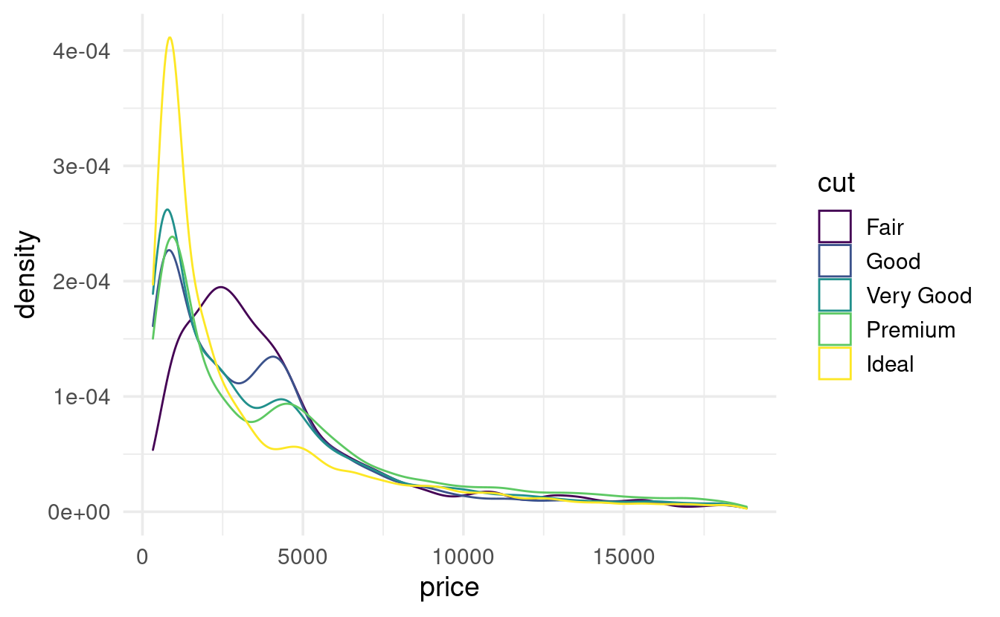
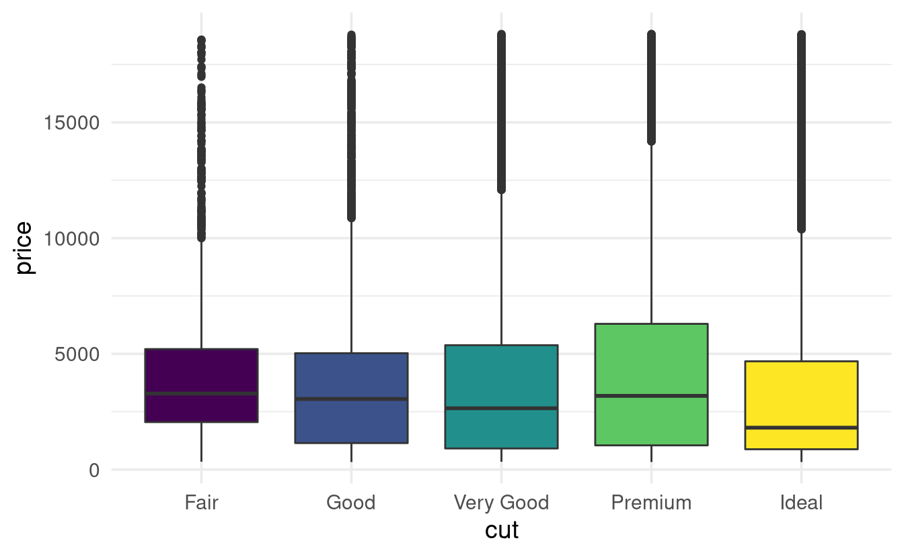
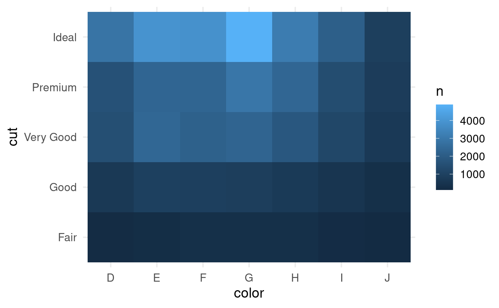
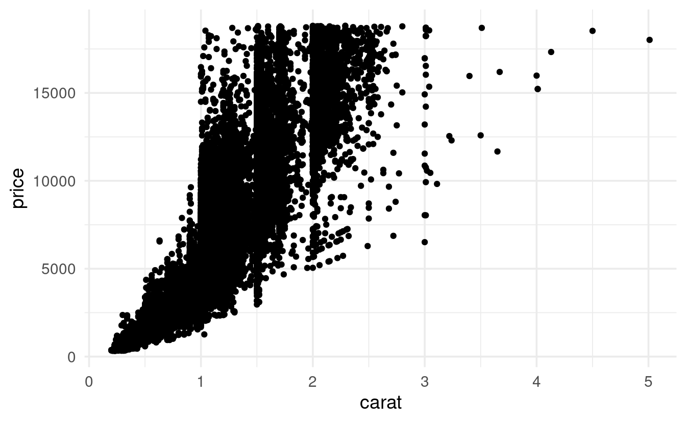
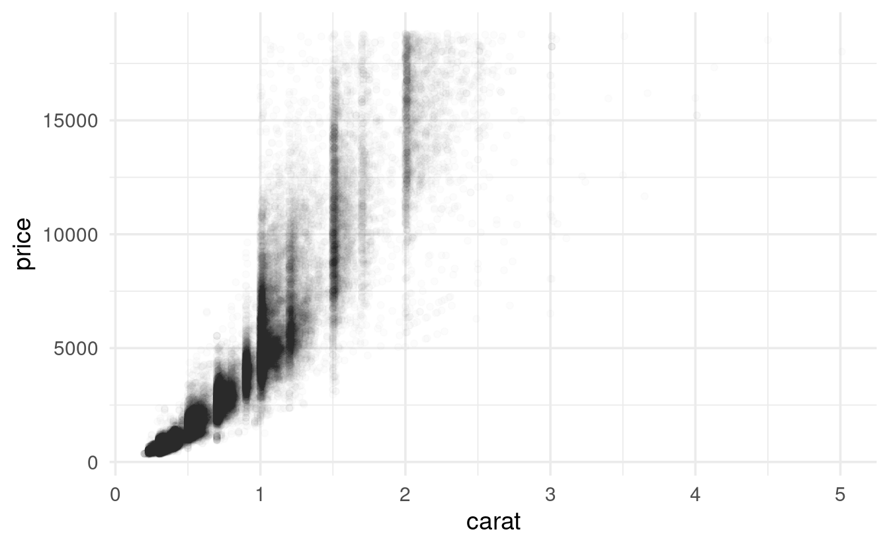
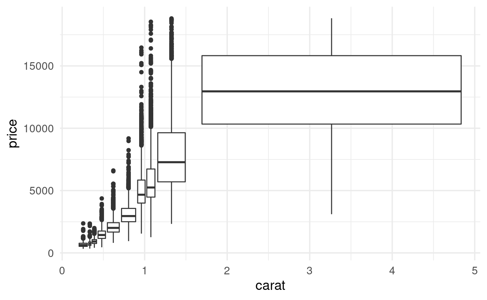
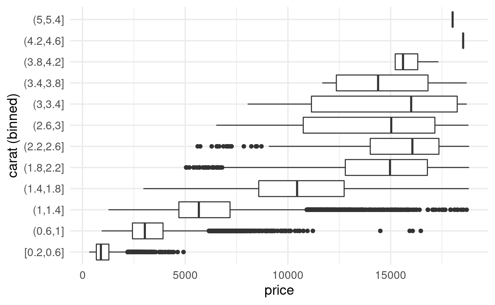
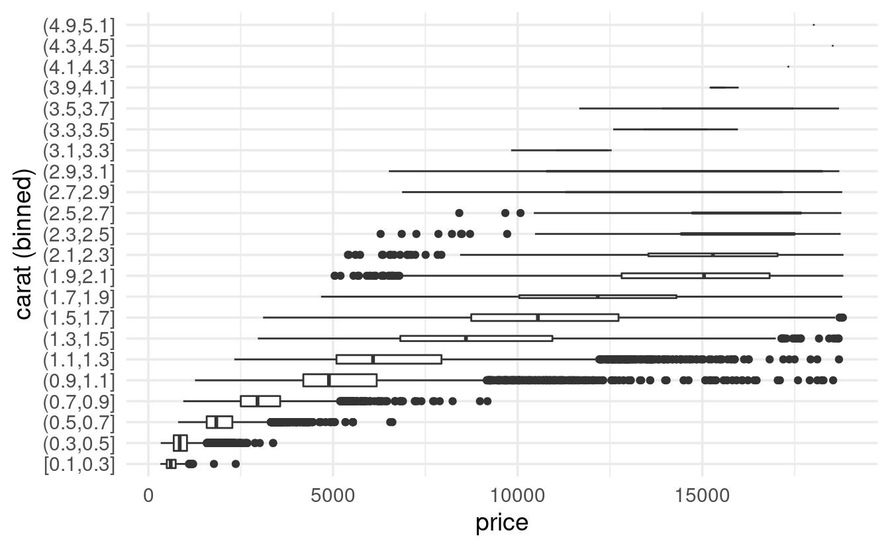
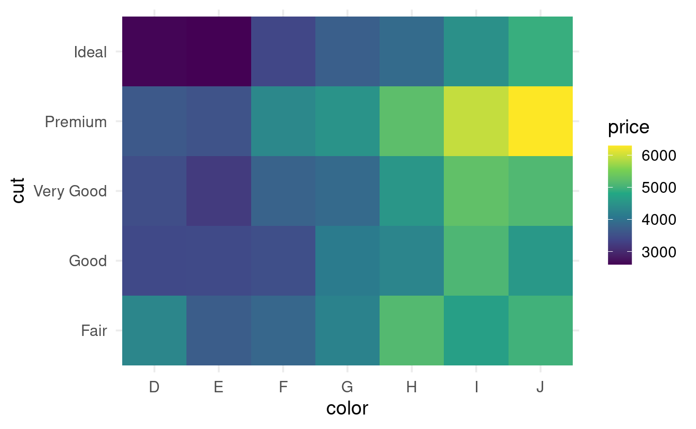

------------------------------------------------------------------------

## Setting up

Like last time, we'll mostly use *tidyverse* tools to explore the `diamonds` dataset, which is also part of the *tidyverse*.

We'll also have a quick look at the `flights` dataset, for which we'll need to load the *nycflights13* package:

<pre class='chroma'><code class='language-r' data-lang='r'>## You only need to install if you haven't previously done so
# install.packages("tidyverse")
# install.packages("nycflights13")

<a href='https://rdrr.io/r/base/library.html'>library</a>(<a href='https://tidyverse.tidyverse.org'>tidyverse</a>)
#&gt; ── Attaching packages ─────────────────────────────────────── tidyverse 1.3.2 ──
#&gt; ✔ ggplot2 3.3.6      ✔ purrr   0.3.5 
#&gt; ✔ tibble  3.1.8      ✔ dplyr   1.0.10
#&gt; ✔ tidyr   1.2.1      ✔ stringr 1.4.1 
#&gt; ✔ readr   2.1.3      ✔ forcats 0.5.2 
#&gt; ── Conflicts ────────────────────────────────────────── tidyverse_conflicts() ──
#&gt; ✖ dplyr::filter() masks stats::filter()
#&gt; ✖ dplyr::lag()    masks stats::lag()<a href='https://rdrr.io/r/base/library.html'>library</a>(<a href='https://github.com/hadley/nycflights13'>nycflights13</a>)</code></pre>

Let's again take a quick look at the `diamonds` dataset before we begin:

<pre class='chroma'><code class='language-r' data-lang='r'>diamonds
#&gt; # A tibble: 53,940 × 10
#&gt;    carat cut       color clarity depth table price     x     y     z
#&gt;    &lt;dbl&gt; &lt;ord&gt;     &lt;ord&gt; &lt;ord&gt;   &lt;dbl&gt; &lt;dbl&gt; &lt;int&gt; &lt;dbl&gt; &lt;dbl&gt; &lt;dbl&gt;
#&gt;  1  0.23 Ideal     E     SI2      61.5    55   326  3.95  3.98  2.43
#&gt;  2  0.21 Premium   E     SI1      59.8    61   326  3.89  3.84  2.31
#&gt;  3  0.23 Good      E     VS1      56.9    65   327  4.05  4.07  2.31
#&gt;  4  0.29 Premium   I     VS2      62.4    58   334  4.2   4.23  2.63
#&gt;  5  0.31 Good      J     SI2      63.3    58   335  4.34  4.35  2.75
#&gt;  6  0.24 Very Good J     VVS2     62.8    57   336  3.94  3.96  2.48
#&gt;  7  0.24 Very Good I     VVS1     62.3    57   336  3.95  3.98  2.47
#&gt;  8  0.26 Very Good H     SI1      61.9    55   337  4.07  4.11  2.53
#&gt;  9  0.22 Fair      E     VS2      65.1    61   337  3.87  3.78  2.49
#&gt; 10  0.23 Very Good H     VS1      59.4    61   338  4     4.05  2.39
#&gt; # … with 53,930 more rows</code></pre>

On each row, we have information about one individual diamond, such as its `carat` and `price` (`x`, `y`, and `z` represent the diamond's length, width, and depth, respectively.)

Finally, we'll again set a *ggplot2* "theme" that is a little better-looking than the default one (this setting will apply until you restart R/RStudio):

<pre class='chroma'><code class='language-r' data-lang='r'># This changes two things:
# - theme_minimal() gives an overall different look, with a white background
# - base_size = 14 will make the text relatively bigger
<a href='https://ggplot2.tidyverse.org/reference/theme_get.html'>theme_set</a>(<a href='https://ggplot2.tidyverse.org/reference/ggtheme.html'>theme_minimal</a>(base_size = 14))</code></pre>

 

------------------------------------------------------------------------

## Chapter 7.4: Missing values

### Removing outliers

Let's assume you have established that certain outlier values in your data are untrustworthy. For instance, see the plot below for the `diamonds` data, a scatterplot of diamond width (`y`) versus depth (`z`):

<pre class='chroma'><code class='language-r' data-lang='r'><a href='https://ggplot2.tidyverse.org/reference/ggplot.html'>ggplot</a>(data = diamonds,
       mapping = <a href='https://ggplot2.tidyverse.org/reference/aes.html'>aes</a>(x = z, y = y)) +
  <a href='https://ggplot2.tidyverse.org/reference/geom_point.html'>geom_point</a>()
</code></pre>

Three rather extreme outliers deviate not just in their absolute values, but also in their relative values: overall, depth and width are strongly correlated, yet the extremely large `z` value does not correspond to a large `y` value at all (and so on for the other outliers).

To get rid of outliers in your dataset, you have two main options. First, you could **completely remove rows that contain outliers**, for example with *dplyr*'s [`filter()`](https://dplyr.tidyverse.org/reference/filter.html) function:

<pre class='chroma'><code class='language-r' data-lang='r'># Remove rows for which column y is smaller than 3 or larger than 20: 
diamonds2 &lt;- diamonds <a href='https://magrittr.tidyverse.org/reference/pipe.html'>%&gt;%</a> <a href='https://dplyr.tidyverse.org/reference/filter.html'>filter</a>(y &lt; 3 | y &gt; 20)</code></pre>

But you may not want throw out entire rows, because the values for the *other variables* (columns) in these rows might be valid and valuable. Therefore, and alternative is to **convert outliers to `NA`s (missing values)**, and a convenient way to do that is with the [`ifelse()`](https://rdrr.io/r/base/ifelse.html) function:

<pre class='chroma'><code class='language-r' data-lang='r'>diamonds_no_outliers &lt;- diamonds <a href='https://magrittr.tidyverse.org/reference/pipe.html'>%&gt;%</a>
  <a href='https://dplyr.tidyverse.org/reference/mutate.html'>mutate</a>(y = <a href='https://rdrr.io/r/base/ifelse.html'>ifelse</a>(test = y &lt; 3 | y &gt; 20, yes = NA, no = y))</code></pre>

### More on `ifelse()`

To better understand [`ifelse()`](https://rdrr.io/r/base/ifelse.html), a simple example may help:

<pre class='chroma'><code class='language-r' data-lang='r'># Create a vector with integers from 1 to 10:
x &lt;- 1:10
x
#&gt;  [1]  1  2  3  4  5  6  7  8  9 10</code></pre>

<pre class='chroma'><code class='language-r' data-lang='r'># This will return a logical vector, indicating, for each value,
# whether it is smaller than 5:
x &lt; 5
#&gt;  [1]  TRUE  TRUE  TRUE  TRUE FALSE FALSE FALSE FALSE FALSE FALSE</code></pre>

<pre class='chroma'><code class='language-r' data-lang='r'># We can turn the small values into NAs, and leave big values unchanged, as follows:
<a href='https://rdrr.io/r/base/ifelse.html'>ifelse</a>(test = x &lt; 5, yes = NA, no = x)
#&gt;  [1] NA NA NA NA  5  6  7  8  9 10</code></pre>

### Comparing observations with and without missing data

It can be useful to compare distributions among observations with and without missing values. To do that, we can first create a new variable that indicates whether a value is missing or not. Then, we can map an aesthetic like `color` to this variable to show the two groups separately.

Below, we'll compare flights with and without missing values for departure time (`dep_time`), since the former are cancelled flights, using the geom `geom_freqpoly` that we also saw last time:

<pre class='chroma'><code class='language-r' data-lang='r'>flights <a href='https://magrittr.tidyverse.org/reference/pipe.html'>%&gt;%</a> 
  <a href='https://dplyr.tidyverse.org/reference/mutate.html'>mutate</a>(cancelled = <a href='https://rdrr.io/r/base/NA.html'>is.na</a>(dep_time)) <a href='https://magrittr.tidyverse.org/reference/pipe.html'>%&gt;%</a> 
  <a href='https://ggplot2.tidyverse.org/reference/ggplot.html'>ggplot</a>(mapping = <a href='https://ggplot2.tidyverse.org/reference/aes.html'>aes</a>(x = sched_dep_time, color = cancelled)) +
  <a href='https://ggplot2.tidyverse.org/reference/geom_histogram.html'>geom_freqpoly</a>(binwidth = 100) # (100 = 1 hour, so we plot by hour)
</code></pre>

However, the large difference in the absolute counts of cancelled versus not-cancelled flights makes it hard to see relative differences along the x-axis.

We can use [`geom_density()`](https://ggplot2.tidyverse.org/reference/geom_density.html) to produce a **density plot**, where the height of the lines is only determined by the relative counts, allowing us to see if cancelled flights have a different distribution:

<pre class='chroma'><code class='language-r' data-lang='r'>flights <a href='https://magrittr.tidyverse.org/reference/pipe.html'>%&gt;%</a> 
  <a href='https://dplyr.tidyverse.org/reference/mutate.html'>mutate</a>(cancelled = <a href='https://rdrr.io/r/base/NA.html'>is.na</a>(dep_time)) <a href='https://magrittr.tidyverse.org/reference/pipe.html'>%&gt;%</a> 
  <a href='https://ggplot2.tidyverse.org/reference/ggplot.html'>ggplot</a>(mapping = <a href='https://ggplot2.tidyverse.org/reference/aes.html'>aes</a>(x = sched_dep_time, color = cancelled)) + 
  <a href='https://ggplot2.tidyverse.org/reference/geom_density.html'>geom_density</a>()
</code></pre>

It looks like flights at the end of the day are much more commonly cancelled than those early on, which is what we might have expected!

 

------------------------------------------------------------------------

## Chapter 7.5: Covariation

This section of the book covers the exploration of covariation among two variables. For example, is there a relationship between the cut and the price of a diamond (a categorical and continuous variable)? Or between the cut and color of a diamond (two categorical variables)? Or between the carat and the price of a diamond (two continuous variables)?

### 7.5.1: A categorical and continuous variable

In out last plot above, we actually explored the relationship between a categorical variable (cancelled & not-cancelled flights) and a continuous one (departure time).

Let's see another example, this time for the `diamonds` dataset: whether prices differ among diamond cuts:

<pre class='chroma'><code class='language-r' data-lang='r'><a href='https://ggplot2.tidyverse.org/reference/ggplot.html'>ggplot</a>(data = diamonds,
       mapping = <a href='https://ggplot2.tidyverse.org/reference/aes.html'>aes</a>(x = price)) + 
  <a href='https://ggplot2.tidyverse.org/reference/geom_density.html'>geom_density</a>(mapping = <a href='https://ggplot2.tidyverse.org/reference/aes.html'>aes</a>(colour = cut))
</code></pre>

Another classic way of showing the relationship between a categorical and a continuous variable is with a **boxplot**. [The book](https://r4ds.had.co.nz/exploratory-data-analysis.html#cat-cont) has a good explanation of what the components of a boxplot (box, median line, whiskers, outliers) represent. Let's make a boxplot of diamond prices by cut:

<pre class='chroma'><code class='language-r' data-lang='r'># To make the plot better-looking, and to see the same colors as above,
# we'll also map the fill aesthetic to cut:
<a href='https://ggplot2.tidyverse.org/reference/ggplot.html'>ggplot</a>(data = diamonds,
       mapping = <a href='https://ggplot2.tidyverse.org/reference/aes.html'>aes</a>(x = cut, y = price, fill = cut)) +
  <a href='https://ggplot2.tidyverse.org/reference/geom_boxplot.html'>geom_boxplot</a>() +
  <a href='https://ggplot2.tidyverse.org/reference/guides.html'>guides</a>(fill = "none") # Just to turn the legend for fill off
</code></pre>

A less formal, but sometimes more informative variant of this type of plot is a **violin plot**, where the width represents the number of data points:

<pre class='chroma'><code class='language-r' data-lang='r'><a href='https://ggplot2.tidyverse.org/reference/ggplot.html'>ggplot</a>(data = diamonds,
       mapping = <a href='https://ggplot2.tidyverse.org/reference/aes.html'>aes</a>(x = cut, y = price, fill = cut)) +
  <a href='https://ggplot2.tidyverse.org/reference/geom_violin.html'>geom_violin</a>() +
  <a href='https://ggplot2.tidyverse.org/reference/guides.html'>guides</a>(fill = "none") # Just to turn the legend for fill off
</code></pre>

 

### 7.5.2: Two categorical variables

As the books says,

> To visualise the covariation between categorical variables, you'll need to count the number of observations for each combination.

A quick way to do that is with [`geom_count()`](https://ggplot2.tidyverse.org/reference/geom_count.html):

<pre class='chroma'><code class='language-r' data-lang='r'><a href='https://ggplot2.tidyverse.org/reference/ggplot.html'>ggplot</a>(data = diamonds) +
  <a href='https://ggplot2.tidyverse.org/reference/geom_count.html'>geom_count</a>(mapping = <a href='https://ggplot2.tidyverse.org/reference/aes.html'>aes</a>(x = color, y = cut))
</code></pre>

A slightly more visually appealing way to plot this is using a heatmap, which we can do with [`geom_tile()`](https://ggplot2.tidyverse.org/reference/geom_tile.html) after we calculate the counts ourselves:

<pre class='chroma'><code class='language-r' data-lang='r'>diamonds <a href='https://magrittr.tidyverse.org/reference/pipe.html'>%&gt;%</a> 
  <a href='https://dplyr.tidyverse.org/reference/count.html'>count</a>(color, cut) <a href='https://magrittr.tidyverse.org/reference/pipe.html'>%&gt;%</a>  
  <a href='https://ggplot2.tidyverse.org/reference/ggplot.html'>ggplot</a>(mapping = <a href='https://ggplot2.tidyverse.org/reference/aes.html'>aes</a>(x = color, y = cut)) +
  <a href='https://ggplot2.tidyverse.org/reference/geom_tile.html'>geom_tile</a>(mapping = <a href='https://ggplot2.tidyverse.org/reference/aes.html'>aes</a>(fill = n))
</code></pre>

 

### 7.5.3: Two continuous variables

Visualizing the relationship between two continuous variables is perhaps the most intuitive of the combinations. It can be done with simple scatterplots ([`geom_point()`](https://ggplot2.tidyverse.org/reference/geom_point.html)), of which we have already seen a couple of examples.

The books covers a few strategies that can be useful when dealing with large datasets, when relationships may be hidden due to overplotting. Consider the relationship between the carat (weight) and price of diamonds:

<pre class='chroma'><code class='language-r' data-lang='r'><a href='https://ggplot2.tidyverse.org/reference/ggplot.html'>ggplot</a>(data = diamonds) +
  <a href='https://ggplot2.tidyverse.org/reference/geom_point.html'>geom_point</a>(mapping = <a href='https://ggplot2.tidyverse.org/reference/aes.html'>aes</a>(x = carat, y = price))
</code></pre>

There is clearly some overplotting going on here, with some areas of solid black -- though this type of thing can get a lot worse and the overall pattern is still clear in this case.

Making points transparent is one strategy to more clearly see patterns in the data:

<pre class='chroma'><code class='language-r' data-lang='r'># An alpha of 1 (the default) is opaque and an alpha of 1 is transparent 
<a href='https://ggplot2.tidyverse.org/reference/ggplot.html'>ggplot</a>(data = diamonds) + 
  <a href='https://ggplot2.tidyverse.org/reference/geom_point.html'>geom_point</a>(mapping = <a href='https://ggplot2.tidyverse.org/reference/aes.html'>aes</a>(x = carat, y = price),
             alpha = 0.01)
</code></pre>

Two other strategies covered in the book are:

-   Use automated 2-dimensional binning (e.g. with `geom_bin2d`)

-   Bin one of the continuous variables, effectively turning it into a categorical variable, so that we can use plot types like boxplots. You'll try that in the exercises.

 

------------------------------------------------------------------------

## Breakout Rooms

All the exercises use the `diamonds` dataset. After loading the *tidyverse*, this dataset should be available to you.

### Exercise 1

Use the function [`cut_number()`](https://ggplot2.tidyverse.org/reference/cut_interval.html) to divide the `carat` values into 10 bins, and create a boxplot of diamond prices for each of these bins.

*Tip: If you can't read the x-axis labels (bin names) in the resulting plot * *because they overlap, consider flipping the plot:* *simply swap the `x` and `y` aesthetic assignments* *(alternatively, use the stand-alone function [`coord_flip()`](https://ggplot2.tidyverse.org/reference/coord_flip.html)).*

<b>Hints</b> (click here)

 

-   You can start by creating a binned column with [`mutate()`](https://dplyr.tidyverse.org/reference/mutate.html) and `cut_width(carat, 0.1)`, *or* you can create the bins "on the fly", by simply using `cut_width(carat, 0.1)` as `x` or `y` aesthetic.

-   An alternative way of making this kind of plot would be by using [`cut_width()`](https://ggplot2.tidyverse.org/reference/cut_interval.html) instead of [`cut_number()`](https://ggplot2.tidyverse.org/reference/cut_interval.html): then, you fix the width of each bin rather than the number of data points in each bin. The disadvantage of that approach is that you may be misled by bins with very few data points, but a way to ameliorate this is by using the `varwidth = TRUE` argument of [`geom_boxplot()`](https://ggplot2.tidyverse.org/reference/geom_boxplot.html).

 

<b>Solution</b> (click here)

 

To be able to read the axis labels, I moved `carat` to the y axis (and I also added a y-axis label):

<pre class='chroma'><code class='language-r' data-lang='r'>diamonds <a href='https://magrittr.tidyverse.org/reference/pipe.html'>%&gt;%</a>
  <a href='https://ggplot2.tidyverse.org/reference/ggplot.html'>ggplot</a>(mapping = <a href='https://ggplot2.tidyverse.org/reference/aes.html'>aes</a>(y = <a href='https://ggplot2.tidyverse.org/reference/cut_interval.html'>cut_number</a>(carat, 10), x = price)) + 
  <a href='https://ggplot2.tidyverse.org/reference/geom_boxplot.html'>geom_boxplot</a>() +
  <a href='https://ggplot2.tidyverse.org/reference/labs.html'>labs</a>(y = "carat (binned)")
</code></pre>

The book has the following code to do this, which is less intuitive but has the advantage of keeping the carat axis labels as if it still were a continuous variable:

<pre class='chroma'><code class='language-r' data-lang='r'>diamonds <a href='https://magrittr.tidyverse.org/reference/pipe.html'>%&gt;%</a> 
  <a href='https://ggplot2.tidyverse.org/reference/ggplot.html'>ggplot</a>(mapping = <a href='https://ggplot2.tidyverse.org/reference/aes.html'>aes</a>(x = carat, y = price)) + 
  <a href='https://ggplot2.tidyverse.org/reference/geom_boxplot.html'>geom_boxplot</a>(mapping = <a href='https://ggplot2.tidyverse.org/reference/aes.html'>aes</a>(group = <a href='https://ggplot2.tidyverse.org/reference/cut_interval.html'>cut_width</a>(carat, 0.2)))
</code></pre>

Alternatively, you can use the [`cut_width()`](https://ggplot2.tidyverse.org/reference/cut_interval.html) function:

<pre class='chroma'><code class='language-r' data-lang='r'>diamonds <a href='https://magrittr.tidyverse.org/reference/pipe.html'>%&gt;%</a>
  <a href='https://ggplot2.tidyverse.org/reference/ggplot.html'>ggplot</a>(mapping = <a href='https://ggplot2.tidyverse.org/reference/aes.html'>aes</a>(y = <a href='https://ggplot2.tidyverse.org/reference/cut_interval.html'>cut_width</a>(carat, 0.2), x = price)) + 
  <a href='https://ggplot2.tidyverse.org/reference/geom_boxplot.html'>geom_boxplot</a>() +
  <a href='https://ggplot2.tidyverse.org/reference/labs.html'>labs</a>(y = "carat (binned)")
</code></pre>

Use `varwidth = TRUE` if you want the width of the boxplots to reflect the number of data points:

<pre class='chroma'><code class='language-r' data-lang='r'>diamonds <a href='https://magrittr.tidyverse.org/reference/pipe.html'>%&gt;%</a>
  <a href='https://ggplot2.tidyverse.org/reference/ggplot.html'>ggplot</a>(mapping = <a href='https://ggplot2.tidyverse.org/reference/aes.html'>aes</a>(y = <a href='https://ggplot2.tidyverse.org/reference/cut_interval.html'>cut_width</a>(carat, 0.2), x = price)) + 
  <a href='https://ggplot2.tidyverse.org/reference/geom_boxplot.html'>geom_boxplot</a>(varwidth = TRUE) +
  <a href='https://ggplot2.tidyverse.org/reference/labs.html'>labs</a>(y = "carat (binned)")
</code></pre>

 

### Exercise 2

-   Create a heatmap ([`geom_tile()`](https://ggplot2.tidyverse.org/reference/geom_tile.html)) that shows the mean diamond price for each diamond color and cut combination.

-   From your heatmap, would you say that going from color `D` =\> `J` is associated with an *increase* or a *decrease* in the mean price?

*Tip: add `+ scale_fill_viridis_c()` at the end for a much nicer color scale.*

<b>Hints</b> (click here)

 

-   In the heatmap, you'll want `color` along the `x` axis and `cut` along the `y` axis (or vice versa), and you'll want to `fill` the tiles by price.

-   You'll first have to compute the mean diamond price for each of the `color`-`cut` combinations: use [`group_by()`](https://dplyr.tidyverse.org/reference/group_by.html) and then [`summarize()`](https://dplyr.tidyverse.org/reference/summarise.html).

 

<b>Solution just for getting the mean price</b> (click here)

 

<pre class='chroma'><code class='language-r' data-lang='r'>diamonds <a href='https://magrittr.tidyverse.org/reference/pipe.html'>%&gt;%</a>
  <a href='https://dplyr.tidyverse.org/reference/group_by.html'>group_by</a>(color, cut) <a href='https://magrittr.tidyverse.org/reference/pipe.html'>%&gt;%</a>
  <a href='https://dplyr.tidyverse.org/reference/summarise.html'>summarize</a>(price = <a href='https://rdrr.io/r/base/mean.html'>mean</a>(price))
#&gt; `summarise()` has grouped output by 'color'. You can override using the
#&gt; `.groups` argument.#&gt; # A tibble: 35 × 3
#&gt; # Groups:   color [7]
#&gt;    color cut       price
#&gt;    &lt;ord&gt; &lt;ord&gt;     &lt;dbl&gt;
#&gt;  1 D     Fair      4291.
#&gt;  2 D     Good      3405.
#&gt;  3 D     Very Good 3470.
#&gt;  4 D     Premium   3631.
#&gt;  5 D     Ideal     2629.
#&gt;  6 E     Fair      3682.
#&gt;  7 E     Good      3424.
#&gt;  8 E     Very Good 3215.
#&gt;  9 E     Premium   3539.
#&gt; 10 E     Ideal     2598.
#&gt; # … with 25 more rows</code></pre>

 

<b>Full solution</b> (click here)

 

<pre class='chroma'><code class='language-r' data-lang='r'>diamonds <a href='https://magrittr.tidyverse.org/reference/pipe.html'>%&gt;%</a>
  <a href='https://dplyr.tidyverse.org/reference/group_by.html'>group_by</a>(color, cut) <a href='https://magrittr.tidyverse.org/reference/pipe.html'>%&gt;%</a>
  <a href='https://dplyr.tidyverse.org/reference/summarise.html'>summarize</a>(price = <a href='https://rdrr.io/r/base/mean.html'>mean</a>(price)) <a href='https://magrittr.tidyverse.org/reference/pipe.html'>%&gt;%</a>
  <a href='https://ggplot2.tidyverse.org/reference/ggplot.html'>ggplot</a>(mapping = <a href='https://ggplot2.tidyverse.org/reference/aes.html'>aes</a>(x = color, y = cut)) +
  <a href='https://ggplot2.tidyverse.org/reference/geom_tile.html'>geom_tile</a>(mapping = <a href='https://ggplot2.tidyverse.org/reference/aes.html'>aes</a>(fill = price)) +
  <a href='https://ggplot2.tidyverse.org/reference/scale_viridis.html'>scale_fill_viridis_c</a>()
#&gt; `summarise()` has grouped output by 'color'. You can override using the
#&gt; `.groups` argument.</code></pre>

It looks like going from color `D` to `J` is associated with an overall increase in the mean price.

 

 

### Exercise 3

-   Make a plot to visualize the relationship between `color` and `carat`.

-   Seeing this relationship, and knowing that `carat` and `price` are strongly related (see the scatterplots above), do you think this might have influenced (confounded) the apparent relationship between `color` and `price`?

-   How could you quickly create a price index that controls for `carat`? Make a heatmap with that price index instead of the raw price.

-   Bonus: to better understand the relationship between `color`, `carat`, and `price`, modify the earlier scatterplot of `carat` and `price` simply by mapping diamond `color` to the color aesthetic.

<b>Hints</b> (click here)

 

-   Use a boxplot, violin plot and/or a density plot to visualize the relationship between `color` and `carat`.

-   If higher carats are causally associated with higher prices, and certain colors have higher mean carats than others, it is not fair to look at the effect of color on price without somehow taking carat into account.

-   A simple way of taking carat into account is by using price-per-carat rather than price in your heatmap.

 

<b>Solution</b> (click here)

 

-   To visualize the relationship between `color` and `carat`, you could for example use a boxplot and/or a density plot:

<pre class='chroma'><code class='language-r' data-lang='r'>diamonds <a href='https://magrittr.tidyverse.org/reference/pipe.html'>%&gt;%</a>
  <a href='https://ggplot2.tidyverse.org/reference/ggplot.html'>ggplot</a>(<a href='https://ggplot2.tidyverse.org/reference/aes.html'>aes</a>(x = color, y = carat)) +
  <a href='https://ggplot2.tidyverse.org/reference/geom_boxplot.html'>geom_boxplot</a>()
</code></pre>

<pre class='chroma'><code class='language-r' data-lang='r'>diamonds <a href='https://magrittr.tidyverse.org/reference/pipe.html'>%&gt;%</a>
  <a href='https://ggplot2.tidyverse.org/reference/ggplot.html'>ggplot</a>(<a href='https://ggplot2.tidyverse.org/reference/aes.html'>aes</a>(x = carat, color = color)) +
  <a href='https://ggplot2.tidyverse.org/reference/geom_density.html'>geom_density</a>()
</code></pre>

-   It looks like going from `D` =\> `J`, `carat` is higher.

-   Since `carat` is strongly positively associated with `price`, it is therefore not fair to compare prices among colors without controlling for `carat`.

-   A simple way to do so is dividing `price` by `carat` to create an index that represents the "price per carat". Then, you can use that index instead of the raw price in your heatmap:

<pre class='chroma'><code class='language-r' data-lang='r'>diamonds <a href='https://magrittr.tidyverse.org/reference/pipe.html'>%&gt;%</a>
  <a href='https://dplyr.tidyverse.org/reference/group_by.html'>group_by</a>(color, cut) <a href='https://magrittr.tidyverse.org/reference/pipe.html'>%&gt;%</a>
  <a href='https://dplyr.tidyverse.org/reference/mutate.html'>mutate</a>(price_per_carat = price / carat) <a href='https://magrittr.tidyverse.org/reference/pipe.html'>%&gt;%</a> 
  <a href='https://dplyr.tidyverse.org/reference/summarise.html'>summarize</a>(price_per_carat = <a href='https://rdrr.io/r/base/mean.html'>mean</a>(price_per_carat)) <a href='https://magrittr.tidyverse.org/reference/pipe.html'>%&gt;%</a>
  <a href='https://ggplot2.tidyverse.org/reference/ggplot.html'>ggplot</a>(mapping = <a href='https://ggplot2.tidyverse.org/reference/aes.html'>aes</a>(x = color, y = cut)) +
  <a href='https://ggplot2.tidyverse.org/reference/geom_tile.html'>geom_tile</a>(mapping = <a href='https://ggplot2.tidyverse.org/reference/aes.html'>aes</a>(fill = price_per_carat)) +
  <a href='https://ggplot2.tidyverse.org/reference/scale_viridis.html'>scale_fill_viridis_c</a>()
#&gt; `summarise()` has grouped output by 'color'. You can override using the
#&gt; `.groups` argument.</code></pre>

-   Now, it looks like going from `D` =\> `J` is associated with a **decrease** rather than an increase in the mean price!

-   A scatterplot of carat and price that includes diamond color confirms this pattern:

<pre class='chroma'><code class='language-r' data-lang='r'>diamonds <a href='https://magrittr.tidyverse.org/reference/pipe.html'>%&gt;%</a>
  <a href='https://ggplot2.tidyverse.org/reference/ggplot.html'>ggplot</a>(<a href='https://ggplot2.tidyverse.org/reference/aes.html'>aes</a>(x = carat, y = price, color = color)) +
  <a href='https://ggplot2.tidyverse.org/reference/geom_point.html'>geom_point</a>()
</code></pre>

------------------------------------------------------------------------

## Bonus: (re)ordering factor levels

In the plots with diamond `cut`, you might have noticed that the cuts are ordered in a custom, sensible way rather than alphabetically. This is possible because the `cut` column has the data type `factor`.

If we convert `cut` to a regular character data type, the custom order disappears (it is now ordered alphabetically):

<pre class='chroma'><code class='language-r' data-lang='r'>diamonds <a href='https://magrittr.tidyverse.org/reference/pipe.html'>%&gt;%</a>
  <a href='https://dplyr.tidyverse.org/reference/mutate.html'>mutate</a>(cut = <a href='https://rdrr.io/r/base/character.html'>as.character</a>(cut)) <a href='https://magrittr.tidyverse.org/reference/pipe.html'>%&gt;%</a> 
  <a href='https://ggplot2.tidyverse.org/reference/ggplot.html'>ggplot</a>(mapping = <a href='https://ggplot2.tidyverse.org/reference/aes.html'>aes</a>(x = cut, y = price)) +
  <a href='https://ggplot2.tidyverse.org/reference/geom_boxplot.html'>geom_boxplot</a>()
</code></pre>

We could set a different custom order using the `levels` argument of the `factor` function (the same code would work if `cut` would not yet have been a factor):

<pre class='chroma'><code class='language-r' data-lang='r'>cut_order &lt;- <a href='https://rdrr.io/r/base/c.html'>c</a>("Very Good", "Fair", "Good", "Ideal", "Premium")

diamonds <a href='https://magrittr.tidyverse.org/reference/pipe.html'>%&gt;%</a>
  <a href='https://dplyr.tidyverse.org/reference/mutate.html'>mutate</a>(cut = <a href='https://rdrr.io/r/base/factor.html'>factor</a>(cut, levels = cut_order)) <a href='https://magrittr.tidyverse.org/reference/pipe.html'>%&gt;%</a> 
  <a href='https://ggplot2.tidyverse.org/reference/ggplot.html'>ggplot</a>(mapping = <a href='https://ggplot2.tidyverse.org/reference/aes.html'>aes</a>(x = cut, y = price)) +
  <a href='https://ggplot2.tidyverse.org/reference/geom_boxplot.html'>geom_boxplot</a>()
</code></pre>

Or, you could make the order of the factor levels depend on the data (!):

<pre class='chroma'><code class='language-r' data-lang='r'>diamonds <a href='https://magrittr.tidyverse.org/reference/pipe.html'>%&gt;%</a>
  <a href='https://dplyr.tidyverse.org/reference/mutate.html'>mutate</a>(cut = <a href='https://rdrr.io/r/stats/reorder.factor.html'>reorder</a>(cut, price, FUN = median)) <a href='https://magrittr.tidyverse.org/reference/pipe.html'>%&gt;%</a> 
  <a href='https://ggplot2.tidyverse.org/reference/ggplot.html'>ggplot</a>(mapping = <a href='https://ggplot2.tidyverse.org/reference/aes.html'>aes</a>(x = cut, y = price)) +
  <a href='https://ggplot2.tidyverse.org/reference/geom_boxplot.html'>geom_boxplot</a>()
</code></pre>

 

