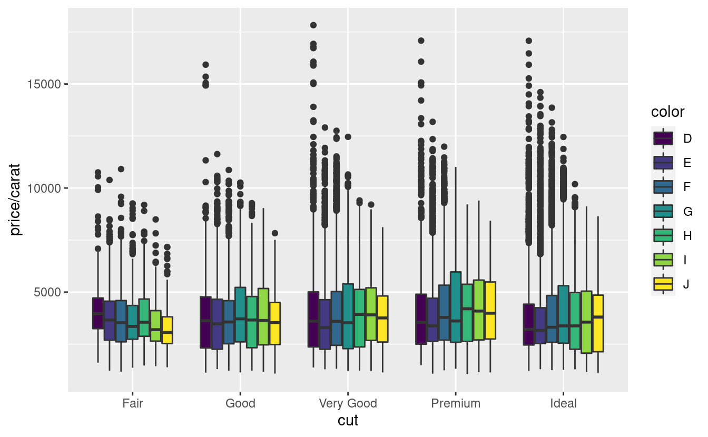
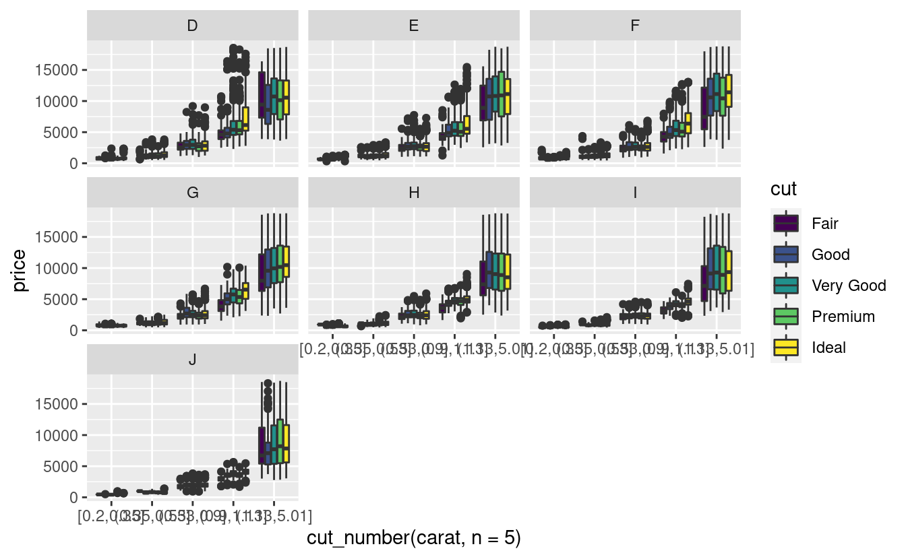

<pre class='chroma'><code class='language-r' data-lang='r'><a href='https://rdrr.io/r/base/library.html'>library</a>(<a href='https://tidyverse.tidyverse.org'>tidyverse</a>)</code></pre>

<pre class='chroma'><code class='language-r' data-lang='r'>diamonds <a href='https://magrittr.tidyverse.org/reference/pipe.html'>%&gt;%</a>
  <a href='https://ggplot2.tidyverse.org/reference/ggplot.html'>ggplot</a>(<a href='https://ggplot2.tidyverse.org/reference/aes.html'>aes</a>(x = cut, y = price, fill = color)) +
  <a href='https://ggplot2.tidyverse.org/reference/geom_boxplot.html'>geom_boxplot</a>()
</code></pre>

<pre class='chroma'><code class='language-r' data-lang='r'>diamonds <a href='https://magrittr.tidyverse.org/reference/pipe.html'>%&gt;%</a>
  <a href='https://ggplot2.tidyverse.org/reference/ggplot.html'>ggplot</a>(<a href='https://ggplot2.tidyverse.org/reference/aes.html'>aes</a>(x = cut, y = price / carat, fill = color)) +
  <a href='https://ggplot2.tidyverse.org/reference/geom_boxplot.html'>geom_boxplot</a>()
</code></pre>

<pre class='chroma'><code class='language-r' data-lang='r'>diamonds <a href='https://magrittr.tidyverse.org/reference/pipe.html'>%&gt;%</a>
  <a href='https://ggplot2.tidyverse.org/reference/ggplot.html'>ggplot</a>(<a href='https://ggplot2.tidyverse.org/reference/aes.html'>aes</a>(x = carat, y = price, color = color)) +
  <a href='https://ggplot2.tidyverse.org/reference/geom_point.html'>geom_point</a>()
</code></pre>

<pre class='chroma'><code class='language-r' data-lang='r'>diamonds <a href='https://magrittr.tidyverse.org/reference/pipe.html'>%&gt;%</a>
  <a href='https://ggplot2.tidyverse.org/reference/ggplot.html'>ggplot</a>(<a href='https://ggplot2.tidyverse.org/reference/aes.html'>aes</a>(x = carat, y = price, color = color)) +
  <a href='https://ggplot2.tidyverse.org/reference/geom_point.html'>geom_point</a>() +
  <a href='https://ggplot2.tidyverse.org/reference/facet_wrap.html'>facet_wrap</a>(<a href='https://ggplot2.tidyverse.org/reference/vars.html'>vars</a>(cut))
</code></pre>

<pre class='chroma'><code class='language-r' data-lang='r'>diamonds <a href='https://magrittr.tidyverse.org/reference/pipe.html'>%&gt;%</a>
  <a href='https://ggplot2.tidyverse.org/reference/ggplot.html'>ggplot</a>(<a href='https://ggplot2.tidyverse.org/reference/aes.html'>aes</a>(x = carat, y = price, color = cut)) +
  <a href='https://ggplot2.tidyverse.org/reference/geom_smooth.html'>geom_smooth</a>(se = FALSE)
</code></pre>

<pre class='chroma'><code class='language-r' data-lang='r'>diamonds <a href='https://magrittr.tidyverse.org/reference/pipe.html'>%&gt;%</a>
  <a href='https://ggplot2.tidyverse.org/reference/ggplot.html'>ggplot</a>(<a href='https://ggplot2.tidyverse.org/reference/aes.html'>aes</a>(x = carat, y = price, color = cut)) +
  <a href='https://ggplot2.tidyverse.org/reference/geom_smooth.html'>geom_smooth</a>(se = FALSE) +
    <a href='https://ggplot2.tidyverse.org/reference/facet_wrap.html'>facet_wrap</a>(<a href='https://ggplot2.tidyverse.org/reference/vars.html'>vars</a>(color))
</code></pre>

<pre class='chroma'><code class='language-r' data-lang='r'>diamonds <a href='https://magrittr.tidyverse.org/reference/pipe.html'>%&gt;%</a>
  <a href='https://ggplot2.tidyverse.org/reference/ggplot.html'>ggplot</a>(<a href='https://ggplot2.tidyverse.org/reference/aes.html'>aes</a>(x = <a href='https://ggplot2.tidyverse.org/reference/cut_interval.html'>cut_number</a>(carat, n = 5),
             y = price, fill = cut)) +
  <a href='https://ggplot2.tidyverse.org/reference/geom_boxplot.html'>geom_boxplot</a>() +
  <a href='https://ggplot2.tidyverse.org/reference/facet_wrap.html'>facet_wrap</a>(<a href='https://ggplot2.tidyverse.org/reference/vars.html'>vars</a>(color))
</code></pre>

<pre class='chroma'><code class='language-r' data-lang='r'>diamonds <a href='https://magrittr.tidyverse.org/reference/pipe.html'>%&gt;%</a>
  <a href='https://ggplot2.tidyverse.org/reference/ggplot.html'>ggplot</a>(<a href='https://ggplot2.tidyverse.org/reference/aes.html'>aes</a>(x = <a href='https://ggplot2.tidyverse.org/reference/cut_interval.html'>cut_number</a>(carat, n = 5),
             y = price, fill = color)) +
  <a href='https://ggplot2.tidyverse.org/reference/geom_boxplot.html'>geom_boxplot</a>() +
  <a href='https://ggplot2.tidyverse.org/reference/facet_wrap.html'>facet_wrap</a>(<a href='https://ggplot2.tidyverse.org/reference/vars.html'>vars</a>(cut))
</code></pre>

<pre class='chroma'><code class='language-r' data-lang='r'>diamonds <a href='https://magrittr.tidyverse.org/reference/pipe.html'>%&gt;%</a>
  <a href='https://ggplot2.tidyverse.org/reference/ggplot.html'>ggplot</a>(<a href='https://ggplot2.tidyverse.org/reference/aes.html'>aes</a>(x = price / carat, color = color)) +
  <a href='https://ggplot2.tidyverse.org/reference/geom_density.html'>geom_density</a>() +
  <a href='https://ggplot2.tidyverse.org/reference/facet_wrap.html'>facet_wrap</a>(<a href='https://ggplot2.tidyverse.org/reference/vars.html'>vars</a>(cut))
</code></pre>

<pre class='chroma'><code class='language-r' data-lang='r'>diamonds <a href='https://magrittr.tidyverse.org/reference/pipe.html'>%&gt;%</a>
  <a href='https://ggplot2.tidyverse.org/reference/ggplot.html'>ggplot</a>(<a href='https://ggplot2.tidyverse.org/reference/aes.html'>aes</a>(x = price / carat, color = cut)) +
  <a href='https://ggplot2.tidyverse.org/reference/geom_density.html'>geom_density</a>() +
  <a href='https://ggplot2.tidyverse.org/reference/facet_wrap.html'>facet_wrap</a>(<a href='https://ggplot2.tidyverse.org/reference/vars.html'>vars</a>(color))
</code></pre>

