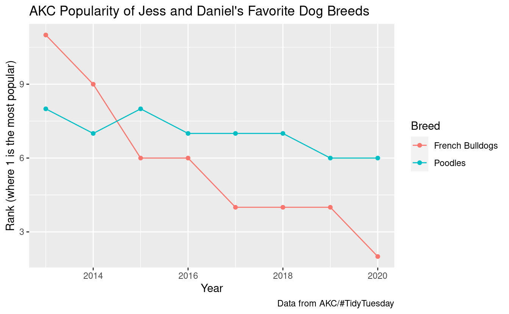

------------------------------------------------------------------------

## Introduction

Today we will learn about a consistent way to organize your data in R, using a system called **"tidy" data**.

Then we will cover the primary tool use for tidying data, **pivoting**. Pivoting allows you to change the shape of your data without changing any of the values. [Last week](https://biodash.github.io/codeclub/s05e02/) we went over [`pivot_longer()`](https://tidyr.tidyverse.org/reference/pivot_longer.html), today we are going to:

-   refresh on tidy data
-   refresh on [`pivot_longer()`](https://tidyr.tidyverse.org/reference/pivot_longer.html)
-   learn [`pivot_wider()`](https://tidyr.tidyverse.org/reference/pivot_wider.html)

If you want to download the R script that goes along with today's code club you can do so with the following code:

<pre class='chroma'><code class='language-r' data-lang='r'># save the url location for today's script
todays_R_script &lt;- 'https://github.com/biodash/biodash.github.io/raw/master/content/codeclub/S05E03/r4ds_tidying2.R'

# go get that file! 
<a href='https://rdrr.io/r/utils/download.file.html'>download.file</a>(url = todays_R_script,
              destfile = "r4ds_tidying2.R")
</code></pre>

The file will be downloaded to your working directory. If you don't know where that is, you can find out by executing [`getwd()`](https://rdrr.io/r/base/getwd.html) in your console.

We will again be using tools embedded within the `tidyverse` package, so we need to load it before we can use it. We do that with the [`library()`](https://rdrr.io/r/base/library.html) function.

<pre class='chroma'><code class='language-r' data-lang='r'># you should have the tidyverse installed, but if not, do so using:
# install.packages("tidyverse")

# load the tidyverse
<a href='https://rdrr.io/r/base/library.html'>library</a>(<a href='https://tidyverse.tidyverse.org'>tidyverse</a>)</code></pre>

 

------------------------------------------------------------------------

## What is tidy data?

Let's briefly go over again the idea of tidy data.

Illustrations from the [Openscapes](https://www.openscapes.org/) blog [Tidy Data for reproducibility, efficiency, and collaboration](https://www.openscapes.org/blog/2020/10/12/tidy-data/) by Julia Lowndes and Allison Horst

This is easier to "see" than to explain.👀

Here is an example of non-tidy data, where there is *data embedded in column names*.

<pre class='chroma'><code class='language-r' data-lang='r'>billboard
#&gt; # A tibble: 317 × 79
#&gt;    artist track date.ent…¹   wk1   wk2   wk3   wk4   wk5   wk6   wk7   wk8   wk9
#&gt;    &lt;chr&gt;  &lt;chr&gt; &lt;date&gt;     &lt;dbl&gt; &lt;dbl&gt; &lt;dbl&gt; &lt;dbl&gt; &lt;dbl&gt; &lt;dbl&gt; &lt;dbl&gt; &lt;dbl&gt; &lt;dbl&gt;
#&gt;  1 2 Pac  Baby… 2000-02-26    87    82    72    77    87    94    99    NA    NA
#&gt;  2 2Ge+h… The … 2000-09-02    91    87    92    NA    NA    NA    NA    NA    NA
#&gt;  3 3 Doo… Kryp… 2000-04-08    81    70    68    67    66    57    54    53    51
#&gt;  4 3 Doo… Loser 2000-10-21    76    76    72    69    67    65    55    59    62
#&gt;  5 504 B… Wobb… 2000-04-15    57    34    25    17    17    31    36    49    53
#&gt;  6 98^0   Give… 2000-08-19    51    39    34    26    26    19     2     2     3
#&gt;  7 A*Tee… Danc… 2000-07-08    97    97    96    95   100    NA    NA    NA    NA
#&gt;  8 Aaliy… I Do… 2000-01-29    84    62    51    41    38    35    35    38    38
#&gt;  9 Aaliy… Try … 2000-03-18    59    53    38    28    21    18    16    14    12
#&gt; 10 Adams… Open… 2000-08-26    76    76    74    69    68    67    61    58    57
#&gt; # … with 307 more rows, 67 more variables: wk10 &lt;dbl&gt;, wk11 &lt;dbl&gt;, wk12 &lt;dbl&gt;,
#&gt; #   wk13 &lt;dbl&gt;, wk14 &lt;dbl&gt;, wk15 &lt;dbl&gt;, wk16 &lt;dbl&gt;, wk17 &lt;dbl&gt;, wk18 &lt;dbl&gt;,
#&gt; #   wk19 &lt;dbl&gt;, wk20 &lt;dbl&gt;, wk21 &lt;dbl&gt;, wk22 &lt;dbl&gt;, wk23 &lt;dbl&gt;, wk24 &lt;dbl&gt;,
#&gt; #   wk25 &lt;dbl&gt;, wk26 &lt;dbl&gt;, wk27 &lt;dbl&gt;, wk28 &lt;dbl&gt;, wk29 &lt;dbl&gt;, wk30 &lt;dbl&gt;,
#&gt; #   wk31 &lt;dbl&gt;, wk32 &lt;dbl&gt;, wk33 &lt;dbl&gt;, wk34 &lt;dbl&gt;, wk35 &lt;dbl&gt;, wk36 &lt;dbl&gt;,
#&gt; #   wk37 &lt;dbl&gt;, wk38 &lt;dbl&gt;, wk39 &lt;dbl&gt;, wk40 &lt;dbl&gt;, wk41 &lt;dbl&gt;, wk42 &lt;dbl&gt;,
#&gt; #   wk43 &lt;dbl&gt;, wk44 &lt;dbl&gt;, wk45 &lt;dbl&gt;, wk46 &lt;dbl&gt;, wk47 &lt;dbl&gt;, wk48 &lt;dbl&gt;, …</code></pre>

Here is an example of the same exact data, in a tidy format, where those data that used to be column names, are now *values coded for a particular variable*.

<pre class='chroma'><code class='language-r' data-lang='r'>billboard |&gt; 
  <a href='https://tidyr.tidyverse.org/reference/pivot_longer.html'>pivot_longer</a>(
    cols = <a href='https://tidyselect.r-lib.org/reference/starts_with.html'>starts_with</a>("wk"), 
    names_to = "week", 
    values_to = "rank"
  )
#&gt; # A tibble: 24,092 × 5
#&gt;    artist track                   date.entered week   rank
#&gt;    &lt;chr&gt;  &lt;chr&gt;                   &lt;date&gt;       &lt;chr&gt; &lt;dbl&gt;
#&gt;  1 2 Pac  Baby Don't Cry (Keep... 2000-02-26   wk1      87
#&gt;  2 2 Pac  Baby Don't Cry (Keep... 2000-02-26   wk2      82
#&gt;  3 2 Pac  Baby Don't Cry (Keep... 2000-02-26   wk3      72
#&gt;  4 2 Pac  Baby Don't Cry (Keep... 2000-02-26   wk4      77
#&gt;  5 2 Pac  Baby Don't Cry (Keep... 2000-02-26   wk5      87
#&gt;  6 2 Pac  Baby Don't Cry (Keep... 2000-02-26   wk6      94
#&gt;  7 2 Pac  Baby Don't Cry (Keep... 2000-02-26   wk7      99
#&gt;  8 2 Pac  Baby Don't Cry (Keep... 2000-02-26   wk8      NA
#&gt;  9 2 Pac  Baby Don't Cry (Keep... 2000-02-26   wk9      NA
#&gt; 10 2 Pac  Baby Don't Cry (Keep... 2000-02-26   wk10     NA
#&gt; # … with 24,082 more rows</code></pre>

 

## Why should you care?

Let's go through an example where we will learn that we can't make the visualization that we want, because our data is not in tidy format.

<pre class='chroma'><code class='language-r' data-lang='r'># look at world_bank_pop using head
<a href='https://rdrr.io/r/utils/head.html'>head</a>(world_bank_pop)
#&gt; # A tibble: 6 × 20
#&gt;   country indica…¹ `2000` `2001` `2002` `2003`  `2004`  `2005`   `2006`   `2007`
#&gt;   &lt;chr&gt;   &lt;chr&gt;     &lt;dbl&gt;  &lt;dbl&gt;  &lt;dbl&gt;  &lt;dbl&gt;   &lt;dbl&gt;   &lt;dbl&gt;    &lt;dbl&gt;    &lt;dbl&gt;
#&gt; 1 ABW     SP.URB.… 4.24e4 4.30e4 4.37e4 4.42e4 4.47e+4 4.49e+4  4.49e+4  4.47e+4
#&gt; 2 ABW     SP.URB.… 1.18e0 1.41e0 1.43e0 1.31e0 9.51e-1 4.91e-1 -1.78e-2 -4.35e-1
#&gt; 3 ABW     SP.POP.… 9.09e4 9.29e4 9.50e4 9.70e4 9.87e+4 1.00e+5  1.01e+5  1.01e+5
#&gt; 4 ABW     SP.POP.… 2.06e0 2.23e0 2.23e0 2.11e0 1.76e+0 1.30e+0  7.98e-1  3.84e-1
#&gt; 5 AFG     SP.URB.… 4.44e6 4.65e6 4.89e6 5.16e6 5.43e+6 5.69e+6  5.93e+6  6.15e+6
#&gt; 6 AFG     SP.URB.… 3.91e0 4.66e0 5.13e0 5.23e0 5.12e+0 4.77e+0  4.12e+0  3.65e+0
#&gt; # … with 10 more variables: `2008` &lt;dbl&gt;, `2009` &lt;dbl&gt;, `2010` &lt;dbl&gt;,
#&gt; #   `2011` &lt;dbl&gt;, `2012` &lt;dbl&gt;, `2013` &lt;dbl&gt;, `2014` &lt;dbl&gt;, `2015` &lt;dbl&gt;,
#&gt; #   `2016` &lt;dbl&gt;, `2017` &lt;dbl&gt;, and abbreviated variable name ¹​indicator</code></pre>

What if we want to make a plot to see how population has changed (y-axis) for a specific country (say, the USA) over the duration for which data is collected (x-axis)? With the data in this format, we cannot make this plot. This is because **year** is not a column in our dataframe. This population information is spread over all of the columns that have a year as their name.

We can fix this by using [`pivot_longer()`](https://tidyr.tidyverse.org/reference/pivot_longer.html).

<pre class='chroma'><code class='language-r' data-lang='r'>world_bank_pop_tidy &lt;- world_bank_pop |&gt; 
  <a href='https://tidyr.tidyverse.org/reference/pivot_longer.html'>pivot_longer</a>(cols = !<a href='https://rdrr.io/r/base/c.html'>c</a>(country, indicator), # which columns do we want to "pivot"
               names_to = "year", # where should the column names go
               values_to = "measure") # where should the values within each cell go

# check how this went
<a href='https://rdrr.io/r/utils/head.html'>head</a>(world_bank_pop_tidy)
#&gt; # A tibble: 6 × 4
#&gt;   country indicator   year  measure
#&gt;   &lt;chr&gt;   &lt;chr&gt;       &lt;chr&gt;   &lt;dbl&gt;
#&gt; 1 ABW     SP.URB.TOTL 2000    42444
#&gt; 2 ABW     SP.URB.TOTL 2001    43048
#&gt; 3 ABW     SP.URB.TOTL 2002    43670
#&gt; 4 ABW     SP.URB.TOTL 2003    44246
#&gt; 5 ABW     SP.URB.TOTL 2004    44669
#&gt; 6 ABW     SP.URB.TOTL 2005    44889</code></pre>

<pre class='chroma'><code class='language-r' data-lang='r'># convert year from a character to a number so we can plot it 
world_bank_pop_tidy &lt;- world_bank_pop_tidy |&gt; 
  <a href='https://dplyr.tidyverse.org/reference/mutate.html'>mutate</a>(year = <a href='https://rdrr.io/r/base/numeric.html'>as.numeric</a>(year))

# check again 
<a href='https://rdrr.io/r/utils/head.html'>head</a>(world_bank_pop_tidy)
#&gt; # A tibble: 6 × 4
#&gt;   country indicator    year measure
#&gt;   &lt;chr&gt;   &lt;chr&gt;       &lt;dbl&gt;   &lt;dbl&gt;
#&gt; 1 ABW     SP.URB.TOTL  2000   42444
#&gt; 2 ABW     SP.URB.TOTL  2001   43048
#&gt; 3 ABW     SP.URB.TOTL  2002   43670
#&gt; 4 ABW     SP.URB.TOTL  2003   44246
#&gt; 5 ABW     SP.URB.TOTL  2004   44669
#&gt; 6 ABW     SP.URB.TOTL  2005   44889</code></pre>

Now we can make the plot we want. If you're not familiar with ggplot syntax you can learn more in the R4DS section called [Visualize](https://r4ds.hadley.nz/visualize.html) or in past code clubs on:

-   [ggplot](https://biodash.github.io/codeclub/s02e06_ggplot2/)
-   [ggplot some more](https://biodash.github.io/codeclub/s02e07_ggplot2_part2/)
-   [my data viz class](https://datavisualizing.netlify.app/module2.html)

<pre class='chroma'><code class='language-r' data-lang='r'># a minimal plot
world_bank_pop_tidy |&gt; 
  <a href='https://dplyr.tidyverse.org/reference/filter.html'>filter</a>(country == "USA") |&gt; 
  <a href='https://dplyr.tidyverse.org/reference/filter.html'>filter</a>(indicator == "SP.POP.TOTL") |&gt; 
  <a href='https://ggplot2.tidyverse.org/reference/ggplot.html'>ggplot</a>(<a href='https://ggplot2.tidyverse.org/reference/aes.html'>aes</a>(x = year, y = measure)) + 
  <a href='https://ggplot2.tidyverse.org/reference/geom_point.html'>geom_point</a>() +
  <a href='https://ggplot2.tidyverse.org/reference/geom_path.html'>geom_line</a>()
</code></pre>

 

<b>If you want to see a more polished version of this plot </b>(click here)

 

<pre class='chroma'><code class='language-r' data-lang='r'># a more polished plot
world_bank_pop_tidy |&gt; 
  <a href='https://dplyr.tidyverse.org/reference/filter.html'>filter</a>(country == "USA") |&gt; 
  <a href='https://dplyr.tidyverse.org/reference/filter.html'>filter</a>(indicator == "SP.POP.TOTL") |&gt; 
  <a href='https://ggplot2.tidyverse.org/reference/ggplot.html'>ggplot</a>(<a href='https://ggplot2.tidyverse.org/reference/aes.html'>aes</a>(x = year, y = measure, color = country)) +
  <a href='https://ggplot2.tidyverse.org/reference/geom_point.html'>geom_point</a>() +
  <a href='https://ggplot2.tidyverse.org/reference/geom_path.html'>geom_line</a>() +
  <a href='https://ggplot2.tidyverse.org/reference/scale_continuous.html'>scale_y_continuous</a>(limits = <a href='https://rdrr.io/r/base/c.html'>c</a>(0, 4e8)) +
# ylim(c(0, 4e8)) + # also works instead of scale_y_continuous
  <a href='https://ggplot2.tidyverse.org/reference/ggtheme.html'>theme_minimal</a>() +
  <a href='https://ggplot2.tidyverse.org/reference/theme.html'>theme</a>(legend.position = "none") +
  <a href='https://ggplot2.tidyverse.org/reference/labs.html'>labs</a>(x = "Year",
       y = "Population",
       title = "Total population in the United States \nfrom 2000 to 2017",
       caption = "Data from the World Bank")
</code></pre>

 

Often it may be easier to collect your data in wide format, but analyze it in tidy (i.e., long) format.

> This does not mean you must now collect your data in tidy format! You simply need to become comfortable with switching between formats.

## Two functions for pivoting data

-   [**`pivot_longer()`**](https://tidyr.tidyverse.org/reference/pivot_longer.html) pulls data that is embedded in column names, and reshapes your dataframe such this information is now embedded within the values. This typically makes your dataframes longer (i.e., increases the number of rows).  
    *Typically*, we use [`pivot_longer()`](https://tidyr.tidyverse.org/reference/pivot_longer.html) to make an untidy dataset tidy, since untidy datasets often have multiple columns for a single variable, and multiple observations in a single row.

-   [**`pivot_wider()`**](https://tidyr.tidyverse.org/reference/pivot_wider.html) takes data that is embedded in the values of your dataframe, and puts this information in variable names. This typically makes your dataframe "wider" (i.e., increases the number of columns).  
    *Typically*, [`pivot_wider()`](https://tidyr.tidyverse.org/reference/pivot_wider.html) will make a dataset untidy, but this can still be useful for certain calculations, or if you want to use a for loop to do something iteratively across columns.

 

------------------------------------------------------------------------

## `pivot_wider()`

The opposite of [`pivot_longer()`](https://tidyr.tidyverse.org/reference/pivot_longer.html) is [`pivot_wider()`](https://tidyr.tidyverse.org/reference/pivot_wider.html). We haven't used [`pivot_wider()`](https://tidyr.tidyverse.org/reference/pivot_wider.html) get so let's try it. We are going to use the dataframe `population` which is pre-loaded with the tidyverse. This dataframe is currently in tidy format.

<pre class='chroma'><code class='language-r' data-lang='r'># what is in population?
<a href='https://rdrr.io/r/utils/head.html'>head</a>(population)
#&gt; # A tibble: 6 × 3
#&gt;   country      year population
#&gt;   &lt;chr&gt;       &lt;int&gt;      &lt;int&gt;
#&gt; 1 Afghanistan  1995   17586073
#&gt; 2 Afghanistan  1996   18415307
#&gt; 3 Afghanistan  1997   19021226
#&gt; 4 Afghanistan  1998   19496836
#&gt; 5 Afghanistan  1999   19987071
#&gt; 6 Afghanistan  2000   20595360</code></pre>

What if we wanted to adjust the data so that instead of having a column called `year`, the data for each year is its own column, and have the corresponding `population` within each cell ? We can do that with [`pivot_wider()`](https://tidyr.tidyverse.org/reference/pivot_wider.html).

<pre class='chroma'><code class='language-r' data-lang='r'>population_wide &lt;- population |&gt;
  <a href='https://tidyr.tidyverse.org/reference/pivot_wider.html'>pivot_wider</a>(names_from = "year",
              values_from = "population")

<a href='https://rdrr.io/r/utils/head.html'>head</a>(population_wide)
#&gt; # A tibble: 6 × 20
#&gt;   country  `1995` `1996` `1997` `1998` `1999` `2000` `2001` `2002` `2003` `2004`
#&gt;   &lt;chr&gt;     &lt;int&gt;  &lt;int&gt;  &lt;int&gt;  &lt;int&gt;  &lt;int&gt;  &lt;int&gt;  &lt;int&gt;  &lt;int&gt;  &lt;int&gt;  &lt;int&gt;
#&gt; 1 Afghani… 1.76e7 1.84e7 1.90e7 1.95e7 2.00e7 2.06e7 2.13e7 2.22e7 2.31e7 2.40e7
#&gt; 2 Albania  3.36e6 3.34e6 3.33e6 3.33e6 3.32e6 3.30e6 3.29e6 3.26e6 3.24e6 3.22e6
#&gt; 3 Algeria  2.93e7 2.98e7 3.03e7 3.08e7 3.13e7 3.17e7 3.22e7 3.26e7 3.30e7 3.35e7
#&gt; 4 America… 5.29e4 5.39e4 5.49e4 5.59e4 5.68e4 5.75e4 5.82e4 5.87e4 5.91e4 5.93e4
#&gt; 5 Andorra  6.39e4 6.43e4 6.41e4 6.38e4 6.41e4 6.54e4 6.8 e4 7.16e4 7.56e4 7.91e4
#&gt; 6 Angola   1.21e7 1.25e7 1.28e7 1.31e7 1.35e7 1.39e7 1.44e7 1.49e7 1.54e7 1.60e7
#&gt; # … with 9 more variables: `2005` &lt;int&gt;, `2006` &lt;int&gt;, `2007` &lt;int&gt;,
#&gt; #   `2008` &lt;int&gt;, `2009` &lt;int&gt;, `2010` &lt;int&gt;, `2011` &lt;int&gt;, `2012` &lt;int&gt;,
#&gt; #   `2013` &lt;int&gt;</code></pre>

------------------------------------------------------------------------

## `pivot_longer()`

Let's practice again using [`pivot_longer()`](https://tidyr.tidyverse.org/reference/pivot_longer.html). We just made a wide dataframe with [`pivot_wider()`](https://tidyr.tidyverse.org/reference/pivot_wider.html) - can we make it long again?

<pre class='chroma'><code class='language-r' data-lang='r'>population_long &lt;- population_wide |&gt;
  <a href='https://tidyr.tidyverse.org/reference/pivot_longer.html'>pivot_longer</a>(cols = !country, # all columns except country
               names_to = "year",
               values_to = "population")

<a href='https://rdrr.io/r/utils/head.html'>head</a>(population_long)
#&gt; # A tibble: 6 × 3
#&gt;   country     year  population
#&gt;   &lt;chr&gt;       &lt;chr&gt;      &lt;int&gt;
#&gt; 1 Afghanistan 1995    17586073
#&gt; 2 Afghanistan 1996    18415307
#&gt; 3 Afghanistan 1997    19021226
#&gt; 4 Afghanistan 1998    19496836
#&gt; 5 Afghanistan 1999    19987071
#&gt; 6 Afghanistan 2000    20595360</code></pre>

There are many different ways you can code to tell R which columns you want to pivot. I'm showing below some other ways to code the same outcome, but you can find a more ocomprehensive list of [tidy-select helpers](https://tidyr.tidyverse.org/reference/tidyr_tidy_select.html) in the `tidyr` documentation page.

<pre class='chroma'><code class='language-r' data-lang='r'>population_long &lt;- population_wide |&gt;
  <a href='https://tidyr.tidyverse.org/reference/pivot_longer.html'>pivot_longer</a>(cols = where(is.numeric), # all numeric columns
               names_to = "year",
               values_to = "population")

<a href='https://rdrr.io/r/utils/head.html'>head</a>(population_long)
#&gt; # A tibble: 6 × 3
#&gt;   country     year  population
#&gt;   &lt;chr&gt;       &lt;chr&gt;      &lt;int&gt;
#&gt; 1 Afghanistan 1995    17586073
#&gt; 2 Afghanistan 1996    18415307
#&gt; 3 Afghanistan 1997    19021226
#&gt; 4 Afghanistan 1998    19496836
#&gt; 5 Afghanistan 1999    19987071
#&gt; 6 Afghanistan 2000    20595360</code></pre>

<pre class='chroma'><code class='language-r' data-lang='r'>population_long &lt;- population_wide |&gt;
  <a href='https://tidyr.tidyverse.org/reference/pivot_longer.html'>pivot_longer</a>(cols = 2:20, # columns 2 through 20
               names_to = "year",
               values_to = "population")

<a href='https://rdrr.io/r/utils/head.html'>head</a>(population_long)
#&gt; # A tibble: 6 × 3
#&gt;   country     year  population
#&gt;   &lt;chr&gt;       &lt;chr&gt;      &lt;int&gt;
#&gt; 1 Afghanistan 1995    17586073
#&gt; 2 Afghanistan 1996    18415307
#&gt; 3 Afghanistan 1997    19021226
#&gt; 4 Afghanistan 1998    19496836
#&gt; 5 Afghanistan 1999    19987071
#&gt; 6 Afghanistan 2000    20595360</code></pre>

------------------------------------------------------------------------

## Breakout Rooms

We are going to use some data that is a part of the `#TidyTuesday` series of data activities for tidyverse/R learning. I've picked some [data](https://github.com/rfordatascience/tidytuesday/tree/master/data/2022/2022-02-01) that comes from the American Kennel Club and was compiled by [KKakey](https://github.com/kkakey/dog_traits_AKC/blob/main/README.md).

First we will download data that contains popularity of dog breeds by AKC registration from 2013-2020. You can access the data through the chunk of code below.

<pre class='chroma'><code class='language-r' data-lang='r'>breed_rank_all &lt;- readr::<a href='https://readr.tidyverse.org/reference/read_delim.html'>read_csv</a>('https://raw.githubusercontent.com/rfordatascience/tidytuesday/master/data/2022/2022-02-01/breed_rank.csv')</code></pre>

### Exercise 1

Convert this data from wide format to long format.

<b>Hint 1 </b>(click here)

 

Use the function [`pivot_longer()`](https://tidyr.tidyverse.org/reference/pivot_longer.html). Try setting the arguments `cols =`, `names_to =` and `values_to =`.

 

<b>Hint 2 after you've already pivoted </b>(click here)

 

Note that each column is called Year Rank (e.g., 2020 Rank) and not just Year (e.g., 2020). You can fix this within [`pivot_longer()`](https://tidyr.tidyverse.org/reference/pivot_longer.html) using `names_transform`. Try visiting this [link](https://www.tidyverse.org/blog/2020/05/tidyr-1.1.0/) for some help.

 

<b>Solution </b>(click here)

 

<pre class='chroma'><code class='language-r' data-lang='r'><a href='https://pillar.r-lib.org/reference/glimpse.html'>glimpse</a>(breed_rank_all)
#&gt; Rows: 195
#&gt; Columns: 11
#&gt; $ Breed       &lt;chr&gt; "Retrievers (Labrador)", "French Bulldogs", "German Shephe…
#&gt; $ `2013 Rank` &lt;dbl&gt; 1, 11, 2, 3, 5, 8, 4, 9, 13, 10, 24, 20, 6, 7, 16, 14, 18,…
#&gt; $ `2014 Rank` &lt;dbl&gt; 1, 9, 2, 3, 4, 7, 5, 10, 12, 11, 22, 18, 6, 8, 15, 13, 19,…
#&gt; $ `2015 Rank` &lt;dbl&gt; 1, 6, 2, 3, 4, 8, 5, 9, 11, 13, 20, 17, 7, 10, 15, 12, 18,…
#&gt; $ `2016 Rank` &lt;dbl&gt; 1, 6, 2, 3, 4, 7, 5, 8, 11, 13, 18, 16, 9, 10, 14, 12, 19,…
#&gt; $ `2017 Rank` &lt;dbl&gt; 1, 4, 2, 3, 5, 7, 6, 8, 10, 13, 15, 17, 9, 11, 14, 12, 19,…
#&gt; $ `2018 Rank` &lt;dbl&gt; 1, 4, 2, 3, 5, 7, 6, 8, 9, 12, 13, 15, 10, 11, 16, 14, 18,…
#&gt; $ `2019 Rank` &lt;dbl&gt; 1, 4, 2, 3, 5, 6, 7, 8, 9, 11, 10, 13, 12, 14, 17, 15, 16,…
#&gt; $ `2020 Rank` &lt;dbl&gt; 1, 2, 3, 4, 5, 6, 7, 8, 9, 10, 11, 12, 13, 14, 15, 16, 17,…
#&gt; $ links       &lt;chr&gt; "https://www.akc.org/dog-breeds/labrador-retriever/", "htt…
#&gt; $ Image       &lt;chr&gt; "https://www.akc.org/wp-content/uploads/2017/11/Labrador-R…</code></pre>

<pre class='chroma'><code class='language-r' data-lang='r'>breed_rank_tidy &lt;- breed_rank_all <a href='https://magrittr.tidyverse.org/reference/pipe.html'>%&gt;%</a>
  <a href='https://tidyr.tidyverse.org/reference/pivot_longer.html'>pivot_longer</a>(cols = <a href='https://tidyselect.r-lib.org/reference/starts_with.html'>contains</a>("Rank"),
              names_to = "year",
              values_to = "rank",
              names_transform = <a href='https://rdrr.io/r/base/list.html'>list</a>(year = parse_number))

<a href='https://rdrr.io/r/utils/head.html'>head</a>(breed_rank_tidy)
#&gt; # A tibble: 6 × 5
#&gt;   Breed                 links                                  Image  year  rank
#&gt;   &lt;chr&gt;                 &lt;chr&gt;                                  &lt;chr&gt; &lt;dbl&gt; &lt;dbl&gt;
#&gt; 1 Retrievers (Labrador) https://www.akc.org/dog-breeds/labrad… http…  2013     1
#&gt; 2 Retrievers (Labrador) https://www.akc.org/dog-breeds/labrad… http…  2014     1
#&gt; 3 Retrievers (Labrador) https://www.akc.org/dog-breeds/labrad… http…  2015     1
#&gt; 4 Retrievers (Labrador) https://www.akc.org/dog-breeds/labrad… http…  2016     1
#&gt; 5 Retrievers (Labrador) https://www.akc.org/dog-breeds/labrad… http…  2017     1
#&gt; 6 Retrievers (Labrador) https://www.akc.org/dog-breeds/labrad… http…  2018     1</code></pre>

 

### Exercise 2

Take that new dataframe you've just made using [`pivot_longer()`](https://tidyr.tidyverse.org/reference/pivot_longer.html) and make it wide again. No, you can't just use the original dataframe 😀🐶

<b>Hints </b>(click here)

 

Try using [`pivot_longer()`](https://tidyr.tidyverse.org/reference/pivot_longer.html) and make sure you specify `names_from =` and `values_from =`.

 

<b>Solution </b>(click here)

 

<pre class='chroma'><code class='language-r' data-lang='r'>breed_rank_wide &lt;- breed_rank_tidy |&gt;
  <a href='https://tidyr.tidyverse.org/reference/pivot_wider.html'>pivot_wider</a>(names_from = "year",
              values_from = "rank")

<a href='https://rdrr.io/r/utils/head.html'>head</a>(breed_rank_wide)
#&gt; # A tibble: 6 × 11
#&gt;   Breed      links Image `2013` `2014` `2015` `2016` `2017` `2018` `2019` `2020`
#&gt;   &lt;chr&gt;      &lt;chr&gt; &lt;chr&gt;  &lt;dbl&gt;  &lt;dbl&gt;  &lt;dbl&gt;  &lt;dbl&gt;  &lt;dbl&gt;  &lt;dbl&gt;  &lt;dbl&gt;  &lt;dbl&gt;
#&gt; 1 Retriever… http… http…      1      1      1      1      1      1      1      1
#&gt; 2 French Bu… http… http…     11      9      6      6      4      4      4      2
#&gt; 3 German Sh… http… http…      2      2      2      2      2      2      2      3
#&gt; 4 Retriever… http… http…      3      3      3      3      3      3      3      4
#&gt; 5 Bulldogs   http… http…      5      4      4      4      5      5      5      5
#&gt; 6 Poodles    http… http…      8      7      8      7      7      7      6      6</code></pre>

Note, that R is adding all your new columns to the end of your dataframe. If you want to reorder your columns, you can do that simply with [`select()`](https://dplyr.tidyverse.org/reference/select.html) which both picks and orders columns. Note, you need backticks around a variable name when that variable name is a number (as this is atypical syntax for R).

<pre class='chroma'><code class='language-r' data-lang='r'>breed_rank_wide &lt;- breed_rank_wide |&gt;
  <a href='https://dplyr.tidyverse.org/reference/select.html'>select</a>(Breed, `2013`:`2020`, <a href='https://tidyselect.r-lib.org/reference/everything.html'>everything</a>()) 

<a href='https://rdrr.io/r/utils/head.html'>head</a>(breed_rank_wide)
#&gt; # A tibble: 6 × 11
#&gt;   Breed      `2013` `2014` `2015` `2016` `2017` `2018` `2019` `2020` links Image
#&gt;   &lt;chr&gt;       &lt;dbl&gt;  &lt;dbl&gt;  &lt;dbl&gt;  &lt;dbl&gt;  &lt;dbl&gt;  &lt;dbl&gt;  &lt;dbl&gt;  &lt;dbl&gt; &lt;chr&gt; &lt;chr&gt;
#&gt; 1 Retriever…      1      1      1      1      1      1      1      1 http… http…
#&gt; 2 French Bu…     11      9      6      6      4      4      4      2 http… http…
#&gt; 3 German Sh…      2      2      2      2      2      2      2      3 http… http…
#&gt; 4 Retriever…      3      3      3      3      3      3      3      4 http… http…
#&gt; 5 Bulldogs        5      4      4      4      5      5      5      5 http… http…
#&gt; 6 Poodles         8      7      8      7      7      7      6      6 http… http…</code></pre>

 

### Bonus 1

Try making a plot that shows the rank popularity of your favorite dog breeds over 2013-2020.

<b>Hints </b>(click here)

 

Use your tidy dataframe, [`filter()`](https://dplyr.tidyverse.org/reference/filter.html) to pick the Breeds you want to keep, and maybe a combined point and line plot.

 

<b>Solution </b>(click here)

 

<pre class='chroma'><code class='language-r' data-lang='r'>fav_breeds &lt;- <a href='https://rdrr.io/r/base/c.html'>c</a>("French Bulldogs", "Poodles")

breed_rank_tidy |&gt;
  <a href='https://dplyr.tidyverse.org/reference/filter.html'>filter</a>(Breed <a href='https://rdrr.io/r/base/match.html'>%in%</a> fav_breeds) |&gt;
# filter(Breed == "French Bulldogs" | Breed == "Poodles") |&gt; # also works
  <a href='https://ggplot2.tidyverse.org/reference/ggplot.html'>ggplot</a>(<a href='https://ggplot2.tidyverse.org/reference/aes.html'>aes</a>(x = year, y = rank, color = Breed)) +
  <a href='https://ggplot2.tidyverse.org/reference/geom_point.html'>geom_point</a>() + 
  <a href='https://ggplot2.tidyverse.org/reference/geom_path.html'>geom_line</a>() +
  <a href='https://ggplot2.tidyverse.org/reference/labs.html'>labs</a>(x = "Year", 
       y = "Rank (where 1 is the most popular)",
       title = "AKC Popularity of Jess and Daniel's Favorite Dog Breeds",
       caption = "Data from AKC/#TidyTuesday")
</code></pre>

 

------------------------------------------------------------------------

 

