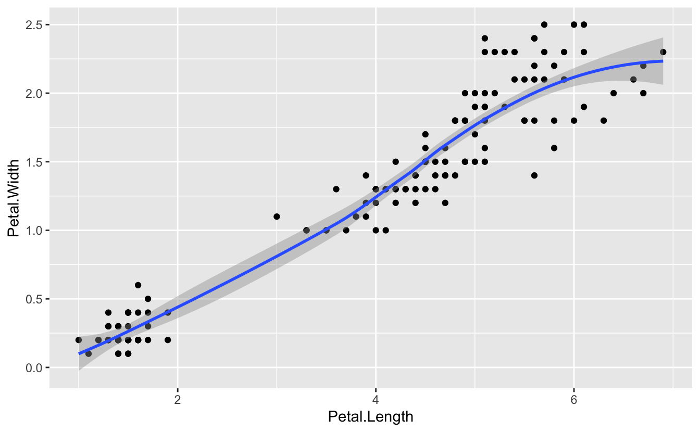
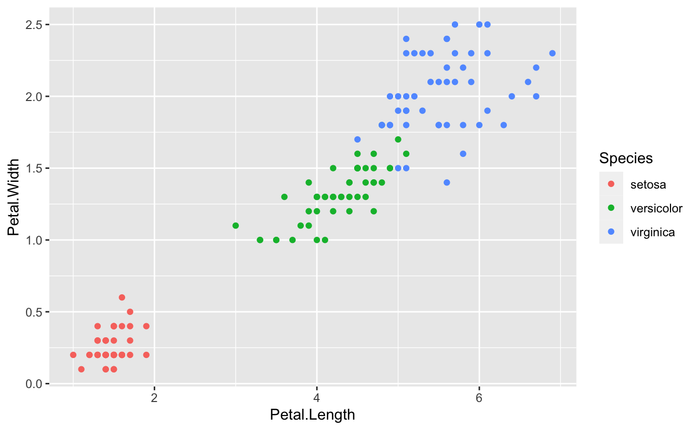
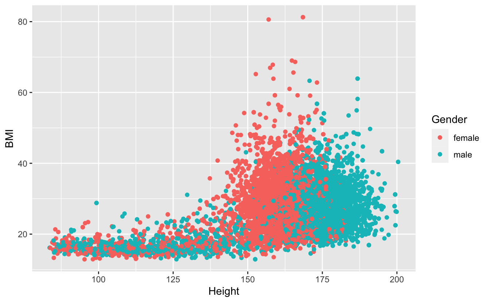
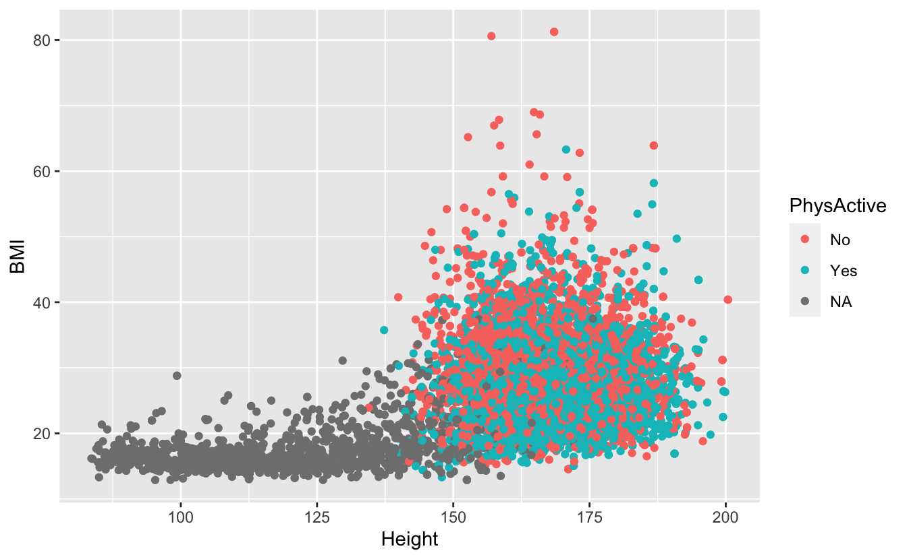
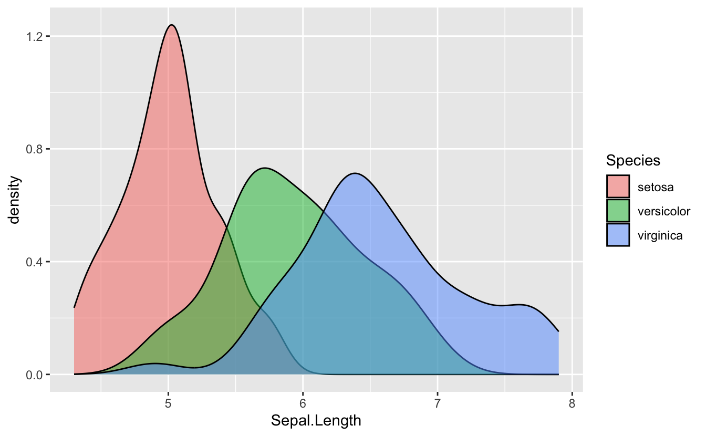

     

------------------------------------------------------------------------

## New To Code Club?

-   First, check out the [Code Club Computer Setup](/codeclub-setup/) instructions, which also has some pointers that might be helpful if you're new to R or RStudio.

-   Please open RStudio before Code Club to test things out -- if you run into issues, join early and we'll troubleshoot.

------------------------------------------------------------------------

## Session Goals

-   Learn the philosophy of **coding** a graphic.
-   Learn the basic **template** of a **ggplot2** graphic, so you can reuse it for multiple chart types.
-   Learn how you can quickly add visual information to a graphic using **aesthetics** and **layers**.

------------------------------------------------------------------------

## Intro: The ggplot2 philosophy

We have already seen that in R, instead of manually manipulating data frames as you might do when editing Excel sheets, we **code** the operations we want to perform using **dplyr** verbs like [`select()`](https://dplyr.tidyverse.org/reference/select.html), [`mutate()`](https://dplyr.tidyverse.org/reference/mutate.html), [`summarize()`](https://dplyr.tidyverse.org/reference/summarise.html), and so on.

In a similar way when performing visualization, instead of clicking on a chart type in Excel, we **code the chart** in R.

And just as **dplyr** gives us efficient ways to manipulate data frames, **ggplot2** (which is also part of the tidyverse) gives us efficient ways to manipulate charts/plots/graphics (we use these terms interchangeably).

The **gg** in **ggplot2** stands for *grammar of graphics*, a systematic approach for designing statistical plots developed by Leland Wilkinson. The idea behind this was to think about 'pulling apart' various plots into their shared component pieces, then provide code that could put them together again. We can then create new plots like we create new sentences (once we understand this grammar).

There are two parts to this. First, the 'nouns and verbs' we need to work with plots are very different than those we need to work with data frames. **ggplot2** is like a mini-language of its own, with its own verbs and syntax.

Second, this notion of pulling apart a graphic leads to the idea of *layers*. You can build up a plot of any complexity by *overlaying* different views of the same data.

There's a learning curve here for sure, but there are a couple of things that help us.

First, every graphic shares a *common template*. This is like thinking about the sentence "The cat sat on the mat" grammatically as the template `NP V PP` (`N`oun `P`hrase "The cat", `V`erb "sat", `P`repositional `P`hrase "on the mat"). Once you understand this structure you can "say" a *lot* of different things.

(And I mean a *lot*. The [ggplot cheat sheet](https://github.com/rstudio/cheatsheets/blob/master/data-visualization-2.1.pdf) lists over 40 plot-types, but because this is a language, users can create their own [extensions](https://exts.ggplot2.tidyverse.org/gallery/) that you can also utilize, adding over 80 more.)

Second, the way we put layers together is identical to the way we use pipes. You can read `%>%` as "and then": [`select()`](https://dplyr.tidyverse.org/reference/select.html) *and then* [`mutate()`](https://dplyr.tidyverse.org/reference/mutate.html) *and then* [`summarize()`](https://dplyr.tidyverse.org/reference/summarise.html). In graphics, we can say "show this layer, and then *overlay* this layer, and then *overlay* this layer", etc., using a very similar syntax.

 

------------------------------------------------------------------------

## Examples

So how does this work in practice? We'll work through visualizing the **iris** dataset that you've seen before. This is an extremely famous [dataset](https://en.m.wikipedia.org/wiki/Iris_flower_data_set) that was first analyzed by R. A. Fisher in 1936: *The use of multiple measurements in taxonomic problems*. He was attempting to use petal and sepal measurements to discriminate one species from another.

**ggplot2** is part of the tidyverse package so we need to load that first:

<pre class='chroma'><code class='language-r' data-lang='r'># this assumes you've already installed tidyverse
<a href='https://rdrr.io/r/base/library.html'>library</a>(<a href='https://tidyverse.tidyverse.org'>tidyverse</a>)
#&gt; ── Attaching packages ─────────────────────────────────────── tidyverse 1.3.2 ──
#&gt; ✔ ggplot2 3.4.0      ✔ purrr   1.0.1 
#&gt; ✔ tibble  3.1.8      ✔ dplyr   1.0.10
#&gt; ✔ tidyr   1.2.1      ✔ stringr 1.5.0 
#&gt; ✔ readr   2.1.3      ✔ forcats 0.5.2 
#&gt; ── Conflicts ────────────────────────────────────────── tidyverse_conflicts() ──
#&gt; ✖ dplyr::filter() masks stats::filter()
#&gt; ✖ dplyr::lag()    masks stats::lag()</code></pre>

And recall that the **iris** dataset (3 species, 50 observations per species) is automatically available to us:

<pre class='chroma'><code class='language-r' data-lang='r'><a href='https://rdrr.io/r/utils/head.html'>head</a>(iris)
#&gt;   Sepal.Length Sepal.Width Petal.Length Petal.Width Species
#&gt; 1          5.1         3.5          1.4         0.2  setosa
#&gt; 2          4.9         3.0          1.4         0.2  setosa
#&gt; 3          4.7         3.2          1.3         0.2  setosa
#&gt; 4          4.6         3.1          1.5         0.2  setosa
#&gt; 5          5.0         3.6          1.4         0.2  setosa
#&gt; 6          5.4         3.9          1.7         0.4  setosa</code></pre>

What is the correlation between petal length and width in these species? Are longer petals also wider? We can visualize this with a scatterplot. But first let's look a the ggplot template. (Note the package is **ggplot2**, the command is `ggplot`.)

    ggplot(data = <DATA>) + 
      <GEOM_FUNCTION>(mapping = aes(<MAPPINGS>))

These are the obligatory parts of any plot. The first argument to [`ggplot()`](https://ggplot2.tidyverse.org/reference/ggplot.html) is the data frame:

<pre class='chroma'><code class='language-r' data-lang='r'><a href='https://ggplot2.tidyverse.org/reference/ggplot.html'>ggplot</a>(data = iris)
</code></pre>

This is not very interesting! but it's notable that it is *something*. [`ggplot()`](https://ggplot2.tidyverse.org/reference/ggplot.html) has created a base coordinate system (a base layer) that we can add visual layers to. The *add a layer* operator is "**+**", which is the ggplot equivalent of the pipe symbol, and **it must occur at the end of the line**.

The next argument specifies the kind plot we want: scatterplot, bar chart, fitted line, boxplot, pie chart, etc. **ggplot2** refers to these as **geoms**: the geometrical object that a plot uses to represent data. You can see an overview of many of these geoms in the [cheat sheet](https://github.com/rstudio/cheatsheets/blob/master/data-visualization-2.1.pdf). The geom for a scatterplot is [`geom_point()`](https://ggplot2.tidyverse.org/reference/geom_point.html).

But we also require a `mapping` argument, which maps the *variables* in the dataset we want to focus on to their *visual representation* in the plot.

And finally we need to specify an **aesthetic** for the geometric objects in the plot, which will control things like shape, color, transparency, etc. Perhaps surprisingly, for a scatterplot, the x and y coordinates are aesthetics, since these control, not the shape or color, but the relative position of the points in the coordinate system.

Here is our complete plot:

<pre class='chroma'><code class='language-r' data-lang='r'><a href='https://ggplot2.tidyverse.org/reference/ggplot.html'>ggplot</a>(data = iris) +
  <a href='https://ggplot2.tidyverse.org/reference/geom_point.html'>geom_point</a>(mapping = <a href='https://ggplot2.tidyverse.org/reference/aes.html'>aes</a>(x = Petal.Length, y = Petal.Width))
</code></pre>

There is clearly a positive correlation between length and width. And we can make this even more apparent by visually fitting a line to the data, by *overlaying* another geom in the same plot.

<pre class='chroma'><code class='language-r' data-lang='r'><a href='https://ggplot2.tidyverse.org/reference/ggplot.html'>ggplot</a>(data = iris) +
  <a href='https://ggplot2.tidyverse.org/reference/geom_point.html'>geom_point</a>(mapping = <a href='https://ggplot2.tidyverse.org/reference/aes.html'>aes</a>(x = Petal.Length, y = Petal.Width)) +
  <a href='https://ggplot2.tidyverse.org/reference/geom_smooth.html'>geom_smooth</a>(mapping = <a href='https://ggplot2.tidyverse.org/reference/aes.html'>aes</a>(x = Petal.Length, y = Petal.Width))
#&gt; `geom_smooth()` using method = 'loess' and formula = 'y ~ x'</code></pre>

There is clearly some code redundancy here, and we really don't want the x, y mapping of these two layers to be independent. We can extract the common mapping information and move it to the top level:

<pre class='chroma'><code class='language-r' data-lang='r'><a href='https://ggplot2.tidyverse.org/reference/ggplot.html'>ggplot</a>(data = iris, mapping = <a href='https://ggplot2.tidyverse.org/reference/aes.html'>aes</a>(x = Petal.Length, y = Petal.Width)) +
  <a href='https://ggplot2.tidyverse.org/reference/geom_point.html'>geom_point</a>() +
  <a href='https://ggplot2.tidyverse.org/reference/geom_smooth.html'>geom_smooth</a>()
#&gt; `geom_smooth()` using method = 'loess' and formula = 'y ~ x'</code></pre>

So we have the possibility of *local* layer specifications, and *global* specifications. Global specifications are *inherited* by all the local layers.

### The power of aesthetics

The aim of Fisher's paper was to try to discriminate different species based on their morphological measurements. It looks from this plot that there are two distinct clusters. Do these clusters correspond to different species? There are two clusters, but three species. How can we explore this further?

Our current plot uses two numeric variables: `Petal.Length` and `Petal.width`. We can add a third categorical variable, like `Species`, to a two dimensional scatterplot by mapping it to a different visual aesthetic. We've mapped length and width to x,y coordinates. Now we'll simultaneously map species to `color` by expanding our list of aesthetics:

<pre class='chroma'><code class='language-r' data-lang='r'><a href='https://ggplot2.tidyverse.org/reference/ggplot.html'>ggplot</a>(data = iris) +
  (mapping = <a href='https://ggplot2.tidyverse.org/reference/aes.html'>aes</a>(x = Petal.Length, y = Petal.Width, color = Species)) +
  <a href='https://ggplot2.tidyverse.org/reference/geom_point.html'>geom_point</a>()
</code></pre>

The R help for a specific geoms will list, among other things, all the aesthetics that geom supports.

 

------------------------------------------------------------------------

## Breakout Rooms

In the exercises we'll be looking a little more at the **iris** data, and in addition, the NHANES data we used last week, and the left-joined bird dataset we built [some time ago](https://biodash.github.io/codeclub/03_joining-datasets/).

Please install the NHANES dataset:

<pre class='chroma'><code class='language-r' data-lang='r'><a href='https://rdrr.io/r/utils/install.packages.html'>install.packages</a>("NHANES", repos = "http://cran.us.r-project.org")</code></pre>

Once installed, load it with:

<pre class='chroma'><code class='language-r' data-lang='r'><a href='https://rdrr.io/r/base/library.html'>library</a>(NHANES)</code></pre>

A prebuilt joined data set on birds can be downloaded using the code below.

<pre class='chroma'><code class='language-r' data-lang='r'># create a data directory for the new file if you haven't done so yet:
<a href='https://rdrr.io/r/base/files2.html'>dir.create</a>("data/birds", recursive = TRUE)

# set the url
joined_data_url &lt;- "https://raw.githubusercontent.com/biodash/biodash.github.io/master/content/codeclub/S05E08_ggplot-1/joined_data.tsv"

# set the path for the downloaded file
joined_file &lt;- "data/birds/joined_data.tsv"

#download to file
<a href='https://rdrr.io/r/utils/download.file.html'>download.file</a>(url = joined_data_url, destfile = joined_file)

# read file
joined_data &lt;- <a href='https://readr.tidyverse.org/reference/read_delim.html'>read_tsv</a>(joined_file)</code></pre>

<pre class='chroma'><code class='language-r' data-lang='r'>#&gt; Rows: 311441 Columns: 9
#&gt; ── Column specification ────────────────────────────────────────────────────────
#&gt; Delimiter: "\t"
#&gt; chr  (4): species, locality, stateProvince, species_en
#&gt; dbl  (4): adult_body_mass_g, adult_svl_cm, longevity_y, litter_or_clutch_size_n
#&gt; dttm (1): eventDate
#&gt; 
#&gt; ℹ Use `spec()` to retrieve the full column specification for this data.
#&gt; ℹ Specify the column types or set `show_col_types = FALSE` to quiet this message.</code></pre>

### Exercise 1

Revisit the **iris** data set, and plot sepal width (y) against sepal length (x) colored by species. Which morphological character, petals or sepals, provides the greatest discrimination between species?

Hints (click here)

 Simply reuse the code we used for petals. You can often leverage code from an old plot for a new one.    

Solution (click here)

 

<pre class='chroma'><code class='language-r' data-lang='r'><a href='https://ggplot2.tidyverse.org/reference/ggplot.html'>ggplot</a>(data = iris) +
  (mapping = <a href='https://ggplot2.tidyverse.org/reference/aes.html'>aes</a>(x = Sepal.Length, y = Sepal.Width, color = Species)) +
  <a href='https://ggplot2.tidyverse.org/reference/geom_point.html'>geom_point</a>()
</code></pre>

Note this solution shows yet another way to position global mapping information: as its own layer. This can help readability and avoid too many nested parentheses.

------------------------------------------------------------------------

### Exercise 2

Use the NHANES data set to plot body mass index (y) against height (x). Color by gender. Which gender has the highest BMI?

Hints (click here)

 <code>glimpse()</code> the dataset to identify the variable names.    

Solution (click here)

 

<pre class='chroma'><code class='language-r' data-lang='r'><a href='https://ggplot2.tidyverse.org/reference/ggplot.html'>ggplot</a>(data = NHANES) +
  <a href='https://ggplot2.tidyverse.org/reference/geom_point.html'>geom_point</a>(mapping = (<a href='https://ggplot2.tidyverse.org/reference/aes.html'>aes</a>(x = Height, y = BMI, color = Gender)))
#&gt; Warning: Removed 366 rows containing missing values (`geom_point()`).</code></pre>

------------------------------------------------------------------------

### Exercise 3

Use the same plot but now color by physical activity. How active are those people with the highest BMI?

Hints (click here)

 Again, <code>glimpse()</code> the dataset to identify the variable names.    

Solution (click here)

 

<pre class='chroma'><code class='language-r' data-lang='r'><a href='https://ggplot2.tidyverse.org/reference/ggplot.html'>ggplot</a>(data = NHANES) +
  <a href='https://ggplot2.tidyverse.org/reference/geom_point.html'>geom_point</a>(mapping = (<a href='https://ggplot2.tidyverse.org/reference/aes.html'>aes</a>(x = Height, y = BMI, color = PhysActive)))
#&gt; Warning: Removed 366 rows containing missing values (`geom_point()`).</code></pre>

------------------------------------------------------------------------

### Exercise 4

Often plotting the data allows us to identify outliers, which may be data-entry errors, or genuinely extreme data. Using the `joined_data` set, plot adult body mass (y) against longevity (x). Identify extreme data points at the high end of body mass. How can we identify what these points represent?

Hints (click here)

  Examine the plot to find an appropriate threshold value, and filter the data using that value. How many data points are there passing that threshold? What species are represented by these data points? How many weights are reported? Why is the plot misleading here?    

Solution (click here)

 

<pre class='chroma'><code class='language-r' data-lang='r'><a href='https://ggplot2.tidyverse.org/reference/ggplot.html'>ggplot</a>(data = joined_data) +
  <a href='https://ggplot2.tidyverse.org/reference/geom_point.html'>geom_point</a>(mapping = (<a href='https://ggplot2.tidyverse.org/reference/aes.html'>aes</a>(x = longevity_y, y = adult_body_mass_g)))
#&gt; Warning: Removed 24089 rows containing missing values (`geom_point()`).</code></pre>

<pre class='chroma'><code class='language-r' data-lang='r'>joined_data <a href='https://magrittr.tidyverse.org/reference/pipe.html'>%&gt;%</a> 
  <a href='https://dplyr.tidyverse.org/reference/filter.html'>filter</a>(adult_body_mass_g &gt; 10000)
#&gt; # A tibble: 228 × 9
#&gt;    species   local…¹ state…² eventDate           speci…³ adult…⁴ adult…⁵ longe…⁶
#&gt;    &lt;chr&gt;     &lt;chr&gt;   &lt;chr&gt;   &lt;dttm&gt;              &lt;chr&gt;     &lt;dbl&gt;   &lt;dbl&gt;   &lt;dbl&gt;
#&gt;  1 Cygnus o… Findlay Ohio    2008-02-17 00:00:00 Mute S…   10230    142.    27.7
#&gt;  2 Cygnus o… Dundee  Ohio    2004-02-16 00:00:00 Mute S…   10230    142.    27.7
#&gt;  3 Cygnus o… 44805 … Ohio    2006-02-18 00:00:00 Mute S…   10230    142.    27.7
#&gt;  4 Cygnus o… 45011 … Ohio    2005-02-19 00:00:00 Mute S…   10230    142.    27.7
#&gt;  5 Cygnus b… 45042 … Ohio    2009-02-13 00:00:00 Trumpe…   10300    159.    26.5
#&gt;  6 Cygnus o… 44813 … Ohio    2007-02-19 00:00:00 Mute S…   10230    142.    27.7
#&gt;  7 Cygnus o… Spencer Ohio    2008-02-16 00:00:00 Mute S…   10230    142.    27.7
#&gt;  8 Cygnus o… 44903 … Ohio    2009-02-16 00:00:00 Mute S…   10230    142.    27.7
#&gt;  9 Cygnus o… 44601 … Ohio    2002-02-16 00:00:00 Mute S…   10230    142.    27.7
#&gt; 10 Cygnus o… Avon L… Ohio    2007-02-17 00:00:00 Mute S…   10230    142.    27.7
#&gt; # … with 218 more rows, 1 more variable: litter_or_clutch_size_n &lt;dbl&gt;, and
#&gt; #   abbreviated variable names ¹​locality, ²​stateProvince, ³​species_en,
#&gt; #   ⁴​adult_body_mass_g, ⁵​adult_svl_cm, ⁶​longevity_y</code></pre>

<pre class='chroma'><code class='language-r' data-lang='r'>joined_data <a href='https://magrittr.tidyverse.org/reference/pipe.html'>%&gt;%</a> 
  <a href='https://dplyr.tidyverse.org/reference/filter.html'>filter</a>(adult_body_mass_g &gt; 10000) <a href='https://magrittr.tidyverse.org/reference/pipe.html'>%&gt;%</a> 
  <a href='https://dplyr.tidyverse.org/reference/select.html'>select</a>(species) <a href='https://magrittr.tidyverse.org/reference/pipe.html'>%&gt;%</a> 
  <a href='https://dplyr.tidyverse.org/reference/distinct.html'>distinct</a>()
#&gt; # A tibble: 2 × 1
#&gt;   species          
#&gt;   &lt;chr&gt;            
#&gt; 1 Cygnus olor      
#&gt; 2 Cygnus buccinator</code></pre>

<pre class='chroma'><code class='language-r' data-lang='r'>joined_data <a href='https://magrittr.tidyverse.org/reference/pipe.html'>%&gt;%</a> 
  <a href='https://dplyr.tidyverse.org/reference/filter.html'>filter</a>(adult_body_mass_g &gt; 10000) <a href='https://magrittr.tidyverse.org/reference/pipe.html'>%&gt;%</a> 
  <a href='https://dplyr.tidyverse.org/reference/select.html'>select</a>(adult_body_mass_g) <a href='https://magrittr.tidyverse.org/reference/pipe.html'>%&gt;%</a> 
  <a href='https://dplyr.tidyverse.org/reference/distinct.html'>distinct</a>()
#&gt; # A tibble: 2 × 1
#&gt;   adult_body_mass_g
#&gt;               &lt;dbl&gt;
#&gt; 1             10230
#&gt; 2             10300</code></pre>

### Bonus exercise: a new geom!

Revisit the **iris** data and generate a density histogram for sepal length, categorized by species.

Hints (click here)

 Use <code>geom_density()</code>. Check the help to see what aesthetics it supports. Note that while you 'color' a point, you 'fill' an area.    

Solution (click here)

 

<pre class='chroma'><code class='language-r' data-lang='r'><a href='https://ggplot2.tidyverse.org/reference/ggplot.html'>ggplot</a>(data = iris) +
  (mapping = (<a href='https://ggplot2.tidyverse.org/reference/aes.html'>aes</a>(x = Sepal.Length, fill = Species))) +
  <a href='https://ggplot2.tidyverse.org/reference/geom_density.html'>geom_density</a>(alpha = 0.5)
</code></pre>

Note, what does the **alpha** aesthetic control?  

------------------------------------------------------------------------

   

