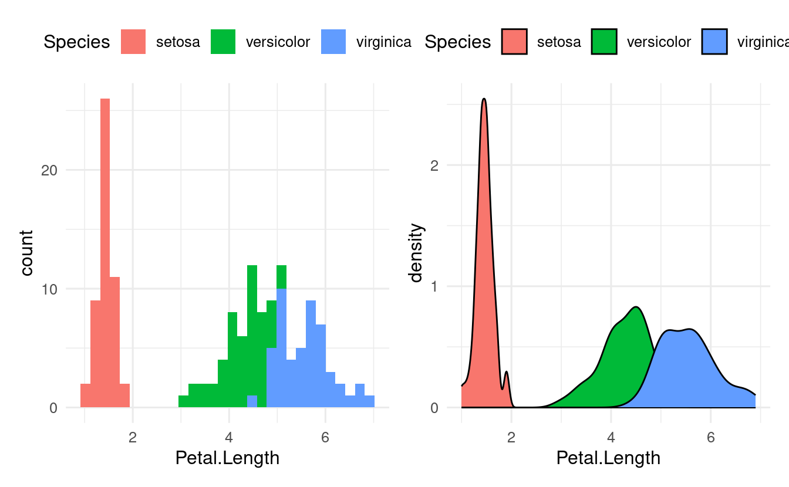

 

------------------------------------------------------------------------

## Introduction

### Session goals

-   Recap last week's material on aesthetic mappings and geom layers
-   Learn about the difference between local and global aesthetic mappings
-   See several additional aesthetic mappings (like `shape` and `fill`) and geoms (like `geom_boxplot` and `geom_violin`)
-   See an example of a geom from an "extension" package to make a ridgeway plot

### Setting up

The *ggplot2* package is one of the core *tidyverse* packages, so it's generally most convenient to load it along with the rest of the tidyverse:

<pre class='chroma'><code class='language-r' data-lang='r'># If you don't have the tidyverse installed, first do so as follows:
# install.packages("tidyverse")</code></pre>

<pre class='chroma'><code class='language-r' data-lang='r'><a href='https://rdrr.io/r/base/library.html'>library</a>(<a href='https://tidyverse.tidyverse.org'>tidyverse</a>)
#&gt; ── Attaching core tidyverse packages ──────────────────────── tidyverse 2.0.0 ──
#&gt; ✔ dplyr     1.1.0     ✔ readr     2.1.4
#&gt; ✔ forcats   1.0.0     ✔ stringr   1.5.0
#&gt; ✔ ggplot2   3.4.1     ✔ tibble    3.1.8
#&gt; ✔ lubridate 1.9.2     ✔ tidyr     1.3.0
#&gt; ✔ purrr     1.0.1     
#&gt; ── Conflicts ────────────────────────────────────────── tidyverse_conflicts() ──
#&gt; ✖ dplyr::filter() masks stats::filter()
#&gt; ✖ dplyr::lag()    masks stats::lag()
#&gt; ℹ Use the <a href='http://conflicted.r-lib.org/'>conflicted package</a> to force all conflicts to become errors</code></pre>

We'll talk about formatting plots to your heart's delight in Chapter 12, but one trick for now is **setting a different *ggplot* plotting "theme" for the entire R session:**

<pre class='chroma'><code class='language-r' data-lang='r'># - Overview of themes: https://ggplot2.tidyverse.org/reference/ggtheme.html
# - The default base_size is 11, setting to 13 will make any text larger
<a href='https://ggplot2.tidyverse.org/reference/theme_get.html'>theme_set</a>(<a href='https://ggplot2.tidyverse.org/reference/ggtheme.html'>theme_minimal</a>(base_size = 13))</code></pre>

 

------------------------------------------------------------------------

## 10.2 -- Aesthetic mappings

### Recap of last week

In last week's session, we worked with the built-in `iris` dataframe, which has flower measurements for 3 species of iris:

<pre class='chroma'><code class='language-r' data-lang='r'><a href='https://rdrr.io/r/utils/head.html'>head</a>(iris)
#&gt;   Sepal.Length Sepal.Width Petal.Length Petal.Width Species
#&gt; 1          5.1         3.5          1.4         0.2  setosa
#&gt; 2          4.9         3.0          1.4         0.2  setosa
#&gt; 3          4.7         3.2          1.3         0.2  setosa
#&gt; 4          4.6         3.1          1.5         0.2  setosa
#&gt; 5          5.0         3.6          1.4         0.2  setosa
#&gt; 6          5.4         3.9          1.7         0.4  setosa</code></pre>

We learned that we create ggplots by "mapping" variables (dataframe columns) to so-called "aesthetics" such as the `x`-axis, the `y`-axis, and `color`:

-   If we map the `iris` dataframe column `Petal.Length` to the `x`-axis aesthetic, then the values from that column will be plotted along the x-axis.

-   If we map the `iris` dataframe column `Species` to the `color` aesthetic, then observations are colored according to the values in the `Species` column, i.e. according to which species of iris they belong to.

<pre class='chroma'><code class='language-r' data-lang='r'># Recall: wrapping code inside "aes()" conveys that we are mapping aesthetics
<a href='https://ggplot2.tidyverse.org/reference/ggplot.html'>ggplot</a>(data = iris,
       mapping = <a href='https://ggplot2.tidyverse.org/reference/aes.html'>aes</a>(x = Petal.Length, y = Petal.Width, color = Species)) +
  <a href='https://ggplot2.tidyverse.org/reference/geom_point.html'>geom_point</a>()
</code></pre>

### Other aesthetics

Several other aesthetics exist, such as `fill` (like `color`, but then to *fill in* areas), point `shape` and `size`, line `linewidth` and `linetype`, and `alpha` (transparency).

Let's try `shape` instead of `color` to distinguish the iris species:

<pre class='chroma'><code class='language-r' data-lang='r'><a href='https://ggplot2.tidyverse.org/reference/ggplot.html'>ggplot</a>(data = iris,
       mapping = <a href='https://ggplot2.tidyverse.org/reference/aes.html'>aes</a>(x = Petal.Length, y = Petal.Width, shape = Species)) +
  <a href='https://ggplot2.tidyverse.org/reference/geom_point.html'>geom_point</a>()
</code></pre>

Or `size`:

<pre class='chroma'><code class='language-r' data-lang='r'><a href='https://ggplot2.tidyverse.org/reference/ggplot.html'>ggplot</a>(data = iris,
       mapping = <a href='https://ggplot2.tidyverse.org/reference/aes.html'>aes</a>(x = Petal.Length, y = Petal.Width, size = Species)) +
  <a href='https://ggplot2.tidyverse.org/reference/geom_point.html'>geom_point</a>()
#&gt; Warning: Using size for a discrete variable is not advised.</code></pre>

**Why would *ggplot* give us a warning here?** When *is* size a useful aesthetic?

### Visual properties

While `color` and the other "visual properties" mentioned above can be used as an aesthetic, they can also be set manually for all the data at once:

<pre class='chroma'><code class='language-r' data-lang='r'><a href='https://ggplot2.tidyverse.org/reference/ggplot.html'>ggplot</a>(data = iris,
       mapping = <a href='https://ggplot2.tidyverse.org/reference/aes.html'>aes</a>(x = Petal.Length, y = Petal.Width, shape = Species)) +
  <a href='https://ggplot2.tidyverse.org/reference/geom_point.html'>geom_point</a>(color = "blue")
</code></pre>

The key difference in the syntax of the code above is *not* that `color` is specified inside [`geom_point()`](https://ggplot2.tidyverse.org/reference/geom_point.html) rather than [`ggplot()`](https://ggplot2.tidyverse.org/reference/ggplot.html): as we'll see below, aesthetic mappings can be set in either location. Instead, it is that we are not specifying `color` inside an [`aes()`](https://ggplot2.tidyverse.org/reference/aes.html) function call.

 

------------------------------------------------------------------------

## 10.3 -- Geometric objects

Last week, we learned that ggplot geometric objects (i.e., "**geoms**") are essentially plot types, which are added to a plot with `geom_...()` functions.

And that different geoms can be layered on top of each other, such as when you want to show the raw data points ([`geom_point()`](https://ggplot2.tidyverse.org/reference/geom_point.html)) along with summaries of the data such as a trend line ([`geom_smooth()`](https://ggplot2.tidyverse.org/reference/geom_smooth.html)).

### Local vs global aesthetics

It's useful to understand the distinction between "global" and "local" aesthetics:

-   **Global aesthetics** apply to all geoms in the plot, and are added in the initial [`ggplot()`](https://ggplot2.tidyverse.org/reference/ggplot.html) call (or in a stand-alone [`aes()`](https://ggplot2.tidyverse.org/reference/aes.html) layer).

-   **Local aesthetics** apply only to the geom to which they are added.

For instance, if we globally map `Species` to `color`, this will apply to the [`geom_point()`](https://ggplot2.tidyverse.org/reference/geom_point.html) and [`geom_smooth()`](https://ggplot2.tidyverse.org/reference/geom_smooth.html) calls below it:

<pre class='chroma'><code class='language-r' data-lang='r'><a href='https://ggplot2.tidyverse.org/reference/ggplot.html'>ggplot</a>(data = iris,
       mapping = <a href='https://ggplot2.tidyverse.org/reference/aes.html'>aes</a>(x = Petal.Length, y = Petal.Width, color = Species)) +
  <a href='https://ggplot2.tidyverse.org/reference/geom_point.html'>geom_point</a>() +
  <a href='https://ggplot2.tidyverse.org/reference/geom_smooth.html'>geom_smooth</a>()
#&gt; `geom_smooth()` using method = 'loess' and formula = 'y ~ x'</code></pre>

(Note also that in case of [`geom_smooth()`](https://ggplot2.tidyverse.org/reference/geom_smooth.html), which summarizes the data using a statistical function, this summarizing is done entirely *separately* for each species!)

In contrast, when we define the `color` mapping *locally*, and *only* for [`geom_point()`](https://ggplot2.tidyverse.org/reference/geom_point.html), we get this:

<pre class='chroma'><code class='language-r' data-lang='r'><a href='https://ggplot2.tidyverse.org/reference/ggplot.html'>ggplot</a>(data = iris,
       mapping = <a href='https://ggplot2.tidyverse.org/reference/aes.html'>aes</a>(x = Petal.Length, y = Petal.Width)) +
  <a href='https://ggplot2.tidyverse.org/reference/geom_point.html'>geom_point</a>(mapping = <a href='https://ggplot2.tidyverse.org/reference/aes.html'>aes</a>(color = Species)) +
  <a href='https://ggplot2.tidyverse.org/reference/geom_smooth.html'>geom_smooth</a>()
#&gt; `geom_smooth()` using method = 'loess' and formula = 'y ~ x'</code></pre>

Now, we got a single line (and a single statistical fit) that ignores the `Species` identity of each flower.

### Many different geoms, same syntax

*ggplot* has dozens of different geoms -- for an overview, see [this cheatsheet](https://github.com/rstudio/cheatsheets/blob/main/data-visualization-2.1.pdf) that Jessica linked to last week or the ggplot [reference on geoms](https://ggplot2.tidyverse.org/reference/#geoms).

Let's see a couple more commonly used geoms. Last week we talked a bit about how a scatterplot does not always make it easy to compares the distributions of a variable among groups.

Useful plot types for showing and comparing distributions are histograms, density plots, box plots, and violin plots. Notice below that we use nearly identical code to make these different plots (in this case, to show the distribution of `Petal.Length` among iris species):

<pre class='chroma'><code class='language-r' data-lang='r'># Left
<a href='https://ggplot2.tidyverse.org/reference/ggplot.html'>ggplot</a>(data = iris,
       mapping = <a href='https://ggplot2.tidyverse.org/reference/aes.html'>aes</a>(x = Petal.Length, fill = Species)) +
  <a href='https://ggplot2.tidyverse.org/reference/geom_histogram.html'>geom_histogram</a>()
# Right
<a href='https://ggplot2.tidyverse.org/reference/ggplot.html'>ggplot</a>(data = iris,
       mapping = <a href='https://ggplot2.tidyverse.org/reference/aes.html'>aes</a>(x = Petal.Length, fill = Species)) +
  <a href='https://ggplot2.tidyverse.org/reference/geom_density.html'>geom_density</a>()</code></pre>

In the plots above, we only needed one axis (`x`), since the other axis consisted of counts/density computed by the plot itself. For box and violin plots, we do specify an x-axis when we want to show multiple groups:

<pre class='chroma'><code class='language-r' data-lang='r'># Left
<a href='https://ggplot2.tidyverse.org/reference/ggplot.html'>ggplot</a>(data = iris,
       mapping = <a href='https://ggplot2.tidyverse.org/reference/aes.html'>aes</a>(y = Petal.Length, x = Species, fill = Species)) +
  <a href='https://ggplot2.tidyverse.org/reference/geom_boxplot.html'>geom_boxplot</a>()
# Right:
<a href='https://ggplot2.tidyverse.org/reference/ggplot.html'>ggplot</a>(data = iris,
       mapping = <a href='https://ggplot2.tidyverse.org/reference/aes.html'>aes</a>(y = Petal.Length, x = Species, fill = Species)) +
  <a href='https://ggplot2.tidyverse.org/reference/geom_violin.html'>geom_violin</a>()</code></pre>

### Geoms from ggplot "extension" packages

There are also many [ggplot extension packages (see this link for an overview)](https://exts.ggplot2.tidyverse.org/gallery/). Some of these offer additional geoms, like the recently popular "ridgeline" plots from the *ggridges* package.

First, we'll have to install the package:

<pre class='chroma'><code class='language-r' data-lang='r'><a href='https://rdrr.io/r/utils/install.packages.html'>install.packages</a>("ggridges")</code></pre>

Then we can load it and use the ridgeplot geom [`geom_density_ridges()`](https://wilkelab.org/ggridges/reference/geom_density_ridges.html) just like any other geom:

<pre class='chroma'><code class='language-r' data-lang='r'><a href='https://rdrr.io/r/base/library.html'>library</a>(<a href='https://wilkelab.org/ggridges/'>ggridges</a>)

<a href='https://ggplot2.tidyverse.org/reference/ggplot.html'>ggplot</a>(data = iris,
       mapping = <a href='https://ggplot2.tidyverse.org/reference/aes.html'>aes</a>(x = Sepal.Length, y = Species, fill = Species)) +
  <a href='https://wilkelab.org/ggridges/reference/geom_density_ridges.html'>geom_density_ridges</a>()
#&gt; Picking joint bandwidth of 0.181</code></pre>

A plot like this can be improved a bit, for instance by making the density shapes semi-transparent. We'll do that in the exercises below.

 

------------------------------------------------------------------------

## Breakout Rooms

The following exercises use another built-in R dataframe, `mpg`, which has some statistics on cars.

<pre class='chroma'><code class='language-r' data-lang='r'><a href='https://rdrr.io/r/utils/head.html'>head</a>(mpg)
#&gt; # A tibble: 6 × 11
#&gt;   manufacturer model displ  year   cyl trans      drv     cty   hwy fl    class 
#&gt;   &lt;chr&gt;        &lt;chr&gt; &lt;dbl&gt; &lt;int&gt; &lt;int&gt; &lt;chr&gt;      &lt;chr&gt; &lt;int&gt; &lt;int&gt; &lt;chr&gt; &lt;chr&gt; 
#&gt; 1 audi         a4      1.8  1999     4 auto(l5)   f        18    29 p     compa…
#&gt; 2 audi         a4      1.8  1999     4 manual(m5) f        21    29 p     compa…
#&gt; 3 audi         a4      2    2008     4 manual(m6) f        20    31 p     compa…
#&gt; 4 audi         a4      2    2008     4 auto(av)   f        21    30 p     compa…
#&gt; 5 audi         a4      2.8  1999     6 auto(l5)   f        16    26 p     compa…
#&gt; 6 audi         a4      2.8  1999     6 manual(m5) f        18    26 p     compa…</code></pre>

You will be using the following columns:

-   `displ` is the engine size ("displacement")
-   `hwy` is gas mileage (miles per gallon) when driving on a highway
-   `drv` is the type of "drive train", where `f` = front-wheel drive, `r` = rear wheel drive, `4` = 4wd

### Exercise 1

Along the same lines as our last `iris` plot above, make a ridgeline plot of mileage (`hwy`) for cars with different drive trains (`drive`).

And like in our `iris` plot, also map the `fill` aesthetic to `drive`.

Solution (click here)

 

<pre class='chroma'><code class='language-r' data-lang='r'><a href='https://ggplot2.tidyverse.org/reference/ggplot.html'>ggplot</a>(data = mpg,
       mapping = <a href='https://ggplot2.tidyverse.org/reference/aes.html'>aes</a>(x = hwy, y = drv, fill = drv)) +
  <a href='https://wilkelab.org/ggridges/reference/geom_density_ridges.html'>geom_density_ridges</a>()
#&gt; Picking joint bandwidth of 1.28</code></pre>

 

### Exercise 2

Let's try to make the plot you made in Exercise 1 a bit nicer.

-   One issue is that the density shapes overlap. We can elegantly solve this by making them semi-transparent, which we can do by setting `alpha`, e.g. to 0.5 (you would do this in the same way you would e.g. *set* (not *map*!) the color).

Hints (click here)

 

To set alpha to 0.5, use `geom_density_ridges(alpha = 0.5)`.

 

Solution (click here)

 

<pre class='chroma'><code class='language-r' data-lang='r'><a href='https://ggplot2.tidyverse.org/reference/ggplot.html'>ggplot</a>(data = mpg,
       mapping = <a href='https://ggplot2.tidyverse.org/reference/aes.html'>aes</a>(x = hwy, y = drv, fill = drv)) +
  <a href='https://wilkelab.org/ggridges/reference/geom_density_ridges.html'>geom_density_ridges</a>(alpha = 0.5)
#&gt; Picking joint bandwidth of 1.28</code></pre>

 

-   What do you think would happen if you *also* map the `color` aesthetic to `drive`? Check if you're right by making the plot.

Solution (click here)

 

When we map the `color` aesthetic, the **lines** (as opposed to the *fills*) around the density shapes will get different colors:

<pre class='chroma'><code class='language-r' data-lang='r'><a href='https://ggplot2.tidyverse.org/reference/ggplot.html'>ggplot</a>(data = mpg,
       mapping = <a href='https://ggplot2.tidyverse.org/reference/aes.html'>aes</a>(x = hwy, y = drv, fill = drv, color = drv)) +
  <a href='https://wilkelab.org/ggridges/reference/geom_density_ridges.html'>geom_density_ridges</a>(alpha = 0.5)
#&gt; Picking joint bandwidth of 1.28</code></pre>

 

-   As soon as we use the `color` and/or `fill` aesthetics, a legend will pop up. Do we need a legend in this case? Make the legend disappear by adding `show.legend = FALSE` inside [`geom_density_ridges()`](https://wilkelab.org/ggridges/reference/geom_density_ridges.html).

Solution (click here)

 

We don't need a legend for `drv` here because we are already showing this information along the y-axis (for that matter, we don't need different colors, but it makes the plot prettier). We can turn off the legend as follows:

<pre class='chroma'><code class='language-r' data-lang='r'><a href='https://ggplot2.tidyverse.org/reference/ggplot.html'>ggplot</a>(data = mpg,
       mapping = <a href='https://ggplot2.tidyverse.org/reference/aes.html'>aes</a>(x = hwy, y = drv, fill = drv, color = drv)) +
  <a href='https://wilkelab.org/ggridges/reference/geom_density_ridges.html'>geom_density_ridges</a>(alpha = 0.5, show.legend = FALSE)
#&gt; Picking joint bandwidth of 1.28</code></pre>

 

### Exercise 3

-   Why does the following code not result in a plot with blue points? Does *ggplot*'s behavior here make sense to you, or would you have expected an error?

<pre class='chroma'><code class='language-r' data-lang='r'><a href='https://ggplot2.tidyverse.org/reference/ggplot.html'>ggplot</a>(data = mpg) + 
  <a href='https://ggplot2.tidyverse.org/reference/geom_point.html'>geom_point</a>(mapping = <a href='https://ggplot2.tidyverse.org/reference/aes.html'>aes</a>(x = displ, y = hwy, color = "blue"))</code></pre>

-   Can you correct the error to create a plot with blue points?

Solution (click here)

 

First, let's see the plot that the code produces:

<pre class='chroma'><code class='language-r' data-lang='r'><a href='https://ggplot2.tidyverse.org/reference/ggplot.html'>ggplot</a>(data = mpg) + 
  <a href='https://ggplot2.tidyverse.org/reference/geom_point.html'>geom_point</a>(mapping = <a href='https://ggplot2.tidyverse.org/reference/aes.html'>aes</a>(x = displ, y = hwy, color = "blue"))
</code></pre>

-   The error in the code is that `color = "blue"` was placed *inside* the [`aes()`](https://ggplot2.tidyverse.org/reference/aes.html) function. As such, `color` was interpreted as an aesthetic mapping, not as a visual property.

-   Here is the correct code and plot:

<pre class='chroma'><code class='language-r' data-lang='r'><a href='https://ggplot2.tidyverse.org/reference/ggplot.html'>ggplot</a>(data = mpg) + 
  <a href='https://ggplot2.tidyverse.org/reference/geom_point.html'>geom_point</a>(mapping = <a href='https://ggplot2.tidyverse.org/reference/aes.html'>aes</a>(x = displ, y = hwy),
             color = "blue")
</code></pre>

-   You might have been surprised that the initial code did not result in an error, since we normally map dataframe columns (like `displ` and `hwy` in this plot) to aesthetics, and `"blue"` is not a name of one of the columns in `mpg`.

    But, because `"blue"` was quoted, it was interpreted as a stand-alone *vector* instead. And in turn, because of R's automatic vector recycling, `"blue"` was repeated as many times as needed, under the hood, to map it to all observations in the plot.

 

### Bonus Exercise

What happens if you map an aesthetic to something other than a variable name, like `aes(color = displ < 5)`? Note, you'll also need to specify `x` and `y`.

Do you understand why this code produces the resulting plot?

Hints (click here)

 

-   You can for example plot the `mpg` data with `displ` along the x-axis and `hwy` along the y-axis.

-   To understand what is happening: what would `displ < 5` by itself return? (To directly test this, run `mpg$displ < 5`.)

 

Solution (click here)

 

In the resulting plot, the `color` aesthetic will be mapped to *whether or not the value of `displ` is below 5*:

<pre class='chroma'><code class='language-r' data-lang='r'><a href='https://ggplot2.tidyverse.org/reference/ggplot.html'>ggplot</a>(data = mpg) + 
  <a href='https://ggplot2.tidyverse.org/reference/geom_point.html'>geom_point</a>(mapping = <a href='https://ggplot2.tidyverse.org/reference/aes.html'>aes</a>(x = displ, y = hwy, color = displ &lt; 5))
</code></pre>

By itself, `displ < 5` within the ggplot functions will return in a logical vector: a vector with `TRUE` and `FALSE` for each corresponding `displ` value that tells us whether this value is smaller than 5 (=\> `TRUE`) or not (=\> `FALSE`). To see this in a stand-alone manner, we can run:

<pre class='chroma'><code class='language-r' data-lang='r'>mpg$displ &lt; 5
#&gt;   [1]  TRUE  TRUE  TRUE  TRUE  TRUE  TRUE  TRUE  TRUE  TRUE  TRUE  TRUE  TRUE
#&gt;  [13]  TRUE  TRUE  TRUE  TRUE  TRUE  TRUE FALSE FALSE FALSE FALSE FALSE FALSE
#&gt;  [25] FALSE FALSE FALSE FALSE FALSE FALSE FALSE FALSE  TRUE  TRUE  TRUE  TRUE
#&gt;  [37]  TRUE  TRUE  TRUE  TRUE  TRUE  TRUE  TRUE  TRUE  TRUE  TRUE  TRUE  TRUE
#&gt;  [49]  TRUE  TRUE  TRUE  TRUE  TRUE  TRUE  TRUE FALSE FALSE  TRUE  TRUE  TRUE
#&gt;  [61]  TRUE FALSE FALSE FALSE  TRUE  TRUE  TRUE  TRUE  TRUE  TRUE FALSE FALSE
#&gt;  [73] FALSE FALSE  TRUE FALSE FALSE  TRUE  TRUE  TRUE  TRUE  TRUE FALSE  TRUE
#&gt;  [85]  TRUE  TRUE  TRUE  TRUE FALSE FALSE  TRUE  TRUE  TRUE  TRUE  TRUE  TRUE
#&gt;  [97]  TRUE  TRUE FALSE  TRUE  TRUE  TRUE  TRUE  TRUE  TRUE  TRUE  TRUE  TRUE
#&gt; [109]  TRUE  TRUE  TRUE  TRUE  TRUE  TRUE  TRUE  TRUE  TRUE  TRUE  TRUE  TRUE
#&gt; [121]  TRUE  TRUE  TRUE  TRUE  TRUE  TRUE  TRUE  TRUE FALSE FALSE  TRUE  TRUE
#&gt; [133]  TRUE  TRUE FALSE FALSE FALSE  TRUE  TRUE  TRUE FALSE  TRUE  TRUE  TRUE
#&gt; [145]  TRUE  TRUE  TRUE  TRUE  TRUE  TRUE  TRUE  TRUE  TRUE FALSE  TRUE  TRUE
#&gt; [157]  TRUE  TRUE FALSE  TRUE  TRUE  TRUE  TRUE  TRUE  TRUE  TRUE  TRUE  TRUE
#&gt; [169]  TRUE  TRUE  TRUE  TRUE  TRUE  TRUE  TRUE  TRUE  TRUE  TRUE  TRUE  TRUE
#&gt; [181]  TRUE  TRUE  TRUE  TRUE  TRUE  TRUE  TRUE  TRUE  TRUE  TRUE  TRUE  TRUE
#&gt; [193]  TRUE  TRUE  TRUE  TRUE  TRUE  TRUE  TRUE FALSE  TRUE  TRUE  TRUE  TRUE
#&gt; [205]  TRUE  TRUE  TRUE  TRUE  TRUE  TRUE  TRUE  TRUE  TRUE  TRUE  TRUE  TRUE
#&gt; [217]  TRUE  TRUE  TRUE  TRUE  TRUE  TRUE  TRUE  TRUE  TRUE  TRUE  TRUE  TRUE
#&gt; [229]  TRUE  TRUE  TRUE  TRUE  TRUE  TRUE</code></pre>

Next, *ggplot* is able to map this vector to the color aesthetic in the plot, just like it maps dataframe columns to an aesthetic (after all, dataframe columns are just vectors, too).

   

